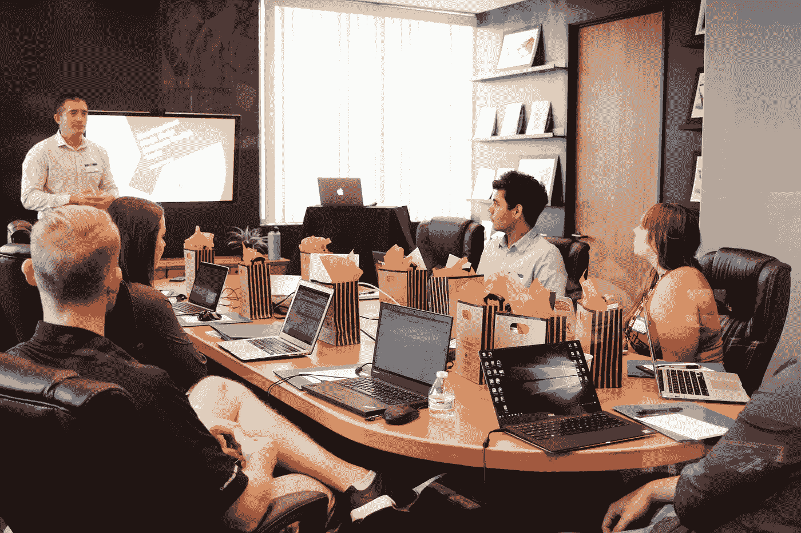

# 从教授 SQL 给非技术团队的经验中得到的教训

> 原文：[`towardsdatascience.com/lessons-from-teaching-sql-to-non-technical-teams-7bd8fc9f8289?source=collection_archive---------2-----------------------#2024-03-08`](https://towardsdatascience.com/lessons-from-teaching-sql-to-non-technical-teams-7bd8fc9f8289?source=collection_archive---------2-----------------------#2024-03-08)

## 从规模化方法到更量身定制的方法——以及我为什么认为远程辅导是未来趋势

 [Jordan Gomes](https://medium.com/@jordangom?source=post_page---byline--7bd8fc9f8289--------------------------------)

·发表于 [Towards Data Science](https://towardsdatascience.com/?source=post_page---byline--7bd8fc9f8289--------------------------------) ·11 分钟阅读·2024 年 3 月 8 日

--

在我的职业生涯中，我曾多次参与并举办内部 SQL 培训。虽然这些培训从未是我工作的优先事项之一，但它们却是让我最有满足感的项目之一。当你看到有人开始轻松地运行查询，能够自己找到所需的信息，构建仪表板，甚至更广泛地说，开始对这项新学会的技能感到兴奋时；我不知道——那种感觉真好。

最近，我看到我的一位前“学生”的名字出现在一个共享小组里，提了一个相当复杂的 SQL 问题——我的反应和 Alfred 在《黑暗骑士崛起》里对 Bruce Wayne 点头时的反应一样（如果你不明白这个梗——[这里有](https://www.youtube.com/watch?v=gxUoCMUHoRM)）。

本文的目标是带你走一遍我举办内部 SQL 培训的历程以及我的收获，培训的对象是整个非技术（或至少不擅长 SQL）的团队，希望你也能在你的组织中分享这些知识，并获得与我相同的喜悦。

图片来源：[Campaign Creators](https://unsplash.com/@campaign_creators?utm_source=medium&utm_medium=referral) via [Unsplash](https://unsplash.com/?utm_source=medium&utm_medium=referral)

# 我最初举办这些培训的原因

一般来说，推动我举办这些培训的情况可以分为两个大类：

1.  **技能提升需求：** 有时组织中的人因为缺乏 SQL 技能而达到了瓶颈。一个典型的症状是出现复杂的流程，涉及使用多个工具和电子表格来生成一个最终报告。虽然解决方案并不总是在 SQL 方面，但根据经验，如果你有一个耗时的多阶段流程，而你内心深处觉得一定有更好的方法来做你正在做的事情——很可能确实存在。

1.  **资源匮乏：** 在资源匮乏的组织中，我发现识别具有“相关技能”的个人（即习惯于使用电子表格和数据的人）并提供技能提升机会，对组织和个人都非常有益。这样一来，不仅可以拓宽个人的视野，还能为企业创造更多的价值。

虽然你可能有许多理由去举办这样的培训（上面列出的清单并不详尽；也可以提出这个目标并不一定是互斥的），但明确你想要实现的目标是很重要的。根据你的目标，你执行培训的方式可能会有很大的不同。

# 早期的尝试，或者说我如何发现“千人一面”式培训的局限性

在我早期的尝试中（大约是 2015 年… 哎呀，时间过得真快！）我尝试了规模化的方法。通常的格式是典型的课堂形式：一个 X 周的项目，每周有 1 小时的课程（总是在同一时间、同一天），对任何有兴趣学习 SQL 的人开放，完全专注于 SQL：

+   每周，小组成员都会学到新的内容，从 SQL 的“Hello World”（SELECT * FROM TABLE LIMIT 1）到如何使用多个 CTE 进行窗口函数并优化查询。

+   每堂课之间，小组成员需要做某种家庭作业（即一些练习，以测试并巩固他们在课堂上学到的知识）

尽管有些人坚持到最后，但成功率（成功定义为有人在培训后仍继续使用新学的 SQL 技能）极低。每一节课，来的人越来越少。只有少数人在课外做提议的练习。从事实来看，这并不算成功。

但我从中得到了很多宝贵的经验：

+   **我喜欢指导别人：** 这让我体验到辅导和教授新技能给他人带来的乐趣，最终也为我创办这个博客和参与其他让我觉得有价值的活动铺平了道路。

+   **SQL 被认为“过于技术化”**：许多人没有参加那些免费的培训，或者在遇到第一个障碍时就放弃了，仅仅因为他们认为 SQL 是为技术人员准备的，而他们自己并不认为自己是技术型人才。

+   **没有“保持”机制的培训注定会失败**：这让我意识到建立一种保持学员的系统有多么重要。依赖学员的自律来完成这种培训是空想——在任何一个组织中，都有太多互相竞争的优先事项和原因，导致无法完成学习。因此，你要么需要找到那些对培训有强烈内在动机的学生（例如，你有一个明确的 SQL 学习目标），要么需要提供强大的外在动机（例如，他们的经理要求他们学习 SQL，以承担一些更具技术性的项目）。

+   **教授 SQL 只是其中的一部分**：最后，也是更重要的一点——这让我意识到，不能只教 SQL。没有人是在真空中使用 SQL 的。SQL 的现实情况是：

1.  在编写 SQL 代码之前，你需要在组织中找到正确的数据集（这在成熟的组织中可能很容易，但在不太成熟的组织中可能很复杂，甚至根本不存在）。

1.  一旦你找到了数据集，你需要找到正确的字段进行查询，并确保这些字段包含你所需要的信息（这本身就是一门艺术）

1.  从那里，你需要请求访问数据集，一旦获得访问权限，你需要在一个特定工具中编写 SQL 代码，该工具有特定的指南和功能。

1.  在编写查询时，你需要关注计算成本，可能还需要在运行查询之前重新组织内容。

1.  依此类推。如果你不教授这些元素，学生将很难使用 SQL。

所有这些学习为我程序的改进版铺平了道路——一种更具个性化的方式。

# 最近——向更个性化的方法转变

在经过几次改进后的迭代后，我反思了自己一路上的所有收获，并尝试了一种新方法：我放弃了规模，完全转向了相反的方向。与其每周进行 1 小时的全班授课，我开始每周与几位选定的个体进行简短的 1 对 1 会谈。

尽管该项目仍然向所有人开放，但现在有了一个选择过程。想要加入的人必须展示以下内容：

+   **清晰的学习 SQL 需求**：未来的学生需要填写一份表格，解释他们为何想学习 SQL，并描述一个需要 SQL 的项目（例如：“我想自动化 X 报告，我想在 Y 上构建一个仪表板”）。如果他们被选中，这个项目将是他们在整个项目期间所做的工作。

+   **预先存在的相关技能**：未来的学生需要展示我所称之为“相关技能”，即与 SQL 或数据分析所需技能相似的技能。

+   **能够（并愿意）在他们的日程安排中挤出足够的时间**：作为他们申请该项目的一部分——学生必须与他们的经理验证他们的“学习”项目，并愿意在接下来的 X 周内将至少 X0%的时间投入到学习中。X0%可能看起来很多——但实际上它并不完全关于 X0%，而是传达了一个信息（[插入小丑表情包](https://www.youtube.com/watch?v=3OyrX11cMkE)）。这个项目将非常耗时，潜在的学生需要确保他们能够挤出成功所需的时间。

在培训本身——重点从 SQL 转移到做项目。培训的第一节课花费在将他们的项目拆分为里程碑上。第一个里程碑对每个人来说都差不多：找到一个资源（免费的或付费的，在线的或离线的——他们喜欢哪种都可以）来学习 SQL 的基础知识——并完成它。

我想承认这可能有些令人失望——你可能会期望一篇关于“教 SQL”的文章不会在“学习 SQL”部分这么干巴巴。我的普遍看法是，你可以在很短的时间内掌握 SQL 的关键概念，但要真正精通它需要几个月甚至几年，而你越早将它应用到实际问题中，就能越快达到扎实的水平。因此，程序的大部分时间花费在将其应用到现实问题上，而不是在获取 SQL 的基础知识（这些知识你可以通过互联网这一神奇的工具轻松获得）。

一旦上述第一步完成，我们就开始朝下一个里程碑努力。例如，对于那些想要构建仪表板的人——我们会将项目拆分为：

1.  学习 SQL 的基础知识

1.  寻找合适的数据集和查询逻辑（学习如何获取这些信息）

1.  如有必要，构建一个数据库（与构建数据库相关的角色和责任）

1.  将这个数据库连接到仪表板工具

1.  设计仪表板

1.  构建仪表板

从那时起，每个学生每周应该达到一个不同的里程碑。如果他们卡在某个地方，他们可以随时联系我，发送电子邮件或参加每周的办公时间，但一般来说，他们必须独立完成这些里程碑。

通过这个系统，我看到了相当高的成功率（成功的定义是某人在培训后继续使用他们新获得的 SQL 技能）。回顾这一点——我认为有几个原因：

+   **选择过程增加了摩擦**：增加的选择过程确保只有最有动力的、拥有实际项目的人才能参与培训。

+   **里程碑系统是一个很好的强制性因素：** 拥有目标是一个很好的开始，但如果没有考虑达成目标所需的步骤，更广泛地说，也没有考虑实现目标所需的工作，那么几乎不可能实现目标。拥有一个里程碑系统，设定明确的交付物和明确的截止日期，创造了一个责任感和反馈循环，这大大帮助学生成长。

+   **从一开始就设定正确的期望使一切变得更简单：** 我相信，任何事情的成功很大一部分与心态和我们对工作的看法有关。从这个项目一开始，我就尽力设定正确的期望：(1) 这将是一个时间密集的过程 (2) 这将是一个充满挑战的过程 (3) 这将是一个漫长的过程

+   (4) 但我们会花时间，我们会一个一个地克服挑战，最终我们将会取得胜利

+   **教人们如何自学 SQL 与实际教授 SQL：** 最后但同样重要的是——这一关键变化对项目产生了巨大影响。它让学员们熟悉了如何在网上寻找所需的关键信息，进行实验，并在过程中学习。这使他们变得更加独立，即使在项目结束后，也能继续成长。

到目前为止，上述方法是我实施过的最成功的之一。但它非常耗时，我仍然看到很多可以改进的地方。

# 朝着更加混合的方式前进

现在，主要的问题是：我们如何扩大上述项目的规模？如果我回顾我在这次培训中所扮演的角色，那主要是给出方向并让人们保持诚实：

+   **一开始：** 我帮助学生们构建他们的项目并将其分解成多个里程碑

+   **在每个里程碑之前：** 我会给他们一些关于如何应对每个障碍的最佳建议。如果他们卡住了，我会给他们提供解决问题的方向。

+   **在整个项目过程中：** 我庆祝他们的成功，挑战他们，试图在他们遇到困难时保持他们的动力，但也让他们对按设定的时间表交付预定成果保持责任感。

我认为上述内容不能自动化——或者现在也许可以借助大型语言模型（LLMs），谁知道呢——但无论如何，你绝对可以标准化并优化它，也许可以以异步方式做很多工作，而不需要每周开会。这也是我希望在下一个迭代中尝试的——减少我在每个学生身上花费的时间，以便我能培养更多的学员。

*作者注：我看到越来越多的健身影响者提供“远程辅导”，你可以通过电子邮件与教练沟通，发送你的训练视频，获得个性化的计划。也许可以做类似的数据分析辅导？*

关于这个项目本身，我很希望能融入一些“社区”元素。特别是，我坚信[费曼技巧](https://fs.blog/feynman-technique/)——它是关于（以一种非常简化的方式）教授你所学到的东西。具体来说，我希望学生们开始记录他们的学习内容，并开始将其分享给新学生（有点像电影《[善意的谎言](https://www.imdb.com/title/tt0223897/)》中的情节）。我在这里看到几个好处：

+   它可以帮助扩展这个项目（可以把它看作一种“培训培训师”的方法），并让更多的人从知识中受益。

+   这将帮助现在是教师的“学生”内化他们学到的关键概念，并识别他们理解中的空白。

+   它将启动一个庞大的知识库，之后可以用于为那些非常有动力、但可能无法参与项目的个人提供更多自助式的学习方式。

一如既往，想法很便宜——执行才是你了解什么有效、什么无效的地方——我将很快尝试进行实验，并可能在未来的文章中报告结果。

# 总结

在过去的 8 年里，我尝试了不同的项目，目的是把同事和下属培养成 SQL 专家。我并不总是成功，但几年前我从一个广泛的项目转向更加量身定制的指导方式，取得了很大的成功，并学到了很多宝贵的经验。

我现在面临的真正挑战是方法的放大效应。我们如何简化并去除所有的废话，专注于为选定的个体创造尽可能多的价值，让他们有能力将自己在组织中产生的影响力扩大十倍？也许健身影响者已经有所发现……

# 希望你喜欢阅读这篇文章！你有什么想分享的建议吗？在评论区让大家知道吧！

**如果你想阅读更多我的文章，这里有几篇你可能喜欢的其他文章**：

 ## 如何构建成功的仪表盘

### 来自一个曾经构建过一些不成功仪表盘的人的清单

towardsdatascience.com  ## 建设分析成熟的组织（AMO）

### 一些简单的框架，用来确定你所在组织的分析需求，以及如何让它变得更加成熟……

towardsdatascience.com  ## 区分优秀数据分析师的因素

### 还在寻找新一年的决心吗？这里有 6 个技能可以帮助你和你的团队变得极其高效。

towardsdatascience.com

*PS: 这篇文章也发布在* [*Analytics Explained*](https://analyticsexplained.substack.com/)*，这是一个我总结在不同分析角色中学到的知识（从新加坡初创企业到旧金山的大型科技公司），并回答读者关于分析、增长和职业的问题的通讯。*
