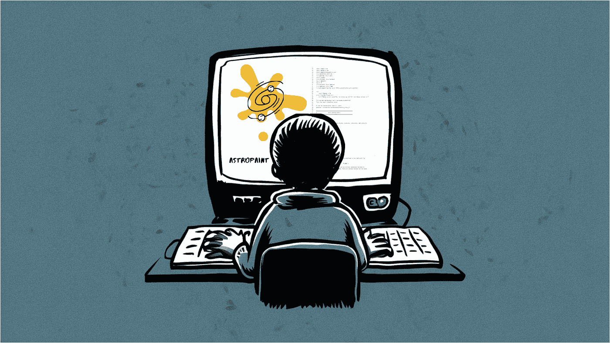

# 从开发开源软件中学到的经验

> 原文：[`towardsdatascience.com/lessons-learned-from-developing-an-open-source-software-9760eb18d1b2?source=collection_archive---------1-----------------------#2024-09-13`](https://towardsdatascience.com/lessons-learned-from-developing-an-open-source-software-9760eb18d1b2?source=collection_archive---------1-----------------------#2024-09-13)

图片来自 Ideogram，由作者修改

## 以及它们给我作为数据科学家和机器学习工程师带来的意外优势

 [Siavash Yasini](https://medium.com/@siavashyasini?source=post_page---byline--9760eb18d1b2--------------------------------)

·发布于[Towards Data Science](https://towardsdatascience.com/?source=post_page---byline--9760eb18d1b2--------------------------------) ·17 分钟阅读·2024 年 9 月 13 日

--

# 介绍

开源在过去几十年中从根本上改变了软件开发的格局，尤其是在近年来，Python 无疑在所有编程语言中占据了主导地位（我相信某篇论文中有科学数学证明这一点）。作为一门极其易学的语言，Python 以其“[开箱即用](https://docs.python.org/3/tutorial/stdlib.html#batteries-included)”的理念，带来了大量在数据领域中具有里程碑意义的开源软件包，涵盖了从科学计算和模拟，到数值分析和机器学习，再到如今的人工智能和聊天机器人开发等众多领域。

在我早期做博士研究生时，Python 并不像今天这样流行。我所在领域的大部分软件包和科研代码是用一种名为[互动数据语言（IDL）](https://en.wikipedia.org/wiki/IDL_(programming_language))的语言编写的。你可能会惊讶地发现，**这门语言并不是免费的** —— 我们必须为此支付许可证费用。是的，你没看错，**我们必须为编程付费**！

这段经历让我真正意识到 Python 不仅仅是一门编程语言，它还是一个平台，任何人都可以在这里贡献并创造出惊人的成果……
