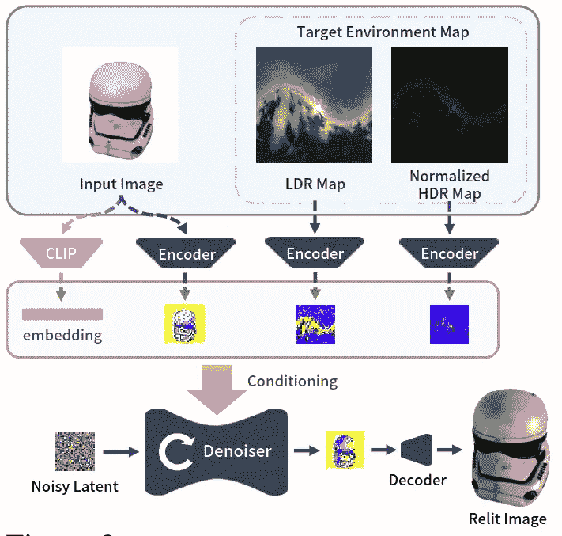
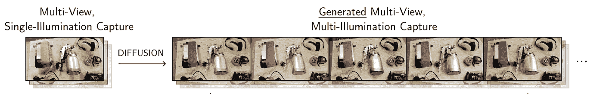

# 让光明降临！扩散模型与重光照的未来

> 原文：[`towardsdatascience.com/let-there-be-light-diffusion-models-and-the-future-of-relighting-03af12b8e86c?source=collection_archive---------3-----------------------#2024-11-04`](https://towardsdatascience.com/let-there-be-light-diffusion-models-and-the-future-of-relighting-03af12b8e86c?source=collection_archive---------3-----------------------#2024-11-04)

## 了解最前沿的扩散模型如何在这篇关于场景编辑的深度博客中处理重光照、协调和阴影去除

 [Pulkit Gera](https://medium.com/@darth_gera?source=post_page---byline--03af12b8e86c--------------------------------)

·发布于 [Towards Data Science](https://towardsdatascience.com/?source=post_page---byline--03af12b8e86c--------------------------------) ·阅读时间 15 分钟·2024 年 11 月 4 日

--

由 [Brian Aitkenhead](https://unsplash.com/@brianaitk0001?utm_source=medium&utm_medium=referral) 拍摄，图片来源于 [Unsplash](https://unsplash.com/?utm_source=medium&utm_medium=referral)

重光照是指在给定输入场景的情况下，在指定的目标光照条件下渲染场景的任务。这是计算机视觉和图形学中的一项重要任务。然而，它是一个病态问题，因为场景中物体的外观是由光源、几何形状和表面材质属性等因素之间复杂的相互作用所决定的。这些相互作用会产生歧义。例如，给定一张场景的照片，物体上的暗斑是由光照投射的阴影造成的，还是材质本身就是暗色的？区分这些因素是有效重光照的关键。

在这篇博客文章中，我们讨论了不同的论文如何通过扩散模型解决重光照问题。重光照涉及多个子问题，包括简单的光照调整、图像协调、阴影去除和内在分解。这些领域对于优化场景编辑至关重要，例如平衡合成图像中的颜色和阴影，或解耦材质与光照属性。我们将首先介绍重光照问题，并简要讨论扩散模型和控制网（ControlNets）。然后，我们将讨论在不同类型的场景中解决重光照问题的不同方法，从单一物体到肖像再到大规模场景。

# 解决重光照问题

目标是将场景分解为其基本组成部分，如几何形状、材质和光照交互，并对它们进行参数化建模。求解完成后，我们就可以根据自己的偏好进行修改。场景中一个点的外观可以通过渲染方程来描述，如下所示：

渲染方程来自[source](https://twitter.com/levork/status/609603797258600448)

大多数方法旨在求解渲染方程的每个单独组成部分。一旦求解完成，我们就可以进行重新照明和材质编辑。由于照明项 L 出现在方程的两边，这个方程无法通过解析方法求解，只能通过蒙特卡罗方法或基于近似的方法来求解。

另一种方法是数据驱动学习，在这种方法中，模型不显式地建模场景的属性，而是直接从数据中学习。例如，网络可以直接从数据中学习表面材质属性，而不是拟合一个参数化函数。数据驱动的方法已被证明比参数化方法更强大。然而，这些方法需要大量高质量的数据，特别是在照明和材质估计任务中，收集这些数据是非常困难的。

用于照明和材质估计的数据集非常稀缺，因为这些数据集需要昂贵且复杂的设备设置，如光照舞台，用以捕捉详细的光照交互。这些设置仅对少数组织可用，从而限制了用于训练和评估的数据的获取。目前没有公开的全身光照舞台真实数据集，这进一步凸显了这一挑战。

# 扩散模型

随着大量图像和视频数据在线可用，计算机视觉经历了重大变革。这推动了基础模型的发展，这些模型作为强大的通用模型，可以针对广泛的具体任务进行微调。扩散模型通过从独立样本中学习建模潜在的数据分布，逐渐逆转添加噪声的过程，从而生成真实的数据。通过利用其从学习到的分布中生成高质量样本的能力，扩散模型已成为解决各种生成任务的关键工具。

潜在扩散模型来自[source](https://arxiv.org/abs/2112.10752)

其中最突出的例子之一是[Stable Diffusion](https://github.com/CompVis/stable-diffusion)(SD)，它在大规模的 LAION-5B 数据集上进行了训练，该数据集包含 50 亿对图像和文本。它已经编码了大量关于视觉概念的通用知识，使其适合于针对特定任务的微调。它在训练过程中学习了诸如椅子有四条腿或识别汽车结构等基本关系和联想。这种内在的理解使 Stable Diffusion 能够生成高度连贯且逼真的图像，并可用于微调以预测其他模态。基于这一思想，问题出现了：我们能否利用预训练的 SD 来解决场景重光的问题？

那么我们如何微调 LDMs？一种简单的方法是对 LDMs 进行迁移学习。这种方法是冻结早期层（捕捉一般特征），并在特定任务上微调模型。虽然一些论文如[Alchemist](https://arxiv.org/abs/2312.02970)（用于材质迁移）已使用过这种方法，但它需要大量配对数据才能使模型很好地泛化。这个方法的另一个缺点是灾难性遗忘的风险，即模型会丧失在预训练过程中获得的知识。这将限制其在不同条件下的泛化能力。

来自[来源](https://arxiv.org/abs/2302.05543)的 ControlNet 图示

微调这些大模型的另一种方法是引入 ControlNet。在这种方法中，首先创建一个网络副本，并冻结原始网络的权重。在训练过程中，仅更新副本网络的权重，并将条件信号作为输入传递给副本网络。原始网络继续利用其预训练的知识。

尽管这增加了内存占用，但优势在于我们不会失去从大规模数据集训练中获得的泛化能力。它确保模型在学习当前任务所需的任务特定关系的同时，仍保持生成高质量输出的能力，适用于各种提示。

此外，它有助于模型学习控制输入与期望输出之间的稳健且有意义的关联。通过将控制网络与核心模型解耦，它避免了过拟合或灾难性遗忘的风险。同时，它所需的配对数据量显著减少。

虽然也有其他用于微调基础模型的技术——例如 LoRA（低秩适配）等——但我们将重点讨论两种方法：传统的迁移学习和 ControlNet。这些方法对于理解各种论文如何使用扩散模型处理基于图像的重光问题尤其重要。

# DiLightNet

[DiLightNet:基于扩散的图像生成的细粒度光照控制](https://arxiv.org/pdf/2409.13690)

**介绍**

本文提出了对输入图像重光照的细粒度控制。输入图像可以是生成的图像，也可以是作为输入给定的图像。进一步地，它还可以根据文本提示改变物体的材质。目标是对光照效果进行细粒度的控制。

**方法**

方法图来自于[source](https://arxiv.org/pdf/2409.13690)

给定一个输入图像，应用以下预处理步骤：

1.  使用现成的 SOTA 模型估计背景和深度图。

1.  通过三角剖分深度图提取网格

1.  生成 4 种不同的辐射线索图像。辐射线索图像是通过为提取的网格分配不同的材质，并在目标光照下渲染它们来创建的。这些辐射线索图像作为编码光照效果（如高光、阴影和全局光照）的基础。

ControlNet 的输入来自于[source](https://arxiv.org/pdf/2409.13690)

一旦这些图像生成，它们将训练一个 ControlNet 模块。输入图像和掩膜会通过一个编码解码网络，该网络输出一个 12 通道的特征图。然后将该特征图与辐射线索图像按通道进行拼接。因此，在训练过程中，带噪的目标图像会以这个自定义的 12 通道图像作为条件信号进行去噪。

此外，提供了一个外观种子，以确保在不同的光照条件下保持一致的外观。如果没有它，网络会呈现出不同的光物质相互作用的解读。此外，可以通过文本提供更多线索来改变外观，例如添加“塑料/光亮金属”来改变生成图像的材质。

**实现**

数据集使用来自 Objaverse 的 25K 个合成物体进行策划。每个物体从 4 个独特视角进行渲染，并在 12 种不同的光照条件下进行渲染，这些条件包括点光源、多个点光源、环境光图和区域光。为了训练，辐射线索图像是在 Blender 中渲染的。

ControlNet 模块使用稳定扩散 v2.1 作为基础预训练模型进行微调。训练大约用了 30 小时，使用了 8 块 NVIDIA V100 GPU。训练数据是在 Blender 中以 512x512 分辨率渲染的。

**结果**

DiLightNet 的结果来自于[source](https://arxiv.org/pdf/2409.13690)

该图展示了作为参考的临时图像和物体在重新光照下的目标光照。

DiLightNet 的结果来自于[source](https://arxiv.org/pdf/2409.13690)

该图展示了如何使用文本提示来改变物体的材质。

DiLightNet 的结果来自于[source](https://arxiv.org/pdf/2409.13690)

该图展示了 AI 生成的临时图像的更多结果，这些图像随后在不同的输入环境光照条件下进行了渲染。

DiLightNet 结果来自于[source](https://arxiv.org/pdf/2409.13690)

该图展示了当外观种子未固定时，网络为解决光照交互问题所提出的不同解决方案。

**局限性**

由于在合成物体上进行训练，该方法在处理真实图像时效果不佳，而在 AI 生成的临时图像上表现更好。此外，材料的光照交互可能无法完全按照提示的意图进行。由于它依赖于深度图生成辐射线索，因此可能无法获得令人满意的结果。最后，生成旋转光源的视频可能无法产生一致的结果。

# 神经光照

[神经光照：通过扩散重新照明任何物体](https://arxiv.org/pdf/2406.07520)

**介绍**

本文提出了一种端到端的 2D 光照扩散模型。该模型从具有物理基础材料和 HDR 环境图的合成数据集中学习物理先验。它还可以用于重新照亮多个视角，并用于创建场景的 3D 表示。

**方法**

神经光照方法图来自于[source](https://arxiv.org/pdf/2406.07520)

给定一张图像和一个目标 HDR 环境图，目标是学习一个能够合成重新照明版本的图像的模型，这里是一个单一的物体。这是通过采用预训练的[Zero-1-to-3](https://arxiv.org/abs/2303.11328)模型实现的。Zero-1-to-3 是一个扩散模型，它以视角方向为条件来渲染输入图像的新视图。他们丢弃了新视图合成的部分。为了结合光照条件，他们将输入图像和环境图的编码与去噪潜在变量拼接在一起。

输入的 HDR 环境图 E 被拆分为两个组件：E_l，一个色调映射的 LDR 表示，用于捕捉低强度区域的光照细节，以及 E_h，一个对数归一化的图，用于保留跨整个光谱的信息。这两者共同为网络提供了一个平衡的能量谱表示，确保在重新照明时不会因过高的亮度而导致生成的输出看起来被冲淡。

此外，输入图像的 CLIP 嵌入也作为输入传递。因此，模型的输入包括输入图像、LDR 图像、标准化的 HDR 图像和图像的 CLIP 嵌入，这些都为去噪网络提供条件。该网络随后作为先验用于进一步的 3D 物体重新照明。

**实现**

该模型在一个自定义的 Relit Objaverse 数据集上进行训练，该数据集包含 90K 个物体。对于每个物体，提供了 204 张在不同光照条件和视角下渲染的图像。总的来说，数据集包含了 1840 万张分辨率为 512x512 的图像。

该模型是从 Zero-1-to-3 的检查点进行微调的，且仅微调了去噪网络。输入环境图被下采样至 256x256 分辨率。该模型在 8 个 A6000 GPU 上训练了 5 天。进一步的下游任务，如基于文本的重光照和物体插入也可以实现。

**结果**

他们展示了与不同背景的对比，以及与其他工作如 DilightNet 和[IC-Light](https://github.com/lllyasviel/IC-Light)的对比。

Neural Gaffer 的结果来源于[source](https://arxiv.org/pdf/2406.07520)

该图展示了他们的方法与另一种基于 ControlNet 的方法 IC-Light 的重光照结果对比。他们的方法能够与旋转的环境图一致地产生光照和颜色。

Neural Gaffer 的结果来源于[source](https://arxiv.org/pdf/2406.07520)

该图展示了他们的方法与另一种基于 ControlNet 的方法 DiLightnet 的重光照结果对比。他们的方法能够产生镜面高光和准确的颜色。

**局限性**

一个主要的局限性是它只生成低分辨率的图像（256x256）。此外，它仅适用于物体，并且在人物重光照方面表现较差。

# 重光照协调

[Relightful Harmonization: Lighting-aware Portrait Background Replacement](https://arxiv.org/pdf/2312.06886)

**简介**

图像协调是将前景主体的颜色和光照特征与背景对齐的过程，使其成为一个合理的合成。该研究提出了一种基于扩散的方法来解决这一任务。

**方法**

方法图来自[source](https://arxiv.org/pdf/2312.06886)

给定一个输入合成图像、alpha 掩码和目标背景，目标是预测一张重光照的人物图像。通过训练一个 ControlNet 来预测协调后的图像输出，从而实现这一目标。

在第一阶段，我们训练了一个背景控制网络模型，该模型以合成图像和目标背景为输入，输出重光照的人物图像。在训练过程中，去噪网络将嘈杂的目标图像与合成图像拼接在一起，并预测噪声。背景作为条件通过控制网络提供。由于背景图像本身是 LDR，它们没有提供足够的信号用于重光照。

在第二阶段，训练了一个环境映射控制网络模型。HDR 环境映射提供了更多的信号用于重光照，这带来了更好的效果。然而在测试时，用户仅提供 LDR 背景。因此，为了弥合这一差距，两个控制网络模型彼此对齐。

最后，使用环境图控制网络模型生成更多数据，然后微调背景控制网络模型，以生成更具照片真实感的结果。

**实现**

用于训练的数据集包含 40 万对图像样本，这些样本是通过 100 个光阶段（lightstage）精心策划的。在第三阶段，生成了额外的 20 万个合成样本，用于光线真实感的微调。

该模型是从 InstructPix2Pix 检查点进行微调的，模型在 8 个 A100 GPU 上进行训练，分辨率为 512x512。

**结果**

Relightful Harmonization 的结果来自于 [source](https://arxiv.org/pdf/2312.06886)

该图展示了该方法如何中和输入图像中显著的阴影，这些阴影通常很难去除。左侧为输入图像，右侧为重新光照后的图像。

Relightful Harmonization 的结果来自于 [source](https://arxiv.org/pdf/2312.06886)

Relightful Harmonization 的结果来自于 [source](https://arxiv.org/pdf/2312.06886)

图示展示了在真实世界测试对象上的结果。与其他方法相比，他们的方法能够去除阴影，并使得合成更加可信。

**局限性**

尽管该方法能够可信地重光照目标，但在保持身份一致性方面表现不佳，尤其在保持衣物或头发的颜色方面有困难。此外，它可能在去除阴影方面存在问题。同时，它没有估计反射率（albedo），而反射率对于复杂的光照交互至关重要。

# 多光照合成

[基于扩散方法的辐射场重光照与多光照合成](https://repo-sam.inria.fr/fungraph/generative-radiance-field-relighting/content/paper.pdf)

**介绍**

本研究提出了一种 2D 重光照扩散模型，该模型进一步用于重光照场景的辐射场。首先训练一个 ControlNet 模型，预测场景在新光照方向下的表现。然后，使用该模型生成更多数据，最终用于拟合一个可重光照的辐射场。在本节中，我们讨论了 2D 重光照模型。

**方法**

给定一组图像 X_i 和对应的深度图 D（通过现成方法计算得到），以及光照方向 l_i，目标是预测场景在光照方向 l_j 下的表现。在训练过程中，去噪网络的输入是随机光照下的 X_i 图像，深度图 D 与含噪的目标图像 X_j 拼接在一起。光照方向通过 4 阶 SH 编码，并通过 ControlNet 模型进行条件化。

方法图来自于 [source](https://repo-sam.inria.fr/fungraph/generative-radiance-field-relighting/content/paper.pdf)

尽管这产生了相当不错的结果，但也存在一些显著的问题。它无法保持颜色，导致对比度丧失。此外，它还会产生扭曲的边缘。为了解决这个问题，他们通过将预测图像与输入图像进行颜色匹配来弥补颜色差异。这是通过将图像转换为 LAB 空间并进行通道归一化来完成的。然后计算真实值和去噪输出之间的损失。为了保持边缘，解码器在图像修复任务上进行了预训练，这有助于保持边缘。然后，使用这个网络来创建在新光照方向下的相应场景，进一步用来创建可重光照的辐射场表示。

**实现**

来自[source](https://repo-sam.inria.fr/fungraph/generative-radiance-field-relighting/content/paper.pdf)的 2D 重光照模块推理图

该方法是基于多光照数据集开发的。该数据集包含了 1000 个真实的室内场景，捕捉了 25 个光照方向下的图像。图像还包括一个漫反射球和一个金属球，这对于获取世界坐标系中的光照方向非常有用。此外，还使用 Blender 渲染了更多的场景。网络训练使用了分辨率为 1536x1024 的图像，训练包括了 1015 个室内场景中的 18 个非正面朝向的光照方向。

ControlNet 模块使用 Stable Diffusion v2.1 模型作为基础进行训练。它在多个 A6000 GPU 上训练了 150K 次迭代。

**结果**

来自[source](https://repo-sam.inria.fr/fungraph/generative-radiance-field-relighting/content/paper.pdf)的结果图

这里的漫反射球展示了测试时的光照方向。可以看到，该方法可以渲染出合理的重光照结果。

来自[source](https://repo-sam.inria.fr/fungraph/generative-radiance-field-relighting/content/paper.pdf)的结果图

这张图展示了随着光照方向的变化，镜面高光和阴影的移动，正如水壶上闪亮的高光所示。

来自[source](https://repo-sam.inria.fr/fungraph/generative-radiance-field-relighting/content/paper.pdf)的结果图

这张图将结果与其他可重光照的辐射场方法进行了比较。与其他方法相比，他们的方法显著地更好地保留了颜色和对比度。

**局限性**

该方法没有强制物理准确性，可能会产生不正确的阴影。此外，它也难以完全去除阴影，且无法完全准确地去除阴影。此外，对于光照变化不大的分布外场景，它的表现还算合理。

# LightIt

[LightIt: 照明建模与扩散模型的控制](https://arxiv.org/pdf/2403.10615)

**简介**

本文提出了一种单视角阴影估计方法，用于生成配对图像及其对应的直射光阴影。然后可以利用这个阴影来引导场景生成并对场景进行重新照明。他们将该问题作为内在分解问题处理，其中场景可以分解为反射率和阴影。我们将在此讨论重新照明的组件。

**方法**

方法图来自于 [source](https://arxiv.org/pdf/2403.10615)

给定一张输入图像、对应的表面法线、文本条件和目标直射光阴影图像，他们生成了一张重新照明的风格化图像。这是通过训练一个 ControlNet 模块实现的。

在训练过程中，带噪声的目标图像与文本条件一起传递到去噪网络。法线图和目标直射光阴影图像被串联后传入残差控制编码器。特征图随后被用来作为网络的条件输入。此外，它还通过残差控制解码器进行重构，以规范化训练过程。

**实现**

数据集图来自于 [source](https://arxiv.org/pdf/2403.10615)

数据集包含了户外 Laval 数据集，其中包含了真实世界的户外 HDR 全景图像。通过这些图像，裁剪出了 250 张 512x512 的图像，并应用了各种相机效果。数据集包含了 51250 个 LDR 图像样本和文本提示，以及估算的法线图和阴影图。法线图是通过使用现成的估算器从深度图中估算得出的。

ControlNet 模块是基于稳定扩散 v1.5 进行微调的。该网络训练了两个周期。其他训练细节未公开。

**结果**

结果图来自于 [source](https://arxiv.org/pdf/2403.10615)

该图展示了生成的图像在自定义风格化文本提示下，光照与目标阴影保持一致。这与其他仅关注照片级真实感的论文有所不同。

结果图来自于 [source](https://arxiv.org/pdf/2403.10615)

该图展示了在不同光照条件下的身份保持效果。

结果图来自于 [source](https://arxiv.org/pdf/2403.10615)

该图展示了在不同风格和场景下，随着光照条件变化的结果。

结果图来自于 [source](https://arxiv.org/pdf/2403.10615)

该图将重新照明与另一种方法进行了比较。利用扩散先验有助于提高泛化能力并解决阴影歧义问题。

**局限性**

由于该方法假设定向光照，它支持沿任意方向追踪光线。它需要阴影线索来生成图像，而这些线索并不容易获取。此外，他们的方法不适用于肖像和室内场景。

# 主要收获

我们讨论了一个非详尽的文献列表，这些文献利用二维扩散模型进行重光照。我们探索了多种方式来条件化扩散模型进行重光照，从辐射线索、直接阴影图像、光照方向到环境图。大多数这些方法仅在合成数据集上展示结果，并且难以很好地推广到不同分布的数据集。每天都有更多的论文发表，基础模型也在不断改进。最近发布了[IC-Light2](https://github.com/lllyasviel/IC-Light/discussions/98)，这是一个基于 Flux 模型的 ControlNet 模型。它的发展方向非常值得关注，因为维持身份一致性是一个棘手的问题。

参考文献：

1.  [GitHub — lllyasviel/IC-Light: 更多重光照！](https://github.com/lllyasviel/IC-Light)

1.  [IllumiNeRF — 无需反向渲染的三维重光照](https://illuminerf.github.io/)

1.  [Neural Gaffer](https://neural-gaffer.github.io/)

1.  [DiLightNet：基于扩散图像生成的精细化光照控制](https://dilightnet.github.io/)

1.  [Relightful Harmonization](https://arxiv.org/pdf/2312.06886)

1.  [一种基于扩散方法的辐射场重光照使用多重照明合成](https://repo-sam.inria.fr/fungraph/generative-radiance-field-relighting/)

1.  [扩散模型是如何工作的：从零开始的数学讲解 | AI Summer](https://theaisummer.com/diffusion-models/)

1.  [成像与视觉领域的扩散模型教程](https://arxiv.org/pdf/2403.18103)

1.  [从零开始实现扩散模型的 PyTorch 教程](https://www.youtube.com/watch?v=a4Yfz2FxXiY)

1.  [扩散模型 — 现场编码教程](https://www.youtube.com/watch?v=S_il77Ttrmg)

1.  [扩散模型 | 论文解读 | 数学原理讲解](https://www.youtube.com/watch?v=HoKDTa5jHvg)

1.  [我如何理解扩散模型](https://www.youtube.com/watch?v=i2qSxMVeVLI) 由黄家宾教授讲解

1.  [去噪扩散概率模型 | DDPM 讲解](https://www.youtube.com/watch?v=H45lF4sUgiE) 对扩散模型的数学直觉理解
