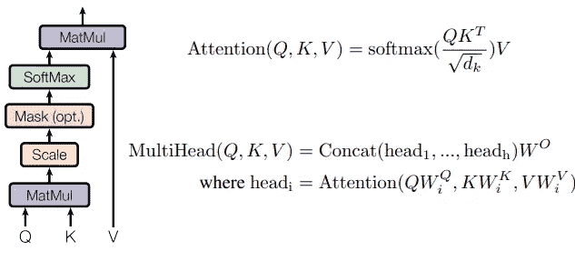
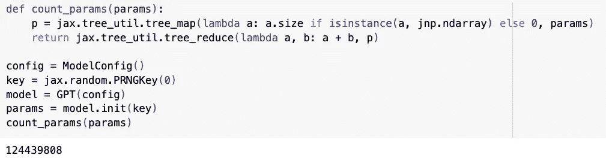
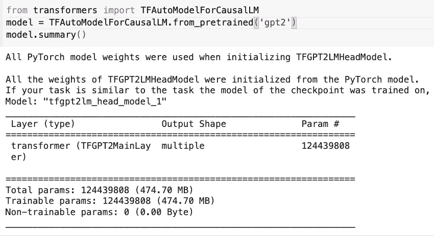
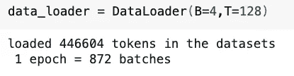
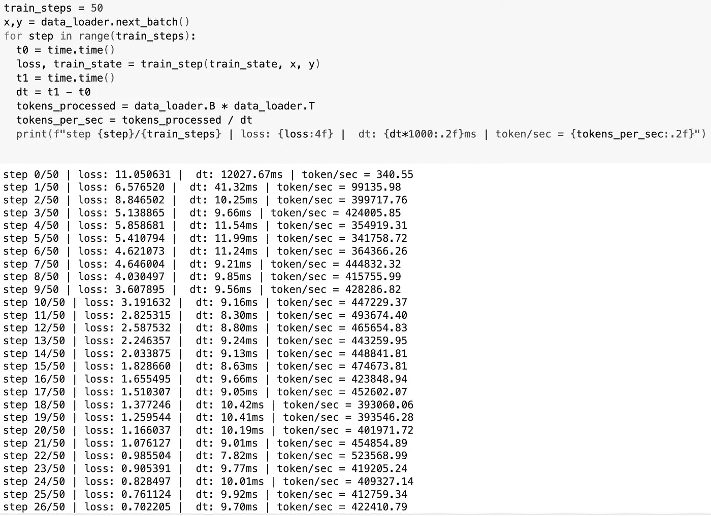

# 让我们用 JAX 重建 NanoGPT！（第一部分）

> 原文：[`towardsdatascience.com/lets-reproduce-nanogpt-with-jax-part-1-95bec4630eb4?source=collection_archive---------2-----------------------#2024-07-21`](https://towardsdatascience.com/lets-reproduce-nanogpt-with-jax-part-1-95bec4630eb4?source=collection_archive---------2-----------------------#2024-07-21)

## [第一部分：使用 JAX 构建 124M GPT2。](https://medium.com/@lou1swang/lets-reproduce-nanogpt-with-jax-part-1-95bec4630eb4)

[第二部分：在单 GPU 中优化训练速度。](https://medium.com/@lou1swang/lets-reproduce-nanogpt-with-jax-part-2-175k-1350k-tokens-sec-in-single-gpu-ff2664ef18d3)

第三部分：在 JAX 中进行多 GPU 训练。

[](https://lou1swang.medium.com/?source=post_page---byline--95bec4630eb4--------------------------------)[](https://towardsdatascience.com/?source=post_page---byline--95bec4630eb4--------------------------------) [Louis Wang](https://lou1swang.medium.com/?source=post_page---byline--95bec4630eb4--------------------------------)

·发表于 [Towards Data Science](https://towardsdatascience.com/?source=post_page---byline--95bec4630eb4--------------------------------) ·阅读时间：8 分钟·2024 年 7 月 21 日

--

受到 Andrej Karpathy 最近的 YouTube 视频[让我们重建 GPT-2（124M）](https://www.youtube.com/watch?v=l8pRSuU81PU&t=1646s)的启发，我想用 JAX 重建它，并进行大多数训练优化。JAX 专为高效计算速度而构建，非常有趣的是，可以将 Pytorch 与其最近的训练优化以及 JAX 与其相关库（如 Flax：JAX 的神经网络训练层 API 和 Optax：JAX 的梯度处理和优化库）进行对比。我们将迅速了解 JAX，并用 JAX 重建 GPT。最后，我们将比较 Pytorch 和 JAX 在多 GPU 训练中的 token/sec。


AI 生成的 GPT

## 什么是 Jax？

根据其[readthedoc](https://jax.readthedocs.io/en/latest/index.html)，JAX 是一个面向加速器的数组计算和程序转换的 Python 库，旨在实现高性能的数值计算和大规模机器学习。我想用它的名字来介绍 JAX。虽然有人称它为 Just Another [XLA](https://github.com/openxla/xla)（加速线性代数），我更愿意称其为 J(it) A(utograd) X(LA)，以展示它的高效能力。

J — Just-in-time (JIT) 编译。当你运行 Python 函数时，Jax 将其转换为一组基本操作，称为 Jaxpr。然后，Jaxpr 表达式会被转换为 XLA 的输入，XLA 将其编译成底层脚本，从而为目标设备（CPU、GPU 或 TPU）生成优化后的可执行文件。

A — Autograd。计算梯度是现代机器学习方法中的一个关键部分，你只需要调用`jax.grad()`来获取梯度，从而优化模型。

X — XLA。这是一个开源的机器学习编译器，支持 CPU、GPU 和 ML 加速器。通常，XLA 会对[StableHLO](https://github.com/openxla/stablehlo)图进行几个内建的优化和分析传递，然后将 HLO 计算发送到后端进行进一步的 HLO 级别优化。后端再进行特定目标的代码生成。

这些只是 JAX 的一些关键特性，但它还有许多类似于 numpy 的用户友好 API，如`jax.numpy`，以及通过`jax.vmap`进行的自动向量化，和通过`jax.pmap`将代码并行化到多个设备上。我们将在以后的博客中介绍更多 Jax 的概念和应用，但现在让我们用 Jax 复现 NanoGPT！

## 从注意力机制到变换器（Transformer）

GPT 是一种仅解码的变换器模型，关键构建模块是注意力模块。我们可以首先定义一个模型配置数据类来保存模型的超参数，这样模型模块就能高效地使用它来初始化模型架构。类似于 124M GPT 模型，在这里我们初始化一个 12 层的变换器解码器，具有 12 个头和 50257 个词汇表大小，每个词汇表项有 768 维嵌入向量。注意力计算的块大小为 1024。

```py
from dataclasses import dataclass

@dataclass
class ModelConfig:
  vocab_size: int = 50257
  n_head: int = 12
  n_embd: int = 768
  block_size: int = 1024
  n_layer: int = 12
  dropout_rate: float = 0.1
```

接下来是变换器模型的关键构建模块——注意力机制（Attention）。其思想是将输入处理成三个权重矩阵：Key、Query 和 Value。在这里，我们依赖于`flax`，这是一个 Jax 层和训练 API 库，用来初始化这三个权重矩阵，只需要调用`[flax.linen.Dense](https://flax.readthedocs.io/en/v0.5.3/_autosummary/flax.linen.Dense.html)`。如前所述，Jax 有许多类似 numpy 的 API，因此我们使用`[jax.numpy.reshape](https://jax.readthedocs.io/en/latest/_autosummary/jax.numpy.reshape.html)`将权重矩阵后的输出从[batch_size, sequence_length, embedding_dim]重塑为[batch_size, sequence_length, num_head, embedding_dim / num_head]。由于我们需要对 Key 和 Value 矩阵执行矩阵乘法，jax 还提供了`[jax.numpy.matmul](https://jax.readthedocs.io/en/latest/_autosummary/jax.numpy.matmul.html)`和`[jax.numpy.transpose](https://jax.readthedocs.io/en/latest/_autosummary/jax.numpy.transpose.html)` API（用于转置 Key 矩阵以进行乘法运算）。



多头注意力（Multihead Attention）

请注意，我们需要在注意力矩阵上加上一个掩码，以避免信息泄漏（防止之前的 tokens 访问到后面的 tokens），`[jax.numpy.tril](https://jax.readthedocs.io/en/latest/_autosummary/jax.numpy.tril.html)` 帮助构建一个下三角数组，而 `[jax.numpy.where](https://jax.readthedocs.io/en/latest/_autosummary/jax.numpy.where.html)` 可以为我们填充无限大的数值，以便在 softmax `[jax.nn.softmax](https://jax.readthedocs.io/en/latest/_autosummary/jax.nn.softmax.html)` 后得到 0。多头注意力的完整代码如下所示。

```py
from flax import linen as nn
import jax.numpy as jnp

class CausalSelfAttention(nn.Module):

  config: ModelConfig

  @nn.compact
  def __call__(self, x, deterministic=True):

    assert len(x.shape) == 3

    b, l, d = x.shape

    q     = nn.Dense(self.config.n_embd)(x)
    k     = nn.Dense(self.config.n_embd)(x)
    v     = nn.Dense(self.config.n_embd)(x)
    # q*k / sqrt(dim) -> softmax -> @v
    q     = jnp.reshape(q, (b, l, d//self.config.n_head , self.config.n_head))
    k     = jnp.reshape(k, (b, l, d//self.config.n_head , self.config.n_head))
    v     = jnp.reshape(v, (b, l, d//self.config.n_head , self.config.n_head))
    norm  = jnp.sqrt(list(jnp.shape(k))[-1])
    attn  = jnp.matmul(q,jnp.transpose(k, (0,1,3,2))) / norm
    mask  = jnp.tril(attn)
    attn  = jnp.where(mask[:,:,:l,:l], attn, float("-inf"))
    probs = jax.nn.softmax(attn, axis=-1)
    y     = jnp.matmul(probs, v)
    y     = jnp.reshape(y, (b,l,d))
    y     = nn.Dense(self.config.n_embd)(y)
    return y
```

你可能会注意到，在 Pytorch 中常见的 `__init__` 或 `forward` 方法在这里并不存在。这是 jax 的特点，在 jax 中你可以显式地通过 `setup` 方法定义层，或者通过在 `__call__` 方法上添加 `nn.compact` 来隐式定义它们。[[参考](https://flax.readthedocs.io/en/latest/guides/flax_fundamentals/setup_or_nncompact.html)]

接下来让我们构建 MLP 和 Block 层，包括 Dense 层、Gelu 激活函数、LayerNorm 和 Dropout。再次，flax.linen 提供了层的 API，帮助我们构建模块。请注意，我们会传递一个 `deterministic` 布尔变量来控制某些层（如 Dropout）在训练或评估期间的不同行为。

```py
class MLP(nn.Module):

  config: ModelConfig

  @nn.compact
  def __call__(self, x, deterministic=True):
    x = nn.Dense(self.config.n_embd*4)(x)
    x = nn.gelu(x, approximate=True)
    x = nn.Dropout(rate=self.config.dropout_rate)(x, deterministic=deterministic)
    x = nn.Dense(self.config.n_embd)(x)
    x = nn.Dropout(rate=self.config.dropout_rate)(x, deterministic=deterministic)
    return x

class Block(nn.Module):

  config: ModelConfig

  @nn.compact
  def __call__(self, x):
    x = nn.LayerNorm()(x)
    x = x + CausalSelfAttention(self.config)(x)
    x = nn.LayerNorm()(x)
    x = x + MLP(self.config)(x)
    return x
```

现在让我们使用上述模块来构建 NanoGPT：

给定一个序列的 token ids 输入，我们使用 `[flax.linen.Embed](https://flax.readthedocs.io/en/v0.5.3/_autosummary/flax.linen.Embed.html)` 层来获取位置嵌入和 token 嵌入。然后，我们将它们传入 Block 模块 N 次，其中 N 是模型配置中定义的层数。最后，我们将来自最后一个 Block 的输出映射到每个词汇表 token 的概率，以预测下一个 token。除了前向 `__call__` 方法之外，我们还需要创建一个 `init` 方法来获取虚拟输入并获得模型的参数。

```py
class GPT(nn.Module):

  config: ModelConfig

  @nn.compact
  def __call__(self, x, deterministic=False):

    B, T = x.shape
    assert T <= self.config.block_size

    pos     = jnp.arange(0, T)[None]
    pos_emb = nn.Embed(self.config.block_size, self.config.n_embd)(pos)
    wte     = nn.Embed(self.config.vocab_size, self.config.n_embd)
    tok_emb = wte(x)
    x       = tok_emb + pos_emb

    for _ in range(self.config.n_layer):
      x = Block(self.config)(x)
    x = nn.LayerNorm()(x)
    logits = nn.Dense(config.n_embd, config.vocab_size)(x)
    # logits = wte.attend(x) # parameter sharing
    return logits

  def init(self, rng):
    tokens = jnp.zeros((1, self.config.block_size), dtype=jnp.uint16)
    params = jax.jit(super().init, static_argnums=(2,))(rng, tokens, True)
    return params 
```

现在让我们验证一下参数的数量：我们首先初始化模型配置的数据类和随机密钥，然后创建一个虚拟输入并将其输入到 GPT 模型中。接着，我们利用 `jax.util.treemap` API 创建一个计数参数函数。我们得到了 **124439808**（124M）个参数，与 Huggingface 的 GPT2 相同，哇！



Colab 结果：参数数量



验证 Huggingface 的 GPT2 参数数量

## **数据加载器和训练循环**

现在让我们在一个小数据集上进行过拟合。为了与 Andrej 的 Pytorch NanoGPT 视频中进行对比，我们使用他在视频中分享的玩具 [dataset](https://github.com/karpathy/build-nanogpt/blob/master/input.txt)。我们使用 `tiktoken` 库的 GPT2 分词器对输入文件中的所有文本进行分词，并将这些 token 转换为 `jax.numpy.array` 以便 Jax 的模型训练。

```py
class DataLoader:
  def __init__(self, B, T):
    self.current_position = 0
    self.B = B
    self.T = T

    with open("input.txt","r") as f:
      text = f.read()
    enc = tiktoken.get_encoding("gpt2")
    self.tokens = jnp.array(enc.encode(text))
    print(f"loaded {len(self.tokens)} tokens in the datasets" )
    print(f" 1 epoch = {len(self.tokens)//(B*T)} batches")

  def next_batch(self):
    B,T = self.B, self.T
    buf = self.tokens[self.current_position:self.current_position+B*T+1]
    x,y = jnp.reshape(buf[:-1],(B,T)), jnp.reshape(buf[1:],(B,T))
    self.current_position += B*T
    if self.current_position + B*T+1 > len(self.tokens):
      self.current_position = 0
    return x,y
```



Colab 结果：简单的数据加载器，批量大小为 4，序列长度为 128

接下来，让我们暂时忽略分布式训练和优化，先创建一个简单的训练循环进行基本检查。初始化模型后的第一件事是创建一个[TrainState](https://flax.readthedocs.io/en/latest/api_reference/flax.training.html#flax.training.train_state.TrainState)，这是一个可以更新参数和梯度的模型状态。TrainState 接受三个重要输入：apply_fn（模型前向函数）、params（来自初始化方法的模型参数）和 tx（一个 Optax 梯度变换）。

然后我们使用 train_step 函数来更新模型状态（梯度和参数），以继续模型训练。`Optax` 提供了用于下一个令牌预测任务的 softmax 交叉熵作为损失函数，`jax.value_and_grad` 用于计算损失函数的梯度和损失值。最后，我们使用 `apply_gradients` API 更新模型的状态和新参数。[[ref](https://flax.readthedocs.io/en/latest/_modules/flax/training/train_state.html)] 别忘了对 train_step 函数进行 JIT 编译，以减少计算开销！

```py
def init_train_state(key, config) -> TrainState:
  model = GPT(config)
  params = model.init(key)
  optimizer = optax.adamw(3e-4, b1=0.9, b2=0.98, eps=1e-9, weight_decay=1e-1)
  train_state = TrainState.create(
        apply_fn=model.apply,
        params=params,
        tx=optimizer)
  return train_state

@jax.jit
def train_step(state: TrainState, x: jnp.ndarray, y: jnp.ndarray) -> Tuple[jnp.ndarray, TrainState]:

  def loss_fn(params: FrozenDict) -> jnp.ndarray:

      logits = state.apply_fn(params, x, False)
      loss = optax.softmax_cross_entropy_with_integer_labels(logits, y).mean()
      return loss

  loss, grads = jax.value_and_grad(loss_fn, has_aux=False)(state.params)
  new_state = state.apply_gradients(grads=grads)
  return loss, new_state
```

现在一切准备就绪，可以开始进行简单的训练循环了……让我们检查损失值。模型的预测应该优于随机猜测，因此损失值应该低于 -ln(1/50257)≈10.825。我们对单批次过拟合的预期是：一开始损失接近 10.825，然后下降到接近 0。让我们取一批（x，y）并运行训练循环 50 次。我还添加了类似的日志来计算训练速度。



如我们所见，损失值正是我们预期的，训练吞吐量大约是 400–500 k token/sec。这已经比 Andrej 视频中没有任何优化的 Pytorch 初始版本快了 40 倍。请注意，我们是在 1 个 A100 GPU 上运行 Jax 脚本，这应该消除了硬件差异对速度比较的影响。这里没有 `.to(device)` 的操作来将模型或数据从主机 CPU 移动到设备 GPU，这正是 Jax 的一个优势！

就这样，我们做到了。我们将在第二部分通过更多优化将训练速度提升至原来的 10 倍…

[第二部分](https://lou1swang.medium.com/lets-reproduce-nanogpt-with-jax-part-2-175k-1350k-tokens-sec-in-single-gpu-ff2664ef18d3)：训练优化之旅，如何在单个 GPU 上达到 1350k tokens/sec！

“除非另有说明，所有图片均为作者所提供”
