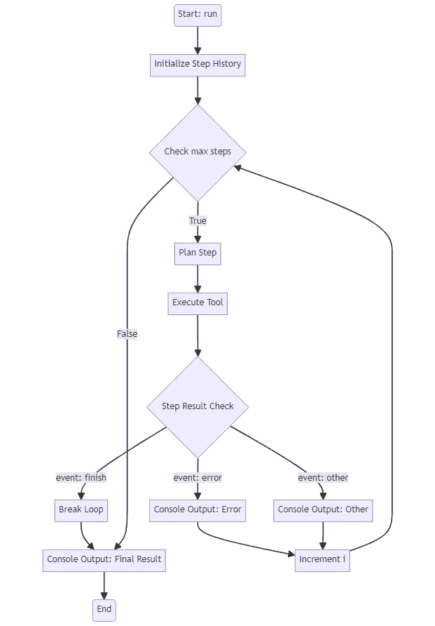

# 利用 OpenAI 工具调用：从零开始构建一个可靠的 AI 代理

> 原文：[`towardsdatascience.com/leverage-openai-tool-calling-building-a-reliable-ai-agent-from-scratch-4e21fcd15b62?source=collection_archive---------0-----------------------#2024-03-26`](https://towardsdatascience.com/leverage-openai-tool-calling-building-a-reliable-ai-agent-from-scratch-4e21fcd15b62?source=collection_archive---------0-----------------------#2024-03-26)


使用[DALL·E](https://labs.openai.com/s/1rNDsRujptitO6sPd57aWyZp)创建

## 开发和完善 AI 代理的逐步工作流程，同时处理错误

[](https://medium.com/@lukas.kowejsza?source=post_page---byline--4e21fcd15b62--------------------------------)[](https://towardsdatascience.com/?source=post_page---byline--4e21fcd15b62--------------------------------) [Lukasz Kowejsza](https://medium.com/@lukas.kowejsza?source=post_page---byline--4e21fcd15b62--------------------------------)

·发表于[Towards Data Science](https://towardsdatascience.com/?source=post_page---byline--4e21fcd15b62--------------------------------) ·16 分钟阅读·2024 年 3 月 26 日

--

当我们思考人工智能的未来时，我们设想直观的日常助手无缝地融入我们的工作流程，承担复杂的常规任务。我们都已经找到了减轻我们日常脑力劳动单调的接触点。然而，目前处理的主要任务包括文本创作、修正和头脑风暴，尤其是 RAG（检索增强生成）流程在持续发展中的重要作用。我们的目标是为大型语言模型提供更好的上下文，以生成更有价值的内容。

想到人工智能的未来，我脑海中浮现的是《钢铁侠》中的贾维斯，或者游戏《命运》中的拉斯普廷。在这两个例子中，人工智能充当了与复杂系统交互的语音控制界面，提供高级抽象。例如，托尼·斯塔克用它来管理研究、进行计算和运行模拟。即便是 R2-D2，也能够通过语音命令与陌生的计算机系统进行交互，提取数据或与建筑系统互动。

在这些场景中，AI 使得与复杂系统的交互变得更加简单，无需最终用户对这些系统有深入的理解。这可以与今天大型企业中的 ERP 系统类比。在大型企业中，很少有人能够完全了解和理解公司内部 ERP 系统的每个方面。想象一下，在不远的将来，AI 可能会协助几乎所有与 ERP 系统的交互。从最终用户管理客户数据或记录订单，到软件开发人员修复 Bug 或实现新功能，这些交互很可能很快就会由熟悉 ERP 系统各个方面和流程的 AI 助手来促成。这样的 AI 助手将知道应该将客户数据输入到哪个数据库，并且能够理解与 Bug 相关的哪些流程和代码。

为了实现这一目标，我们面临着若干挑战和创新。我们需要重新思考流程及其文档。目前的 ERP 流程是为人类使用设计的，具有不同用户的特定角色、供人类使用的文档、供人类填写的输入框，以及旨在直观且无误的用户交互设计。这些方面的设计在 AI 交互中将会有所不同。我们需要为 AI 交互设计特定的角色，并制定不同的流程设计，以实现直观且无误的 AI 交互。这一点在我们与提示语的工作中已初见端倪。我们认为清晰的任务往往并不像预期的那样简单。

# 从概念到现实：构建 AI 代理的基础

然而，让我们首先回顾一下代理的概念。代理，或者说能够使用提供工具执行任务并决定如何使用这些工具的 AI 助手，是最终能够实现此类系统的基础构件。它们是我们希望将其集成到复杂系统各个方面的流程组件。但正如之前文章中强调的那样，可靠地部署这些代理是具有挑战性的。在本文中，我将展示我们如何设计和优化一个能够可靠地与数据库交互的代理。

尽管 AI 未来的宏大愿景令人鼓舞，但采取切实可行的步骤实现这一愿景至关重要。为了展示我们如何开始为此类先进 AI 系统构建基础，让我们专注于创建一个用于常见任务——费用跟踪——的原型代理。这个原型将作为一个具体的示例，展示 AI 如何高效地帮助管理财务交易，展现 AI 在自动化日常任务中的潜力，并突出在设计一个能够无缝与数据库交互的 AI 系统时所面临的挑战和考量。通过从一个具体且易于理解的用例入手，我们可以获得宝贵的洞察，这些洞察将为未来更复杂 AI 代理的开发提供指导。

# 本文的目标

本文将为一系列文章奠定基础，旨在开发一个聊天机器人，作为小型企业的单一互动入口，支持并执行商业流程，或作为个人生活中的聊天助手，帮助整理你需要跟踪的所有事务。从数据、日常事务、文件到图片，我们希望简单地与我们的助手对话，让它来决定在哪里存储和提取你的数据。

从 AI 未来的宏伟愿景转向实际应用，让我们聚焦于创建一个原型代理。这个代理将作为实现之前讨论的雄心勃勃目标的基础步骤。我们将开始开发一个“费用跟踪”代理，这是一个简单但至关重要的任务，展示 AI 如何高效地帮助管理财务交易。

这个“费用跟踪”原型不仅展示了 AI 在自动化日常任务中的潜力，还揭示了设计一个能够与数据库无缝交互的 AI 系统所面临的挑战和考量。通过聚焦于这个示例，我们可以探讨代理设计、输入验证以及 AI 与现有系统集成的复杂性——为未来更复杂的应用奠定坚实的基础。

# 1\. 实践操作：测试 OpenAI 工具调用

为了让我们的原型代理得以实现并识别潜在瓶颈，我们正在测试 OpenAI 工具调用功能。从一个基础的费用跟踪示例开始，我们正在奠定一个模拟现实世界应用的基础。这一阶段涉及创建一个基础模型，并通过 langchain 库的`convert_to_openai_tool`函数将其转化为 OpenAI 工具架构。此外，构建一个`report_tool`使得我们的未来代理能够传达结果或突出缺失的信息或问题：

```py
from pydantic.v1 import BaseModel, validator  
from datetime import datetime
from langchain_core.utils.function_calling import convert_to_openai_tool

class Expense(BaseModel):    
   description: str    
   net_amount: float    
   gross_amount: float    
   tax_rate: float    
   date: datetime

class Report(BaseModel):
   report: str

add_expense_tool = convert_to_openai_tool(Expense)
report_tool = convert_to_openai_tool(Report)
```

在设置好数据模型和工具后，下一步是使用 OpenAI 客户端 SDK 发起一个简单的工具调用。在这个初步测试中，我们故意向模型提供不足的信息，以查看它是否能够正确指出缺少的内容。这种方法不仅测试代理的功能能力，还测试其交互和错误处理能力。

# 调用 OpenAI API

现在，我们将使用 OpenAI 客户端 SDK 发起一个简单的工具调用。在我们的第一次测试中，我们故意向模型提供不足的信息，看看它是否能通知我们缺失的细节。

```py
from openai import OpenAI  
from langchain_core.utils.function_calling import convert_to_openai_tool  

SYSTEM_MESSAGE = """You are tasked with completing specific objectives and 
must report the outcomes. At your disposal, you have a variety of tools, 
each specialized in performing a distinct type of task.  

For successful task completion:  
Thought: Consider the task at hand and determine which tool is best suited 
based on its capabilities and the nature of the work.  

Use the report_tool with an instruction detailing the results of your work.  
If you encounter an issue and cannot complete the task:  

Use the report_tool to communicate the challenge or reason for the 
task's incompletion.  
You will receive feedback based on the outcomes of 
each tool's task execution or explanations for any tasks that 
couldn't be completed. This feedback loop is crucial for addressing 
and resolving any issues by strategically deploying the available tools.  
"""  
user_message = "I have spend 5$ on a coffee today please track my expense. The tax rate is 0.2."

client = OpenAI()  
model_name = "gpt-3.5-turbo-0125"  

messages = [  
    {"role":"system", "content": SYSTEM_MESSAGE},  
    {"role":"user", "content": user_message}  
]  

response = client.chat.completions.create(  
            model=model_name,  
            messages=messages,  
            tools=[  
                convert_to_openai_tool(Expense),  
                convert_to_openai_tool(ReportTool)]  
        )
```

接下来，我们需要一个新函数，从响应中读取函数调用的参数：

```py
def parse_function_args(response):
    message = response.choices[0].message
    return json.loads(message.tool_calls[0].function.arguments)

print(parse_function_args(response))
```

```py
{'description': 'Coffee',
 'net_amount': 5,
 'gross_amount': None,
 'tax_rate': 0.2,
 'date': '2023-10-06T12:00:00Z'}
```

正如我们所观察到的，我们在执行过程中遇到了几个问题：

1.  gross_amount 未被计算。

1.  日期被虚构了。

有鉴于此，让我们尝试解决这些问题并优化我们的代理工作流程。

# 2\. 优化工具处理

为了优化代理工作流，我认为优先考虑**工作流而非提示工程**是至关重要的。虽然调整提示使代理能够完美地使用提供的工具并避免出错是有吸引力的，但更建议首先调整工具和流程。当出现典型错误时，初步的考虑应是**如何通过代码修复**。

# 处理缺失信息

有效处理缺失信息是创建强大且可靠代理的关键课题。在前面的示例中，提供像“get_current_date”这样的工具是特定场景的变通方法。然而，我们必须假设缺失信息会在各种情况下发生，我们不能仅仅依赖提示工程和添加更多工具来防止模型出现幻觉。

针对这种情况的一个简单解决方法是修改工具模式，将所有参数视为可选。此方法确保代理只提交它知道的参数，从而防止不必要的幻觉。

因此，我们来看看 openai 工具模式：

```py
add_expense_tool = convert_to_openai_tool(Expense)
print(add_expense_tool)
```

```py
{'type': 'function',
 'function': {'name': 'Expense',
  'description': '',
  'parameters': {'type': 'object',
   'properties': {'description': {'type': 'string'},
    'net_amount': {'type': 'number'},
    'gross_amount': {'type': 'number'},
    'tax_rate': {'type': 'number'},
    'date': {'type': 'string', 'format': 'date-time'}},
   'required': ['description',
    'net_amount',
    'gross_amount',
    'tax_rate',
    'date']}}}
```

如我们所见，我们有一个特殊的`required`关键字，需要移除。以下是如何调整`add_expense_tool`模式以通过移除`required`关键字将参数设为可选：

```py
del add_expense_tool["function"]["parameters"]["required"]
```

# 设计`Tool`类

接下来，我们可以设计一个`Tool`类，首先检查输入参数是否缺少值。我们创建`Tool`类并定义两个方法：`.run()`、`.validate_input()`，以及一个属性`openai_tool_schema`，在其中通过移除必需参数来操作工具模式。此外，我们还定义了`ToolResult` BaseModel，其中包含`content`和`success`字段，用作每次工具运行的输出对象。

```py
from pydantic import BaseModel
from typing import Type, Callable, Dict, Any, List

class ToolResult(BaseModel):  
    content: str  
    success: bool  

class Tool(BaseModel):  
    name: str  
    model: Type[BaseModel]  
    function: Callable  
    validate_missing: bool = False  

    class Config:  
        arbitrary_types_allowed = True  

    def run(self, **kwargs) -> ToolResult:
        if self.validate_missing:
            missing_values = self.validate_input(**kwargs)  
            if missing_values:  
                content = f"Missing values: {', '.join(missing_values)}"  
                return ToolResult(content=content, success=False)  
        result = self.function(**kwargs)  
        return ToolResult(content=str(result), success=True)  

    def validate_input(self, **kwargs) -> List[str]:  
        missing_values = []  
        for key in self.model.__fields__.keys():  
            if key not in kwargs:  
                missing_values.append(key)  
        return missing_values
    @property
    def openai_tool_schema(self) -> Dict[str, Any]:
        schema = convert_to_openai_tool(self.model)
        if "required" in schema["function"]["parameters"]:
            del schema["function"]["parameters"]["required"]
        return schema
```

`Tool`类是 AI 代理工作流中的关键组件，作为创建和管理代理可用工具的蓝图，以执行特定任务。它旨在处理输入验证、执行工具的功能，并以标准化格式返回结果。

## `Tool`类的关键组件：

1.  `name`：工具的名称。

1.  `model`：定义工具输入模式的 Pydantic BaseModel。

1.  `function`：工具执行的可调用函数。

1.  `validate_missing`：一个布尔标志，表示是否验证缺失的输入值（默认为`False`）。

## `Tool`类的两个主要方法：

1.  `**run(self, **kwargs) -> ToolResult**`**：该方法负责使用提供的输入参数执行工具的功能。它首先检查`validate_missing`是否设置为`True`。如果是，它会调用`validate_input()`方法检查是否缺少输入值。如果发现缺失的值，则返回一个`ToolResult`对象，包含错误信息并将`success`设置为`False`。如果所有必需的输入值都存在，则继续执行工具的`function`，并返回一个包含结果的`ToolResult`对象，`success`设置为`True`。

1.  `**validate_input(self, **kwargs) -> List[str]**`**:** 该方法将传递给工具的输入参数与`model`中定义的预期输入架构进行比较。它遍历`model`中定义的字段，检查每个字段是否在输入参数中。如果任何字段缺失，它将字段名称添加到缺失值列表中。最后，它返回缺失值的列表。

`Tool`类还有一个名为`openai_tool_schema`的属性，它返回该工具的 OpenAI 工具架构。它使用`convert_to_openai_tool()`函数将`model`转换为 OpenAI 工具架构格式。此外，它从架构中移除了`"required"`键，使所有输入参数变为可选。这使得代理只需要提供可用信息，而无需虚构缺失值。

通过封装工具的功能、输入验证和架构生成，`Tool`类为在 AI 代理工作流中创建和管理工具提供了一个简洁且可重用的接口。它抽象了处理缺失值的复杂性，并确保代理在执行适当的工具时，能够优雅地处理不完整的信息，基于可用输入进行操作。

# 测试缺失信息处理

接下来，我们将扩展我们的 OpenAI API 调用。我们希望客户端能够使用我们的工具，并且我们的响应对象能够直接触发`tool.run()`。为此，我们需要在新创建的`Tool`类中初始化我们的工具。我们定义了两个虚拟函数，它们返回一个成功消息字符串。

```py
def add_expense_func(**kwargs):  
    return f"Added expense: {kwargs} to the database."

add_expense_tool = Tool(  
    name="add_expense_tool",  
    model=Expense,  
    function=add_expense_func  
)  

def report_func(report: str = None):  
    return f"Reported: {report}"  

report_tool = Tool(  
    name="report_tool",  
    model=ReportTool,  
    function=report_func  
)  

tools = [add_expense_tool, report_tool]
```

接下来，我们定义一个辅助函数，它接收客户响应作为输入，并帮助与我们的工具进行交互。

```py
def get_tool_from_response(response, tools=tools):  
    tool_name = response.choices[0].message.tool_calls[0].function.name  
    for t in tools:  
        if t.name == tool_name:  
            return t  
    raise ValueError(f"Tool {tool_name} not found in tools list.")

def parse_function_args(response):  
    message = response.choices[0].message  
    return json.loads(message.tool_calls[0].function.arguments)

def run_tool_from_response(response, tools=tools):  
    tool = get_tool_from_response(response, tools)  
    tool_kwargs = parse_function_args(response)  
    return tool.run(**tool_kwargs)
```

现在，我们可以使用新工具执行客户端，并使用`run_tool_from_response`函数。

```py
response = client.chat.completions.create(  
            model=model_name,  
            messages=messages,  
            tools=[tool.openai_tool_schema for tool in tools]  
        )

tool_result = run_tool_from_response(response, tools=tools)
print(tool_result)
```

```py
content='Missing values: gross_amount, date' success=False
```

完美地，我们现在看到我们的工具表明缺失值存在。感谢我们将所有参数设为可选的技巧，我们现在避免了虚构的参数。

# 3\. 构建代理工作流

就目前而言，我们的流程还不能算是真正的代理。到目前为止，我们只执行了一个 API 工具调用。为了将其转变为代理工作流，我们需要引入一个迭代过程，将工具执行的结果反馈给客户端。基本的流程应该是这样的：



图片由作者提供

让我们通过创建一个新的 OpenAIAgent 类来开始：

```py
class StepResult(BaseModel):  
    event: str   
    content: str  
    success: bool

class OpenAIAgent:  

    def __init__(  
            self,   
            tools: list[Tool],   
            client: OpenAI,   
            system_message: str = SYSTEM_MESSAGE,   
            model_name: str = "gpt-3.5-turbo-0125",  
            max_steps: int = 5,  
            verbose: bool = True  
    ):  
        self.tools = tools  
        self.client = client  
        self.model_name = model_name  
        self.system_message = system_message  
        self.step_history = []  
        self.max_steps = max_steps  
        self.verbose = verbose  

    def to_console(self, tag: str, message: str, color: str = "green"):  
        if self.verbose:  
            color_prefix = Fore.__dict__[color.upper()]  
            print(color_prefix + f"{tag}: {message}{Style.RESET_ALL}")
```

就像我们的`ToolResult`对象一样，我们为每个代理步骤定义了一个`StepResult`对象。然后，我们定义了`OpenAIAgent`类的`__init__`方法和一个`to_console()`方法，用于将我们的中间步骤和工具调用打印到控制台，使用 colorama 进行彩色打印。接下来，我们定义了代理的核心部分，即`run()`和`run_step()`方法。

```py
class OpenAIAgent:

    # ... __init__...

    # ... to_console ...

    def run(self, user_input: str):  

        openai_tools = [tool.openai_tool_schema for tool in self.tools]    
        self.step_history = [    
            {"role":"system", "content":self.system_message},    
            {"role":"user", "content":user_input}    
        ]    

        step_result = None    
        i = 0

        self.to_console("START", f"Starting Agent with Input: {user_input}")

        while i < self.max_steps:  
            step_result = self.run_step(self.step_history, openai_tools)    

            if step_result.event == "finish":    
                break  
            elif step_result.event == "error":  
                self.to_console(step_result.event, step_result.content, "red")  
            else:  
                self.to_console(step_result.event, step_result.content, "yellow")  
            i += 1   

        self.to_console("Final Result", step_result.content, "green")  
        return step_result.content
```

在`run()`方法中，我们首先初始化了`step_history`，它将作为我们的消息记忆，包含预定义的 system_message 和 user_input。然后我们开始执行 while 循环，在每次迭代时调用`run_step`，该方法将返回一个 StepResult 对象。我们识别出智能体是否完成了任务，或者是否发生了错误，错误信息也会传递到控制台。

```py
class OpenAIAgent:

    # ... __init__...

    # ... to_console ...
    # ... run ...
    def run_step(self, messages: list[dict], tools):  

        # plan the next step  
        response = self.client.chat.completions.create(  
            model=self.model_name,  
            messages=messages,  
            tools=tools  
        )  

        # add message to history  
        self.step_history.append(response.choices[0].message)  

        # check if tool call is present  
        if not response.choices[0].message.tool_calls:  
            return StepResult(
                event="Error",
                content="No tool calls were returned.", 
                success=False
                )  

        tool_name = response.choices[0].message.tool_calls[0].function.name  
        tool_kwargs = parse_function_args(response)  

        # execute the tool call  
        self.to_console(
        "Tool Call", f"Name: {tool_name}\nArgs: {tool_kwargs}", "magenta"
        )  
        tool_result = run_tool_from_response(response, tools=self.tools)  
        tool_result_msg = self.tool_call_message(response, tool_result)  
        self.step_history.append(tool_result_msg)  

        if tool_result.success:  
            step_result = StepResult(  
                event="tool_result",   
                content=tool_result.content,   
                success=True)  
        else:  
            step_result = StepResult(  
                event="error",   
                content=tool_result.content,   
                success=False  
            )   

        return step_result  

    def tool_call_message(self, response, tool_result: ToolResult):  
        tool_call = response.choices[0].message.tool_calls[0]  
        return {  
            "tool_call_id": tool_call.id,  
            "role": "tool",  
            "name": tool_call.function.name,  
            "content": tool_result.content,  
        }
```

现在我们已经定义了每个步骤的逻辑。我们首先通过之前测试过的客户端 API 调用工具，获得一个响应对象。然后将响应消息对象附加到`step_history`中。接着我们验证响应对象中是否包含工具调用，如果没有，我们将在 StepResult 中返回一个错误。然后我们将工具调用记录到控制台，并通过我们之前定义的方法`run_tool_from_response()`运行选定的工具。我们还需要将工具结果添加到我们的消息历史中。OpenAI 为此定义了一个特定的格式，使得模型能够知道哪个工具调用对应哪个输出，通过将 tool_call_id 传递到消息字典中来实现这一点。我们的`tool_call_message()`方法完成了这一过程，它接受响应对象和工具结果作为输入参数。在每个步骤结束时，我们将工具结果赋值给 StepResult 对象，这个对象还指示该步骤是否成功，并将其返回到`run()`中的循环。

# 4\. 运行智能体

现在我们可以使用之前的示例来测试我们的智能体，并直接为其装备一个`get_current_date_tool`。在这里，我们可以将之前定义的`validate_missing`属性设置为`False`，因为该工具不需要任何输入参数。

```py
class DateTool(BaseModel):  
    x: str = None  

get_date_tool = Tool(  
    name="get_current_date",  
    model=DateTool,  
    function=lambda: datetime.now().strftime("%Y-%m-%d"),  
    validate_missing=False  
)  

tools = [  
    add_expense_tool,   
    report_tool,  
    get_date_tool  
]  

agent = OpenAIAgent(tools, client)
agent.run("I have spent 5$ on a coffee today please track my expense. The tax rate is 0.2.")
```

```py
START: Starting Agent with Input: 
"I have spend 5$ on a coffee today please track my expense. The tax rate is 0.2."

Tool Call: get_current_date
Args: {}
tool_result: 2024-03-15

Tool Call: add_expense_tool
Args: {'description': 'Coffee expense', 'net_amount': 5, 'tax_rate': 0.2, 'date': '2024-03-15'}
error: Missing values: gross_amount

Tool Call: add_expense_tool
Args: {'description': 'Coffee expense', 'net_amount': 5, 'tax_rate': 0.2, 'date': '2024-03-15', 'gross_amount': 6}
tool_result: Added expense: {'description': 'Coffee expense', 'net_amount': 5, 'tax_rate': 0.2, 'date': '2024-03-15', 'gross_amount': 6} to the database.
Error: No tool calls were returned.

Tool Call: Name: report_tool
Args: {'report': 'Expense successfully tracked for coffee purchase.'}
tool_result: Reported: Expense successfully tracked for coffee purchase.

Final Result: Reported: Expense successfully tracked for coffee purchase.
```

在我们的原型智能体成功执行后，值得强调的是，智能体根据计划高效地利用了指定的工具。最初，它调用了`get_current_date_tool`，为费用条目建立了一个基础时间戳。随后，在尝试通过`add_expense_tool`记录费用时，我们精心设计的工具类识别出缺少了`gross_amount`—这是准确财务跟踪所需的关键数据。令人印象深刻的是，智能体通过使用提供的`tax_rate`自动计算出`gross_amount`，解决了这一问题。

值得一提的是，在我们的测试过程中，输入费用的性质——例如花费的 5 美元是净额还是毛额——并未明确指定。在这一点上，这样的具体信息对于智能体成功完成任务并非必须。然而，这一情况揭示了一个有价值的洞察，能够帮助我们优化智能体的理解和交互能力：将此类详细信息纳入初始系统提示中，能够显著提高智能体处理费用条目的准确性和效率。这个调整将确保从一开始就能更全面地理解财务数据。

# 关键要点

1.  **迭代开发**：该项目强调了迭代开发周期的关键性，通过反馈促进持续改进。这种方法在人工智能领域尤为重要，因为可变性是常态，要求我们采用一种灵活且响应迅速的开发策略。

1.  **处理不确定性**：我们的旅程强调了优雅地管理模糊性和错误的重要性。诸如可选参数和严格输入验证等创新，在提高代理的可靠性和用户体验方面发挥了重要作用。

1.  **针对特定任务的定制代理工作流**：这项工作的一个关键见解是根据特定用例定制代理工作流的重要性。除了组建一套工具，工具之间的互动和响应的战略设计至关重要。这样的定制确保了代理能够有效应对具体挑战，从而采取更加专注和高效的问题解决方法。

我们已经踏上的旅程只是对人工智能代理及其在各个领域应用的更大探索的开始。随着我们不断突破人工智能可能性边界，我们邀请您与我们一起加入这场激动人心的冒险。通过在本文奠定的基础上继续前行，并期待即将推出的增强功能，您将亲眼见证人工智能代理如何彻底改变企业和个人处理数据及自动化复杂任务的方式。

一起，让我们拥抱人工智能的力量，释放它改变我们工作和与技术互动方式的潜力。人工智能的未来光明，而我们正站在塑造这一未来的最前沿，一次一个可靠的代理。

# 展望未来

随着我们在探索人工智能代理潜力的旅程继续前进，接下来的文章将重点扩展我们原型的能力，并将其与现实世界系统集成。在下一篇文章中，我们将深入探讨如何设计一个稳健的项目结构，使我们的代理能够与 SQL 数据库无缝交互。通过利用本文中开发的代理，我们将展示人工智能如何高效地管理和操作存储在数据库中的数据，为自动化数据相关任务开辟无限可能。

在此基础上，本系列的第三篇文章将介绍高级查询功能，使我们的代理能够处理更复杂的数据检索和操作任务。我们还将探索路由代理的概念，它将作为管理多个子代理的中心枢纽，每个子代理负责与特定数据库表进行交互。这种层级结构将允许用户用自然语言提出请求，路由代理会将请求解释并转发给适当的子代理执行。

为进一步增强我们基于 AI 的系统的实用性和安全性，我们将引入基于角色的访问控制系统。这样可以确保用户根据分配的角色，拥有适当的权限来访问和修改数据。通过实施这一功能，我们能够展示 AI 代理如何在保持数据完整性和安全性的同时，在实际场景中得到应用。

通过这些即将推出的增强功能，我们旨在展示 AI 代理在简化数据管理流程方面的真正潜力，并为用户提供一种更直观、更高效的方式来与数据库互动。通过结合自然语言处理、数据库管理和基于角色的访问控制的力量，我们将为开发能够彻底改变企业和个人处理数据方式的高级 AI 助手奠定基础。

请继续关注这些令人兴奋的进展，因为我们将继续推动 AI 代理在数据管理及其他领域的边界。

## 源代码

此外，涵盖的项目的完整源代码可以在 GitHub 上找到。您可以通过[`github.com/elokus/AgentDemo`](https://github.com/elokus/AgentDemo)访问它。
