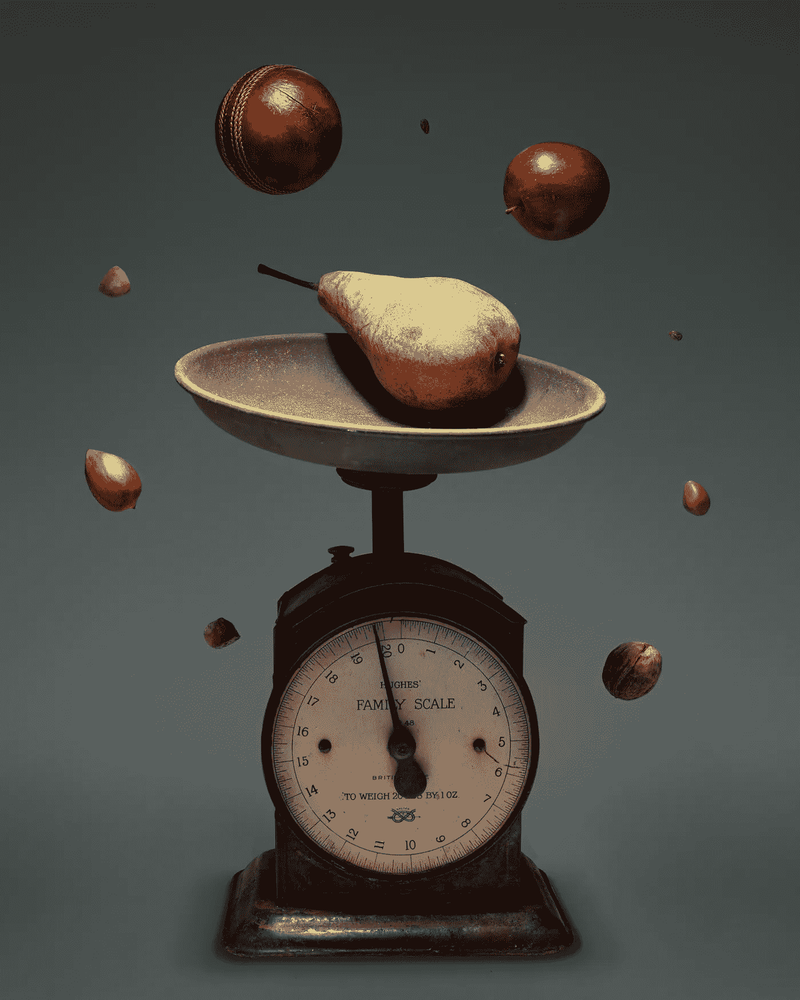

# 利用 Gemini-1.5-Pro-Latest 实现更智能的饮食

> 原文：[`towardsdatascience.com/leveraging-gemini-1-5-pro-latest-for-smarter-eating-64eeb4012ce7?source=collection_archive---------8-----------------------#2024-08-21`](https://towardsdatascience.com/leveraging-gemini-1-5-pro-latest-for-smarter-eating-64eeb4012ce7?source=collection_archive---------8-----------------------#2024-08-21)

## 学习如何使用 Google 的 Gemini-1.5-pro-latest 模型开发一个用于卡路里计数的生成式 AI 应用程序

 [Mary Ara](https://medium.com/@aramary?source=post_page---byline--64eeb4012ce7--------------------------------)

·发表于[Towards Data Science](https://towardsdatascience.com/?source=post_page---byline--64eeb4012ce7--------------------------------) ·阅读时长 8 分钟·2024 年 8 月 21 日

--

图片由[Pickled Stardust](https://unsplash.com/@pickledstardust?utm_content=creditCopyText&utm_medium=referral&utm_source=unsplash)提供，来源于[Unsplash](https://unsplash.com/photos/yellow-and-green-fruit-on-brown-weighing-scale-WTDiM3nezLQ?utm_content=creditCopyText&utm_medium=referral&utm_source=unsplash)

你有没有想过，在你吃晚餐时，你究竟摄入了多少卡路里？我经常这样想。如果你能通过一个应用程序，简单地上传一张你的盘子照片，就能在决定食物的摄入量之前，获得总卡路里的估算，那该有多好？

我创建的这个卡路里计数应用程序可以帮助你实现这一目标。它是一个 Python 应用程序，使用 Google 的 Gemini-1.5-Pro-Latest 模型来估算食物中的卡路里含量。

这个应用程序接受两个输入：一个关于食物的问题和一张食物或食物项的图片，或者简单地说，一盘食物。它会输出问题的答案、图片中食物的总卡路里数量，以及每个食物项的卡路里分解。

在本文中，我将解释从零开始构建应用程序的完整端到端过程，使用 Google 的 Gemini-1.5-pro-latest（Google 发布的大型生成式语言模型），以及我如何使用 Streamlit 开发该应用程序的前端。
