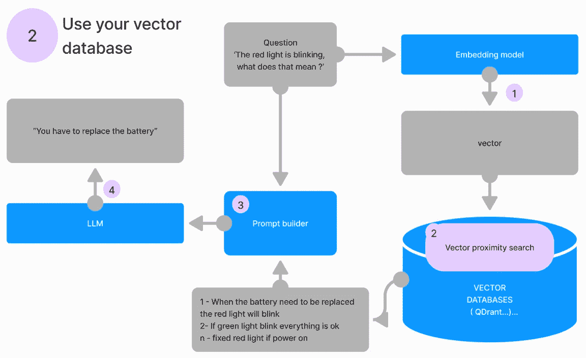

# 利用大语言模型提升商业效率

> 原文：[`towardsdatascience.com/leveraging-large-language-models-for-business-efficiency-b06cb943a286?source=collection_archive---------2-----------------------#2024-03-01`](https://towardsdatascience.com/leveraging-large-language-models-for-business-efficiency-b06cb943a286?source=collection_archive---------2-----------------------#2024-03-01)

## 实施大语言模型提升商业改善：逐步指南

[](https://medium.com/@benoit_courty?source=post_page---byline--b06cb943a286--------------------------------)[](https://towardsdatascience.com/?source=post_page---byline--b06cb943a286--------------------------------) [Benoît Courty](https://medium.com/@benoit_courty?source=post_page---byline--b06cb943a286--------------------------------)

·发表于 [Towards Data Science](https://towardsdatascience.com/?source=post_page---byline--b06cb943a286--------------------------------) ·15 分钟阅读·2024 年 3 月 1 日

--

**TL;DR:** 本文讨论了大语言模型如何提升公司流程。目标读者是具有技术背景的人，如软件架构师或首席技术官（CTO）。文章展示了如何高效使用大语言模型（LLM），你将学习如何利用现代技术，如检索增强生成（RAG）、函数调用和微调，并通过案例学习应用。

目录

· 识别商业需求

· 自己探索一个想法

· 创建评估数据集

· 考虑内部工业化

· 通过公司数据定制响应

· 通过函数调用使用 API

· 将任务分解为多个提示

· 通过微调提高性能

· 组合模型

· 结论


图片来自 [Andrea De Santis](https://unsplash.com/@santesson89?utm_source=medium&utm_medium=referral) 于 [Unsplash](https://unsplash.com/?utm_source=medium&utm_medium=referral)

在快速发展的技术环境中，人工智能（AI）和机器学习（ML）已成为推动创新、提高效率和竞争优势的关键力量，遍布各行各业。对于首席技术官（CTO）、IT 总监、技术项目经理和技术产品经理来说，理解并将这些技术融入商业战略已不再是可选项，而是必须。

大语言模型（LLM），如 ChatGPT，能够做的不仅仅是聊天，这一点并不令人惊讶。

我们将一步步探讨防止数据失真、提升操作效率并更好地利用贵公司资源的策略。

# 确定业务需求

您已经知道，像 ChatGPT、Gemini、Mistral 等大型语言模型（LLMs）已成为强大的工具，可以自动化任务并提升客户服务。作为一名商业决策者，了解 LLMs 的能力与局限性将帮助您做出有关其实施的明智决策。

利用大语言模型（LLMs）的第一步是识别一个可以自动化的任务，以改善客户服务或解放员工免于重复性任务。例如，LLMs 可以用于自动化文档中的信息检索、撰写报告或处理客户请求。

# 自己探索一个想法

一旦确定了业务需求，下一步是与 ChatGPT（或 Gemini）一起手动评估，估算当前生成性 AI 的推理能力是否足够满足需求。

您可以创建一组示例输入，并评估 ChatGPT 生成的响应的准确性。

假设您想要自动化公司收到的邮件分发。

您需要获取一些邮件并测试在线 LLM 是否能够整理它们并准备回应。


图片由[Serhat Beyazkaya](https://unsplash.com/@serhatbeyazkaya?utm_source=medium&utm_medium=referral)提供，来源于[Unsplash](https://unsplash.com/?utm_source=medium&utm_medium=referral)

这是一个示例提示：

```py
Our company is organized into several departments, each with distinct functions and areas of responsibility. Here's a brief overview:
Sales Department: This team is responsible for generating new business leads, negotiating deals, and maintaining relationships with existing clients.

Marketing Department: This department focuses on promoting our products and services, managing our brand reputation, and conducting market research.

Customer Service Department: This team handles inquiries, complaints, and support requests from our customers.

Human Resources Department: This department manages employee relations, recruitment, training, and benefits.

Technical Support Department: This team provides assistance with technical issues related to our products and services.

Finance Department: This department is responsible for managing the company's financial resources, including budgeting, forecasting, and financial reporting.

We want you to categorize the following email. I would like you to analyze the content of the email to determine the most suitable department. Here are some guidelines to help you with your analysis:
Look for keywords and phrases that indicate the email is related to sales, marketing, customer service, HR, technical support, or finance.

Consider the tone and context of the email. For example, an email that expresses frustration with a product may be best suited for the customer service department.

If an email contains multiple topics, categorize it based on the most prominent or urgent issue.

Part 3: Once you have analyzed the email and determined the most suitable department, please append your recommendations. Please ensure that your recommendations are accurate and consistent, as this will help us to improve our response times and provide better service to our customers.
Part 4: Write a model of response for the department
Here is the email:
```

你好，

我希望这封邮件能找到您一切安好。我写信是为了申请在即将到来的假期期间休假。具体来说，我希望请以下几天假：

12 月 20 日，星期一

12 月 21 日，星期二

12 月 22 日，星期三

12 月 23 日，星期四

12 月 24 日，星期五

我理解这是公司一年中最忙碌的时段，对我的缺席可能会带来的不便表示歉意。然而，我已经积累了足够的假期时间来覆盖这些天，我相信请假将使我得以休息，并以充沛的精力迎接新的一年。

如果我的请求有任何问题，或者您需要我提供其他信息，请告知。感谢您的时间和考虑。

此致，敬礼，[员工姓名]

```py
```

模型答案：

```py
Based on the content of the email, I would recommend categorizing it under the
__Human Resources Department.__
The email contains keywords such as "time off," "vacation time," and "absence,"
which are related to employee relations and benefits, which fall under the 
responsibilities of the HR department. The tone of the email is polite and 
professional, and the context indicates that the employee is requesting 
time off for personal reasons.
__Here is a model response for the HR department:__
Dear [Employee Name],
Thank you for your email and for providing ample notice regarding your time off request for the upcoming holiday season. We appreciate your consideration for the busy time of year and your accrued vacation time to cover your absence.
I am pleased to inform you that your request for time off from Monday, December 20th to Friday, December 24th has been approved. Please ensure that you have communicated your absence to your team and made any necessary arrangements to cover your responsibilities during your time off.
If you have any further questions or concerns, please do not hesitate to reach out to the Human Resources Department.
Thank you for your hard work and dedication to the company. We hope that you have a relaxing and enjoyable holiday season.
Best regards,
[Your Name] Human Resources Department.
```

⚠️ 不要犹豫继续调整提示，直到得到您希望复现的响应形式。这可能需要一些时间去适应。不要因为第一次失败或第一次成功就停下脚步。不要犹豫从头再来，甚至可以挑战模型为您编写一个提示。

⚠️ 不要忘记测试边缘情况，确保至少评估 80%的使用案例。

# 创建评估数据集

现在是时候扩大您的测试了。之前您已经证明它在少量示例下有效，现在请使用更多数据重新测试，以衡量准确度。

创建数据集对于评估一个过程至关重要。你可以使用这个数据集来测试模型，确保它满足你的业务需求。数据集应该代表你的业务可能遇到的真实世界场景。理想情况下，应该使用代码创建一个可重复的评估链。例如，通过从问题列表调用 OpenAI 的 API，并自动比较预期的答案。

通过 ChatGPT 订阅，查看 Explore GPTs，你还可以尝试 Data Analyst 上传 Excel 文件并与 AI 进行交互。

+   **编制电子邮件数据集**：首先组建一个包含 100 封样本电子邮件的 Excel 文件，这些是你的公司可能会接收到的邮件。

+   **草拟详细提示**

在这种情况下，你可以将提示结构化为三个部分：

+   **第一部分**：详细描述你公司内的各个部门，概述其具体职能和责任领域。

+   **第二部分**：将数据集引入模型，指示其分析每封电子邮件的内容，以确定最合适的部门。

+   **第三部分**：指示模型将其建议添加到 Excel 文件中的新列中，有效地对每封电子邮件进行分类。

+   **执行与评估**：利用提示让模型为每封电子邮件确定正确的接收部门。在模型处理后，审查其建议，以评估准确性和相关性。


示例数据集截图（由作者使用 Mistral-medium AI 生成）

在考虑进一步操作之前，你可以手动对每个答案进行评分，并计算平均值，以评估结果是否足够好。以我们的例子为例，记住这个用例是一个 <human>（电子邮件）到 <machine>（路由与建议回答）再到 <human>（部门）的工作流，所以可以容忍一定的错误：人类可以修改答案，或者部门可以将电子邮件重新路由到另一个……如果在 100 封邮件中发生 10 次这样的情况，可能就足够了。

# 考虑内部工业化

你可以通过使用外部提供商提供的 API，加快生产就绪解决方案的速度。

你可以使用 OpenAI API 或其他 API 来构建你的 MVP，但你需要考虑多个因素，包括：

+   **你提供给外部 API 或聊天的所有数据都会在某个地方被记录**

+   即使服务提供商声称不使用你的数据，你仍然应该对数据进行匿名化处理……

+   工业**机密泄露**风险：如果你在美国以外地区，请注意 OpenAI 受到 [Cloud Act](https://en.wikipedia.org/wiki/CLOUD_Act) 的约束。

+   **速度限制**：从 OpenAI 获取完整回复通常需要几秒钟，对于某些用例来说，这可能不够快。

+   **调用限制**：每秒的调用次数 [是有限制的](https://platform.openai.com/docs/guides/rate-limits?context=tier-five)，每月的最大费用也有限制。

+   **环境影响**：大型通用模型对环境有显著影响，在考虑使用这些模型时应将其纳入考量。

+   **成本波动**：例如，OpenAI API 的费用可能会波动，这会影响您的预算。

+   难以确立**竞争优势**：使用 OpenAI API 时，确立竞争优势可能很具挑战性，因为这些 API 对所有企业开放。

+   **稳定性**：像 Gemini、Mistral、Claude2、GPT4 等 LLM 私人模型并不总是稳定，您应当考虑监控回答的质量和稳定性。您还需要增加安全措施，以保护您的服务质量，并避免来自内外部的危险行为。问题可能出现在输入或输出环节。

为避免这些陷阱，您可以选择使用像 LLAMA 或 Mistral 这样的开源模型。这些开源替代方案提供了多个优势：

1.  **隐私与安全**：自托管模型降低了工业机密泄漏的风险。

1.  **定制化**：您可以微调开源模型，使其更好地适应您的特定业务需求。

1.  **更低的成本**：开源模型通常比专有解决方案便宜，尤其是在考虑调用次数和月度支出的限制时。

1.  **环境影响**：开源模型通常较小，可以针对特定的应用场景进行优化，可能会减少它们的环境足迹。你可以使用[CodeCarbon](https://codecarbon.io/)来衡量这一点。

1.  **竞争优势**：通过定制开源模型，您可以创建一个独特的解决方案，使您的业务在竞争中脱颖而出。

现在您已经自动化了电子邮件的路由，让我们来提高答案的质量。一种方法是将公司文档添加到模型的能力中，这样模型就能从您的文档中找到答案，而不是依赖其“记忆”。

# 使用公司数据定制回答

使用公司数据定制 LLM 的回答将为用户创造一个更准确、更量身定制的体验。


照片由[Yasamine June](https://unsplash.com/@yasamine?utm_source=medium&utm_medium=referral)提供，来源于[Unsplash](https://unsplash.com/?utm_source=medium&utm_medium=referral)

你不能将所有公司数据都放入提示中。这就是为什么[**检索增强生成**](https://docs.aws.amazon.com/sagemaker/latest/dg/jumpstart-foundation-models-customize-rag.html)(RAG)很有用，它是一种将数据库的信息检索与大型语言模型的生成能力结合起来的技术。通过使用 RAG，你可以提高回答的准确性。你还可以告诉用户哪些文档被用于生成回答。

RAG 技术可以通过以下公式简洁地表达：

<使用数十亿数据训练的 LLM> + <**您的提示**> + <**您的公司数据集**> = **与您的业务背景对齐的回答**

RAG 通常使用向量数据库，因为它在大多数情况下都有效，以下是如何创建该数据库：

1.  将您的文档按短章节进行拆分

1.  使用嵌入模型将章节转换为向量。相同主题的向量将在 n 维空间中接近。典型的向量是一个包含 1,024 个浮动值的数组。可以把它想象成每个值代表一个特征，比如颜色、大小、性别……它不是硬编码的，模型在训练时会自行找到这些值。

1.  将它们存储在向量数据库中


图片由作者提供

当您收到电子邮件时，您将像这样使用 RAG：

1.  将您客户的电子邮件转换为向量

1.  使用这个向量查询数据库，检索与段落最接近的 10 个向量

1.  将这些段落的文本添加到提示中

1.  向 LLM 询问答案

1.  答案将基于提示中提供的数据



图片由作者提供

如果您想了解更多，请阅读[**检索增强生成**](https://blogs.nvidia.com/blog/what-is-retrieval-augmented-generation/)(RAG)

现在您的答案将使用您的数据，因此有助于防止所谓的*幻觉*。

ℹ️ 模型幻觉（Hallucination）并不是一个容易处理的问题。因为 LLM 的“记忆”更像是人类的记忆（对世界的压缩表示），而不像计算机的精确内存。而且模型是经过训练来帮助您的，即使它们不知道答案，它们也会尽量提供帮助，错误信息可能会被呈现为事实。RAG 通过为模型提供相关数据来帮助应对这个问题。

RAG 对于非结构化数据非常有效，但有时您可能有更好的方式来回答问题，比如包含每个产品定价的表格数据，或者您甚至可能需要计算税款，或者寻找一个日程中的空位安排会议。让我们看看如何通过*函数调用*来实现。

# 使用 API 的函数调用

函数调用是一种允许 LLM 与您的企业 API 进行交互的方式，例如：

+   Salesforce，SAP 作为您的 ERP 系统

+   Service Now 或其他票务服务

+   日程

+   发票，定价

+   自定义 API 来执行贵公司中的任何操作

+   第三方 API

[函数调用](https://platform.openai.com/docs/guides/function-calling)是一个至关重要的功能，它允许您在不将 API 暴露给外界的情况下使用 API。这个功能为超越简单聊天应用程序的多种可能性打开了大门。例如，您可以将专门的内部服务或工具集成到 LLM 中，使其对您的业务更加多功能和有价值。您可以从客户处获取请求价格的邮件，将其发送给 LLM，将其转化为一个参数以调用定价 API，然后使用 API 的答案请 LLM 返回给客户写出回答。

给定请求：

> “
> 
> *你好，
> 
> 我真的很喜欢贵公司。我想为您订购一个太阳能面板安装轨道，请问价格是多少？
> 
> 最佳问候*

您将请求发送给 LLM，并提供您公司中存在的 API 定义：

```py
{
 "type": "function",
 "function": {
  "name": "multiply",
  "description": "Get product price.",
  "parameters": {
    "type": "object",
    "properties": {
      "product_name": {
      "description": "Name of the product",
      "type": "string"
      },
    "required": [ "product_name" ]
    }
  }
}
```

所以 LLM 从邮件中提取产品名称，并给出 JSON 以进行 API 调用：

```py
{
 "product_name": "solar panel mounting rail"
}
```

由你来调用 API，因此它是完全安全的：LLM 永远不知道你的 API 在哪里，只知道它能做什么。

API 的回答可以返回给 LLM，以构建自然语言答案。

> *您能否根据以下条件回复此邮件：“太阳能面板安装轨道”的价格是 10 美元，未含 5%的增值税？“你好，我非常喜欢你们公司。我想订购一个太阳能面板安装轨道，价格是多少？此致敬礼，您的客户”*

答复将是：

> *你好，*
> 
> *感谢您对我们公司的关注，并考虑我们的太阳能面板安装轨道。该安装轨道的价格为税前 10 美元，加上 5%的增值税，所以含税价为$10.50。*
> 
> *如果你有任何其他问题或想继续进行订单，请告诉我。*
> 
> *此致敬礼，*

所以你现在有了一个可以利用内部服务更好地准备客户答复的系统。如果你已经[投资于 API](https://blog.dreamfactory.com/api-first-the-advantages-of-an-api-first-approach-to-app-development/)，这将是一个游戏规则的改变者。

我们刚刚看到，我们可以对一个任务多次调用 LLM，让我们更详细地看看这个过程。

# 将任务分解为多个提示

重要的是要注意，单一提示通常不足以完成复杂任务。你的项目很可能需要将任务分解为多个提示，这些提示将串联起来并结合多种技术。

例如，[`360learning.com/`](https://360learning.com/)构建了一个平台，帮助基于单一文本文件输入使用 AI 创建在线课程。他们的流程使用了 9 个提示，进行了 30 次 OpenAI 调用，并结合 RAG 来实现目标。第一个提示要求对文档进行总结，第二个提示要求根据总结制定在线课程计划，然后使用 RAG 从标题开始逐步提取文档的各个部分，依此类推。

这里是他们演示的一些幻灯片：


来自[360learning](https://360learning.com/)的标题


来自[360learning](https://360learning.com/)的标题

视频来源：[`www.youtube.com/watch?v=1Eyc2GypnF4`](https://www.youtube.com/watch?v=1Eyc2GypnF4)（法语）

他们使用 LangChain，一个帮助创建这些类型 LLM 管道的框架。

ℹ️ 你可能听说过“AI 代理”：它们*只是*一种结合提示的方式，但无需事先编写提示。代理是对 LLM 的调用，用以获取任务列表。然后，为每个任务再进行一次 LLM 调用，依此类推。它在赋予 LLM 调用外部工具的能力时效果最佳，例如像我们之前看到的那样通过浏览网页的功能。

现在你拥有了一个强大的管道，但如何改进模型本身以获得更快和更好的回答呢？你可以对模型进行微调。

# 微调以提高性能

微调通常可以提高模型的性能，并在保持相同性能的同时减少其体积，因为你可以使用更小的模型，如[Mistral-7B](https://mistral.ai/news/announcing-mistral-7b/)，甚至是[Phi-2](https://www.microsoft.com/en-us/research/blog/phi-2-the-surprising-power-of-small-language-models/)。

很少有公司能够负担得起从头训练一个 LLM，因为这需要一个庞大的数据集和数百个 GPU，比如 Llama2-70B 大约需要 200 万 GPU 小时。但你可以选择一个已经预训练的模型并进行微调，在大多数情况下，只需要一个下午的微调时间。

缺点是你需要构建一个包含数百个问题和答案的训练数据集。

# 模型结合

这是一种将多个模型结合成一个模型的新技术。结果是一个大型模型，称为[专家混合模型](https://medium.aiplanet.com/create-your-own-mixture-of-experts-model-with-mergekit-and-runpod-8b3e91fb027a)（MoE），其能力超过同等大小的单一模型。实现这一点最简单的方法是使用[MergeKit](https://medium.com/towards-data-science/merge-large-language-models-with-mergekit-2118fb392b54)。


**由 AI 生成** — Bing Copilot — “一幅数学家、物理学家和机械工程师围坐在桌子旁，共同解决同一个问题，桌上摆放着一架拆解的无人机”

如果你很难决定使用哪个模型，这可能对你有帮助：在 MoE 中，由模型决定使用哪个。

# 结论

使用公司数据和 API 定制 LLM 的响应可以为用户创造更准确、更个性化的体验。微调能够提高性能，并且将任务分解为多个提示可以帮助处理复杂的任务。

尽管这一切看起来可能复杂且专门针对专家，但丰富的文档和众多库可以帮助简化实现。流行的库包括[HuggingFace](https://github.com/huggingface/transformers)、[Langchain](https://python.langchain.com/docs/get_started/introduction)、[HayStack](https://haystack.deepset.ai/)、[Axolotl](https://github.com/OpenAccess-AI-Collective/axolotl)等…

然而，不要忘记集成的成本。与任何项目一样，从一个功能原型过渡到在现有 IT 系统中完全工业化的解决方案，涉及的成本是相当可观的。你常常会发现，你公司的流程比预期的更复杂，或者数据需要进行一定的清理才能处理。

虽然大型语言模型提供了许多优势，但不要忽视“老牌”机器学习技术的优势，比如[随机森林](https://www.ibm.com/topics/random-forest)或[DistiliBert](https://huggingface.co/docs/transformers/model_doc/distilbert)。这些技术仍然具有价值，包括更快的处理速度、更易于集成到现有工具中、无需 GPU、较好的可解释性以及较低的成本。

我们希望这篇文章能为您如何将大型语言模型（LLM）纳入您的软件架构提供一些见解。

这篇文章由数据科学家 Benoît Courty 于 2024 年 2 月撰写，并在[UpScale](https://upscaleparis.ai/)的首席执行官 Stéphane Van-Bosterhaudt 的帮助下完成。

更多相关阅读：

+   云法案: [`en.wikipedia.org/wiki/CLOUD_Act`](https://en.wikipedia.org/wiki/CLOUD_Act)

+   RAG: [`blogs.nvidia.com/blog/what-is-retrieval-augmented-generation/`](https://blogs.nvidia.com/blog/what-is-retrieval-augmented-generation/)

+   嵌入式表示: `towardsdatascience.com/neural-network-embeddings-explained-4d028e6f0526`

+   函数调用: [`platform.openai.com/docs/guides/function-calling`](https://platform.openai.com/docs/guides/function-calling)

+   微调: [`mlabonne.github.io/blog/posts/A_Beginners_Guide_to_LLM_Finetuning.html`](https://mlabonne.github.io/blog/posts/A_Beginners_Guide_to_LLM_Finetuning.html)

+   专家混合模型: [`medium.aiplanet.com/create-your-own-mixture-of-experts-model-with-mergekit-and-runpod-8b3e91fb027a`](https://medium.aiplanet.com/create-your-own-mixture-of-experts-model-with-mergekit-and-runpod-8b3e91fb027a)
