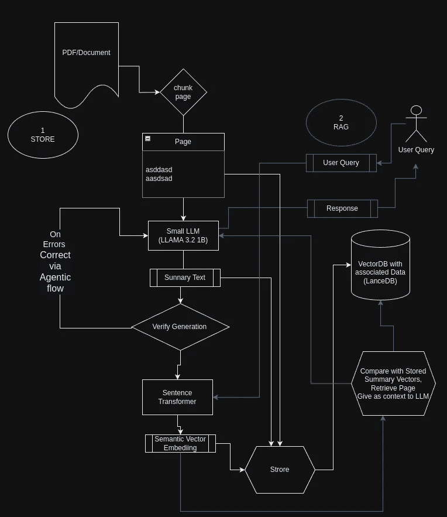

# 利用小型 LLMs 增强检索增强生成（RAG）

> 原文：[`towardsdatascience.com/leveraging-smaller-llms-for-enhanced-retrieval-augmented-generation-rag-bc320e71223d?source=collection_archive---------1-----------------------#2024-10-18`](https://towardsdatascience.com/leveraging-smaller-llms-for-enhanced-retrieval-augmented-generation-rag-bc320e71223d?source=collection_archive---------1-----------------------#2024-10-18)

## Llama-3.2–1 B-Instruct 与 LanceDB

[](https://alexcpn.medium.com/?source=post_page---byline--bc320e71223d--------------------------------)[](https://towardsdatascience.com/?source=post_page---byline--bc320e71223d--------------------------------) [Alex Punnen](https://alexcpn.medium.com/?source=post_page---byline--bc320e71223d--------------------------------)

·发表于[Towards Data Science](https://towardsdatascience.com/?source=post_page---byline--bc320e71223d--------------------------------) ·阅读时间：12 分钟·2024 年 10 月 18 日

--

**摘要**：检索增强生成（RAG）结合了大型语言模型与外部知识源，以生成更加准确和符合上下文的回答。本文探讨了如何有效利用小型语言模型（如最近开源的 Meta 10 亿模型）来总结和索引大型文档，从而提高 RAG 系统的效率和可扩展性。我们提供了一个详细的指南，附有代码片段，展示如何从产品文档 PDF 中提取文本摘要，并将其存储在 LanceDB 数据库中以便高效检索。

# 引言

检索增强生成（Retrieval-Augmented Generation，RAG）是一种通过将语言模型与外部知识库集成来增强其能力的范式。虽然像 GPT-4 这样的巨大语言模型（LLMs）已经展示了显著的能力，但它们也伴随着较高的计算成本。小型 LLMs 则提供了更为高效的资源使用替代方案，尤其适用于诸如文本摘要和关键词提取等任务，这些任务在 RAG 系统中的索引和检索过程中至关重要。

在本文中，我们将演示如何使用小型 LLM：

1.  **从 PDF 文档中提取并总结文本**。

1.  **为摘要和关键词生成嵌入向量**。

1.  **高效地将数据存储在 LanceDB 数据库中**。

1.  **用于有效的 RAG**

1.  **也可以为自我纠正 LLM 错误提供一个代理工作流**

使用小型 LLM 大大降低了对大规模数据集进行这些类型转换的成本，并且在处理简单任务时，可以获得与大型参数 LLMs 相似的效果，同时可以轻松地在企业环境或云端托管，且成本最小。

我们将使用[LLAMA 3.2 10 亿参数](https://ai.meta.com/blog/llama-3-2-connect-2024-vision-edge-mobile-devices/)模型，它是目前最小的先进大型语言模型（LLM）。



LLM 增强的 RAG（作者图像）

# 嵌入原始文本的问题

在开始实施之前，了解为什么从文档中嵌入原始文本在 RAG 系统中可能会引发问题非常重要。

# 无效的上下文捕捉

在没有总结的情况下直接从页面嵌入原始文本，通常会导致以下类型的嵌入：

+   **高维噪音**：原始文本可能包含无关信息、格式化伪影或套话，这些都不有助于理解核心内容。

+   **关键概念稀释**：重要概念可能埋藏在多余的文本中，使得嵌入无法有效代表关键信息。

# 检索低效

当嵌入无法准确表示文本的关键信念时，检索系统可能会失败：

+   **有效匹配用户查询**：嵌入可能与查询嵌入不匹配，导致相关文档检索效果差。

+   **提供正确的上下文**：即使检索到了文档，它可能无法提供用户所寻求的精确信息，因为嵌入中的噪音。

# 解决方案：在嵌入之前进行总结

在生成嵌入之前对文本进行总结，通过以下方式解决这些问题：

+   **提取关键信息**：总结提取了必要的要点和关键词，去除了不必要的细节。

+   **提高嵌入质量**：从总结中生成的嵌入更集中，并能更好地代表主要内容，从而提高检索的准确性。

# 前提条件

在我们开始之前，请确保已经安装以下内容：

+   Python 3.7 或更高版本

+   PyTorch

+   Transformers 库

+   SentenceTransformers

+   PyMuPDF（用于 PDF 处理）

+   LanceDB

+   配备 GPU 最少 6 GB 的笔记本电脑，或 Colab（T4 GPU 足够）或类似设备

# 步骤 1：设置环境

首先，导入所有必要的库并设置日志记录以进行调试和跟踪。

```py
import pandas as pd
import fitz  # PyMuPDF
from transformers import AutoModelForCausalLM, AutoTokenizer
import torch
import lancedb
from sentence_transformers import SentenceTransformer
import json
import pyarrow as pa
import numpy as np
import re
```

# 步骤 2：定义辅助函数

# 创建提示

我们定义一个函数，用于创建与 LLAMA 3.2 模型兼容的提示。

```py
def create_prompt(question):
    """
    Create a prompt as per LLAMA 3.2 format.
    """
    system_message = "You are a helpful assistant for summarizing text and result in JSON format"
    prompt_template = f'''
<|begin_of_text|><|start_header_id|>system<|end_header_id|>
{system_message}<|eot_id|><|start_header_id|>user<|end_header_id|>
{question}<|eot_id|><|start_header_id|>assistant1231231222<|end_header_id|>
'''
    return prompt_template
```

# 处理提示

该函数使用模型和分词器处理提示。我们将温度设置为 0.1，以使模型的创造性降低（减少幻觉现象）。

```py
def process_prompt(prompt, model, tokenizer, device, max_length=500):
    """
    Processes a prompt, generates a response, and extracts the assistant's reply.
    """
    prompt_encoded = tokenizer(prompt, truncation=True, padding=False, return_tensors="pt")
    model.eval()
    output = model.generate(
        input_ids=prompt_encoded.input_ids.to(device),
        max_new_tokens=max_length,
        attention_mask=prompt_encoded.attention_mask.to(device),
        temperature=0.1  # More deterministic
    )
    answer = tokenizer.decode(output[0], skip_special_tokens=True)
    parts = answer.split("assistant1231231222", 1)
   if len(parts) > 1:
        words_after_assistant = parts[1].strip()
        return words_after_assistant
    else:
        print("The assistant's response was not found.")
        return "NONE"
```

# 步骤 3：加载模型

我们使用 LLAMA 3.2 10 亿指令模型进行总结。我们以 bfloat16 加载模型以减少内存，并在 NVIDIA 笔记本 GPU（NVIDIA GeForce RTX 3060 6 GB / 驱动程序 NVIDIA-SMI 555.58.02 / Cuda 编译工具，版本 12.5，V12.5.40）下运行 Linux 操作系统。

更好的做法是通过 vLLM 或更好的[exLLamaV2](https://github.com/turboderp/exllamav2)进行托管

```py
model_name_long = "meta-llama/Llama-3.2-1B-Instruct"
tokenizer = AutoTokenizer.from_pretrained(model_name_long)
device = torch.device("cuda" if torch.cuda.is_available() else "cpu")
log.info(f"Loading the model {model_name_long}")
bf16 = False
fp16 = True
if torch.cuda.is_available():
    major, _ = torch.cuda.get_device_capability()
    if major >= 8:
        log.info("Your GPU supports bfloat16: accelerate training with bf16=True")
        bf16 = True
        fp16 = False
# Load the model
device_map = {"": 0}  # Load on GPU 0
torch_dtype = torch.bfloat16 if bf16 else torch.float16
model = AutoModelForCausalLM.from_pretrained(
    model_name_long,
    torch_dtype=torch_dtype,
    device_map=device_map,
)
log.info(f"Model loaded with torch_dtype={torch_dtype}")
```

# 步骤 4：读取和处理 PDF 文档

我们从 PDF 文档的每一页提取文本。

```py
file_path = './data/troubleshooting.pdf'
dict_pages = {}
# Open the PDF file
with fitz.open(file_path) as pdf_document:
    for page_number in range(pdf_document.page_count):
        page = pdf_document.load_page(page_number)
        page_text = page.get_text()
        dict_pages[page_number] = page_text
        print(f"Processed PDF page {page_number + 1}")
```

# 步骤 5：设置 LanceDB 和 SentenceTransformer

我们初始化了 SentenceTransformer 模型以生成嵌入，并设置了 LanceDB 来存储数据。我们使用基于 PyArrow 的 Schema 来构建 LanceDB 表。

请注意，当前关键词未被使用，但如果需要，可以用于混合搜索，即矢量相似度搜索和文本搜索。

```py
# Initialize the SentenceTransformer model
sentence_model = SentenceTransformer('all-MiniLM-L6-v2')
# Connect to LanceDB
db = lancedb.connect('./data/my_lancedb')
# Define the schema using PyArrow
schema = pa.schema([
    pa.field("page_number", pa.int64()),
    pa.field("original_content", pa.string()),
    pa.field("summary", pa.string()),
    pa.field("keywords", pa.string()),
    pa.field("vectorS", pa.list_(pa.float32(), 384)),  # Embedding size of 384
    pa.field("vectorK", pa.list_(pa.float32(), 384)),
])
# Create or connect to a table
table = db.create_table('summaries', schema=schema, mode='overwrite')
```

# 第 6 步：总结和存储数据

我们遍历每一页，生成摘要和关键词，并将它们与嵌入一起存储到数据库中。

```py
# Loop through each page in the PDF
for page_number, text in dict_pages.items():
    question = f"""For the given passage, provide a long summary about it, incorporating all the main keywords in the passage.
Format should be in JSON format like below:
{{
    "summary": <text summary>,
    "keywords": <a comma-separated list of main keywords and acronyms that appear in the passage>,
}}
Make sure that JSON fields have double quotes and use the correct closing delimiters.
Passage: {text}"""

    prompt = create_prompt(question)
    response = process_prompt(prompt, model, tokenizer, device)

    # Error handling for JSON decoding
    try:
        summary_json = json.loads(response)
    except json.decoder.JSONDecodeError as e:
        exception_msg = str(e)
        question = f"""Correct the following JSON {response} which has {exception_msg} to proper JSON format. Output only JSON."""
        log.warning(f"{exception_msg} for {response}")
        prompt = create_prompt(question)
        response = process_prompt(prompt, model, tokenizer, device)
        log.warning(f"Corrected '{response}'")
        try:
            summary_json = json.loads(response)
        except Exception as e:
            log.error(f"Failed to parse JSON: '{e}' for '{response}'")
            continue

    keywords = ', '.join(summary_json['keywords'])

    # Generate embeddings
    vectorS = sentence_model.encode(summary_json['summary'])
    vectorK = sentence_model.encode(keywords)

    # Store the data in LanceDB
    table.add([{
        "page_number": int(page_number),
        "original_content": text,
        "summary": summary_json['summary'],
        "keywords": keywords,
        "vectorS": vectorS,
        "vectorK": vectorK
    }])

    print(f"Data for page {page_number} stored successfully.")
```

# 使用 LLM 来修正它们的输出

在生成摘要和提取关键词时，LLM 有时会生成格式不符合预期的输出，比如格式错误的 JSON。

我们可以利用 LLM 本身来修正这些输出，通过提示它修复错误。如上面的代码所示。

```py
# Use the Small LLAMA 3.2 1B model to create summary
for page_number, text in dict_pages.items():
    question = f"""For the given passage, provide a long summary about it, incorporating all the main keywords in the passage.
    Format should be in JSON format like below: 
    {{
        "summary": <text summary> example "Some Summary text",
        "keywords": <a comma separated list of main keywords and acronyms that appear in the passage> example ["keyword1","keyword2"],
    }}
    Make sure that JSON fields have double quotes, e.g., instead of 'summary' use "summary", and use the closing and ending delimiters.
    Passage: {text}"""
    prompt = create_prompt(question)
    response = process_prompt(prompt, model, tokenizer, device)
    try:
        summary_json = json.loads(response)
    except json.decoder.JSONDecodeError as e:
        exception_msg = str(e)
        # Use the LLM to correct its own output
        question = f"""Correct the following JSON {response} which has {exception_msg} to proper JSON format. Output only the corrected JSON.
        Format should be in JSON format like below: 
        {{
            "summary": <text summary> example "Some Summary text",
            "keywords": <a comma separated list of keywords and acronyms that appear in the passage> example ["keyword1","keyword2"],
        }}"""
        log.warning(f"{exception_msg} for {response}")
        prompt = create_prompt(question)
        response = process_prompt(prompt, model, tokenizer, device)
        log.warning(f"Corrected '{response}'")
        # Try parsing the corrected JSON
        try:
            summary_json = json.loads(response)
        except json.decoder.JSONDecodeError as e:
            log.error(f"Failed to parse corrected JSON: '{e}' for '{response}'")
            continue
```

在这段代码中，如果 LLM 的初始输出无法解析为 JSON，我们会再次提示 LLM 修正 JSON 格式。这个自我修正模式提高了我们管道的健壮性。

假设 LLM 生成了以下格式错误的 JSON：

```py
{
    'summary': 'This page explains the installation steps for the product.',
    'keywords': ['installation', 'setup', 'product']
}
```

尝试解析这个 JSON 时，由于使用了单引号而不是双引号，结果会出现错误。我们捕获这个错误并提示 LLM 进行修正：

```py
exception_msg = "Expecting property name enclosed in double quotes"
question = f"""Correct the following JSON {response} which has {exception_msg} to proper JSON format. Output only the corrected JSON."""
```

然后，LLM 提供修正后的 JSON：

```py
{
    "summary": "This page explains the installation steps for the product.",
    "keywords": ["installation", "setup", "product"]
}
```

通过使用 LLM 修正它自己的输出，我们确保数据格式正确，便于后续处理。

# 通过 LLM 代理扩展自我修正

使用 LLM 来修正其输出的模式可以通过**LLM 代理**来扩展和自动化。LLM 代理可以：

+   **自动化错误处理**：检测错误并自主决定如何修正它们，无需明确的指示。

+   **提高效率**：减少手动干预或额外代码的需求来进行错误修正。

+   **增强健壮性**：从错误中持续学习，改进未来的输出。

**LLM 代理**充当中介，管理信息流并智能地处理异常。它们可以被设计成：

+   解析输出并验证格式。

+   遇到错误时，重新提示 LLM 并提供精炼的指令。

+   记录错误和修正，以便未来参考和模型微调。

**近似实现**：

不需要手动捕获异常并重新提示，LLM 代理可以封装这些逻辑：

```py
def generate_summary_with_agent(text):
    agent = LLMAgent(model, tokenizer, device)
    question = f"""For the given passage, provide a summary and keywords in proper JSON format."""
    prompt = create_prompt(question)
    response = agent.process_and_correct(prompt)
    return response
```

`LLMAgent`类将处理初始处理、错误检测、重新提示和内部修正。

现在，让我们看看如何使用嵌入来有效地使用 RAG 模式，再次利用 LLM 帮助进行排序。

# 检索和生成：处理用户查询

这是通常的流程。我们获取用户的问题并搜索最相关的摘要。

```py
# Example usage
user_question = "Not able to manage new devices"
results = search_summary(user_question, sentence_model)
```

# 准备检索到的摘要

我们将检索到的摘要编译成一个列表，并将每个摘要与其页码关联以供参考。

```py
summary_list = []
for idx, result in enumerate(results):
    summary_list.append(f"{result['page_number']}# {result['summary']}")
```

# 排序摘要

我们提示语言模型根据摘要与用户问题的相关性对其进行排序，并选择最相关的一个。这是通过使用 LLM 排序摘要，而非单纯使用 K-最近邻或余弦距离等排序算法来进行上下文嵌入（向量）匹配。

```py
question = f"""From the given list of summaries {summary_list}, rank which summary would possibly have \
the answer to the question '{user_question}'. Return only that summary from the list."""
log.info(question) 
```

# 提取选定摘要并生成最终答案

我们从与所选摘要相关的原始内容中检索信息，并提示语言模型使用这些上下文生成详细的回答来回应用户的问题。

```py
for idx, result in enumerate(results):
    if int(page_number) == result['page_number']:
        page = result['original_content']
        question = f"""Can you answer the query: '{user_question}' \
using the context below?
Context: '{page}'
"""
        log.info(question)
        prompt = create_prompt(
            question,
            "You are a helpful assistant that will go through the given query and context, think in steps, and then try to answer the query \
with the information in the context."
        )
        response = process_prompt(prompt, model, tokenizer, device, temperature=0.01)  # Less freedom to hallucinate
        log.info(response)
        print("Final Answer:")
        print(response)
        break
```

# 工作流说明

1.  **用户查询向量化**：用户的问题通过与索引过程中使用的相同的 SentenceTransformer 模型转换为嵌入。

1.  **相似度搜索**：查询嵌入用于在向量数据库（LanceDB）中搜索最相似的摘要，并返回前三个。

```py
>>  From the VectorDB Cosine search and Top 3 nearest neighbour search result, 
prepended by linked page numbers

07:04:00 INFO:From the given list of summary [[
'112# Cannot place newly discovered device in managed state', 
'113# The passage discusses the troubleshooting steps for managing newly discovered devices on the NSF platform, specifically addressing issues with device placement, configuration, and deployment.',
'116# Troubleshooting Device Configuration Backup Issue']] rank which summary would possibly have the possible answer to the question Not able to manage new devices. Return only that summary from the list
```

**3\. 摘要排序**：检索到的摘要被传递给语言模型，模型根据与用户问题的相关性对它们进行排序。

```py
>> Asking LLM to Select from the Top N based on context

07:04:01 INFO:Selected Summary ''113# The passage discusses the troubleshooting steps for managing newly discovered devices on the NSF (Network Systems and Functional Requirements) platform, specifically addressing issues with device placement, configuration, and deployment.''
```

**4\. 上下文检索**：通过解析页码并从 LanceDB 获取相关页面，检索与最相关摘要关联的原始内容。

```py
07:04:01 INFO:Page number: 113
07:04:01 INFO:Can you answer the question or query or provide more deatils query:'Not able to manage new devices'         Using the context below
        context:'3 
Check that the server and client platforms are appropriately sized. ...
Failed SNMP communication between the server and managed device.
SNMP traps from managed devices are arriving at one server, 
or no SNMP traps are ....
'
```

**5\. 答案生成**：语言模型使用检索到的上下文生成详细的回答来回应用户的问题。

这里是我使用的一个示例 PDF 文件的输出示例

```py
07:04:08 INFO:I'll go through the steps and provide more details to answer the query.

The query is: "Not able to manage new devices"

Here's my step-by-step analysis:

**Step 1: Check that the server and client platforms are appropriately sized**

The context mentions that the NSP Planning Guide is available, which implies that the NSP (Network Service Provider) has a planning process to ensure that the server and client platforms are sized correctly. This suggests that the NSP has a process in place to evaluate the performance and capacity of the server and client platforms to determine if they are suitable for managing new devices.

**Step 2: Check for resynchronization problems between the managed network and the NFM-P**

The context also mentions that resynchronization problems between the managed network and the NFM-P can cause issues with managing new devices. This implies that there may be a problem with the communication between the server and client platforms, which can prevent new devices from being successfully managed.

**Step 3: Check for failed SNMP communication between the server and managed device**

The context specifically mentions that failed SNMP communication between the server and managed device can cause issues with managing new devices. This suggests that there may be a problem with the communication between the server and the managed device, which can prevent new devices from being successfully managed.

**Step 4: Check for failed deployment of the configuration request**

The context also mentions that failed deployment of the configuration request can cause issues with managing new devices. This implies that there may be a problem with the deployment process, which can prevent new devices from being successfully managed.

**Step 5: Perform the following steps**

The context instructs the user to perform the following steps:

1\. Choose Administration→NE Maintenance→Deployment from the XXX main menu.
2\. The Deployment form opens, listing incomplete deployments, deployer, tag, state, and other information.

Based on the context, it appears that the user needs to review the deployment history to identify any issues that may be preventing the deployment of new devices.

**Answer**

Based on the analysis, the user needs to:

1\. Check that the server and client platforms are appropriately sized.
2\. Check for resynchronization problems between the managed network and the NFM-P.
3\. Check for failed SNMP communication between the server and managed device.
4\. Check for failed deployment of the configuration request.

By following these steps, the user should be able to identify and resolve the issues preventing the management of
```

# 结论

我们可以使用像 LLAMA 3.2 1B Instruct 这样的较小 LLM 高效地总结和提取大型文档的关键词。这些摘要和关键词可以嵌入并存储在像 LanceDB 这样的数据库中，从而通过工作流中使用 LLM 而不仅仅是生成中，启用高效的检索供 RAG 系统使用。

# 参考文献

+   Meta LLAMA 3.2 1B Instruct 模型

+   [SentenceTransformers](https://www.sbert.net/)

+   [LanceDB](https://lancedb.com/)

+   [PyMuPDF 文档](https://pymupdf.readthedocs.io/en/latest/)

+   [Github 仓库](https://github.com/alexcpn/llmenhancedrag)用于此项目
