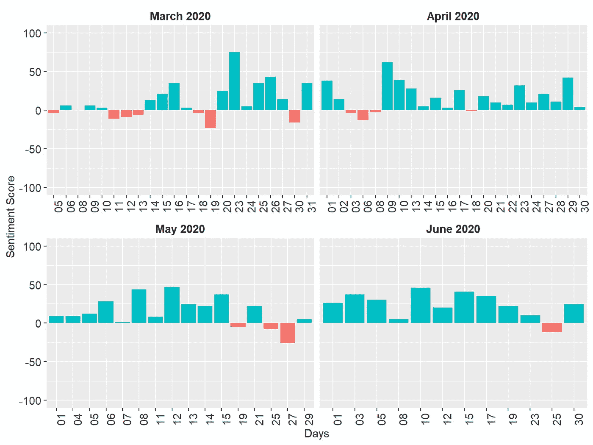

# 基于词典的情感分析使用 R 语言

> 原文：[`towardsdatascience.com/lexicon-based-sentiment-analysis-using-r-5c1db85984a1?source=collection_archive---------13-----------------------#2024-02-13`](https://towardsdatascience.com/lexicon-based-sentiment-analysis-using-r-5c1db85984a1?source=collection_archive---------13-----------------------#2024-02-13)

## 一项关于 COVID-19 大流行期间媒体简报所传达情感的实证分析

[](https://drokanbulut.medium.com/?source=post_page---byline--5c1db85984a1--------------------------------)[](https://towardsdatascience.com/?source=post_page---byline--5c1db85984a1--------------------------------) [Okan Bulut](https://drokanbulut.medium.com/?source=post_page---byline--5c1db85984a1--------------------------------)

·发布于[Towards Data Science](https://towardsdatascience.com/?source=post_page---byline--5c1db85984a1--------------------------------) ·14 分钟阅读·2024 年 2 月 13 日

--


图片由[Gino Crescoli](https://pixabay.com/users/absolutvision-6158753/?utm_source=link-attribution&utm_medium=referral&utm_campaign=image&utm_content=2979107)提供，来源于[Pixabay](https://pixabay.com//?utm_source=link-attribution&utm_medium=referral&utm_campaign=image&utm_content=2979107)

在 COVID-19 大流行期间，我决定学习一项新的统计技术，以便让自己不至于总是沉浸在与大流行相关的新闻中。经过评估多个选项后，我发现与自然语言处理（NLP）相关的概念特别吸引人。因此，我决定深入研究这个领域，并探索其中一种具体的技术：情感分析，也被学术文献称为“意见挖掘”。这种分析方法使研究人员能够提取并解释写作文本中传达的情感，针对特定主题进行情感的分析。通过情感分析，人们可以辨别情感的极性（正面或负面）、性质以及在各种文本格式（如文档、客户评价和社交媒体帖子）中的强度。

在疫情期间，我观察到许多研究人员将情感分析作为衡量公众对与病毒相关的新闻和发展反应的工具。这包括分析用户生成的内容，主要来自 Twitter、YouTube 和 Instagram 等流行社交媒体平台。由于对这种方法产生了兴趣，我和我的同事们努力通过分析公共卫生机构提供的每日简报，来为现有的研究贡献力量。在阿尔伯塔省，曾担任该省首席公共卫生官的**迪娜·辛肖**博士定期发布[关于该地区应对疫情的更新](https://www.youtube.com/watch?v=fvw_USRfXgY)。通过分析这些公共卫生公告，我们旨在评估阿尔伯塔省在这一复杂公共卫生危机中实施沟通策略的有效性。我们的研究采用情感分析的方法，旨在揭示在这个充满挑战的公共卫生时期中，所采取的沟通策略的效果[1, 2]。

在这篇文章中，我将引导你们了解如何使用 R 进行情感分析。具体来说，我将重点介绍“基于词典的情感分析”，并在下一节中对此进行更详细的讨论。我将提供一些我们之前引用的出版物中整合的基于词典的情感分析的例子。此外，在未来的文章中，我还将深入探讨更先进的情感分析方法，利用[Hugging Face](https://huggingface.co/docs/transformers/en/index)上可访问的最先进的预训练模型。

# 基于词典的情感分析

在我深入了解情感分析的过程中，我发现提取情感的主要方法是基于词典的情感分析。这种方法涉及使用特定的词典，即语言或主题的词汇，来识别给定文本中所表达的情感的方向和强度。有些词典，如 Bing 词典[3]，将单词分类为正面或负面。相反，其他词典则提供更详细的情感标签，例如 NRC 情感词典[4]，它根据正面和负面情感对单词进行分类，还包括普鲁奇克的[5]基本情感的心理进化理论（例如，愤怒、恐惧、期待、信任、惊讶、悲伤、喜悦和厌恶）。

基于词典的情感分析通过将给定文本中的词与广泛使用的词典（如 NRC 和 Bing）中的词进行对比来进行。每个词会被赋予一个情感值，通常被分类为正面或负面。文本的总体情感得分是通过对文本中各个单词的情感得分进行求和得出的。例如，在一种情况下，如果文本中有 50 个正面词和 30 个负面词，按照 Bing 词典的标准，最终的情感得分将是 20。这个值表示文本中正面情感占主导地位。相反，如果得分为负数，则表示负面情感占主导地位。

使用 R 进行基于词典的情感分析既有趣又充满挑战。在分析公共卫生公告的情感时，我发现 Julia Silge 和 David Robinson 的书籍，[*Text Mining with R*](https://www.tidytextmining.com/) 非常有帮助。书中有[专门讨论情感分析的章节](https://www.tidytextmining.com/sentiment)，在该章节中，作者展示了如何使用像 Bing 和 NRC 这样的通用词典进行情感分析。然而，Julia 和 David 也强调了基于词典的情感分析的一个主要局限性。该分析仅考虑单个词（即单一词汇），而不考虑词前的修饰语。例如，像“not”这样的否定词在“not true”中会被忽略，情感分析将其处理为两个独立的词，“not”和“true”。此外，如果某个特定的词（无论是正面还是负面）在文本中反复出现，这可能会根据该词的情感倾向（正面或负面）扭曲结果。因此，基于词典的情感分析结果应该谨慎解读。

现在，让我们进入我们的示例，我们将使用 Dr. Deena Hinshaw 在 COVID-19 大流行期间的媒体简报进行基于词典的情感分析。我的目标是展示两个能够进行情感分析的 R 包 📉。

# 示例

为了简化，我们将专注于疫情的第一波（2020 年 3 月 — 2020 年 6 月）。所有媒体简报的文字记录在阿尔伯塔省政府的 COVID-19 疫情网站上公开发布（[`www.alberta.ca/covid`](https://www.alberta.ca/covid)）。该数据集附带一个[开放数据许可证](https://open.alberta.ca/licence)，允许公众访问和使用这些信息，包括用于商业目的。在将这些文字记录导入 R 后，我将所有文本转换为小写字母，然后使用**tidytext**和**tokenizers**包进行词元化。词元化将媒体简报中的句子拆分为每个条目的单个单词（即，媒体简报的每一天）。接下来，我使用**textstem**包对词元进行了词形还原，将每个单词转化为其规范形式。最后，我使用 stopwords 包移除了常见的停用词，如“my”、“for”、“that”、“with”和“for”。最终的数据集可以在[**此处**](https://github.com/okanbulut/blog/raw/master/data_and_codes/wave1_alberta.RData)获得。现在，让我们将数据导入 R 并查看其内容。

```py
load("wave1_alberta.RData")

head(wave1_alberta, 10)
```


数据集预览（作者提供的图像）

数据集有三列：

+   月份（媒体简报的月份）

+   日期（媒体简报的确切日期），以及

+   单词（媒体简报中使用的单词或词元）

## 描述性分析

现在，我们可以计算一些描述性统计数据，以更好地理解数据集的内容。我们将首先按月份（基于词频）找出前 5 个单词。

```py
library("dplyr")

wave1_alberta %>%
  group_by(month) %>%
  count(word, sort = TRUE) %>%
  slice_head(n = 5) %>%
  as.data.frame()
```


按月份排序的前 5 个单词（作者提供的图像）

输出显示，在这 4 个月的媒体简报中，“health”、“continue”和“test”等词语被频繁使用。我们还可以扩展我们的列表，查看最常用的 10 个单词，并以可视化方式呈现结果：

```py
library("tidytext")
library("ggplot2")

wave1_alberta %>%
  # Group by month
  group_by(month) %>%
  count(word, sort = TRUE) %>%
  # Find the top 10 words
  slice_head(n = 10) %>%
  ungroup() %>%
  # Order the words by their frequency within each month
  mutate(word = reorder_within(word, n, month)) %>%
  # Create a bar graph
  ggplot(aes(x = n, y = word, fill = month)) +
  geom_col() +
  scale_y_reordered() +
  facet_wrap(~ month, scales = "free_y") +
  labs(x = "Frequency", y = NULL) +
  theme(legend.position = "none",
        axis.text.x = element_text(size = 11),
        axis.text.y = element_text(size = 11),
        strip.background = element_blank(),
        strip.text = element_text(colour = "black", face = "bold", size = 13))
```


基于频率的最常用单词（作者提供的图像）

由于一些词汇在四个月内都是通用的，上面的图表可能无法直接展示每个月特有的重要词汇。为了找出这些重要的词汇，我们可以使用词频-逆文档频率（TF-IDF）技术——这是一种在自然语言处理（NLP）中广泛使用的技术，用于衡量一个词在文档中相对于一组文档的重要性（有关 TF-IDF 的详细信息，请查看[我之前的博客文章](https://okan.cloud/posts/2022-01-16-text-vectorization-using-python-tf-idf/#tf-idf)）。在我们的例子中，我们将每个月的媒体简报视为一个文档，并计算文档中每个词汇的 TF-IDF。下面的 R 代码第一部分通过计算所有词汇的 TF-IDF 并选择每个月内 TF-IDF 值最高的词汇，创建了一个新的数据集，*wave1_tf_idf*。接下来，我们使用该数据集创建一个条形图，显示每个月特有的常见词汇。

```py
# Calculate TF-IDF for the words for each month
wave1_tf_idf <- wave1_alberta %>%
  count(month, word, sort = TRUE) %>%
  bind_tf_idf(word, month, n) %>%
  arrange(month, -tf_idf) %>%
  group_by(month) %>%
  top_n(10) %>%
  ungroup

# Visualize the results
wave1_tf_idf %>%
  mutate(word = reorder_within(word, tf_idf, month)) %>%
  ggplot(aes(word, tf_idf, fill = month)) +
  geom_col(show.legend = FALSE) + 
  facet_wrap(~ month, scales = "free", ncol = 2) +
  scale_x_reordered() +
  coord_flip() +
  theme(strip.background = element_blank(),
        strip.text = element_text(colour = "black", face = "bold", size = 13),
        axis.text.x = element_text(size = 11),
        axis.text.y = element_text(size = 11)) +
  labs(x = NULL, y = "TF-IDF")
```


基于 TF-IDF 的最常见词汇（图片来自作者）

这些结果提供了更多的信息，因为图中显示的词汇反映了每个月讨论的独特主题。例如，在 2020 年 3 月，媒体简报主要讨论了限制旅行、从人群密集的会议返回以及邮轮上的 COVID-19 病例。到了 2020 年 6 月，媒体简报的重点转向了口罩要求、人们抗议与疫情相关的限制等等。

在我们切换回情感分析之前，让我们看看另一个描述性变量：每个媒体简报的长度。这将帮助我们了解媒体简报随着时间的推移是变得更长还是更短。

```py
wave1_alberta %>%
  # Save "day" as a separate variable
  mutate(day = substr(date, 9, 10)) %>%
  group_by(month, day) %>%
  # Count the number of words
  summarize(n = n()) %>%
  ggplot(aes(day, n, color = month, shape = month, group = month)) +
  geom_point(size = 2) + 
  geom_line() + 
  labs(x = "Days", y = "Number of Words") +
  theme(legend.position = "none", 
        axis.text.x = element_text(angle = 90, size = 11),
        strip.background = element_blank(),
        strip.text = element_text(colour = "black", face = "bold", size = 11),
        axis.text.y = element_text(size = 11)) +
  ylim(0, 800) +
  facet_wrap(~ month, scales = "free_x")
```


每日媒体简报中的词汇数（图片来自作者）

上面的图表显示了媒体简报的长度随时间变化较大。特别是在 3 月和 5 月，媒体简报的长度波动较大（即，极长或极短的简报），而在 6 月，媒体简报的日常长度较为一致。

## 使用 tidytext 进行情感分析

在对数据集进行描述性分析后，我们准备开始进行情感分析。在第一部分中，我们将使用**tidytext**包来执行情感分析并计算情感得分。我们首先将词典导入 R 中，然后将它们与我们的数据集合并。使用 Bing 词典时，我们需要计算正面和负面词汇的差异，以产生情感得分（即，情感 = 正面词汇的数量 — 负面词汇的数量）。

```py
# From the three lexicons, Bing is already available in the tidytext page
# for AFINN and NRC, install the textdata package by uncommenting the next line
# install.packages("textdata")
get_sentiments("bing")
get_sentiments("afinn") 
get_sentiments("nrc")

# We will need the spread function from tidyr
library("tidyr")

# Sentiment scores with bing (based on frequency)
wave1_alberta %>%
  mutate(day = substr(date, 9, 10)) %>%
  group_by(month, day) %>%
  inner_join(get_sentiments("bing")) %>%
  count(month, day, sentiment) %>%
  spread(sentiment, n) %>%
  mutate(sentiment = positive - negative) %>%
  ggplot(aes(day, sentiment, fill = month)) +
  geom_col(show.legend = FALSE) +
  labs(x = "Days", y = "Sentiment Score") +
  ylim(-50, 50) + 
  theme(legend.position = "none", axis.text.x = element_text(angle = 90)) +
  facet_wrap(~ month, ncol = 2, scales = "free_x") +
  theme(strip.background = element_blank(),
        strip.text = element_text(colour = "black", face = "bold", size = 11),
        axis.text.x = element_text(size = 11),
        axis.text.y = element_text(size = 11))
```


基于 Bing 词典的情感得分（图片来自作者）

上图显示，媒体简报中的情感通常是负面的，这并不令人惊讶，因为这些简报主要讲述了有多少人去世、住院率、潜在爆发等问题。在某些日期（例如 2020 年 3 月 24 日和 2020 年 5 月 4 日），媒体简报的情感尤为负面。

接下来，我们将使用 AFINN 词典。与将词语标记为积极或消极的 Bing 不同，AFINN 为每个词语分配一个数值权重。权重的符号表示情感的极性（即积极或消极），而数值则表示情感的强度。现在，让我们看看这些加权值是否会产生不同的情感得分。

```py
wave1_alberta %>%
  mutate(day = substr(date, 9, 10)) %>%
  group_by(month, day) %>%
  inner_join(get_sentiments("afinn")) %>%
  group_by(month, day) %>%
  summarize(sentiment = sum(value),
            type = ifelse(sentiment >= 0, "positive", "negative")) %>%
  ggplot(aes(day, sentiment, fill = type)) +
  geom_col(show.legend = FALSE) +
  labs(x = "Days", y = "Sentiment Score") +
  ylim(-100, 100) + 
  facet_wrap(~ month, ncol = 2, scales = "free_x") +
  theme(legend.position = "none", 
        strip.background = element_blank(),
        strip.text = element_text(colour = "black", face = "bold", size = 11),
        axis.text.x = element_text(size = 11, angle = 90),
        axis.text.y = element_text(size = 11))
```



基于 AFINN 词典的情感得分（图片来源：作者）

基于 AFINN 词典的结果似乎大不相同！一旦我们考虑到词语的“权重”，大多数媒体简报的情感被认为是积极的（见绿色条形图），尽管仍然有一些日子存在负面情感（见红色条形图）。到目前为止，我们做的两项分析结果差异很大，原因有二。首先，正如我之前提到的，Bing 词典专注于词语的极性，而忽略了词语的强度（“不喜欢”和“仇恨”被认为是强度相同的消极词语）。与 Bing 词典不同，AFINN 词典考虑了词语的强度，这影响了情感得分的计算。其次，Bing 词典（6786 个词语）比 AFINN 词典（2477 个词语）要大得多。因此，媒体简报中的一些标记可能被包含在 Bing 词典中，但不在 AFINN 词典中。忽略这些标记可能影响了结果。

我们接下来将尝试使用 **tidytext** 包中的最终词典是 NRC。正如我之前提到的，这个词典基于 Plutchik 的心理进化理论，对标记的词语进行分类，主要依据基本情感，如愤怒、恐惧和预期。我们将统计与每种情感相关的单词或标记数量，并可视化结果。

```py
wave1_alberta %>%
  mutate(day = substr(date, 9, 10)) %>%
  group_by(month, day) %>%
  inner_join(get_sentiments("nrc")) %>%
  count(month, day, sentiment) %>%
  group_by(month, sentiment) %>%
  summarize(n_total = sum(n)) %>%
  ggplot(aes(n_total, sentiment, fill = sentiment)) +
  geom_col(show.legend = FALSE) +
  labs(x = "Frequency", y = "") +
  xlim(0, 2000) + 
  facet_wrap(~ month, ncol = 2, scales = "free_x") +
  theme(strip.background = element_blank(),
        strip.text = element_text(colour = "black", face = "bold", size = 11),
        axis.text.x = element_text(size = 11),
        axis.text.y = element_text(size = 11))
```


基于 NRC 词典的情感得分（图片来源：作者）

图表显示每月的媒体简报大多是积极的。Hinshaw 博士使用了与“信任”、“预期”和“恐惧”相关的词语。总体而言，这些情感的模式似乎随着时间的推移保持非常相似，表明媒体简报在传递情感的类型和强度上具有一致性。

# 使用 sentimentr 进行情感分析

另一个基于词汇的情感分析包是**sentimentr**（[Rinker, 2021](https://okan.cloud/posts/2024-02-09-lexicon-based-sentiment-analysis-using-r/#ref-R-sentiment)）。与**tidytext**包不同，这个包考虑了情感转移因素（例如，否定词），这些因素可以通过一个词轻松地翻转句子的情感极性。例如，句子“I am not unhappy”实际上是正面的，但如果我们逐字分析，句子可能因为“not”和“unhappy”这两个词而看起来有负面情感。类似地，“I hardly like this book”是负面句子，但单独分析“hardly”和“like”这两个词时，可能会得到一个正面的情感评分。**sentimentr**包解决了情感检测中情感转移因素的限制（有关**sentimentr**的更多详细信息，请参见包作者 Tyler Rinker 的 Github 页面：[`github.com/trinker/sentimentr`](https://github.com/trinker/sentimentr)）。

为了利用**sentimentr**包，我们需要媒体简报中的实际句子，而不是单独的词汇。因此，我不得不创建一个未分词的数据集版本，该版本可通过[**此处**](https://github.com/okanbulut/blog/raw/master/data_and_codes/wave1_alberta_sentence.RData)下载。我们将首先将这个数据集导入 R，使用`get_sentences()`函数获取每个媒体简报的单独句子，然后通过`sentiment_by()`按天和月计算情感评分。

```py
library("sentimentr")
library("magrittr")

load("wave1_alberta_sentence.RData")

# Calculate sentiment scores by day and month
wave1_sentimentr <- wave1_alberta_sentence %>%
  mutate(day = substr(date, 9, 10)) %>%
  get_sentences() %$%
  sentiment_by(text, list(month, day))

# View the dataset
head(wave1_sentimentr, 10)
```


数据集预览（作者提供的图片）

在我们创建的数据集中，“ave_sentiment”是 3 月、4 月、5 月和 6 月每一天的平均情感评分（即有媒体简报的日子）。利用这个数据集，我们可以可视化情感评分。

```py
wave1_sentimentr %>%
  group_by(month, day) %>%
  ggplot(aes(day, ave_sentiment, fill = ave_sentiment)) +
  scale_fill_gradient(low="red", high="blue") + 
  geom_col(show.legend = FALSE) +
  labs(x = "Days", y = "Sentiment Score") +
  ylim(-0.1, 0.3) +
  facet_wrap(~ month, ncol = 2, scales = "free_x") +
  theme(legend.position = "none", 
        strip.background = element_blank(),
        strip.text = element_text(colour = "black", face = "bold", size = 11),
        axis.text.x = element_text(size = 11, angle = 90),
        axis.text.y = element_text(size = 11))
```


基于情感的情感评分（作者提供的图片）

在上面的图中，蓝色条形表示高度正面的情感评分，而红色条形则表示相对较低的情感评分。**sentimentr**生成的情感评分模式与 AFINN 词汇表得出的模式非常相似。值得注意的是，这个分析是基于原始的媒体简报，而不仅仅是单独的词汇，情感评分的计算考虑了情感转移因素。**sentimentr**和 AFINN 在情感模式上的一致性并不令人意外。两种方法都采用了类似的加权系统和机制，考虑了词汇强度。这种一致性增强了我们对通过 AFINN 得出的初步结论的信心，验证了我们使用**sentiment**进行分析的可靠性和一致性。

# 结论

总之，基于词典的情感分析在 R 语言中提供了一种强大的工具，用于揭示文本数据中的情感细微差别。在这篇文章中，我们探讨了基于词典的情感分析的基本概念，并提供了使用 R 实现这一方法的实践示范。通过利用如**sentimentr**和**tidytext**等包，我们展示了如何将情感分析无缝地集成到数据分析工作流中。当你踏上情感分析的旅程时，请记住，从这项技术中获得的洞察远远超越了文本的表面。它们为公众舆论、消费者情感等提供了宝贵的视角。我鼓励你深入探讨基于词典的情感分析，尝试这里呈现的示例，解锁你自己数据中等待发现的丰富洞察。祝你分析愉快！

# 参考文献

[1] Bulut, O., & Poth, C. N. (2022). 快速评估沟通一致性：COVID-19 疫情期间公共卫生简报的情感分析。*AIMS 公共卫生*，*9*(2)，293–306。 [`doi.org/10.3934/publichealth.2022020`](https://doi.org/10.3934/publichealth.2022020)

[2] Poth, C. N., Bulut, O., Aquilina, A. M., & Otto, S. J. G. (2021). 使用数据挖掘进行快速复杂案例研究描述：以 COVID-19 疫情初期的公共卫生简报为例。*混合方法研究杂志*，*15*(3)，348–373。 [`doi.org/10.1177/15586898211013925`](https://doi.org/10.1177/15586898211013925)

[3] Hu, M., & Liu, B. (2004). 挖掘和总结客户评价。*第十届 ACM SIGKDD 国际知识发现与数据挖掘大会论文集*，168–177。

[4] Mohammad, S. M., & Turney, P. D. (2013). 众包构建词语–情感联想词典。*计算智能*，*29*(3)，436–465。

[5] Plutchik, R. (1980). 情感的通用心理进化理论。收录于*情感理论*（第 3–33 页）。Elsevier。
