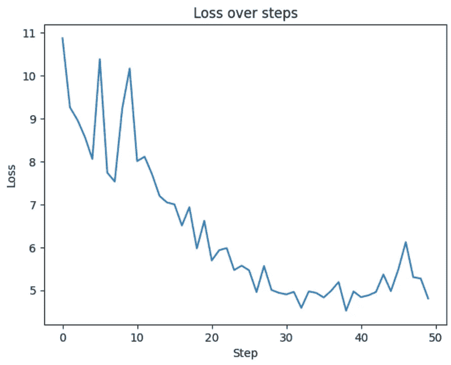

# 逐行复现 GPT-2：第一部分

> 原文：[`towardsdatascience.com/line-by-line-lets-reproduce-gpt-2-section-1-b26684f98492?source=collection_archive---------8-----------------------#2024-07-23`](https://towardsdatascience.com/line-by-line-lets-reproduce-gpt-2-section-1-b26684f98492?source=collection_archive---------8-----------------------#2024-07-23)

## 本文将逐行分析 Andrej Karpathy 的“让我们复现 GPT-2（124M）”第一部分的代码。

[](https://medium.com/@mgunton7?source=post_page---byline--b26684f98492--------------------------------)[](https://towardsdatascience.com/?source=post_page---byline--b26684f98492--------------------------------) [Matthew Gunton](https://medium.com/@mgunton7?source=post_page---byline--b26684f98492--------------------------------)

·发布于 [Towards Data Science](https://towardsdatascience.com/?source=post_page---byline--b26684f98492--------------------------------) ·21 分钟阅读·2024 年 7 月 23 日

--


作者提供的图像 — SDXL

Andrej Karpathy 是人工智能（AI）领域的领军人物之一。他是 OpenAI 的创始成员之一，曾领导 Tesla 的 AI 团队，并继续活跃在 AI 社区的前沿。他最近发布了一段精彩的[4 小时视频，讲解如何从零开始构建一个高质量的大型语言模型（LLM）](https://www.youtube.com/watch?v=l8pRSuU81PU)。

在那个视频中，我们逐一讲解了训练大型语言模型（LLM）的所有主要部分，从编写架构代码到加速训练时间，再到调整超参数以获得更好的结果。这里包含了大量的知识，因此我希望通过逐行解析 Karpathy 创建的代码，进一步展开讲解其工作原理。本文将是我系列文章的一部分，内容将涵盖 Karpathy 视频的每个部分。

在第一部分中，我们专注于实现 GPT-2 的架构。尽管 GPT-2 在 2018 年由 OpenAI 开源，但它是用 TensorFlow 编写的，这比 PyTorch 更难调试。因此，我们将使用更常用的工具重新构建 GPT-2。仅凭我们今天要创建的代码，你就能创建自己的大型语言模型（LLM）！

让我们开始吧！

# 高级词汇

在我们开始之前，先来统一一下术语。虽然可能与其他来源的命名有所冲突，但我会尽量在这些博客文章中保持一致。

*块大小* — 告诉我们 Transformer 可以处理输入长度中多少个位置。一旦超过这个限制，性能会下降，因为你必须进行循环（你可以在我的《长 RoPE 博客》中了解如何在不从头训练新模型的情况下扩展这一点）。

*词汇表大小* — 告诉我们模型能够理解和使用多少个独特的标记。通常，研究人员发现，较大的词汇表大小使模型能够更精确地使用语言，并捕捉到更多细微的回应。

*层* — 我们神经网络中的隐藏层的一部分。具体来说，这里指的是我们在下面的灰色框中重复进行计算的次数：


我们模型中的一层来自[《Attention is All You Need》](https://arxiv.org/pdf/1706.03762)

*嵌入* — 我们传递给模型的数据的向量表示。

*多头注意力* — 我们不是只运行一次注意力，而是运行 n 次，然后将所有结果连接起来，得到最终结果。

让我们进入代码吧！

# GPT 类及其参数

```py
@dataclass
class GPTConfig:
    block_size : int = 1024
    vocab_size : int = 50257
    n_layer : int = 12
    n_head : int = 12
    n_embd : int = 768
```

首先，我们在 GPTConfig 类中设置了 5 个超参数。`block_size`与`n_layer`和`n_head`一样，看起来有些随意。换句话说，这些值是根据研究人员所观察到的最佳性能经验选择的。此外，我们为`n_embd`选择了 786，这是 GPT-2 论文中选定的值，我们决定进行模拟。

然而，`vocab_size`是基于我们将使用的`tiktoken` GPT-2 分词器设置的。GPT-2 分词器是通过使用*字节对编码*算法创建的（[在这里阅读更多](https://www.geeksforgeeks.org/byte-pair-encoding-bpe-in-nlp/)）。它从初始的词汇表（在我们的案例中为 256）开始，然后遍历训练数据，根据新词汇在训练集中的出现频率创建新的词汇。它不断重复这一过程，直到达到限制（在我们的案例中为 50,000）。最后，我们为内部使用预留了词汇（在我们的案例中为结束标记字符）。将这些值相加，我们得到 50,257。

```py
class GPT(nn.Module):
    def __init__(self, config):
        super().__init__()
        self.config = config

    # ...
```

设置好我们的配置后，我们创建了一个 GPT 类，它是 torch `nn.Module`类的一个实例。这个类是所有 PyTorch 神经网络的基类，因此通过使用这个类，我们可以访问 PyTorch 为这些类型的模型提供的所有优化。每个`nn.Module`都有一个`forward`函数，定义了模型在前向传播过程中发生的事情（稍后会详细讲解）。

我们首先运行基类中的超构造函数，然后将`transformer`对象创建为`ModuleDict`。这样做是因为它允许我们像操作对象一样索引`transformer`，这在我们想从 HuggingFace 加载权重时以及调试并快速浏览模型时都会非常有用。

```py
class GPT(nn.Module):
    def __init__(self, config):
        # ...

        self.transformer = nn.ModuleDict(dict(
            wte = nn.Embedding(config.vocab_size, config.n_embd),
            wpe = nn.Embedding(config.block_size, config.n_embd),
            h = nn.ModuleList([Block(config) for _ in range(config.n_layer)]),
            ln_f = nn.LayerNorm(config.n_embd)
        )) 
```

我们的`transformer`在这里有四个主要部分要加载：标记嵌入的权重（`wte`）、位置编码的权重（`wpe`）、隐藏层（`h`）和层归一化（`ln_f`）。这个设置*大致*遵循了[《Attention is All You Need》](https://arxiv.org/pdf/1706.03762)中 Transformer 架构的解码器部分（输出嵌入 ~ `wte`，位置编码 ~ `wte`，隐藏层 ~ `h`）。一个关键的区别是，我们的架构中在所有隐藏层完成后增加了一个额外的归一化层`ln_f`。


解码器架构部分，见[《Attention is All You Need》](https://arxiv.org/pdf/1706.03762)

`wte`和`wpe`都是嵌入，因此我们自然使用`nn.Embedding`类来表示它们。我们的隐藏层是 Transformer 中大部分逻辑所在的地方，所以我稍后会详细讲解。现在只需注意，我们正在创建一个`Block`对象的循环，以便拥有`n.layer`个它们。最后，我们使用内建的`nn.LayerNorm`来处理`ln_f`，它将根据下面的公式对我们的输出进行归一化（其中 x 和 y 分别是输入和输出，E[x]是均值，γ和β是可学习的权重）。


[PyTorch 中层归一化的公式](https://pytorch.org/docs/stable/generated/torch.nn.LayerNorm.html)

```py
class GPT(nn.Module):
    def __init__(self, config):
        # ...
        self.lm_head = nn.Linear(config.n_embd, config.vocab_size, bias=False)

        # weight sharing scheme
        self.transformer.wte.weight = self.lm_head.weight

        # initalize weights
        self.apply(self._init_weights)
```

接下来，我们设置网络的最后一层线性层，用于生成模型的 logits。在这里，我们将从模型的嵌入维度（768）映射到模型的词汇表大小（50,257）。这里的想法是，我们将隐藏状态扩展到映射到我们的词汇表，以便我们的解码器头可以使用每个词汇上的值来确定下一个标记应该是什么。

最后，在我们的构造函数中，我们进行了一个有趣的优化，其中我们告诉模型将分词器的权重与线性层的权重设为相同。这样做的原因是，我们希望线性层和分词器对标记有相同的理解（如果两个标记在输入模型时相似，那么这两个标记在模型输出时也应该是相似的）。最后，我们初始化模型的权重，以便可以开始训练。

```py
class GPT(nn.Module):
# ...
    def forward(self, idx, targets=None):
        B, T = idx.size() 
        assert T <= self.config.block_size, f"maximum sequence length breached"
        pos = torch.arange(0, T, dtype=torch.long, device=idx.device)
        pos_emb = self.transformer.wpe(pos)
        tok_emb = self.transformer.wte(idx)

        x = tok_emb + pos_emb # hidden broadcast

        for block in self.transformer.h:
            x = block(x)
        x = self.transformer.ln_f(x)
        logits = self.lm_head(x)
        loss = None
        if targets is not None:
            loss = F.cross_entropy(logits.view(-1, logits.size(-1)), targets.view(-1))
        return logits, loss
```

我们的前向函数是我们详细描述模型在前向传播过程中行为的地方。我们首先验证我们的序列长度是否不大于我们配置的最大值（`block_size`）。一旦这点成立，我们创建一个值为 0 到 T-1 的张量（例如，如果 T=4，我们将得到 tensor([0, 1, 2, 3]），并通过位置嵌入权重运行它们。完成之后，我们将输入张量通过标记嵌入权重。

我们将**token**和位置嵌入结合成`x`，需要广播操作来将它们合并。由于`tok_emb`比`pos_emb`大（在我们的示例中是 50257 对 1024），因此`x`的维度将与`tok_emb`相同。`x`现在是我们的隐藏状态，我们将在隐藏层中通过 for 循环传递它。我们小心地在每次通过 Block 后更新`x`。

接下来，我们通过 LayerNormalization `ln_f`对`x`进行归一化，然后进行线性投影以获取预测下一个 token 所需的 logits。如果我们正在训练模型（通过`targets`参数来指示），我们将计算我们刚刚生成的 logits 与存储在`targets`变量中的真实标签之间的交叉熵。我们通过`cross_entropy`损失函数来实现这一点。为了正确执行，我们需要通过`.view()`将`logits`和`target`转换为正确的形状。当我们通过-1 传递时，我们让 pytorch 推断出正确的大小。

这个类还有一个函数是初始化函数，不过我们稍后会讲到初始化逻辑。现在，让我们深入了解 Block 逻辑，它将帮助我们实现多头注意力和 MLP。

# Block 类

```py
class Block(nn.Module):
    def __init__(self, config):
        super().__init__()
        self.ln_1 = nn.LayerNorm(config.n_embd)
        self.attn = CausalSelfAttention(config)
        self.ln_2 = nn.LayerNorm(config.n_embd)
        self.mlp = MLP(config)
# ...
```

Block 被实例化为`nn.Module`，因此我们还在开始时调用了父类构造函数进行优化。接下来，我们按照[《Attention is All You Need》](https://arxiv.org/pdf/1706.03762)论文中的计算设置相同的操作——2 个层归一化、一个注意力计算和通过 MLPs 的前馈层。


[《Attention is All You Need》](https://arxiv.org/pdf/1706.03762)中的一个隐藏层

```py
class Block(nn.Module):
# ...
    def forward(self, x):
        x = x + self.attn(self.ln_1(x))
        x = x + self.mlp(self.ln_2(x))
        return x
```

然后我们定义了`forward`函数，PyTorch 将在每次模型前向传递时调用它。请注意，这里我们做了与《Attention is All You Need》不同的事情。我们设置了层归一化，分别发生在注意力和前馈层之前。这是 GPT-2 论文中的一个重要见解，您可以看到，像这样做一些小的改变，能够带来很大的不同。注意，原始张量的加法仍然保留在相应的位置。这两个加法将在我们设置权重初始化函数时变得非常重要。

这个类是一个很好的抽象，它允许我们替换注意力机制的实现或选择另一种类型的前馈函数，而不需要大规模重构代码。

# CausalSelfAttention 类

```py
class CausalSelfAttention(nn.Module):
    def __init__(self, config):
        super().__init__()
        assert config.n_embd % config.n_head == 0
        self.c_attn = nn.Linear(config.n_embd, 3*config.n_embd)
        self.c_proj = nn.Linear(config.n_embd, config.n_embd)
        self.c_proj.NANOGPT_SCALE_INIT = 1
        self.n_head = config.n_head
        self.n_embd = config.n_embd
        self.register_buffer('bias', torch.tril(torch.ones(config.block_size, config.block_size))
                                    .view(1,1, config.block_size, config.block_size))
# ...
```

注意力是我们模型的一个重要部分，因此这里自然有很多配置项。我们使用断言语句作为调试工具，确保我们传递的配置维度是兼容的。接着，我们创建了一些辅助函数，帮助我们在进行自注意力时使用。首先，我们有`c_attn`和`c_proj`，它们是线性投影，将我们的隐藏状态转换为注意力计算所需的新维度。`c_proj.NANOGPT_SCALE_INIT`是我们在这里和 MLP 中设置的一个标志，帮助我们稍后的权重初始化（事实上，这个名字可以取任何名字）。

最后，我们告诉 torch 创建一个在训练过程中不会更新的缓冲区，称为`bias`。偏置将是一个尺寸为`block_size` x `block_size`的下三角矩阵，接着我们将其转换为尺寸为 1 x 1 x `block_size` x `block_size`的 4D 张量。1 x 1 的维度是为了能够在单个通道中批量计算这些数据。这个缓冲区将用于在我们的多头注意力中应用掩码。

```py
class CausalSelfAttention(nn.Module):
# ...
    def forward(self, x):
        B, T, C = x.size() # batch size, sequence length, channels
        qkv = self.c_attn(x)
        q, k, v = qkv.split(self.n_embd, dim=2)
        # transpose is done for efficiency optimization
        k = k.view(B, T, self.n_head, C // self.n_head).transpose(1, 2)
        q = q.view(B, T, self.n_head, C // self.n_head).transpose(1, 2)
        v = v.view(B, T, self.n_head, C // self.n_head).transpose(1, 2)

        att = (q @ k.transpose(-2,-1)) * (1.0 / math.sqrt(k.size(-1)))
        att = att.masked_fill(self.bias[:, :, :T, :T] == 0, float("-inf"))
        att = F.softmax(att, dim=-1)
        y = att @ v
        y = y.transpose(1,2).contiguous().view(B, T, C)

        y = self.c_proj(y)
        return y
```

接下来是注意力的实现，重点是使其在 torch 中具有高性能。逐行分析，我们首先找到输入张量 x 中的批量大小、序列长度和通道数。接着我们会调用之前的`c_attn`，将隐藏状态投影到所需的维度。然后，我们将结果分割成 3 个形状为(B, T, C)的张量（具体来说，一个用于查询，一个用于键，一个用于值）。

然后，我们调整 q、k 和 v 的维度，以便能够高效地进行多头注意力。通过将维度从(B, T, C)更改为(B, T, self.n_head, C // self.n_head)，我们将数据划分开来，让每个头（head）获得自己的独特数据进行操作。我们转置视图，以便将 T 变为第三维，将`self.n_head`变为第二维，从而更方便地将头部拼接起来。


来自“[Attention is All You Need](https://youtu.be/l8pRSuU81PU?feature=shared)”的注意力公式

现在我们有了值，可以开始计算了。我们对查询（query）和键（key）进行矩阵乘法（确保将键转置，使其处于正确的方向），然后除以 k 的大小的平方根。完成此计算后，我们再应用来自寄存器的偏置，以确保未来的标记（tokens）的注意力数据不会影响当前的标记（因此我们只对时间和通道维度中大于 T 的标记应用掩码）。完成后，我们应用 softmax，仅通过某些信息进行传递。

一旦掩码被应用，我们将值乘以 v，然后将我们的值转置回（B，T，self.n_head，C // self.n_head）的设置。我们调用`.contiguous()`以确保在内存中所有数据都按顺序排列，最后将张量转换回（B，T，C）维度，这样就完成了在此步骤中拼接注意力头的操作。

最后，我们使用线性投影`c_proj`将其转换回隐藏状态的原始维度。

# MLP 类

```py
class MLP(nn.Module):
    def __init__(self, config):
        super().__init__()
        self.c_fc = nn.Linear(config.n_embd, 4 * config.n_embd)
        self.gelu = nn.GELU(approximate="tanh")
        self.c_proj = nn.Linear(4 * config.n_embd, config.n_embd)
        self.c_proj.NANOGPT_SCALE_INIT = 1
# ...
```

和之前所有的类一样，MLP 继承自`nn.Module`。我们首先设置一些辅助函数——特别是`c_fc`和`c_proj`线性投影层，分别将我们的嵌入扩展到原来的 4 倍大小，再缩回原来大小。接下来，我们使用 GELU。Karpathy 特别指出，近似参数这里只是为了与 GPT-2 论文中的结果尽可能接近。虽然当时，GELU 的近似是必要的，但现在我们不再需要近似——我们可以精确计算。

```py
class MLP(nn.Module):
# ...
    def forward(self, x):
        x = self.c_fc(x)
        x = self.gelu(x)
        x = self.c_proj(x)
        return x
```

我们的前向传播过程相对简单。我们对输入张量调用每个函数并返回最终结果。

# Hugging Face 连接代码

因为 GPT-2 是开源的，所以它可以在 Hugging Face 上找到。虽然我们的目标是训练自己的模型，但能够将我们的结果与 OpenAI 在训练中得到的结果进行对比是很有意义的。为了实现这一点，我们有以下函数来提取权重并将它们填充到我们的`GPT`类中。

这段代码还允许我们重用这些代码，从 Hugging Face 拉取基础模型并进行微调（*经过一些修改，因为现在它仅对 gpt-2 进行了优化*）。

```py
class GPT(nn.Module):
# ...
    @classmethod
    def from_pretrained(cls, model_type):
        """Loads pretrained GPT-2 model weights from huggingface"""
        assert model_type in {'gpt2', 'gpt2-medium', 'gpt2-large', 'gpt2-xl'}
        from transformers import GPT2LMHeadModel
        print("loading weights from pretrained gpt: %s" % model_type)

        # n_layer, n_head and n_embd are determined from model_type
        config_args = {
            'gpt2':         dict(n_layer=12, n_head=12, n_embd=768),  # 124M params
            'gpt2-medium':  dict(n_layer=24, n_head=16, n_embd=1024), # 350M params
            'gpt2-large':   dict(n_layer=36, n_head=20, n_embd=1280), # 774M params
            'gpt2-xl':      dict(n_layer=48, n_head=25, n_embd=1600), # 1558M params
        }[model_type]
        config_args['vocab_size'] = 50257 # always 50257 for GPT model checkpoints
        config_args['block_size'] = 1024 # always 1024 for GPT model checkpoints
        # create a from-scratch initialized minGPT model
        config = GPTConfig(**config_args)
        model = GPT(config)
        sd = model.state_dict()
        sd_keys = sd.keys()
        sd_keys = [k for k in sd_keys if not k.endswith('.attn.bias')] # discard this mask / buffer, not a param
# ...
```

从顶部开始，我们引入 HuggingFace 的`transformers`库，并设置在不同版本的 GPT-2 模型之间变化的超参数。由于`vocab_size`和`block_size`不变，您可以看到我们将它们硬编码了进去。然后，我们将这些变量传递给之前的`GPTConfig`类，然后实例化模型对象（`GPT`）。最后，我们从模型中删除所有以`.attn.bias`结尾的键，因为这些不是权重，而是我们之前为帮助注意力功能设置的寄存器。

```py
class GPT(nn.Module):
# ...
    @classmethod
    def from_pretrained(cls, model_type):
# ...
        model_hf = GPT2LMHeadModel.from_pretrained(model_type)
        sd_hf = model_hf.state_dict()

        # copy while ensuring all of the parameters are aligned and match in names and shapes
        sd_keys_hf = sd_hf.keys()
        sd_keys_hf = [k for k in sd_keys_hf if not k.endswith('.attn.masked_bias')] # ignore these, just a buffer
        sd_keys_hf = [k for k in sd_keys_hf if not k.endswith('.attn.bias')] # same, just the mask (buffer)
        transposed = ['attn.c_attn.weight', 'attn.c_proj.weight', 'mlp.c_fc.weight', 'mlp.c_proj.weight']
        # basically the openai checkpoints use a "Conv1D" module, but we only want to use a vanilla Linear
        # this means that we have to transpose these weights when we import them
        assert len(sd_keys_hf) == len(sd_keys), f"mismatched keys: {len(sd_keys_hf)} != {len(sd_keys)}"
```

接下来，我们从 HuggingFace 类`GPT2LMHeadModel`加载模型。我们从这个模型中提取键，并同样忽略`attn.masked_bias`和`attn.bias`键。然后我们使用断言来确保 Hugging Face 模型中的键数量与我们模型中的键数量相同。

```py
class GPT(nn.Module):
# ...
    @classmethod
    def from_pretrained(cls, model_type):
# ...
        for k in sd_keys_hf:
            if any(k.endswith(w) for w in transposed):
                # special treatment for the Conv1D weights we need to transpose
                assert sd_hf[k].shape[::-1] == sd[k].shape
                with torch.no_grad():
                    sd[k].copy_(sd_hf[k].t())
            else:
                # vanilla copy over the other parameters
                assert sd_hf[k].shape == sd[k].shape
                with torch.no_grad():
                    sd[k].copy_(sd_hf[k])

        return model
```

为了完善这个函数，我们遍历 Hugging Face 模型中的每个键，并将其权重添加到我们模型中对应的键上。有些键需要进行处理，以便适应我们正在使用的数据结构。我们使用函数`.t()`来转置 hugging face 矩阵，使其符合我们需要的维度。对于其余的键，我们直接复制过去。你会注意到我们使用了`torch.no_grad()`。这告诉 torch 它不需要缓存值用于模型的反向传播，这是另一个优化措施，使得运行速度更快。

# 生成我们的第一次预测（采样循环）

使用我们现在的类，我们可以运行模型并让它给出输出的 token（*只需确保如果你是按顺序跟随的，记得注释掉 GPT 构造函数中的 _init_weights 调用*）。下面的代码展示了我们如何做到这一点。

```py
device = "cpu"
if torch.cuda.is_available():
    device = "cuda"
elif hasattr(torch.backends, "mps") and torch.backends.mps.is_available():
    device = "mps"
print(f"device {device}")

torch.manual_seed(1337)

model = GPT(GPTConfig())
model.eval()
model.to(device)
```

我们首先确定可以访问的设备。Cuda 是 NVIDIA 的平台，可以进行非常快速的 GPU 计算，因此如果我们有访问使用 CUDA 的芯片，我们将使用它们。如果我们没有 CUDA 访问权限，但使用的是 Apple Silicon，那么我们将使用它。最后，如果两者都没有，我们就退回到 CPU（这将是最慢的，但每台计算机都有 CPU，所以我们知道仍然可以在上面训练）。

然后，我们使用默认配置实例化模型，并将模型置于'`eval`'模式——（这会做很多事情，比如禁用 dropout，但从宏观上看，它确保我们的模型在推理过程中更加一致）。设置完成后，我们将模型移到我们的设备上。注意，如果我们想使用 HuggingFace 的预训练权重而不是我们的训练权重，我们需要修改倒数第三行，使其变为：`model = GPT.from_pretrained(‘gpt2’)`

```py
import tiktoken
enc = tiktoken.get_encoding('gpt2')
tokens = enc.encode("Hello, I'm a language model,")
tokens = torch.tensor(tokens, dtype=torch.long)
tokens = tokens.unsqueeze(0).repeat(num_return_sequences, 1)
x = tokens.to(device)
```

我们现在使用`gpt2`编码方式引入`tiktoken`并让它对我们的提示进行分词。我们将这些 token 放入一个 tensor 中，然后在下面一行中将其转换为批次。`unsqueeze()`会为 tensor 添加一个新的尺寸为 1 的第一维，`repeat`会在第一维重复整个 tensor `num_return_sequences`次，并在第二维重复一次。我们所做的是将数据格式化为模型预期的批处理结构。具体来说，我们现在匹配了(B, T)格式：`num_return_sequences` x 提示的编码长度。一旦我们将输入 tensor 传入模型的开始位置，我们的`wte`和`wpe`就会生成 C 维度。

```py
while x.size(1) < max_length:
    with torch.no_grad():
        logits, _ = model(x)
        logits = logits[:, -1, :]
        probs = F.softmax(logits, dim=-1)
        topk_probs, topk_indices = torch.topk(probs, 50, dim=-1)
        ix = torch.multinomial(topk_probs, 1)
        xcol = torch.gather(topk_indices, -1, ix)
        x = torch.cat((x, xcol), dim=1)
```

现在它们已经准备好，我们将它们发送到设备上并开始我们的采样循环。这个循环将仅仅是前向传播，因此我们将其包装在`torch.no_grad`中，以防它为任何反向传播缓存值。我们的 logits 的形状为(batch_size, seq_len, vocab_size) — (B,T,C)，其中 C 是在模型前向传播后得到的。

我们只需要序列中的最后一个项来预测下一个 token，因此我们提取`[:, -1, :]`。然后我们将这些 logits 通过`softmax`处理，得到 token 的概率。取前 50 个概率最大的 token，我们随机选择一个索引，从中选出作为我们的预测 token。然后我们获取关于该 token 的信息并将其添加到我们的张量`x`中。通过将`xcol`拼接到`x`上，我们为根据刚刚预测的内容进入下一个 token 做好了准备。这就是我们实现自回归的方式。

```py
for i in range(num_return_sequences):
    tokens = x[i, :max_length].tolist()
    decoded = enc.decode(tokens)
    print(f">> {decoded}")
```

采样循环完成后，我们可以遍历每个选定的 token 并对其进行解码，展示给用户响应。我们从批次中的第`i`个获取数据，并解码以得到下一个 token。

如果你在我们初始模型上运行采样循环，你会发现输出结果差强人意。这是因为我们还没有训练任何权重。接下来的几节将展示如何开始对模型进行初步训练。

# DataLoaderLite

所有训练都需要高质量的数据。对于 Karpathy 的视频，他喜欢使用公共领域的莎士比亚文本（[可以在这里找到](https://github.com/karpathy/char-rnn/blob/master/data/tinyshakespeare/input.txt)）。

```py
class DataLoaderLite:
    def __init__(self, B, T):
        self.B = B
        self.T = T

        with open('shakespeare.txt', "r") as f:
            text = f.read()

        enc = tiktoken.get_encoding('gpt2')
        tokens = enc.encode(text)
        self.tokens = torch.tensor(tokens)
        print(f"1 epoch = {len(self.tokens) // B * T} batches")

        self.current_position = 0
```

我们首先通过简单地打开文件并读取文本来开始。此数据源仅包含 ASCII 字符，因此我们不需要担心任何意外的二进制字符。我们使用`tiktoken`获取正文的编码，然后将这些 tokens 转换为张量。接着，我们创建一个名为`current_position`的变量，它将告诉我们当前正在从 token 张量的哪个位置进行训练（通常初始化为开始位置）。注意，这个类没有继承自`nn.Module`，主要是因为我们在这里不需要`forward`函数。就像在采样循环的提示部分一样，我们的 DataLoaderLite 类只需要生成形状为(B, T)的张量。

```py
class DataLoaderLite:
# ...
    def next_batch(self):
        B, T = self.B, self.T
        buf = self.tokens[self.current_position: self.current_position+(B*T + 1)]
        x = (buf[:-1]).view(B, T)
        y = (buf[1:]).view(B,T)

        self.current_position += B * T
        if self.current_position + (B*T+1) > len(self.tokens):
            self.current_position = 0
        return x,y
```

在上面的代码中，我们定义了`next_batch`函数来帮助训练。为了加速程序运行，我们喜欢将计算分批执行。我们使用 B 和 T 字段来确定我们训练的批量大小（B）和序列长度（T）。使用这些变量，我们创建一个缓冲区来保存我们将用来训练的 tokens，将维度设置为 B 行 T 列。注意，我们从`current_position`读取到`current_position + (B*T + 1)`，其中+1 是为了确保我们有所有的真实值，适用于我们`B*T`的批次。

然后，我们设置我们的模型输入(`x`)和期望输出(`y`)。`x`是除了最后一个字符外的整个缓冲区，而`y`是除了第一个字符外的整个缓冲区。基本的想法是，给定 token 缓冲区中的第一个值，我们期望从模型中返回 token 缓冲区中的第二个 token。

最后，我们更新`current_position`并返回`x`和`y`。

# 权重初始化

由于我们处理的是概率，我们希望为权重选择初始值，以便更少的训练轮次就能得到正确的结果。我们的`_init_weights`函数帮助我们实现这一点，它通过用零或正态分布来初始化权重。

```py
class GPT(nn.Module):
# ...
    def _init_weights(self, module):
        # layer norm is by default set to what we want, no need to adjust it
        if isinstance(module, nn.Linear):
            std = 0.02
            if hasattr(module, "NANOGPT_SCALE_INIT"):
                std *= (2 * self.config.n_layer) ** -0.5 # 2 * for 2 additions (attention & mlp)
            torch.nn.init.normal_(module.weight, mean=0.0, std=std)
            # reasonable values are set based off a certain equation
            if module.bias is not None:
                torch.nn.init.zeros_(module.bias)
        elif isinstance(module, nn.Embedding):
            torch.nn.init.normal_(module.weight, mean=0.0, std=0.02 )
```

如果你之前记得，我们将`GPT`类的每个字段都传递给了`_init_weights`，所以我们正在处理`nn.Module`。我们使用 Xavier 方法初始化权重，这意味着我们将采样分布的标准差设置为`1 / sqrt(hidden_layers)`。你会注意到，在代码中，我们经常使用硬编码的 0.02 作为标准差。尽管这看起来是任意的，但从下面的表格可以看到，由于 GPT-2 使用的隐藏维度都大致为 0.02，这就是一个很好的近似值。

浏览代码时，我们首先检查我们操作的模块是`nn.Module`的哪种子类。

如果该模块是线性模块，我们会检查它是否是我们从`MLP`或`CasualSelfAttention`类中的投影之一（通过检查它是否设置了`NANO_GPT_INIT`标志）。如果是，那么我们 0.02 的近似值将不起作用，因为这些模块中的隐藏层数在增加（这是我们在`Block`类中添加张量的结果）。因此，GPT-2 论文使用了一个缩放函数来解决这个问题：`1/sqrt(2 * self.config.n_layer)`。`2*`的原因是我们的`Block`有两个地方在添加张量。

如果线性模块中有偏置，我们将首先将其初始化为零。

如果我们有一个`Embedding`模块（如 Token 或位置编码部分），我们将使用标准差为 0.02 的相同正态分布来初始化它。

如果你记得，我们的模型中还有另一种子类：`nn.LayerNorm`。这个类已经通过正态分布进行了初始化，因此我们决定不需要做任何更改。

# 训练循环

现在我们已经设置好了训练的基本要素，让我们快速组建一个训练循环来训练我们的模型。

```py
device = "cpu"
if torch.cuda.is_available():
    device = "cuda"
elif hasattr(torch.backends, "mps") and torch.backends.mps.is_available():
    device = "mps"
print(f"device {device}")

num_return_sequences = 5
max_length = 30

torch.manual_seed(1337)

train_loader = DataLoaderLite(B=4, T=32)

model = GPT(GPTConfig())
model.to(device)
```

你可以看到，我们重复进行设备计算以获得最佳性能。然后，我们设置数据加载器，使用批量大小为 4 和序列长度为 32（这个设置是任意的，尽管 2 的幂在内存效率上最佳）。

```py
optimizer = torch.optim.AdamW(model.parameters(), lr=3e-4)
for i in range(50):
    x, y = train_loader.next_batch()
    x, y = x.to(device), y.to(device)
    optimizer.zero_grad() #have to start with a zero gradient
    logits, loss = model(x, y)
    loss.backward() #adds to the gradient (+=, which is why they must start as 0)
    optimizer.step()
    print(f"loss {loss.item()}, step {i}")
```

现在我们有了优化器，它将帮助我们训练模型。优化器是一个 PyTorch 类，它接受应训练的参数（在我们的情况下是从`GPT`类传入的参数），以及学习率，这是训练过程中的超参数，决定了我们调整参数的速度——较高的学习率意味着每次运行后权重的变化更为剧烈。我们根据 Karpathy 的推荐选择了我们的值。

然后我们使用 50 步训练来训练模型。我们首先获取训练批次并将其移到我们的设备上。我们将优化器的梯度设置为零（在 pytorch 中，梯度是累加的，所以如果不将其清零，我们将从上一批次携带信息）。我们计算模型的 logits 和损失，然后进行反向传播，以找出新的权重模型应该是什么。最后，我们运行`optimizer.step()`来更新所有模型参数。

# 合理性检查

若要查看上述所有代码的执行情况，您可以[查看我的 Google Colab，其中我将所有内容结合并在 NVIDIA T4 GPU 上运行](https://colab.research.google.com/drive/1tJjzDP2wTq6R5LF0AWESlNheTn1YEYzI)。运行我们的训练循环时，我们看到损失从大约~11 开始。为了验证这一点，我们预计在开始时预测正确的标记的概率为（1/`vocab_size`）。通过一个简化的损失函数`-ln`，我们得到大约 10.88，这正是我们开始的地方！



图片由作者提供

# 结束语

感谢你读到最后！

我尽力在这篇博客文章中包含了尽可能多的细节，但自然也有一些内容我不得不省略。如果你喜欢这篇博客文章或者发现有任何你认为应该修改/扩展的地方，请告诉我！

现在是构建的激动人心时刻！

[1] Karpathy, A.，[《让我们重现 GPT-2（124M）》](https://youtu.be/l8pRSuU81PU?feature=shared)（2024），YouTube

[2] Radford, A. 等人，[《语言模型是无监督多任务学习者》](https://d4mucfpksywv.cloudfront.net/better-language-models/language-models.pdf)（2018），《带代码的论文》

[3] Vaswani, A. 等人，"[Attention Is All You Need](https://arxiv.org/pdf/1706.03762.pdf)"（2017），arXiv
