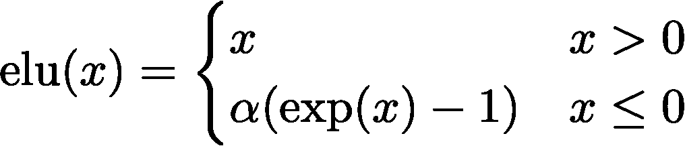

# 线性注意力就是你所需要的一切

> 原文：[`towardsdatascience.com/linear-attention-is-all-you-need-5fa9c845c1b5?source=collection_archive---------2-----------------------#2024-06-02`](https://towardsdatascience.com/linear-attention-is-all-you-need-5fa9c845c1b5?source=collection_archive---------2-----------------------#2024-06-02)

## **自注意力能以更低的成本实现？**

[](https://medium.com/@sam.maddrellmander?source=post_page---byline--5fa9c845c1b5--------------------------------)[](https://towardsdatascience.com/?source=post_page---byline--5fa9c845c1b5--------------------------------) [Sam Maddrell-Mander](https://medium.com/@sam.maddrellmander?source=post_page---byline--5fa9c845c1b5--------------------------------)

·发布于 [Towards Data Science](https://towardsdatascience.com/?source=post_page---byline--5fa9c845c1b5--------------------------------) ·9 分钟阅读·2024 年 6 月 2 日

--


图片由 [Guillaume Jaillet](https://unsplash.com/@i_am_g?utm_source=medium&utm_medium=referral) 提供，来源于 [Unsplash](https://unsplash.com/?utm_source=medium&utm_medium=referral)

# ***“注意力在处理长序列时表现较差”***

这是任何花费大量时间研究变换器和自注意力机制的人都听过一百次的内容。它绝对是正确的，我们都经历过，当你尝试增加模型的上下文大小时，一切突然停滞不前。但与此同时，似乎几乎每周都有一个新的前沿模型，创造了一个新的上下文长度纪录。（Gemini 的上下文长度达到了 2M 个标记！）

有很多复杂的方法，比如 RingAttention，它使得在大型分布式系统中训练极长的上下文长度成为可能，但今天我关注的是一个更简单的问题。

> 单靠线性注意力，我们能做到什么程度？

# **让我们来解析一下数学。**

这将是一次快速浏览，但请耐心等待，我们将在深入分析结果之前，简要讨论一些关键点。

我们基本上可以用两个关键点总结传统的注意力机制：

+   首先，典型的 softmax 注意力表达式是将查询矩阵和键矩阵相乘，进行归一化以保持稳定性，然后按行进行 softmax 运算，从而得到序列中每个元素之间的注意力分数。

+   其次，时间复杂度主要由 N²的点积决定，而 softmax 内部的部分是限制因素。这就是我们计算注意力分数的地方。

传统形式可以表达为：


softmax 注意力机制的传统公式。

事实证明，如果我们请教一下数学家朋友，我们可以稍微换个角度思考这个问题。softmax 可以被看作是描述与其他 token 之间的概率分布的多种方式之一。我们可以使用任何我们喜欢的相似度度量（点积是最简单的之一），只要我们进行归一化，就没问题。


使用任何相似度函数的注意力的通用表达式。

说这就是注意力有点草率，因为实际上只有当相似度函数是查询和键的点积的指数（如下所示），并且我们在 softmax 中找到了这个时，它才是我们所知的注意力。但有趣的是，如果我们不使用这个表达式，而是尝试逼近它呢？


用两个特征图逼近自注意力中的相似度函数。

我们可以假设存在某个特征图“*phi*”，它能给出一个结果，*几乎*与取点积的指数相同。关键是，以这种方式写表达式允许我们改变矩阵乘法操作的顺序。

在[论文](https://arxiv.org/abs/2006.16236)中，他们提出了指数线性单元（ELU）作为特征图，因为它具有一些有用的属性：


1.  对于大于 0 的值，ELU(x) 给出线性结果，尽管与指数不同，但仍然保留了分数之间的相对顺序。

1.  对于小于或等于 0 的值，指数项保持了函数的连续性，并确保梯度不会消失。



我们在这里不会花太多时间讨论这个问题，但这已经通过经验得到了验证，作为 softmax 函数的一个合理逼近。

这使我们能够改变操作的顺序。我们可以首先取特征图 K 和 V 的乘积，形成一个 KV 块，然后与 Q 相乘。平方积变成了在模型维度上进行而非序列长度上进行。

将这一切组合到线性注意力的表达式中，我们得到：


使用特征图来逼近 softmax 相似度分数的线性注意力。

我们只需要每个查询行计算括号内的项一次。

*(如果你想深入了解因果遮掩是如何融入其中以及梯度是如何计算的，可以查看论文，或者关注未来的博客。)*

# **线性注意力到底快多少？**

数学上的情况很有力，但就个人而言，在看到一些基准测试之前，我总是有些怀疑。

我们先从代码片段入手，描述这些术语。softmax 注意力看起来非常熟悉，这里我们没有做任何复杂的操作。

```py
class TraditionalAttention(nn.Module):
    def __init__(self, d_k):
        super(TraditionalAttention, self).__init__()
        self.d_k = d_k

    def forward(self, Q, K, V):
        Z = torch.sqrt(torch.tensor(self.d_k, device=Q.device, dtype=torch.float32))
        scores = torch.matmul(Q, K.transpose(-2, -1)) / Z
        attention_weights = F.softmax(scores, dim=-1)
        output = torch.matmul(attention_weights, V)
        return output
```

接着，对于线性注意力，我们首先获取查询、键和值矩阵，然后对查询和键应用 ELU(x)特征映射。接着使用 einsum 符号进行乘法运算。

```py
class LinearAttention(nn.Module):
    def __init__(self):
        super(LinearAttention, self).__init__()
        self.eps = 1e-6

    def elu_feature_map(self, x):
        return F.elu(x) + 1

    def forward(self, Q, K, V):
        Q = self.elu_feature_map(Q)
        K = self.elu_feature_map(K)
        KV = torch.einsum("nsd,nsd->ns", K, V)
        # Compute the normalizer
        Z = 1/(torch.einsum("nld,nd->nl", Q, K.sum(dim=1))+self.eps)
        # Finally compute and return the new values
        V = torch.einsum("nld,ns,nl->nd", Q, KV, Z)
        return V.contiguous()
```

在代码中看到这些是很好，但它在实验中实际上意味着什么呢？我们在这里谈论的性能提升到底有多大？从二次瓶颈到线性瓶颈的速度提升可能很难直接感受到，因此我进行了以下实验。

我们将采取一个单独的注意力层，固定的 d_k 模型维度为 64，并基准测试 32 批次序列的前向传播时间。唯一需要变化的变量是序列长度，范围从 128 到 6000（参考 GPT-3 的上下文长度为 2048）。每次运行进行 100 次，以获得平均值和标准差，实验使用的是 Nvidia T4 GPU。

对于如此简单的实验，结果相当惊人。


基准测试：测量传统（softmax）注意力和线性注意力下，单个序列每次迭代的时间。每个序列长度在 100 次迭代中取平均，标准差也会被绘制出来。使用的序列长度范围是从 128 到 6000。比率图也显示出来，便于更容易地衡量性能提升。

结果表明，即使是在一个极小的玩具示例中，我们也能获得最多 60 倍的加速。

## 讨论

这里有几个显而易见的收获：

1.  线性注意力的优势巨大——无论是在速度上，较高的吞吐量总是件好事；还是在处理长序列时的内存需求上。在低内存环境中，这可能是一个很大的优势。

1.  比例图显示了一个令人惊讶的弯曲——这让我们怀疑这里发生了一些额外的底层优化，这意味着预期的比例并没有完全实现。所以我们需要对这个结果保持一定的怀疑态度。

完整性考虑，别误解为说*“线性注意力对于小模型来说是 60 倍快”*。实际上，前馈层通常占据了 Transformer 中大部分的参数，而编码/解码也是一个限制性大小的组件。但在这个严格定义的问题中，结果相当令人印象深刻！

## 计算复杂度

如果我们考虑每种方法的实际时间复杂度，我们可以展示这个差异的来源。

让我们分解传统 softmax 注意力的时间复杂度，第一个项给出了 QK 乘法的复杂度，这是 n²个分数，每个都是长度为 d_k 的点积。第二项描述了对注意力分数进行 softmax 操作的复杂度，也是 n²。第三项则将 n²矩阵与值向量进行点积运算。

如果我们简化假设查询、键和值矩阵具有相同的维度，那么我们得到最终项，其中主导项是 n²项。（前提是模型维度远小于序列长度。）


普通自注意力的 softmax 操作受序列长度的 n²项主导，通常模型的维度 d_k 远小于 n。

线性注意力讲述了一个不同的故事。同样，如果我们查看下面的时间复杂度表达式，我们将分析每一项。

第一项是将特征映射应用于 Q 和 K 矩阵的成本，第二项是 Q 和 V 矩阵的乘积，结果是一个(d_k, d_v)矩阵，而 K(QV)乘法在第三项中的复杂度相同。然后，最终输出再次假设模型维度对于不同的矩阵相同，最终的复杂度是线性与序列长度相关，并且与模型维度二次方成正比。


线性自注意力改变了这种局面，其在 n 上是线性的，而在模型维度上是二次方的（如果 dk 和 dv 的隐藏维度与我在这里所做的相同，便于简化）。因此，在 n >> dk 的情况下，复杂度明显较低。

因此，只要模型的维度小于序列长度，我们就能得到一个显著更快的模型。剩下的唯一问题是，它的近似效果究竟有多好？

# **没有免费的午餐——我们真的能训练一个模型吗？**

够了，足够的实验，希望我们都确信线性注意力比传统注意力要快得多，接下来进行真正的测试。我们能否真正训练模型，并且它们在两种不同注意力机制下的表现相似？

我们在这里使用的模型非常小（如果有兴趣深入探讨如何设置一个简单的训练框架，我们可以在未来再看看这个问题），而且数据也很简单。我们将使用 Penn Treebank 数据集（通过[*torchtext*](https://pytorch.org/text/0.8.1/datasets.html#penntreebank)公开提供），它包含了一些简短的文本片段，可以用来建模/测试小型语言模型。

## **我们能训练一个真正的模型来进行真正的预测吗**

如果我们诚实一点，实际预测可能有点过于夸张，考虑到我们训练所用的参数数量和时间，实际上我真正想观察的是训练动态是否相似。我们将查看在一个简单语言建模数据集上进行自回归训练的损失曲线，如果它们遵循相同的形状，我们至少可以有一些信心，认为不同的机制给出了相似的结果。

数据的性质意味着输出质量很少能达到高标准，但它提供了我们期望的所有正确训练过程的特征。

让我们来看一下训练曲线。左图展示了传统注意力方法和线性注意力方法在训练和验证中的损失。我们可以看到，在 10 个周期内，这两种方法基本上是无法区分的。同样地，如果我们查看右图，传统 softmax 和线性注意力的损失也表现得完全相同，显示了相同的训练动态。


（左）线性和传统注意力的每个周期的训练和验证损失，（右）线性和传统注意力机制的训练损失曲线。

# 结论

显然，这远远不够全面，我们这里并不打算与 GPT 竞争，但我们可以对减少注意力机制的复杂性并且不丧失建模能力保持乐观。

请关注第二部分，那里会有更详细的对比。

除非另有说明，否则所有图像均由作者创建，训练数据来自公开的[PennTreebank](https://pytorch.org/text/0.8.1/datasets.html#id4)数据集，通过*PyTorch torchtext*数据集获取。更多细节可以在[此处](https://catalog.ldc.upenn.edu/docs/LDC95T7/cl93.html)找到。

如果你想了解更多关于线性注意力的实现细节，我强烈建议你深入阅读原始论文（[`arxiv.org/abs/2006.16236`](https://arxiv.org/abs/2006.16236)）。

*如果你喜欢这篇内容，请关注此账号或在* [*Twitter*](https://x.com/smaddrellmander)*上找到我。*
