# 线性回归与因果结论

> 原文：[`towardsdatascience.com/linear-regressions-for-causal-conclusions-34c6317c5a11?source=collection_archive---------0-----------------------#2024-04-10`](https://towardsdatascience.com/linear-regressions-for-causal-conclusions-34c6317c5a11?source=collection_archive---------0-----------------------#2024-04-10)

## 一个简单而强大的决策工具

[](https://miptgirl.medium.com/?source=post_page---byline--34c6317c5a11--------------------------------)[](https://towardsdatascience.com/?source=post_page---byline--34c6317c5a11--------------------------------) [Mariya Mansurova](https://miptgirl.medium.com/?source=post_page---byline--34c6317c5a11--------------------------------)

·发布于 [Towards Data Science](https://towardsdatascience.com/?source=post_page---byline--34c6317c5a11--------------------------------) ·阅读时间 21 分钟·2024 年 4 月 10 日

--


图片来自 DALL-E

我想我们大多数人都听过“相关性不等于因果性”这句话很多次。对于分析师来说，这常常是一个问题，因为我们通常只能看到相关性，但仍然想做出因果推论。

让我们通过几个例子更好地理解这种差异。我想从日常生活中的一个案例开始，而不是数字世界中的案例。

1975 年，丹麦开展了一项大型人口研究。这项研究被称为[哥本哈根市心脏研究（CCHS）](https://pubmed.ncbi.nlm.nih.gov/30193744/)。研究人员收集了约 2 万名男女的资料，并对这些人进行了几十年的跟踪监测。该研究最初的目标是寻找预防心血管疾病和中风的方法。该研究的一个结论是，报告定期打网球的人预期寿命高出 9.7 年。

让我们思考一下如何解读这些信息。它是否意味着如果一个人今天开始每周打网球，他们的预期寿命会增加十年？不幸的是，答案并非完全如此。由于这是一个观察性研究，我们应该小心做出因果推论。可能存在一些其他的影响因素。例如，网球运动员可能更富裕，而[我们知道](https://www.ncbi.nlm.nih.gov/pmc/articles/PMC4866586/)较高的财富与更长的寿命相关。或者，也有可能是做运动的人更注重自己的健康，因此定期进行所有检查。所以，观察性研究可能会高估网球对寿命的影响，因为它没有控制其他因素。

让我们继续讨论一些与产品分析和我们日常工作更相关的例子。客户支持联系的次数可能与客户流失的概率正相关。如果客户不得不联系客户支持十次，他们可能会感到烦躁并停止使用我们的产品，而那些从未遇到问题并且对服务感到满意的客户可能永远不会有任何问题需要咨询。

这是否意味着，如果我们减少客户支持联系的次数，就能提高客户保持率？我敢打赌，如果我们隐藏联系信息并大幅减少客户支持联系的次数，我们并不能减少客户流失，因为流失的实际根本原因不是客户支持联系，而是客户对产品的不满，这导致了客户既联系了我们，又停止使用我们的产品。

我希望通过这些例子，你能够对相关性与因果关系的问题有一些直观的理解。

在本文中，我将分享一些从数据中得出因果结论的方法。令人惊讶的是，我们将能够使用最基础的工具——线性回归。

如果我们使用相同的线性回归进行因果推断，你可能会想，通常的方法和因果分析有什么区别？这是一个好问题。让我们通过理解两者之间的差异来开始我们的因果分析之旅。

# 预测分析与因果分析

预测分析有助于做出预测，并回答类似“如果没有任何变化，我们一年后会有多少客户？”或“这个客户在接下来的七天内购买的概率是多少？”的问题。

因果分析试图理解过程的根本原因。它可能帮助你回答类似“如果我们提高订阅费，客户流失的数量会是多少？”或者“如果我们没有推出这项情人节促销活动，会有多少客户签订我们的订阅？”这样的“假如”问题。

因果问题似乎比预测问题更复杂。然而，这两种方法往往使用相同的工具，例如线性回归或逻辑回归。尽管工具相同，但它们的目标完全不同：

+   对于预测分析，我们尽最大努力基于已知信息预测未来的某个值。因此，主要的关键绩效指标是预测的误差。

+   在建立因果分析的回归模型时，我们专注于目标值与其他因素之间的关系。模型的主要输出是系数，而不是预测值。

让我们看一个简单的例子。假设我们想要预测活跃客户的数量。

+   在预测方法中，我们讨论的是基准预测（假设情况保持基本不变）。我们可以使用[ARIMA](https://www.google.com/url?sa=t&rct=j&q=&esrc=s&cd=&ved=2ahUKEwjoheb60ZeEAxVkyQIHHY0JALwQFnoECCgQAQ&url=https%3A%2F%2Fen.wikipedia.org%2Fwiki%2FAutoregressive_integrated_moving_average&usg=AOvVaw3LwrU_FST2Kj6NbHUsUNNT&opi=89978449)（*自回归积分滑动平均*）并以先前的数值为基础进行预测。ARIMA 对于预测很有效，但无法告诉你影响 KPI 的因素以及如何改善你的产品。

+   在因果分析中，我们的目标是寻找数据中的因果关系，因此我们将构建回归模型，识别可能影响我们关键绩效指标（KPI）的因素，如订阅费用、营销活动、季节性等。在这种情况下，我们不仅会得到常规（BAU，business as usual）预测，还能够估计未来的不同“假设情景”。

现在，到了深入因果理论并学习基本术语的时候了。

# 相关性并不意味着因果关系

让我们考虑以下示例来展开讨论。假设你向忠实客户发送了折扣券，现在你想了解它如何影响客户的价值（在产品上的花费）和客户保持率。

因果分析中的一个最基本的术语是**处理**。听起来像是与医学相关的术语，但实际上它只是指一种干预措施。在我们的例子中，它是折扣。我们通常在单元层面（在我们这个例子中是客户）定义处理方式，通常定义如下。


另一个关键术语是**结果**`Y`，我们关心的变量。在我们的例子中，它是客户的价值。

因果推断的根本问题是我们无法同时观察同一客户的两个结果。因此，如果一个客户收到了折扣，我们永远无法知道如果没有折扣券，他的价值或保持率会是什么样子。这使得因果推断变得复杂。

这就是为什么我们需要引入另一个概念——**潜在结果**。发生的结果通常称为事实结果，而没有发生的结果称为反事实结果。我们将使用以下符号来表示它。


因果分析的主要目标是衡量处理与结果之间的关系。我们可以使用以下指标来量化这一关系：

+   **ATE** — 平均处理效应，

+   **ATT** — 对处理组的平均处理效应（即接受处理的客户）

它们都等于[期望值](https://en.wikipedia.org/wiki/Expected_value)，即潜在结果之间差异的期望值，适用于所有单元（在我们这个例子中是客户）或仅适用于接受处理的单元。


这是真正的因果效应，但不幸的是，我们无法计算它。不过别灰心，我们仍然可以得到一些估计。我们可以观察治疗客户和未治疗客户之间的值差异（相关效应）。让我们尝试解释这个值。

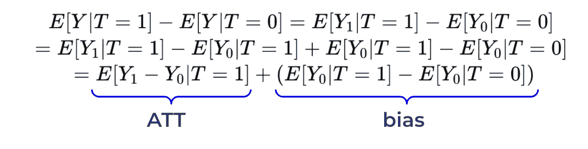

通过一些简单的数学变换（即加减相同的值），我们得出结论，治疗客户和未治疗客户之间的平均值等于**ATT**（治疗组的平均处理效应）和**偏差**项的总和。偏差等于没有治疗时对照组和治疗组之间的差异。

如果我们回到我们的案例，偏差将等于治疗组在未收到折扣的情况下预期的客户价值（*反事实结果*）和对照组（*事实结果*）之间的差异。

在我们的示例中，收到折扣的客户的平均值可能远高于未收到折扣的客户。我们能否将所有的效应归因于我们的治疗（折扣券）呢？不幸的是，不能。由于我们将折扣发放给了那些已经在我们产品上花费大量金钱的忠实客户，即使没有治疗，他们的价值可能也会高于对照组。所以，存在偏差，我们不能说两个群体之间的价值差异等于 ATT。

让我们思考一下如何克服这个障碍。我们可以做 A/B 测试：将我们的忠实客户随机分成两组，只向一半的客户发放折扣券。然后，我们可以估计折扣的效应，作为这两组之间的平均差异，因为我们已经消除了偏差（没有治疗的情况下，除了折扣外，这两组之间没有差异）。

我们已经介绍了因果推断的基本理论，并学到了偏差这个最关键的概念。因此，我们准备进入实践环节。我们将从分析 A/B 测试结果开始。

# 用例：A/B 测试

随机对照试验（RTC），通常称为 A/B 测试，是从数据中得出因果结论的强大工具。该方法假设我们是随机分配治疗，并且它帮助我们消除偏差（因为在没有治疗的情况下，组之间是相等的）。

为了练习解决此类任务，我们将查看一个基于合成数据的示例。假设我们构建了一个基于 LLM 的工具，帮助客服人员更快速地回答问题。为了衡量其效果，我们将该工具引入到一半的客服人员中，并且我们希望衡量我们的治疗（基于 LLM 的工具）如何影响结果（客服人员回答客户问题的时间）。

让我们快速查看一下我们拥有的数据。

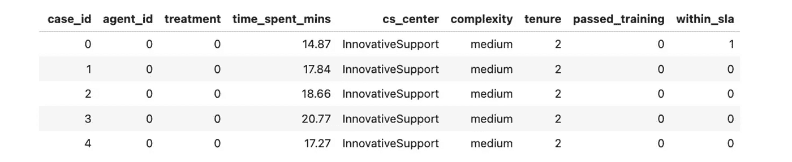

以下是我们记录的参数描述：

+   `case_id` — 案例的唯一 ID。

+   `agent_id` — 代理的唯一 ID。

+   `treatment` 如果代理在实验组并有机会使用 LLM，则为 1，0 — 否则。

+   `time_spent_mins` — 回答客户问题所花费的分钟数。

+   `cs_center` — 客户支持中心。我们与多个客户支持中心合作。我们在其中一些中心启动了这个实验，因为在这些中心实施较为容易。这样的做法也帮助我们避免了污染（实验组和控制组的代理之间的互动可能会互相影响）。

+   `complexity` 等于 `low`、`medium` 或 `high`。该特征基于客户问题的类别，并定义代理处理此案件所需的时间。

+   `tenure` — 代理开始工作的月份数。

+   `passed_training` — 代理是否通过了 LLM 培训。该值仅对实验组为 True，因为控制组的代理没有接受此培训。

+   `within_sla` 等于 1，表示代理能够在 SLA（15 分钟）内回答问题。

如往常一样，让我们先从数据的高层次概述开始。我们有相当多的数据点，因此我们很可能能够获得统计上显著的结果。此外，我们可以看到实验组的平均响应时间明显较低，因此我们可以希望 LLM 工具确实有所帮助。

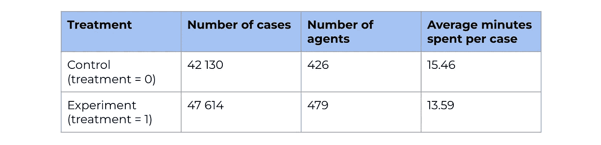

我通常还会查看实际的分布，因为平均统计数据可能具有误导性。在这种情况下，我们可以看到两个单峰分布，没有明显的离群值。

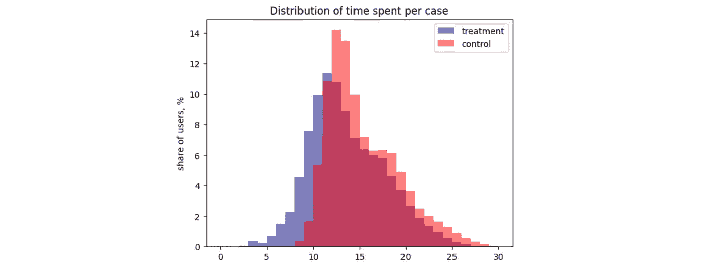

图片来自作者

## 经典统计方法

分析 A/B 测试的经典方法是使用统计公式。使用 [scipy 包](https://docs.scipy.org/doc/scipy/reference/generated/scipy.stats.ttest_ind.html)，我们可以计算两个均值之间差异的置信区间。

```py
# defining samples
control_values = df[df.treatment == 0].time_spent_mins.values
exp_values = df[df.treatment == 1].time_spent_mins.values

# calculating p-values
from scipy.stats import ttest_ind

ttest_ind(exp_values, control_values)
# Output: TtestResult(statistic=-70.2769283935386, pvalue=0.0, df=89742.0)
```

我们得到的 p 值低于 1%。因此，我们可以拒绝零假设，得出结论：控制组和实验组在每个案件的平均处理时间上存在差异。为了了解效应大小，我们还可以计算置信区间。

```py
from scipy import stats
import numpy as np

# Calculate sample statistics
mean1, mean2 = np.mean(exp_values), np.mean(control_values)
std1, std2 = np.std(exp_values, ddof=1), np.std(control_values, ddof=1)
n1, n2 = len(exp_values), len(control_values)
pooled_std = np.sqrt(((n1 - 1) * std1**2 + (n2 - 1) * std2**2) / (n1 + n2 - 2))
degrees_of_freedom = n1 + n2 - 2
confidence_level = 0.95

# Calculate margin of error
margin_of_error = stats.t.ppf((1 + confidence_level) / 2, degrees_of_freedom) * pooled_std * np.sqrt(1 / n1 + 1 / n2)

# Calculate confidence interval
mean_difference = mean1 - mean2
conf_interval = (mean_difference - margin_of_error, 
    mean_difference + margin_of_error)

print("Confidence Interval:", list(map(lambda x: round(x, 3), conf_interval)))
# Output: Confidence Interval: [-1.918, -1.814]
```

如预期的那样，由于 p 值低于 5%，我们的置信区间不包括 0。

传统方法是有效的。然而，我们可以通过线性回归得到相同的结果，这也将使我们能够进行更深入的分析。所以，让我们讨论这种方法。

## 线性回归基础

如我们之前讨论的那样，观察同一对象的两种潜在结果（有处理和无处理）是不可能的。由于我们无法单独估算每个对象的影响，因此我们需要一个模型。让我们假设常数处理效应。


然后，我们可以以以下方式写出结果（处理时间）和处理之间的关系，其中

+   `baseline` 是一个常数，表示结果的基本水平，

+   `residual` 代表我们现在不关心的其他潜在关系（例如，代理的成熟度或案件的复杂性）。


这是一条线性方程，我们可以使用线性回归来获得`impact`变量的估计值。我们将使用[OLS（普通最小二乘法）](https://www.statsmodels.org/stable/generated/statsmodels.formula.api.ols.html)函数，来自`statsmodels`包。

```py
import statsmodels.formula.api as smf
model = smf.ols('time_spent_mins ~ treatment', data=df).fit()
model.summary().tables[1]
```

结果中，我们得到了所有需要的信息：效果估计（`treatment`变量的系数）、其 p 值和置信区间。


由于 p 值极小（明显低于 1%），我们可以认为效果显著，并且可以说我们的基于 LLM 的工具在 95%的置信区间内，帮助减少了 1.866 分钟的案件处理时间（1.814, 1.918）。你可以注意到，我们得到了与之前统计公式完全相同的结果。

## 添加更多变量

如承诺的那样，我们可以使用线性回归进行更复杂的分析，并考虑更多的因素，所以下来进行分析。在最初的方法中，我们只使用了一个回归变量——`treatment`标志。但是，我们可以添加更多的变量（例如，`complexity`）。


在这种情况下，`impact`将显示考虑了模型中所有其他变量的影响后的估计（在我们的例子中——任务复杂性）。让我们进行估计。将更多的变量添加到回归模型中非常简单——我们只需在方程中添加另一个组件。

```py
import statsmodels.formula.api as smf
model = smf.ols('time_spent_mins ~ treatment + complexity', data=df).fit()
model.summary().tables[1]
```

现在，我们看到效果的估计值略有增加——1.91 分钟对比之前的 1.87 分钟。同时，误差减小了（0.015 对比 0.027），置信区间也变得更窄了。


你还可以注意到，由于复杂性是一个分类变量，它被自动转换成了一组虚拟变量。因此，我们得到了低复杂度任务为-9.8 分钟，中等复杂度任务为-4.7 分钟的估计值。

让我们试着理解为什么在添加复杂度后我们得到了更可信的结果。客户案件的处理时间显著依赖于任务的复杂性。因此，复杂性负责了我们变量方差的很大一部分。

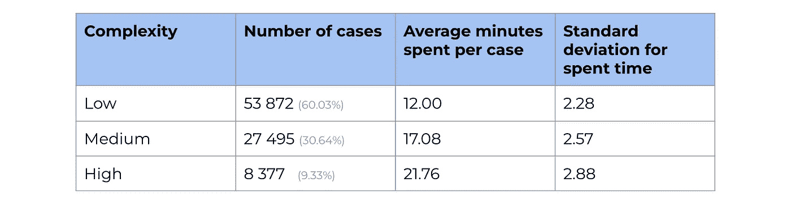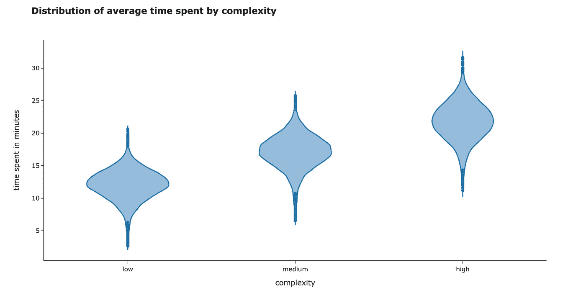

图片由作者提供

正如我之前提到的，`treatment`的系数在考虑了方程中所有其他因素后，估算了影响。当我们将复杂度添加到我们的线性回归中时，它减少了残差的方差，这就是为什么我们得到了一个更窄的时间置信区间。

让我们再确认一下复杂性是否解释了方差的显著比例。我们可以看到一个显著的下降：时间花费的方差为 16.6，但当考虑复杂性时，它减少到了仅为 5.9。

```py
time_model = smf.ols('time_spent_mins ~ complexity', data=df).fit()

print('Initial variance: %.2f' % (df.time_spent_mins.var()))
print('Residual variance after accounting for complexity: %.2f' \
  % (time_model.resid.var()))

# Output: 
# Initial variance: 16.63
# Residual variance after accounting for complexity: 5.94
```

所以，我们可以看到，向线性回归中添加一个可以预测结果变量的因素，可以改善你的效应估计。此外，值得注意的是，这个变量与治疗分配无关（每个复杂度的任务有相等的机会分配到控制组或实验组）。

传统上，因果图被用来显示变量之间的关系。让我们画出这样的图来表示我们当前的情况。

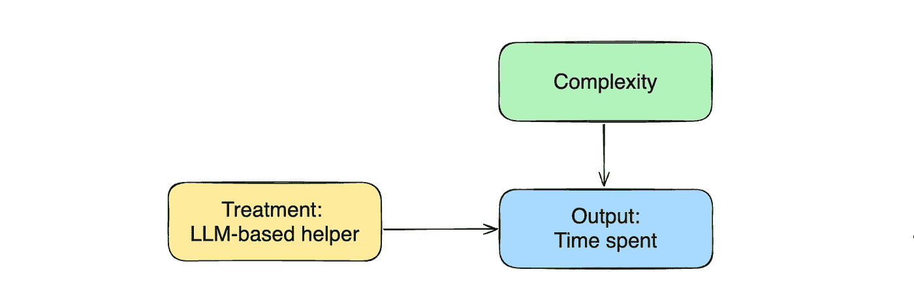

图片由作者提供

## 非线性关系

到目前为止，我们只看了线性关系，但有时候，仅仅线性模型并不足以描述我们的情况。

让我们来看看实验组代理人应当通过的 LLM 训练数据。只有一半的代理人通过了 LLM 训练并学会了如何有效地使用新工具。

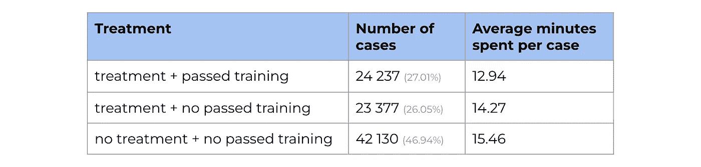

我们可以看到，通过训练的处理组和未通过训练的代理人在平均时间上有显著差异。

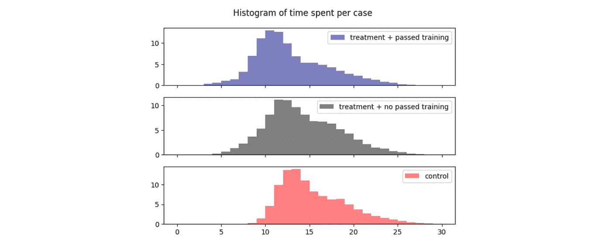

图片由作者提供

所以，我们应该期待这两组在处理上的不同影响。我们可以使用非线性来表达这种关系，并在方程中加入`treatment * passed_training`项。

```py
model = smf.ols('time_spent_mins ~ treatment * passed_training + complexity', 
    data=df).fit()
model.summary().tables[1]
```

`treatment`和`passed_training`因素也会自动添加到回归模型中。所以，我们将优化以下公式。

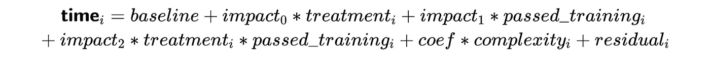

我们从线性回归中得到了以下结果。

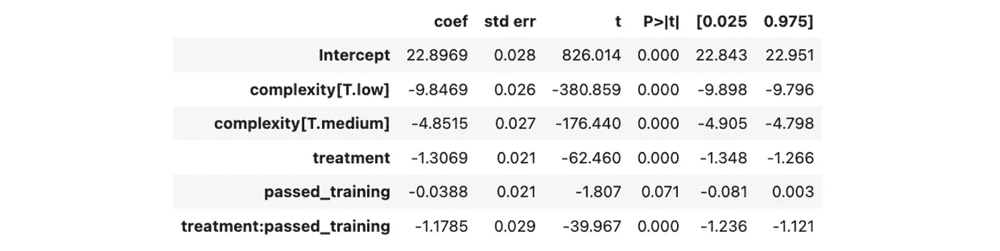

与通过训练相关的影响没有统计学意义，因为 p 值超过了 5%，而其他系数则显著不同于零。

让我们列出所有不同的情景，并使用我们从线性回归中得到的系数来估计效果。

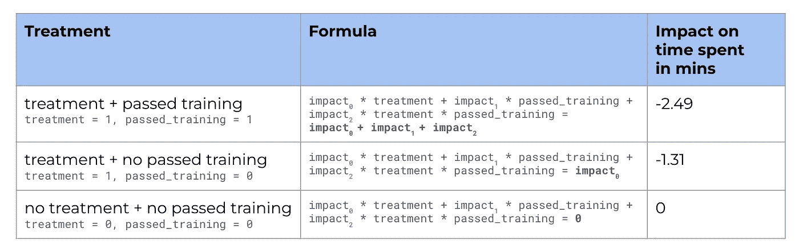

所以，我们得到了新的处理估计：通过训练的代理人每个案例平均提高 2.5 分钟，而未通过训练的代理人则是 1.3 分钟。

## 混杂因素

在得出结论之前，值得再检查一下我们所做的一些假设——例如，随机分配。我们已经讨论过，我们在一些计算机科学中心开展了实验。让我们检查不同中心的代理人是否相似，以确保我们的控制组和实验组没有偏差。

我们知道，代理人因经验不同，其表现可能会有显著差异。我们的日常直觉告诉我们，更有经验的代理人会在任务上花费更少的时间。从数据中我们可以看到，确实是这样。

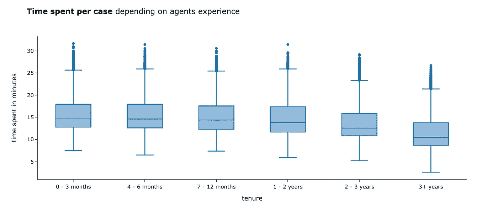

图片由作者提供

让我们看看我们的实验组和对照组是否有相同水平的代理人经验。最简单的方法是查看分布。

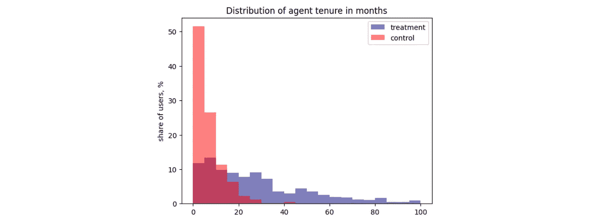

图片由作者提供

显然，治疗组的代理比控制组的代理有更多的经验。总体来说，产品团队决定从经验更丰富的代理开始实验是有道理的。然而，这打破了我们关于随机分配的假设。由于控制组和测试组即便没有治疗也存在差异，我们高估了 LLM 工具对代理表现的影响。

让我们回到因果图。代理的经验同时影响治疗分配和输出变量（花费时间）。这类变量被称为混杂因素。

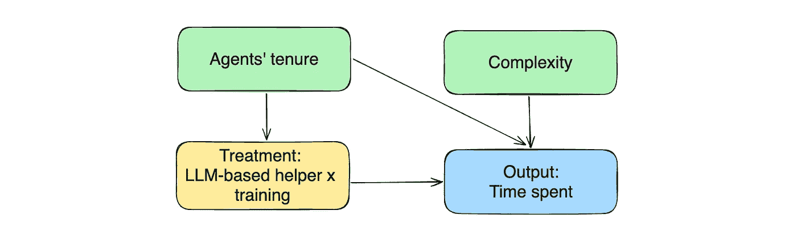

图片来自作者

别担心。我们可以轻松解决这个问题——只需要在我们的方程中包含混杂因素来进行控制。当我们将其添加到线性回归中时，我们开始在固定经验的前提下估计治疗效应，从而消除偏差。让我们试试看。

```py
model = smf.ols('time_spent_mins ~ treatment * passed_training + complexity + tenure', data=df).fit()
model.summary().tables[1]
```

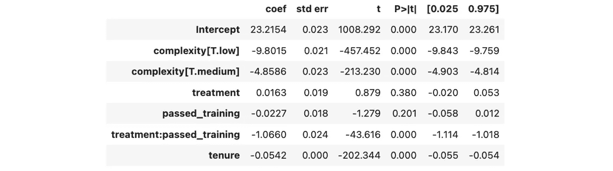

加入任期后，我们得到了以下结果：

+   单独考虑通过培训或治疗的影响并无统计学显著性，因为 p 值高于 5%。因此，我们可以得出结论，LLM 助手不会影响代理的表现，除非他们通过了培训。在之前的迭代中，我们看到过一个统计学显著的效果，但那是由于任期混杂偏差造成的。

+   唯一具有统计学显著性的效果是对于通过培训的治疗组。其结果为 1.07 分钟，95%的置信区间为（1.02，1.11）。

+   每个月的任期与任务上花费时间减少 0.05 分钟相关。

我们使用的是合成数据，因此可以轻松地将我们的估计与实际效果进行比较。如果代理通过了培训，LLM 工具可以将每个任务所花费的时间减少 1 分钟，因此我们的估计相当准确。

## 不良控制

机器学习任务通常很简单：你收集尽可能多的特征数据，尝试拟合一些模型，比较它们的表现，然后选择最佳模型。相反，因果推断需要一些技巧和对所处理过程的深刻理解。一个关键问题是，哪些特征值得纳入回归分析，哪些特征会破坏你的结果。

直到现在，我们添加到线性回归中的所有额外变量都在提高准确性。所以，你可能认为将所有特征都添加到回归分析中将是最佳策略。不幸的是，因果推断并不是那么简单。在本节中，我们将讨论几个额外变量反而降低估计准确性的情况。

例如，我们的数据中有一个客户服务中心。我们基于客户服务中心分配了治疗，因此将其纳入回归分析可能听起来合情合理。让我们试试看。

```py
model = smf.ols('time_spent_mins ~ treatment + complexity + tenure + cs_center', 
    data=df[df.treatment == df.passed_training]).fit()
model.summary().tables[1]
```

为了简化，我已从数据集和方程中去除非线性因素，筛选出那些治疗组中的代理没有通过 LLM 培训的情况。

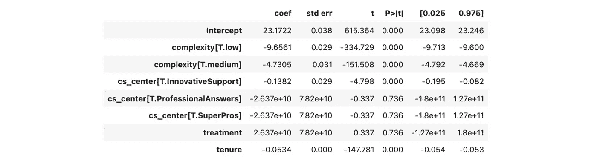

如果我们将 CS 中心包含在线性回归中，我们将得到一个荒谬的高估计效果（大约数十亿），但没有统计显著性。因此，这个变量比有帮助更有害。

让我们更新一个因果图，并尝试理解为什么它不起作用。CS 中心是我们治疗的预测因子，但与输出变量没有关系（因此它不是一个混杂变量）。增加一个治疗预测因子会导致[多重共线性](https://en.wikipedia.org/wiki/Multicollinearity)（就像在我们这个例子中）或减少治疗的方差（因为治疗变化不大，很难估计治疗对输出变量的影响）。因此，将这样的变量加入方程是不好的做法。

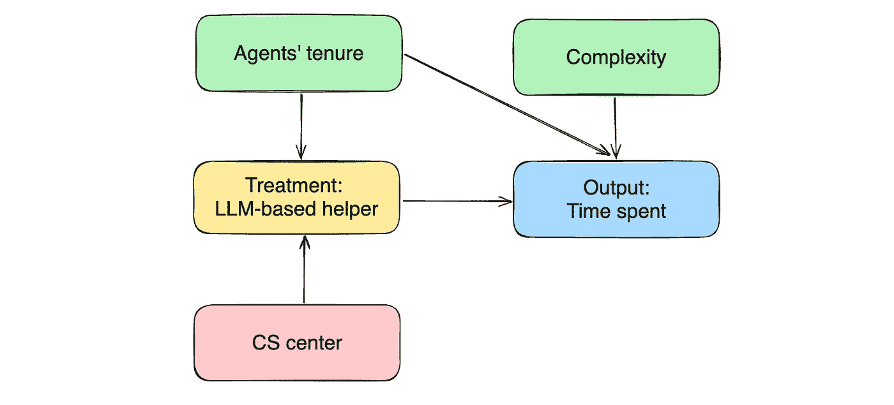

图片由作者提供

让我们来看另一个例子。我们有一个`within_sla`变量，表示代理是否在 15 分钟内完成任务。这个变量能否提高我们的效果估计质量？让我们看看。

```py
model = smf.ols('time_spent_mins ~ treatment + complexity + tenure + within_sla', 
    data=df[df.treatment == df.passed_training]).fit()
model.summary().tables[1]
```

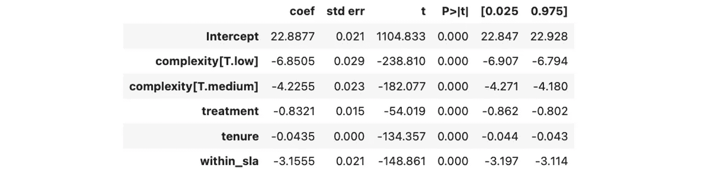

新的效果估计值大大降低：0.8 分钟对比 1.1 分钟。那么，这就提出了一个问题：哪一个更准确？我们在这个模型中增加了更多参数，因此它更复杂。难道它应该提供更精确的结果吗？不幸的是，情况并不总是这样。让我们深入探讨一下。

在这种情况下，`within_sla`标志表示代理是否在 15 分钟内解决了问题，或者问题花费了更多时间。因此，如果我们回到我们的因果图，`within_sla`标志是我们的输出变量（任务所花费的时间）的一个结果。

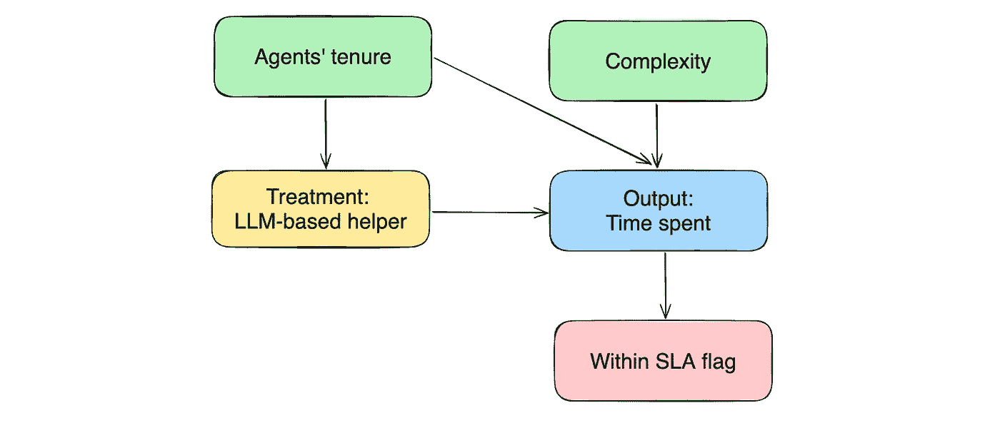

图片由作者提供

当我们将`within_sla`标志加入回归并加以控制时，我们开始估计治疗的效果，固定`within_sla`的值。因此，我们将有两种情况：`within_sla = 1`和`within_sla = 0`。让我们看看它们的偏差。

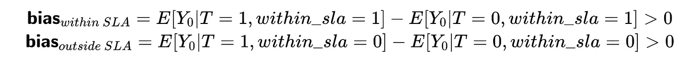

在这两种情况下，偏差不等于 0，这意味着我们的估计是有偏的。乍一看，这似乎有点违反直觉。让我稍微解释一下其中的逻辑。

+   在第一个方程中，我们比较了使用 LLM 工具和不使用 LLM 工具的代理在 15 分钟内完成任务的情况。之前的分析表明，LLM 工具（我们的治疗手段）通常能加速代理的工作。所以，如果我们比较没有治疗（即代理独立工作而没有 LLM 工具）时预期的任务完成时间，我们应该预期第二组的响应会更快。

+   类似地，对于第二个方程，我们正在比较没有在 15 分钟内完成任务的代理，即使在 LLM 的帮助下，以及那些独立完成任务的代理。我们应该预期第一组在没有治疗的情况下响应时间更长。

这是选择偏差的一个例子——当我们控制了从处理到输出变量或输出变量结果路径上的一个变量时，就会发生这种情况。在进行线性回归时控制这些变量也会导致偏差估计，所以不要这么做。

## 分组数据

在某些情况下，你可能没有详细的数据。在我们的例子中，我们可能不知道每个任务单独花费的时间，但知道平均时间。跟踪代理的汇总数据更容易。例如，“在两个小时内，一名代理完成了 15 个中等难度的任务”。我们可以将原始数据进行汇总，从而获得这些统计数据。

```py
agents_df = df.groupby(['agent_id', 'treatment', 'complexity', 'tenure', 
  'passed_training'], as_index = False).aggregate(
    {'case_id': 'nunique', 'time_spent_mins': 'mean'}
)
```

对于线性回归来说，处理代理级别的数据并不是问题。我们只需要为每个代理指定权重（等于案例的数量）。

```py
 model = smf.ols('time_spent_mins ~ treatment + complexity + tenure', 
    data = agents_df[agents_df.treatment == agents_df.passed_training],
    weights = agents_df[agents_df.treatment == agents_df.passed_training]['case_id'])\
    .fit()
model.summary().tables[1]
```

对于汇总数据，我们得到的治疗效果的结果大致相同。所以，如果你只有平均数据，也没有问题。

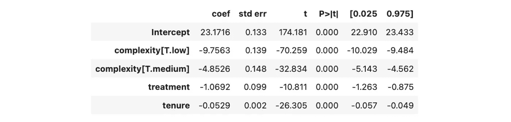

# 使用案例：观察性数据

我们已经详细查看了用于因果推断的 A/B 测试例子。然而，在许多情况下，我们不能进行适当的随机试验。以下是一些例子：

+   有些实验是不道德的。例如，你不能强迫学生饮酒或吸烟，看它如何影响他们在大学的表现。

+   在某些情况下，由于法律限制，你可能无法进行 A/B 测试。例如，你不能对同一产品收取不同的价格。

+   有时，这简直是不可能的。例如，如果你正在进行大规模的品牌重塑，你将不得不在某一天通过一个大的公关宣布全球推出。

在这种情况下，你必须仅凭观察数据得出结论。让我们看看在这种情况下我们的方法如何发挥作用。我们将使用[学生表现数据集](https://archive.ics.uci.edu/dataset/320/student+performance)来自加州大学欧文分校的机器学习库。

让我们使用这个实际数据集来研究愿意接受高等教育的意愿如何影响数学课程的最终成绩。我们将从一个简单的模型和因果图开始。


图片由作者提供

```py
df = pd.read_csv('student-mat.csv', sep = ';')
model = smf.ols('G3 ~ higher', data=df).fit()
model.summary().tables[1]
```

我们可以看到，继续教育的意愿在统计上显著地提高了课程的最终成绩，增加了 3.8 分。


然而，可能存在一些混杂因素，我们必须加以控制。例如，父母的教育水平可能同时影响治疗效果（*如果父母受过教育，孩子更有可能计划接受高等教育*）和结果（*受过教育的父母更可能帮助孩子，因此孩子的成绩更高*）。让我们将母亲和父亲的教育水平添加到模型中。

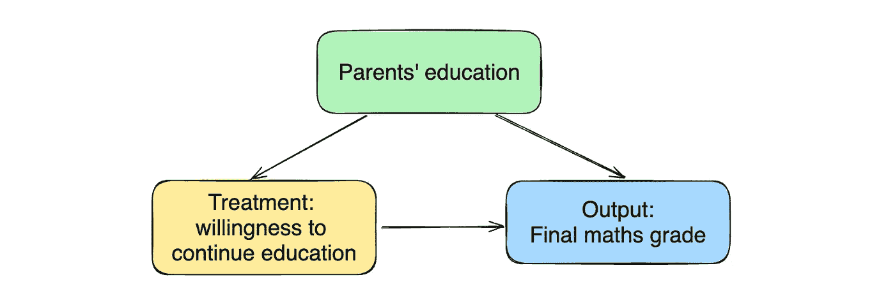

图片由作者提供

```py
model = smf.ols('G3 ~ higher + Medu + Fedu', data=df).fit()
model.summary().tables[1]
```

我们可以看到母亲的教育水平对结果有统计学上的显著影响。我们可能提高了估计的准确性。

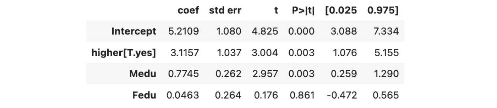

然而，我们应该对任何基于观察性数据得出的因果结论持谨慎态度。我们不能确定是否已经考虑了所有混杂变量，并且我们得到的估计是否完全无偏。

此外，解释关系的方向可能会有些棘手。我们确信继续教育的意愿与最终成绩之间存在相关性。然而，我们可以从多个角度来解释这一点：

+   希望继续接受教育的学生更有动力，因此他们的最终成绩较高。

+   成绩较高的学生受到学习成功的激励，这就是为什么他们想继续教育的原因。

在观察性数据中，我们只能凭借常识选择一种选项。我们无法仅通过数据推断出这个结论。

尽管存在一些局限性，我们仍然可以使用这个工具尽力得出一些关于世界的结论。正如我提到的，因果推断在很大程度上依赖于领域知识和常识，因此值得花时间在白板旁深思熟虑你所建模的过程。这将有助于你取得卓越的成果。

> 你可以在[GitHub](https://github.com/miptgirl/miptgirl_medium/tree/main/causal_inference_linear_regression)上找到这些示例的完整代码。

# 总结

我们讨论了一个相当广泛的因果推断主题，让我来总结一下我们所学到的内容：

+   预测分析的主要目标是获得准确的预测。因果推断侧重于理解变量之间的关系，因此我们更关心模型中的系数，而非实际的预测结果。

+   我们可以利用线性回归得出因果结论。

+   理解我们应该在线性回归中添加哪些特征是一门艺术，但这里有一些指导。

    — 必须包括混杂变量（同时影响处理和结果的特征）。

    — 添加一个能预测输出变量并解释其变化的特征，可以帮助你获得更有信心的估计。

    — 避免添加仅影响处理或是输出变量结果的特征。

+   你可以将这种方法应用于 A/B 测试和观察性数据。然而，对于观察性数据，我们应当对因果结论持谨慎态度，因为我们无法确保已经考虑了所有混杂变量。

> 非常感谢你阅读这篇文章。如果你有任何后续问题或评论，请在评论区留言。

# 数据集

*Cortez, Paulo. (2014). 学生表现。* *UCI 机器学习库 (CC BY 4.0)。* [`doi.org/10.24432/C5TG7T`](https://doi.org/10.24432/C5TG7T.)

# 参考文献

*除非另有说明，所有图片均由作者制作。*

本文的灵感来源于《[勇敢而真实的因果推断](https://matheusfacure.github.io/python-causality-handbook/landing-page.html)》一书，该书对因果推断的基础进行了精彩的概述。
