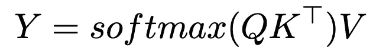
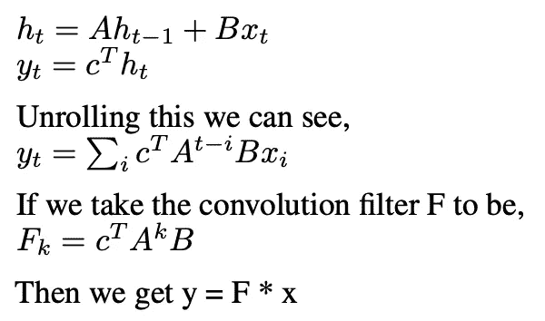

# 线性化注意力

> 原文：[`towardsdatascience.com/linearizing-attention-204d3b86cc1e?source=collection_archive---------3-----------------------#2024-12-26`](https://towardsdatascience.com/linearizing-attention-204d3b86cc1e?source=collection_archive---------3-----------------------#2024-12-26)

## 打破二次方限制：softmax 注意力的现代替代方案

 [Shitanshu Bhushan](https://medium.com/@shitanshu273?source=post_page---byline--204d3b86cc1e--------------------------------)

·发布于 [Towards Data Science](https://towardsdatascience.com/?source=post_page---byline--204d3b86cc1e--------------------------------) ·阅读时间 8 分钟·2024 年 12 月 26 日

--

大型语言模型非常强大，但它们有一个小缺点，即使用 softmax 注意力，这可能会导致计算开销较大。在本文中，我们将探索是否有办法通过某种方式替换 softmax，从而实现线性时间复杂度。

作者提供的图片（使用 Miro Board 创建）

# 注意力机制基础

我假设你已经了解 ChatGPT、Claude 之类的内容，以及 Transformer 在这些模型中的工作原理。那么，注意力就是这些模型的核心。如果我们考虑普通的 RNN，我们会将所有过去的状态编码到一个隐藏状态中，然后使用这个隐藏状态与新的查询一起得到输出。一个明显的缺点是，你不能把所有信息都存储在一个小小的隐藏状态中。这就是注意力机制的作用，想象一下，对于每一个新的查询，你可以找到最相关的过去数据，并使用这些数据来做出预测。这就是注意力机制的本质。

Transformer 中的注意力机制（大多数当前语言模型背后的架构）涉及键、查询和值的嵌入。Transformer 中的注意力机制通过将查询与键进行匹配来检索相关值。对于每个查询（Q），模型计算与所有可用键（K）的相似度分数，然后利用这些分数创建相应值（Y）的加权组合。这个注意力计算可以表达为：

来源：作者提供的图片

这一机制使模型能够在做出预测时，有选择性地从整个上下文中提取和利用信息。我们在这里使用 softmax，因为它能有效地将原始相似度分数转换为标准化的概率，类似于 k 最近邻机制，其中更高的注意力权重会分配给更相关的键。

好的，现在让我们看一下 1 层注意力的计算成本，

来源：图片由作者提供

## Softmax 缺点

从上面的内容可以看出，我们需要计算一个 NxN 矩阵的 softmax，因此，我们的计算成本随着序列长度的增加呈二次增长。对于较短的序列，这没问题，但对于长序列，N=100k+ 时，它变得极其低效。

这给了我们动机：我们能否减少计算成本？这就是线性注意力的作用所在。

# 线性注意力

由 [Katharopoulos 等人](https://arxiv.org/pdf/2006.16236)提出，线性注意力使用了一种巧妙的技巧，将 softmax 指数表示为一个核函数，表现为特征映射 φ(x) 的点积。利用矩阵乘法的结合律，我们可以将注意力计算重写为线性。下图展示了这一转换：

来源：图片由作者提供

[Katharopoulos 等人](https://arxiv.org/pdf/2006.16236)使用 elu(x) + 1 作为 φ(x)，但任何能够有效逼近指数相似度的核特征映射都可以使用。上述计算成本可以表示为：

来源：图片由作者提供

这样就不再需要计算完整的 N×N 注意力矩阵，并将复杂度降低到 O(Nd²)。其中 d 是嵌入维度，当 N >>> d 时，这实际上是线性复杂度，这通常适用于大规模语言模型。

好的，让我们来看一下线性注意力的递归视角，

来源：图片由作者提供

好的，为什么我们可以在线性注意力中做这个，而不能在 softmax 中做呢？嗯，softmax 不是可分离的，因此我们无法将其写成独立项的乘积。这里值得注意的是，在解码过程中，我们只需要跟踪 S_(n-1)，每生成一个 token 就能达到 O(d²) 的复杂度，因为 S 是一个 d × d 的矩阵。

然而，这种效率带来了一个重要的缺点。由于 S_(n-1) 只能存储 d² 信息（它是一个 d × d 的矩阵），我们面临着一个根本的限制。例如，如果原始上下文长度需要存储 20d² 的信息，你将实际上在压缩过程中丢失 19d² 的信息。这展示了线性注意力中的核心内存效率权衡：通过仅保持固定大小的状态矩阵，我们获得了计算效率，但这种固定大小限制了我们可以保留的上下文信息量，这也给我们提供了引入门控机制的动机。

# 门控线性注意力

好的，我们已经确定，在使用固定大小的状态矩阵优化效率时，我们不可避免地会遗忘信息。这引出了一个重要的问题：我们能否聪明地选择记住什么信息？这就是门控机制的作用——研究人员将其作为一种选择性地保留重要信息的机制，通过战略性地选择保留哪些信息来尽量减少记忆丧失的影响。门控并不是一个新概念，它在像 LSTM 这样的架构中已经得到广泛应用。

这里的基本变化在于我们如何公式化 Sn，

来源：作者提供的图片

有许多选择可以决定 G，这些选择会导致不同的模型，

来源：[Yang, Songlin, et al. “Gated linear attention transformers with hardware-efficient training.” *arXiv preprint arXiv:2312.06635*(2023).](https://arxiv.org/pdf/2312.06635)

这种架构的一个关键优势是，门控函数仅依赖于当前标记 x 和可学习的参数，而不是整个序列历史。由于每个标记的门控计算是独立的，这使得在训练过程中能够高效地进行并行处理——整个序列的所有门控计算可以同时执行。

# 状态空间模型

当我们想到处理像文本或时间序列这样的序列时，我们的大脑通常会跳到注意力机制或 RNN。但如果我们采取完全不同的方法呢？如果我们不把序列当作序列来处理，而是像 CNN 处理图像一样，通过卷积来处理它们呢？

状态空间模型（SSMs）通过离散线性时不变系统形式化了这种方法：

来源：作者提供的图片

好的，现在让我们看看这与卷积有什么关系，

来源：作者提供的图片

其中 F 是我们从参数（A, B, c）中学习到的滤波器，*表示卷积。

[H3](https://arxiv.org/pdf/2212.14052)通过一种新颖的结构化架构实现了这种状态空间公式，该架构由两个互补的 SSM 层组成。

来源：[Fu, Daniel Y., et al. “Hungry hungry hippos: Towards language modeling with state space models.” *arXiv preprint arXiv:2212.14052* (2022).](https://arxiv.org/pdf/2212.14052)

在这里，我们将输入分解为 3 个通道，以模仿 K、Q 和 V。然后，我们使用 2 个 SSM 和 2 个门控来模仿线性注意力，事实证明，这种架构在实践中效果相当不错。

# 选择性状态空间模型

早些时候，我们看到门控线性注意力如何通过使信息保持过程数据依赖，改进了标准的线性注意力。状态空间模型中也存在类似的限制——控制状态转移和输出的参数 A、B 和 c 是固定的且与数据无关。这意味着每个输入都通过相同的静态系统进行处理，而不考虑其重要性或上下文。

我们可以通过引入时变动态系统，使 SSM（状态空间模型）成为数据依赖的，从而扩展 SSM：

来源：作者提供的图片

关键问题变成了如何将 c_t、b_t 和 A_t 参数化为输入的函数。不同的参数化方式可以导致接近线性或门控注意力机制的架构。

[Mamba](https://arxiv.org/pdf/2312.00752)通过选择性 SSM 模块实现了这种时变状态空间的表达。

来源：[Gu, Albert, and Tri Dao. “Mamba: Linear-time sequence modeling with selective state spaces.” *arXiv preprint arXiv:2312.00752* (2023).](https://arxiv.org/pdf/2312.00752)

在这里，Mamba 使用了选择性 SSM 代替了 SSM，并通过输出门控和额外的卷积来提高性能。这是一个非常高层次的思想，解释了 Mamba 如何将这些组件组合成一个高效的序列建模架构。

# 结论

在本文中，我们探讨了高效序列建模架构的演变。从传统的 softmax 注意力开始，我们识别出其二次复杂度限制，这促使了线性注意力的发展。通过使用核函数重写注意力，线性注意力实现了 O(Nd²)的复杂度，但由于固定大小的状态矩阵，它面临着内存限制。

这种限制促使了门控线性注意力的提出，通过门控机制引入了选择性信息保持。我们接着从状态空间模型的角度进行了探讨，展示了它们如何通过类似卷积的操作来处理序列。从基础 SSM 到时变系统，再到选择性 SSM 的进展，与我们从线性到门控注意力的历程相似——在这两种情况下，使模型更加适应输入数据对于性能至关重要。

通过这些发展，我们看到了一个共同的主题：计算效率与内存容量之间的基本权衡。Softmax 注意力通过保持对整个序列的完全关注，擅长于上下文学习，但代价是二次复杂度。线性变体（包括 SSM）通过固定大小的状态表示实现了高效计算，但这种优化限制了它们保持过去上下文详细记忆的能力。这个权衡继续成为序列建模中的核心挑战，推动着对能够更好平衡这些竞争需求的架构的探索。

想要了解更多相关主题，我建议阅读以下论文：

**线性注意力**: [Katharopoulos, Angelos 等. “Transformers are rnns: Fast autoregressive transformers with linear attention.” *国际机器学习会议*. PMLR, 2020.](https://arxiv.org/pdf/2006.16236)

**GLA**: [Yang, Songlin 等. “Gated linear attention transformers with hardware-efficient training.” *arXiv 预印本 arXiv:2312.06635* (2023).](https://arxiv.org/pdf/2312.06635)

**H3**: [Fu, Daniel Y. 等. “Hungry hungry hippos: Towards language modeling with state space models.” *arXiv 预印本 arXiv:2212.14052* (2022).](https://arxiv.org/pdf/2212.14052)

**Mamba**: [Gu, Albert 和 Tri Dao. “Mamba: Linear-time sequence modeling with selective state spaces.” *arXiv 预印本 arXiv:2312.00752* (2023).](https://arxiv.org/pdf/2312.00752)

[Waleffe, Roger 等. “An Empirical Study of Mamba-based Language Models.” *arXiv 预印本 arXiv:2406.07887* (2024).](https://arxiv.org/pdf/2406.07887)

# 致谢

这篇博客文章的灵感来源于我在 2024 年秋季于密歇根大学研究生课程中的学习。尽管这些课程提供了探索这些主题的基础知识和动机，但本文中的任何错误或误解完全是我个人的责任。这代表了我对这些材料的个人理解和探索。
