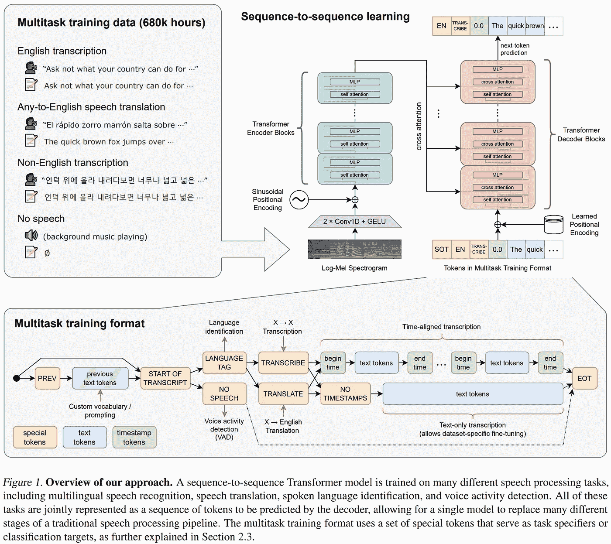
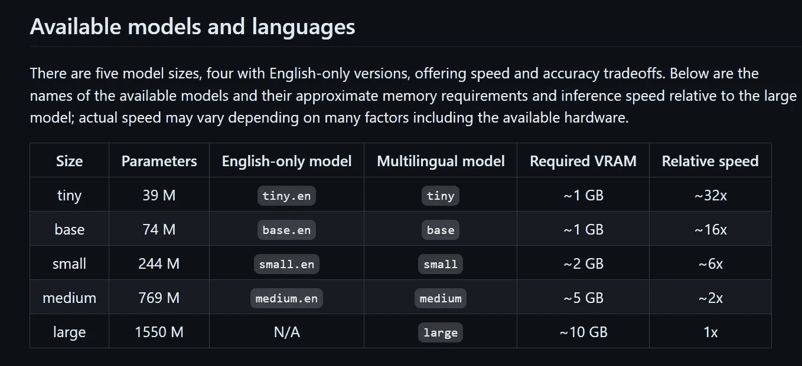

# LingoNaut 语言助手

> 原文：[`towardsdatascience.com/lingonaut-language-assistant-6abe3e8b045c?source=collection_archive---------3-----------------------#2024-02-11`](https://towardsdatascience.com/lingonaut-language-assistant-6abe3e8b045c?source=collection_archive---------3-----------------------#2024-02-11)

## 使用 Ollama-Python 对讲机进行多语言学习

[](https://natecibik.medium.com/?source=post_page---byline--6abe3e8b045c--------------------------------)[](https://towardsdatascience.com/?source=post_page---byline--6abe3e8b045c--------------------------------) [Nate Cibik](https://natecibik.medium.com/?source=post_page---byline--6abe3e8b045c--------------------------------)

·发表于 [Towards Data Science](https://towardsdatascience.com/?source=post_page---byline--6abe3e8b045c--------------------------------) ·阅读时长 11 分钟·2024 年 2 月 11 日

--


图像由作者使用 DALL-E 3 创建。

我们生活在一个世界真正触手可及的时代，只要我们知道该往哪里看。今天的开源大型语言模型（LLMs）足够强大和紧凑，可以将人类知识的完整集合放置在标准消费级硬件上，提供数小时无广告的深入讨论，涉及无数主题，且无需互联网连接。感谢开源社区的努力，像 [Ollama](https://ollama.ai/) 这样的工具使我们能够在本地提供今天顶级模型的高质量量化版本，并通过简化的 API 与之互动。

这种开发的便利性意味着我们可以减少花费在思考*如何*构建 LLM 应用上的时间，更多地关注*我们*想要构建的内容。就个人而言，我一直想学习多种语言，但由于我的生活经历中没有足够的多语言环境，且在旅游语言学习时，因缺乏亲密的朋友可供练习，这种学习往往会显得尴尬，因为我们不得不在陌生人身上进行试探。

这是一个有前景的机会，旨在利用基于大型语言模型（LLM）的聊天机器人开放式对话能力。由于如今在消费级硬件上本地化运行量化的开源 LLM 已经成为一个高效的流程，我们所需要做的唯一一件事就是将互动方式扩展为语音到语音的格式。同样，开源研究的成果为我们提供了便利。高质量的语音转文本和文本转语音模型已经准备就绪，并配有直观的 API 接口。

一个完美展示这些工具如何轻松地将激动人心的概念变为现实的示例就是 LingoNaut：一个多语言语言助手，它运行在一个仅包含 300 行代码的单一 Python 脚本中。通过结合 OpenAI 的 [Whisper](https://github.com/openai/whisper) 语音转文本模型、本地 Ollama 服务器和 Coqui.ai 的 [TTS](https://github.com/coqui-ai/TTS) 文本转语音库，我们可以构建一个用户友好的对讲机界面，并提供多种 LLM 选择。从这里开始，只需要进行系统提示工程（通过 [ollama-python](https://github.com/ollama/ollama-python) 容易完成），就可以从 LLM 中召唤出我们所需的行为，在这个案例中，创造一个有用的多语言语言导师。实际上，这意味着 LingoNaut 的代码可以轻松适应，通过调整使用的 LLM 和系统提示，就能创建各种各样的 AI 助手。

LingoNaut 应用演示。

运行 LingoNaut 的代码可以在 [GitHub 仓库](https://github.com/FoamoftheSea/lingonaut-python)中找到，提供了简单的安装说明。LingoNaut 是一个开源项目，欢迎贡献。例如，未来的工作可能涉及将后端包装成更复杂的网页 UI，以支持远程托管对讲机 LLM 应用，从而支持移动设备。我希望 LingoNaut 能成为一个有趣且有用的资源，帮助其他人在他们的学习旅程中，同时也希望这段代码能作为一个轻量级的框架，供工程师们在沙盒中实验新的 LLM 或 LMM 基于的应用想法。

本文的其余部分概述了运行 LingoNaut 的 Python 代码，LingoNaut 是一个开源组件工具箱，使得像 LingoNaut 这样的工具能够轻松组合成型，并且为未来的工作提供了有前景的方向。通过一些巧妙的 Python 编程技巧、出色的语音转文本和文本转语音模型，以及在消费者机器上本地部署量化的 LLM（大语言模型），我们可以轻松构建一个语音对语音的管道，来解锁那些不太适合文本形式的应用场景，例如语言学习。研究界的聪明贡献汇聚在一起，为我们提供了这一系列非凡的可能性。让我们更详细地走一遍每一个步骤，理解它们在让 LingoNaut 应用成为现实过程中所扮演的角色。

# LingoNaut 代码


图片由作者使用 DALL-E 3 制作。

## 对讲机界面

LingoNaut 中的代码创建了一个方便的基于终端的语音到语音应用，可以与 Ollama 一起使用，并且可以轻松适应新的使用场景。通过使用一个名为[pynput](https://pypi.org/project/pynput/)的包，我们可以创建一个在后台线程中运行并响应用户按键的键盘监听器对象。这为运行在连续循环中的应用提供了广泛的选项，最重要的是在这种情况下提供一个控制，用于触发和终止用户音频录制，而无需图形用户界面和按钮。这样，互动式应用程序可以直接从终端运行，从而简化了许多工程问题。

在 LingoNaut 中，可以通过按不同的键来录制音频，从而部署不同的语音转文本模型。轻量级的 Whisper 模型在快速处理英语音频方面表现优异，而更大且较慢的模型则必须用于准确的多语言实时转录。因此，用户可以选择按住**Ctrl**键使用轻量级基础模型来提问英语问题，或者按住**Shift**键来用其他语言进行对话。

由键盘监听器启用的其他有用的 LingoNaut 功能包括，当你输入错误或对响应方向不满意时，可以通过按**End**键中断模型响应。这防止了因等待无关的文本和音频完成播放而被卡住，从而使用户能够保持更高的参与度。用户还可以通过按**F2**键锁定键盘输入，这样他们就可以在不担心意外触发音频录制的情况下，保持会话打开以供以后使用。

## 并发

尽管 LingoNaut 中使用的软件包为与创建语音到语音管道的三个模型接口提供了简化的 API，但单纯等待大型语言模型（LLM）生成文本、将其转录为音频，然后将音频串行播放给用户，将是一个非常慢的体验。LLM 文本块的流式传输、文本块转录成音频文件以及播放先前转录的音频文件都可以同时发生，因此 LingoNaut 为每个任务使用了独立的线程。通过使用`ThreadPoolExecutor`对象并将`max_workers`设置为 1，我们可以轻松地为任务提交打开新的线程，同时确保任务按顺序执行，从而使我们能够将工作从主线程外包，而不会出现重叠或顺序错乱的返回。以下是该安排的基本代码框架：

```py
import ollama
from concurrent import ThreadPoolExecutor

def play_audio(file_path: str):
    # audio file playback code

def dump_to_audio(text: str, file_path: str):
    # transcribe text-to-speech and save audio file

def process_stream(chat_history: list):
    stream = ollama.chat(
        model='mistral:lingonaut',
        messages=chat_history,
        stream=True,
    )

    with ThreadPoolExecutor(max_workers=1) as play_pool:
        with ThreadPoolExecutor(max_workers=1) as tts_pool:
            def play_output(text, file_path):
                output_path = dump_to_audio(text, file_path)
                play_pool.submit(play_audio, output_path)
                return

            def process_section(text, file_path):
                tts_pool.submit(play_output, text, file_path)
                return current_string

            current_section = ""
            for i, chunk in enumerate(stream):
                current_path = f"{i}.wav"
                text_chunk = chunk['message']['content']
                current_section += text_chunk
                if len(current_section) > 50:
                    process_section(current_section, current_path)
                    current_section = ""

            tts_pool.shutdown(wait=True)
            play_pool.shutdown(wait=True)
```

## 模型定制

[ollama-python](https://github.com/ollama/ollama-python) 包提供了一个简单的工具，可以使用“Modelfiles”创建自定义标签的模型配置，以引导 LLM 的行为。在 LingoNaut 的情况下，Ollama 库中的 4 位量化 [Mistral 7B](https://mistral.ai/news/announcing-mistral-7b/) 模型通过显式的系统提示进行了自定义，以引导其作为语言学习助手的预期行为。该提示可以在仓库中的 [create_lingonaut_ollama.py](https://github.com/FoamoftheSea/lingonaut-python/blob/main/create_lingonaut_ollama.py) 文件中找到，需要注意的是，这是唯一一个自定义模型选择和行为的文件，这意味着通过创建一个带有不同 Modelfile 的标签模型，您可以立即将这个仓库转换成任何其他的对讲机 LLM 应用程序。根据可用资源，所使用的 LLM 也可以轻松地替换为更大或更小的模型。

# 语音到语音工具箱


作者使用 DALL-E 3 制作的图像。

## Whisper

[Whisper](https://openai.com/research/whisper) 是由 OpenAI 提供的开源语音转文本模型。根据应用的复杂性和所需的准确性与效率的权衡，有五种不同大小的模型可供选择，包括英语专注和多语言版本。Whisper 是一个端到端的语音转文本框架，采用编码器-解码器变压器架构，处理输入音频，将其分割成 30 秒的块并转换为对数 Mel 频谱图。该网络在多个语音处理任务上进行了训练，包括多语言语音识别、语音翻译、口语语言识别和语音活动检测。



来自 [研究论文](https://cdn.openai.com/papers/whisper.pdf) 的 Whisper 架构图。

对于这个项目，用户可以使用两个对讲机按钮：一个将他们的普通英语问题通过更轻量、更快速的“基础”模型发送到机器人，另一个则部署更大的“中型”多语言模型，能够区分数十种语言并准确转录正确发音的语句。在语言学习的背景下，这促使用户更加专注于自己的发音，从而加速学习过程。下面是可用 Whisper 模型的图表：



来自 [`github.com/openai/whisper`](https://github.com/openai/whisper) 的图表

## Ollama

存在各种非常有用的开源语言模型接口，它们针对不同的使用场景提供不同复杂度的设置和使用方式。最广为人知的包括 [oobabooga text-gen webui](https://github.com/oobabooga/text-generation-webui)，它无疑提供了最多的灵活性和底层控制，[llama.cpp](https://github.com/ggerganov/llama.cpp)，最初专注于在小型仅支持 CPU 的设备上优化量化模型的部署，但后来扩展到支持其他硬件类型，以及本项目所选的简化界面（基于 llama.cpp）：[Ollama](https://ollama.ai/)。

Ollama 侧重于简洁性和高效性，能够在后台运行，并能够同时在小型硬件上服务多个模型，根据需要快速将模型载入和移出内存以响应请求。Ollama 的重点不是低级工具，如微调，而是擅长 [简单安装](https://ollama.com/download/linux)、高效的运行时、丰富的 [现成可用模型](https://ollama.com/library)，以及 [导入预训练模型权重的工具](https://github.com/ollama/ollama/blob/main/docs/import.md)。对效率和简洁性的关注使得 Ollama 成为像 LingoNaut 这样的项目中 LLM 接口的自然选择，因为用户无需记得关闭会话以释放资源，因为 Ollama 会在应用程序不使用时自动在后台进行管理。此外，库中对高效、量化模型的便捷访问非常适合无摩擦地开发像 LingoNaut 这样的 LLM 应用。

尽管 Ollama 技术上并未专为 Windows 构建，但 Windows 用户可以轻松地通过 Windows 子系统（[WSL](https://learn.microsoft.com/en-us/windows/wsl/install)）在 Windows 上安装它，并通过 Windows 应用程序与服务器进行通信。安装 WSL 后，打开 Linux 终端并输入一行 Ollama [安装命令](https://ollama.ai/download/linux)。安装完成后，只需在 Linux 终端中运行“ollama serve”，然后就可以通过任何 Windows 机器上的 Python 脚本与 Ollama 服务器进行通信。

## Coqui.ai 🐸 TTS

[TTS](https://github.com/coqui-ai/TTS) 是一个功能齐全的文本转语音库，供非商业用途使用，同时也提供商业许可证。该库非常受欢迎，截至目前在 GitHub 上已有 3k 次分叉和 26.6k 个星标，这也不难理解：该库就像文本转语音领域的 Ollama，提供了一个统一的接口来访问各种高效的模型，涵盖了多种使用场景（例如：为本项目提供一个多说话人、多语言模型）、令人兴奋的功能，如声音克隆，以及对转录速度和情感语调的控制。

TTS 库提供了丰富的文本转语音模型选择，包括 Facebook 研究的“大规模多语言语音”（[MMS](https://research.facebook.com/publications/scaling-speech-technology-to-1000-languages/)）项目中的著名 Fairseq 模型。对于 LingoNaut，Coqui.ai 团队的[XTTS](https://coqui.ai/blog/tts/open_xtts)模型最终被证明是正确的选择，因为它能够无缝地生成多语言的高质量语音。虽然该模型确实有一个“语言”输入参数，但我发现即便将其设置为“en”表示英语，并且仅传递其他语言的文本，依然能生成准确的多语言语音，且发音大多数情况下正确。

# 结论


图像由作者使用 DALL-E 3 生成。

在本文中，我介绍了一款新的语音到语音多语言语言学习助手——LingoNaut。该应用通过终端运行，使用轻量且易于适配的 Python 脚本，并配有对讲机键盘界面。这个完全免费的本地托管应用允许用户利用人工智能练习多种语言，在不需要在准备好之前与陌生人练习的情况下，增强对新语言的信心。代码已在[GitHub](https://github.com/FoamoftheSea/lingonaut-python)上公开，并提供了快速设置说明，同时也容易扩展到新的应用场景。希望社区能在语言学习中从这款应用中受益，并且希望这段代码能作为未来概念验证的便捷轻量框架。LingoNaut 是开源的，欢迎贡献。

## 未来工作

本项目通过将大型语言模型（LLM）的基于文本的对话能力与输入和输出端分别独立的语音转文本和文本转语音模型相结合，构建了一个语音到语音的流程。这种设计比较笨重，容易产生级联错误，因此比使用真正的多模态语言模型更为逊色，后者能够从统一的表示空间中理解和生成音频与文本标记。当我们在将音频传递给模型之前将其编码为文本时，我们丧失了音频中的所有音调信息，包括发音和情感表达，这显著限制了我们的语言助手的先进性。通过使用在联合多模态表示空间上操作的 LLM，我们可以保留用户输入中的微妙音调信息。同样，在输出端进行文本转语音编码也是一个重要的信息瓶颈，导致交互不够自然。

[NeXT-GPT](https://next-gpt.github.io/)的作者提供了一个有前景的框架，用于利用预训练的 LLM（大语言模型）创建大型的多模态模型（LMM），这些模型可以在统一的多模态表示空间中运行，这对于语音到语音的应用程序来说是一个有前景的方向。经过一些努力，发布的 NeXT-GPT 权重可能会被导入到 Ollama 中进行实验。他们的实验使用了一个大小相似的 Vicuna 7B LLM，证明了轻量级 LLM 可以在多模态空间中工作。虽然 Vicuna 模型并未宣传为多语言模型，但 LingoNaut 实验中使用的 Mistral 7B 模型也没有宣传为多语言模型，尽管它似乎在此目的下表现得相当不错。理想情况下，经过微调的多语言指令调优模型将是 LingoNaut 的最佳选择。为此，选择合适的数据集和低秩适配（[LoRA](https://arxiv.org/abs/2106.09685)）可能会导致成功。此外，[LaVIN](https://arxiv.org/abs/2305.15023)展示的轻量级适配器与参数高效的多模态对齐提供了使 NeXT-GPT 风格的 LMM 开发在有限资源下更具可达性的可能。第一步将是调查如何使用 LaVIN 的“廉价且快速”的模态混合适应（MMA）训练策略，将高质量音频编码器的表示与 LLM 对齐，从而缓解输入端的语音转文本瓶颈。接下来的步骤是调查如何使用 NeXT-GPT 风格的模态切换指令调优（MoSIT）来实现多模态输出。

最后，如引言中所提到的，构建一个可以与远程后端通信的 Web UI 前端，将大大扩展 LingoNaut 的乐趣，因为更大的模型可以部署在租用的云 GPU 上，并通过笔记本和移动设备的 https 请求进行通信。这将允许社区构建任何他们想象中的对讲机 LLM 应用程序，让朋友和家人在任何有网络连接的地方都能使用，从而将普遍可访问的语言学习助手的愿景变为现实。
