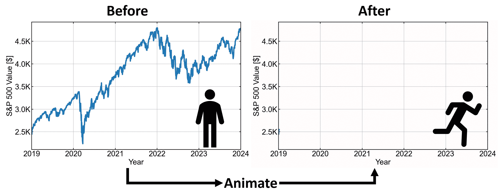

# 使用 FFmpeg 增强数据讲述的实时图表

> 原文：[`towardsdatascience.com/live-graphs-with-ffmpeg-to-enhance-your-data-storytelling-61cc12529382?source=collection_archive---------4-----------------------#2024-04-15`](https://towardsdatascience.com/live-graphs-with-ffmpeg-to-enhance-your-data-storytelling-61cc12529382?source=collection_archive---------4-----------------------#2024-04-15)

## 使用这个 FFmpeg 教程来动画化你的数据可视化

 [Fouad Faraj](https://fouadfaraj.medium.com/?source=post_page---byline--61cc12529382--------------------------------)

·发表于 [Towards Data Science](https://towardsdatascience.com/?source=post_page---byline--61cc12529382--------------------------------) ·阅读时间 4 分钟·2024 年 4 月 15 日

--

2019–2024 年间 S&P 500 值的静态与动态图表对比。图片由作者提供

# 介绍

有大量开源的数据可视化库可用于创建图表，但大多数在创建动态移动图表方面功能有限。最常见的方法是生成多张图像，并通过在线转换器将它们合并成一个.mp4 或.gif 文件，这些转换器受到各种限制，只有付费才能避免这些限制。

以下是我为**免费在线转换器**发现的一些**限制**：

+   最大上传 200 MB

+   最大上传 100 张图片

+   分辨率最高为 800 像素

+   输出视频带水印

锁链图示，说明了免费在线转换器的功能限制。照片由[Jose Fontano](https://unsplash.com/@josenothose?utm_source=medium&utm_medium=referral)提供，来源于[Unsplash](https://unsplash.com/?utm_source=medium&utm_medium=referral)

[**FFmpeg**](https://ffmpeg.org/)是一个**开源**软件工具，用于高效地处理音频和视频数据。FFmpeg 的全称是*Fast Forward Moving Picture Experts Group*，并被 VLC 和 YouTube 等大型公司在后台使用。尽管它在这些大应用程序中被广泛使用，但对于典型的数据科学家来说，它仍然是一个大多未被使用的工具。
