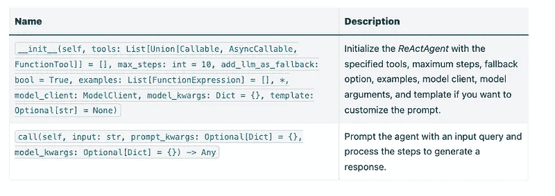
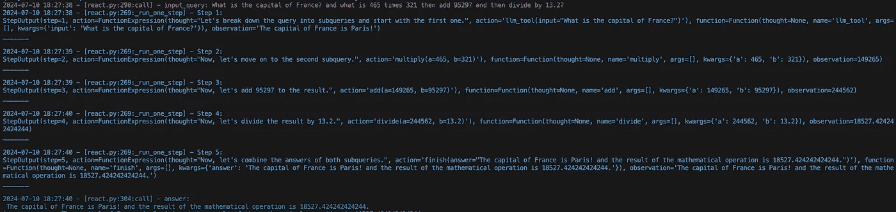

# LLM 代理揭秘

> 原文：[`towardsdatascience.com/llm-agents-demystified-8e2a62c185fa?source=collection_archive---------1-----------------------#2024-07-14`](https://towardsdatascience.com/llm-agents-demystified-8e2a62c185fa?source=collection_archive---------1-----------------------#2024-07-14)

## 使用 AdalFlow 库实现 ReAct 代理

[](https://liyin2015.medium.com/?source=post_page---byline--8e2a62c185fa--------------------------------)[](https://towardsdatascience.com/?source=post_page---byline--8e2a62c185fa--------------------------------) [Li Yin](https://liyin2015.medium.com/?source=post_page---byline--8e2a62c185fa--------------------------------)

·发表于[Towards Data Science](https://towardsdatascience.com/?source=post_page---byline--8e2a62c185fa--------------------------------) ·14 分钟阅读·2024 年 7 月 14 日

--


[图片来源](https://unsplash.com/photos/an-abstract-image-of-a-sphere-with-dots-and-lines-nGoCBxiaRO0)，感谢[Growtika](https://unsplash.com/@growtika)

AdalFlow 库：[`github.com/SylphAI-Inc/AdalFlow`](https://github.com/SylphAI-Inc/AdalFlow)

[**Colab 笔记本**](https://colab.research.google.com/drive/1mpocvG8lPyW1ISOK7SJ4bCt9KmQCP0SJ?usp=sharing)

*“自主代理是一个位于环境中的系统，能够感知该环境并在其中行动，随着时间推移，为了追求自己的目标，进而影响它所感知到的未来。”*

*— Franklin and Graesser (1997)*

除了广为人知的 RAGs（检索增强生成模型），代理[[1]](https://lightrag.sylph.ai/tutorials/agent.html#id3)是另一类受欢迎的 LLM 应用。使代理与众不同的是它们能够通过可访问的工具进行推理、规划和行动。在实现方面，AdalFlow 将其简化为一个生成器，能够使用工具，采取多步骤（顺序或并行）来完成用户查询。

# 什么是 ReAct 代理？

我们将首先介绍 ReAct[[2]](https://lightrag.sylph.ai/tutorials/agent.html#id4)，这是构建代理的一种通用范式，包含一系列交替的思考、行动和观察步骤。

+   **思考**：采取行动的推理过程。

+   **行动**：从预定义的行动集合中采取的行动。特别地，这些是我们在[工具](https://lightrag.sylph.ai/tutorials/tool_helper.html)部分介绍的工具/功能工具。

+   **观察**：最简单的场景是以字符串格式呈现的执行结果。为了更强的鲁棒性，可以通过任何提供足够执行信息的方式来定义，从而让 LLM 能够规划下一步。

# 提示和数据模型

[**DEFAULT_REACT_AGENT_SYSTEM_PROMPT**](https://lightrag.sylph.ai/apis/components/components.agent.react.html#components.agent.react.DEFAULT_REACT_AGENT_SYSTEM_PROMPT)是 React 代理 LLM 规划器的默认提示。我们可以将提示模板分为四个部分：

1.  任务描述

这一部分是代理的整体角色设置和任务描述。

```py
task_desc = r"""You are a helpful assistant.
Answer the user's query using the tools provided below with minimal steps and maximum accuracy.
Each step you will read the previous Thought, Action, and Observation(execution result of the action) and then provide the next Thought and Action."""
```

2\. 工具、输出格式和示例

该模板部分与我们在[工具](https://lightrag.sylph.ai/tutorials/tool_helper.html)中调用函数的方式完全相同。`output_format_str`是通过`FunctionExpression`和`JsonOutputParser`生成的。它包括实际的输出格式和`FunctionExpression`实例的示例列表。我们使用`FunctionExpression`的`thought`和`action`字段作为代理的回应。

```py
tools = r"""
<TOOLS>

{{ loop.index }}.
{{tool}}
------------------------

</TOOLS>

{{output_format_str}}"""
```

3\. 任务规范，用于教会规划器如何“思考”。

我们提供更详细的指导，以确保代理始终以“finish”动作结束，以完成任务。此外，我们还教它如何处理简单查询和复杂查询。

+   对于简单查询，我们指示代理尽可能少的步骤来完成。

+   对于复杂查询，我们教代理采用“分而治之”的策略，逐步解决查询。

```py
task_spec = r"""<TASK_SPEC>
- For simple queries: Directly call the ``finish`` action and provide the answer.
- For complex queries:
   - Step 1: Read the user query and potentially divide it into subqueries. And get started with the first subquery.
   - Call one available tool at a time to solve each subquery/subquestion. \
   - At step 'finish', join all subqueries answers and finish the task.
Remember:
- Action must call one of the above tools with name. It can not be empty.
- You will always end with 'finish' action to finish the task. The answer can be the final answer or failure message.
</TASK_SPEC>"""
```

我们将这三部分放在`<SYS></SYS>`标签内。

4\. 代理步骤历史。

我们使用[**StepOutput**](https://lightrag.sylph.ai/apis/core/core.types.html#core.types.StepOutput)来记录代理的步骤历史，包括：

+   `action`：这是代理预测的`FunctionExpression`实例。

+   `observation`：动作的执行结果。

特别地，我们将用户查询后的步骤历史格式化如下：

```py
step_history = r"""User query:
{{ input_str }}
{# Step History #}

<STEPS>

Step {{ loop.index }}.
"Thought": "{{history.action.thought}}",
"Action": "{{history.action.action}}",
"Observation": "{{history.observation}}"
------------------------

</STEPS>

You:"""
```

# 工具

除了用户提供的工具外，我们默认添加了一个名为`finish`的新工具，允许代理停止并返回最终答案。

```py
def finish(answer: str) -> str:
   """Finish the task with answer."""
   return answer
```

简单地返回一个字符串可能无法满足所有场景，我们未来可能会考虑允许用户为更复杂的情况定义自己的 finish 函数。

此外，由于提供的工具不能总是解决用户查询，我们允许用户配置是否应该使用 LLM 模型来解决子查询，方法是通过`add_llm_as_fallback`参数进行配置。这个 LLM 将使用与代理规划器相同的模型客户端和模型参数。以下是我们指定回退 LLM 工具的代码：

```py
_additional_llm_tool = (
   Generator(model_client=model_client, model_kwargs=model_kwargs)
   if self.add_llm_as_fallback
   else None
)

def llm_tool(input: str) -> str:
   """I answer any input query with llm's world knowledge. Use me as a fallback tool or when the query is simple."""
   # use the generator to answer the query
   try:
         output: GeneratorOutput = _additional_llm_tool(
            prompt_kwargs={"input_str": input}
         )
         response = output.data if output else None
         return response
   except Exception as e:
         log.error(f"Error using the generator: {e}")
         print(f"Error using the generator: {e}")
   return None
```

# React Agent

我们定义了类[**ReActAgent**](https://lightrag.sylph.ai/apis/components/components.agent.react.html#components.agent.react.ReActAgent)来整合一切。它将协调两个组件：

+   `planner`：一个`Generator`，与`JsonOutputParser`配合使用，解析输出格式并提供`FunctionExpression`函数调用的示例。

+   `ToolManager`：管理给定的工具列表、finish 函数和 LLM 工具。它负责解析和执行这些函数。

此外，它还管理 step_history 作为 `StepOutput` 实例的列表，用于代理的内部状态。



提供输入查询并处理步骤以生成响应。

# 代理操作

我们将设置两组模型，Groq 提供的 llama3–70b-8192 和 OpenAI 提供的 gpt-3.5-turbo，来测试两个查询。为了对比，我们将这些与未使用代理的普通 LLM 响应进行比较。以下是代码片段：

```py
from lightrag.components.agent import ReActAgent
from lightrag.core import Generator, ModelClientType, ModelClient
from lightrag.utils import setup_env

setup_env()

# Define tools
def multiply(a: int, b: int) -> int:
   """
   Multiply two numbers.
   """
   return a * b
def add(a: int, b: int) -> int:
   """
   Add two numbers.
   """
   return a + b
def divide(a: float, b: float) -> float:
   """
   Divide two numbers.
   """
   return float(a) / b
llama3_model_kwargs = {
   "model": "llama3-70b-8192",  # llama3 70b works better than 8b here.
   "temperature": 0.0,
}
gpt_model_kwargs = {
   "model": "gpt-3.5-turbo",
   "temperature": 0.0,
}

def test_react_agent(model_client: ModelClient, model_kwargs: dict):
   tools = [multiply, add, divide]
   queries = [
      "What is the capital of France? and what is 465 times 321 then add 95297 and then divide by 13.2?",
      "Give me 5 words rhyming with cool, and make a 4-sentence poem using them",
   ]
   # define a generator without tools for comparison
   generator = Generator(
      model_client=model_client,
      model_kwargs=model_kwargs,
   )
   react = ReActAgent(
      max_steps=6,
      add_llm_as_fallback=True,
      tools=tools,
      model_client=model_client,
      model_kwargs=model_kwargs,
   )
   # print(react)
   for query in queries:
      print(f"Query: {query}")
      agent_response = react.call(query)
      llm_response = generator.call(prompt_kwargs={"input_str": query})
      print(f"Agent response: {agent_response}")
      print(f"LLM response: {llm_response}")
      print("")
```

React 的结构，包括初始化参数和两个主要组件：`tool_manager` 和 `planner`，如下所示。

```py
ReActAgent(
   max_steps=6, add_llm_as_fallback=True,
   (tool_manager): ToolManager(Tools: [FunctionTool(fn: , async: False, definition: FunctionDefinition(func_name='multiply', func_desc='multiply(a: int, b: int) -> int\n\n    Multiply two numbers.\n    ', func_parameters={'type': 'object', 'properties': {'a': {'type': 'int'}, 'b': {'type': 'int'}}, 'required': ['a', 'b']})), FunctionTool(fn: , async: False, definition: FunctionDefinition(func_name='add', func_desc='add(a: int, b: int) -> int\n\n    Add two numbers.\n    ', func_parameters={'type': 'object', 'properties': {'a': {'type': 'int'}, 'b': {'type': 'int'}}, 'required': ['a', 'b']})), FunctionTool(fn: , async: False, definition: FunctionDefinition(func_name='divide', func_desc='divide(a: float, b: float) -> float\n\n    Divide two numbers.\n    ', func_parameters={'type': 'object', 'properties': {'a': {'type': 'float'}, 'b': {'type': 'float'}}, 'required': ['a', 'b']})), FunctionTool(fn: .llm_tool at 0x11384b740>, async: False, definition: FunctionDefinition(func_name='llm_tool', func_desc="llm_tool(input: str) -> str\nI answer any input query with llm's world knowledge. Use me as a fallback tool or when the query is simple.", func_parameters={'type': 'object', 'properties': {'input': {'type': 'str'}}, 'required': ['input']})), FunctionTool(fn: .finish at 0x11382fa60>, async: False, definition: FunctionDefinition(func_name='finish', func_desc='finish(answer: str) -> str\nFinish the task with answer.', func_parameters={'type': 'object', 'properties': {'answer': {'type': 'str'}}, 'required': ['answer']}))], Additional Context: {})
   (planner): Generator(
      model_kwargs={'model': 'llama3-70b-8192', 'temperature': 0.0},
      (prompt): Prompt(
         template: 
         {# role/task description #}
         You are a helpful assistant.
         Answer the user's query using the tools provided below with minimal steps and maximum accuracy.
         {# REACT instructions #}
         Each step you will read the previous Thought, Action, and Observation(execution result of the action) and then provide the next Thought and Action.
         {# Tools #}
         

         You available tools are:
         {# tools #}
         
         {{ loop.index }}.
         {{tool}}
         ------------------------
         

         
         {# output format and examples #}

         {{output_format_str}}

         {# Task specification to teach the agent how to think using 'divide and conquer' strategy #}
         - For simple queries: Directly call the ``finish`` action and provide the answer.
         - For complex queries:
            - Step 1: Read the user query and potentially divide it into subqueries. And get started with the first subquery.
            - Call one available tool at a time to solve each subquery/subquestion. \
            - At step 'finish', join all subqueries answers and finish the task.
         Remember:
         - Action must call one of the above tools with name. It can not be empty.
         - You will always end with 'finish' action to finish the task. The answer can be the final answer or failure message.

         -----------------
         User query:
         {{ input_str }}
         {# Step History #}
         

         
         Step {{ loop.index }}.
         "Thought": "{{history.action.thought}}",
         "Action": "{{history.action.action}}",
         "Observation": "{{history.observation}}"
         ------------------------
         

         
         You:, prompt_kwargs: {'tools': ['func_name: multiply\nfunc_desc: "multiply(a: int, b: int) -> int\\n\\n    Multiply two numbers.\\n    "\nfunc_parameters:\n  type: object\n  properties:\n    a:\n      type: int\n    b:\n      type: int\n  required:\n  - a\n  - b\n', 'func_name: add\nfunc_desc: "add(a: int, b: int) -> int\\n\\n    Add two numbers.\\n    "\nfunc_parameters:\n  type: object\n  properties:\n    a:\n      type: int\n    b:\n      type: int\n  required:\n  - a\n  - b\n', 'func_name: divide\nfunc_desc: "divide(a: float, b: float) -> float\\n\\n    Divide two numbers.\\n    "\nfunc_parameters:\n  type: object\n  properties:\n    a:\n      type: float\n    b:\n      type: float\n  required:\n  - a\n  - b\n', "func_name: llm_tool\nfunc_desc: 'llm_tool(input: str) -> str\n\n  I answer any input query with llm''s world knowledge. Use me as a fallback tool\n  or when the query is simple.'\nfunc_parameters:\n  type: object\n  properties:\n    input:\n      type: str\n  required:\n  - input\n", "func_name: finish\nfunc_desc: 'finish(answer: str) -> str\n\n  Finish the task with answer.'\nfunc_parameters:\n  type: object\n  properties:\n    answer:\n      type: str\n  required:\n  - answer\n"], 'output_format_str': 'Your output should be formatted as a standard JSON instance with the following schema:\n```\n{\n    "thought": "为什么该函数被调用（Optional[str]）（可选）",\n    "action": "FuncName() 有效的函数调用表达式。例如：\\"FuncName(a=1, b=2)\\" 遵循函数参数中指定的数据类型。例如，对于具有 x、y 属性的 Type 对象，使用 \\"ObjectType(x=1, y=2)（str）（必填）"\n}\n```py\nExamples:\n```\n{\n    "thought": "我已完成任务。",\n    "action": "finish(answer=\\"final answer: \'answer\'\\")"\n}\n________\n```py\n-Make sure to always enclose the JSON output in triple backticks (```)。请不要添加任何其他内容，除了有效的 JSON 输出！\n-使用双引号作为键和值的字符串标记。\n-不要将架构中的 "properties" 和 "type" 错误地理解为 JSON 输出中的实际字段。\n-遵循 JSON 格式规范。'}, prompt_variables: ['input_str', 'tools', 'step_history', 'output_format_str']

    )

    (model_client): GroqAPIClient()

    (output_processors): JsonOutputParser(

        data_class=FunctionExpression, examples=[FunctionExpression(thought='我已完成任务。', action='finish(answer="final answer: \'answer\'")')], exclude_fields=None, return_data_class=True

        (output_format_prompt): 提示(

        模板：你的输出应格式化为符合以下架构的标准 JSON 实例：

        ```py
         {{schema}}
         ```

        

        示例：

        ```py
         {{example}}
         ```

        

        -确保始终将 JSON 输出包裹在三个反引号内（```py). Please do not add anything other than valid JSON output!
         -Use double quotes for the keys and string values.
         -DO NOT mistaken the "properties" and "type" in the schema as the actual fields in the JSON output.
         -Follow the JSON formatting conventions., prompt_variables: ['example', 'schema']
         )
         (output_processors): JsonParser()
      )
   )
)
```

现在，让我们运行测试函数，看看代理的实际操作。

```py
test_react_agent(ModelClientType.GROQ(), llama3_model_kwargs)
test_react_agent(ModelClientType.OPENAI(), gpt_model_kwargs)
```

我们的代理将通过有色打印输出展示开发者的核心步骤，包括输入查询、步骤和最终答案。以下是使用 llama3 的第一个查询打印输出（这里没有颜色）：



```py
2024-07-10 16:48:47 - [react.py:287:call] - input_query: What is the capital of France? and what is 465 times 321 then add 95297 and then divide by 13.2

2024-07-10 16:48:48 - [react.py:266:_run_one_step] - Step 1:
StepOutput(step=1, action=FunctionExpression(thought="Let's break down the query into subqueries and start with the first one.", action='llm_tool(input="What is the capital of France?")'), function=Function(thought=None, name='llm_tool', args=[], kwargs={'input': 'What is the capital of France?'}), observation='The capital of France is Paris!')
_______
2024-07-10 16:48:49 - [react.py:266:_run_one_step] - Step 2:
StepOutput(step=2, action=FunctionExpression(thought="Now, let's move on to the second subquery.", action='multiply(a=465, b=321)'), function=Function(thought=None, name='multiply', args=[], kwargs={'a': 465, 'b': 321}), observation=149265)
_______
2024-07-10 16:48:49 - [react.py:266:_run_one_step] - Step 3:
StepOutput(step=3, action=FunctionExpression(thought="Now, let's add 95297 to the result.", action='add(a=149265, b=95297)'), function=Function(thought=None, name='add', args=[], kwargs={'a': 149265, 'b': 95297}), observation=244562)
_______
2024-07-10 16:48:50 - [react.py:266:_run_one_step] - Step 4:
StepOutput(step=4, action=FunctionExpression(thought="Now, let's divide the result by 13.2.", action='divide(a=244562, b=13.2)'), function=Function(thought=None, name='divide', args=[], kwargs={'a': 244562, 'b': 13.2}), observation=18527.424242424244)
_______
2024-07-10 16:48:50 - [react.py:266:_run_one_step] - Step 5:
StepOutput(step=5, action=FunctionExpression(thought="Now, let's combine the answers of both subqueries.", action='finish(answer="The capital of France is Paris! and the result of the mathematical operation is 18527.424242424244.")'), function=Function(thought=None, name='finish', args=[], kwargs={'answer': 'The capital of France is Paris! and the result of the mathematical operation is 18527.424242424244.'}), observation='The capital of France is Paris! and the result of the mathematical operation is 18527.424242424244.')
_______
2024-07-10 16:48:50 - [react.py:301:call] - answer:
The capital of France is Paris! and the result of the mathematical operation is 18527.424242424244.
```

对于第二个查询，打印输出：

```py
2024-07-10 16:48:51 - [react.py:287:call] - input_query: Give me 5 words rhyming with cool, and make a 4-sentence poem using them
2024-07-10 16:48:52 - [react.py:266:_run_one_step] - Step 1:
StepOutput(step=1, action=FunctionExpression(thought="I need to find 5 words that rhyme with 'cool'.", action='llm_tool(input="What are 5 words that rhyme with \'cool\'?")'), function=Function(thought=None, name='llm_tool', args=[], kwargs={'input': "What are 5 words that rhyme with 'cool'?"}), observation='Here are 5 words that rhyme with "cool":\n\n1\. Rule\n2\. Tool\n3\. Fool\n4\. Pool\n5\. School')
_______
2024-07-10 16:49:00 - [react.py:266:_run_one_step] - Step 2:
StepOutput(step=2, action=FunctionExpression(thought='Now that I have the rhyming words, I need to create a 4-sentence poem using them.', action='llm_tool(input="Create a 4-sentence poem using the words \'rule\', \'tool\', \'fool\', \'pool\', and \'school\'.")'), function=Function(thought=None, name='llm_tool', args=[], kwargs={'input': "Create a 4-sentence poem using the words 'rule', 'tool', 'fool', 'pool', and 'school'."}), observation="Here is a 4-sentence poem using the words 'rule', 'tool', 'fool', 'pool', and 'school':\n\nIn the classroom, we learn to rule,\nWith a pencil as our trusty tool.\nBut if we're not careful, we can be a fool,\nAnd end up swimming in the school pool.")
_______
2024-07-10 16:49:12 - [react.py:266:_run_one_step] - Step 3:
StepOutput(step=3, action=FunctionExpression(thought='I have the poem, now I need to finish the task.', action='finish(answer="Here are 5 words that rhyme with \'cool\': rule, tool, fool, pool, school. Here is a 4-sentence poem using the words: In the classroom, we learn to rule, With a pencil as our trusty tool. But if we\'re not careful, we can be a fool, And end up swimming in the school pool.")'), function=Function(thought=None, name='finish', args=[], kwargs={'answer': "Here are 5 words that rhyme with 'cool': rule, tool, fool, pool, school. Here is a 4-sentence poem using the words: In the classroom, we learn to rule, With a pencil as our trusty tool. But if we're not careful, we can be a fool, And end up swimming in the school pool."}), observation="Here are 5 words that rhyme with 'cool': rule, tool, fool, pool, school. Here is a 4-sentence poem using the words: In the classroom, we learn to rule, With a pencil as our trusty tool. But if we're not careful, we can be a fool, And end up swimming in the school pool.")
_______
2024-07-10 16:49:12 - [react.py:301:call] - answer:
Here are 5 words that rhyme with 'cool': rule, tool, fool, pool, school. Here is a 4-sentence poem using the words: In the classroom, we learn to rule, With a pencil as our trusty tool. But if we're not careful, we can be a fool, And end up swimming in the school pool.
```

代理与普通 LLM 响应的比较如下所示：

```py
Answer with agent: The capital of France is Paris! and the result of the mathematical operation is 18527.424242424244.
Answer without agent: GeneratorOutput(data="I'd be happy to help you with that!\n\nThe capital of France is Paris.\n\nNow, let's tackle the math problem:\n\n1\. 465 × 321 = 149,485\n2\. Add 95,297 to that result: 149,485 + 95,297 = 244,782\n3\. Divide the result by 13.2: 244,782 ÷ 13.2 = 18,544.09\n\nSo, the answer is 18,544.09!", error=None, usage=None, raw_response="I'd be happy to help you with that!\n\nThe capital of France is Paris.\n\nNow, let's tackle the math problem:\n\n1\. 465 × 321 = 149,485\n2\. Add 95,297 to that result: 149,485 + 95,297 = 244,782\n3\. Divide the result by 13.2: 244,782 ÷ 13.2 = 18,544.09\n\nSo, the answer is 18,544.09!", metadata=None)
```

对于第二个查询，比较结果如下所示：

```py
Answer with agent: Here are 5 words that rhyme with 'cool': rule, tool, fool, pool, school. Here is a 4-sentence poem using the words: In the classroom, we learn to rule, With a pencil as our trusty tool. But if we're not careful, we can be a fool, And end up swimming in the school pool.
Answer without agent: GeneratorOutput(data='Here are 5 words that rhyme with "cool":\n\n1\. rule\n2\. tool\n3\. fool\n4\. pool\n5\. school\n\nAnd here\'s a 4-sentence poem using these words:\n\nIn the summer heat, I like to be cool,\nFollowing the rule, I take a dip in the pool.\nI\'m not a fool, I know just what to do,\nI grab my tool and head back to school.', error=None, usage=None, raw_response='Here are 5 words that rhyme with "cool":\n\n1\. rule\n2\. tool\n3\. fool\n4\. pool\n5\. school\n\nAnd here\'s a 4-sentence poem using these words:\n\nIn the summer heat, I like to be cool,\nFollowing the rule, I take a dip in the pool.\nI\'m not a fool, I know just what to do,\nI grab my tool and head back to school.', metadata=None)
```

ReAct 代理对于回答需要计算或更复杂推理和规划的查询特别有用。然而，在处理一般查询时使用它可能会过于复杂，因为它可能需要比必要的更多步骤来回答问题。

# 定制化

**模板**

首先你想要自定义的是模板本身。你可以通过将自己的模板传递给代理的构造函数来做到这一点。我们建议你修改我们的默认模板：`[**DEFAULT_REACT_AGENT_SYSTEM_PROMPT**](https://lightrag.sylph.ai/apis/components/components.agent.react.html#components.agent.react.DEFAULT_REACT_AGENT_SYSTEM_PROMPT)`。

**更好的输出格式示例**

其次，构造函数中的`examples`允许你提供更多示例以确保正确的输出格式。例如，如果我们想让它学习如何正确调用 `multiply`，我们可以传入一个包含正确格式的`FunctionExpression`实例的列表。`classmethod from_function`可以用来从一个函数及其参数创建一个`FunctionExpression`实例。

```py
from lightrag.core.types import FunctionExpression
```

```py
# generate an example of calling multiply with key-word arguments
example_using_multiply = FunctionExpression.from_function(
     func=multiply,
     thought="Now, let's multiply two numbers.",
     a=3,
     b=4,
 )
examples = [example_using_multiply]# pass it to the agent
```

我们可以通过以下方式可视化如何将其传递给规划器提示：

```py
react.planner.print_prompt()
```

上述示例将格式化为：

```py
<OUTPUT_FORMAT>
Your output should be formatted as a standard JSON instance with the following schema:
```

{

"thought": "为什么调用这个函数（Optional[str]）（可选）",

"action": "FuncName(<kwargs>) 有效的函数调用表达式。例如：\"FuncName(a=1, b=2)\" 请遵循函数参数中指定的数据类型。例如，对于具有 x、y 属性的类型对象，使用\"ObjectType(x=1, y=2) (str) (required)"

}

```py
Examples:
```

{

"thought": "现在，让我们乘以两个数字。",

"action": "multiply(a=3, b=4)"

}

________

{

"thought": "我已经完成了任务。",

"action": "finish(answer=\"final answer: 'answer'\")"

}

________

```py
-Make sure to always enclose the JSON output in triple backticks (```）。请不要添加任何有效 JSON 输出之外的内容！

-键和字符串值请使用双引号。

-不要将模式中的“properties”和“type”误认为是 JSON 输出中的实际字段。

遵循 JSON 格式规范。

</OUTPUT_FORMAT>

```

**子类化 ReActAgent**

如果你想进一步自定义代理，可以子类化`[**ReActAgent**](https://lightrag.sylph.ai/apis/components/components.agent.react.html#components.agent.react.ReActAgent)`并重写你想更改的方法。

# 参考文献

[1] 关于基于大语言模型的自主代理的调查：[Paitesanshi/LLM-Agent-Survey](https://github.com/Paitesanshi/LLM-Agent-Survey)

**[**[**2**](https://lightrag.sylph.ai/tutorials/agent.html#id2)**]** ReAct: [`arxiv.org/abs/2210.03629`](https://arxiv.org/abs/2210.03629)

# API 参考

+   `[**components.agent.react.ReActAgent**](https://lightrag.sylph.ai/apis/components/components.agent.react.html#components.agent.react.ReActAgent)`

+   `[**core.types.StepOutput**](https://lightrag.sylph.ai/apis/core/core.types.html#core.types.StepOutput)`

+   `[**components.agent.react.DEFAULT_REACT_AGENT_SYSTEM_PROMPT**](https://lightrag.sylph.ai/apis/components/components.agent.react.html#components.agent.react.DEFAULT_REACT_AGENT_SYSTEM_PROMPT)`
