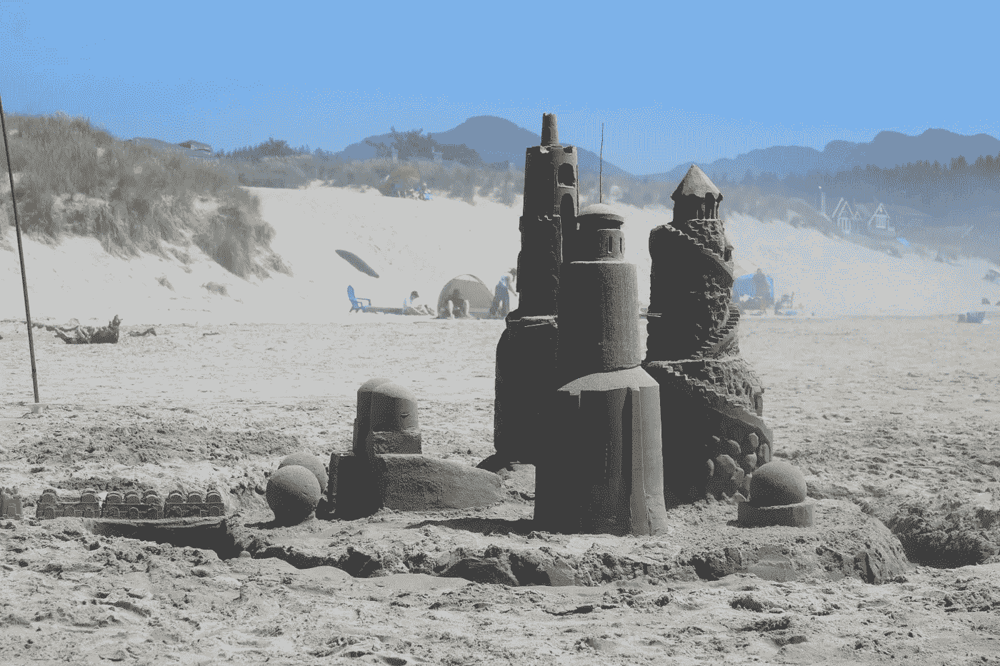

# LLM 应用、关键数据技能、多代理 AI 系统及其他七月必读文章

> 原文：[`towardsdatascience.com/llm-apps-crucial-data-skills-multi-ai-agent-systems-and-other-july-must-reads-a660a846cda8?source=collection_archive---------6-----------------------#2024-07-04`](https://towardsdatascience.com/llm-apps-crucial-data-skills-multi-ai-agent-systems-and-other-july-must-reads-a660a846cda8?source=collection_archive---------6-----------------------#2024-07-04)

 [TDS 编辑](https://towardsdatascience.medium.com/?source=post_page---byline--a660a846cda8--------------------------------)

·发表于[Towards Data Science](https://towardsdatascience.com/?source=post_page---byline--a660a846cda8--------------------------------) ·通过新闻通讯发送 ·阅读时间：4 分钟·2024 年 7 月 4 日

--

> *感觉受到了启发，想写下你的第一篇 TDS 文章吗？* [*我们始终欢迎新作者的投稿*](http://bit.ly/write-for-tds)*。*

如果你所在的地方已经是夏天，我们希望你能充分利用温暖的天气和（希望？也许？）更加放松的日常节奏。当然，学习永远不会停止——至少对数据科学家而言如此——所以如果你认为美好的时光是挑战新课题、探索前沿工具和工作流程，那么你将迎来一场盛宴。

我们七月的亮点由上个月在读者中引起最大反响的文章组成，涵盖了广泛的实用话题——其中许多文章旨在帮助你提高自身标准，拓展技能。让我们一起深入了解吧！

## 每月亮点

+   **我在 Uber、Meta 和初创公司 10 年的经历教会了我数据分析的知识**提供建议很容易；但根据 10 年的多元化数据领导经验，提出可操作的、经过时间验证的见解则需要付出更多努力——在[Torsten Walbaum](https://medium.com/u/4e291ce6380c?source=post_page---user_mention--a660a846cda8--------------------------------)的文章中，这一努力绝对值得。

+   **作为数据科学家，我如何使用 ChatGPT**我们是否终于迎来了 LLM 工具能够显著简化数据专业人士核心任务的时刻？正如[Egor Howell](https://medium.com/u/1cac491223b2?source=post_page---user_mention--a660a846cda8--------------------------------)所解释的，如果你在如何以及在哪里将 ChatGPT 集成到工作流中做出聪明的选择，你的生产力可能已经开始显著受益。

+   **330 周的数据可视化：我的历程与关键收获** 在进行超过五年的每周数据可视化创作后，[Yu Dong](https://medium.com/u/5462c48cfc57?source=post_page---user_mention--a660a846cda8--------------------------------)回顾了持续性的价值，并为现有和未来的数据科学家提供了有益的建议，帮助他们在制作图表、绘图和信息图时提升自己的技能。

照片由[Emily Studer](https://unsplash.com/@studerphotography?utm_source=medium&utm_medium=referral)拍摄，发布于[Unsplash](https://unsplash.com/?utm_source=medium&utm_medium=referral)

+   **构建 LLM 应用程序：清晰的逐步指南**许多机器学习从业者都有很棒的 AI 产品创意，但正如[Almog Baku](https://medium.com/u/fbcd18957436?source=post_page---user_mention--a660a846cda8--------------------------------)所指出的，“目前没有建立的最佳实践，很多先驱者在没有清晰路线图的情况下，要么需要重新发明轮子，要么会陷入困境。”幸运的是，随着 Almog 为导航复杂的 LLM 原生开发领域制定了蓝图，这种情况已经不再发生。

+   **多 AI 代理系统 101**在 LLM 成为主流后不久，产品工程师们开始发现它们所带来的各种痛点和瓶颈。[Mariya Mansurova](https://medium.com/u/15a29a4fc6ad?source=post_page---user_mention--a660a846cda8--------------------------------)最近发布的指南介绍了应对这些挑战的最有前景的策略之一：多代理 AI 系统，在这种系统中，每个代理都拥有自己专门的“技能”，可以与其他代理协作。

+   **2024 年你不能忽视的 5 项数据科学技能** 在她的精彩职业导向总结中，[Sara Nóbrega](https://medium.com/u/7606b796c9df?source=post_page---user_mention--a660a846cda8--------------------------------)观察到：“虽然大学和正式教育提供了一些基本技能，但它们往往无法为学生提供进入公司所需的实际知识。”Sara 旨在填补这一空白，推荐数据科学家应该专注的五个领域，以便在当今的就业市场中茁壮成长。

+   **17 种（高级）RAG 技术，将您的 LLM 应用原型转化为生产就绪解决方案** 如果您需要随时调整、优化或升级您的检索增强生成系统，请务必收藏[Dominik Polzer](https://medium.com/u/3ab8d3143e32?source=post_page---user_mention--a660a846cda8--------------------------------)最近的贡献，他的内容远远超越了基础知识，涵盖了元数据、查询路由、句子窗口检索等更多内容。

+   **微调小型变换器模型：文本分类** 我们通过一篇出色的项目操作指南来完成本月的内容，由[Ida Silfverskiöld](https://medium.com/u/53550965faed?source=post_page---user_mention--a660a846cda8--------------------------------)呈现：它耐心地概述了微调小型变换器模型以处理 NLP 任务的过程，使用一个经过预训练的编码器模型，通过二分类来识别点击诱饵与事实类文章。

## 我们最新的一批新作者

每个月，我们都非常高兴看到一批新的作者加入 TDS，他们每个人都在与我们的社区分享自己独特的声音、知识和经验。如果你正在寻找新的作家来探索和关注，只需浏览我们最新加入的作者作品，包括 [孟柳赵](https://medium.com/u/6db175d93233?source=post_page---user_mention--a660a846cda8--------------------------------)、[罗比·乔治根](https://medium.com/u/240750323b5?source=post_page---user_mention--a660a846cda8--------------------------------)、[亚历克斯·德雷莫夫](https://medium.com/u/84f31ff77640?source=post_page---user_mention--a660a846cda8--------------------------------)、[托尔斯滕·沃尔鲍姆](https://medium.com/u/4e291ce6380c?source=post_page---user_mention--a660a846cda8--------------------------------)、[杰雷米·纽尔](https://medium.com/u/7ce320f77bc9?source=post_page---user_mention--a660a846cda8--------------------------------)、[杰森·贾](https://medium.com/u/e43beab71b3d?source=post_page---user_mention--a660a846cda8--------------------------------)、[阿克查伊·斯里瓦斯塔瓦](https://medium.com/u/3af46b1dfa27?source=post_page---user_mention--a660a846cda8--------------------------------)、[罗曼·S](https://medium.com/u/7765da3a59a0?source=post_page---user_mention--a660a846cda8--------------------------------)、[詹姆斯·蒂欧](https://medium.com/u/ba908104c94b?source=post_page---user_mention--a660a846cda8--------------------------------)、[路易斯·费尔南多·佩雷斯·阿尔马斯博士](https://medium.com/u/355ab04cdc6f?source=post_page---user_mention--a660a846cda8--------------------------------)、[莉亚·吴](https://medium.com/u/2566b4b56796?source=post_page---user_mention--a660a846cda8--------------------------------)、[W·卡登·哈姆里克](https://medium.com/u/d2cccc9d442d?source=post_page---user_mention--a660a846cda8--------------------------------)、[杰克·摩尔](https://medium.com/u/266c1c6aac8?source=post_page---user_mention--a660a846cda8--------------------------------)、[埃迪·福尔森](https://medium.com/u/89ef0c2275f1?source=post_page---user_mention--a660a846cda8--------------------------------)、[卡尔斯滕·弗罗姆霍尔德](https://medium.com/u/f512939eed80?source=post_page---user_mention--a660a846cda8--------------------------------)、[丹尼拉·莫罗佐夫斯基](https://medium.com/u/b0fe401ac5cf?source=post_page---user_mention--a660a846cda8--------------------------------)、[比曼·查克拉博提](https://medium.com/u/b194a768b666?source=post_page---user_mention--a660a846cda8--------------------------------)、[让·梅尼尔-皮翁](https://medium.com/u/8519af9d96b2?source=post_page---user_mention--a660a846cda8--------------------------------)、[肯·基霍](https://medium.com/u/2796864f67b4?source=post_page---user_mention--a660a846cda8--------------------------------)、[罗伯特·洛内](https://medium.com/u/f370dd45669c?source=post_page---user_mention--a660a846cda8--------------------------------)、[普拉纳夫·贾达夫](https://medium.com/u/f69499a861f?source=post_page---user_mention--a660a846cda8--------------------------------)、[科内利乌斯·尤达·维贾亚](https://medium.com/u/db67131c013?source=post_page---user_mention--a660a846cda8--------------------------------)、[维托·里哈尔迪吉兰](https://medium.com/u/1e5653db6f1e?source=post_page---user_mention--a660a846cda8--------------------------------)、[贾斯廷·劳夫林](https://medium.com/u/c47922dc0d17?source=post_page---user_mention--a660a846cda8--------------------------------)、[伊吉特·阿西克](https://medium.com/u/f9bcaefe27f9?source=post_page---user_mention--a660a846cda8--------------------------------)、[特穆·索尔穆嫩](https://medium.com/u/8c3c4fc60c47?source=post_page---user_mention--a660a846cda8--------------------------------)、[拉尔斯·维克](https://medium.com/u/7a17799f3c0a?source=post_page---user_mention--a660a846cda8--------------------------------)、[瑞亚·戈尔](https://medium.com/u/520ce98702fe?source=post_page---user_mention--a660a846cda8--------------------------------)、[瑞安·德库尼亚](https://medium.com/u/c5f61be400fe?source=post_page---user_mention--a660a846cda8--------------------------------)、[冈萨洛·埃斯皮诺萨·杜埃洛](https://medium.com/u/5926229422e1?source=post_page---user_mention--a660a846cda8--------------------------------)、[阿基拉·索马顺达兰](https://medium.com/u/1dbd15bc741?source=post_page---user_mention--a660a846cda8--------------------------------)、[梅尔·里奇博士](https://medium.com/u/a21cec528d22?source=post_page---user_mention--a660a846cda8--------------------------------)、[洛伦·辛克森](https://medium.com/u/3824da2eacaf?source=post_page---user_mention--a660a846cda8--------------------------------)、[乔纳森·R·威利福德博士](https://medium.com/u/cf4e7e8445b0?source=post_page---user_mention--a660a846cda8--------------------------------)、[丹尼尔·洛](https://medium.com/u/5c9153a85a2c?source=post_page---user_mention--a660a846cda8--------------------------------)、[妮可·任](https://medium.com/u/42a2dbebb150?source=post_page---user_mention--a660a846cda8--------------------------------)、[丹尼尔·波拉克](https://medium.com/u/5c9a16fa3da1?source=post_page---user_mention--a660a846cda8--------------------------------)、[斯特凡·托多兰](https://medium.com/u/ab812e09e067?source=post_page---user_mention--a660a846cda8--------------------------------)、[丹尼尔·科哈·乐](https://medium.com/u/39eff8d630fd?source=post_page---user_mention--a660a846cda8--------------------------------)、[阿维谢克·比斯瓦斯](https://medium.com/u/57c6f85454e6?source=post_page---user_mention--a660a846cda8--------------------------------)、[埃亚尔·特拉贝尔西](https://medium.com/u/1a2effe1ab74?source=post_page---user_mention--a660a846cda8--------------------------------)、[本·奥尔尼](https://medium.com/u/2efb976b82b3?source=post_page---user_mention--a660a846cda8--------------------------------)、[迈克尔·B·沃克](https://medium.com/u/f2ead905c017?source=post_page---user_mention--a660a846cda8--------------------------------)、[埃莉诺·汉娜](https://medium.com/u/3af5c0a7b82e?source=post_page---user_mention--a660a846cda8--------------------------------) 和 [玛格达·恩特西卡](https://medium.com/u/7884ac683641?source=post_page---user_mention--a660a846cda8--------------------------------)。

感谢您支持我们作者的工作！我们非常喜欢发布新作者的文章，如果你最近写了一篇有趣的项目 walkthrough、教程，或是关于我们核心主题的理论思考，别犹豫，[与我们分享](http://bit.ly/write-for-tds)。

直到下一个变量，

TDS 团队
