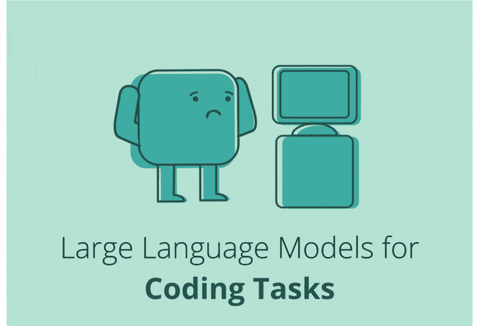

# 为什么 LLMs 不适合编程

> 原文：[`towardsdatascience.com/llms-coding-chatgpt-python-artificial-intelligence-4ea7a7bbdd93?source=collection_archive---------0-----------------------#2024-02-28`](https://towardsdatascience.com/llms-coding-chatgpt-python-artificial-intelligence-4ea7a7bbdd93?source=collection_archive---------0-----------------------#2024-02-28)

## 使用 LLMs 进行编码的挑战

 [Andrea Valenzuela](https://medium.com/@andvalenzuela?source=post_page---byline--4ea7a7bbdd93--------------------------------)

·发表于[Towards Data Science](https://towardsdatascience.com/?source=post_page---byline--4ea7a7bbdd93--------------------------------) ·阅读时长：7 分钟·2024 年 2 月 28 日

--

自制图像

在过去的一年里，得益于自然语言理解的进步，大型语言模型（LLMs）展示了惊人的能力。这些先进的模型不仅重新定义了自然语言处理的标准，还被广泛应用于各种应用程序和服务中。

使用 LLMs 进行编程的兴趣迅速增长，**一些公司正在努力将自然语言处理转化为代码理解与生成**。这一任务已经暴露出使用 LLMs 进行编码的多个挑战，尚未得到解决。尽管如此，这一趋势促使了 AI 代码生成产品的发展。

*你曾经用过 ChatGPT 进行编程吗？*

虽然在某些情况下它可能有所帮助，**但它通常难以生成高效且高质量的代码**。在本文中，我们将探讨三个原因，解释为什么大型语言模型（LLMs）在编程上无法做到*“开箱即用”*：分词器、应用于代码时上下文窗口的复杂性以及训练本身的性质。

**识别需要改进的关键领域是将 LLMs 转变为更有效编程助手的关键！**

# #1 LLM 分词器
