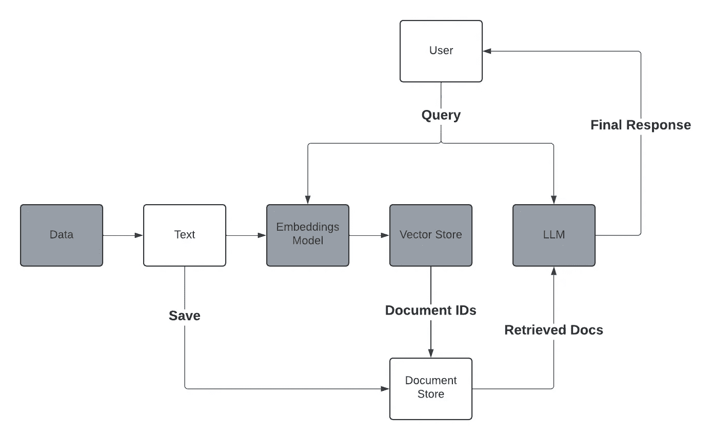

# 本地 RAG 从零开始

> 原文：[`towardsdatascience.com/local-rag-from-scratch-3afc6d3dea08?source=collection_archive---------0-----------------------#2024-05-11`](https://towardsdatascience.com/local-rag-from-scratch-3afc6d3dea08?source=collection_archive---------0-----------------------#2024-05-11)

## 开发并部署一个完全本地化的 RAG 系统

[](https://sassonjoe66.medium.com/?source=post_page---byline--3afc6d3dea08--------------------------------)[](https://towardsdatascience.com/?source=post_page---byline--3afc6d3dea08--------------------------------) [Joe Sasson](https://sassonjoe66.medium.com/?source=post_page---byline--3afc6d3dea08--------------------------------)

·发布于[Towards Data Science](https://towardsdatascience.com/?source=post_page---byline--3afc6d3dea08--------------------------------) ·18 分钟阅读·2024 年 5 月 11 日

--


图片由[Kevin Ku](https://unsplash.com/@ikukevk?utm_source=medium&utm_medium=referral)提供，来源：[Unsplash](https://unsplash.com/?utm_source=medium&utm_medium=referral)

# 引言

类似于[llama-index](https://docs.llamaindex.ai/en/stable/)和[Langchain](https://www.langchain.com)等库所提供的高级抽象，简化了检索增强生成（RAG）系统的开发。然而，要完全发挥这些库的潜力，深入理解其背后的机制仍然至关重要，尤其是对于任何机器学习工程师来说。在本文中，我将引导你从零开始开发一个 RAG 系统。我还将进一步带你走得更远，我们将创建一个容器化的 Flask API。我设计这篇教程时，注重实际应用：整个过程灵感来源于真实的使用案例，确保你获得的见解不仅是理论性的，而且是可以立即应用的。

***用例概述*** — 该实现设计用于处理各种文档类型。虽然当前示例使用了许多小型文档，每个文档描述了一个独立的产品，包含 SKU、名称、描述、价格和尺寸等细节，但这种方法具有高度的适应性。无论任务是涉及对多样化书籍库的索引，还是从大量合同中挖掘数据，亦或其他任何一类文档，该系统都可以根据这些不同情境的具体需求进行调整。这种灵活性使得不同类型的信息能够无缝集成和处理。

***快速提示***——此实现仅适用于文本数据。你可以按照类似的步骤，使用多模态模型如 CLIP 将图像转换为嵌入，然后进行索引和查询。

# 目录

+   概述模块化框架

+   准备数据

+   ***分块、索引和检索*** *(核心功能)*

+   大语言模型组件

+   构建并部署 API

+   结论

# 模块化框架

该实现有四个主要组件，可以互换。

+   文本数据

+   嵌入模型

+   大语言模型（LLM）

+   向量存储

将这些服务集成到你的项目中非常灵活，允许你根据特定需求进行定制。在这个示例实现中，我从一个初始数据为 JSON 格式的场景开始，它方便地将数据以字符串形式提供。然而，你可能会遇到其他格式的数据，如 PDF、电子邮件或 Excel 电子表格。在这种情况下，必须通过将数据转换为字符串格式来“规范化”这些数据。根据项目需求，你可以选择将数据转为内存中的字符串，或者将其保存到文本文件中，以便进一步细化或下游处理。

同样，嵌入模型、向量存储和大语言模型（LLM）的选择可以根据你的项目需求进行定制。无论你需要一个更小或更大的模型，还是可能需要一个外部模型，这种方法的灵活性使你能够轻松地替换合适的选项。这个即插即用的能力确保了你的项目可以在不对核心架构进行重大修改的情况下，适应各种需求。



简化的模块化框架。图片来自作者。

我将主要组件用灰色高亮显示。在这个实现中，我们的向量存储将仅仅是一个 JSON 文件。再一次，根据你的使用场景，如果你一次只处理一个文件，你可能只想使用内存中的向量存储（Python 字典）。如果你需要持久化这些数据，就像我们这个用例中那样，你可以将它们保存在本地 JSON 文件中。如果你需要存储数十万或数百万个向量，你需要一个外部的向量存储（如 Pinecone、Azure Cognitive Search 等）。

# 准备数据

如上所述，这个实现从 JSON 数据开始。我使用了 GPT-4 和 Claude 生成了这些数据。数据包含了不同家具产品的描述，每个描述都有其对应的 SKU。以下是一个示例：

```py
{
    "MBR-2001": "Traditional sleigh bed crafted in rich walnut wood, featuring a curved headboard and footboard with intricate grain details. Queen size, includes a plush, supportive mattress. Produced by Heritage Bed Co. Dimensions: 65\"W x 85\"L x 50\"H.",
    "MBR-2002": "Art Deco-inspired vanity table in a polished ebony finish, featuring a tri-fold mirror and five drawers with crystal knobs. Includes a matching stool upholstered in silver velvet. Made by Luxe Interiors. Vanity dimensions: 48\"W x 20\"D x 30\"H, Stool dimensions: 22\"W x 16\"D x 18\"H.",
    "MBR-2003": "Set of sheer linen drapes in soft ivory, offering a delicate and airy touch to bedroom windows. Each panel measures 54\"W x 84\"L. Features hidden tabs for easy hanging. Manufactured by Tranquil Home Textiles.",

    "LVR-3001": "Convertible sofa bed upholstered in navy blue linen fabric, easily transitions from sofa to full-size sleeper. Perfect for guests or small living spaces. Features a sturdy wooden frame. Produced by SofaBed Solutions. Dimensions: 70\"W x 38\"D x 35\"H.",
    "LVR-3002": "Ornate Persian area rug in deep red and gold, hand-knotted from silk and wool. Adds a luxurious touch to any living room. Measures 8' x 10'. Manufactured by Ancient Weaves.",
    "LVR-3003": "Contemporary TV stand in matte black with tempered glass doors and chrome legs. Features integrated cable management and adjustable shelves. Accommodates up to 65-inch TVs. Made by Streamline Tech. Dimensions: 60\"W x 20\"D x 24\"H.",

    "OPT-4001": "Modular outdoor sofa set in espresso brown polyethylene wicker, includes three corner pieces and two armless chairs with water-resistant cushions in cream. Configurable to fit any patio space. Produced by Outdoor Living. Corner dimensions: 32\"W x 32\"D x 28\"H, Armless dimensions: 28\"W x 32\"D x 28\"H.",
    "OPT-4002": "Cantilever umbrella in sunflower yellow, featuring a 10-foot canopy and adjustable tilt for optimal shade. Constructed with a sturdy aluminum pole and fade-resistant fabric. Manufactured by Shade Masters. Dimensions: 120\"W x 120\"D x 96\"H.",
    "OPT-4003": "Rustic fire pit table made from faux stone, includes a natural gas hookup and a matching cover. Ideal for evening gatherings on the patio. Manufactured by Warmth Outdoor. Dimensions: 42\"W x 42\"D x 24\"H.",

    "ENT-5001": "Digital jukebox with touchscreen interface and built-in speakers, capable of streaming music and playing CDs. Retro design with modern technology, includes customizable LED lighting. Produced by RetroSound. Dimensions: 24\"W x 15\"D x 48\"H.",
    "ENT-5002": "Gaming console storage unit in sleek black, featuring designated compartments for systems, controllers, and games. Ventilated to prevent overheating. Manufactured by GameHub. Dimensions: 42\"W x 16\"D x 24\"H.",
    "ENT-5003": "Virtual reality gaming set by VR Innovations, includes headset, two motion controllers, and a charging station. Offers a comprehensive library of immersive games and experiences.",

    "KIT-6001": "Chef's rolling kitchen cart in stainless steel, features two shelves, a drawer, and towel bars. Portable and versatile, ideal for extra storage and workspace in the kitchen. Produced by KitchenAid. Dimensions: 30\"W x 18\"D x 36\"H.",
    "KIT-6002": "Contemporary pendant light cluster with three frosted glass shades, suspended from a polished nickel ceiling plate. Provides elegant, diffuse lighting over kitchen islands. Manufactured by Luminary Designs. Adjustable drop length up to 60\".",
    "KIT-6003": "Eight-piece ceramic dinnerware set in ocean blue, includes dinner plates, salad plates, bowls, and mugs. Dishwasher and microwave safe, adds a pop of color to any meal. Produced by Tabletop Trends.",

    "GBR-7001": "Twin-size daybed with trundle in brushed silver metal, ideal for guest rooms or small spaces. Includes two comfortable twin mattresses. Manufactured by Guestroom Gadgets. Bed dimensions: 79\"L x 42\"W x 34\"H.",
    "GBR-7002": "Wall art set featuring three abstract prints in blue and grey tones, framed in light wood. Each frame measures 24\"W x 36\"H. Adds a modern touch to guest bedrooms. Produced by Artistic Expressions.",
    "GBR-7003": "Set of two bedside lamps in brushed nickel with white fabric shades. Offers a soft, ambient light suitable for reading or relaxing in bed. Dimensions per lamp: 12\"W x 24\"H. Manufactured by Bright Nights.",

    "BMT-8001": "Industrial-style pool table with a slate top and black felt, includes cues, balls, and a rack. Perfect for entertaining and game nights in finished basements. Produced by Billiard Masters. Dimensions: 96\"L x 52\"W x 32\"H.",
    "BMT-8002": "Leather home theater recliner set in black, includes four connected seats with individual cup holders and storage compartments. Offers a luxurious movie-watching experience. Made by CinemaComfort. Dimensions per seat: 22\"W x 40\"D x 40\"H.",
    "BMT-8003": "Adjustable height pub table set with four stools, featuring a rustic wood finish and black metal frame. Ideal for casual dining or socializing in basements. Produced by Casual Home. Table dimensions: 36\"W x 36\"D x 42\"H, Stool dimensions: 15\"W x 15\"D x 30\"H."
}
```

在实际场景中，我们可以将其推断到数百万个 SKU 和描述，可能这些数据都存储在不同的地方。在这个场景中，聚合和组织这些数据看起来微不足道，但通常情况下，野外数据需要像这样组织成结构。

下一步是将每个 SKU 转换为单独的文本文件。总共有 105 个文本文件（SKUs）。***注意——你可以在文章底部的我的 GitHub 中找到所有的数据/代码链接。***

我使用这个提示生成数据，并多次发送：

```py
Given different "categories" for furniture, I want you to generate a synthetic 'SKU' and product description.

Generate 3 for each category. Be extremely granular with your details and descriptions (colors, sizes, synthetic manufacturers, etc..).

Every response should follow this format and should be only JSON:
{<SKU>:<description>}.

- master bedroom
- living room
- outdoor patio
- entertainment 
- kitchen
- guest bedroom
- finished basement
```

为了继续前进，您应该有一个包含产品描述的文本文件的目录，其中 SKU 作为文件名。

# 分块、索引和检索

## 分块

给定一段文本，我们需要有效地将其分块，以便优化检索。我试图根据 llama-index 的[SentenceSplitter](https://docs.llamaindex.ai/en/stable/api_reference/node_parsers/sentence_splitter/)类来建模这个过程。

```py
import re
import os
import uuid
from transformers import AutoTokenizer, AutoModel

def document_chunker(directory_path,
                     model_name,
                     paragraph_separator='\n\n',
                     chunk_size=1024,
                     separator=' ',
                     secondary_chunking_regex=r'\S+?[\.,;!?]',
                     chunk_overlap=0):

    tokenizer = AutoTokenizer.from_pretrained(model_name)  # Load tokenizer for the specified model
    documents = {}  # Initialize dictionary to store results

    # Read each file in the specified directory
    for filename in os.listdir(directory_path):
        file_path = os.path.join(directory_path, filename)
        base = os.path.basename(file_path)
        sku = os.path.splitext(base)[0]
        if os.path.isfile(file_path):
            with open(file_path, 'r', encoding='utf-8') as file:
                text = file.read()

            # Generate a unique identifier for the document
            doc_id = str(uuid.uuid4())

            # Process each file using the existing chunking logic
            paragraphs = re.split(paragraph_separator, text)
            all_chunks = {}
            for paragraph in paragraphs:
                words = paragraph.split(separator)
                current_chunk = ""
                chunks = []

                for word in words:
                    new_chunk = current_chunk + (separator if current_chunk else '') + word
                    if len(tokenizer.tokenize(new_chunk)) <= chunk_size:
                        current_chunk = new_chunk
                    else:
                        if current_chunk:
                            chunks.append(current_chunk)
                        current_chunk = word

                if current_chunk:
                    chunks.append(current_chunk)

                refined_chunks = []
                for chunk in chunks:
                    if len(tokenizer.tokenize(chunk)) > chunk_size:
                        sub_chunks = re.split(secondary_chunking_regex, chunk)
                        sub_chunk_accum = ""
                        for sub_chunk in sub_chunks:
                            if sub_chunk_accum and len(tokenizer.tokenize(sub_chunk_accum + sub_chunk + ' ')) > chunk_size:
                                refined_chunks.append(sub_chunk_accum.strip())
                                sub_chunk_accum = sub_chunk
                            else:
                                sub_chunk_accum += (sub_chunk + ' ')
                        if sub_chunk_accum:
                            refined_chunks.append(sub_chunk_accum.strip())
                    else:
                        refined_chunks.append(chunk)

                final_chunks = []
                if chunk_overlap > 0 and len(refined_chunks) > 1:
                    for i in range(len(refined_chunks) - 1):
                        final_chunks.append(refined_chunks[i])
                        overlap_start = max(0, len(refined_chunks[i]) - chunk_overlap)
                        overlap_end = min(chunk_overlap, len(refined_chunks[i+1]))
                        overlap_chunk = refined_chunks[i][overlap_start:] + ' ' + refined_chunks[i+1][:overlap_end]
                        final_chunks.append(overlap_chunk)
                    final_chunks.append(refined_chunks[-1])
                else:
                    final_chunks = refined_chunks

                # Assign a UUID for each chunk and structure it with text and metadata
                for chunk in final_chunks:
                    chunk_id = str(uuid.uuid4())
                    all_chunks[chunk_id] = {"text": chunk, "metadata": {"file_name":sku}}  # Initialize metadata as dict

            # Map the document UUID to its chunk dictionary
            documents[doc_id] = all_chunks

    return documents
```

这里最重要的参数是“chunk_size”。如您所见，我们正在使用[transformers](https://huggingface.co/docs/transformers/en/index)库来计算给定字符串中的标记数量。因此，chunk_size 表示一个块中的标记数量。

以下是该函数内部操作的详细说明：

对指定目录中的每个文件 →

1.  ***将文本分割成段落：***

    - 使用指定的分隔符将输入文本划分为段落。

1.  ***将段落分块成单词：***

    - 对每个段落，将其拆分为单词。

    - 创建这些单词的块，确保不超过指定的标记数量（chunk_size）。

1.  ***优化块：***

    - 如果任何块超过了 chunk_size，则使用基于标点的正则表达式进一步拆分它。

    - 如果需要，合并子块以优化块大小。

1.  ***应用重叠：***

    - 对于包含多个块的序列，在它们之间创建重叠，以确保上下文的连贯性。

1.  ***编译并返回块：***

    - 遍历每个最终的块，给它分配一个唯一的 ID，该 ID 映射到该块的文本和元数据，最后将该块字典分配给文档 ID。

在这个例子中，我们正在对大量较小的文档进行索引，分块过程相对简单。每个文档较为简短，因此只需少量分割。这与处理更大文本的场景形成鲜明对比，例如从冗长的合同中提取特定部分或对整本小说进行索引。为了适应不同大小和复杂度的文档，我开发了`document_chunker`函数。这使得您可以输入数据——无论其长度或格式如何——并应用相同高效的分块过程。无论是处理简洁的产品描述，还是广袤的文学作品，`document_chunker`都能确保您的数据经过适当分块，以实现最佳的索引和检索效果。

**用法：**

```py
docs = document_chunker(directory_path='/Users/joesasson/Desktop/articles/rag-from-scratch/text_data',
                        model_name='BAAI/bge-small-en-v1.5',
                        chunk_size=256)

keys = list(docs.keys())
print(len(docs))
print(docs[keys[0]])

Out -->
105
{'61d6318e-644b-48cd-a635-9490a1d84711': {'text': 'Gaming console storage unit in sleek black, featuring designated compartments for systems, controllers, and games. Ventilated to prevent overheating. Manufactured by GameHub. Dimensions: 42"W x 16"D x 24"H.', 'metadata': {'file_name': 'ENT-5002'}}}
```

现在，我们有了一个映射，具有唯一的文档 ID，指向该文档中的所有块，每个块都有自己的唯一 ID，指向该块的文本和元数据。

元数据可以包含任意的键/值对。在这里，我将文件名（SKU）设置为元数据，以便我们可以将模型的结果追溯到原始产品。

## 索引

现在我们已经创建了文档存储，我们需要创建向量存储。

你可能已经注意到，我们使用的是***BAAI/bge-small-en-v1.5***作为我们的嵌入模型。在之前的函数中，我们仅用它进行分词，现在我们将用它来将文本向量化。

为了准备部署，让我们将分词器和模型保存到本地。

```py
from transformers import AutoModel, AutoTokenizer

model_name = "BAAI/bge-small-en-v1.5"

tokenizer = AutoTokenizer.from_pretrained(model_name)
model = AutoModel.from_pretrained(model_name)

tokenizer.save_pretrained("model/tokenizer")
model.save_pretrained("model/embedding") 
```

```py
def compute_embeddings(text):
    tokenizer = AutoTokenizer.from_pretrained("/model/tokenizer") 
    model = AutoModel.from_pretrained("/model/embedding")

    inputs = tokenizer(text, return_tensors="pt", padding=True, truncation=True) 

    # Generate the embeddings 
    with torch.no_grad():    
        embeddings = model(**inputs).last_hidden_state.mean(dim=1).squeeze()

    return embeddings.tolist()
```

```py
def create_vector_store(doc_store):
    vector_store = {}
    for doc_id, chunks in doc_store.items():
        doc_vectors = {}
        for chunk_id, chunk_dict in chunks.items():
            # Generate an embedding for each chunk of text
            doc_vectors[chunk_id] = compute_embeddings(chunk_dict.get("text"))
        # Store the document's chunk embeddings mapped by their chunk UUIDs
        vector_store[doc_id] = doc_vectors
    return vector_store
```

我们所做的只是简单地将文档库中的块转换为嵌入。你可以插入任何嵌入模型，以及任何向量存储。由于我们的向量存储只是一个字典，所以我们所需要做的就是将其保存为 JSON 文件以便持久化。

## 检索

现在让我们用一个查询来测试一下！

```py
def compute_matches(vector_store, query_str, top_k):
    """
    This function takes in a vector store dictionary, a query string, and an int 'top_k'.
    It computes embeddings for the query string and then calculates the cosine similarity against every chunk embedding in the dictionary.
    The top_k matches are returned based on the highest similarity scores.
    """
    # Get the embedding for the query string
    query_str_embedding = np.array(compute_embeddings(query_str))
    scores = {}

    # Calculate the cosine similarity between the query embedding and each chunk's embedding
    for doc_id, chunks in vector_store.items():
        for chunk_id, chunk_embedding in chunks.items():
            chunk_embedding_array = np.array(chunk_embedding)
            # Normalize embeddings to unit vectors for cosine similarity calculation
            norm_query = np.linalg.norm(query_str_embedding)
            norm_chunk = np.linalg.norm(chunk_embedding_array)
            if norm_query == 0 or norm_chunk == 0:
                # Avoid division by zero
                score = 0
            else:
                score = np.dot(chunk_embedding_array, query_str_embedding) / (norm_query * norm_chunk)

            # Store the score along with a reference to both the document and the chunk
            scores[(doc_id, chunk_id)] = score

    # Sort scores and return the top_k results
    sorted_scores = sorted(scores.items(), key=lambda item: item[1], reverse=True)[:top_k]
    top_results = [(doc_id, chunk_id, score) for ((doc_id, chunk_id), score) in sorted_scores]

    return top_results
```

`compute_matches`函数旨在从存储的文本嵌入集合中识别与给定查询字符串最相似的前 k 个文本块。下面是详细说明：

1.  嵌入查询字符串

1.  计算余弦相似度。对于每个块，计算查询向量和块向量之间的余弦相似度。在这里，`np.linalg.norm`计算的是向量的欧几里得范数（L2 范数），这是计算余弦相似度所必需的。

1.  处理规范化并计算点积。余弦相似度定义为：


**A**和**B**是向量，**||A||**和**||B||**是它们的范数。

4. 对得分进行排序和选择。得分按降序排列，选取前 k 个结果。

**用法：**

```py
matches = compute_matches(vector_store=vec_store,
                query_str="Wall-mounted electric fireplace with realistic LED flames",
                top_k=3)

# matches
[('d56bc8ca-9bbc-4edb-9f57-d1ea2b62362f',
  '3086bed2-65e7-46cc-8266-f9099085e981',
  0.8600385118142513),
 ('240c67ce-b469-4e0f-86f7-d41c630cead2',
  '49335ccf-f4fb-404c-a67a-19af027a9fc2',
  0.7067269230771228),
 ('53faba6d-cec8-46d2-8d7f-be68c3080091',
  'b88e4295-5eb1-497c-8536-59afd84d2210',
  0.6959163226146977)]

# plug the top match document ID keys into doc_store to access the retrieved content
docs['d56bc8ca-9bbc-4edb-9f57-d1ea2b62362f']['3086bed2-65e7-46cc-8266-f9099085e981']

# result
{'text': 'Wall-mounted electric fireplace with realistic LED flames and heat settings. Features a black glass frame and remote control for easy operation. Ideal for adding warmth and ambiance. Manufactured by Hearth & Home. Dimensions: 50"W x 6"D x 21"H.',
 'metadata': {'file_name': 'ENT-4001'}}
```

每个元组包含文档 ID，其后是块 ID，再后是得分。

太棒了，已经成功！接下来要做的就是连接 LLM 组件并运行完整的端到端测试，然后我们就可以部署了！

# LLM 组件

为了通过使我们的 RAG 系统更加互动来增强用户体验，我们将使用`llama-cpp-python`库。我们的设置将使用带有 GGUF 3 位量化的 mistral-7B 参数模型，这一配置在计算效率和性能之间提供了良好的平衡。经过大量测试，这种模型大小已被证明在资源有限的机器上特别有效，例如我的 M2 8GB Mac。通过采用这种方法，我们确保我们的 RAG 系统不仅能提供精确和相关的响应，还能保持对话语气，使其更加引人入胜和易于接触，便于最终用户使用。

在 Mac 上本地设置 LLM 的快速说明——我更倾向于使用 anaconda 或 miniconda。确保你安装了 arm64 版本，并按照库中的‘metal’设置说明进行操作，[这里](https://pypi.org/project/llama-cpp-python/)。

现在，非常简单。我们需要做的就是定义一个函数，构建一个包含检索到的文档和用户查询的提示。LLM 的响应将返回给用户。

我定义了以下函数来流式传输 LLM 的文本响应并构建最终的提示。

```py
from llama_cpp import Llama
import sys

def stream_and_buffer(base_prompt, llm, max_tokens=800, stop=["Q:", "\n"], echo=True, stream=True):

    # Formatting the base prompt
    formatted_prompt = f"Q: {base_prompt} A: "

    # Streaming the response from llm
    response = llm(formatted_prompt, max_tokens=max_tokens, stop=stop, echo=echo, stream=stream)

    buffer = ""

    for message in response:
        chunk = message['choices'][0]['text']
        buffer += chunk

        # Split at the last space to get words
        words = buffer.split(' ')
        for word in words[:-1]:  # Process all words except the last one (which might be incomplete)
            sys.stdout.write(word + ' ')  # Write the word followed by a space
            sys.stdout.flush()  # Ensure it gets displayed immediately

        # Keep the rest in the buffer
        buffer = words[-1]

    # Print any remaining content in the buffer
    if buffer:
        sys.stdout.write(buffer)
        sys.stdout.flush()

def construct_prompt(system_prompt, retrieved_docs, user_query):
    prompt = f"""{system_prompt}

    Here is the retrieved context:
    {retrieved_docs}

    Here is the users query:
    {user_query}
    """
    return prompt

# Usage
system_prompt = """
You are an intelligent search engine. You will be provided with some retrieved context, as well as the users query.

Your job is to understand the request, and answer based on the retrieved context.
"""

retrieved_docs = """
Wall-mounted electric fireplace with realistic LED flames and heat settings. Features a black glass frame and remote control for easy operation. Ideal for adding warmth and ambiance. Manufactured by Hearth & Home. Dimensions: 50"W x 6"D x 21"H.
"""

prompt = construct_prompt(system_prompt=system_prompt,
                          retrieved_docs=retrieved_docs,
                          user_query="I am looking for a wall-mounted electric fireplace with realistic LED flames")

llm = Llama(model_path="/Users/joesasson/Downloads/mistral-7b-instruct-v0.2.Q3_K_L.gguf", n_gpu_layers=1)

stream_and_buffer(prompt, llm)
```

返回给用户的最终输出：

> “基于检索到的上下文和用户的查询，Hearth & Home 电壁炉配有逼真的 LED 火焰，符合描述。该型号宽 50 英寸，深 6 英寸，高 21 英寸，附带遥控器，便于操作。”

我们现在准备部署我们的 RAG 系统。请继续阅读下一部分，我们将把这段近乎“意大利面”的代码转换为可供用户使用的 API。

# 构建与部署 API

为了扩展我们系统的覆盖范围和可用性，我们将把它打包成一个容器化的 Flask 应用程序。此方法确保我们的模型被封装在一个 Docker 容器内，无论计算环境如何，都能提供稳定性和一致性。

你应该已经下载了上述的嵌入模型和分词器。将这些文件与应用代码、依赖项和 Dockerfile 放在同一目录下。你可以在[此处](https://huggingface.co/TheBloke)下载 LLM。

你应该有以下的目录结构：


部署目录结构。图片由作者提供。

## app.py

```py
from flask import Flask, request, jsonify
import numpy as np
import json
from typing import Dict, List, Any
from llama_cpp import Llama
import torch
import logging
from transformers import AutoModel, AutoTokenizer

app = Flask(__name__)

# Set the logger level for Flask's logger
app.logger.setLevel(logging.INFO)

def compute_embeddings(text):
    tokenizer = AutoTokenizer.from_pretrained("/app/model/tokenizer") 
    model = AutoModel.from_pretrained("/app/model/embedding")

    inputs = tokenizer(text, return_tensors="pt", padding=True, truncation=True) 

    # Generate the embeddings 
    with torch.no_grad():    
        embeddings = model(**inputs).last_hidden_state.mean(dim=1).squeeze()

    return embeddings.tolist()

def compute_matches(vector_store, query_str, top_k):
    """
    This function takes in a vector store dictionary, a query string, and an int 'top_k'.
    It computes embeddings for the query string and then calculates the cosine similarity against every chunk embedding in the dictionary.
    The top_k matches are returned based on the highest similarity scores.
    """
    # Get the embedding for the query string
    query_str_embedding = np.array(compute_embeddings(query_str))
    scores = {}

    # Calculate the cosine similarity between the query embedding and each chunk's embedding
    for doc_id, chunks in vector_store.items():
        for chunk_id, chunk_embedding in chunks.items():
            chunk_embedding_array = np.array(chunk_embedding)
            # Normalize embeddings to unit vectors for cosine similarity calculation
            norm_query = np.linalg.norm(query_str_embedding)
            norm_chunk = np.linalg.norm(chunk_embedding_array)
            if norm_query == 0 or norm_chunk == 0:
                # Avoid division by zero
                score = 0
            else:
                score = np.dot(chunk_embedding_array, query_str_embedding) / (norm_query * norm_chunk)

            # Store the score along with a reference to both the document and the chunk
            scores[(doc_id, chunk_id)] = score

    # Sort scores and return the top_k results
    sorted_scores = sorted(scores.items(), key=lambda item: item[1], reverse=True)[:top_k]
    top_results = [(doc_id, chunk_id, score) for ((doc_id, chunk_id), score) in sorted_scores]

    return top_results

def open_json(path):
    with open(path, 'r') as f:
        data = json.load(f)
    return data

def retrieve_docs(doc_store, matches):
    top_match = matches[0]
    doc_id = top_match[0]
    chunk_id = top_match[1]
    docs = doc_store[doc_id][chunk_id]
    return docs

def construct_prompt(system_prompt, retrieved_docs, user_query):
    prompt = f"""{system_prompt}

    Here is the retrieved context:
    {retrieved_docs}

    Here is the users query:
    {user_query}
    """
    return prompt

@app.route('/rag_endpoint', methods=['GET', 'POST'])
def main():
    app.logger.info('Processing HTTP request')

    # Process the request
    query_str = request.args.get('query') or (request.get_json() or {}).get('query')
    if not query_str:
        return jsonify({"error":"missing required parameter 'query'"})

    vec_store = open_json('/app/vector_store.json')
    doc_store = open_json('/app/doc_store.json')

    matches = compute_matches(vector_store=vec_store, query_str=query_str, top_k=3)
    retrieved_docs = retrieve_docs(doc_store, matches)

    system_prompt = """
    You are an intelligent search engine. You will be provided with some retrieved context, as well as the users query.

    Your job is to understand the request, and answer based on the retrieved context.
    """

    base_prompt = construct_prompt(system_prompt=system_prompt, retrieved_docs=retrieved_docs, user_query=query_str)

    app.logger.info(f'constructed prompt: {base_prompt}')

    # Formatting the base prompt
    formatted_prompt = f"Q: {base_prompt} A: "

    llm = Llama(model_path="/app/mistral-7b-instruct-v0.2.Q3_K_L.gguf")
    response = llm(formatted_prompt, max_tokens=800, stop=["Q:", "\n"], echo=False, stream=False)

    return jsonify({"response": response})

if __name__ == '__main__':
    app.run(host='0.0.0.0', port=5001)
```

## Dockerfile

```py
# Use an official Python runtime as a parent image
FROM --platform=linux/arm64 python:3.11

# Set the working directory in the container to /app
WORKDIR /app

# Copy the requirements file
COPY requirements.txt .

# Update system packages, install gcc and Python dependencies
RUN apt-get update && \
    apt-get install -y gcc g++ make libtool && \
    apt-get upgrade -y && \
    apt-get clean && \
    rm -rf /var/lib/apt/lists/* && \
    pip install --no-cache-dir -r requirements.txt

# Copy the current directory contents into the container at /app
COPY . /app

# Expose port 5001 to the outside world
EXPOSE 5001

# Run script when the container launches
CMD ["python", "app.py"]
```

需要注意的一点是——我们在 Dockerfile 的第二行设置了工作目录为‘/app’。因此，任何本地路径（模型、向量或文档存储），应该在你的应用代码中以‘/app’为前缀。

此外，当你在容器中运行应用程序（在 Mac 上时），它将无法访问 GPU，参见[这个](https://github.com/pytorch/pytorch/issues/81224)讨论。我注意到使用 CPU 时，通常需要大约 20 分钟才能得到响应。

**构建与运行：**

`docker build -t <image-name>:<tag> .`

`docker run -p 5001:5001 <image-name>:<tag>`

运行容器会自动启动应用程序（见 Dockerfile 的最后一行）。你现在可以通过以下 URL 访问你的端点：

`http://127.0.0.1:5001/rag_endpoint`

**调用 API：**

```py
import requests, json

def call_api(query):
    URL = "http://127.0.0.1:5001/rag_endpoint"

    # Headers for the request
    headers = {
        "Content-Type": "application/json"
    }

    # Body for the request.
    body = {"query": query}

    # Making the POST request
    response = requests.post(URL, headers=headers, data=json.dumps(body))

    # Check if the request was successful
    if response.status_code == 200:
        return response.json()
    else:
        return f"Error: {response.status_code}, Message: {response.text}"

# Test
query = "Wall-mounted electric fireplace with realistic LED flames"

result = call_api(query)
print(result)

# result
{'response': {'choices': [{'finish_reason': 'stop', 'index': 0, 'logprobs': None, 'text': ' Based on the retrieved context, the wall-mounted electric fireplace mentioned includes features such as realistic LED flames. Therefore, the answer to the user\'s query "Wall-mounted electric fireplace with realistic LED flames" is a match to the retrieved context. The specific model mentioned in the context is manufactured by Hearth & Home and comes with additional heat settings.'}], 'created': 1715307125, 'id': 'cmpl-dd6c41ee-7c89-440f-9b04-0c9da9662f26', 'model': '/app/mistral-7b-instruct-v0.2.Q3_K_L.gguf', 'object': 'text_completion', 'usage': {'completion_tokens': 78, 'prompt_tokens': 177, 'total_tokens': 255}}}
```

# 结论

我想回顾一下所有达到这一点所需的步骤，以及将其调整为适应任何数据/嵌入/LLM 的工作流程。

1.  将你的文本文件目录传递给`document_chunker`函数，以创建文档存储。

1.  选择你的嵌入模型。将其保存在本地。

1.  将文档存储转换为向量存储。并将这两个文件保存在本地。

1.  从 HF Hub 下载 LLM。

1.  将文件移动到应用目录（嵌入模型、LLM、文档存储和向量存储 JSON 文件）。

1.  构建并运行 Docker 容器。

本质上可以总结为这一点——使用`build`笔记本生成 doc_store 和 vector_store，并将这些文件放置到你的应用中。

GitHub [链接](https://github.com/j0sephsasson/rag-from-scratch)。感谢阅读！
