# 逻辑回归解析：带代码示例的可视化指南，适合初学者

> 原文：[`towardsdatascience.com/logistic-regression-explained-a-visual-guide-with-code-examples-for-beginners-81baf5871505?source=collection_archive---------0-----------------------#2024-09-10`](https://towardsdatascience.com/logistic-regression-explained-a-visual-guide-with-code-examples-for-beginners-81baf5871505?source=collection_archive---------0-----------------------#2024-09-10)

## 分类算法

## 找到适合数据的最佳权重

[](https://medium.com/@samybaladram?source=post_page---byline--81baf5871505--------------------------------)[](https://towardsdatascience.com/?source=post_page---byline--81baf5871505--------------------------------) [Samy Baladram](https://medium.com/@samybaladram?source=post_page---byline--81baf5871505--------------------------------)

·发表于[Towards Data Science](https://towardsdatascience.com/?source=post_page---byline--81baf5871505--------------------------------) ·10 分钟阅读·2024 年 9 月 10 日

--

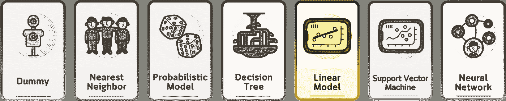

`⛳️ 更多[分类算法](https://medium.com/@samybaladram/list/classification-algorithms-b3586f0a772c)解析：· 虚拟分类器 · K 近邻分类器 · 伯努利朴素贝叶斯 · 高斯朴素贝叶斯 · 决策树分类器 ▶ 逻辑回归 · 支持向量分类器 · 多层感知器`

尽管一些基于概率的机器学习模型（如朴素贝叶斯）对特征独立性做出大胆假设，但逻辑回归采用了更为谨慎的方法。可以把它看作是绘制一条（或一平面）将两种结果分开的线，这样我们就可以以更大的灵活性预测概率。


所有视觉效果：作者使用 Canva Pro 创建。针对移动设备进行了优化；在桌面端可能会显得过大。

# 定义

逻辑回归是一种用于预测二元结果的统计方法。尽管名字中有“回归”，但它实际上用于分类而非回归。它估计实例属于某个特定类别的概率。如果估计的概率大于 50%，模型预测该实例属于该类别（反之亦然）。

# 📊 使用的数据集

在本文中，我们将使用这个人工高尔夫数据集（灵感来自[1]）作为示例。该数据集根据天气条件预测一个人是否会打高尔夫。

与 KNN 类似，逻辑回归也要求先对数据进行缩放。将类别列转换为 0 和 1，同时缩放数值特征，以避免某一特征主导距离度量。

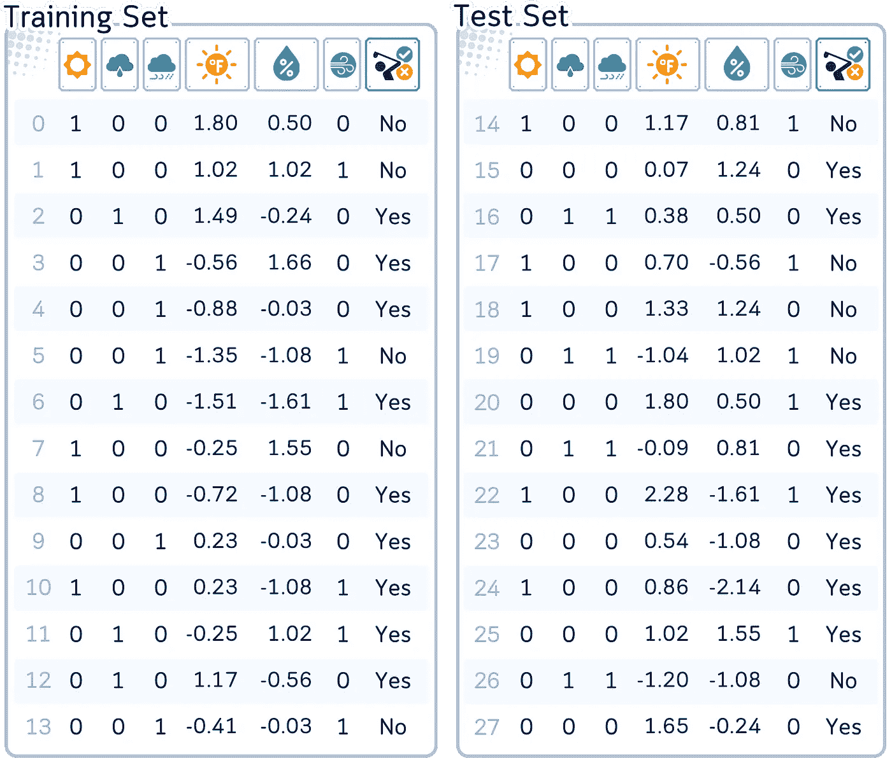

列：‘Outlook’（天气状况）、‘Temperature’（温度）、‘Humidity’（湿度）、‘Wind’（风速）和‘Play’（目标特征）。类别列（Outlook 和 Windy）使用独热编码（one-hot encoding）进行编码，而数值列则使用标准缩放（z-标准化）进行缩放。

```py
# Import required libraries
from sklearn.model_selection import train_test_split
from sklearn.metrics import accuracy_score
from sklearn.preprocessing import StandardScaler
import pandas as pd
import numpy as np

# Create dataset from dictionary
dataset_dict = {
    'Outlook': ['sunny', 'sunny', 'overcast', 'rainy', 'rainy', 'rainy', 'overcast', 'sunny', 'sunny', 'rainy', 'sunny', 'overcast', 'overcast', 'rainy', 'sunny', 'overcast', 'rainy', 'sunny', 'sunny', 'rainy', 'overcast', 'rainy', 'sunny', 'overcast', 'sunny', 'overcast', 'rainy', 'overcast'],
    'Temperature': [85.0, 80.0, 83.0, 70.0, 68.0, 65.0, 64.0, 72.0, 69.0, 75.0, 75.0, 72.0, 81.0, 71.0, 81.0, 74.0, 76.0, 78.0, 82.0, 67.0, 85.0, 73.0, 88.0, 77.0, 79.0, 80.0, 66.0, 84.0],
    'Humidity': [85.0, 90.0, 78.0, 96.0, 80.0, 70.0, 65.0, 95.0, 70.0, 80.0, 70.0, 90.0, 75.0, 80.0, 88.0, 92.0, 85.0, 75.0, 92.0, 90.0, 85.0, 88.0, 65.0, 70.0, 60.0, 95.0, 70.0, 78.0],
    'Wind': [False, True, False, False, False, True, True, False, False, False, True, True, False, True, True, False, False, True, False, True, True, False, True, False, False, True, False, False],
    'Play': ['No', 'No', 'Yes', 'Yes', 'Yes', 'No', 'Yes', 'No', 'Yes', 'Yes', 'Yes', 'Yes', 'Yes', 'No', 'No', 'Yes', 'Yes', 'No', 'No', 'No', 'Yes', 'Yes', 'Yes', 'Yes', 'Yes', 'Yes', 'No', 'Yes']
}
df = pd.DataFrame(dataset_dict)

# Prepare data: encode categorical variables
df = pd.get_dummies(df, columns=['Outlook'], prefix='', prefix_sep='', dtype=int)
df['Wind'] = df['Wind'].astype(int)
df['Play'] = (df['Play'] == 'Yes').astype(int)

# Rearrange columns
column_order = ['sunny', 'overcast', 'rainy', 'Temperature', 'Humidity', 'Wind', 'Play']
df = df[column_order]

# Split data into features and target
X, y = df.drop(columns='Play'), df['Play']

# Split data into training and testing sets
X_train, X_test, y_train, y_test = train_test_split(X, y, train_size=0.5, shuffle=False)

# Scale numerical features
scaler = StandardScaler()
X_train[['Temperature', 'Humidity']] = scaler.fit_transform(X_train[['Temperature', 'Humidity']])
X_test[['Temperature', 'Humidity']] = scaler.transform(X_test[['Temperature', 'Humidity']])

# Print results
print("Training set:")
print(pd.concat([X_train, y_train], axis=1), '\n')
print("Test set:")
print(pd.concat([X_test, y_test], axis=1))
```

# 主要机制

逻辑回归通过对输入特征的线性组合应用逻辑函数来工作。其操作过程如下：

1.  计算输入特征的加权和（类似于线性回归）。

1.  对这个和应用逻辑函数（也称为 Sigmoid 函数），它将任何实数映射到 0 和 1 之间的值。

1.  将此值解释为属于正类的概率。

1.  使用阈值（通常是 0.5）做出最终的分类决策。

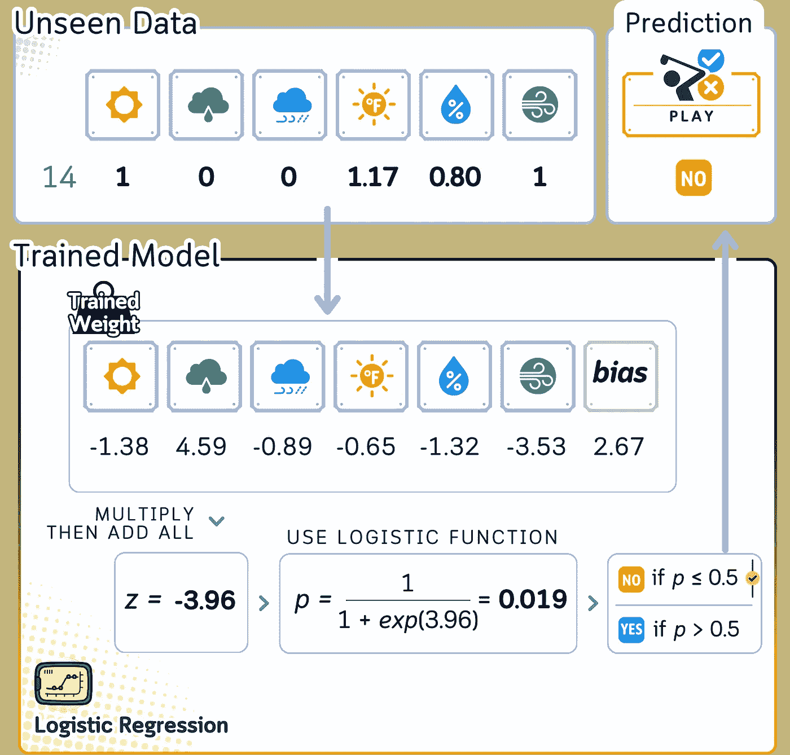

对于我们的高尔夫数据集，逻辑回归可能会将天气因素合并为一个单一的分数，然后将此分数转换为打高尔夫的概率。

# 训练步骤

逻辑回归的训练过程涉及为输入特征找到最佳的权重。以下是一般的步骤概述：

1.  初始化权重（通常为小的随机值）。

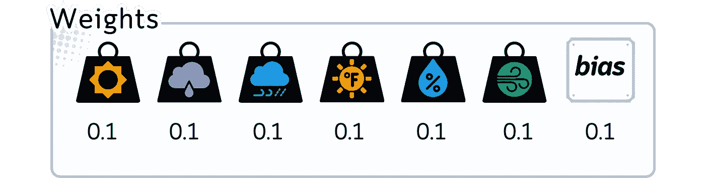

```py
# Initialize weights (including bias) to 0.1
initial_weights = np.full(X_train_np.shape[1], 0.1)

# Create and display DataFrame for initial weights
print(f"Initial Weights: {initial_weights}")
```

2\. 对于每个训练示例：

a. 使用当前的权重计算预测概率。

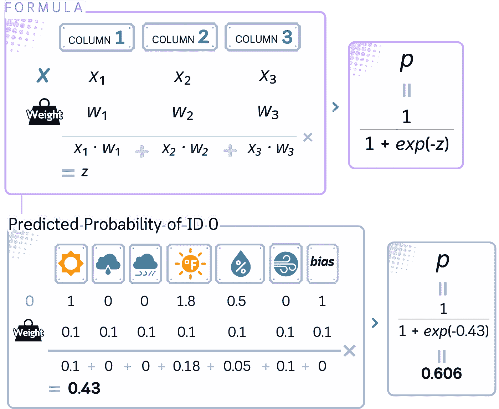

```py
def sigmoid(z):
    return 1 / (1 + np.exp(-z))

def calculate_probabilities(X, weights):
    z = np.dot(X, weights)
    return sigmoid(z)

def calculate_log_loss(probabilities, y):
    return -y * np.log(probabilities) - (1 - y) * np.log(1 - probabilities)

def create_output_dataframe(X, y, weights):
    probabilities = calculate_probabilities(X, weights)
    log_losses = calculate_log_loss(probabilities, y)

    df = pd.DataFrame({
        'Probability': probabilities,
        'Label': y,
        'Log Loss': log_losses
    })

    return df

def calculate_average_log_loss(X, y, weights):
    probabilities = calculate_probabilities(X, weights)
    log_losses = calculate_log_loss(probabilities, y)
    return np.mean(log_losses)

# Convert X_train and y_train to numpy arrays for easier computation
X_train_np = X_train.to_numpy()
y_train_np = y_train.to_numpy()

# Add a column of 1s to X_train_np for the bias term
X_train_np = np.column_stack((np.ones(X_train_np.shape[0]), X_train_np))

# Create and display DataFrame for initial weights
initial_df = create_output_dataframe(X_train_np, y_train_np, initial_weights)
print(initial_df.to_string(index=False, float_format=lambda x: f"{x:.6f}"))
print(f"\nAverage Log Loss: {calculate_average_log_loss(X_train_np, y_train_np, initial_weights):.6f}")
```

b. 通过计算其对数损失，将该概率与实际类别标签进行比较。

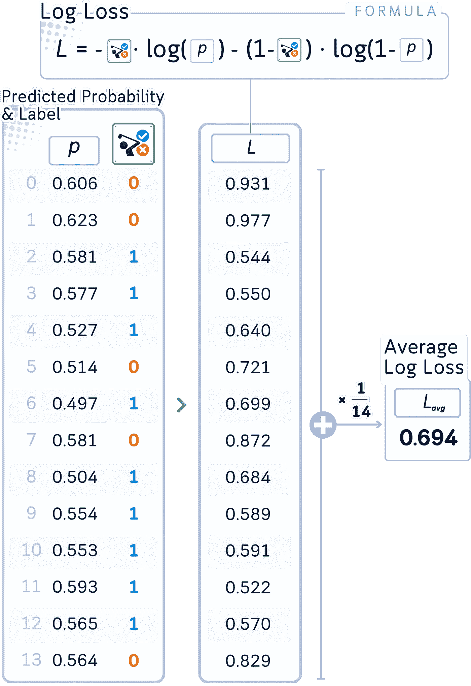

3\. 更新权重以最小化损失（通常使用一些优化算法，如梯度下降。这包括反复进行步骤 2，直到对数损失无法进一步减小）。

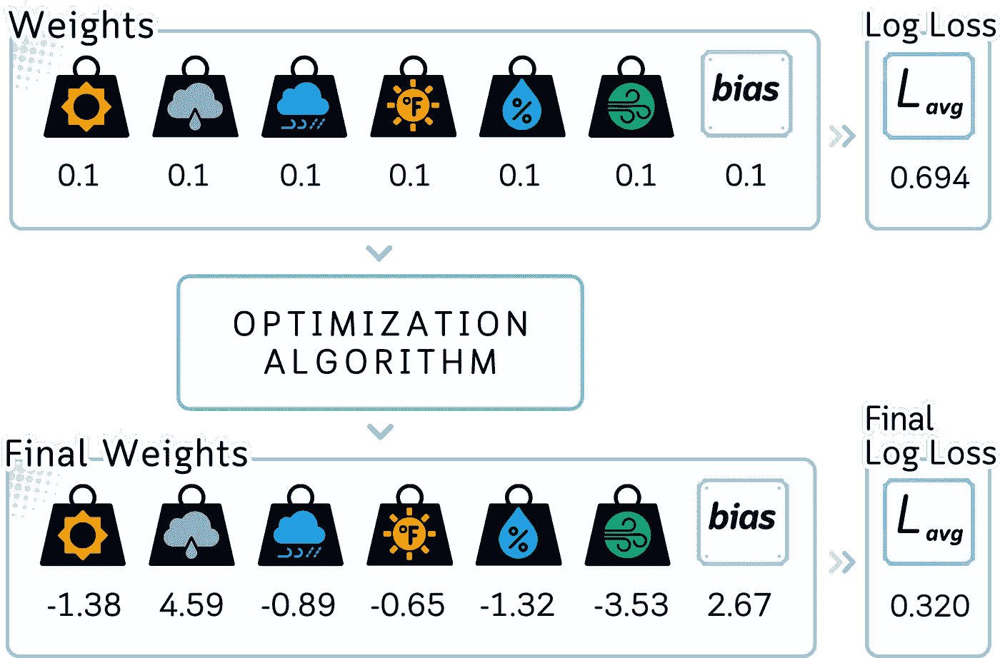

```py
def gradient_descent_step(X, y, weights, learning_rate):
    m = len(y)
    probabilities = calculate_probabilities(X, weights)
    gradient = np.dot(X.T, (probabilities - y)) / m
    new_weights = weights - learning_rate * gradient  # Create new array for updated weights
    return new_weights

# Perform one step of gradient descent (one of the simplest optimization algorithm)
learning_rate = 0.1
updated_weights = gradient_descent_step(X_train_np, y_train_np, initial_weights, learning_rate)

# Print initial and updated weights
print("\nInitial weights:")
for feature, weight in zip(['Bias'] + list(X_train.columns), initial_weights):
    print(f"{feature:11}: {weight:.2f}")

print("\nUpdated weights after one iteration:")
for feature, weight in zip(['Bias'] + list(X_train.columns), updated_weights):
    print(f"{feature:11}: {weight:.2f}")
```

```py
# With sklearn, you can get the final weights (coefficients)
# and final bias (intercepts) easily.
# The result is almost the same as doing it manually above.

from sklearn.linear_model import LogisticRegression

lr_clf = LogisticRegression(penalty=None, solver='saga')
lr_clf.fit(X_train, y_train)

coefficients = lr_clf.coef_
intercept = lr_clf.intercept_

y_train_prob = lr_clf.predict_proba(X_train)[:, 1]
loss = -np.mean(y_train * np.log(y_train_prob) + (1 - y_train) * np.log(1 - y_train_prob))

print(f"Weights & Bias Final: {coefficients[0].round(2)}, {round(intercept[0],2)}")
print("Loss Final:", loss.round(3))
```

# 分类步骤

一旦模型训练完成：

1\. 对于新实例，使用最终权重（也称为系数）计算概率，就像训练步骤中一样。

2\. 通过查看概率来解释输出：如果 *p* ≥ 0.5，预测为类别 1；否则，预测为类别 0

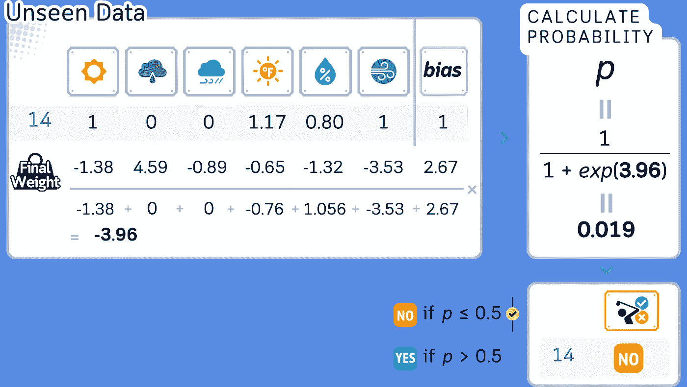

```py
# Calculate prediction probability
predicted_probs = lr_clf.predict_proba(X_test)[:, 1]

z_values = np.log(predicted_probs / (1 - predicted_probs))

result_df = pd.DataFrame({
    'ID': X_test.index,
    'Z-Values': z_values.round(3),
    'Probabilities': predicted_probs.round(3)
}).set_index('ID')

print(result_df)

# Make predictions
y_pred = lr_clf.predict(X_test)
print(y_pred)
```

## 评估步骤

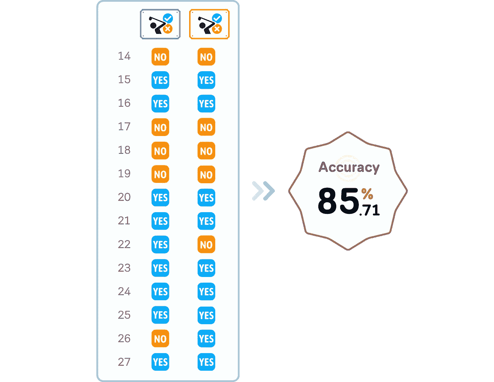

```py
result_df = pd.DataFrame({
    'ID': X_test.index,
    'Label': y_test,
    'Probabilities': predicted_probs.round(2),
    'Prediction': y_pred,
}).set_index('ID')

print(result_df)
```

# 关键参数

逻辑回归有几个重要的参数来控制其行为：

**1.惩罚项**：使用的正则化类型（‘l1’，‘l2’，‘elasticnet’ 或 ‘none’）。逻辑回归中的正则化通过在模型的损失函数中加入惩罚项，防止过拟合，并鼓励简化模型。

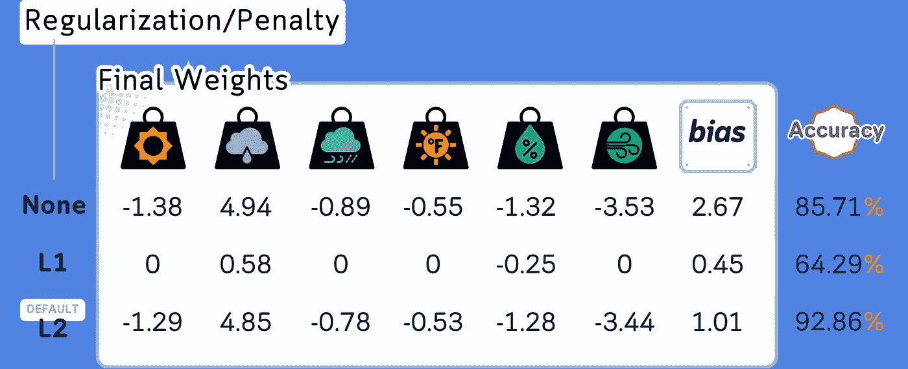

```py
from sklearn.linear_model import LogisticRegression
from sklearn.metrics import accuracy_score

regs = [None, 'l1', 'l2']
coeff_dict = {}

for reg in regs:
    lr_clf = LogisticRegression(penalty=reg, solver='saga')
    lr_clf.fit(X_train, y_train)
    coefficients = lr_clf.coef_
    intercept = lr_clf.intercept_
    predicted_probs = lr_clf.predict_proba(X_train)[:, 1]
    loss = -np.mean(y_train * np.log(predicted_probs) + (1 - y_train) * np.log(1 - predicted_probs))
    predictions = lr_clf.predict(X_test)
    accuracy = accuracy_score(y_test, predictions)

    coeff_dict[reg] = {
        'Coefficients': coefficients,
        'Intercept': intercept,
        'Loss': loss,
        'Accuracy': accuracy
    }

for reg, vals in coeff_dict.items():
    print(f"{reg}: Coeff: {vals['Coefficients'][0].round(2)}, Intercept: {vals['Intercept'].round(2)}, Loss: {vals['Loss'].round(3)}, Accuracy: {vals['Accuracy'].round(3)}")
```

**2.正则化强度（C）**：控制拟合训练数据与保持模型简洁之间的权衡。较小的 C 意味着更强的正则化。

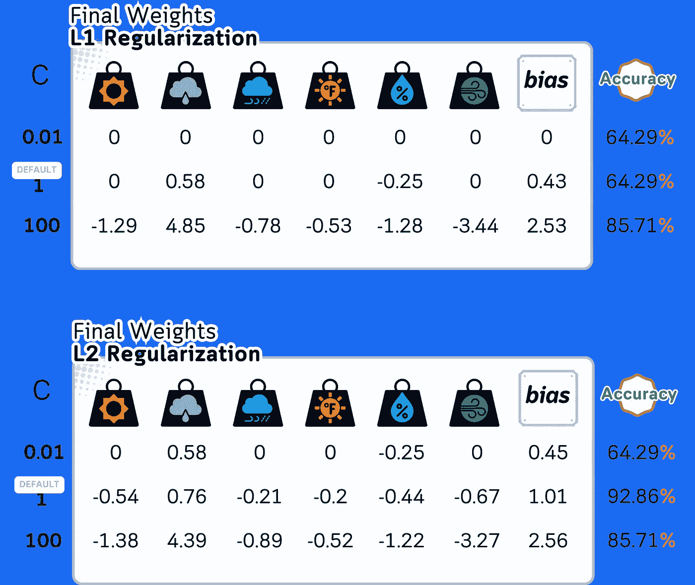

```py
# List of regularization strengths to try for L1
strengths = [0.001, 0.01, 0.1, 1, 10, 100]

coeff_dict = {}

for strength in strengths:
    lr_clf = LogisticRegression(penalty='l1', C=strength, solver='saga')
    lr_clf.fit(X_train, y_train)

    coefficients = lr_clf.coef_
    intercept = lr_clf.intercept_

    predicted_probs = lr_clf.predict_proba(X_train)[:, 1]
    loss = -np.mean(y_train * np.log(predicted_probs) + (1 - y_train) * np.log(1 - predicted_probs))
    predictions = lr_clf.predict(X_test)

    accuracy = accuracy_score(y_test, predictions)

    coeff_dict[f'L1_{strength}'] = {
        'Coefficients': coefficients[0].round(2),
        'Intercept': round(intercept[0],2),
        'Loss': round(loss,3),
        'Accuracy': round(accuracy*100,2)
    }

print(pd.DataFrame(coeff_dict).T)
```

```py
# List of regularization strengths to try for L2
strengths = [0.001, 0.01, 0.1, 1, 10, 100]

coeff_dict = {}

for strength in strengths:
    lr_clf = LogisticRegression(penalty='l2', C=strength, solver='saga')
    lr_clf.fit(X_train, y_train)

    coefficients = lr_clf.coef_
    intercept = lr_clf.intercept_

    predicted_probs = lr_clf.predict_proba(X_train)[:, 1]
    loss = -np.mean(y_train * np.log(predicted_probs) + (1 - y_train) * np.log(1 - predicted_probs))
    predictions = lr_clf.predict(X_test)
    accuracy = accuracy_score(y_test, predictions)

    coeff_dict[f'L2_{strength}'] = {
        'Coefficients': coefficients[0].round(2),
        'Intercept': round(intercept[0],2),
        'Loss': round(loss,3),
        'Accuracy': round(accuracy*100,2)
    }

print(pd.DataFrame(coeff_dict).T)
```

**3.求解器**：用于优化的算法（‘liblinear’，‘newton-cg’，‘lbfgs’，‘sag’，‘saga’）。某些正则化可能需要特定的算法。

**4.最大迭代次数**：求解器收敛的最大迭代次数。

对于我们的高尔夫数据集，我们可能以‘l2’惩罚项、‘liblinear’求解器和 C=1.0 作为基准进行尝试。

# 优点与缺点

像机器学习中的任何算法一样，逻辑回归也有其优点和局限性。

## 优点：

1.  **简单性**：易于实现和理解。

1.  **可解释性**：权重直接显示每个特征的重要性。

1.  **效率**：不需要过多的计算能力。

1.  **概率输出**：提供概率而不仅仅是分类。

## 缺点：

1.  **线性假设**：假设特征与结果的对数几率之间存在线性关系。

1.  **特征独立性**：假设特征之间没有高度相关性。

1.  **有限的复杂性**：在决策边界高度非线性的情况下，可能出现欠拟合。

1.  **需要更多数据**：需要相对较大的样本量以获得稳定的结果。

在我们的高尔夫示例中，逻辑回归可能提供一个清晰、可解释的模型，说明每个天气因素如何影响打高尔夫的决策。然而，如果决策涉及天气条件之间的复杂交互，无法通过线性模型捕捉，那么它可能会遇到困难。

# 最后备注

逻辑回归作为一种强大而简洁的分类工具脱颖而出。它的优势在于能够处理复杂数据的同时保持易于解释。与一些其他基础模型不同，它提供平滑的概率估计，并且能很好地处理多个特征。在现实世界中，从预测客户行为到医学诊断，逻辑回归往往表现出惊人的效果。它不仅仅是一个过渡工具——它是一个可靠的模型，在许多情况下能与更复杂的模型匹敌。

# 🌟 逻辑回归代码总结

```py
# Import required libraries
import pandas as pd
from sklearn.model_selection import train_test_split
from sklearn.linear_model import LogisticRegression
from sklearn.preprocessing import StandardScaler
from sklearn.metrics import accuracy_score

# Load the dataset
dataset_dict = {
    'Outlook': ['sunny', 'sunny', 'overcast', 'rainy', 'rainy', 'rainy', 'overcast', 'sunny', 'sunny', 'rainy', 'sunny', 'overcast', 'overcast', 'rainy', 'sunny', 'overcast', 'rainy', 'sunny', 'sunny', 'rainy', 'overcast', 'rainy', 'sunny', 'overcast', 'sunny', 'overcast', 'rainy', 'overcast'],
    'Temperature': [85.0, 80.0, 83.0, 70.0, 68.0, 65.0, 64.0, 72.0, 69.0, 75.0, 75.0, 72.0, 81.0, 71.0, 81.0, 74.0, 76.0, 78.0, 82.0, 67.0, 85.0, 73.0, 88.0, 77.0, 79.0, 80.0, 66.0, 84.0],
    'Humidity': [85.0, 90.0, 78.0, 96.0, 80.0, 70.0, 65.0, 95.0, 70.0, 80.0, 70.0, 90.0, 75.0, 80.0, 88.0, 92.0, 85.0, 75.0, 92.0, 90.0, 85.0, 88.0, 65.0, 70.0, 60.0, 95.0, 70.0, 78.0],
    'Wind': [False, True, False, False, False, True, True, False, False, False, True, True, False, True, True, False, False, True, False, True, True, False, True, False, False, True, False, False],
    'Play': ['No', 'No', 'Yes', 'Yes', 'Yes', 'No', 'Yes', 'No', 'Yes', 'Yes', 'Yes', 'Yes', 'Yes', 'No', 'No', 'Yes', 'Yes', 'No', 'No', 'No', 'Yes', 'Yes', 'Yes', 'Yes', 'Yes', 'Yes', 'No', 'Yes']
}
df = pd.DataFrame(dataset_dict)

# Prepare data: encode categorical variables
df = pd.get_dummies(df, columns=['Outlook'],  prefix='', prefix_sep='', dtype=int)
df['Wind'] = df['Wind'].astype(int)
df['Play'] = (df['Play'] == 'Yes').astype(int)

# Split data into training and testing sets
X, y = df.drop(columns='Play'), df['Play']
X_train, X_test, y_train, y_test = train_test_split(X, y, train_size=0.5, shuffle=False)

# Scale numerical features
scaler = StandardScaler()
float_cols = X_train.select_dtypes(include=['float64']).columns
X_train[float_cols] = scaler.fit_transform(X_train[float_cols])
X_test[float_cols] = scaler.transform(X_test[float_cols])

# Train the model
lr_clf = LogisticRegression(penalty='l2', C=1, solver='saga')
lr_clf.fit(X_train, y_train)

# Make predictions
y_pred = lr_clf.predict(X_test)

# Evaluate the model
print(f"Accuracy: {accuracy_score(y_test, y_pred)}")
```

## 进一步阅读

关于[逻辑回归](https://scikit-learn.org/stable/modules/generated/sklearn.linear_model.LogisticRegression.html)及其在 scikit-learn 中的实现，读者可以参考官方文档[2]，该文档提供了关于其使用和参数的全面信息。

## 技术环境

本文使用 Python 3.7 和 scikit-learn 1.5 版本。虽然所讨论的概念一般适用，但具体的代码实现可能会因版本不同而略有差异。

## 关于插图

除非另有说明，所有图片均由作者创作，采用了来自 Canva Pro 的授权设计元素。

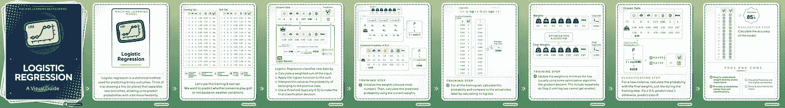

获取简洁的视觉总结，请查看[Instagram 相关帖子](https://www.instagram.com/p/C_viu8bSXJ8/)。

## 参考文献

[1] T. M. Mitchell, [机器学习](https://www.cs.cmu.edu/afs/cs.cmu.edu/user/mitchell/ftp/mlbook.html)（1997），McGraw-Hill 科学/工程/数学，第 59 页

𝙎𝙚𝙚 𝙢𝙤𝙧𝙚 𝘾𝙡𝙖𝙨𝙨𝙞𝙛𝙞𝙘𝙖𝙩𝙞𝙤𝙣 𝘼𝙡𝙜𝙤𝙧𝙞𝙩𝙝𝙢𝙨 𝙝𝙚𝙧𝙚:


[Samy Baladram](https://medium.com/@samybaladram?source=post_page-----81baf5871505--------------------------------)

## 分类算法

[查看列表](https://medium.com/@samybaladram/list/classification-algorithms-b3586f0a772c?source=post_page-----81baf5871505--------------------------------)8 个故事！[](../Images/f95c1a80b88fe6220b18cd3b2a83a30d.png)

𝙔𝙤𝙪 𝙢𝙞𝙜𝙝𝙩 𝙖𝙡𝙨𝙤 𝙡𝙞𝙠𝙚:


[Samy Baladram](https://medium.com/@samybaladram?source=post_page-----81baf5871505--------------------------------)

## 回归算法

[查看列表](https://medium.com/@samybaladram/list/regression-algorithms-b0b6959f1b39?source=post_page-----81baf5871505--------------------------------)5 个故事！一个戴着粉色帽子的双马尾卡通娃娃。这个“假人”娃娃，通过其基本的设计和心形装饰的衬衫，直观地呈现了机器学习中“假回归器”的概念。就像这个玩具般的形象是一个简化、静态的人的代表一样，假回归器是作为基准的基本模型，用于更复杂的分析。

[Samy Baladram](https://medium.com/@samybaladram?source=post_page-----81baf5871505--------------------------------)

## 集成学习

[查看列表](https://medium.com/@samybaladram/list/ensemble-learning-673fc83cd7db?source=post_page-----81baf5871505--------------------------------)4 个故事！[](../Images/1bd2995b5cb6dcc956ceadadc5ee3036.png)
