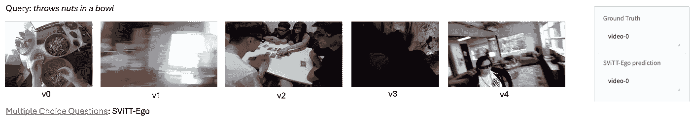

# 长篇视频表示学习（第二部分：视频作为稀疏 Transformer）

> 原文：[`towardsdatascience.com/long-form-video-representation-learning-part-2-video-as-sparse-transformers-29fbd0ed9e71?source=collection_archive---------9-----------------------#2024-05-14`](https://towardsdatascience.com/long-form-video-representation-learning-part-2-video-as-sparse-transformers-29fbd0ed9e71?source=collection_archive---------9-----------------------#2024-05-14)

## 我们探索了具备长篇推理能力的新型视频表示方法。这是第二部分，重点介绍稀疏视频-文本 Transformer。请参见关于视频作为图的[第一部分](https://medium.com/@subarna.tripathi/long-form-video-representation-learning-part-1-video-as-graphs-c55b609d9100)。而[第三部分](https://medium.com/@subarna.tripathi/long-form-video-representation-learning-part-3-latest-and-greatest-in-long-form-video-1b6dee0f5f6e)提供了我们最新研究成果的预览。

 [Subarna Tripathi](https://medium.com/@subarna.tripathi?source=post_page---byline--29fbd0ed9e71--------------------------------)

·发布于[Towards Data Science](https://towardsdatascience.com/?source=post_page---byline--29fbd0ed9e71--------------------------------) ·6 分钟阅读·2024 年 5 月 14 日

--

本系列的[第一篇博客](https://medium.com/@subarna.tripathi/long-form-video-representation-learning-part-1-video-as-graphs-c55b609d9100)介绍了用于“长篇”视频表示学习的显式稀疏图表示方法。这些方法是有效的；然而，它们不能进行端到端的训练。我们需要依赖其他基于 CNN 或 Transformer 的特征提取器来生成初始的节点嵌入。在本篇博客中，我们的重点是使用 Transformer 设计端到端的方法，但目标依然是实现“长篇”推理。

## 稀疏视频-文本 Transformer

作为一种端到端可学习的架构，我们开始探索 transformers。我们首先需要解答的问题是：视频-文本 transformer 是否能学习跨帧建模时序关系？我们观察到，尽管视频模型具有巨大的容量和丰富的多模态训练数据，最近的视频模型仍然表现出强烈的基于帧的空间表示倾向，而时序推理依然未得到有效解决。例如，如果我们打乱输入视频模型的帧顺序，输出几乎没有变化！

图片由作者提供

经过进一步调查，我们发现将多帧推理融入视频语言模型面临几个关键挑战。首先，有限的模型规模意味着空间和时间学习之间需要做出权衡（经典例子是视频 CNN 中的 2D/3D 卷积）。对于任何给定的数据集，最佳性能需要在二者之间找到微妙的平衡。其次，长时段视频模型通常具有更大的模型规模，并且更容易发生过拟合。因此，对于长视频模型，仔细分配参数和控制模型增长变得尤为重要。最后，即便扩展片段长度能改善结果，它也会面临收益递减的问题，因为视频片段所提供的信息量并不会随着采样率的增加而线性增长。如果不控制模型规模，计算量的增加可能无法抵消准确率提升带来的收益。这对基于 transformer 的架构尤为重要，因为自注意力机制的内存和时间成本是输入长度的二次方。

总之，模型复杂度应该根据输入视频自适应调整，以实现空间表示、时间表示、过拟合潜力和复杂性之间的最佳平衡。由于现有的视频-文本模型缺乏这种能力，它们要么在空间和时间建模之间达成次优平衡，要么根本没有学习到有意义的时间表示。

## 视频 transformers 中可以“稀疏化”的是什么？节点和边：

我们认为，视频-文本模型应学习将建模资源分配给视频数据。与其均匀地扩展模型至更长的片段，不如将这些资源分配到视频的相关时空位置，这对于从长片段中高效学习至关重要。对于 transformer 模型，这种资源分配通过修剪冗余的注意力连接自然而然地实现。我们通过探索 transformer 稀疏化技术来实现这些目标。这促使我们提出了受图模型启发的*稀疏视频-文本 Transformer*（SViTT）。如图 1 所示，SViTT 将视频标记视为图的顶点，自注意力模式视为连接它们的边。

我们设计了 SViTT，旨在实现节点和边缘的稀疏性：**节点**稀疏性通过识别信息丰富的标记（例如，表示前景中移动物体或人的标记）并剪枝背景特征嵌入来实现；**边缘**稀疏性则旨在减少注意力模块中的查询-键对，同时保持其全局推理能力。为了解决长输入片段的回报递减问题，我们提出通过时间稀疏扩展进行训练，采用课程学习策略，在每个训练阶段同步增加片段长度和模型稀疏性。

（作者提供的图片）图 2：（作者提供的图片）我们展示以下定性结果

结果：（1）左侧：一个训练样本包括描述（顶部的句子）和视频片段（视频的帧序列），（2）中间：视觉标记剪枝后的视频编码器的第 10 层；（3）右侧：多模态编码器在标记剪枝后的输出。

## 应用、评估与结果

SViTT 在多种视频-文本基准测试中进行了评估，从视频检索到问答任务，比较了先前的研究成果和我们自己的稠密模型基准。首先，我们进行了一系列消融研究，以了解稀疏建模在变换器中的优势。有趣的是，我们发现，在推理时，节点（标记）和边缘（注意力）可以大幅度剪枝，而对测试性能的影响很小。实际上，使用跨模态注意力进行的标记选择，在不重新训练的情况下，能使检索结果提高 1%。图 2 显示，SViTT 将信息丰富的区域从背景区域中分离出来，以促进高效的时间推理。

接下来，我们使用稀疏模型进行完整的预训练，并评估其下游性能。我们观察到，SViTT 在处理较长输入片段时表现良好，而稠密变换器在此时由于优化困难，准确率下降。在所有视频-文本基准测试中，SViTT 相较于稠密模型以更低的计算成本报告了可比或更好的性能，超过了包括那些使用额外图像-文本语料库训练的先前方法。

作者提供的图片

从上面的表格中，我们可以看到，通过稀疏化，立即的时间上下文聚合可以延长 2 倍（表 2）。还可以看到稀疏化如何维持最终任务的准确性（表 1），甚至有所提升。

作者提供的图片

在上述表格中，我们展示了我们提出的训练范式如何通过不同稀疏级别来帮助提高任务性能。在表 4 中，您可以看到在两个标准基准上进行的文本到视频检索任务的零-shot 性能。

作者提供的图片

最后，我们展示了在多模态检索和视频问答的不同基准上获得的结果。SViTT 超越了所有现有方法，甚至需要的预训练对数更少。

关于 SViTT 的更多细节可以在[这里](http://svcl.ucsd.edu/projects/svitt/)找到。总结来说，与原始的 transformers 相比，SViTT 的效率提高了 6 到 7 倍，能够实现 2 倍的上下文聚合。使用 SViTT 进行预训练，在 5 个基准任务（如检索、视频问答）上提高了准确性，超越了现有的最先进技术（SoTA）。

## SViTT-Ego 用于以自我为中心的视频：

预训练以自我为中心的视觉-语言模型已成为提升下游自我中心视频-文本任务的关键。这些自我中心的基础模型通常使用 transformer 架构。这些模型在预训练期间的内存占用可能相当庞大。因此，我们预训练了我们自己的稀疏视频-文本 transformer 模型 SViTT-Ego，这是第一个集成边缘和节点稀疏化的稀疏自我中心视频-文本 transformer 模型。我们在[EgoClip](https://proceedings.neurips.cc/paper_files/paper/2022/file/31fb284a0aaaad837d2930a610cd5e50-Paper-Conference.pdf)数据集上进行预训练，并引入了自我中心友好的目标 EgoNCE，而不是常用的 InfoNCE。最显著的是，SViTT-Ego 在 EgoMCQ（视频内）准确度上相比当前的最先进技术提高了 2.8%，且没有使用除标准图像增强外的额外数据增强技术，同时能够在内存有限的设备上进行预训练。以下展示了一个视觉示例。我们正在准备参加 CVPR 上的 EgoVis 研讨会，展示我们的 SViTT-Ego。

（图像由作者提供）图 3：来自 Huggingface 演示的 EgoMCQ 截图

（图像由作者提供）表 7：SViTT-Ego 在所有最先进的模型上表现优异

视频内准确度。考虑到仅在

3.8M 个样本没有叙述增强，SViTT-Ego 在

在视频间和视频内准确度上，所有模型均表现出色

（图像由作者提供）图 5：给定 qv = 0.7，我们展示了以下定性结果

使用视觉编码器的结果：第 1 行，显示 4 帧输入；第 2 行

图 2，显示视频编码器的第 4 层在视觉标记修剪后的情况；第 3 行，

显示视频编码器的第 7 层在视觉标记修剪后的情况；以及第 3 行

图 4，显示视频编码器的第 10 层在视觉标记修剪后的情况。我们

使用 SViTT 来修剪视觉标记

## 亮点：

我们提出了**SViTT**，一种视频-文本架构，统一了边缘和节点稀疏性；我们展示了它在视频语言任务中的时间建模效果。与原始的 transformer 相比，**SViTT**的效率提高了 6 到 7 倍，能够实现 2 倍的上下文聚合。使用 SViTT 进行预训练，在 5 个基准任务上（如检索、视频问答）提高了准确性，超越了当前的最先进技术（SoTA）。我们的稀疏视频-文本 transformer 工作首次发表于[CVPR 2023](https://openaccess.thecvf.com/content/CVPR2023/papers/Li_SViTT_Temporal_Learning_of_Sparse_Video-Text_Transformers_CVPR_2023_paper.pdf)。

接下来，我们展示了如何利用这种稀疏变换器进行自我中心视频理解应用。我们展示了**SViTT-Ego**（基于 SViTT 构建）在 EgoMCQ 任务中相较于密集变换器基准表现更好，并且由于固有的稀疏性，峰值内存和计算需求显著更低。这表明像**SViTT-Ego**这样的稀疏架构是一个潜在的基础模型选择，特别是在内存受限设备上的预训练。请关注即将发布的激动人心的消息！
