# 低代码数据连接器和目标

> 原文：[`towardsdatascience.com/low-code-data-connectors-and-destinations-b044128c72ca?source=collection_archive---------11-----------------------#2024-10-10`](https://towardsdatascience.com/low-code-data-connectors-and-destinations-b044128c72ca?source=collection_archive---------11-----------------------#2024-10-10)

## 开始使用 Airbyte 和云存储

[](https://hectormrejia.medium.com/?source=post_page---byline--b044128c72ca--------------------------------)[](https://towardsdatascience.com/?source=post_page---byline--b044128c72ca--------------------------------) [Hector Andres Mejia Vallejo](https://hectormrejia.medium.com/?source=post_page---byline--b044128c72ca--------------------------------)

·发布于[Towards Data Science](https://towardsdatascience.com/?source=post_page---byline--b044128c72ca--------------------------------) ·阅读时长 11 分钟·2024 年 10 月 10 日

--

# 自己编写连接器代码？请三思。

创建和维护一个数据平台是一项艰巨的挑战。你不仅需要让它具有可扩展性和实用性，而且每一个架构决策都会随着时间的推移积累。数据连接器是这样一个平台的重要组成部分。毕竟，我们还能如何获取数据呢？从头开始自己构建连接器让你**完全控制它们的行为方式**。但要小心，随着平台中数据源的不断增加，这只能意味着以下几点：

+   为每个新连接器编写大量代码。

+   为每一个数据连接器维护复杂的代码。

+   类之间的函数和定义可能会随着时间的推移而发生偏离，从而导致更复杂的维护。

当然，所有这三者**都可以通过在面向对象编程中定义良好的实践来缓解**。但即便如此，**仍然需要许多小时的编码**，这些时间本可以在后期用来更快速地为数据消费者提供服务。


数据像高速公路上的汽车一样流动。图片由[Stephan Seeber](https://unsplash.com/@stywo?utm_source=medium&utm_medium=referral)提供，来源于[Unsplash](https://unsplash.com/?utm_source=medium&utm_medium=referral)

# 如果你尝试低代码连接器会怎样？

其他选项仍然可以让你灵活地定义你想要摄取的数据及其方式，几乎不需要或只需要极少的代码。在这个选项下，你可以得到：

+   根据提取方法标准化行为的连接器：例如，对于使用 REST API 作为核心的两个连接器，不会有分歧的类。

+   简单但强大的用户界面，用于构建源和目标之间的连接。

+   由构建工具的团队和社区维护的连接器。

这些好处使你能够在**几分钟内构建数据连接，而不是几个小时。**

然而，我并不是想向你推销这些工具；如果你需要为数据摄取实现高度可定制的逻辑，那么你将不得不自己实现它。因此，做最适合你应用的事。

# 练习：使用 ADLS Gen2 部署 Airbyte

让我们直接进入正题。我在本教程中使用的是 Azure。你可以注册并免费获得 $200 的服务，尝试该平台。

我们将使用 Azure Kubernetes 集群部署 Airbyte Open Source，并使用 Azure 存储 (ADLS) Gen 2 作为云存储。

## 创建基础设施

首先，创建以下资源：

+   **资源组**，可以选择你喜欢的名称。

+   **Azure Kubernetes 服务**。为了避免高额费用，设置一个单节点池并使用一个节点。然而，该节点需要足够的资源，否则 Airbyte 同步将无法启动。一个合适的节点大小是 ***Standard_D4s_v3.***

+   **Azure 存储账户**。创建 Git 时，开启分层命名空间功能，以便将存储账户转为 ADLS Gen2。现在，创建一个你喜欢的名称的存储容器。

> ***生产提示：为什么要使用分层命名空间？*** *对象存储默认具有扁平的存储环境，这具有无限可扩展性的优点，但也有一个重要的缺点。对于分析工作负载，这会导致额外的开销，因为在读取、修改或移动文件时，必须扫描整个容器。启用此功能将文件系统中的分层目录带到可扩展的对象存储中。*

## 将 Airbyte 部署到 Kubernetes

你需要先在你的 shell 中安装几个工具：

+   [Azure-CLI](https://learn.microsoft.com/en-us/cli/azure/install-azure-cli)

+   [Helm](https://helm.sh/docs/intro/install/)

+   [Kubernetes 命令行工具 (kubectl)](https://kubernetes.io/docs/tasks/tools/)

现在，按照以下步骤操作：

使用 shell 登录到你的 Azure 账户。

```py
az login
```

设置集群凭证。

```py
az aks get-credentials --resource-group <your-resource-group>\
                       --name <cluster-name>\
                       --overwrite-existing
```

添加远程 Helm 仓库并搜索 Airbyte chart。

```py
helm repo add airbyte https://airbytehq.github.io/helm-charts
helm repo update
helm search repo airbyte
```

为 Airbyte 部署创建一个唯一的 Kubernetes 命名空间。我将其命名为 ***dev-airbyte***。

```py
kubectl create namespace dev-airbyte
```

部署 Airbyte。

```py
helm install airbyte airbyte/airbyte - namespace dev-airbyte
```

等待几分钟，直到部署完成。运行以下命令检查 pods 是否正在运行：

```py
kubectl get pods --namespace dev-airbyte
```

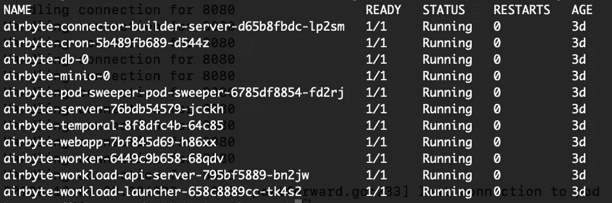

Airbyte pod 已就绪！截图由我拍摄。

## **本地访问 Airbyte Web 应用**

部署 Airbyte 后，你可以获取容器和端口，然后运行端口转发命令，将本地机器的端口映射到 Kubernetes Web 应用 pod 中的端口。这将允许我们通过 localhost 访问应用程序。

```py
export POD_NAME=$(kubectl get pods - namespace dev-airbyte -l "app.kubernetes.io/name=webapp" -o jsonpath="{.items[0].metadata.name}")
export CONTAINER_PORT=$(kubectl get pod - namespace dev-airbyte $POD_NAME -o jsonpath="{.spec.containers[0].ports[0].containerPort}")
kubectl - namespace dev-airbyte port-forward $POD_NAME 8080:$CONTAINER_PORT
echo "Visit http://127.0.0.1:8080 to use your application"
```

如果你在你的机器上访问 ***127.0.0.1:8080***，你应该能看到应用程序界面。现在，我们可以开始添加数据连接器了！

> ***生产提示：*** *端口转发仅适用于本地机器，且每次启动 Shell 时都必须执行。但是，对于实际场景中的数据团队，Kubernetes 允许你通过* [*虚拟专用网络*](https://learn.microsoft.com/en-us/azure/aks/internal-lb?tabs=set-service-annotations)*公开你的应用程序*。为此，你需要切换到* [*Airbyte 自托管企业版*](https://docs.airbyte.com/enterprise-setup/) *，它提供* [*单点登录*](https://docs.airbyte.com/access-management/sso-providers/azure-entra-id) *与像 Azure Active Directory 这样的云身份提供商一起保护你的工作区。*

## 设置数据源

本次练习中的数据提供商是[Tiingo](https://www.tiingo.com/documentation/general/overview)，它提供来自股市公司非常有价值的信息。他们提供[免费许可证](https://www.tiingo.com/documentation/general/overview)，可以让你访问任何资产的每日收盘价接口以及 DOW 30 公司基本面分析。请注意，**使用免费许可证时，他们的数据仅供个人查看**。如果你想分享基于 Tiingo 的创作，你必须购买商业许可证。目前，我将使用免费版并指导你完成教程，但不会展示他们的实际股票数据，以遵守他们的规则。

[创建账户](https://www.tiingo.com/documentation/general/overview)。然后，复制提供给你的 API 密钥。我们现在准备好在 Airbyte 中设置数据源。

## **在 Airbyte 中创建数据源**

在 Airbyte 应用中，进入***Builder > Start from Scratch***。

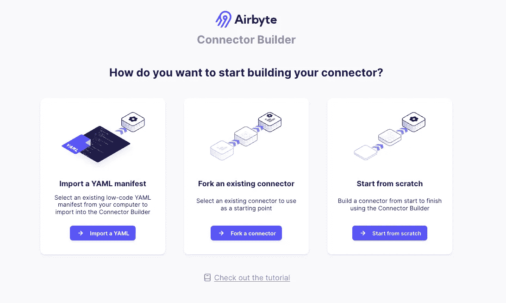

Airbyte 连接器构建器界面。图片由我拍摄。

在 API 基本 URL 中写入[***https://api.tiingo.com/tiingo/***](https://api.tiingo.com/tiingo/)，然后点击 YAML 按钮进行配置。输入以下内容：

```py
type: ApiKeyAuthenticator
inject_into:
  type: RequestOption
  inject_into: header
  field_name: Authorization
  api_token: 'Token {{ config["api_key"] }}'
```

这将允许 API 令牌插入到每个请求的头部。现在，点击左侧的加号(+)来添加你的第一个流。下面的图片可以作为参考。

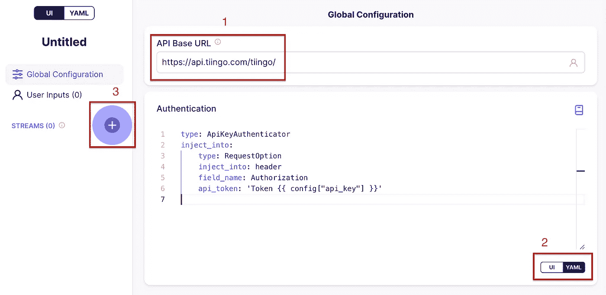

构建数据源。全局配置。图片由我拍摄。

**URL 和流分区**

在顶部写入***End of Day Prices***。这将是我们的流名称，URL 路径将是：

```py
daily/{{ stream_partition['ticker'] }}/prices
```

***{{}}***之间的占位符是什么？这些是 Airbyte 在运行时填充的变量。在这种情况下，Airbyte 支持他们称之为流分区的功能，允许连接器**根据你分区数组中的值的数量发出请求**。

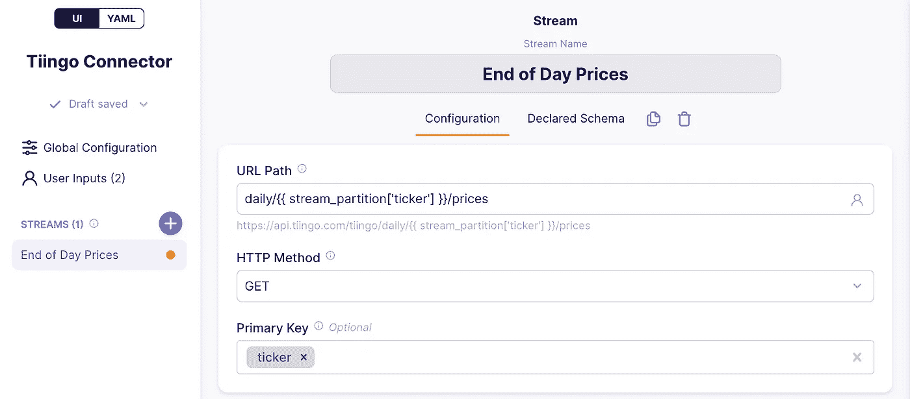

定义 URL 路径和主键。图片由我拍摄。

向下滚动到参数化请求，勾选该框。在参数值下拉菜单中，点击用户输入，并在值文本框中输入：

```py
{{ config['tickers_arr'] }}
```

请注意，这里使用的***config***变量也在全局配置中的 API 密钥中引用。该变量保存用户输入的值。此外，用户输入的***tickers_arr***将保存股票 ID 的数组。

接下来，在***当前参数值标识符***文本框中输入***ticker***。这是添加到**stream_partition**变量中的键，并引用来自数组***tickers_arr***的单个股票 ID，以进行单个 HTTP 请求。下面是该过程的截图。

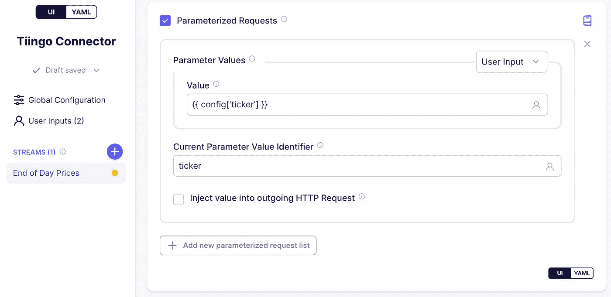

定义参数化请求。图片由我拍摄。

我们将使用 4 个股票代码进行测试：

+   **BA** 代表波音公司

+   **CAT** 代表卡特彼勒公司

+   **CVX** 代表雪佛龙公司

+   **KO** 代表可口可乐公司

配置好流分区后，连接器将向 Tiingo 服务器发出 4 个请求，如下所示：

+   [***https://api.tiingo.com/tiingo/***](https://api.tiingo.com/tiingo/)***daily/BA/prices***

+   [***https://api.tiingo.com/tiingo/***](https://api.tiingo.com/tiingo/)***daily/CAT/prices***

+   [***https://api.tiingo.com/tiingo/***](https://api.tiingo.com/tiingo/)***daily/CVX/prices***

+   [***https://api.tiingo.com/tiingo/daily/KO/prices***](https://api.tiingo.com/tiingo/daily/KO/prices)

很酷吧？

> ***生产提示：*** *Airbyte 支持父流，这使我们可以通过请求其他端点来获取分区列表，而无需自己发出数组元素。在这个练习中我们没有这样做，但你可以查看* [*这里*](https://docs.airbyte.com/connector-development/connector-builder-ui/partitioning#parent-stream)*。*

**增量同步**

Airbyte 支持在增量追加模式下同步数据，即：仅同步*新增*或*修改*的数据。这可以防止重新获取已从源头复制的数据。如果是第一次运行同步，它相当于[完全刷新](https://docs.airbyte.com/using-airbyte/core-concepts/sync-modes/full-refresh-append)，因为所有数据都会被视为*新增*数据。

要在我们的连接器中实现此功能，请滚动到**增量同步**并勾选复选框。在**游标**字段文本框中输入日期，因为根据文档说明，这是表示资产更新时间的日期字段名称。对于游标日期时间格式，输入

```py
%Y-%m-%dT%H:%M:%S.%fZ
```

这是 API 文档建议的输出格式。

在**开始日期时间下拉菜单**中点击自定义，并在文本框中输入以下内容：

```py
{{ day_delta(-1, format='%Y-%m-%dT%H:%M:%SZ') }}
```

它会告诉 Airbyte 插入昨天的日期。对于**结束日期时间**，将下拉菜单保持在**现在**，以便获取从开始日期到今天的数据。以下截图展示了这些步骤。

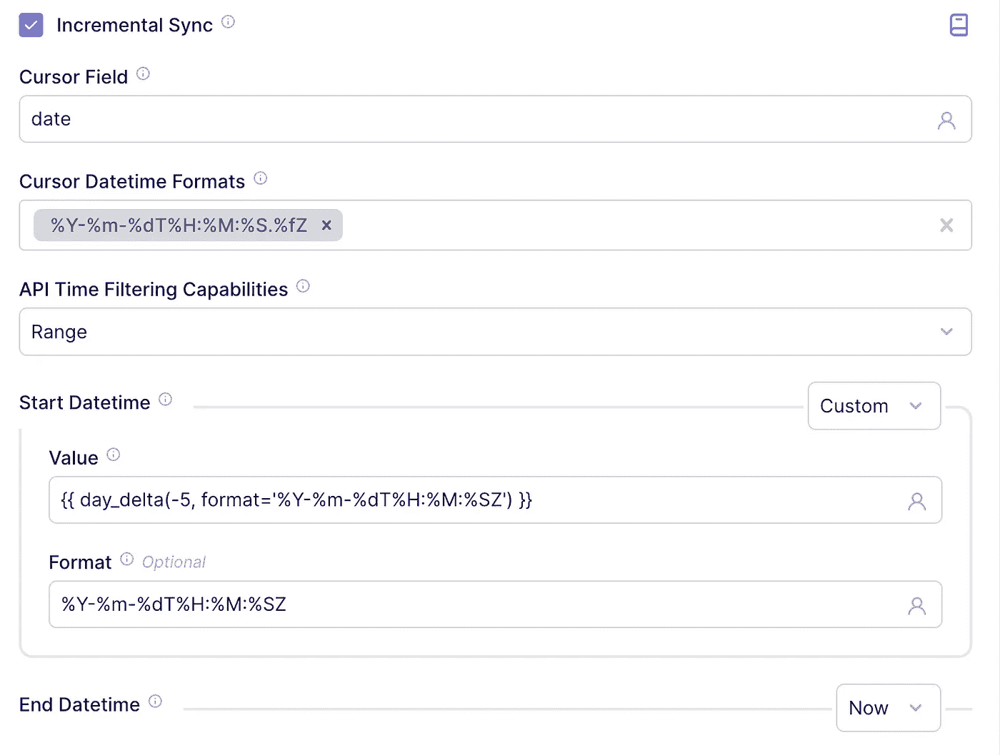

添加增量开始日期时间和结束日期时间。图片由我拍摄。

最后，勾选框以将开始时间和结束时间注入到传出的 HTTP 请求中。参数名称应分别为 startDate 和 endDate。这些参数名称也来自 Tiingo 文档。一个示例请求现在将如下所示：

+   [***https://api.tiingo.com/tiingo/daily/BA/prices?startDate=2024-09-20T13%3A54%3A20.000000Z&endDate=2024-09-23T13%3A54%3A20.000000Z***](https://api.tiingo.com/tiingo/daily/BA/prices?startDate=2024-09-20T13%3A54%3A20.000000Z&endDate=2024-09-23T13%3A54%3A20.000000Z)

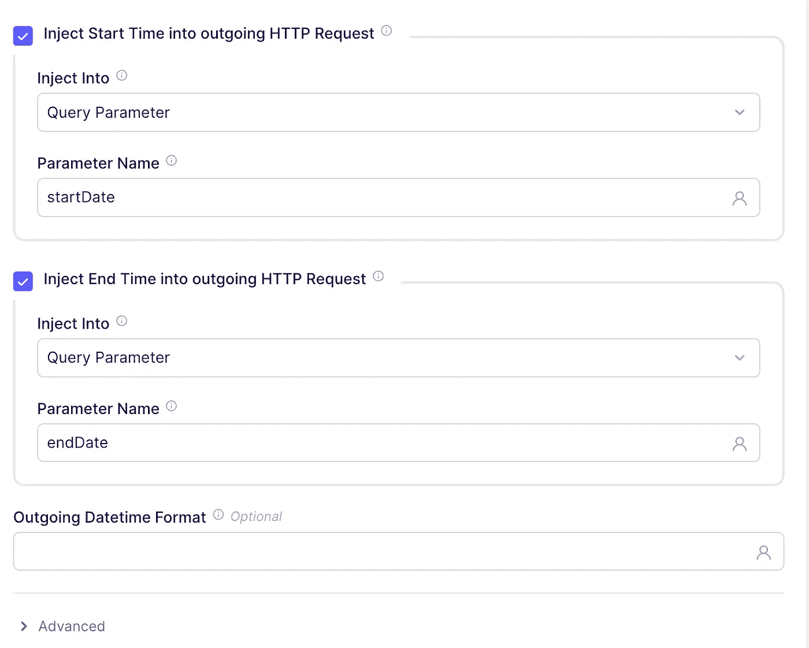

用于增量加载的开始和结束时间参数。图片由我拍摄。

**控制字段**

我们将插入一些信息以丰富数据。为此，滚动到转换部分并勾选框。在转换下拉菜单中，点击“添加字段”。路径就是要添加的列名，写 process_date，值为 {{ today_utc() }}。这将指示记录被导入系统的时间戳。

现在，根据文档，资产的股票代码不会在响应中返回，但我们可以通过额外的转换轻松地将其添加进去。所以，对于路径，写 ticker，值应为 {{ stream_partition[‘ticker’] }}。这将把当前流分区的 ticker 值作为一列添加进去。

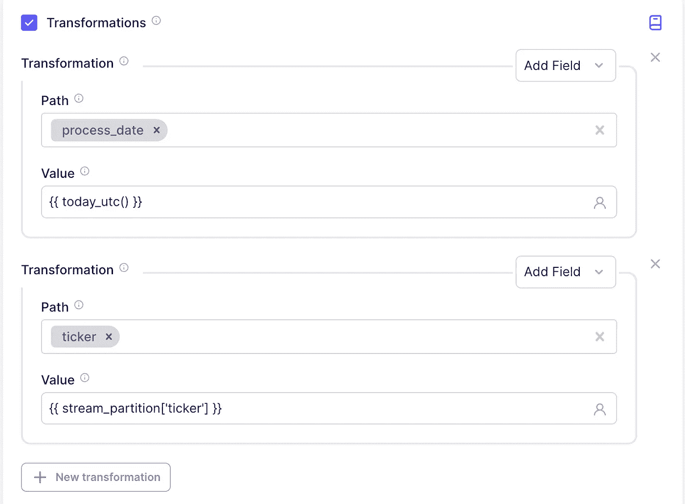

将我们的控制字段添加到 API 响应中。图片由我拍摄。

**测试**

在“测试值”按钮中，输入股票代码列表。每个股票代码用逗号分隔：BA、CAT、CVX、KO。

你应该看到类似下面的图像。

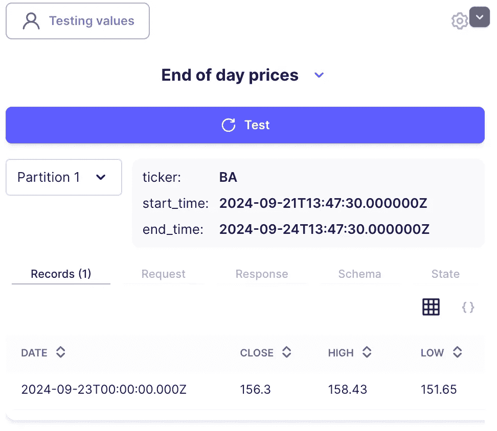

注意两个示例分区。这是 Airbyte 执行的两个独立的参数化请求。你还可以获得有关请求的实际内容、生成的数据架构以及状态信息。

转到右上角并点击 **发布** 以保存此连接器。可以给它任何名称，我只是叫它 Tiingo Connector。

## **将 Airbyte 连接到对象存储**

让我们返回到存储服务，进入 ***Security + Networking > Access keys***。复制帐户名称和一个访问密钥。注意：我们需要的是访问密钥，而不是连接字符串。

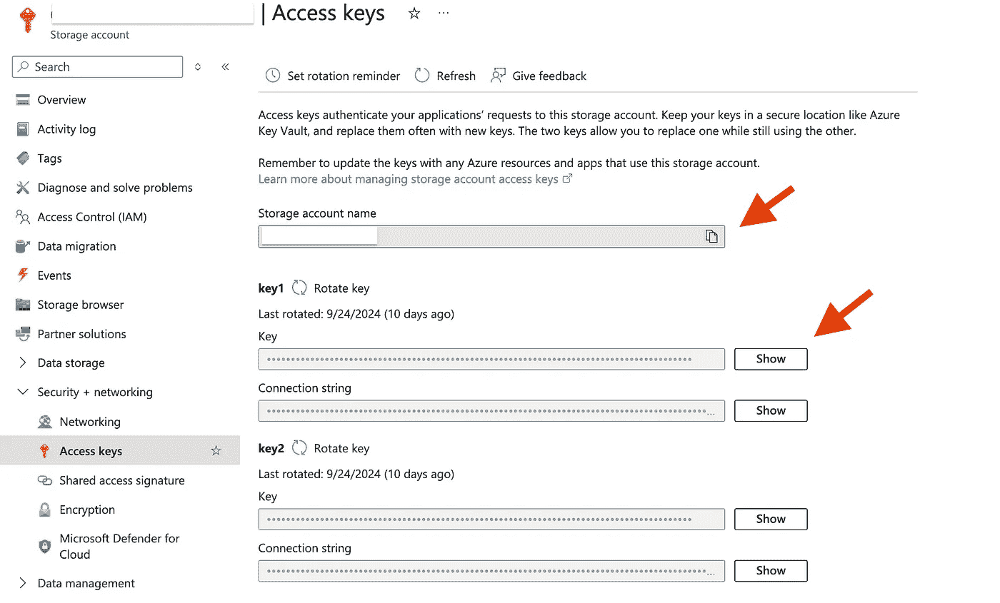

获取 Azure 存储帐户的访问密钥。图片由我拍摄。

接下来，进入你的 Airbyte 应用，选择 ***Destinations> Marketplace***，然后点击 ***Azure Blob Storage***。输入帐户名称、帐户密钥，并保持其他配置如图所示。此外，在可选字段中，输入你创建的容器名称。接下来，点击 **设置目标**。

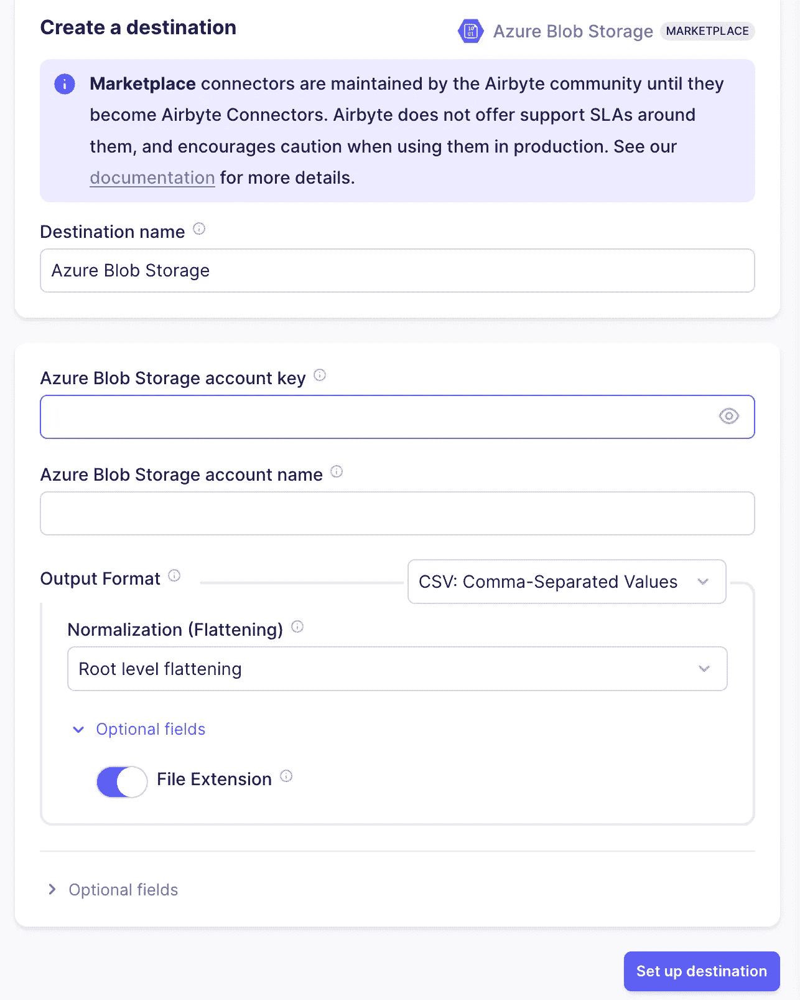

在 Airbyte 中设置目标。图片由我拍摄。

> ***生产提示：*** *你组织的数据资产需要得到保护，以确保只有需要访问文件的个人或团队能够访问。你可以在存储帐户级别通过访问控制（IAM）按钮设置基于角色的访问控制，也可以通过右键点击文件夹、容器或文件来设置访问控制列表（ACLs）。*

## **从源到目标创建连接**

在 Airbyte 中建立连接有四个步骤，它将使用 Tiingo 连接器和 Azure 存储。

**定义源**

在 Airbyte 应用中，进入连接设置并创建一个连接。第一步是设置源。点击 ***设置新源***。然后，在 ***自定义*** 标签下，选择我们刚刚创建的 Tiingo 连接器。

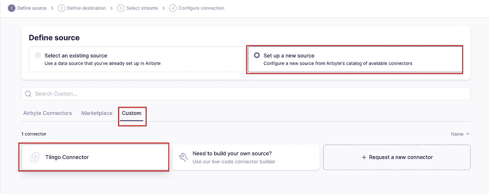

为连接创建源。图片由我拍摄。

它会提示你输入 API 密钥和股票代码。只需复制你在测试源时使用的密钥。现在点击 ***设置源***。它将使用你的配置测试连接器。

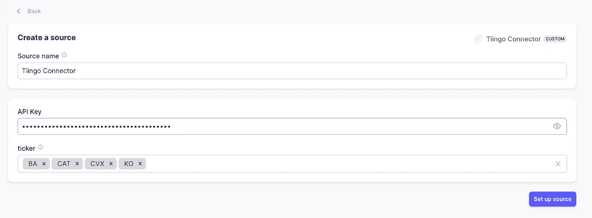

为源添加用户输入。图片由我拍摄。

**定义目标**

一旦同步通过，我们将设置目标，目标是上述部分中创建的那个。此时，Airbyte 也将测试目标。

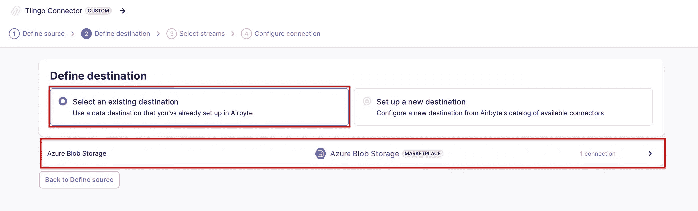

为连接添加目标。图片由我拍摄。

**定义流**

第三步是选择流和同步模式。由于我们只定义了一个名为 ***日终价格*** 的流，所以这是唯一可用的流。至于同步模式，这些是本次操作可用的选项：

+   **完全刷新 | 覆盖：** 该模式将检索所有数据，并替换目标中任何现有的数据。

+   **完全刷新 | 追加：** 该模式也会检索所有数据，但它会将新数据追加到目标中。你必须适当地去重或转换数据，以满足你后续的需求。

+   **增量 | 追加：** 该模式根据我们在构建连接器时定义的增量条件请求数据。然后，它会将数据追加到目标位置。

你可以在[这里](https://docs.airbyte.com/using-airbyte/core-concepts/sync-modes/)阅读更多关于同步模式的信息。现在，选择 ***增量 | 追加***。

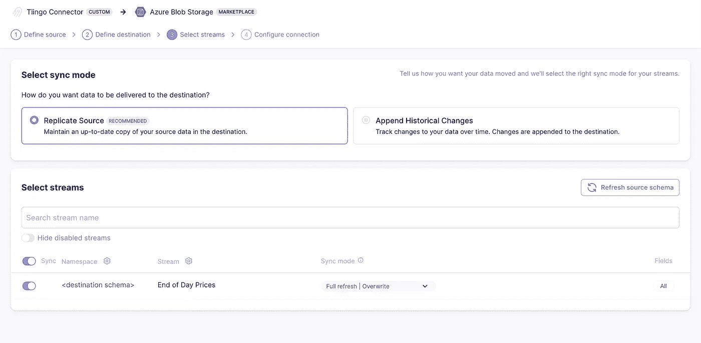

选择要获取的流。图片由我拍摄。

**最终连接配置**

在这里，你可以定义所需的计划以及其他附加设置。点击 ***完成并同步***，以启动第一次数据提取和获取。

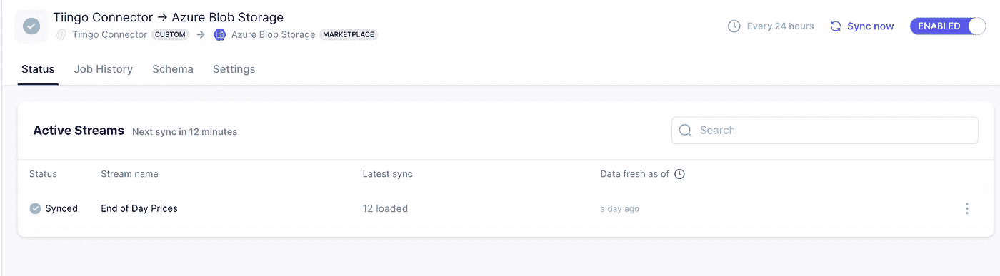

运行第一次同步过程。图片由我拍摄。

就这样！数据已经被获取。返回存储容器，你将看到一个新文件夹，其中有一个 CSV 文件。选择追加模式后，每当触发同步时，新的文件将出现在该文件夹中。

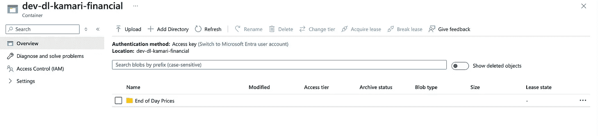

一个以流名称命名的新文件夹已创建。图片由我拍摄。

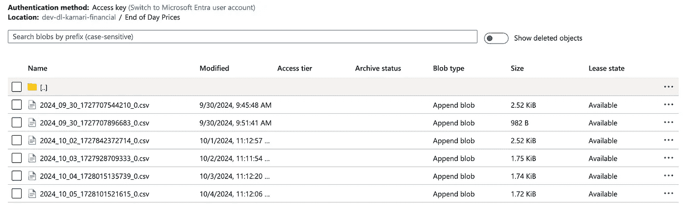

Airbyte 多次同步后的数据文件。图片由我拍摄。

# 结论

你可以清楚地看到这些工具的强大功能。在这种情况下，Airbyte 让你能够在几分钟内通过生产级连接器开始获取关键数据，而无需维护大量代码。此外，它还支持增量刷新和全量刷新模式，并具有附加或覆盖的功能。在这个练习中，仅演示了 Rest API 数据源，但还有许多其他类型的数据源，例如传统数据库、数据仓库、对象存储和其他平台。最后，它还提供多种目标位置，你的数据可以存储在这些位置并进一步分析，极大加快了开发过程，让你能够更快地将产品推向市场！

感谢阅读本文！如果你喜欢这篇文章，请点赞并分享。我尽力写出我在数据领域学到的东西，以此表达对这个教会我很多的社区的感谢。

下次再见！
