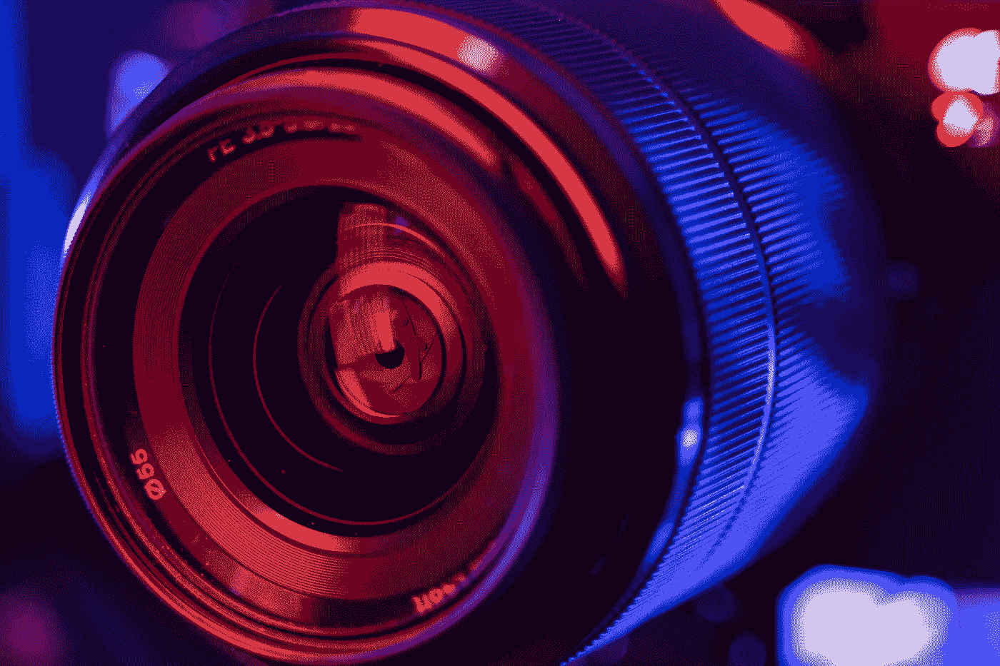
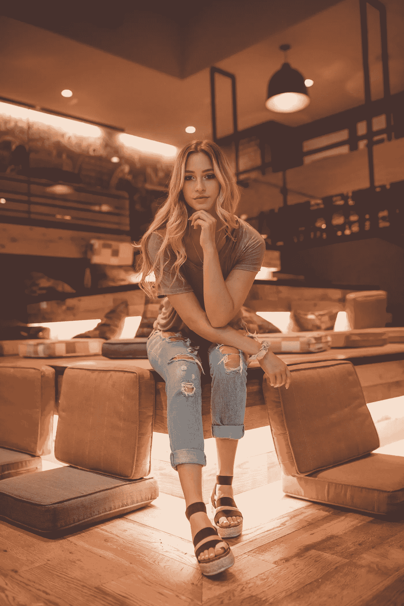
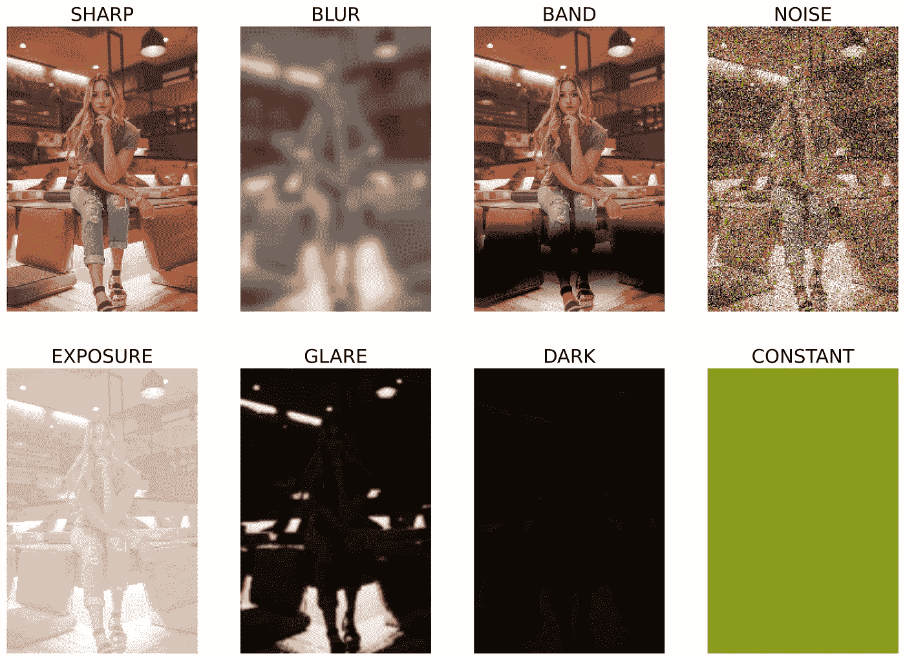

# 低质量图像检测—第一部分

> 原文：[`towardsdatascience.com/low-quality-image-detection-machine-learning-fdc2c1ba86e1?source=collection_archive---------6-----------------------#2024-01-05`](https://towardsdatascience.com/low-quality-image-detection-machine-learning-fdc2c1ba86e1?source=collection_archive---------6-----------------------#2024-01-05)

照片由[TheRegisti](https://unsplash.com/@theregisti?utm_source=medium&utm_medium=referral)拍摄，来源于[Unsplash](https://unsplash.com/?utm_source=medium&utm_medium=referral)

## *如何使用机器学习和深度学习进行低质量图像检测（例如，模糊检测、眩光检测或噪声检测）。*

 [Shuyi Yang](https://medium.com/@ngshya?source=post_page---byline--fdc2c1ba86e1--------------------------------)

·发表于[Towards Data Science](https://towardsdatascience.com/?source=post_page---byline--fdc2c1ba86e1--------------------------------) ·8 分钟阅读·2024 年 1 月 5 日

--

低质量图像检测是一个有趣的机器学习问题，因为它解决了各类应用中的实际挑战（例如，监控系统中的模糊图像检测，或在使用智能手机拍照时的自动质量检查）。图像的质量会显著影响各种下游任务的结果，因此开发有效的检测算法至关重要。

在本教程中，我们尝试构建一个机器学习模型，能够检测照片是否存在质量问题。

一张高质量照片的示例。照片由[Clay Banks](https://unsplash.com/it/@claybanks)拍摄，来源于[Unsplash](https://unsplash.com/it/foto/donna-seduta-tra-sedie-marroni-6qVkUPawED0)。

图像质量问题可能包括：模糊、条纹、噪声、曝光过度、眩光、昏暗等。

低质量图像示例（使用将在本教程中介绍的算法生成）。原始（高质量）照片由[Clay Banks](https://unsplash.com/it/@claybanks)拍摄，来源于[Unsplash](https://unsplash.com/it/foto/donna-seduta-tra-sedie-marroni-6qVkUPawED0)。

每当我们尝试进行**模糊检测**、**眩光检测**或**噪声检测**时……
