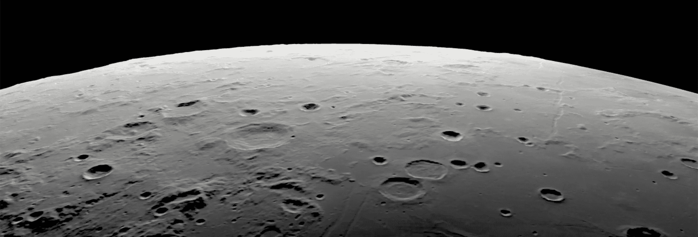

# 月球陨石坑检测：太空中的计算机视觉

> 原文：[`towardsdatascience.com/lunar-crater-detection-computer-vision-in-space-04e1ee416826?source=collection_archive---------2-----------------------#2024-05-06`](https://towardsdatascience.com/lunar-crater-detection-computer-vision-in-space-04e1ee416826?source=collection_archive---------2-----------------------#2024-05-06)

## 向自主陨石坑导航迈出的第一小步

 [Callum Bruce](https://medium.com/@callum.bruce1?source=post_page---byline--04e1ee416826--------------------------------)

·发表于 [Towards Data Science](https://towardsdatascience.com/?source=post_page---byline--04e1ee416826--------------------------------) ·15 分钟阅读·2024 年 5 月 6 日

--

使用 threejs_synthetic_moon 生成的月球表面合成图像，约在阿波罗 11 号着陆点上方 250 公里处

> **还不是 Medium 会员？点击 [**此处**](https://medium.com/towards-data-science/lunar-crater-detection-computer-vision-in-space-04e1ee416826?sk=f28556b494ea3134959b296610478aff) 免费访问此文章**。

本文将为月球轨道上的航天器开发一种基于陨石坑的自主光学导航系统中的陨石坑检测算法（CDA）。自主基于陨石坑的光学导航系统的目标是通过观察天体表面的陨石坑边缘来估计航天器的位置和姿态。

光学导航系统在航天器中的应用已经得到广泛应用[1]。星敏感器，作为一种光学导航仪器，早在 1959 年就已被部署到地球大气层之外[2]。星敏感器通过捕捉周围星空的图像，识别这些图像中的已知恒星，并将这些恒星的位置与天体目录中的恒星进行比较——通过这些数据，可以确定航天器的精确姿态。

目前用于月球轨道航天器的制导、导航和控制（GNC）的地面系统已经超负荷。随着月球轨道上航天器数量的增加，对这些地面系统的需求将继续增长。随着对重返月球的关注度不断提升……
