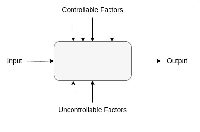

# 机器学习实验做得对

> 原文：[`towardsdatascience.com/machine-learning-experiments-done-right-6ed04f5e959b?source=collection_archive---------8-----------------------#2024-12-02`](https://towardsdatascience.com/machine-learning-experiments-done-right-6ed04f5e959b?source=collection_archive---------8-----------------------#2024-12-02)

## *设计机器学习实验的详细指南，旨在产生可靠、可重复的结果。*

 [Nura Kawa](https://medium.com/@nurakawa?source=post_page---byline--6ed04f5e959b--------------------------------)

·发表于[Towards Data Science](https://towardsdatascience.com/?source=post_page---byline--6ed04f5e959b--------------------------------) ·7 分钟阅读·2024 年 12 月 2 日

--

图片由[Vedrana Filipović](https://unsplash.com/@vedranafilipovic?utm_source=medium&utm_medium=referral)提供，来源于[Unsplash](https://unsplash.com/?utm_source=medium&utm_medium=referral)

机器学习（ML）从业者通过实验来比较不同方法在特定应用和一般问题类型中的有效性。实验结果的有效性取决于从业者如何设计、执行和分析他们的实验。不幸的是，许多机器学习论文缺乏有效的结果。最近的研究[[5](https://www.jmlr.org/papers/volume22/20-303/20-303.pdf)] [[6](https://arxiv.org/pdf/1909.06674)]揭示了已发布实验的可重复性缺失，归因于以下一些做法：

+   *数据污染*：工程训练数据集以包含语义上与测试数据集相似的数据，或直接来自测试数据集

+   *挑选数据*：有选择地挑选实验设置或结果，以有利于展示某种方法

+   *误报*：包括“使用统计学不当分析结果，如没有适当的统计检验却声称结果显著，或使用错误的统计检验[[6](https://www.jmlr.org/papers/volume22/20-303/20-303.pdf)]

这些做法不一定是故意为之——从业者可能面临产生快速结果的压力，或缺乏足够的资源。然而，持续采用不良实验做法必然会导致高昂的后果。那么，我们应该如何进行能够产生可重复且可靠结果的机器学习实验呢？**在本文中，我们提出了设计和执行严谨机器学习实验的指南**。

# 实验：因素与响应函数

实验涉及一个包含输入、过程和输出的系统，如下图所示。以花园为简单例子：球茎是输入，发芽是过程，花朵是输出。在机器学习系统中，数据输入到学习函数中，输出预测。

实践者旨在最大化某个*响应函数*的输出——在我们花园的例子中，这可能是开花的数量，而在机器学习系统中，这通常是模型的准确性。这个响应函数依赖于可控因素和不可控因素。园艺师可以控制土壤质量和日常浇水，但无法控制天气。机器学习实践者可以控制大多数机器学习系统中的参数，如训练过程、参数和预处理步骤，而随机性则来自数据选择。

*实验示意图，基于 [*[*2*](https://www.youtube.com/watch?v=1I4Hudel5mk)*]*

实验的目标是找到最大化响应函数的可控因素的最佳配置，同时最小化不可控因素的影响。**一个设计良好的实验需要两个关键要素：一种系统化的方式来测试不同组合的可控因素，以及一种方法来考虑来自不可控因素的随机性。**

基于这些原则，清晰且有组织的框架对于有效地设计和执行实验至关重要。下面，我们提供了一份清单，指导实践者进行机器学习实验的规划和实施。

# 机器学习实验清单

*规划并执行严格的机器学习实验：*

1.  陈述你的实验*目标*

1.  选择*响应函数*，或你想要测量的内容

1.  决定哪些因素变化，哪些因素保持不变

1.  描述实验的一个*运行*，应定义：

    (a) 实验的单一配置

    (b) 使用的数据集

1.  选择一个*实验设计*，应定义：

    (a) 我们如何探索因素空间，并且

    (b) 我们如何重复测量（交叉验证）

1.  执行实验

1.  分析数据

1.  得出结论和建议

## 1\. 陈述实验目标

目标应明确说明为什么要进行该实验。同样重要的是，**指定一个有意义的效应大小**。例如，如果实验的目标是“确定使用数据增强技术是否能提高模型的准确性”，那么我们必须补充说，“显著改进是大于或等于 5%。”

## 2\. 选择响应函数，或你想要测量的内容

机器学习实验的响应函数通常是相对于学习任务的准确度指标，例如分类准确度、均值平均精度或均方误差。它也可以是可解释性、鲁棒性或复杂性的度量——只要该度量是明确定义的。

## 3\. 决定哪些因素变化，哪些因素保持不变

一个机器学习系统有多个可控因素，如模型设计、数据预处理、训练策略和特征选择。在这一步骤中，我们决定哪些因素保持不变，哪些因素可以在不同实验中变化。例如，如果目标是“确定使用数据增强技术是否能提高我的模型准确性”，我们可以选择变化数据增强策略及其参数，但保持模型在所有实验中相同。

## 4\. 描述实验的单次运行

*实验*是实验的单次实例，其中一个过程应用于一组因素的单一配置。在我们的示例实验中，目标是“确定使用数据增强技术是否能提高我的模型准确性”，单次实验将是：“使用一种数据增强技术在训练数据集上训练模型，并在保留的测试集上测量其准确性。”

在这一步骤中，我们还要选择实验的数据。当选择数据集时，我们必须考虑我们的实验是针对特定领域应用，还是用于通用目的。特定领域的实验通常需要一个能够代表该领域的单一数据集，而旨在展示通用结果的实验则应在多个数据集上评估方法，这些数据集包含多种数据类型 [1]。

在这两种情况下，我们必须具体定义训练集、验证集和测试集。如果我们将一个数据集进行拆分，我们应记录数据拆分。这是避免意外污染的关键步骤！

## 5\. 选择实验设计

实验设计是我们将执行的一系列实验。实验设计描述：

+   将要研究的因素和*水平*（因素的类别或取值）

+   一种随机化方案（交叉验证）

如果我们正在进行一个实验，测试训练数据集大小对最终模型鲁棒性的影响，我们将测试哪个范围的大小？应该达到什么样的粒度？当多个因素变化时，是否有必要测试所有可能的因素/水平配置组合？如果我们计划进行统计检验，遵循特定的实验设计可能会有所帮助，例如因子设计或随机区组设计（更多信息请参见[[3](https://elearning.unite.it/pluginfile.php/221606/mod_resource/content/1/BookDOEwithR.pdf)]）。

交叉验证对于机器学习实验至关重要，因为它减少了因数据集划分方式不同而导致的结果方差。为了确定需要多少个交叉验证样本，我们回到第一步中的目标陈述。如果计划进行统计分析，则需要确保生成足够的数据来进行特定的统计检验。

这一步的最后部分是考虑**资源限制**。每次实验需要多少时间和计算资源？我们是否拥有足够的资源来按设计运行这个实验？也许设计必须进行调整以满足资源限制。

## 6\. 执行实验

为了确保实验顺利进行，必须建立一个严格的系统来组织数据、跟踪实验进程以及分析资源分配。有几个开源工具可以用于此目的（请参见[awesome-ml-experiment-management](https://github.com/awesome-mlops/awesome-ml-experiment-management)）。

## 7\. 分析数据

根据实验的目标和领域，查看交叉验证的平均值（和误差条！）可能足够。然而，验证结果的最佳方法是通过统计假设检验，这能严格证明，基于给定数据获得结果的概率不是偶然的。如果实验的目的是证明因果关系，那么统计检验是必要的。

## 8\. 得出结论

根据前一步的分析，我们现在可以陈述从实验中得出的结论。我们能从结果中得出什么结论吗？还是需要更多的数据？可靠的结论必须由实验结果支持，并且是可重复的。任何不熟悉实验的实践者都应该能够从头到尾运行实验，获得相同的结果，并从这些结果中得出相同的结论。

# 最后的思考

一个机器学习实验有两个关键因素：一种用于测试不同因素组合的系统设计，以及一种控制随机性的交叉验证方案。在实验的规划和执行过程中遵循这篇文章中的机器学习实验检查清单，可以帮助实践者或实践者团队确保实验结果可靠且可重复。

感谢阅读！如果你觉得这篇文章有用，请考虑在[Medium](https://medium.com/@jorisguerin)上关注我，或查看我的[个人网站](https://nurakawa.github.io)。

# 参考文献

[1] Joris Guerin “设计严格的机器学习实验快速指南。” *Towards Data Science.* 在线阅读。

[2] 机器学习实验的设计与分析 — 机器学习 — 2016 年春季 — Kogan 教授。[YouTube 视频](https://www.youtube.com/watch?v=1I4Hudel5mk)。

[3] Lawson, John. *使用 R 进行实验设计与分析*。[在线获取](https://elearning.unite.it/pluginfile.php/221606/mod_resource/content/1/BookDOEwithR.pdf)。

[4] 机器学习中的可疑做法。[ArXiv 预印本](https://arxiv.org/pdf/2407.12220v1)。

[5] 提高机器学习研究的可重复性。*《机器学习研究期刊》*，2022 年。[在线获取](https://www.jmlr.org/papers/volume22/20-303/20-303.pdf)。

[6] 向量化独立可重复的机器学习研究迈出的一步。[ArXiv 预印本](https://arxiv.org/pdf/1909.06674)。
