# 初学者的机器学习操作（MLOps）

> 原文：[`towardsdatascience.com/machine-learning-operations-mlops-for-beginners-a5686bfe02b2?source=collection_archive---------0-----------------------#2024-08-29`](https://towardsdatascience.com/machine-learning-operations-mlops-for-beginners-a5686bfe02b2?source=collection_archive---------0-----------------------#2024-08-29)

## 端到端项目实施

[](https://medium.com/@prasadmahamulkar?source=post_page---byline--a5686bfe02b2--------------------------------)[](https://towardsdatascience.com/?source=post_page---byline--a5686bfe02b2--------------------------------) [Prasad Mahamulkar](https://medium.com/@prasadmahamulkar?source=post_page---byline--a5686bfe02b2--------------------------------)

·发表于 [Towards Data Science](https://towardsdatascience.com/?source=post_page---byline--a5686bfe02b2--------------------------------) ·阅读时间 19 分钟·2024 年 8 月 29 日

--

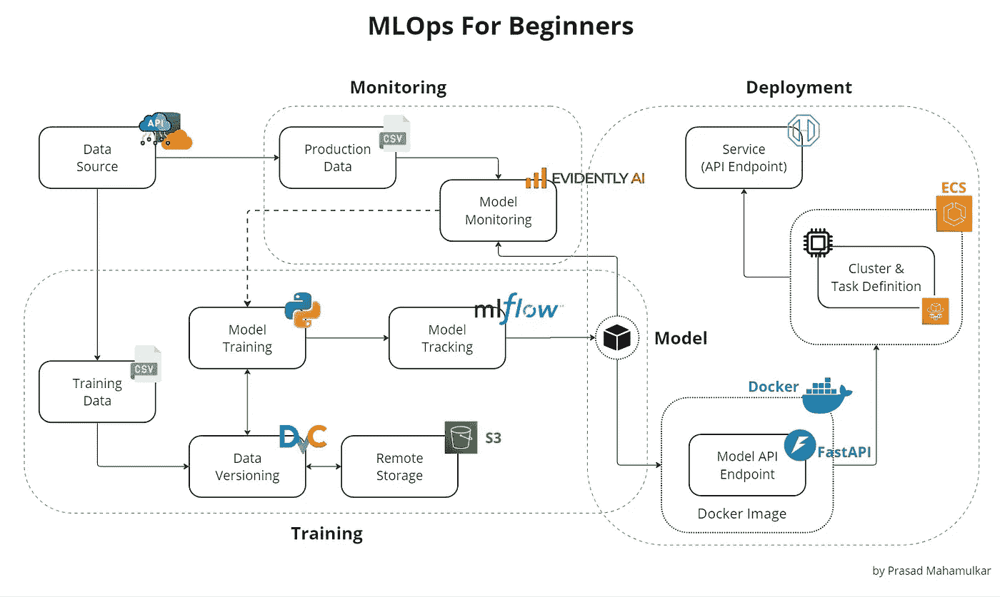

图片由作者创建

在生产中开发、部署和维护机器学习模型可能是具有挑战性和复杂的。这就是机器学习操作（MLOps）发挥作用的地方。MLOps 是一套实践，旨在自动化和简化机器学习（ML）工作流和部署。在本文中，我将通过端到端的项目实施，分享一些基本的 MLOps 实践和工具，帮助你更高效地管理机器学习项目，从开发到生产。

阅读完本文后，你将了解到：

+   如何使用**DVC**进行数据版本控制。

+   如何使用**MLflow**跟踪日志、工件，并注册模型版本。

+   如何使用**FastAPI**、**Docker**和**AWS ECS**部署模型。

+   如何使用**Evidently AI**监控生产中的模型。

本文中使用的所有代码都可以在 [GitHub](https://github.com/prsdm/mlops-project) 上找到。

> 请注意，GIF 示例可能在 Medium 应用中无法完全加载，但在浏览器中应该可以正常显示。

在我们开始之前，让我们首先快速了解一下什么是 MLOps。

# 什么是 MLOps？

MLOps 是一套旨在简化和自动化机器学习（ML）系统生命周期的技术和实践。MLOps 的目标是通过为专业人员和研究人员提供清晰的指南和职责，提升将机器学习模型部署到生产环境中的效率和可靠性。它弥合了机器学习开发和生产之间的鸿沟，确保机器学习模型可以在真实环境中高效地开发、部署、管理和维护。这种方法有助于减少系统设计错误，使得在实际环境中能够做出更强大和准确的预测。

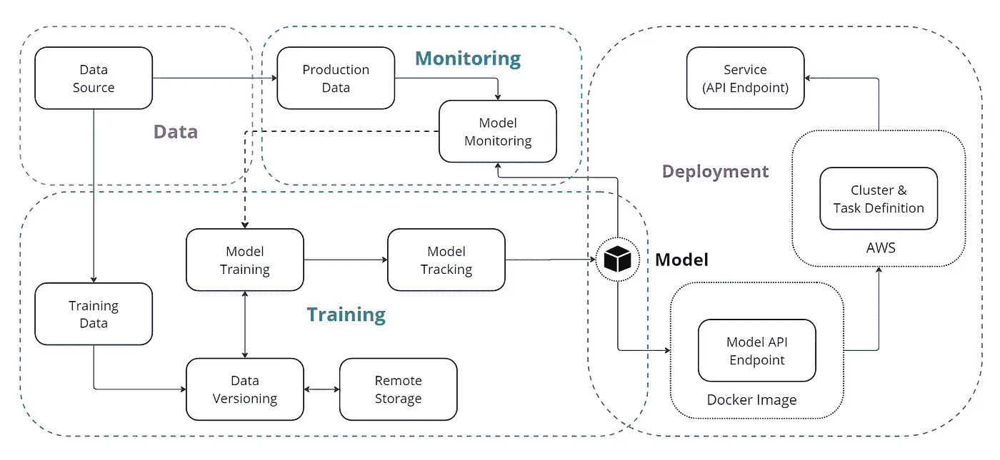

图像由作者创建

**我们为什么需要 MLOps？**

通常，任何机器学习项目从定义业务问题开始。问题定义后，进行数据提取、数据准备、特征工程和模型训练步骤，以开发模型。模型开发完成后，通常会将其存储在某个地方，以便工程和运维团队可以将其部署到生产环境中。

**这种方法有什么问题？**

它在开发和部署阶段之间创造了一个鸿沟，导致低效和潜在的错误。如果数据科学家和工程师之间缺乏合作，模型可能无法针对生产环境进行优化，从而导致性能下降、缺乏可扩展性和维护困难等问题。

MLOps 通过创建一个统一的工作流程，集成开发和运维，解决了这些问题。它确保模型可靠、可扩展，并且更容易维护。这种方法减少了错误的风险，加快了部署速度，并通过持续监控保持模型的有效性和最新性。

现在我们对 MLOps 有了一个基本的了解，接下来进入实现部分。

# 项目设置

机器学习项目需要一个标准的项目结构，以确保项目能够轻松维护和修改。一个良好的项目结构使得团队成员可以轻松且有效地协作。

对于这个项目，我们将使用一个非常基础的结构，帮助我们管理机器学习项目的整个生命周期，包括数据摄取、预处理、模型训练、评估、部署和监控。

首先，从[GitHub](https://github.com/prsdm/mlops-project)克隆 mlops-project 仓库并跟随操作。

```py
#clone repository from github
git clone https://github.com/prsdm/mlops-project.git
```

克隆仓库后，项目结构将如下所示：

```py
.
├── .github                         # DVC metadata and configuration
│   └── workflows                   # GitHub Actions workflows for CI/CD
│       └── docs.yml                
├── data                            # Directory for storing data files
│   ├── train.csv                   
│   └── test.csv                                  
├── docs                            # Project documentation.
│   └── index.md                    
├── models                          # Store trained models 
├── mlruns                          # Directory for MLflow run logs and artifacts
├── steps                           # Source code for data processing and model training
│   ├── __init__.py                
│   ├── ingest.py                   
│   ├── clean.py                    
│   ├── train.py                    
│   └── predict.py                  
├── tests                           # Directory to store tests
│   ├── __init__.py                 
│   ├── test_ingest.py              
│   └── test_clean.py              
├── .gitignore                      # To ignore files that can't commit to Git
├── app.py                          # FastAPI app file
├── config.yml                      # Configuration file
├── data.dvc                        # For tracking data files and their versions
├── dataset.py                      # Script to download or generate data
├── dockerfile                      # Dockerfile for containerizing FastAPI
├── LICENSE                         # License for project
├── main.py                         # To automate model training
├── Makefile                        # To store useful commands to make train or make test 
├── mkdocs.yml                      # Configuration file for MkDocs
├── README.md                       # Project description
├── requirements.txt                # Requirements file for reproducing the environment.
├── samples.json                    # Sample data for testing

'''Extra files for monitoring'''
├── data                           
│   └──production.csv               # data for Monitoring
├── monitor.ipynb                   # Model Monitoring notebook 
├── test_data.html                  # monitoring results for test data  
└── production_data.html            # monitoring results for production data
```

以下是该结构的详细说明：

+   **data**：存储用于模型训练和评估的数据文件。

+   **docs**：包含项目文档。

+   **models**：存储训练好的机器学习模型。

+   **mlruns**：包含 MLflow 生成的日志和工件。

+   **steps**：包括用于数据摄取、清理和模型训练的源代码。

+   **tests**：包括单元测试，以验证代码的功能。

+   **app.py**：包含用于部署模型的 FastAPI 应用代码。

+   **config.yml**：用于存储项目参数和路径的配置文件。

+   **data.dvc**：使用 DVC 跟踪数据文件及其版本。

+   **dataset.py**：用于下载或生成数据的脚本。

+   **dockerfile**：用于构建容器化 FastAPI 应用程序的 Docker 镜像。

+   **main.py**：自动化模型训练过程。

+   **Makefile**：包含用于自动化任务的命令，例如训练或测试。

+   **mkdocs.yml**：用于生成项目文档的 MkDocs 配置文件。

+   **requirements.txt**：包含项目所需的所有包。

+   **samples.json**：包含用于测试的示例数据。

+   **monitor.ipynb**：用于监控模型性能的 Jupyter 笔记本。

+   **production_data.html**和**test_data.html**：存储测试数据和生产数据的监控结果。

这个项目结构旨在组织整个机器学习项目，从开发到监控。

现在，让我们创建一个虚拟环境并使用以下命令激活它：

**对于 bash：**

```py
#create venv
python3 -m venv venv
```

```py
#activate
source venv/bin/activate
```

**对于 cmd：**

```py
#create venv
python -m venv venv
```

```py
#activate
.\venv\Scripts\activate
```

接下来，使用`requirements.txt`文件安装所有必需的包。

```py
#install all the dependancies
pip install -r requirements.txt
```

## 示例：


项目设置示例

设置好环境并安装好依赖项后，我们可以继续进行模型训练部分。

# 模型训练

在模型训练中，第一步是从源头获取数据，这些数据可能存储在本地存储或远程存储中。为此，运行`dataset.py`文件。

```py
#to get data from source
python3 dataset.py
```

这个脚本从源头获取数据，将其分为训练集和测试集，然后将它们存储在`data/`目录中。

## 示例：

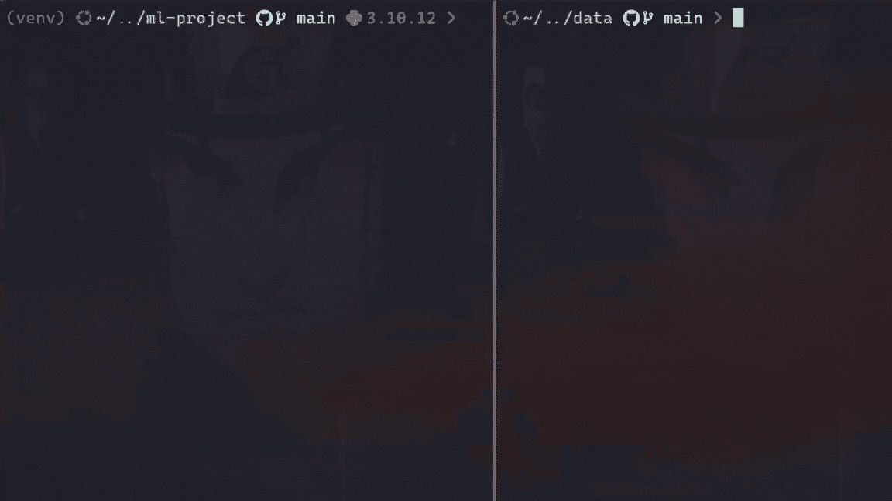

数据提取示例

一旦数据存储在数据目录中，接下来的步骤包括清理、处理和模型训练。`steps/`文件夹包含这些阶段的每个模块。

```py
#model training part from project structure

├── steps/                     
│   ├── ingest.py              
│   ├── clean.py 
│   ├── train.py            
│   └── predict.py
├── main.py                    
├── models/model.pkl
```

让我们看看每个文件的作用：

+   `ingestion.py`负责初步数据摄取，确保数据被正确加载并准备好供下一阶段使用。

+   `clean.py`专注于数据清理任务，如处理缺失值、去除重复项和进行其他数据质量改进。

+   `train.py`负责在清理后的数据上训练模型，并将模型保存为`model.pkl`，存储在`models/`目录中。

+   `predict.py`用于使用训练后的模型评估测试数据上的模型性能。

> **注意：** 这些文件可以根据项目需求进行更改或删除。

为了按顺序运行所有这些步骤，请执行`main.py`文件：

```py
#to train the model
python3 main.py
```

这是这个项目中`main.py`文件的样子：

```py
import logging
from steps.ingest import Ingestion
from steps.clean import Cleaner
from steps.train import Trainer
from steps.predict import Predictor

# Set up logging
logging.basicConfig(level=logging.INFO,format='%(asctime)s:%(levelname)s:%(message)s')

def main():
    # Load data
    ingestion = Ingestion()
    train, test = ingestion.load_data()
    logging.info("Data ingestion completed successfully")

    # Clean data
    cleaner = Cleaner()
    train_data = cleaner.clean_data(train)
    test_data = cleaner.clean_data(test)
    logging.info("Data cleaning completed successfully")

    # Prepare and train model
    trainer = Trainer()
    X_train, y_train = trainer.feature_target_separator(train_data)
    trainer.train_model(X_train, y_train)
    trainer.save_model()
    logging.info("Model training completed successfully")

    # Evaluate model
    predictor = Predictor()
    X_test, y_test = predictor.feature_target_separator(test_data)
    accuracy, class_report, roc_auc_score = predictor.evaluate_model(X_test, y_test)
    logging.info("Model evaluation completed successfully")

    # Print evaluation results
    print("\n============= Model Evaluation Results ==============")
    print(f"Model: {trainer.model_name}")
    print(f"Accuracy Score: {accuracy:.4f}, ROC AUC Score: {roc_auc_score:.4f}")
    print(f"\n{class_report}")
    print("=====================================================\n")

if __name__ == "__main__":
    main()
```

## **示例：**

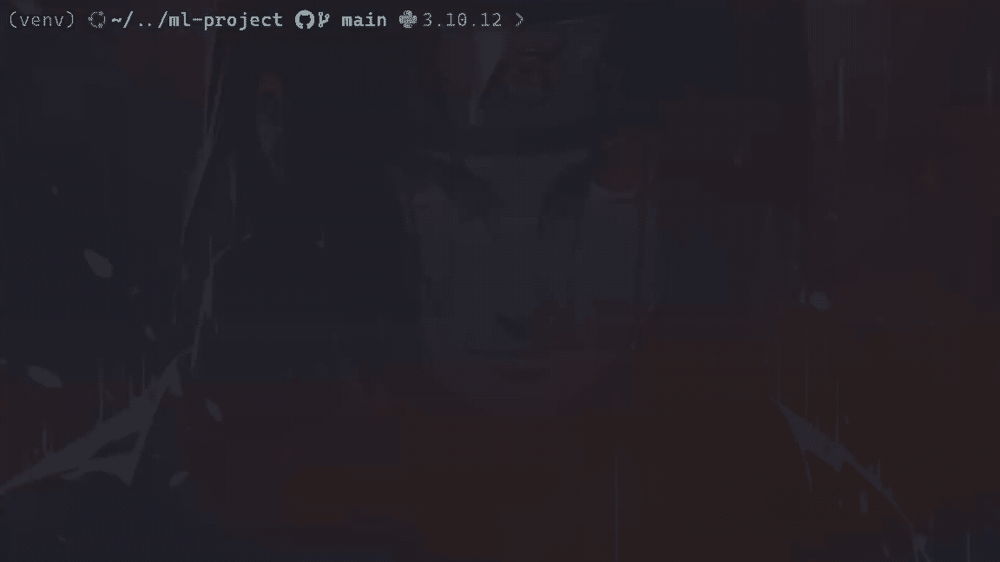

模型训练示例

现在，让我们看看如何使用像 DVC 和 MLflow 这样的工具来改进这个项目。

# 数据版本控制（DVC）

让我们从数据版本控制（DVC）开始，它是一个免费的开源工具，旨在管理大型数据集、自动化机器学习管道并处理实验。它帮助数据科学和机器学习团队更有效地管理数据，确保可重复性，并提高协作。

**为什么使用 DVC 而不是 GitHub？**

Git 在源代码和文本文件的版本控制方面表现出色，但在处理大型二进制文件（如数据集）时存在局限性。Git 无法对二进制文件的版本进行有意义的比较；它仅存储新版本，而不显示详细差异，这使得随着时间推移跟踪更改变得具有挑战性。此外，将大型数据集或敏感数据存储在 GitHub 中并不理想，因为这可能导致代码库膨胀，并带来潜在的安全风险。

DVC 通过元数据和外部存储（如 S3、Google Cloud Storage 或 Azure Blob Storage）管理大文件，同时保持对数据更改和版本历史的详细跟踪，从而解决了这些问题。DVC 使用人类可读的元文件来定义数据版本，并与 Git 或任何源代码管理（SCM）工具集成，以便对整个项目（包括数据资产）进行版本控制和共享。此外，它通过控制项目组件的访问权限并与指定的团队和个人共享，提供了安全的协作方式。

要开始使用 DVC，首先安装它（如果尚未安装）：

```py
#install DVC via pip
pip install dvc
```

然后，初始化 DVC：

```py
#initialize a DVC
dvc init
```

这将设置必要的 DVC 配置文件。

现在，将数据文件添加到 DVC：

```py
#add data
dvc add data
```

这通过 DVC 跟踪数据文件，并将实际数据存储在外部存储中。

配置远程存储：

```py
#add remote storage configuration
dvc remote add -d <remote_name> <remote_storage_path>
```

将`<remote_name>`替换为远程存储的名称，将`<remote_storage_path>`替换为远程存储的路径（例如：s3://mybucket/mydata）。

将数据推送到远程存储：

```py
#commit the DVC configuration changes to Git
git commit .dvc/config -m 'config dvc store'
```

```py
#upload data to the configured remote storage
dvc push
```

这将数据上传到配置的远程存储。

将所有已提交的更改推送到 git：

```py
#push all committed changes to the Git repository
git push origin main
```

## 示例：

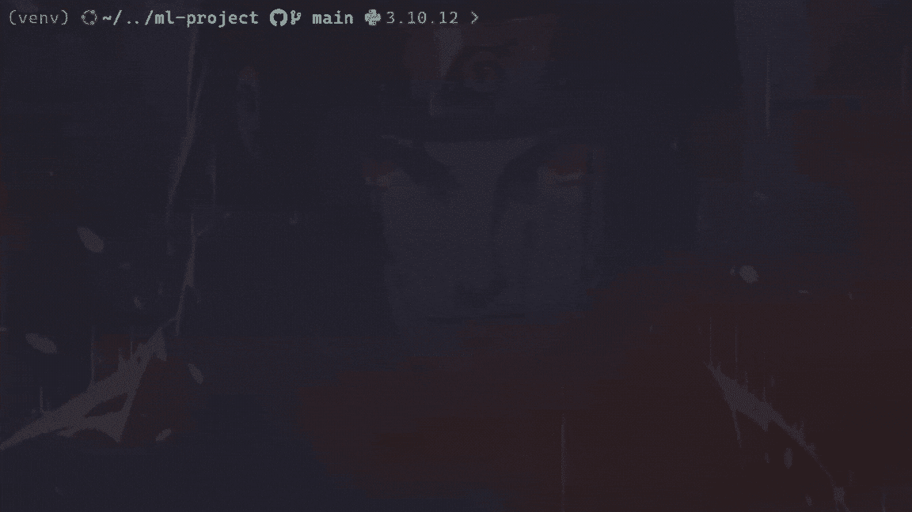

DVC push 示例

要从远程存储拉取最新的数据版本到本地目录，请使用以下命令：

```py
#pull the latest version of the data
dvc pull
```

## 示例：


DVC pull 示例

通过集成 DVC，我们可以高效地管理大型数据集，同时保持 Git 仓库专注于源代码。

> **注意：** 我们可以像数据文件一样使用 DVC 对模型进行版本控制。

# MLflow

在使用 DVC 对数据进行版本控制之后，维护模型训练、版本变化和参数配置的清晰记录至关重要，即使我们并不主动进行多个模型的实验。

如果没有系统地进行跟踪，可能会出现几个问题：

1.  **版本详细信息丢失**：如果没有跟踪每个模型版本使用的参数和代码更改，就很难重现或在过去的工作基础上进行改进。这可能会减缓进度并导致重复的错误。

1.  **版本比较的难度**：持续记录每个模型的表现有助于比较不同版本。没有这个，很难看出一个模型是否在进步。

1.  **协作挑战**：在团队中，如果没有明确的方式来管理模型版本，可能会导致混乱和不小心覆盖彼此的工作，从而使协作过程更加复杂。

这就是 MLflow 发挥作用的地方。MLflow 不仅仅用于实验，它在跟踪机器学习模型的生命周期中也扮演着至关重要的角色。它记录指标、工件和参数，确保每次版本更改都有文档记录，并且容易检索。通过 MLflow，我们可以监控每次运行，并比较不同的版本。这样最有效的模型始终可以被识别并准备好进行部署。

若要集成 MLflow，首先安装 MLflow（如果尚未安装）：

```py
#install mlfow
pip install mlflow
```

然后更新`main.py`文件以包含参数、指标和模型的日志记录。代码大致如下：

```py
import logging
import yaml
import mlflow
import mlflow.sklearn
from steps.ingest import Ingestion
from steps.clean import Cleaner
from steps.train import Trainer
from steps.predict import Predictor
from sklearn.metrics import classification_report

# Set up logging
logging.basicConfig(level=logging.INFO,format='%(asctime)s:%(levelname)s:%(message)s')

def main():

    with open('config.yml', 'r') as file:
        config = yaml.safe_load(file)

    mlflow.set_experiment("Model Training Experiment")

    with mlflow.start_run() as run:
        # Load data
        ingestion = Ingestion()
        train, test = ingestion.load_data()
        logging.info("Data ingestion completed successfully")

        # Clean data
        cleaner = Cleaner()
        train_data = cleaner.clean_data(train)
        test_data = cleaner.clean_data(test)
        logging.info("Data cleaning completed successfully")

        # Prepare and train model
        trainer = Trainer()
        X_train, y_train = trainer.feature_target_separator(train_data)
        trainer.train_model(X_train, y_train)
        trainer.save_model()
        logging.info("Model training completed successfully")

        # Evaluate model
        predictor = Predictor()
        X_test, y_test = predictor.feature_target_separator(test_data)
        accuracy, class_report, roc_auc_score = predictor.evaluate_model(X_test, y_test)
        report = classification_report(y_test, trainer.pipeline.predict(X_test), output_dict=True)
        logging.info("Model evaluation completed successfully")

        # Tags 
        mlflow.set_tag('Model developer', 'prsdm')
        mlflow.set_tag('preprocessing', 'OneHotEncoder, Standard Scaler, and MinMax Scaler')

        # Log metrics
        model_params = config['model']['params']
        mlflow.log_params(model_params)
        mlflow.log_metric("accuracy", accuracy)
        mlflow.log_metric("roc", roc_auc_score)
        mlflow.log_metric('precision', report['weighted avg']['precision'])
        mlflow.log_metric('recall', report['weighted avg']['recall'])
        mlflow.sklearn.log_model(trainer.pipeline, "model")

        # Register the model
        model_name = "insurance_model" 
        model_uri = f"runs:/{run.info.run_id}/model"
        mlflow.register_model(model_uri, model_name)

        logging.info("MLflow tracking completed successfully")

        # Print evaluation results
        print("\n============= Model Evaluation Results ==============")
        print(f"Model: {trainer.model_name}")
        print(f"Accuracy Score: {accuracy:.4f}, ROC AUC Score: {roc_auc_score:.4f}")
        print(f"\n{class_report}")
        print("=====================================================\n")

if __name__ == "__main__":
    main()
```

接下来，运行`main.py`脚本，并使用以下命令查看实验详情：

```py
#to launch MLflow UI
mlflow ui
```

在浏览器中打开提供的 URL `http://127.0.0.1:5000`，探索并比较记录的参数、指标和模型。

## 示例：

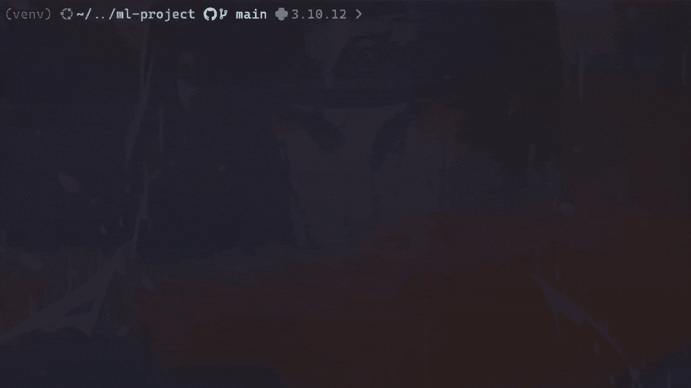

MLflow 跟踪示例

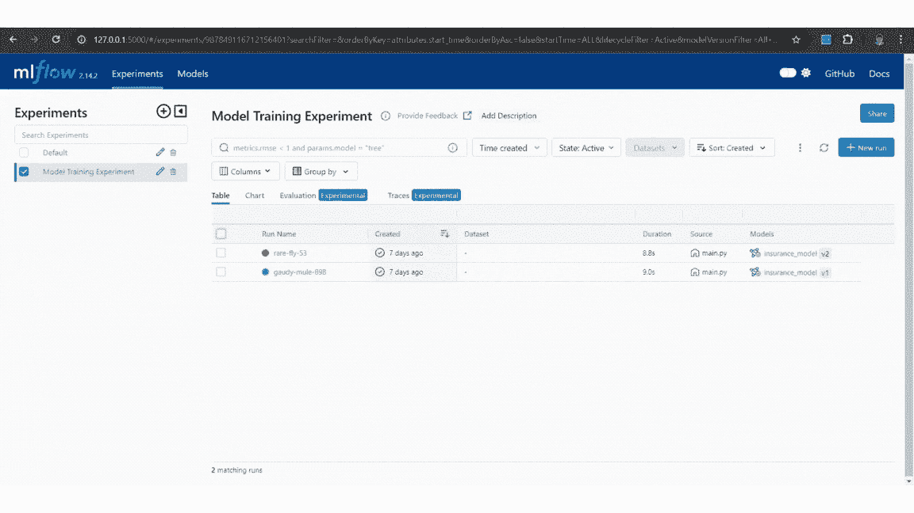

MLflow 模型比较示例

通过使用 MLflow，我们可以轻松地跟踪模型版本并管理变更，确保可重复性并能够选择最有效的模型进行部署。

在进入部署部分之前，先看看项目中存在的`Makefile`和`config.yml`文件。这些文件有助于简化工作流程，并确保项目设置和配置的一致性。

# Makefile

使用`make`文件对于管理 Python 项目非常有帮助。许多数据科学家和机器学习工程师可能没有意识到这一点，但`make`可以自动化例行任务，如设置环境、安装依赖项、模型训练、运行测试和清理文件，这样可以节省时间并减少错误。`make`文件在软件开发中被广泛使用，因为它帮助管理那些难以记住的长命令和复杂命令。

本项目中的`make`文件大致如下：

**bash:**

```py
python = venv/bin/python
pip = venv/bin/pip

setup:
 python3 -m venv venv
 $(python) -m pip install --upgrade pip
 $(pip) install -r requirements.txt

run:
 $(python) main.py

mlflow:
 venv/bin/mlflow ui

test:
 $(python) -m pytest

clean:
 rm -rf steps/__pycache__
 rm -rf __pycache__
 rm -rf .pytest_cache
 rm -rf tests/__pycache__

remove:
 rm -rf venv
```

对于 Windows（**cmd**），文件需要稍作修改。

```py
python = venv/Scripts/python
pip = venv/Scripts/pip

setup:
 python -m venv venv
 $(python) -m pip install --upgrade pip
 $(pip) install -r requirements.txt

run:
 $(python) main.py

mlflow:
 venv/Scripts/mlflow ui

test:
 $(python) -m pytest

clean:
 @if exist steps\__pycache__ (rmdir /s /q steps\__pycache__)
 @if exist __pycache__ (rmdir /s /q __pycache__)
 @if exist .pytest_cache (rmdir /s /q .pytest_cache)
 @if exist tests\__pycache__ (rmdir /s /q tests\__pycache__)

remove:
 @if exist venv (rmdir /s /q venv)
```

下面是每个部分的简要说明：

+   **make setup**：创建虚拟环境（`venv`），升级`pip`，并从`requirements.txt`安装所需的软件包。这样可以确保在不同环境中始终如一地安装所有依赖项。

+   **make run**：使用虚拟环境中的 Python 解释器执行`main.py`。

+   **make mlflow**：启动`mlflow ui`，用于跟踪实验和模型指标。

+   **make test**: 该命令使用`pytest`运行项目中定义的所有测试用例。

+   **make clean**: 删除缓存文件，如 `__pycache__`、`.pytest_cache` 和其他临时文件，以保持目录的清洁。

+   **make remove**: 完全删除项目中的虚拟环境（`venv`）。

运行 make 文件的示例命令：

```py
# For example, to set up the environment
make setup

# OR To run the main script
make run

# OR To run the tests
make test

# so on...
```

## 示例：


Make 命令示例

通过使用 `make` 文件，我们可以自动化并简化各种任务，确保一致性并减少在不同环境中的人为错误。

# Config.yml

YAML 文件是存储和管理机器学习模型配置设置的好方法。它们有助于管理数据/模型路径、模型参数和其他配置，使得实验不同配置和保持代码复用变得更加容易。

`Config.yml` 文件如下所示：

```py
data: 
  train_path: data/train.csv
  test_path: data/test.csv

train:
  test_size: 0.2
  random_state: 42
  shuffle: true

model:
  name: DecisionTreeClassifier
  params:
    criterion: entropy
    max_depth: null
  store_path: models/

  # name: GradientBoostingClassifier
  # params:
  #   max_depth: null
  #   n_estimators: 10
  # store_path: models/

  # name: RandomForestClassifier
  # params:
  #   n_estimators: 50
  #   max_depth: 10
  #   random_state: 42
  # store_path: models/
```

下面是每个部分的作用：

+   **data**: 指定了训练集、测试集和生产集（最新数据集）的路径。这样可以确保数据位置在一个地方进行管理，并且可以轻松更新。

+   **train**: 包含了将数据分割为训练集和测试集的参数，如 `test_size`、`random_state` 以及是否 `shuffle` 数据。这些设置有助于保持数据分割的一致性和可复现性。

+   **model**: 定义了模型名称、其参数以及存储训练模型的位置。此配置使得不同模型之间的切换变得容易，从而提供了模型选择的灵活性。

使用 `config.yml` 文件简化了模型参数和路径的管理。它允许轻松实验不同的配置和模型，通过保持参数设置一致性来提高可复现性，并通过将配置与代码逻辑分离来帮助保持代码清晰。

## 示例：

在以下示例中，`model` 被更改为**‘**GradientBoostingClassifier**’**，这是根据 `config.yml` 文件中指定的配置进行的。


config.yml 文件示例

现在，让我们进入部署部分，在这里我们将使用 FastAPI、Docker 和 AWS ECS。此设置将帮助我们创建一个可扩展且易于管理的应用程序，用于服务机器学习模型。

# FastAPI

FastAPI 是一个现代化的框架，用于构建 Python API。由于其速度和简洁性，它在为机器学习模型提供服务时非常高效。

首先，安装 FastAPI 和 Uvicorn（如果尚未安装）：

```py
#install fastapi and uvicorn
pip install fastapi uvicorn
```

在 `app.py` 文件中定义 FastAPI 应用程序和用于服务模型的端点。

```py
from fastapi import FastAPI
from pydantic import BaseModel
import pandas as pd
import joblib

app = FastAPI()

class InputData(BaseModel):
    Gender: str
    Age: int
    HasDrivingLicense: int
    RegionID: float
    Switch: int
    PastAccident: str
    AnnualPremium: float

model = joblib.load('models/model.pkl')

@app.get("/")
async def read_root():
    return {"health_check": "OK", "model_version": 1}

@app.post("/predict")
async def predict(input_data: InputData):

        df = pd.DataFrame([input_data.model_dump().values()], 
                          columns=input_data.model_dump().keys())
        pred = model.predict(df)
        return {"predicted_class": int(pred[0])}
```

然后，使用以下命令在本地测试 FastAPI 服务器：[`127.0.0.1:8000/docs`](http://127.0.0.1:8000/docs)。

```py
#run the FastAPI app
uvicorn app:app --reload
```

## 示例：

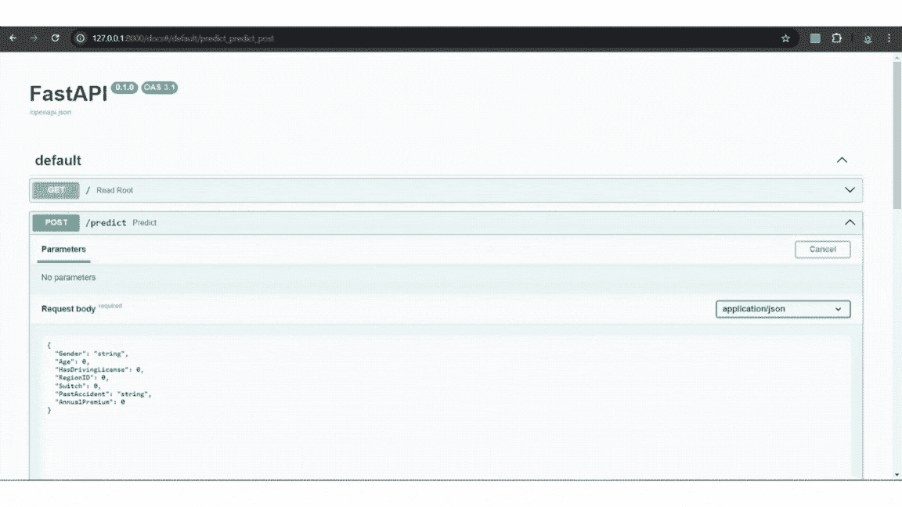

FastAPI 示例

现在让我们使用 Docker 容器化这个 API。

# Docker

Docker 是一个开源平台，通过将软件应用程序打包成容器，简化了其部署过程。这些容器充当轻量级、可移植的单元，包含运行应用程序所需的所有内容，可以在不同环境中运行应用程序。

**为什么使用容器？**

容器提供了一种简化的方式来隔离和部署应用程序，确保它们在各种环境中始终如一地运行，无论是在开发者的笔记本电脑上，还是在云端。通过这种隔离性，容器增强了可移植性和资源效率，使 Docker 成为现代软件开发的必备工具。

要安装 Docker，请按照 Docker [官方网站](https://docs.docker.com/engine/install/)上的说明进行操作。

现在，在项目目录中创建一个 `Dockerfile` 来构建 Docker 镜像：

```py
#official Python 3.10 image
FROM python:3.10

#set the working directory 
WORKDIR /app

#add app.py and models directory
COPY app.py .
COPY models/ ./models/

# add requirements file
COPY requirements.txt .

# install python libraries
RUN pip install --no-cache-dir -r requirements.txt

# specify default commands
CMD ["uvicorn", "app:app", "--host", "0.0.0.0", "--port", "80"]
```

现在，使用以下命令构建 Docker 镜像：

```py
# To build docker image
docker build -t <image_name> <path_to_dockerfile>
```

## 示例：


Docker build 示例

最后，运行 Docker 容器以测试 API，访问 `[`localhost:80/predict`](http://localhost:8000/predict)`：

```py
# To run docker container
docker run -d -p 80:80 <image_name>
```

## 示例：


Docker 运行示例

要停止运行中的 Docker 容器，请使用以下命令查找正在运行的容器的 ID 或名称：

```py
# To show running containers
docker ps
```

一旦识别出容器的 ID 或名称，就可以使用以下命令停止该容器：

```py
# To stop the container
docker stop <container_id_or_name>
```

## 示例：


停止运行中的容器示例

现在，按照以下步骤将 Docker 镜像推送到 Docker Hub：

列出系统中所有 Docker 镜像及其标签，并找到正确的镜像进行推送：

```py
# List images by name and tag.
docker image ls
```

使用所需的仓库和名称标记镜像：

```py
# Tag the image
docker tag <image_name> <dockerhub_username>/<docker-repo-name>
```

使用以下命令将标记的镜像上传到 Docker Hub：

```py
# Push the Docker image 
docker push <dockerhub_username>/<docker-repo-name>:latest
```

此命令将把镜像上传到指定的 [Docker Hub](https://hub.docker.com/r/prsdm17/ml-fastapi) 仓库。

## 示例：


Docker Push 命令示例

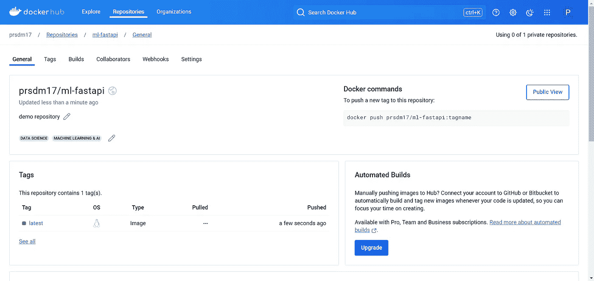

Docker Hub 仓库示例

现在，我们已经将 Docker 镜像推送到 [Docker Hub](https://hub.docker.com/r/prsdm17/ml-fastapi)，可以继续在 AWS 弹性容器服务（ECS）上进行部署。

# AWS ECS

AWS ECS 是一个完全托管的容器编排服务，允许在 AWS 上轻松运行和扩展 Docker 容器。它支持 EC2 和 Fargate 启动类型。以下是一步一步的指南：

**首先，创建一个 ECS 集群：**

+   **步骤 1：** 登录到 [AWS](https://aws.amazon.com/console/) 账户，然后进入 ECS 服务，选择“创建集群”来创建一个新的 ECS 集群。

+   **步骤 2：** 给集群命名，选择 AWS Fargate（无服务器），然后点击“创建”。（这将需要几分钟时间。）

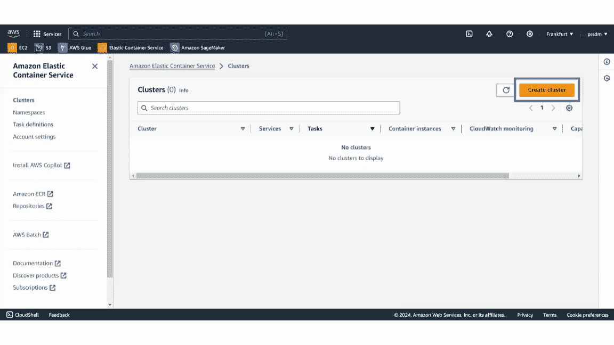

AWS 集群示例

**接下来，定义任务定义：**

+   **步骤 1：** 在 ECS 控制台中，进入“任务定义”并创建一个新的任务定义。

+   **步骤 2：** 给任务命名，并配置内存和 CPU 等要求。

+   **步骤 3：** 在容器定义中填写来自 Docker Hub 的 Docker 镜像 URL，并保持容器端口映射为默认值。点击“创建”。

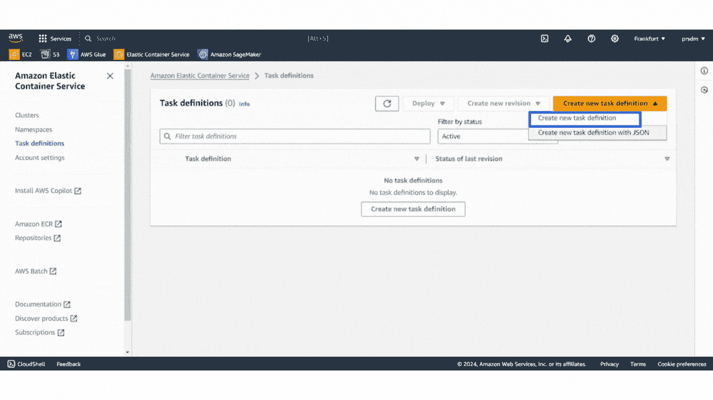

任务定义示例

**之后，添加一个安全组：**

+   **步骤 1：** 前往 EC2，在网络与安全中选择安全组并点击“创建安全组”。为其命名并填写描述。

+   **步骤 2：** 在入站规则中，首先选择 HTTP 类型并设置来源为 Anywhere-IPv4，然后对 Anywhere-IPv6 做相同的设置。点击“创建安全组”。

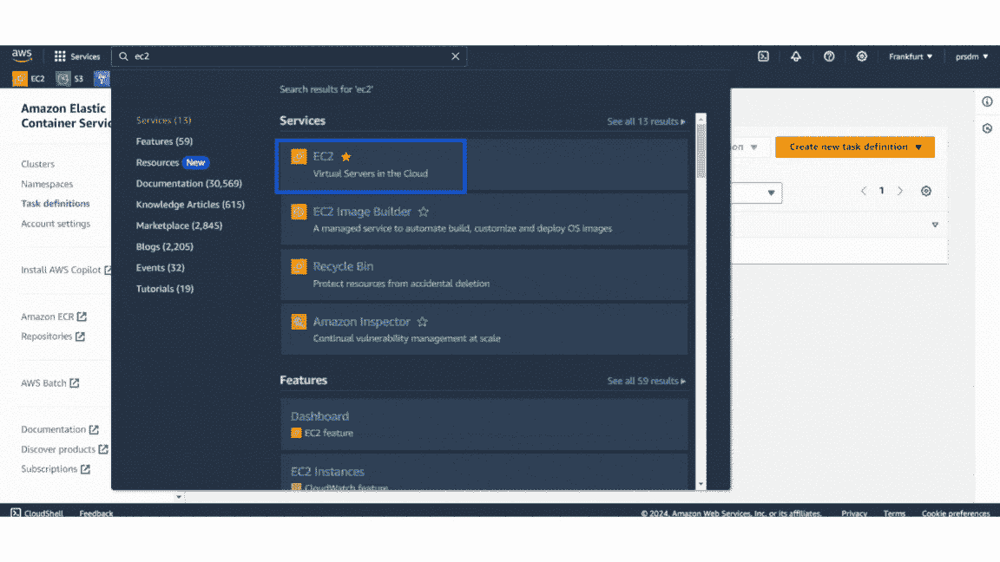

AWS 安全组示例

**然后，创建服务：**

+   **步骤 1：** 前往已创建的 ECS 集群并添加一个新服务。

+   **步骤 2：** 选择“启动类型”计算选项并选择“Fargate”启动类型。然后选择已创建的任务定义，并在部署配置中输入服务名称。

+   **步骤 3：** 最后，在网络设置下选择之前创建的安全组，然后点击“创建”。（创建服务大约需要 5-8 分钟。）

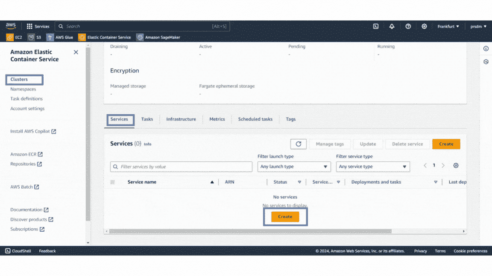

服务示例

**最后，访问正在运行的服务：**

服务部署完成后，进入 ECS 集群的“服务”选项卡。找到该服务，进入“任务”选项卡，选择一个正在运行的任务。打开该任务的公共 IP 地址，即可访问 FastAPI 应用。它会显示如下内容：

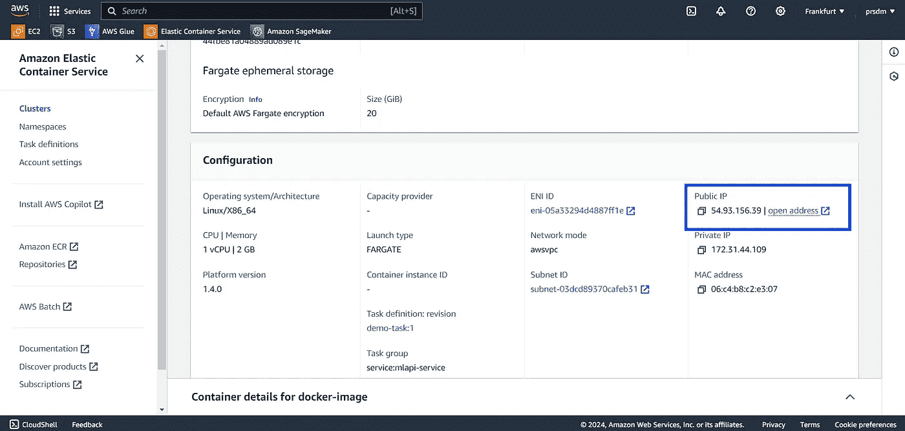

公共 IP 示例

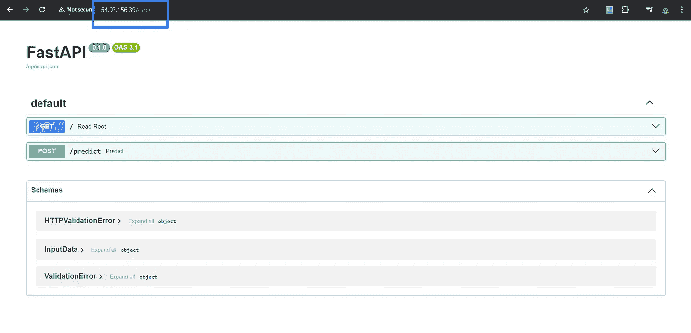

部署的服务示例

通过执行这些步骤，我们可以将 FastAPI 应用部署到 Docker 容器中，并在 AWS ECS 上运行。这为机器学习模型提供了一个可扩展和可管理的环境。

> **注意：** 如果需要，我们还可以添加弹性负载均衡（ELB）。

模型成功部署后，下一步是持续监控生产环境中的模型，以确保其在生产数据上表现良好。模型监控涉及评估多个因素，如服务器指标（例如 CPU 使用率、内存消耗、延迟）、数据质量、数据漂移、目标漂移、概念漂移、性能指标等。

为了保持对初学者友好，我们将重点介绍一些方法，例如数据漂移、目标漂移和使用 Evidently AI 进行数据质量监控。

# Evidently AI

Evidently AI 是一个很好的工具，用于监控模型性能、检测数据漂移和数据质量随时间的变化。它有助于确保模型在新数据输入时依然准确可靠。Evidently AI 提供了模型性能变化的详细洞察，并识别数据分布的任何显著变化，这对于在生产环境中维持模型的准确性至关重要。

要安装 Evidently AI，请使用以下命令：

```py
#to install
pip install evidently

#or
pip install evidently @ git+https://github.com/evidentlyai/evidently.git
```

接下来，运行 `monitor.ipynb` 文件以检测数据质量、数据漂移和目标漂移。该文件大致如下：

```py
# If this .py file doesn't work, then use a notebook to run it.
import joblib
import pandas as pd
from steps.clean import Cleaner
from evidently.report import Report
from evidently.metric_preset import DataDriftPreset, DataQualityPreset, TargetDriftPreset
from evidently import ColumnMapping
import warnings
warnings.filterwarnings("ignore")

# # import mlflow model version 1
# import mlflow
# logged_model = 'runs:/47b6b506fd2849429ee13576aef4a852/model'
# model = mlflow.pyfunc.load_model(logged_model)

# # OR import from models/
model = joblib.load('models/model.pkl')

# Loading data
reference = pd.read_csv("data/train.csv")
current = pd.read_csv("data/test.csv")
production = pd.read_csv("data/production.csv")

# Clean data
cleaner = Cleaner()
reference = cleaner.clean_data(reference)
reference['prediction'] = model.predict(reference.iloc[:, :-1])

current = cleaner.clean_data(current)
current['prediction'] = model.predict(current.iloc[:, :-1])

production = cleaner.clean_data(production)
production['prediction'] = model.predict(production.iloc[:, :-1])

# Apply column mapping
target = 'Result'
prediction = 'prediction'
numerical_features = ['Age', 'AnnualPremium', 'HasDrivingLicense', 'RegionID', 'Switch']
categorical_features = ['Gender','PastAccident']
column_mapping = ColumnMapping()

column_mapping.target = target
column_mapping.prediction = prediction
column_mapping.numerical_features = numerical_features
column_mapping.categorical_features = categorical_features

# Data drift detaction part
data_drift_report = Report(metrics=[
    DataDriftPreset(),
    DataQualityPreset(),
    TargetDriftPreset()
])
data_drift_report.run(reference_data=reference, current_data=current, column_mapping=column_mapping)
data_drift_report
# data_drift_report.json()
data_drift_report.save_html("test_drift.html")
```

## 测试数据示例：

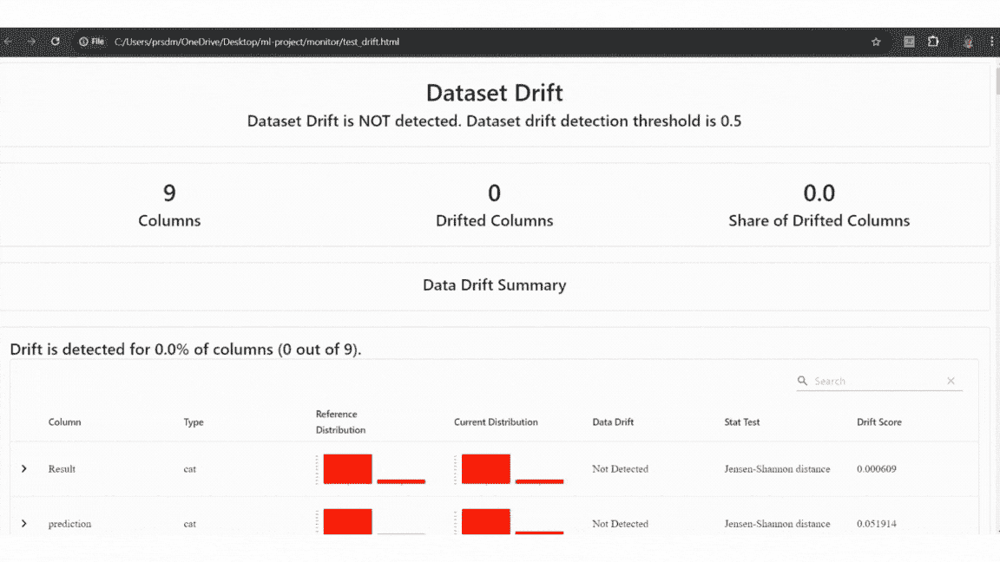

测试数据质量和漂移检测示例

## 生产数据示例：

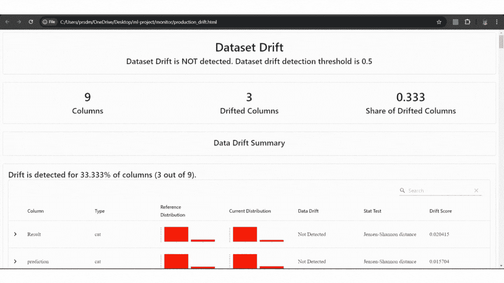

生产数据质量和漂移检测示例

定期运行监控脚本，处理进入的数据，生成关于数据漂移和模型性能的报告。这些报告可以帮助我们识别何时需要重新训练，并确保我们的模型随着时间推移保持准确和可靠。

在这一步中，我们成功完成了 MLOps 项目的实施。

# 总结

在本文中，我们通过一个实践项目介绍了基本的 MLOps 实践和工具。我们使用 DVC 对数据进行了版本控制，利用 MLflow 跟踪和注册了模型，并通过 FastAPI、Docker 和 AWS ECR 部署了模型。我们还通过 Evidently AI 设置了模型监控（数据质量、数据漂移和目标漂移）。这些步骤为使用 MLOps 工具和实践从开发到生产管理机器学习项目提供了坚实的基础。随着你对这些工具和技术的熟悉，你可以探索更高级的自动化和编排方法，以增强你的 MLOps 工作流。

# 参考文献

1.  机器学习操作（MLOps）：概述、定义和架构。([`arxiv.org/pdf/2205.02302`](https://arxiv.org/pdf/2205.02302))

1.  数据版本控制（DVC）：[`dvc.org/doc`](https://dvc.org/doc)

1.  MLflow: [`mlflow.org/docs/latest/index.html`](https://mlflow.org/docs/latest/index.html)

1.  FastAPI: [`fastapi.tiangolo.com/tutorial/`](https://fastapi.tiangolo.com/tutorial/)

1.  Docker: [`docs.docker.com/`](https://docs.docker.com/)

1.  Evidently AI: [`docs.evidentlyai.com/tutorials-and-examples/examples`](https://docs.evidentlyai.com/tutorials-and-examples/examples)

免费订阅，以便在我发布新文章时收到通知。

[](https://medium.com/@prasadmahamulkar/subscribe?source=post_page-----a5686bfe02b2--------------------------------) [## 每当 Prasad Mahamulkar 发布时，获取电子邮件

### 每当 Prasad Mahamulkar 发布时，获取电子邮件，了解数据科学、机器学习等内容。通过注册…

medium.com](https://medium.com/@prasadmahamulkar/subscribe?source=post_page-----a5686bfe02b2--------------------------------)

你也可以在 [LinkedIn](https://www.linkedin.com/in/prasad-mahamulkar/) 和 [Twitter](https://x.com/prsdm_) 上找到我！
