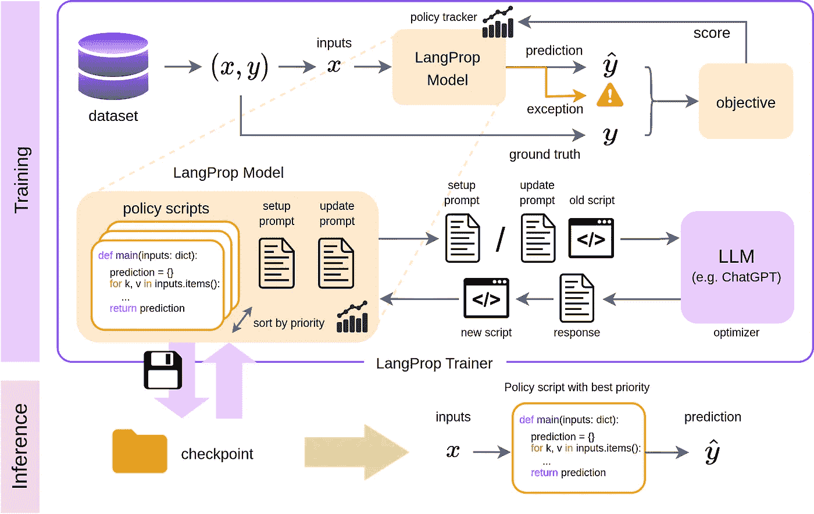
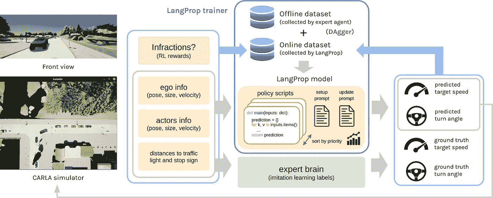

# 使用 LangProp 让 LLM 写出越来越好的自动驾驶代码

> 原文：[`towardsdatascience.com/making-llms-write-better-and-better-code-for-self-driving-using-langprop-99c6c3dc9508?source=collection_archive---------4-----------------------#2024-06-25`](https://towardsdatascience.com/making-llms-write-better-and-better-code-for-self-driving-using-langprop-99c6c3dc9508?source=collection_archive---------4-----------------------#2024-06-25)

## 来自经典机器学习的类比：LLM（大语言模型）= 优化器；代码 = 参数；LangProp = PyTorch Lightning

[](https://alacreme.medium.com/?source=post_page---byline--99c6c3dc9508--------------------------------)[](https://towardsdatascience.com/?source=post_page---byline--99c6c3dc9508--------------------------------) [Shu Ishida](https://alacreme.medium.com/?source=post_page---byline--99c6c3dc9508--------------------------------)

·发表于[Towards Data Science](https://towardsdatascience.com/?source=post_page---byline--99c6c3dc9508--------------------------------) ·阅读时间：9 分钟·2024 年 6 月 25 日

--

你可能已经使用 ChatGPT 来写电子邮件、总结文档、查找信息，或帮助调试代码。但我们能否更进一步，让 ChatGPT 来开车呢？

这是我在去年 3 月开始在[Wayve](https://wayve.ai/)实习时想要回答的问题。Wayve 是位于伦敦的自动驾驶创业公司，致力于将端到端学习应用于城市驾驶这一挑战性问题。当时，公司正要成立其 LLM 研究团队，并成功开发了[LINGO-1](https://wayve.ai/thinking/lingo-natural-language-autonomous-driving/?doing_wp_cron=1718832390.6593759059906005859375)和[LINGO-2](https://wayve.ai/thinking/lingo-2-driving-with-language/)。[AutoGPT](https://github.com/Significant-Gravitas/AutoGPT)刚刚发布，[Voyager](https://github.com/MineDojo/Voyager)还没有发布。而 LLM 带来的变革已显而易见。问题是，如何将这项新技术应用于驾驶这一领域——一个语言不是主要模态的领域？

在这篇博客文章中，我想概述一下我们在上个月（2024 年 5 月）在 ICLR（国际学习表示会议）上的 LLM 代理研讨会中展示的论文[**LangProp**](https://arxiv.org/abs/2401.10314)。

[](https://github.com/shuishida/LangProp?source=post_page-----99c6c3dc9508--------------------------------) [## GitHub - shuishida/LangProp

### 通过在 GitHub 上创建账户，参与 shuishida/LangProp 的开发。

[github.com](https://github.com/shuishida/LangProp?source=post_page-----99c6c3dc9508--------------------------------) [](https://arxiv.org/abs/2401.10314?source=post_page-----99c6c3dc9508--------------------------------) [## LangProp：一个使用大型语言模型应用于驾驶的代码优化框架

### 我们提出了 LangProp，一个框架，用于迭代优化由大型语言模型（LLM）生成的代码，涵盖…

[arxiv.org](https://arxiv.org/abs/2401.10314?source=post_page-----99c6c3dc9508--------------------------------)

# 动机：让我们将机器学习应用到代码编写中，字面意义上。

将 LLM 应用于驾驶的挑战有两方面：首先，正如名字所示，LLM 是非常庞大的模型，需要大量计算资源，运行速度较慢，这使得它们不太适合用于安全关键的实时应用，例如自动驾驶；其次，虽然语言在高层次的描述中很有用，是逻辑、推理和规划的复杂工具，但它缺乏描述观察结果和给出空间控制动作所需的细节和粒度。

然而，我们意识到，我们不一定非得使用 LLM 来推断驾驶动作。我们可以做的是让 LLM 编写驾驶的代码。

如果你曾经使用 ChatGPT 编写过代码，那么这听起来可能是个糟糕的主意。它编写的代码很少能直接使用，并且经常包含一些错误。但如果我们让 LLM 也检测错误并自动修复它们，从而迭代改进代码质量，会怎样呢？

我们将这个想法更进一步——不仅仅是修复错误，我们设计了一个训练框架，让我们能够根据你选择的目标函数改进大语言模型（LLM）生成的代码。你可以“训练”你的代码，通过训练数据集的优化来尝试减少损失。代码的改进可以通过在验证数据集上运行来量化。

这开始听起来像是机器学习了吗？因为它本质上就是！但我们在微调 LLM 吗？不——事实上，并没有神经网络正在进行微调。相反，我们是在微调代码本身！

在 LangProp 中，“代码”是模型的*参数*，而 LLM 是*优化器*，引导*参数*朝着减少损失的方向改进。这为什么酷呢？因为通过应用这种思维，我们现在可以以数据驱动的方式自动优化软件本身！通过深度学习，我们见证了数据驱动方法解决难以描述问题的强大能力。但到目前为止，机器学习的应用领域仅限于通过数值值参数化的模型。现在，它们也能够处理通过代码描述的系统了。

如果您关注过人工智能的历史，这是一种优雅的方式，将曾经流行的符号人工智能方法与更现代、更成功的机器学习方法统一起来。符号人工智能的核心是让人类专家用逻辑和代码描述一个完美的世界模型。这种方法存在局限性，因为许多复杂任务（例如物体识别）超出了人类专家仅凭逻辑描述的能力。而机器学习则让数据本身发声，并以自动化的方式拟合出最能描述它们的模型。这种方法在包括模式识别、压缩和函数逼近等多个领域取得了巨大的成功。然而，逻辑、推理和长期规划是通过简单地在数据上拟合神经网络往往失败的领域。这是因为在神经网络参数空间中学习如此复杂的操作是具有挑战性的。通过 LLMs 和 LangProp，我们最终可以应用数据驱动的学习方法来学习符号系统并自动化其改进。

## 免责声明

在深入之前，我觉得有必要做一些免责声明。

1.  本项关于 LangProp 的工作是在 Wayve 作为实习项目进行的，并不直接反映该公司在研究与开发方面的优先级或战略。本博文的目的是描述 LangProp 作为一篇论文，所有内容均以个人身份撰写。

1.  虽然我们主要展示了 LangProp 在自动驾驶领域的应用，但我们也想强调其局限性，例如：（a）它要求对环境有完美的观察，（b）我们只在模拟环境中实现了它，距离实际部署还很远，（c）生成的驾驶代码既不完美也不复杂，并且存在许多问题，无法适应现实世界的部署。我们视 LangProp 为一个研究原型，展示了 LLMs 应用于数据驱动软件优化的潜力，而非可用于部署的产品。

如果您需要更多关于 LangProp 局限性的信息，请查看[我们论文](https://arxiv.org/abs/2401.10314)附录中的局限性部分。

话虽如此，让我们来看看 LangProp 是如何工作的！

# LangProp 是如何工作的？

## …我们重新引入符号人工智能和进化算法



LangProp 训练器概述。LLM 生成代码的变体，然后在训练数据集上进行评估。得分高的代码将被保留。LLM 会提供关于代码失败模式的信息，并重写代码以在训练指标上实现更高的性能。（图像由作者提供）

LangProp 的设计类似于 PyTorch Lightning —— 一个 LangProp 模块跟踪被训练和用于推理的*参数*（脚本集合）。在训练模式下，一个策略跟踪器记录前向传递过程中的输入、输出以及任何异常情况。代码的性能通过目标函数进行评估。根据得分，策略跟踪器重新排序当前存在的脚本，并将前 k 个脚本传递给 LLM 进行优化。在推理时，做出预测就像调用得分最高的代码一样简单。

LangProp 训练器需要一个要训练的 LangProp 模块，一个训练数据集和一个验证数据集。数据集可以是任何可迭代对象，包括 PyTorch 数据集对象，这使得将 LangProp 应用于现有任务更加容易。训练完成后，我们可以保存一个*检查点*，即经过优化的代码集合以及一些用于排名代码的统计信息。

我们用来选择最佳代码并改进它们的机制类似于进化算法，其中样本最初是随机选择的，但性能较高的样本会被保留，并经过扰动生成适应性更强的新一代样本。

# 将 LangProp 应用于驾驶



LangProp 驾驶代理在 CARLA 中的概述（图片来自作者）

现在让我们尝试使用 LangProp 在 CARLA 中进行驾驶！

[CARLA](https://carla.org/) 是一个开源的驾驶模拟器，用于自动驾驶研究。这里有一个[排行榜挑战](https://leaderboard.carla.org/)，可以对你的自动驾驶车辆代理进行基准测试。我们在此挑战的标准路线和城镇上测试了 LangProp。

将 LangProp 作为机器学习框架进行构思的好处在于，现在我们不仅可以应用经典的监督学习，还可以应用模仿学习和强化学习技术。

具体而言，我们首先在离线数据集上开始训练（包含专家驾驶演示的状态和动作对），然后进行在线回合。在在线回合过程中，我们采用 DAgger [1]，这是一种数据集聚合技术，在这种技术中，通过在线回合收集的样本会被标记上专家标签，并与当前数据集进行合并。

模型的输入（代码）是一个包含环境状态的 Python 字典，包括车辆及周围角色的姿势和速度，以及与红绿灯/停车标志的距离。输出是驾驶动作，即车辆应以何种速度和转向角度行驶。

每当发生违规行为时，例如忽视交通信号灯或停车标志、与其他车辆、行人或骑行者发生碰撞，或停留过久，性能得分将受到惩罚。训练目标是最大化模仿学习得分（即代理如何与真实的动作标签匹配）和强化学习得分（减少违规惩罚）之和。

# LangProp 驾驶代理正在执行任务

现在观看 LangProp 代理的驾驶过程！

LangProp 代理在 CARLA 中的驾驶，一种驾驶仿真基准测试（视频由作者提供）

我们在训练过程中观察到，ChatGPT 生成的初始驾驶策略非常有缺陷。特别是，它经常学习到一种天真的策略，即复制之前的速度。这是模仿学习领域中一个著名的现象，叫做因果混淆 [2]。如果我们仅仅在离线数据集上进行行为克隆训练，这种天真但简单的策略相比其他更复杂的策略会获得较高的分数。这也是为什么我们需要使用像 DAgger 和强化学习这样的技术，以确保策略能够在在线部署中有效。

在进行了一两次迭代后，模型停止了复制之前的速度，并开始向前行驶，但要么过于谨慎（即每当附近有演员时就停下，即使他们没有与车辆发生碰撞的可能），要么鲁莽（一直向前行驶直到与演员发生碰撞）。经过几次迭代后，模型学会了保持与前方车辆的距离，并根据车辆之间的相对速度动态计算这个距离。它还通过观察速度和位置向量来预测其他演员（例如过马路的行人）是否与车辆处于碰撞轨迹上。

在我们论文中的实验 [我们的论文](https://arxiv.org/abs/2401.10314) 中，我们展示了 LangProp 驾驶代理超越了许多先前实现的驾驶代理。我们与 PPO 专家代理（Carla-Roach [3], TCP [4]）和研究人员实现的专家代理（TransFuser [5], InterFuser [6], TF++ [7]）进行了比较，LangProp 超越了除了 TF++ 之外的所有专家代理。所有专家代理的发布都发生在 GPT 3.5 训练截止日期 2021 年 9 月之后，因此这一结果既令人惊讶又令人兴奋！

# 结束语

感谢你与我一起体验这段旅程！虽然在这项工作中，我们主要探索了 LangProp 在 CARLA 中的自动驾驶应用，但我们也展示了 LangProp 可以轻松应用于更广泛的问题，例如典型的强化学习环境 CartPole-v1。LangProp 在能够通过文本或代码的形式获得性能反馈的环境或问题中表现最佳，这为模型提供了更丰富的语义信号，而不仅仅是数字评分。

LangProp 类似的训练方法在基于数据的迭代改进软件方面有无尽的应用前景，我们非常期待这个领域的未来发展！

如果你喜欢我们的工作，请考虑在此基础上进行构建并引用我们的论文：

```py
@inproceedings{
ishida2024langprop,
title={LangProp: A code optimization framework using Large Language Models applied to driving},
author={Shu Ishida and Gianluca Corrado and George Fedoseev and Hudson Yeo and Lloyd Russell and Jamie Shotton and Joao F. Henriques and Anthony Hu},
booktitle={ICLR 2024 Workshop on Large Language Model (LLM) Agents},
year={2024},
url={https://openreview.net/forum?id=JQJJ9PkdYC}
}
```

# 参考文献

[1] Stéphane Ross, Geoffrey Gordon, 和 Drew Bagnell. “将模仿学习和结构化预测简化为无悔在线学习。” 在 *第十四届国际人工智能与统计会议论文集*，*JMLR 工作坊与会议论文集*，2011 年。

[2] Pim De Haan, Dinesh Jayaraman, 和 Sergey Levine. “模仿学习中的因果混淆。” *神经信息处理系统进展*，2019 年。

[3] Zhejun Zhang, Alexander Liniger, Dengxin Dai, Fisher Yu, 和 Luc Van Gool. “通过模仿强化学习教练进行端到端城市驾驶。” 在 *IEEE/CVF 国际计算机视觉会议论文集*，pp. 15222–15232，2021 年。

[4] Penghao Wu, Xiaosong Jia, Li Chen, Junchi Yan, Hongyang Li, 和 Yu Qiao. “基于轨迹引导的端到端自动驾驶控制预测：一个简单而强大的基准。” *神经信息处理系统进展*，35:6119–6132，2022 年。

[5] Kashyap Chitta, Aditya Prakash, Bernhard Jaeger, Zehao Yu, Katrin Renz, 和 Andreas Geiger. “Transfuser: 基于变换器的传感器融合模仿用于自动驾驶。” *IEEE 模式分析与机器智能学报*，2022 年。

[6] Hao Shao, Letian Wang, Ruobing Chen, Hongsheng Li, 和 Yu Liu. “使用可解释的传感器融合变换器增强安全性的自动驾驶。” 在 *机器人学习会议* 上，pp. 726–737。PMLR，2023 年。

[7] Jaeger, Bernhard, Kashyap Chitta, 和 Andreas Geiger. “端到端驾驶模型的隐藏偏差。” *IEEE/CVF 国际计算机视觉会议论文集*，2023 年。
