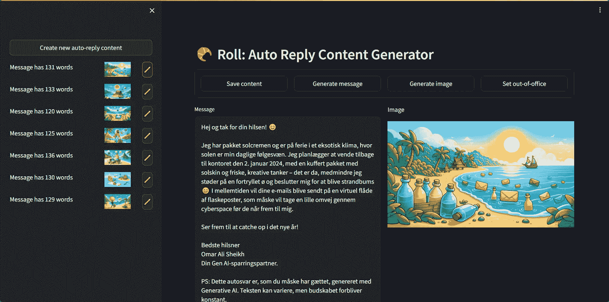
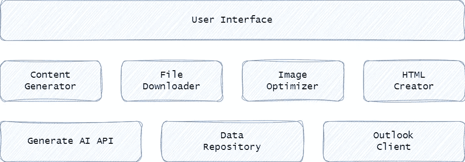
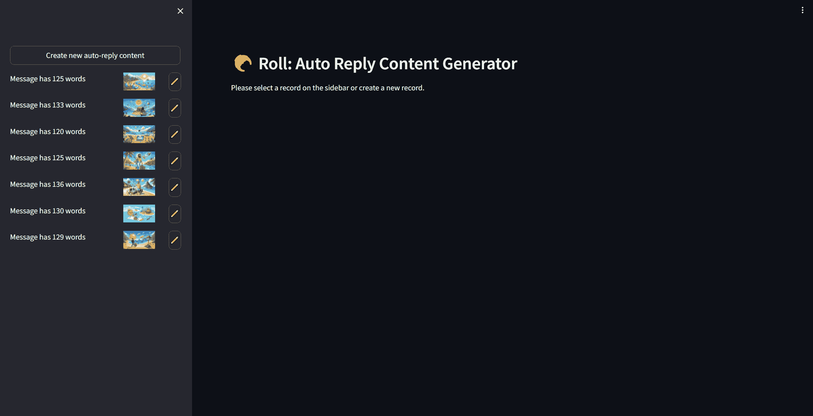

# 外出邮件很无聊：用生成式 AI 让它们更生动

> 原文：[`towardsdatascience.com/making-out-of-office-emails-pop-with-generative-ai-876d4fb81342?source=collection_archive---------10-----------------------#2024-01-09`](https://towardsdatascience.com/making-out-of-office-emails-pop-with-generative-ai-876d4fb81342?source=collection_archive---------10-----------------------#2024-01-09)

## 我实在是写不下去另一封外出邮件了，于是我开发了一个由 AI 驱动的应用，在我度过一个月长假期间，依然能够保持我的数字存在感。

[](https://osheikhomar.medium.com/?source=post_page---byline--876d4fb81342--------------------------------)[](https://towardsdatascience.com/?source=post_page---byline--876d4fb81342--------------------------------) [Omar Ali Sheikh](https://osheikhomar.medium.com/?source=post_page---byline--876d4fb81342--------------------------------)

·发布于 [Towards Data Science](https://towardsdatascience.com/?source=post_page---byline--876d4fb81342--------------------------------) ·18 分钟阅读·2024 年 1 月 9 日

--

*TLDR; 本文概述了一个用生成式 AI 编写非传统外出邮件的 Web 应用的开发过程。如果亲爱的读者选择继续阅读，您将会收获一大堆文字，详细描述我如何设计并构建了一个利用 GPT-4 和 DALL-E 3 生成自动回复邮件和配图的 Python 应用。另一方面，如果您只想亲自试试这个应用，我为您准备好了；源代码可以在* [*GitHub*](https://github.com/sheikhomar/roll)* 上找到。*



我为构建带有生成式 AI 的外出邮件所开发的应用截图。此用户界面允许用户管理自动回复的创建，并以编程方式设置 Outlook 的外出设置。尽管显示的文本是丹麦语，但生成模型可以通过稍微修改提示语来生成其他语言的文本。文章的最后可以找到一个短小的用户界面演示视频。图片来自作者。

# 拥抱生成式 AI 进行自动回复

外出邮件太单调了。

好吧，我说出来了。

但真的必须这么做吗？为什么不使用大语言模型来为这些邮件增添一些特色呢？为了更具创意，为什么不使用文本到图像模型来生成一些炫酷的图像，配合这些文字呢？

由于生成模型仅需几次 API 调用，制作出吸引眼球的自动回复邮件变得前所未有的简单。在本文中，我将展示如何做到这一点。我们将使用 Python 和 OpenAI 的 API 进行测试。我们将创建既俏皮又专业的外出自动回复邮件，并将其集成到 Outlook 中。对于那些喜欢直接跳入代码的朋友，所有代码都可以在 [GitHub](https://github.com/sheikhomar/roll) 上找到。

[](https://github.com/sheikhomar/roll?source=post_page-----876d4fb81342--------------------------------) [## GitHub - sheikhomar/roll：一个基于生成式 AI 的应用，用于为自动回复消息增添趣味

### ROLL 负责管理你的 Outlook 收件箱，忠实地告知他人你不在办公室，无论是度假、参加一天的研讨会，还是在丰盛午餐后小睡片刻。

github.com](https://github.com/sheikhomar/roll?source=post_page-----876d4fb81342--------------------------------)

# 这里的最终目标是什么？

任何一个自尊心强的软件工程师都知道，在知道我们想要实现什么之前，我们不能开始进行技术上的魔法操作。

**目标 1：** 我们希望让大型语言模型（LLM）生成能够逗乐的丹麦语文本。不仅如此，将这些消息与相关的图片搭配使用也会很有趣，因为谁不喜欢在收件箱里看到卡通图片呢？

**目标 2：** 质量至关重要，特别是因为这些自动回复消息是从我的工作邮箱发送的。目前的 AI 模型输出远非完美。即使是强大的 LLM，如 GPT-4，有时也会在丹麦语的语法规则上出错。我们需要确保生成的内容既正确又得体。

**目标 3：** 任何与 Outlook 打过交道的人都知道，手动更改外出设置需要点击无数次。自动化不仅仅是一个流行词汇，而是像周一早晨的一杯浓缩咖啡一样必要。

**目标 4：** 即使生成模型编写出了完美的自动回复邮件，如果每次发送的都是相同的文本，这种魔力很快就会消失。因此，我们希望邮件内容能够频繁变化。无论是每次发送自动回复时，还是按计划变动，比如每 24 小时更换一次。

在本文中，我们将重点讨论目标 1 到 3。我们会将项目中的调度部分留到未来的文章中，因为它可能会变得相当复杂，值得单独撰写。

# 如何堆叠代码块而不让塔倒塌？

需求收集：完成。该开始编码了，对吧？

错！

我们不能像喝了咖啡的程序猿一样胡乱开始编码。我们需要考虑如何构建我们的代码。毕竟，我们是工程师。

在《C# 4.0 完全参考》一书的空白页上快速画了一张图——顺便提一句，这本书对于调整电脑显示器高度非常有用——图中显示了一个有三层的结构：



一张图展示了我们如何将代码组织成独立单元的策略，[每个单元都有自己的责任。](https://en.wikipedia.org/wiki/Single_responsibility_principle) 图片由我亲自制作。

在底层是处理外部系统的组件：

+   **生成 AI API**是生成模型的抽象单元。在这个项目中，我们将依赖 OpenAI 的模型。具体来说，使用 GPT-4 来起草文本，使用 DALL-E 3 来生成我们的自动回复中的视觉内容。

+   **数据仓库**是我们的数字图书馆，用来存储我们的创作。我们将保持简单，所有内容都作为文件存储在磁盘上。

+   **Outlook 客户端**是我们与 Microsoft Outlook 的接口。它允许我们以编程方式设置外出设置，从而自动化原本需要反复点击的过程，简直可以媲美英雄联盟锦标赛中的点击盛宴。

在中间层，我们有一个服务层，其中包含执行所有繁重任务的组件：

+   **内容生成器**生成文本，同时也生成伴随文本的图像。它依赖生成 AI 组件来提供输出。

+   **文件下载器**是必要的，因为 DALL-E 的创作只能保存 24 小时。这个组件将在它们消失之前将这些稍纵即逝的杰作从互联网上下载下来。

+   **图像优化器**会去除 DALL-E 生成的图像中的多余字节。这可以通过调整图像大小，或许还可以应用量化算法来实现。目标是使包含图像的电子邮件在传输时更为高效。

+   **HTML 创建器**负责将给定的文本信息和优化后的图像格式化为 HTML 文本，准备作为自动回复电子邮件发送。

在最顶层是**用户界面**，我们的指挥控制中心，在这里我们可以监督一切。我们确保当 LLM（大语言模型）决定生成包含虚构词汇的文本时，这些词汇几乎看起来像是丹麦语，但又不完全是，我们可以及时介入并拯救局面。

用户界面还允许我们根据文本生成新的图像。最重要的是，在这里我们可以通过点击按钮配置 Outlook 的外出设置——为其他愉快的认知活动腾出宝贵的秒数，比如优化精确的*k*-最近邻搜索算法。

现在我们已经设计好了软件架构，接下来是编码阶段。

让我们开始吧！

# 如何一步步建立塔楼？

本节大致介绍了如何实现上一节中描述的每个组件。目标不是详细解释每一行代码，而是提供足够的上下文来澄清代码背后的意图。代码中的注释和命名应该涵盖剩下的部分。如果还有不清楚的地方，欢迎向我提出意见。

## 生成 AI API

为了实现生成式 AI 组件，我们可以走一条众所周知的道路，利用像[LangChain](https://github.com/langchain-ai/langchain)和[OpenAI 官方 Python SDK](https://github.com/openai/openai-python)这样的库。相反，让我们偏离传统路径，走一条更有结构的路线，使用[AIConfig](https://github.com/lastmile-ai/aiconfig)。

有趣的是，AIConfig 强调通过配置文件管理系统中的生成式 AI 部分。这应该会引起资深软件工程师的共鸣。通过将 AI 的行为与应用代码解耦，我们获得了一个更易维护的代码库，这是高质量软件工程的基石。而且，基于配置的方法结构化了我们的实验，使我们能够更快地调整提示，而无需修改代码。

如果这引起了你的兴趣，看看 Sarmad 的深刻文章：

[](https://blog.lastmileai.dev/open-sourcing-aiconfig-6fbab53a59f7?source=post_page-----876d4fb81342--------------------------------) [## 开源 AIConfig

### 基于配置驱动、适合源代码管理的 AI 应用开发框架

blog.lastmileai.dev](https://blog.lastmileai.dev/open-sourcing-aiconfig-6fbab53a59f7?source=post_page-----876d4fb81342--------------------------------)

使用 AIConfig，与 AI 交互的代码变得异常简单。我们只需要从配置文件实例化一个`AIConfigRuntime`对象，然后使用命名设置调用相应的模型：

```py
import anyio
from aiconfig import AIConfigRuntime, InferenceOptions
from pathlib import Path

async def main():
  # Create an AIConfigRuntime object from a config file
  config_path = Path("config/auto-reply-content-gen.aiconfig.json")
  runtime: AIConfigRuntime = AIConfigRuntime.load(config_path)

  # Run inference using the prompt named `generate-text`
  inference_options = InferenceOptions(stream=False)
  msg = await runtime.run("generate-text", options=inference_options)

  # Done!
  print(f"Generated message: {msg}")

if __name__ == "__main__":
    anyio.run(main)
```

在我们的项目中依赖 AIConfig，生成式 AI 组件只需几行代码。正因如此，我们不会为这个组件编写自定义封装代码，像我们在使用 LangChain 时那样。少了麻烦，也不需要因为 LangChain 复杂的设计和不稳定的抽象而对其进行吐槽。使用 AIConfig 的另一个愉快优势是，我们不必自己实现配置逻辑，例如使用[Hydra](https://github.com/facebookresearch/hydra)。

## 数据仓库

数据仓库确保我们的内容可以作为文件可靠地存储和检索。它使用一个名为`AutoReplyRecord`的数据类来组织信息，并使用 JSON 作为序列化格式。我们的实现`DataRepository`暴露了 CRU 操作，即标准的 CRUD 操作，但不允许删除：

```py
import shutil
import uuid
from datetime import datetime
from pathlib import Path
from typing import List, Optional

import aiofiles
from pydantic import BaseModel, Field

from roll.utils import utcnow

class DataRepository:
    """Represents a file-based data repository."""

    def __init__(self, data_dir: Path) -> None:
        """Initializes a new instance of the DataRepository class.

        Args:
            data_dir (Path): The directory to store data in.
        """
        self._data_dir = data_dir
        if not self._data_dir.exists():
            self._data_dir.mkdir(parents=True, exist_ok=True)

    async def get_keys(self) -> List[str]:
        """Returns the keys of existing records."""
        file_names = [
            file_path.name
            for file_path in self._data_dir.iterdir()
            if file_path.is_dir()
        ]
        return file_names

    async def get_all(self) -> List[AutoReplyRecord]:
        """Returns existing records.

        Returns:
            List[AutoReplyRecord]: A list of all records order by created time.
        """
        keys = await self.get_keys()
        records = [await self.get(key=key) for key in keys]
        sorted_records = sorted(records, key=lambda r: r.created_at, reverse=True)
        return list(sorted_records)

    async def create(
        self, ai_config_path: Path, html_template_path: Path
    ) -> AutoReplyRecord:
        """Create a new record.

        Args:
            ai_config_path (Path): The path to the AI Config file.
            html_template_path (Path): The path to the HTML template file.

        Returns:
            AutoReplyRecord: The newly created record.
        """
        key = uuid.uuid4().hex

        dir_path = self._data_dir / key
        dir_path.mkdir(parents=True, exist_ok=True)

        new_ai_config_path = dir_path / ai_config_path.name
        shutil.copyfile(src=ai_config_path, dst=new_ai_config_path)

        new_html_template_path = dir_path / html_template_path.name
        shutil.copyfile(src=html_template_path, dst=new_html_template_path)

        record = AutoReplyRecord(
            key=key,
            dir=dir_path,
            ai_config_path=new_ai_config_path,
            html_template_path=new_html_template_path,
        )

        await self.save(record=record)
        return record

    async def save(self, record: AutoReplyRecord) -> None:
        """Save the given record to disk.

        Args:
            record (AutoReplyRecord): The record to save.
        """
        file_path = record.dir / RECORD_FILE_NAME
        async with aiofiles.open(file_path, mode="w") as f:
            await f.write(record.to_json(indent=2))

    async def get(self, key: str) -> Optional[AutoReplyRecord]:
        """Finds a record by its key.

        Args:
            key (str): The key to search for.

        Returns:
            Optional[AutoReplyRecord]: The record if found, None otherwise.
        """
        file_path = self._data_dir / key / RECORD_FILE_NAME
        if not file_path.exists():
            return None
        async with aiofiles.open(file_path, mode="r") as f:
            json_data = await f.read()
        return AutoReplyRecord.from_json(json_data=json_data)
```

## Outlook 客户端

当你拥有像[exchangelib](https://github.com/ecederstrand/exchangelib)这样的工具时，自动化 Outlook 变得轻而易举。它是一个 Python 库，可以像高手一样与 Microsoft Exchange API 进行交互。这是一个优秀的软件，我们将在本项目中使用它。

对于这个特定的应用，我们只想玩弄 Outlook 的外出设置。因此，我们将编写一个封装类，提供两个功能：备份当前的外出设置和应用新的设置。

```py
import json
from base64 import b64encode
from datetime import datetime, timedelta, timezone
from pathlib import Path
from typing import cast

import aiofiles
from exchangelib import Account, Credentials, OofSettings
from exchangelib.ewsdatetime import EWSDateTime

class OutlookAutoReplyClient:
    """Represents a client for interacting with Outlook's out-of-office settings."""

    def __init__(self, login_name: str, password: str, account_name: str) -> None:
        """Initializes a new instance of the OutlookAutoReplyClient class.

        Args:
            login_name (str): The login name of the Outlook account.
            password (str): The password of the Outlook account.
            account_name (str): The name of the Outlook account.

        """
        credentials = Credentials(username=login_name, password=password)
        self._account = Account(
            account_name, credentials=credentials, autodiscover=True
        )

    async def backup_to_json_file(self, output_path: Path) -> None:
        """Backup Outlook's current out-of-office settings to disk.

        Args:
            output_path (Path): The location where to store the backup.
        """
        oof = cast(OofSettings, self._account.oof_settings)
        start_at = cast(EWSDateTime, oof.start)
        end_at = cast(EWSDateTime, oof.end)
        settings = {
            "state": oof.state,
            "start": start_at.ewsformat(),
            "end": end_at.ewsformat(),
            "external_audience": oof.external_audience,
            "internal_reply": oof.internal_reply,
            "external_reply": oof.external_reply,
        }
        # Save settings to disk as JSON
        async with aiofiles.open(output_path, "w") as file:
            json_content = json.dumps(settings, indent=2)
            await file.write(json_content)

    async def set_internal_reply(self, html_content: str) -> None:
        """Sets the internal auto-reply message for a month.

        Args:
            html_content (str): The message to set as the internal auto-reply.
        """
        start_at = datetime.now(tz=timezone.utc) - timedelta(days=1)
        end_at = datetime.now(tz=timezone.utc) + timedelta(days=5)

        print(f"Setting internal auto-reply message from {start_at} to {end_at}...")
        self._account.oof_settings = OofSettings(
            state=OofSettings.ENABLED,
            external_audience="None",
            internal_reply=html_content,
            external_reply="-",  # Cannot be empty string or None!
            start=start_at,
            end=end_at,
        )
```

## 内容生成器

现在，进入我们项目的核心：内容生成器。我们需要生成两种类型的内容。首先，我们使用 GPT-4 构建自动回复文本。然后，我们让 DALL-E 3 生成一张结合生成文本元素的图像。

不幸的是，DALL-E 3 对其提示词有一个 [限制](https://cookbook.openai.com/articles/what_is_new_with_dalle_3)。为了解决这个问题，我们使用 GPT-4 来生成一个简洁的提示词，供 DALL-E 3 使用，且该提示词包含从给定文本中提取的元素。

这个过程需要三次不同的调用到 AI 模型：

+   `generate-text` 请求 GPT-4 编写新文本，用于自动回复电子邮件。

+   `generate-dall-e-prompt` 调用 GPT-4，促使其基于我们从第一次调用生成的文本，设计一个专门用于 DALL-E 3 的提示词。这有点像写代码来生成代码。

+   `generate-image` 请求 DALL-E 3 生成一张图像，用于搭配自动回复消息。在这里，我们使用由 `generate-dall-e-prompt` 调用生成的提示词。

我们将让 AIConfig 来协调整个过程。为此，它需要一个描述如何实现我们期望结果的配置文件。我们创建了一个配置文件，包含三个命名的提示词：

```py
{
  "name": "auto-reply-content-generator",
  "description": "Configuration for generating content for auto-reply messages.",
  "schema_version": "latest",
  "metadata": {
    "model_parsers": {
      "gpt-4-1106-preview": "gpt-4"
    }
  },
  "prompts": [
    {
      "name": "generate-text",
      "input": "Write an auto-reply message in Danish following the same structure of earlier messages.",
      "metadata": {
        "model": {
          "name": "gpt-4-1106-preview",
          "settings": {
            "model": "gpt-4-1106-preview",
            "max_tokens": 1000,
            "temperature": 0.1,
            "system_prompt": "You're a renowned expert at crafting witty and engaging out-of-office replies in Danish. [...]"
          }
        }
      }
    },
    {
      "name": "generate-dall-e-prompt",
      "input": "Generate a prompt for DALL-E 3 to create an illustration that complements the following out-of-office message:\n{{auto_reply_message}}",
      "metadata": {
        "model": {
          "name": "gpt-4-1106-preview",
          "settings": {
            "model": "gpt-4-1106-preview",
            "max_tokens": 1000,
            "temperature": 0.1,
            "system_prompt": "You are an expert prompt engineer for the image generation model: DALL-E 3\. [...]"
          }
        },
        "parameters": {
          "auto_reply_message": "Parameter for the auto-reply message."
        }
      }
    },
    {
      "name": "generate-image",
      "input": "{{dall_e_prompt}}",
      "metadata": {
        "model": {
          "name": "dall-e-3",
          "settings": {
            "model": "dall-e-3",
            "size": "1792x1024",
            "quality": "standard"
          }
        },
        "parameters": {
          "dall_e_prompt": "Parameter for the DALL-E prompt."
        }
      }
    }
  ]
}
```

一旦你理解了配置架构，读取配置文件相对简单：

[## AIConfig 规格说明 | AIConfig

### aiconfig 文件是源代码控制友好的 JSON 文档，包含生成性 AI 模型设置、提示输入和输出，以及灵活的多用途元数据。

aiconfig.lastmileai.dev](https://aiconfig.lastmileai.dev/docs/overview/ai-config-format?source=post_page-----876d4fb81342--------------------------------)

接下来，我们构建一个类，暴露两个主要方法：`generate_message` 和 `generate_image`。在这些方法内部，我们将配置文件注入到 AIConfig 中，并让它发挥魔力：

```py
from pathlib import Path

from aiconfig import AIConfigRuntime, InferenceOptions

class AutoReplyContentGenerator:
    """Represents a class that generates content for auto-reply messages."""

    def __init__(self, config_file_path: Path, output_dir: Path, verbose: bool) -> None:
        """Initializes a new instance of the AutoReplyContentGenerator class.

        Args:
            config_file_path (Path): The path to the AI Config file to use.
            output_dir (Path): The directory to save outputs to.
            verbose (bool): Whether to print debug messages to stdout.
        """
        if not config_file_path.exists():
            raise ValueError(f"File {config_file_path} not found")

        self._output_path: Path = output_dir / config_file_path.name
        self._runtime: AIConfigRuntime = AIConfigRuntime.load(config_file_path)
        self._verbose = verbose

    async def generate_message(self) -> str:
        """Generates an auto-reply message.

        Returns:
            str: The generated message.
        """
        inference_options = InferenceOptions(stream=False)

        if self._verbose:
            print("Running inference for prompt 'generate-text'...")

        auto_reply_message = await self._runtime.run_and_get_output_text(
            prompt_name="generate-text",
            options=inference_options,
        )
        self._save_outputs()

        print(f"Generated auto-reply message:\n{auto_reply_message}\n")
        return auto_reply_message

    async def generate_image(self, auto_reply_message: str) -> str:
        """Generates an image to accompany the given auto-reply message.

        Args:
            auto_reply_message (str): The auto-reply message to use as inspiration for the image generation.

        Returns:
            str: The URL of the generated image.
        """
        if self._verbose:
            print("Running inference for prompt 'generate-dall-e-prompt'...")

        inference_options = InferenceOptions(stream=False)
        dall_e_prompt = await self._runtime.run_and_get_output_text(
            prompt_name="generate-dall-e-prompt",
            options=inference_options,
            params={
                "auto_reply_message": auto_reply_message,
            },
        )
        self._save_outputs()

        if self._verbose:
            print(f"Generated prompt for DALL-E:\n{dall_e_prompt}\n")
            print("Running inference for prompt 'generate-image'...")

        image_url = await self._runtime.run_and_get_output_text(
            prompt_name="generate-image",
            options=inference_options,
            params={
                "dall_e_prompt": dall_e_prompt,
            },
        )
        self._save_outputs()

        if self._verbose:
            print(f"Generated image URL:\n{image_url}\n")

        return image_url

    def _save_outputs(self) -> None:
        """Saves the outputs of the models to a JSON file."""
        self._runtime.save(
            json_config_filepath=str(self._output_path),
            include_outputs=True,
        )
```

## 文件下载器

就像有许多编程语言一样，使用 Python 从互联网上下载文件也有多种方式。但正如一位明智的工程师所说：“选择工具就像选择编程语言一样，要谨慎并考虑项目的需求。”我们将使用异步的 [aiohttp](https://github.com/aio-libs/aiohttp) 库，并搭配 [tqdm](https://github.com/tqdm/tqdm) 来提供下载进度的视觉反馈，因为，为什么不呢：

```py
from pathlib import Path
from typing import Optional
from urllib.parse import unquote, urlparse

import aiofiles
import aiohttp
from tqdm.asyncio import tqdm_asyncio

class FileDownloader:
    """Represents a class that downloads files."""

    def __init__(
        self,
        output_dir: Path,
        verify_ssl: bool,
        verbose: bool,
        download_chunk_size: int = 1024,
    ) -> None:
        """Initializes a new instance of the FileDownloader class.

        Args:
            output_dir (Path): The directory to save downloaded files to.
            verify_ssl (bool): Whether to verify SSL certificates when downloading files.
            download_chunk_size (int, optional): The size of each chunk to download. Defaults to 1024.
        """
        self._http = aiohttp.ClientSession(
            connector=aiohttp.TCPConnector(ssl=verify_ssl)  # type: ignore
        )
        self._chunk_size = download_chunk_size

        self._output_dir = output_dir
        self._output_dir.mkdir(parents=True, exist_ok=True)
        self._verbose = verbose

    async def download_one(
        self, url: str, local_file_name: Optional[str] = None
    ) -> Path:
        """Downloads an file from a URL and stores it on local disk.

        Args:
            url (str): The URL to download the file from.
            local_file_name (Optional[str], optional): The name of the file to save the downloaded file to. Defaults to None.

        Returns:
            Path: The location of the downloaded file in the local disk.
        """
        file_path = self._get_local_file_path(url=url, file_name=local_file_name)
        async with self._http.get(url=url) as response:
            if response.status != 200:
                raise Exception(f"Failed to download file: {response.status}")

            if self._verbose:
                print(f"Downloading file from {url} to {file_path}...")

            total_size = int(response.headers.get("content-length", 0))
            with tqdm_asyncio(
                total=total_size, unit="B", unit_scale=True, desc="Downloading"
            ) as progress_bar:
                async with aiofiles.open(file_path, "wb") as file:
                    async for data in response.content.iter_chunked(self._chunk_size):
                        await file.write(data)
                        progress_bar.update(len(data))
        return file_path

    async def close(self) -> None:
        """Closes the HTTP session."""
        await self._http.close()

    def _get_local_file_path(self, url: str, file_name: Optional[str]) -> Path:
        """Gets the path to save the downloaded file to.

        Args:
            file_name (Optional[str]): The name of the file to save the downloaded file to. Defaults to None.

        Returns:
            Path: The path to save the downloaded file to.
        """
        if file_name is None:
            file_name = unquote(urlparse(url).path.split("/")[-1])
        file_path = self._output_dir / file_name
        if file_path.exists():
            # raise Exception(f"File {file_path} already downloaded.")
            print(f"WARNING. File {file_path} already exists. Overwritting...")
        return file_path
```

## 图像优化器

我们可以通过调整大小和量化 DALL-E 3 生成的图像来显著减小文件大小。使用 [Pillow](https://github.com/python-pillow/Pillow)，这两个操作只需要少量代码。我们将它们封装在一个类中：

```py
from pathlib import Path

from PIL import Image

class ImageOptimizer:
    def __init__(self, max_width: int, quantize: bool, image_quality: int) -> None:
        """Initializes a new instance of the ImageOptimizer class.

        Args:
            max_width (int): The maximum width of the image in pixels.
            quantize (bool): Whether to quantize the image to reduce file size.
            image_quality (int): The quality of the image when saving it to disk from 1 to 100.
        """
        self._max_width = max_width
        self._quantize = quantize
        self._image_quality = image_quality

    def run(self, input_path: Path) -> Path:
        """Optimizes an image and stores the image on disk.

        Args:
            input_path (Path): The path to the image to optimize.

        Returns:
            Path: The location of the optimized image on disk.
        """
        output_path = input_path.parent / f"{input_path.stem}-optimized.jpg"

        img = Image.open(input_path)
        img = img.convert("RGB")

        img.thumbnail(size=(self._max_width, self._max_width), resample=Image.LANCZOS)

        if self._quantize:
            # Quantize image to reduce file size. Pillow converts the image to a
            # palette image with at most 256 colors. This is done by storing 1 byte for
            # each pixel instead of storing 3 bytes for R, G and B for each pixel.
            # The single byte is used to store the index into the palette.
            img = img.quantize()

            if output_path.suffix.lower() in [".jpg", ".jpeg"]:
                # Convert to RGB before saving to JPEG to avoid errors.
                img = img.convert("RGB")

        img.save(output_path, optimize=True, quality=self._image_quality)
        return output_path
```

## HTML 创建器

一旦我们生成了一些文本并与图像配对，我们就将内容转化为单一的电子邮件作品。另一种做法是使用链接的图像，这需要弄清楚如何为我们的外出回复电子邮件托管图像。值得吗？对于这个规模的项目来说，不值得。

我们可以轻松避免麻烦的图像托管问题。[MIME](https://en.wikipedia.org/wiki/MIME) 是一个标准，它允许我们通过构建一个嵌入图像的 HTML 格式电子邮件来结合文本和图像。

对于电子邮件布局，我们创建了一个外部文件作为 HTML 模板来使用。没有必要将其硬编码，因为没有人希望那种代码味道在周围 lingering。该模板包含三个可自定义的字段：一个用于文本，另外两个字段用于图像。

我们为文本添加了一些 HTML 样式。没有太过花哨，只是足够让它有合适的间距。为了将图像二进制数据编码成文本以便嵌入到标记中，我们使用了 Base64 编码。

这是代码：

```py
from base64 import b64encode
from pathlib import Path

import aiofiles

class AutoReplyHtmlCreator:
    """Represents a class that creates the HTML for an auto-reply message."""

    def __init__(self, template_file_path: Path) -> None:
        """Initializes a new instance of the AutoReplyHtmlCreator class.

        Args:
            template_file_path (Path): The path to the HTML template to use.
        """
        self._template_file_path = template_file_path

        if not template_file_path.exists():
            raise ValueError(f"File {template_file_path} not found")

    async def run(self, message: str, image_file_path: Path, output_path: Path) -> str:
        """Creates the HTML for an auto-reply message.

        Args:
            message (str): The message to include in the auto-reply.
            image_file_path (Path): The path to the image to include in the auto-reply.
            output_path (Path): The path to save the HTML to.

        Returns:
            str: The HTML for the auto-reply message.
        """
        async with aiofiles.open(self._template_file_path, "r") as file:
            template = await file.read()

        async with aiofiles.open(image_file_path, "rb") as file:
            image_data = await file.read()
            image_base64 = b64encode(image_data).decode("utf-8")

        message_in_html = message.replace("\n\n", "</p><p>")
        message_in_html = message_in_html.replace("\n", "<br/>")
        message_in_html = f"<p>{message_in_html}</p>"

        html = template.replace("{{CONTENT}}", message_in_html)
        html = html.replace("{{IMAGE_BASE64}}", image_base64)
        html = html.replace("{{IMAGE_CONTENT_TYPE}}", "image/jpeg")

        async with aiofiles.open(output_path, "w") as file:
            await file.write(html)

        return html
```

## 用户界面

最后一个缺失的部分是用户界面。为此，我们使用了[Streamlit](https://github.com/streamlit/streamlit)来创建一个基本的网页界面，因为我们的需求很简单：

+   一个整洁的列表，展示之前制作的数字杰作。

+   按钮用于制作一对新的文本消息和图像。

+   一个地方用于调整文本消息，解决任何小问题。

+   一个按钮，用于通过编程设置 Outlook 的外出自动回复。

用户界面利用了我们所有的组件来实现上述功能。在下面的代码清单中，我尽力省略了详细的代码，亲爱的读者。如果你感兴趣，可以在[GitHub](https://github.com/sheikhomar/roll/blob/main/tools/streamlit_ui.py)上查阅完整的实现：

```py
from pathlib import Path
from typing import cast

import anyio
import streamlit as st
from roll.config import settings
from roll.data import ActiveOutOfOfficeSetting, AutoReplyRecord, DataRepository
from roll.email import AutoReplyHtmlCreator, OutlookAutoReplyClient
from roll.image import ImageOptimizer
from roll.io import FileDownloader
from roll.models import AutoReplyContentGenerator
from roll.utils import utcnow

class StreamlitApp:
    def __init__() -> None:
        ...

    async def run(self) -> None:
        await self._setup_page_config()
        await self._build_sidebar()
        await self._build_main_content()

    async def _setup_page_config(self) -> None:
        ...

    async def _build_sidebar(self) -> None:
        ...

    async def _build_main_content(self) -> None:
        ...

    async def _render_navbar(self, record: AutoReplyRecord) -> None:
        ...

    async def _create_new_content(self) -> None:
        ...

    async def _generate_message(self, record: AutoReplyRecord) -> None:
        ...

    async def _generate_image(self, record: AutoReplyRecord) -> None:
        ...

    async def _set_out_of_office(self, record: AutoReplyRecord) -> None:
        ...

async def main() -> None:
    """Main entry point of the UI."""
    app = StreamlitApp(
        data_dir=Path("data/repository"),
        ai_config_path=Path("config/auto-reply-content-gen.aiconfig.json"),
        html_template_file_path=Path("config/auto-reply-template.html"),
        oof_data_dir=Path("data/oof"),
        outlook_login_name=settings.LOGIN,
        outlook_password=settings.PASSWORD,
        outlook_account_name=settings.ACCOUNT_NAME,
    )
    await app.run()

if __name__ == "__main__":
    anyio.run(main)
```

以下是用户界面的屏幕录制。左侧的侧边栏是一个画廊，展示了我们过去的作品。点击侧边栏中的编辑（✏️）按钮会将内容带到右侧的主界面。在这里，我们可以调整现有的消息，或创造一个新消息，以及它的视觉对应物。你可以轻松地让 LLM 生成其他语言的文本，只需按文章中讨论的方式调整 AIConfig 文件中的提示。`设置外出消息`按钮会将显示的内容作为我们的 Outlook 外出自动回复消息进行设置。



一段简短的用户界面屏幕录制，由我亲自提供。

# 是时候总结了

我们完成了开发一个 Python 程序的过程，该程序使用 GPT-4 和 DALL-E 3 创建非典型的外出自动回复电子邮件。

当然，我们可以快速拼凑一个庞大的 1000 行脚本来实现我们的目标。但我们没有。我们遵循了我们的软件工程原则——这些原则通过多年的“洗脑”深深植入我们脑海，并渴望为新一代充满好奇心的软件工程师们做到同样的事。

本能地，我们回想起软件工程更多的是关于深思熟虑的设计，而非单纯的编码。因此，我们从仔细考虑如何结构化代码开始了这项工作。

我们尝试将代码组织成类，使用描述性名称和类型提示以提高代码的清晰度。在尽量编写最少代码的同时，我们通过使用其他工程师的 Python 库来解决问题。

虽然我们已将调度方面的工作推迟到一个未来未确定的日期，但我们已经打下了坚实的基础。我们的应用程序可以生成富有创意却又专业的自动回复，并附带相关图片。此外，它还允许我们通过一键操作将邮件无缝地集成到 Outlook 中。

所以，下次你不在时——无论是在度假、全天研讨会中，还是在丰盛午餐后小睡片刻——何不让生成式 AI 为你生成自动回复，或许这会让你的同事们会心一笑，甚至还想要更多。

*感谢阅读。如果你以后喜欢类似的文章，可以在 Medium 上关注我，或通过* [*LinkedIn*](https://www.linkedin.com/in/osheikhomar/)*与我联系。*
