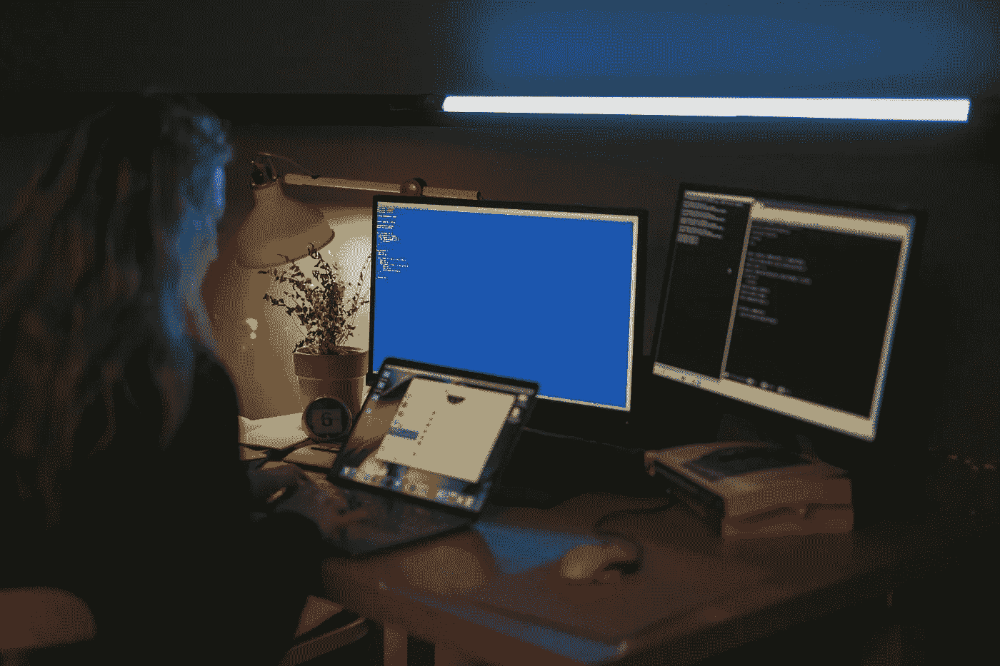

# 为机器学习中的测试驱动开发辩护

> 原文：[`towardsdatascience.com/making-the-case-for-test-driven-development-in-machine-learning-1aa84bc2a0aa?source=collection_archive---------5-----------------------#2024-04-22`](https://towardsdatascience.com/making-the-case-for-test-driven-development-in-machine-learning-1aa84bc2a0aa?source=collection_archive---------5-----------------------#2024-04-22)

照片来源：cottonbro studio: [`www.pexels.com/photo/woman-using-a-computer-5473298/`](https://www.pexels.com/photo/woman-using-a-computer-5473298/)

## 发现测试驱动开发（TDD）如何改变机器学习项目的结果。本文揭示了 TDD 为什么有益且易于实施。

 [Jonathan Serrano](https://jonathanserrano.medium.com/?source=post_page---byline--1aa84bc2a0aa--------------------------------)

·发布于 [Towards Data Science](https://towardsdatascience.com/?source=post_page---byline--1aa84bc2a0aa--------------------------------) ·阅读时间 11 分钟·2024 年 4 月 22 日

--

我敢打赌你也曾经历过——坐在会议桌旁，或者参加机器学习（ML）项目会议，会上有一位 ML 工程师或数据科学家报告编写单元测试所花费的时间，而这些代码可能已经处于生产阶段。但让我们暂停一下，思考单元测试到底是做什么的。这里有一个定义：单元测试是一个代码块，用于验证应用程序代码中较小、孤立部分的准确性，通常是一个函数或方法。它的目的是确保这段代码按预期功能运行，符合开发者的初步设计、需求和逻辑。

核心思想：确保“代码块按预期运行”并不是什么新鲜事。软件开发人员早已接受了单元测试，通常甚至在编写实际代码之前就开始实现这些测试。然而，机器学习工程师和数据科学家的背景和方法往往有所不同。他们的主要目标是利用统计方法、数学以及诸如 SciKit Learn 等预构建的库，建立从输入 X 到目标 Y 的映射。但请考虑一下……
