# Mamba：SSM、理论及在 Keras 和 TensorFlow 中的实现

> 原文：[`towardsdatascience.com/mamba-ssm-theory-and-implementation-in-keras-and-tensorflow-32d6d4b32546?source=collection_archive---------0-----------------------#2024-03-17`](https://towardsdatascience.com/mamba-ssm-theory-and-implementation-in-keras-and-tensorflow-32d6d4b32546?source=collection_archive---------0-----------------------#2024-03-17)

## 了解 SSM 和 Mamba 的工作原理，并学习如何开始在 Keras 和 TensorFlow 中实现它。

[](https://medium.com/@vedantjumle?source=post_page---byline--32d6d4b32546--------------------------------)[](https://towardsdatascience.com/?source=post_page---byline--32d6d4b32546--------------------------------) [Vedant Jumle](https://medium.com/@vedantjumle?source=post_page---byline--32d6d4b32546--------------------------------)

·发表于[Towards Data Science](https://towardsdatascience.com/?source=post_page---byline--32d6d4b32546--------------------------------) ·阅读时间 13 分钟·2024 年 3 月 17 日

--


来源：AI 生成（SDXL）

这篇题为[“Mamba: 线性时间序列建模与选择性状态空间”](https://arxiv.org/abs/2312.00752)的论文于 2023 年 12 月 1 日提交至 arXiv，提出了一种有趣的序列建模方法。作者们——[Albert Gu](https://arxiv.org/search/cs?searchtype=author&query=Gu%2C+A)、[Tri Dao](https://arxiv.org/search/cs?searchtype=author&query=Dao%2C+T)——介绍了“Mamba”方法，该方法利用“选择性”[状态空间模型（SSM）](https://en.wikipedia.org/wiki/State-space_representation)，取得了与当前无处不在的 Transformer 模型性能相媲美的成果。

# Mamba 有什么独特之处？

随着大规模语言模型（LLMs）如 LLaMa-2、GPT-4、Claude、Gemini 等的崛起，Transformer 近年来变得非常流行，但它也面临上下文窗口问题。Transformer 的问题根源在于其核心的多头注意力机制。

*多头注意力的主要问题源于这样一个事实：对于输入序列长度 n，时间复杂度和空间复杂度按 O(n²)比例增长。这限制了 LLM 的上下文窗口长度。因为，要将其增加 10 倍，我们需要将硬件要求（尤其是 GPU VRAM）增加 100 倍。*

另一方面，Mamba 的扩展按***O(n)!, 即线性***比例增长。

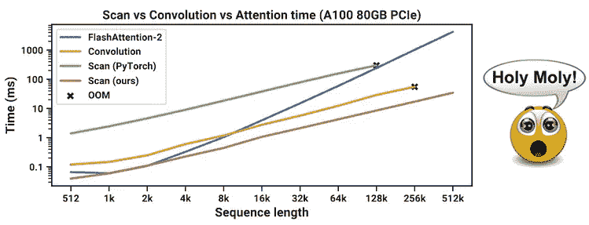

该图摘自 Mamba 论文，比较了 FlashAttention 和 Mamba 方法（在图例中由 scan(ours)标出）[1]

这种线性缩放已引发研究人员的猜测，即 Mamba 可能是序列建模的未来。

# Mamba 的核心：状态空间模型

Mamba 模型的核心来自于状态空间模型的概念。***状态空间模型，如 Transformers 和 RNN，处理信息序列，如文本、音频信号、视频帧、DNA 序列等。***

状态空间模型来源于将物理系统描述为一组输入、输出和变量的思想。这些变量包括：*A、B、C、D*。SSM 的过程涉及计算给定输入 x(t)的*内部状态向量 h(t)*。然后，我们对*h(t)*和*x(t)*进行加权求和，其中权重为*A、B、C 和 D*。在最简单的形式（连续时间不变）下，过程公式如下：

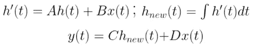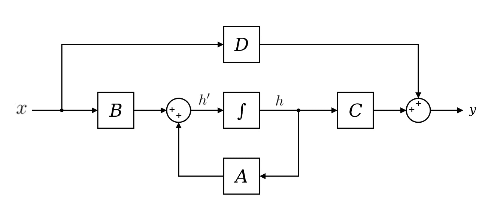

来源：wikipedia[6]

*h(t)*通常被称为“隐藏”状态或“潜在”状态，为了更清晰起见，我将坚持称其为“隐藏”状态。**重要的是要注意，A、B、C 和 D 是 SSM 中的学习参数。**

## 变量是什么？

**变量 A、B、C 和 D 是学习得到的参数，** 它们可以描述为：

+   A：在计算新的隐藏状态时，应该考虑多少前一个隐藏状态（h）。

+   B：在计算新的隐藏状态时，输入（x）应考虑多少。

+   C：在计算输出（y）时，新的隐藏状态应考虑多少。

+   D：在计算输出（y）时，输入（x）应考虑多少。

D 出现在计算的最后，并且不影响如何计算隐藏状态。因此，通常认为它在 SSM 之外，并且可以看作是一个跳跃连接。

## 从连续空间到离散空间的转变

上述公式适用于输入和输出属于连续空间的系统。但在诸如语言建模等情况中，输入和输出属于离散空间（词汇表中的标记值）。此外，求解*h(t)*在解析上具有挑战性。这可以通过执行***零阶保持***来实现。

在零阶保持中，每次接收到输入时，模型会保持其值直到接收到下一个输入。这导致了一个连续的输入空间。

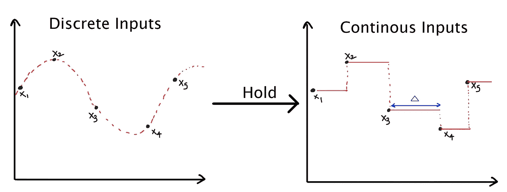

零阶保持如何工作

这个“保持”长度由一个新的参数决定，称为*步长* ***∆。它可以被视为输入的分辨率。*** 理想情况下，∆应为无穷小。

从数学上讲，零阶保持可以描述为：

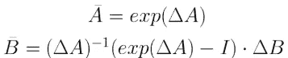

最后，我们可以创建一个离散的 SSM，如下所示：

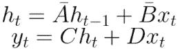

由于 D 与 SSM 外的跳跃连接一起使用，输出可以简化为：

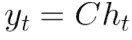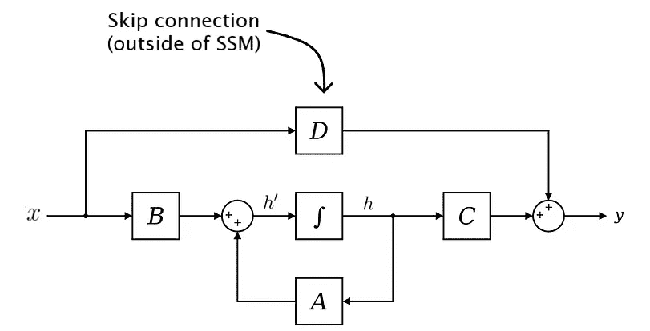

DX(t) 的涉及被视为跳跃连接，因此它来自 SSM 之外。

# SSM 和递归

在 SSM 中，隐藏状态会被传递到接收到下一个输入时。这类似于递归神经网络的工作方式。

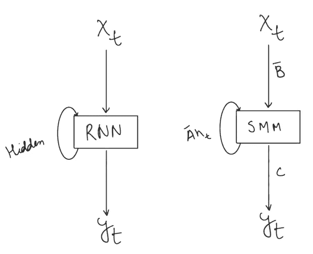

RNN 和 SSM 的比较

这种 SSM 的递归格式可以像 RNN 一样展开。但与迭代且缓慢的 RNN 不同，SSM 可以并行处理输入序列（就像 Transformers），这使得训练过程更快。

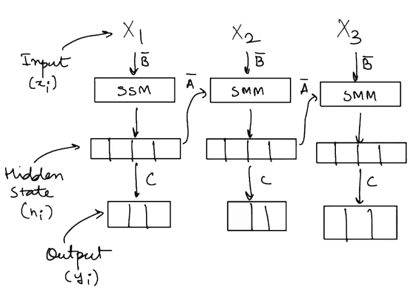

SSM 的展开形式

> 注意，‘D’ 在跳跃连接中使用，它位于 SSM 之外。

SSM 加速训练的关键见解是使用预先计算的卷积核中的变量 *A, B, C*。[Maarten Grootendorst](https://maartengrootendorst.substack.com/i/141228095/the-convolution-representation) 写了一篇非常好的解释，讲述了如何构造这个标准的‘卷积’核。但这里有一个简单的数学解释。

考虑输出 *y.* 对于序列长度 *k*，输出 *y(k)* 将表示为***(假设 h0 = 零)***：

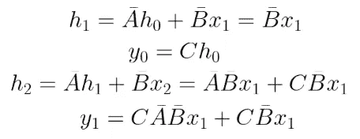

类似地，y3 可以表示为：

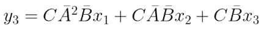

推断出模式，yk 可以表示为：

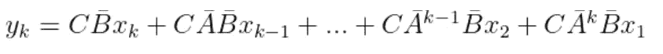

该公式可以进一步简化为：

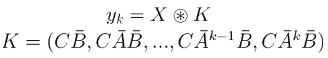

那个看起来很奇怪的乘法符号表示卷积操作，其中卷积核是 K。注意到 K 与 *x* 无关，因此 K 可以预先计算为卷积核，这使得处理过程更快。

# Mamba 和“选择性”SSM

尽管 SSM 的计算能力听起来很强大，但与 Transformers 相比，它在精度等度量指标上却相当 *一般*。

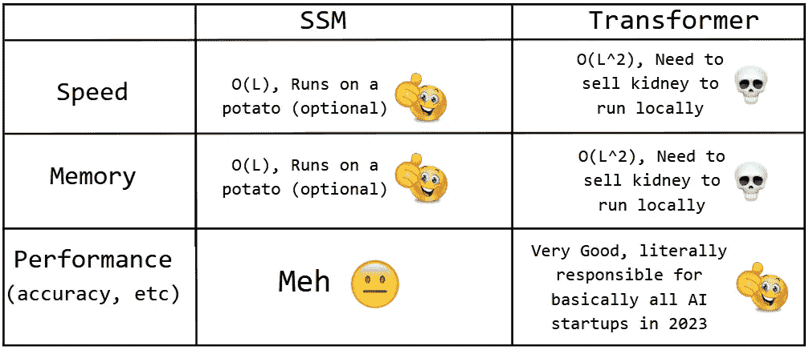

核心问题出在变量 ∆、A、B 和 C 上。事实证明，由于我们将相同的矩阵应用于每个输入，它们实际上无法处理序列的上下文。

> SSM 在处理数据时缺乏灵活性[4]

那么 Mamba 有什么特别之处？在 Mamba 中，我们使用一种叫做“选择性”SSM 的过程，其中变量 ∆、B 和 C 是根据输入计算出来的。🤔。我们通过将当前输入传递通过线性层，并将输出作为 ∆、B 和 C。

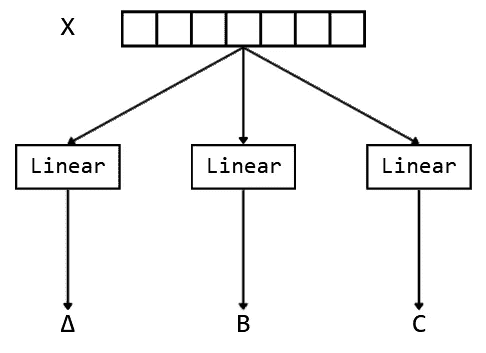

但这使得 ∆、B 和 C 变得依赖于输入，因此它们不能预先计算 😢，快速卷积在这里行不通。但是，作者讨论了一种基于 *并行关联扫描* 的方法。

## 并行关联扫描

并行关联扫描是一种在并行计算中使用的强大技术，用于执行前缀和操作，这是一种对数字序列进行累积的操作。这个操作是“关联的”，意味着数字在操作中的分组方式不会改变结果。

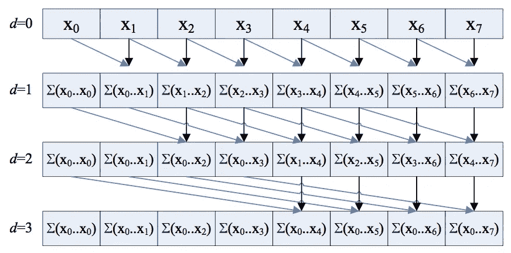

并行前缀和是关联扫描的一个例子。（来源：Nvidia）[7]

在 Mamba 模型的上下文中，通过定义一个关联操作符，可以获得并行关联扫描操作的元素和关联操作符。这使得可以并行解决整个时间区间的问题，从而使子区间的数量的时间复杂度达到对数级别。

## 硬件感知算法

除了关联扫描外，作者还提出了一种硬件感知算法，在该算法中，他们利用了与 Nvidia GPU 中 HBM 和 SRAM 速度相关的特性。他们认为，通过以下方式可以加速 SSM 状态的计算：

+   保持隐藏状态和 A 在速度较快但容量较小的 ***SRAM*** 中，

+   在速度较慢但容量较大的 ***HBM*** 中计算 ∆、B 和 C。

+   然后，他们将 ∆、B 和 C 转移到 ***SRAM*** 中，在 ***SRAM*** 内部计算新的隐藏状态。

+   然后将 ∆、B 和 C 写回到 ***HBM***。


图示来自 Mamba 论文，展示了硬件感知算法如何工作[1]

> 在实现部分，我不会讨论如何使用硬件感知算法，而是只会使用并行关联扫描。

# 最终的 Mamba 架构

考虑到这些，我们可以使用 Keras 和 TensorFlow 探索并实现 Mamba 架构。

在阅读论文并分析代码后，Mamba 架构可以分解为几个关键组件，这些组件连接如下：

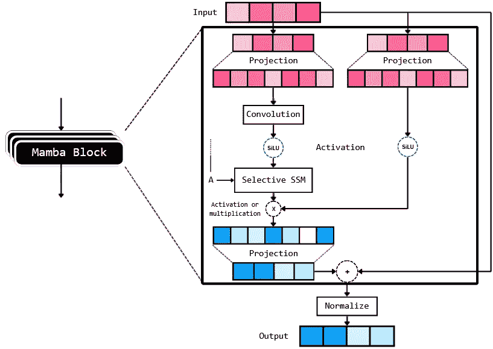

Mamba 块的拆解

Mamba 架构由多个堆叠的“Mamba 块”组成。从上面的图示来看，它由相当多的组件组成。另一个需要注意的重要事项是，作者将来自选择性 SSM 的输出添加到原始输入中，然后对其应用 *归一化* 层。此归一化可以是层归一化，或者是 [RMS 归一化](https://arxiv.org/abs/1910.07467)。

# TensorFlow 和 Keras 实现

让我们从 Mamba 的编码部分开始。我们将使用以下依赖项：

```py
tensorflow[and-cuda]==2.15.0.post1 # if you want to use GPU or
tensorflow==2.15.0.post1 # if you want to only use CPU
transformers==4.36.2 # for using the bert tokenizer
einops==0.7.0 # useful to make matrix manipulation faster
datasets==2.16.1 # to load datasets
# all other modules (like numpy) will be auto installed
```

导入：

```py
import tensorflow_datasets as tfds
import tensorflow as tf

from tensorflow import keras
from tensorflow.keras import layers, Model

from dataclasses import dataclass
from einops import rearrange, repeat
from typing import Union

from transformers import AutoTokenizer

import datasets
import math
import numpy as np
```

为了简化模型参数的处理，我们可以创建一个简单的 *ModelArgs* 数据类作为配置类。这样，在初始化模型时，我们只需将数据类变量作为参数传递即可。

```py
@dataclass
class ModelArgs:
    model_input_dims: int = 64
    model_states: int = 64
    projection_expand_factor: int = 2
    conv_kernel_size: int = 4
    delta_t_min: float = 0.001
    delta_t_max: float = 0.1
    delta_t_scale: float = 0.1
    delta_t_init_floor: float = 1e-4
    conv_use_bias: bool = True
    dense_use_bias: bool = False
    layer_id: int = -1
    seq_length: int = 128
    num_layers: int = 5
    dropout_rate: float = 0.2
    use_lm_head: float = False
    num_classes: int = None
    vocab_size: int = None
    final_activation = None
    loss:Union[str, keras.losses.Loss] = None
    optimizer: Union[str, keras.optimizers.Optimizer] = keras.optimizers.AdamW()
    metrics = ['accuracy']

    def __post_init__(self):
        self.model_internal_dim: int = int(self.projection_expand_factor * self.model_input_dims)

        self.delta_t_rank = math.ceil(self.model_input_dims/16)
        if self.layer_id == -1:
            self.layer_id = np.round(np.random.randint(0, 1000), 4)

        if self.vocab_size == None:
            raise ValueError("vocab size cannot be none")

        if self.use_lm_head:
            self.num_classes=self.vocab_size
        else:
            if self.num_classes == None:
                raise ValueError(f'num classes cannot be {self.num_classes}')

            if self.num_classes == 1:
                self.final_activation = 'sigmoid'
            else:
                self.final_activation = 'softmax'

        if self.loss == None:
            raise ValueError(f"loss cannot be {self.loss}")
```

加载 *bert-base-uncased* 分词器：

```py
tokenizer = AutoTokenizer.from_pretrained("bert-base-uncased")
vocab_size = tokenizer.vocab_size
```

在我们实现 Mamba 和 SSM 类之前，我们需要实现并行关联扫描，代码如下：

```py
def selective_scan(u, delta, A, B, C, D):
    # first step of A_bar = exp(ΔA), i.e., ΔA
    dA = tf.einsum('bld,dn->bldn', delta, A) 
    dB_u = tf.einsum('bld,bld,bln->bldn', delta, u, B)

    dA_cumsum = tf.pad(
        dA[:, 1:], [[0, 0], [1, 1], [0, 0], [0, 0]])[:, 1:, :, :]

    dA_cumsum = tf.reverse(dA_cumsum, axis=[1])  # Flip along axis 1

    # Cumulative sum along all the input tokens, parallel prefix sum, 
    # calculates dA for all the input tokens parallely
    dA_cumsum = tf.math.cumsum(dA_cumsum, axis=1)  

    # second step of A_bar = exp(ΔA), i.e., exp(ΔA)
    dA_cumsum = tf.exp(dA_cumsum)  
    dA_cumsum = tf.reverse(dA_cumsum, axis=[1])  # Flip back along axis 1

    x = dB_u * dA_cumsum
    # 1e-12 to avoid division by 0
    x = tf.math.cumsum(x, axis=1)/(dA_cumsum + 1e-12) 

    y = tf.einsum('bldn,bln->bld', x, C)

    return y + u * D 
```

通过这样，我们可以实现 MambaBlock：

```py
class MambaBlock(layers.Layer):
    def __init__(self, modelargs: ModelArgs, *args, **kwargs):
        super().__init__(*args, **kwargs)
        self.args = modelargs
        args = modelargs
        self.layer_id = modelargs.layer_id

        self.in_projection = layers.Dense(
            args.model_internal_dim * 2, 
            input_shape=(args.model_input_dims,), use_bias=False)

        self.conv1d = layers.Conv1D(
            filters=args.model_internal_dim,
            use_bias=args.conv_use_bias,
            kernel_size=args.conv_kernel_size,
            groups=args.model_internal_dim,
            data_format='channels_first',
            padding='causal'
        )

        # this layer takes in current token 'x' 
        # and outputs the input-specific Δ, B, C (according to S6)
        self.x_projection = layers.Dense(args.delta_t_rank + args.model_states * 2, use_bias=False)

        # this layer projects Δ from delta_t_rank to the mamba internal 
        # dimension
        self.delta_t_projection = layers.Dense(args.model_internal_dim, 
                                               input_shape=(args.delta_t_rank,), use_bias=True)

        self.A = repeat(
                tf.range(1, args.model_states+1, dtype=tf.float32), 
                'n -> d n', d=args.model_internal_dim)

        self.A_log = tf.Variable(
                tf.math.log(self.A), 
                trainable=True, dtype=tf.float32, 
                name=f"SSM_A_log_{args.layer_id}")

        self.D = tf.Variable(
                np.ones(args.model_internal_dim), 
                trainable=True, dtype=tf.float32, 
                name=f"SSM_D_{args.layer_id}")

        self.out_projection = layers.Dense(
                args.model_input_dims, 
                input_shape=(args.model_internal_dim,), 
                use_bias=args.dense_use_bias)

    def call(self, x):
        """Mamba block forward. This looks the same as Figure 3 in Section 3.4 in the Mamba pape.
        Official Implementation:
            class Mamba, https://github.com/state-spaces/mamba/blob/main/mamba_ssm/modules/mamba_simple.py#L119
            mamba_inner_ref(), https://github.com/state-spaces/mamba/blob/main/mamba_ssm/ops/selective_scan_interface.py#L311
        """

        (batch_size, seq_len, dimension) = x.shape

        x_and_res = self.in_projection(x) # shape = (batch, seq_len, 2 * model_internal_dimension)
        (x, res) = tf.split(x_and_res, 
                            [self.args.model_internal_dim, 
                             self.args.model_internal_dim], axis=-1)

        x = rearrange(x, 'b l d_in -> b d_in l')
        x = self.conv1d(x)[:, :, :seq_len]
        x = rearrange(x, 'b d_in l -> b l d_in')

        x = tf.nn.swish(x)
        y = self.ssm(x)
        y = y * tf.nn.swish(res)
        return self.out_projection(y)

    def ssm(self, x):
        """Runs the SSM. See:
            - Algorithm 2 in Section 3.2 in the Mamba paper
            - run_SSM(A, B, C, u) in The Annotated S4
            Official Implementation:
            mamba_inner_ref(), https://github.com/state-spaces/mamba/blob/main/mamba_ssm/ops/selective_scan_interface.py#L311
        """
        (d_in, n) = self.A_log.shape

        # Compute ∆ A B C D, the state space parameters.
        #     A, D are input independent (see Mamba paper [1] Section 3.5.2 "Interpretation of A" for why A isn't selective)
        #     ∆, B, C are input-dependent (this is a key difference between Mamba and the linear time invariant S4,
        #                                  and is why Mamba is called **selective** state spaces)

        A = -tf.exp(tf.cast(self.A_log, tf.float32)) # shape -> (d_in, n)
        D = tf.cast(self.D, tf.float32)

        x_dbl = self.x_projection(x) # shape -> (batch, seq_len, delta_t_rank + 2*n)

        (delta, B, C) = tf.split(
                x_dbl, 
                num_or_size_splits=[self.args.delta_t_rank, n, n], 
                axis=-1) # delta.shape -> (batch, seq_len) & B, C shape -> (batch, seq_len, n)

        delta = tf.nn.softplus(self.delta_t_projection(delta)) # shape -> (batch, seq_len, model_input_dim)

        return selective_scan(x, delta, A, B, C, D)
```

最后，实现外部跳跃连接的残差块。

```py
class ResidualBlock(layers.Layer):
    def __init__(self, modelargs: ModelArgs, *args, **kwargs):
        super().__init__(*args, **kwargs)
        self.args = modelargs
        self.mixer = MambaBlock(modelargs)
        self.norm = layers.LayerNormalization(epsilon=1e-5)

    def call(self, x):
        """
        Official Implementation:
            Block.forward(), https://github.com/state-spaces/mamba/blob/main/mamba_ssm/modules/mamba_simple.py#L297

            Note: the official repo chains residual blocks that look like
                [Add -> Norm -> Mamba] -> [Add -> Norm -> Mamba] -> [Add -> Norm -> Mamba] -> ...
            where the first Add is a no-op. This is purely for performance reasons as this
            allows them to fuse the Add->Norm.

            We instead implement our blocks as the more familiar, simpler, and numerically equivalent
                [Norm -> Mamba -> Add] -> [Norm -> Mamba -> Add] -> [Norm -> Mamba -> Add] -> ....

        """
        return self.mixer(self.norm(x)) + x
```

有了这个，我们可以初始化我们的模型。在这个例子中，我将演示如何使用 Mamba 模块创建一个简单的分类模型，但它可以很容易地修改为语言模型。让我们加载*IMDB 评论数据集*来进行一个简单的情感分类器。

```py
from datasets import load_dataset
from tqdm import tqdm

dataset = load_dataset("ajaykarthick/imdb-movie-reviews")
```

首先我们创建一个函数，该函数将接收模型参数并返回一个模型。

```py
def init_model(args: ModelArgs):
    input_layer = layers.Input(shape=(args.seq_length,), name='input_ids')
    x = layers.Embedding(
                args.vocab_size, 
                args.model_input_dims, 
                input_length=args.seq_length)(input_layer)

    for i in range(args.num_layers):
        x = ResidualBlock(args, name=f"Residual_{i}")(x)
        x = layers.Dropout(args.dropout_rate)(x) # for regularization

    x = layers.LayerNormalization(epsilon=1e-5)(x) # normalization layer

    # use flatten only if we are not using the model as an LM
    if not args.use_lm_head: 
        x = layers.Flatten()(x)
    x = layers.Dense(1024, activation=tf.nn.gelu)(x)
    output_layer = layers.Dense(
                args.num_classes, 
                activation=args.final_activation)(x)

    model = Model(
                inputs=input_layer, 
                outputs=output_layer, name='Mamba_ka_Mamba')
    model.compile(
        loss=args.loss,
        optimizer=args.optimizer,
        metrics=args.metrics
    )

    return model
```

现在我们可以初始化我们的模型，并对其进行总结：

```py
args = ModelArgs(
    model_input_dims=128,
    model_states=32,
    num_layers=12,
    dropout_rate=0.2,
    vocab_size=vocab_size,
    num_classes=1,
    loss='binary_crossentropy',
)
model = init_model(args)
model.summary()
```

```py
Model: "Mamba_ka_Mamba"
_________________________________________________________________
 Layer (type)                Output Shape              Param #   
=================================================================
 input_ids (InputLayer)      [(None, 128)]             0         

 embedding_2 (Embedding)     (None, 128, 128)          3906816   

 Residual_0 (ResidualBlock)  (None, 128, 128)          129024    

 dropout_24 (Dropout)        (None, 128, 128)          0         

 Residual_1 (ResidualBlock)  (None, 128, 128)          129024    

 dropout_25 (Dropout)        (None, 128, 128)          0

 ... (I have shrinked this to make it more readable)

 dropout_35 (Dropout)        (None, 128, 128)          0         

 layer_normalization_38 (La  (None, 128, 128)          256       
 yerNormalization)                                               

 flatten_2 (Flatten)         (None, 16384)             0         

 dense_148 (Dense)           (None, 1024)              16778240  

 dense_149 (Dense)           (None, 1)                 1025      

=================================================================
Total params: 22234625 (84.82 MB)
Trainable params: 22234625 (84.82 MB)
Non-trainable params: 0 (0.00 Byte)
_________________________________________________________________
```

为了更方便地处理，让我们先将数据进行预处理成*numpy 数组*，然后再转换为 tf.data.Dataset 对象：

```py
train_labels, test_labels = [], []
train_ids = np.zeros((len(dataset['train']), args.seq_length))
test_ids = np.zeros((len(dataset['test']), args.seq_length))

for i, item in enumerate(tqdm(dataset['train'])):
    text = item['review']
    train_ids[i, :] = tokenizer.encode_plus(
            text, 
            max_length=args.seq_length, 
            padding='max_length', 
            return_tensors='np')['input_ids'][0][:args.seq_length]

    train_labels.append(item['label'])

for i, item in enumerate(tqdm(dataset['test'])):
    text = item['review']
    test_ids[i, :] = tokenizer.encode_plus(
            text, 
            max_length=args.seq_length, 
            padding='max_length', 
            return_tensors='np')['input_ids'][0][:args.seq_length]

    test_labels.append(item['label'])

del dataset # delete the original dataset to save some memory

BATCH_SIZE = 32
train_dataset = tf.data.Dataset.from_tensor_slices((train_ids, train_labels)).batch(BATCH_SIZE).shuffle(1000)
test_dataset = tf.data.Dataset.from_tensor_slices((test_ids, test_labels)).batch(BATCH_SIZE).shuffle(1000)
```

现在模型可以进行训练：

```py
history = model.fit(train_dataset, validation_data=test_dataset, epochs=10)
```

你可以尝试推理算法：

```py
def infer(text: str, model: Model, tokenizer):
    tokens = tokenizer.encode(
            "Hello what is up", 
            max_length=args.seq_length, 
            padding='max_length', return_tensors='np')
    output = model(tokens)[0, 0]
    return output
```

该模型可以转化为语言模型，并且可以使用像*束搜索、top-k 采样、贪心采样*等算法来生成语言。

这段代码可以在我的[Github](https://github.com/maxDeCoder/Mamba-tf)上找到。

很多代码灵感来源于 mamba 的官方实现[2]以及另一个名为‘mamba-tiny’的 pytorch 实现[3]

感谢阅读。

+   除非另有说明，所有图片均由我制作。

参考资料：

1.  [Mamba 论文](https://arxiv.org/abs/2312.00752)

1.  [Mamba 原始仓库](https://github.com/state-spaces/mamba)

1.  [Mamba 的一个更简单的 Torch 实现：mamba-tiny](https://github.com/PeaBrane/mamba-tiny)

1.  [Letitia 在 YouTube 上的简单解释](https://youtu.be/vrF3MtGwD0Y?si=st2Oipq3fli9tGhl)

1.  [Maarten Grootendorst 关于 SSM 和 Mamba 的文章](https://maartengrootendorst.substack.com/p/a-visual-guide-to-mamba-and-state)

1.  [维基百科上的 SSM](https://en.wikipedia.org/wiki/SSM)

1.  [Nvidia 关于并行关联扫描的教程](https://developer.nvidia.com/gpugems/gpugems3/part-vi-gpu-computing/chapter-39-parallel-prefix-sum-scan-cuda)

想要联系我吗？请通过 vedantjumle@gmail.com 给我写信。
