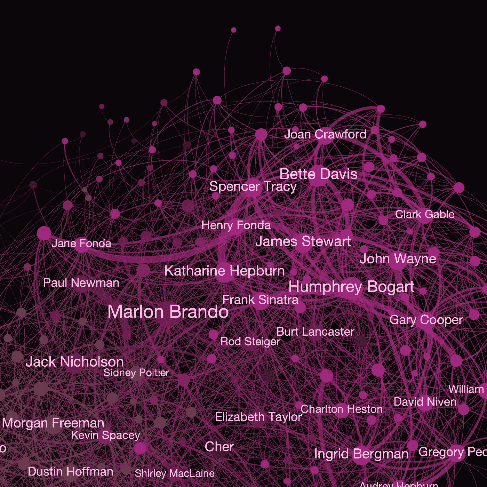
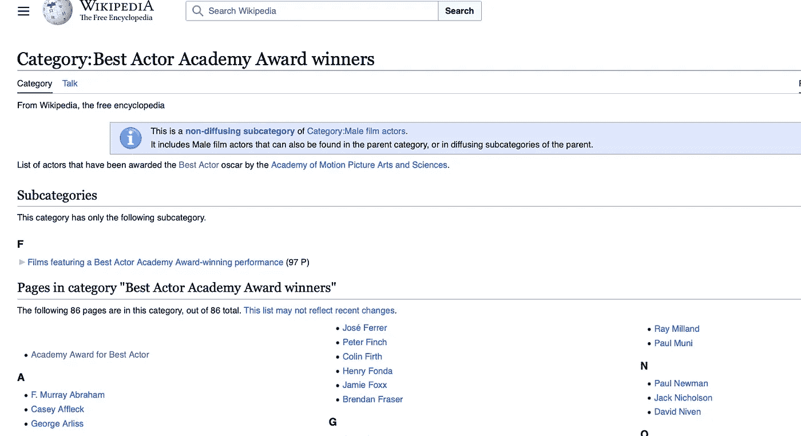

# 绘制奥斯卡获奖者的连接关系

> 原文：[`towardsdatascience.com/mapping-out-the-connections-of-oscar-winners-2690a571fe7e?source=collection_archive---------3-----------------------#2024-02-25`](https://towardsdatascience.com/mapping-out-the-connections-of-oscar-winners-2690a571fe7e?source=collection_archive---------3-----------------------#2024-02-25)

 [Milan Janosov](https://medium.com/@janosovm?source=post_page---byline--2690a571fe7e--------------------------------)

·发表于 [Towards Data Science](https://towardsdatascience.com/?source=post_page---byline--2690a571fe7e--------------------------------) ·阅读时间 6 分钟·2024 年 2 月 25 日

--

在这篇简短的文章中，我使用了公共的维基百科数据、Python 编程和网络分析技术来提取并绘制奥斯卡获奖演员和女演员的网络。

*所有图片均由作者创建。*

# 1\. 维基百科作为数据源

维基百科作为全球最大、最自由的众包在线百科全书，作为一个极为丰富的数据源，涵盖了各个公共领域。许多领域，从电影到政治，背后都涉及到不同层次的网络，展现了不同类型的社会现象，例如合作。由于奥斯卡颁奖典礼即将举行，在这里我以奥斯卡获奖演员和女演员为例，展示我们如何利用简单的 Python 方法将维基网站转化为网络。

# 2\. 收集获奖者名单

首先，让我们来看一下，例如，[奥斯卡获奖男演员列表](https://en.wikipedia.org/wiki/Category:Best_Actor_Academy_Award_winners)是如何构建的：

[奥斯卡获奖男演员列表](https://en.wikipedia.org/wiki/Category:Best_Actor_Academy_Award_winners)

这个子页面展示了所有曾经获得奥斯卡奖并且有维基个人档案的人（粉丝们大概没有漏掉任何一位演员或女演员）。在这篇文章中，我…
