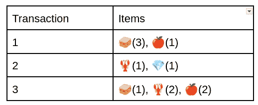
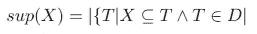
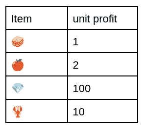
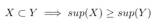
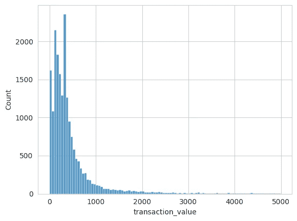
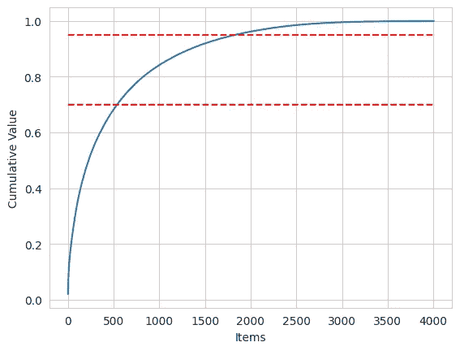
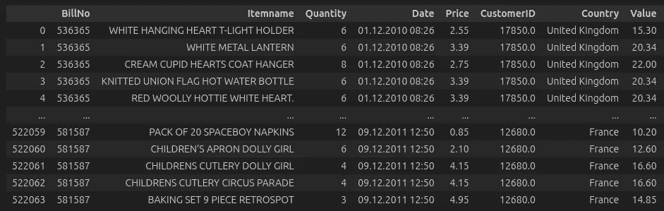
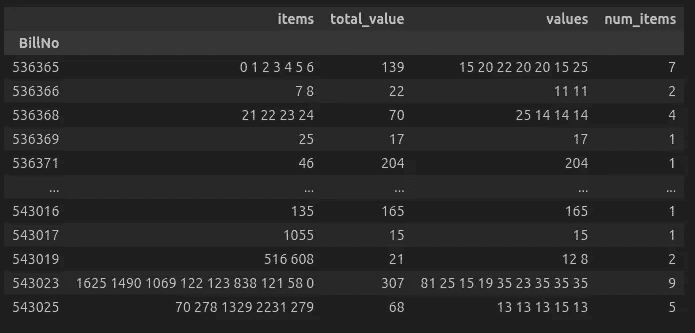
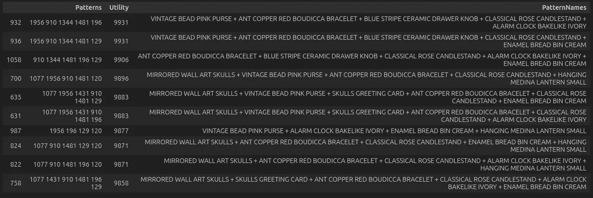

# 使用高效用项集挖掘的市场篮子分析

> 原文：[`towardsdatascience.com/market-basket-analysis-using-high-utility-itemset-mining-df233b297c0d?source=collection_archive---------5-----------------------#2024-09-11`](https://towardsdatascience.com/market-basket-analysis-using-high-utility-itemset-mining-df233b297c0d?source=collection_archive---------5-----------------------#2024-09-11)

## 在交易中寻找高价值模式

[](https://medium.com/@brechterlaurin?source=post_page---byline--df233b297c0d--------------------------------)[](https://towardsdatascience.com/?source=post_page---byline--df233b297c0d--------------------------------) [Laurin Brechter](https://medium.com/@brechterlaurin?source=post_page---byline--df233b297c0d--------------------------------)

·发表于 [Towards Data Science](https://towardsdatascience.com/?source=post_page---byline--df233b297c0d--------------------------------) ·9 分钟阅读·2024 年 9 月 11 日

--

*在这篇文章中，我将提供一种替代市场篮子分析中的流行技术的方法，这可以帮助从业者发现高价值的模式，而不仅仅是最频繁的模式。我们将对不同的模式挖掘问题有一些直观的了解，并且会查看一个真实世界的例子。完整的代码可以在* [*这里*](https://github.com/LaurinBrechter/PatternMining/blob/main/market_basket_analysis.ipynb)* 找到。所有图像均由作者创建。*

# 介绍

我已经写了一篇更为[入门的文章](https://medium.com/@brechterlaurin/customer-analytics-pattern-mining-on-clickstream-data-in-python-1bcd2de15a5d)关于模式挖掘；如果你不熟悉文中提到的某些概念，可以先去查看那篇文章。

简而言之，模式挖掘旨在从数据中寻找模式（显然）。大多数时候，这些数据呈现为（多重）集合或序列。例如，在我上一篇文章中，我分析了用户在网站上的操作序列。在这种情况下，我们**关心**物品的排序。

在其他情况下，例如我们下面将讨论的场景，我们不关心物品的排序。我们只列出交易中所有的物品及其出现的频率。



示例交易数据库

例如，交易 1 包含了🥪 3 次和🍎 1 次。正如我们所见，我们失去了关于物品排序的信息，但在许多场景中（如我们将讨论的场景），物品的排序并不重要。这类似于自然语言处理中的“词袋模型”。

# 市场篮子分析

*市场篮分析*（MBA）是一种常用于零售和市场营销的数据分析技术，用于揭示客户倾向于一起购买的商品之间的关系。它通过分析客户的购买行为，旨在识别客户购物篮或事务中的模式。核心思想是了解商品在购物事务中的共现情况，这有助于企业优化产品摆放、交叉销售和定向营销策略。

# 频繁项集挖掘

*频繁项集挖掘*（FIM）是从事务数据库中发现频繁模式的过程。我们可以通过计算模式的支持度来查看模式的频率。换句话说，模式 X 的支持度是包含 X（并且在数据库 D 中）的事务 T 的数量。也就是说，我们只是在查看模式 X 在数据库中出现的频率。



支持度的定义。

在频繁项集挖掘（FIM）中，我们接下来要找到所有支持度大于某个阈值的序列（通常称为*minsup*）。如果一个序列的支持度高于 minsup，它就被认为是频繁的。

## 局限性

在 FIM 中，我们只看一个项是否出现在序列中。也就是说，无论一个项出现两次还是 200 次都无关紧要，我们只表示它为 1。但我们经常会遇到一些情况（例如 MBA），在这些情况下，不仅项在事务中是否存在是相关的，项在事务中出现的次数也是重要的。

另一个问题是，频率并不总是意味着相关性。从这个角度看，FIM 假设事务中的所有项是同等重要的。然而，可以合理地假设，购买鱼子酱的人对商业的意义可能大于购买面包的人，因为鱼子酱可能是一个高回报/利润的商品。

# 高效用项集挖掘

这些局限性直接引导我们进入*高效用项集挖掘*（HUIM）和[*高效用定量项集挖掘*](https://data-mining.philippe-fournier-viger.com/an-introduction-to-high-utility-quantitative-itemset-mining/)（HUQIM），它们是 FIM 的推广，旨在解决普通 FIM 的一些问题。

我们的第一个推广是，项可以在一个事务中出现多次（即我们有一个多重集，而不是简单的集合）。如前所述，在普通的项集挖掘中，我们将事务转化为一个集合，只关注项是否存在于事务中。所以例如，下面的两个事务将有相同的表示。

```py
t1 = [a,a,a,a,a,b] # repr. as {a,b} in FIM
t2 = [a,b] # repr. as {a,b} in FIM
```

上面这两笔交易在常规频繁项集（FIM）中会被表示为[a,b]。我们很快就能发现，在某些情况下，我们可能会错过重要的细节。例如，如果 a 和 b 是客户购物车中的某些商品，那么是否有*a*（例如一条面包）出现五次或仅出现一次就非常重要。因此，我们将交易表示为一个多重集合，在其中记录每个商品出现的次数。

```py
# multiset representation
t1_ms = {(a,5),(b,1)}
t2_ms = {(a,1),(b,1)}
```

如果商品可能出现在大量商品中（例如 100 次或 1000 次），这种方法也是高效的。在这种情况下，我们不需要记录所有的 a 或 b，而只需记录它们出现的频率。

定量和非定量方法的一个推广是为交易中的每个商品分配一个效用（例如利润或时间）。下面是一个为每个可能商品分配单位利润的表格。



**商品效用**

然后我们可以通过计算包含特定模式（如{🥪, 🍎}）的交易中这些商品的效用总和来计算该模式的效用。在我们的示例中，效用为：

(3🥪 * $1 + 1🍎 * $2) +

(1 🥪 * $1 + 2🍎 * $2) = $10


**上面的交易数据库**

因此，我们得出这个模式的效用为$10。对于 FIM，我们的任务是寻找频繁模式。现在，我们必须找到高效用的模式。这主要是因为我们假设频率并不意味着重要性。在常规 FIM 中，我们可能会错过一些稀有（不频繁的）模式，这些模式提供了高效用（例如钻石），而 HUIM 则不会出现这种情况。

我们还需要定义“交易效用”的概念。它只是交易中所有商品效用的总和。对于数据库中的交易 3，这将是：

1🥪 * $1 + 2🦞*$10 + 2🍎*$2 = $25

请注意，解决这个问题并找到所有高效用商品比常规频繁模式挖掘（FPM）要困难。这是因为效用不遵循 Apriori 性质。

## **Apriori 性质**

设 X 和 Y 是两个在交易数据库 D 中出现的模式。Apriori 性质表示，如果 X 是 Y 的子集，则 X 的支持度必须至少与 Y 的支持度一样大。



**Apriori 性质**

这意味着，如果 Y 的一个子集是稀有的，那么 Y 本身必须是稀有的，因为它必须有更小的支持度。假设我们有 X = {a}和 Y = {a,b}。如果 Y 在我们的数据库中出现了 4 次，那么 X 必须至少出现 4 次，因为 X 是 Y 的一个子集。这是有道理的，因为我们通过添加一个商品使得模式变得不那么通用/更加具体，这意味着它将适用于更少的交易。这个性质在大多数算法中都有应用，因为它意味着如果{a}是稀有的，所有超集也是稀有的，我们可以将它们从搜索空间中排除[3]。

这个特性在谈到效用时并不成立。交易 X 的超集 Y 可能具有更多或更少的效用。如果我们以上面的例子为例，{🥪}的效用是 4 美元，但这并不意味着我们不能查看这个模式的超集。例如，我们查看的超集{🥪, 🍎}的效用为 10 美元。同时，一个模式的超集并不总是具有更高的效用，因为它可能只是很少出现在数据库中。

## HUIM 的理念

由于我们不能直接使用 HUIM 的 Apriori 性质，我们必须提出一些其他的上界来缩小搜索空间。一个这样的上界叫做*交易加权利用率*（TWU）。计算方法是将包含感兴趣模式 X 的交易的交易效用求和。任何 X 的超集 Y 的效用都不会超过 TWU。通过一个例子可以更清楚地说明这一点。{🥪,🍎}的 TWU 是 30 美元（交易 1 贡献了 5 美元，交易 3 贡献了 5 美元）。当我们查看一个超集模式 Y，如{🥪 🦞 🍎}时，我们可以看到，它不可能有更高的效用，因为所有包含 Y 的交易也包含 X。

目前，解决 HUIM 的问题已经有了多种算法。所有这些算法都会接收一个最小效用值，并生成至少具有该效用的模式作为输出。在此情况下，我使用了[EFIM](https://www.philippe-fournier-viger.com/EFIM_JOURNAL_VERSION%20KAIS%202016.pdf)算法，因为它快速且内存高效。

# 实现

对于本文，我将使用来自 Kaggle 的[市场篮子分析](https://www.kaggle.com/datasets/aslanahmedov/market-basket-analysis/data)数据集（经原数据集作者许可使用）。



上面，我们可以看到数据中交易值的分布情况。数据总共有大约 19,500 笔交易，平均交易值为 526 美元，每笔交易包含 26 个不同的商品。总共有大约 4,000 个唯一商品。我们还可以进行[ABC 分析](https://en.wikipedia.org/wiki/ABC_analysis)，根据商品在总收入中的占比将商品分入不同的桶。我们可以看到，大约 500 个商品（A 类商品）贡献了约 70%的收入。而剩下的大约 2,250 个商品（C 类商品）只贡献了约 5%的收入。



## 预处理

初始数据是长格式，每一行表示账单中的一项商品。通过 BillNo，我们可以看出该商品属于哪个交易。



初始数据格式

在一些预处理之后，我们将数据转换成[PAMI](https://github.com/UdayLab/PAMI)所需的格式，这是我们将用来应用 EFIM 算法的 Python 库。

```py
data['item_id'] = pd.factorize(data.Itemname)[0].astype(str) # map item names to id
data["Value_Int"] = data["Value"].astype(int).astype(str)
data = data.loc[data.Value_Int != '0'] # exclude items w/o utility

transaction_db = data.groupby('BillNo').agg(
    items=('item_id', lambda x: ' '.join(list(x))),
    total_value=('Value', lambda x: int(x.sum())),
    values=('Value_Int', lambda x: ' '.join(list(x))),
)

# filter out long transactions, only use subset of transactions
transaction_db = transaction_db.loc[transaction_db.num_items < 10].iloc[:1000]
```



交易数据库

然后，我们可以应用[EFIM](https://udaylab.github.io/PAMI/highUtilityPatternMining.html)算法。

```py
import PAMI.highUtilityPattern.basic.EFIM as efim 

obj = efim.EFIM('tdb.csv', minUtil=1000, sep=' ') 
obj.startMine()                       #start the mining process 
obj.save('out.txt')               #store the patterns in file 
results = obj.getPatternsAsDataFrame()     #Get the patterns discovered into a dataframe 
obj.printResults() 
```

然后，算法返回一组符合此最小效用标准的模式列表。



这是一个需要领域专家仔细查看这些模式的时刻，以确定是否有值得进一步关注的内容。例如，我们可以看到“VINTAGE BEAD PINK PURSE”和“ANT COPPER RED BOUDICCA BRACELET”的组合似乎表现得相当不错。在这种情况下，我们可以考虑将这些商品打包销售，或将它们推荐一起购买。

# 结论

在这篇博客文章中，我们探讨了经典的 FIM 及其局限性。特别是当我们关心一个模式的交易价值以及它可能带来的潜在收入时，使用 HUIM 并挖掘具有高效用的模式是非常有益的。

# 资源与进一步阅读

+   [1] [高效用项集挖掘](https://www.youtube.com/watch?v=dty9ircNDqI&list=PLQWbHaW8RsA1wND30_Re9V5-c8pr1H56H&index=9&ab_channel=PhilippeFournier-Viger)

+   [2] [模式挖掘课程](https://www.youtube.com/playlist?list=PLQWbHaW8RsA1wND30_Re9V5-c8pr1H56H)

+   [3] [EFIM：一种高效内存的高效用项集挖掘算法](https://www.philippe-fournier-viger.com/EFIM_JOURNAL_VERSION%20KAIS%202016.pdf)

+   [4] [Coursera 上的模式挖掘课程](https://www.coursera.org/learn/data-patterns?specialization=data-mining)
