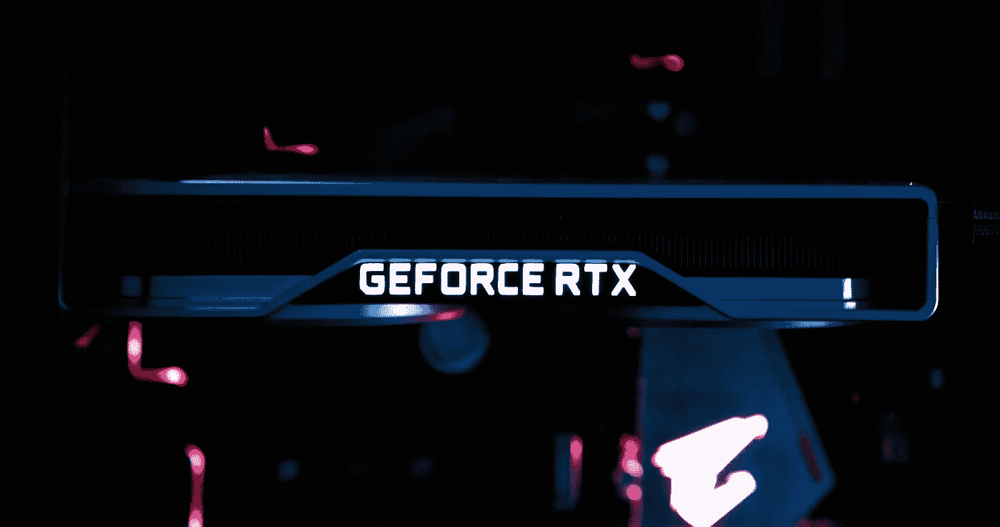
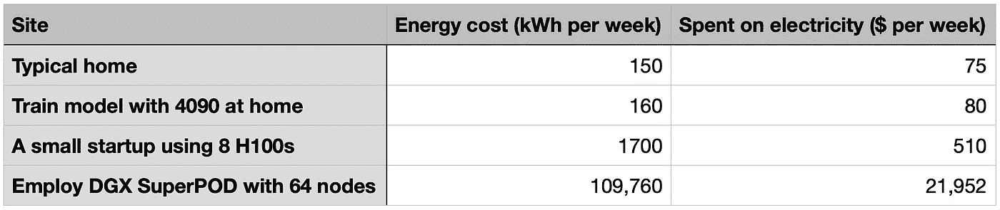
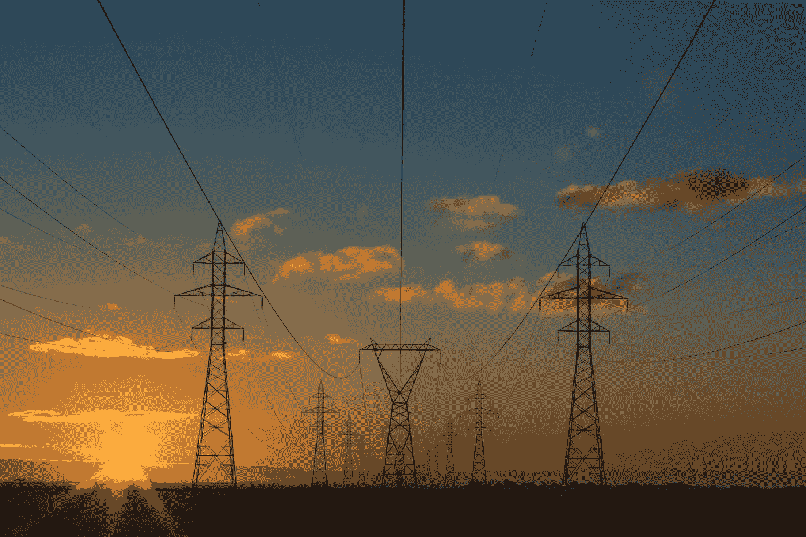
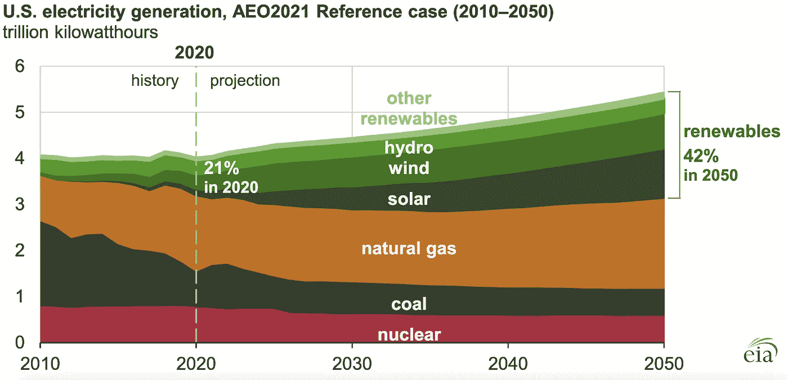

# 巨大的能源需求驱动着巨大的 GPU 赋能 AI

> 原文：[`towardsdatascience.com/massive-energy-for-massive-gpu-empowering-ai-dff59ae1da44?source=collection_archive---------2-----------------------#2024-08-18`](https://towardsdatascience.com/massive-energy-for-massive-gpu-empowering-ai-dff59ae1da44?source=collection_archive---------2-----------------------#2024-08-18)

## 用于人工智能模型训练和部署的巨型 GPU 需要大量能源。随着人工智能的规模扩大，优化能源效率将变得至关重要

 [Geo Zhang](https://geozhang.medium.com/?source=post_page---byline--dff59ae1da44--------------------------------)

·发布于[Towards Data Science](https://towardsdatascience.com/?source=post_page---byline--dff59ae1da44--------------------------------) ·阅读时间：7 分钟·2024 年 8 月 18 日

--

图片来源：[Lucas Kepner](https://unsplash.com/@lucaskphoto?utm_source=medium&utm_medium=referral) 于[Unsplash](https://unsplash.com/?utm_source=medium&utm_medium=referral)

OpenAI 创始人 Sam Altman 做出了雄心勃勃的计算，提出人工智能未来可能需要投入 7 万亿美元用于 GPU。这个数字被行业领袖，如 Nvidia 创始人黄仁勋所拒绝，暗示着对 GPU 的大规模收购，这需要巨大的能源，几乎是银河级别的。为了给这个数字做个对比，Nvidia 目前的市值约为 3 万亿美元，不到 Altman 提议投资的一半。与美国（约 26.8 万亿美元）和中国（约 17.8 万亿美元）的 GDP 相比，这 7 万亿美元的投资确实令人震惊。

尽管如此，人工智能时代仍处于初期阶段，达到如此规模可能需要更加先进的计算结构。这引出了一个关键的基础问题：为计算单元和数据中心提供能源需要多少？

让我们从三个角度来看一些简单直接的数据，

> 1\. 每个计算单元的能源消耗
> 
> 2\. 训练/操作现代模型的能源成本
> 
> 3\. 能源供需

# 每个计算单元的能源消耗

从用户的角度来看，一些视频游戏爱好者已经自建了配备高性能 GPU（如 NVIDIA GeForce RTX 4090）的个人电脑。有趣的是，这款 GPU 也能够处理小规模的深度学习任务。RTX 4090 的功率需求为 450 瓦特，推荐的总电源功率为 850 瓦特（在大多数情况下您并不需要这么高的功率，也不会在满载下运行）。如果您的任务连续运行一周，这意味着 0.85 千瓦 × 24 小时 × 7 天 = 142.8 千瓦时每周。在加利福尼亚，PG&E 对住宅用户的电价高达每千瓦时 50 美分，这意味着您每周大约会花费 70 美元的电费。此外，您还需要配备 CPU 和其他组件来与 GPU 协同工作，这将进一步增加电力消耗。这意味着整体的电费可能会更高。

现在，您的人工智能业务将加速发展。根据制造商的说法，H100 Tensor Core GPU 的最大热设计功耗（TDP）大约为 700 瓦特，具体取决于版本。这是为在全负载工作状态下冷却 GPU 所需的能量。对于这个高性能深度学习工具，通常需要一个大约 1600W 的可靠电源供应单元。如果您使用 NVIDIA DGX 平台进行深度学习任务，一台配备 8 个 H100 GPU 的 DGX H100 系统大约消耗 10.2 千瓦特。为了获得更大的性能，NVIDIA DGX SuperPOD 可以包括从 24 到 128 个 NVIDIA DGX 节点。以 64 个节点为例，系统的功耗保守估计约为 652.8 千瓦特。如果您的初创公司计划购买这种数百万美元的设备，那么集群和必要设施的成本将是相当可观的。在大多数情况下，从云计算提供商租用 GPU 集群更为合理。关注能源成本时，商业和工业用户通常能享受较低的电价。如果您的平均电费大约是每千瓦时 20 美分，那么在 24 小时、每周 7 天全天候运行 64 个 DGX 节点，消耗 652.8 千瓦特，将会产生每周 109.7 MWh 的电力消耗，预计每周的电费大约为 21,934 美元。

根据粗略估算，典型的加利福尼亚家庭每周大约消耗 150 千瓦时的电力。有趣的是，如果您在家中使用高性能 GPU（如 RTX 4090）进行模型训练任务，所产生的电力成本大致相同。

**能源成本比较**

从此表格中，我们可以看到，运行 64 个节点的 SuperPOD 在一周内的能耗相当于一个小型社区的电力消耗。

# 训练/运行 AI 模型的能源成本

## 训练 AI 模型

现在，让我们深入了解一些与现代 AI 模型相关的数字。OpenAI 从未披露过训练 ChatGPT 所使用的 GPU 的具体数量，但粗略估计，这可能涉及成千上万个 GPU 连续运行数周到数月，具体取决于每个 ChatGPT 模型的发布日期。这样的任务的能源消耗轻松达到兆瓦级别，导致能源消耗的成本在数千 MWh 的规模。

最近，[Meta 发布了 LLaMA 3.1](https://llama.meta.com/)，并称其为“迄今为止最强大的模型”。根据 Meta 的说法，这是他们最大的一款模型，训练使用了超过 16,000 个 H100 GPU——这是首个在此规模下训练的 LLaMA 模型。

让我们来拆解这些数字：LLaMA 2 于 2023 年 7 月发布，因此可以合理推测，LLaMA 3 至少训练了一年。虽然不太可能所有 GPU 都在全天候 24 小时运行，但我们可以估算出以 50%的利用率的能源消耗：

1.6 kW × 16,000 个 GPU × 24 小时/天 × 365 天/年 × 50% ≈ 112,128 MWh

以每千瓦时$0.20 的估算成本，这大约意味着**2240 万美元**的能源费用。这个数字仅包括 GPU 的费用，未包括与数据存储、网络和其他基础设施相关的额外能源消耗。

训练现代大型语言模型（LLMs）需要兆瓦级别的电力消耗，并代表着百万美元的投资。这也是为什么现代 AI 开发往往排除了较小的参与者。

## 运行 AI 模型

运行 AI 模型也会带来显著的能源成本，因为每一次查询和回应都需要计算能力。尽管每次交互的能源成本相较于训练模型而言较小，但累积的影响可能是巨大的，特别是当你的 AI 业务在有数十亿用户每天与先进的语言模型互动的情况下，规模化成功。许多富有洞察力的文章讨论了这个问题，包括[公司之间运营 ChatBot 的能源成本比较](https://www.trgdatacenters.com/resource/ai-chatbots-energy-usage-of-2023s-most-popular-chatbots-so-far/#:~:text=The%20training%20time%20of%20GPT,%2Dhours%2C%20or%207%2C200%20MWh.)。结论是，由于每次查询的能源消耗可能在 0.002 至 0.004 千瓦时之间，目前流行的公司每年将消耗数百到数千 MWh 的电力。而且这个数字仍在增长。

照片由[Solen Feyissa](https://unsplash.com/@solenfeyissa?utm_source=medium&utm_medium=referral)提供，来自[Unsplash](https://unsplash.com/?utm_source=medium&utm_medium=referral)

想象一下，如果有 10 亿人经常使用一个 ChatBot，每人每天平均进行 100 次查询。可以按如下方式估算这类使用的能源成本：

0.002 kWh × 100 次查询/天 × 1e9 人 × 365 天/年 ≈ 7.3e7 MWh/年

这将需要一个 8000 MW 的电力供应，并可能导致每年大约 146 亿美元的能源费用，假设电价为每千瓦时$0.20。

# 能源供应与需求

摄影：来自[Matthew Henry](https://unsplash.com/@matthewhenry?utm_source=medium&utm_medium=referral)的照片，来自[Unsplash](https://unsplash.com/?utm_source=medium&utm_medium=referral)

美国最大的发电厂是位于华盛顿州的[大库利水坝](https://en.wikipedia.org/wiki/Grand_Coulee_Dam)，其容量为 6809 兆瓦。美国最大的太阳能电站是位于加利福尼亚的[太阳星](https://en.wikipedia.org/wiki/Solar_Star)，容量为 579 兆瓦。在这种背景下，单一的发电厂无法提供大型人工智能服务所需的全部电力。考虑到[EIA（能源信息管理局）](https://www.eia.gov/todayinenergy/detail.php?id=46676)提供的年度电力生产统计数据，这一点变得尤为明显，

**来源：** 美国能源信息管理局，[*2021 年年度能源展望*](https://www.eia.gov/outlooks/aeo/)（AEO2021）

上述计算的 730 亿千瓦时大约占美国每年总电力生产的 1.8%。然而，合理的猜测是这个数字可能远高于此。根据一些媒体报道，当考虑到所有与人工智能和数据处理相关的能源消耗时，影响可能接近美国总电力生产的 4%。

然而，这只是目前的能源使用情况。

目前，聊天机器人主要生成基于文本的响应，但它们越来越能够生成二维图像、“三维”视频和其他形式的媒体。下一代人工智能将远远超出简单的聊天机器人，可能会为球形屏幕（例如[拉斯维加斯球体](https://gotickets.com/venues/msg-sphere)）提供高分辨率图像、三维建模，并能执行复杂任务和深度物流的互动机器人。因此，模型训练和部署的能源需求预计将大幅增加，远超当前水平。我们现有的电力基础设施是否能够支持这些进步仍然是一个悬而未决的问题。

在可持续性方面，能源需求较高的行业碳排放量显著。减缓这一影响的一种方法是使用可再生能源为高能耗设施（如数据中心和计算中心）提供电力。一个显著的例子是[Fervo Energy 和谷歌](https://blog.google/outreach-initiatives/sustainability/google-fervo-geothermal-energy-partnership/)之间的合作，利用地热能为数据中心提供能源。然而，与即将到来的人工智能时代的整体能源需求相比，这些举措的规模仍然相对较小。要解决这一背景下的可持续性挑战，仍然需要做很多工作。

图片由[Ben White](https://unsplash.com/@benwhitephotography?utm_source=medium&utm_medium=referral)提供，来源于[Unsplash](https://unsplash.com/?utm_source=medium&utm_medium=referral)

*如果你发现任何数字不合理，请进行修正。*
