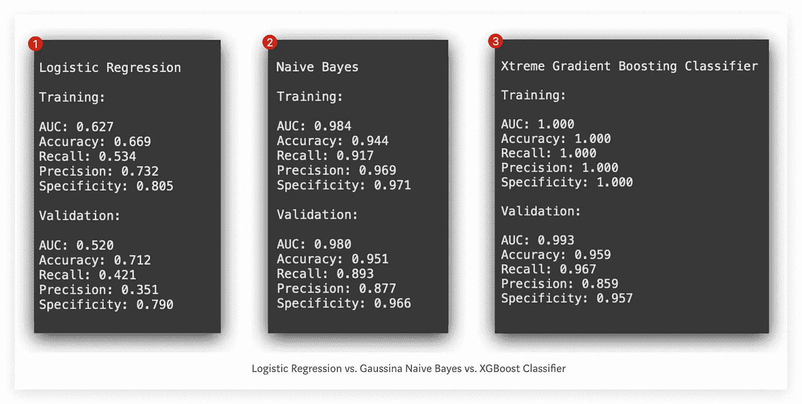

# 精通机器学习：4 个分类模型简单易懂

> 原文：[`towardsdatascience.com/master-machine-learning-4-classification-models-made-simple-7a924677113e?source=collection_archive---------0-----------------------#2024-12-14`](https://towardsdatascience.com/master-machine-learning-4-classification-models-made-simple-7a924677113e?source=collection_archive---------0-----------------------#2024-12-14)

## 初学者的机器学习模型构建指南：15 个实用步骤

 [Leo Anello 💡](https://medium.com/@panData?source=post_page---byline--7a924677113e--------------------------------)

·发表于[Towards Data Science](https://towardsdatascience.com/?source=post_page---byline--7a924677113e--------------------------------) ·56 分钟阅读·2024 年 12 月 14 日

--

# 概览

我将展示一个**机器学习模型构建过程的模板**。

在本项目中，目标是创建一个能够预测**工业机器设备维护需求**的模型。我们将使用来自**物联网传感器**的数据（*Internet of Things*）。

 [## GitHub - 机器学习模板

### 通过在 GitHub 上创建账户，您可以为 Anello92/machine-learning-template 的开发做出贡献。

[github.com](https://github.com/Anello92/machine-learning-template?source=post_page-----7a924677113e--------------------------------)

该方法将机器学习项目分为**15 个独立的阶段**，我将在下文中为您概述这些阶段。这些阶段包括**关键技术**、**主要策略**，以及如何有效地应对每个阶段。

作为示范，我们将在这个例子中使用**虚拟数据**。

随着项目的推进，我们将从头到尾构建一个**完整的项目**，涵盖从**问题定义**到**部署功能模型**的全过程。

# 项目中使用的工具
