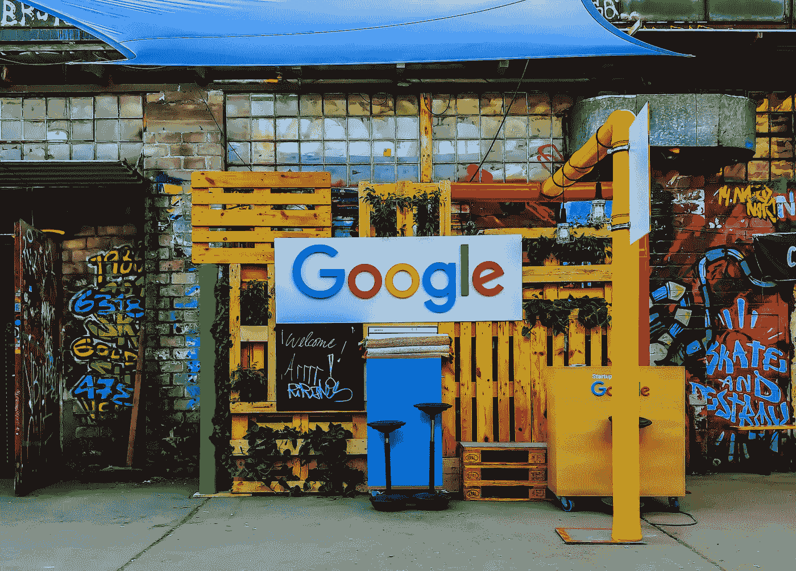

# 掌握这项数据科学技能，你就能进入大科技公司工作——第一部分

> 原文：[`towardsdatascience.com/master-this-data-science-skill-and-you-will-land-a-job-in-big-tech-part-i-2507003dfb30?source=collection_archive---------0-----------------------#2024-07-07`](https://towardsdatascience.com/master-this-data-science-skill-and-you-will-land-a-job-in-big-tech-part-i-2507003dfb30?source=collection_archive---------0-----------------------#2024-07-07)

## 我从与科技行业顶尖人士合作中学到的实验设计基础

 [Khouloud El Alami](https://medium.com/@elalamik?source=post_page---byline--2507003dfb30--------------------------------)

·发布于[Towards Data Science](https://towardsdatascience.com/?source=post_page---byline--2507003dfb30--------------------------------) ·11 分钟阅读·2024 年 7 月 7 日

--

你是一个渴望进入大科技公司工作的数据科学家，但不知道需要掌握哪些技能才能成功？

嗯，我有一个秘密武器，可能正是你进入顶尖科技公司梦寐以求的工作所需要的。

图片由[Rajeshwar Bachu](https://unsplash.com/@rajeshwerbatchu7?utm_source=medium&utm_medium=referral)提供，来源于[Unsplash](https://unsplash.com/?utm_source=medium&utm_medium=referral)

几个月前，我写了这篇[*文章*](https://medium.com/towards-data-science/dont-apply-to-tech-without-mastering-these-6-must-have-data-science-skills-a-spotify-data-8b1b7b8cc0ba)，讲述了你需要掌握的所有必备技能，以便被顶尖科技公司录用，今天，我们将重点讨论其中一项关键技能：**实验设计**。

实验设计是一种统计方法，帮助我们*隔离*并*评估*产品变更的影响——包括推出新功能、用户体验更新等！

*那么，为什么实验设计在脱颖而出成为其他数据科学家中的佼佼者时如此重要呢？*

很简单。最大的科技公司都致力于创造优秀的产品，而实验设计是实现这一目标的重要工具。

如果你能成为实验设计方面的专家，你将比其他候选人具有显著的**优势**，因为大多数求职者忽视了这一技能，并且不知道如何发展它。
