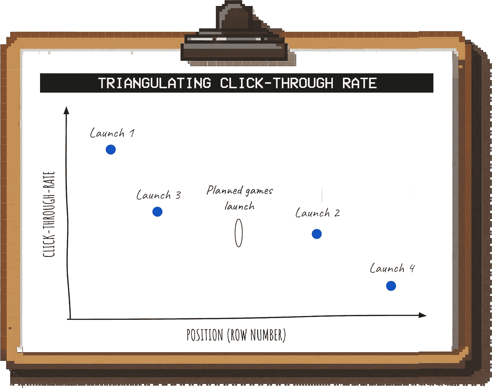

# 掌握“背面纸条数学”将使你成为更好的数据科学家

> 原文：[`towardsdatascience.com/mastering-back-of-the-envelope-math-will-make-you-a-better-data-scientist-74316b96472a?source=collection_archive---------1-----------------------#2024-10-23`](https://towardsdatascience.com/mastering-back-of-the-envelope-math-will-make-you-a-better-data-scientist-74316b96472a?source=collection_archive---------1-----------------------#2024-10-23)

## 有时候，一个简单粗暴的答案比一个复杂的模型更有帮助

 [Torsten Walbaum](https://medium.com/@twalbaum?source=post_page---byline--74316b96472a--------------------------------)

·发表于 [Towards Data Science](https://towardsdatascience.com/?source=post_page---byline--74316b96472a--------------------------------) ·11 分钟阅读·2024 年 10 月 23 日

--

图片由作者提供（改编自 Midjourney）

1945 年 7 月 16 日，在洛斯阿拉莫斯进行的首次核弹爆炸试验中，物理学家恩里科·费米丢下小纸片，观察爆炸波到达时纸片移动的距离。

基于这些信息，他估算了炸弹爆炸威力的大致大小。没有复杂的设备或严格的测量；只有一些方向性的数据和逻辑推理。

> 爆炸后大约 40 秒，气浪到达我所在的位置。我试图通过在大约六英尺高的地方丢下小纸片来估算它的强度，纸片的掉落时间在气浪到来前、期间和之后都有记录。[…] 我估计它相当于当时一千吨 T.N.T.所产生的爆炸 *— 恩里科·费米*

考虑到这个估算的产生方式，结果出奇地准确。

**我们经常被迫做出快速而粗略的估算。** 有时我们没有足够的数据来进行严格的分析，其他时候我们根本没有时间提供答案。

不幸的是，估算对我来说并不是自然而然的事。作为一个[正在恢复的完美主义者](https://www.operatorshandbook.com/p/done-is-better-than-perfect)，我总是想让我的分析尽可能稳健。如果我做错了，而我采取了快速粗略的方法，难道这不会让我显得粗心或无能吗？

但随着时间的推移，我意识到，使模型变得越来越复杂，很少能带来更好的决策。

**为什么？**

1.  大多数决策并不需要超高精度的分析；只要在大致范围内就足够了

1.  你使模型变得越复杂，假设也就越多。错误会相互叠加，整个情况变得越来越难以理清。

简单的计算，草稿纸上的估算：无论你怎么称呼它，这就是管理顾问和业务运营人员如何迅速突破复杂性，快速得出有力建议的方法。

而他们所需要的只是结构化的思维和一个电子表格。

我的目标是让这项非常有用的技巧对每个人都能轻松使用。

**在本文中，我将涵盖：**

+   如何判断你的分析需要多准确

+   如何创建“足够准确”的估算

+   如何让人们对你的估算感到放心

让我们开始吧。

# 第一部分：你需要多准确？

大多数企业的决策不需要高精度的分析。

我们通常试图弄清楚以下四件事之一：

## 情景 1：我们能否达到最低标准？

通常，我们只需要知道某事是否会比 X 更好/更大/更有利润。

**例如，** 大型企业只对那些能够影响其收入或利润的事务感兴趣。Meta 每年收入超过 1000 亿美元，因此任何没有潜力最终成长为数十亿美元业务的新项目，都不会得到太多关注。

一旦你开始进行一个简单的草稿纸上的计算，你会迅速意识到你的预测是否落在数千万、数亿甚至数十亿美元的范围内。

如果你的初步估算远低于标准，那么就没有必要再进行精细化；此时，准确答案并不重要。

**其他例子：**

+   风险投资人试图理解一个初创公司的市场机会是否足够大，能够成长为一个独角兽公司

+   你正在考虑加入一家早期公司，并试图了解它是否有可能成长为一个高估值的公司（例如人工智能或自动驾驶公司）

 [## 每当 Torsten Walbaum 发布新内容时，获取电子邮件通知。

### 每当 Torsten Walbaum 发布新内容时，你将收到一封电子邮件。通过注册，如果你尚未拥有 Medium 账户，你将创建一个…

medium.com](https://medium.com/@twalbaum/subscribe?source=post_page-----74316b96472a--------------------------------)

## 情景 2：我们能否保持在某个水平以下？

这个情景与上面的情景相反。

**例如，** 假设 CMO 正在考虑最后一刻参加一个大型行业会议。他正在问是否团队能够及时并在 X 百万美元预算内准备好所有必要的部分（例如展位、支持性的营销活动等）。

给 CMO 一个答案时，***准确的时间***和***具体的成本***并不是最重要的。此时，他只需要知道是否可行，以便为你的公司争取到会议的一个位置。

关键是使用非常**保守**的假设。如果即使情况不顺利，你也能按时按预算完成任务，那么你就可以放心地给出绿灯（然后再制定一个更详细、更现实的计划）。

**其他示例：**

+   你的经理想知道你是否有时间接手另一个项目。

+   你正在与客户制定服务水平协议（SLA）（例如，客户支持的响应时间）。

## 情境 3：我们如何进行排序？

有时，你只需要理解 A 事物是否优于 B 事物；你不一定需要知道 A 事物究竟有多好。

**例如，** 假设你正在尝试在不同的项目之间分配工程资源。比每个项目的确切影响更重要的是它们的相对排名。

因此，你的重点应该放在确保你做出的假设在*相对*层面上是准确的（例如，A 项目的工程工作量是否比 B 项目的高或低），并且方法论要保持一致，以便进行公平比较。

**其他示例：**

+   你正在决定下一步应该进入哪个国家市场。

+   你希望了解应该将额外的资金分配给哪个营销渠道。

## 情境 4：我们的（最佳）估算是什么？

当然，也有一些情况下，估算的实际数字非常重要。

例如，如果你被要求预测预计的支持工单数量，以便客户支持团队能相应地进行人员配置，你的估算将作为直接输入用于人员配置的计算。

在这些情况下，你需要理解**1）决策对你的分析的敏感度**，以及**2）你的估算偏高还是偏低更好**。

+   **敏感性：** 以人员配置的例子为例，你可能发现一个支持代理每天可以处理 50 个工单。因此，估算偏差多少个工单并不重要；只有当偏差达到 50 个工单或更多时，团队才需要多配置或减少一个支持代理。

+   **偏高或偏低：** 你的估算错误的方向很重要。在上述例子中，人员不足或过剩对业务的成本是不同的。查看我之前关于错误成本的文章，深入了解这一点。

# 第二部分：如何创建“足够准确”的估算

你知道自己需要多准确——很好。那么，你究竟该如何制定估算呢？

你可以按照以下步骤，使你的估算尽可能稳健，同时最大程度地减少你在此上花费的时间：

# 第一步：构建结构

假设你在 Netflix 工作，想要弄清楚通过在平台上添加游戏（如果通过广告进行货币化）能赚多少钱。

如何构建你的估算？

第一步是***将指标分解为驱动树，***第二步是***进行细分。***

## **开发驱动树**

在你驱动因子的树形图顶部是“*每天的游戏收入*”。但你该如何进一步拆解这个驱动因子？

有两个关键的考虑因素：

**1. 选择你能获取数据的指标。**

例如，游戏行业使用标准化指标来报告货币化，如果你偏离这些标准，可能会很难找到基准（有关基准的更多内容见下文）。

**2. 选择能最大限度减少混杂因素的指标。**

例如，你可以将收入拆分为“*用户数量*”和“*每用户的平均收入*”。问题是，这并没有考虑到用户在游戏中花费的时间。

为了解决这个问题，我们可以将收入拆分为“*游戏时长*”和“*每小时收入*”，这样可以确保你的游戏与“传统”游戏之间的参与差异不会影响结果。

然后，你可以进一步拆分每个指标，例如：

+   “*每小时收入*”可以通过将“*每小时广告展示量*”与“*每次广告展示的收入*”相乘来计算

+   “*游戏时长*”可以拆分为“*日活跃用户数（DAU）*”和“*每位 DAU 的游戏时长*”

**然而**，增加细节并不总是有益的（下面会详细说明）。

## **细分**

为了获得有用的估算，你需要考虑那些影响你能够产生多少收入的关键维度。

例如，Netflix 活跃于多个国家，这些国家的货币化潜力差异巨大，为了考虑这一点，你可以按地区拆分分析。

哪些维度有助于获得更准确的估算取决于具体的使用场景，但这里有一些常见的维度可以考虑：

+   地理位置

+   用户人口统计（年龄、设备等）

+   收入来源（例如，广告、订阅、交易等）

> **“好的，太好了，但我怎么知道什么时候细分是有意义的？”**

**细分有用的前提条件是：**

1.  这些细分市场***差异很大***（例如，亚太地区的每用户收入远低于美国）

1.  你拥有足够的信息来对每个细分市场做出有根据的假设

你还需要确保细分是**值得付出努力**的。实际上，你通常会发现，只有一个或两个指标在细分之间有显著差异。

**在这种情况下，你可以采取以下方法以快速获得一个粗略答案：**

与其创建多个单独的估算，不如计算一个针对最具变异性的指标的加权平均值。

所以，如果你预计“*每小时收入*”在不同地区之间差异显著，你可以 1）为每个地区假设这个指标（例如，通过获取基准数据，见下文），并且 2）估算各国的比例：

作者提供的图片

然后，你使用这个数字作为估算，避免了细分的需要。

## **你应该有多详细？**

***如果***你有可靠的数据作为假设的基础，那么为分析增加更多细节***可以***提高估算的准确性；但也只是到一定程度为止。

除了增加分析所需的努力，增加更多细节可能会导致**虚假的精度**。

作者提供的图片

那么，什么内容属于“过多细节”的范畴呢？为了快速和粗略的估算，这将包括诸如以下内容：

+   按设备类型进行分段（智能电视 vs. 安卓 vs. iOS）

+   考虑按星期几的不同参与程度

+   按行业分割 CPM

+   模拟单个游戏的影响

+   等等

添加如此详细的内容会指数级增加假设的数量，而不一定会使估算更准确。

# 步骤 2：为每个指标指定数字

现在你已经整理好估算的输入数据，是时候开始为它们指定数字了。

## 内部数据

如果你进行了一个实验（例如，你向一些用户推出了“Netflix 游戏”的原型）并且有结果可以用来估算，那就太好了。但很多时候，情况并非如此。

在这种情况下，你需要发挥创意。例如，假设为了估算我们的游戏 DAU，我们希望了解有多少 Netflix 用户可能会在他们的动态中看到并点击游戏模块。

为此，你可以将其与其他具有相似入口点的推出进行比较：

+   最近你还推出了哪些新的首页功能？

+   他们的表现如何根据位置的不同而有所不同（例如，屏幕顶部的第一排与“页面下方”需要滚动才能看到的位置）？

根据最近几次的发布，你可以三角测量出游戏的预期点击率：

作者提供的图片

***这些关系通常足够接近线性（在合理范围内），因此这种类型的近似会产生有用的结果。***

一旦你从实验或发布中获得一些实际数据，你就可以调整你的假设。

## 外部基准

外部基准（例如行业报告、数据供应商）可以在没有内部数据的情况下帮助你找到一个合理的数字范围。

**有几个关键考虑因素：**

1.  **选择最接近的对比。**例如，Netflix 上的休闲游戏更接近于移动游戏，而非 PC 或主机游戏，因此应根据此选择基准。

1.  **确保你的指标定义是一致的。**仅仅因为外部报告中的一个指标听起来相似，并不意味着它与你的指标完全相同。例如，许多公司对“*日活跃用户*”的定义是不同的。

1.  **选择有信誉且透明的来源。** 如果你搜索基准数据，你会遇到*很多*不同的来源。总是尽量找到一个使用（并公开！）可靠方法论的*原始来源*（例如，使用平台的实际数据，而非调查）。**如果报告定期更新，这样你可以在未来根据需要刷新你的估计，那就更好。**

## 决定一个数字

在查看来自不同来源的内部和外部数据后，你可能会有一系列数字可供选择，以供每个指标使用。

> ***看看范围有多宽；******这将展示哪些输入对答案的影响最大。***

例如，你可能发现来自不同报告的 CPM 基准数据非常相似，但用户每天花费在你游戏上的时间范围却非常广泛。

在这种情况下，你的重点应放在精细调整“每小时播放时间”的假设上：

1.  如果业务希望看到的最低收入水平是用来投资游戏的，看看你能否通过最保守的假设达到这个水平。

1.  如果没有最低阈值，尝试使用[合理性检查](https://www.operatorshandbook.com/p/how-to-challenge-your-own-work-so)来确定一个现实的水平。

例如，你可以将你预计的游戏播放时间与用户目前在 Netflix 上花费的总时间进行比较。

即使其中一些时间是增量的，但要认为超过总时间的 5%-10%花费在游戏上是不现实的（毕竟，大多数用户是为了视频内容而来到 Netflix 的，且外面有更好的游戏选择）。

# 第三部分：如何让人们对你的估算感到安心

如果你做的是一个粗略的估计，人们并不指望它完全准确。

然而，他们仍然想了解什么情况下这些数字会变得*如此不同*，以至于它们会导致不同的决策或建议。

可视化这一点的一个好方法是**敏感性表**。

假设业务希望每天至少达到 50 万美元的广告收入，才考虑启动游戏。你有多大可能实现这一目标？

在表格的 X 轴和 Y 轴上，你放置的是你最不确定的两个输入指标（例如，“*每日活跃用户（DAU）*”和*“每 DAU 花费时间”*）；表格中的值代表你正在估算的数字（在本例中是“*每天的游戏收入*”）。

图片来源：作者

然后，你可以将你的最佳估计与业务的最低要求进行比较；例如，如果你估计每日活跃用户数（DAU）为 3000 万，每个 DAU 的播放时间为 0.3 小时，那么你就有足够的缓冲来应对其中任何一个假设错误。

# 结语

虽然它被称为餐巾纸上的数学，但三行匆忙写在鸡尾酒餐巾纸上的内容通常不足以得出一个可靠的估计。

然而，你也不需要一个完整的 20 标签模型就能得到一个方向性的答案；而且，通常情况下，那个方向性的答案就是你前进所需的一切。

一旦你习惯了粗略的估算，它们能让你比那些仍然陷入分析瘫痪的人更快地行动。通过节省下来的时间，你可以处理另一个项目——或者回家做其他事情。

**想获取更多实际操作的分析建议，可以考虑在 Medium 上关注我，或者在** [**LinkedIn**](http://www.linkedin.com/comm/mynetwork/discovery-see-all?usecase=PEOPLE_FOLLOWS&followMember=torsten-walbaum) **上关注我，或者在** [**Substack**](https://www.operatorshandbook.com/) **上关注我**。
