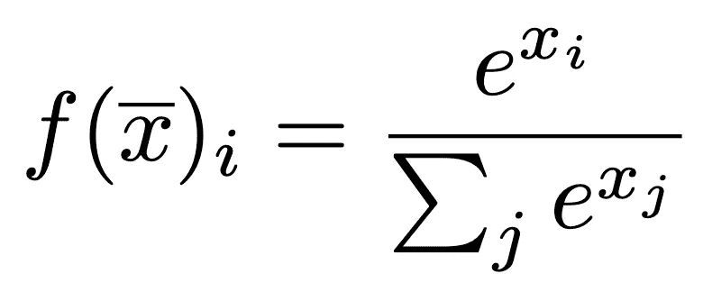
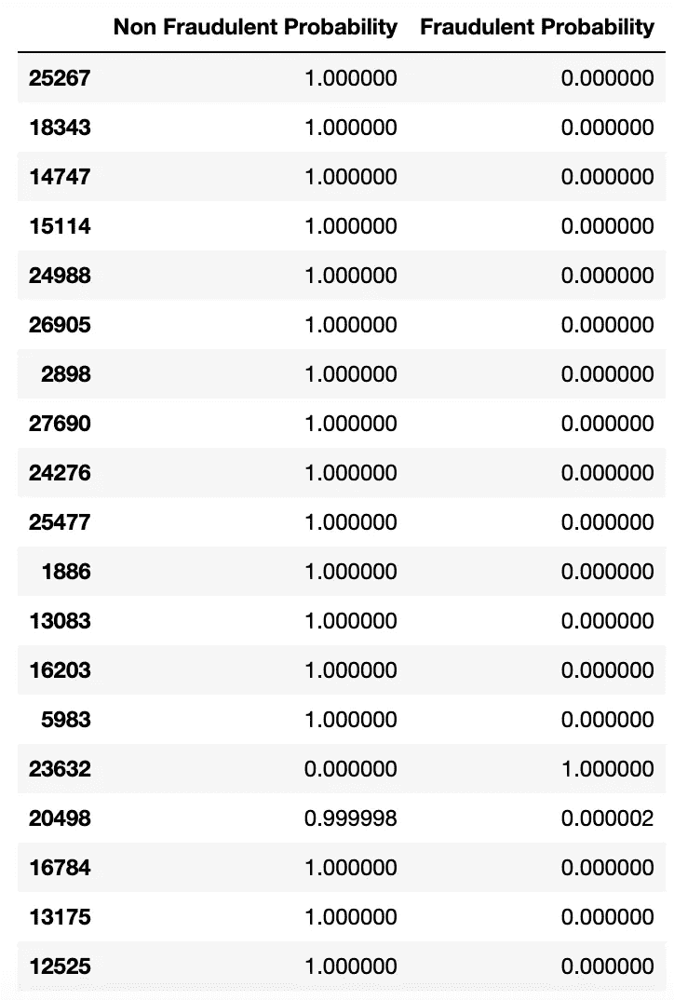
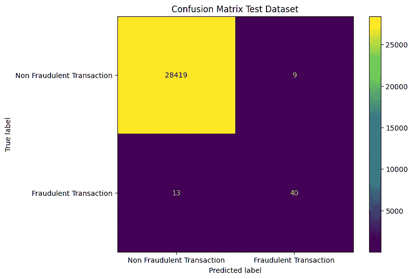
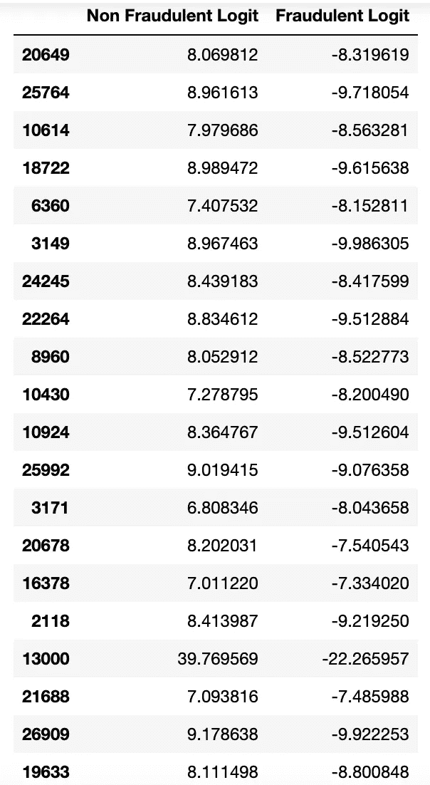
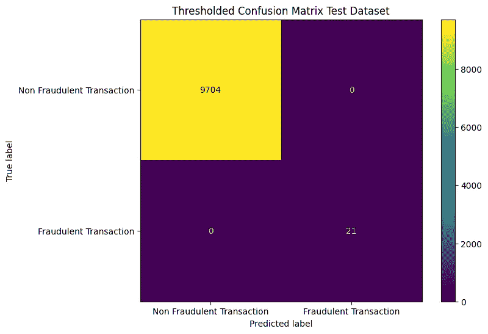

# 掌握模型不确定性：深度学习中的阈值技术

> 原文：[`towardsdatascience.com/mastering-model-uncertainty-thresholding-techniques-in-deep-learning-1f1ab3912fd1?source=collection_archive---------4-----------------------#2024-12-30`](https://towardsdatascience.com/mastering-model-uncertainty-thresholding-techniques-in-deep-learning-1f1ab3912fd1?source=collection_archive---------4-----------------------#2024-12-30)

图像由 Dall-e 生成

## 一些关于阈值处理、softmax 激活函数、引入额外标签以及关于输出激活函数的考虑事项。

 [Hampus Gustavsson](https://medium.com/@hampusg?source=post_page---byline--1f1ab3912fd1--------------------------------)

·发布于 [Towards Data Science](https://towardsdatascience.com/?source=post_page---byline--1f1ab3912fd1--------------------------------) ·6 分钟阅读·5 天前

--

在许多现实世界的应用中，机器学习模型并不是为了以“全有或全无”的方式做出决策。相反，存在一些情形，模型标记某些预测以供人工审查会更为有益——这一过程称为“人类参与”方法。这种方法在高风险场景中尤其有价值，例如欺诈检测，在这些场景中，假阴性（漏检）带来的成本非常高。通过在模型不确定或遇到复杂案例时允许人工干预，企业可以确保更加细致和准确的决策。

在本文中，我们将探讨如何在深度学习环境中实现一种用于管理模型不确定性的技术——阈值处理。阈值处理帮助确定模型何时足够自信以自主做出决策，何时应该将决策交给人工判断。我们将使用一个现实世界的例子来说明其潜力。

在本文的结尾，目标是为技术团队和业务利益相关者提供一些关于建模、阈值策略以及自动化与人工监督之间平衡的决策建议和启发。

# 商业案例：通过信心检测欺诈交易

为了说明阈值化在现实情况中的价值，我们来考虑一个金融机构检测欺诈交易的案例。我们将使用 [Kaggle 欺诈检测数据集](https://www.kaggle.com/datasets/mlg-ulb/creditcardfraud/data)（DbCL 许可），该数据集包含匿名化的交易数据和欺诈活动标签。金融机构处理大量交易，手动审核每一笔交易非常困难。我们希望开发一个系统，既能准确标记可疑交易，又能最大限度减少不必要的人工干预。

挑战在于平衡精度和效率。阈值化是一种用于引入这种权衡的策略。通过这种策略，我们为样本空间添加了一个额外的标签——*未知*。当模型对某个特定预测不确定时，这个标签作为模型的信号，实际上是将决策推迟到人工审核。当模型缺乏足够的确定性来做出可靠预测时，将交易标记为未知可以确保只有最有信心的预测会被执行。

此外，阈值化可能还会带来另一个积极的副作用。它有助于克服潜在的技术怀疑。当模型表示不确定并在需要时将决策推迟给人工判断时，可以增强对系统的信任。在之前的项目中，这在将项目推向各个组织时非常有帮助。

# **技术和分析方面。**

我们将探讨阈值化在深度学习中的应用。然而，值得注意的是，阈值化是一种与模型无关的技术，适用于各种类型的情况，而不仅仅是深度学习。

在神经网络中实现阈值化步骤时，放在哪个层并不明显。在分类设置中，可以实现输出转换。sigmoid 函数是一种选择，但也可以使用 softmax 函数。Softmax 提供了一种非常实用的转换，使得 logits 符合某些良好的统计性质。这些性质确保了 logits 的和为 1，并且它们都在 0 和 1 之间。

Softmax 函数。图片由作者提供。

然而，在这个过程中，某些信息会丢失。Softmax 仅捕捉标签之间的相对确定性。它并没有提供任何单一标签的绝对确定性度量，这可能会导致在真实的不确定性分布更为复杂的情况下出现过度自信。这一限制在需要精确决策阈值的应用中变得尤为关键。

本文不会深入探讨模型架构的细节，因为这些内容将在未来的文章中讨论，供感兴趣的读者参考。本文使用的只是模型在进行 softmax 转换前后的输出结果，作为最终层。这里展示了输出的一个示例。

二十个预测样本，软最大（softmax）应用之后。

如图所示，输出相当均匀。没有了解 softmax 的机制时，看起来模型对于分类相当确定。但正如我们将在文章后面看到的那样，我们在这里捕捉到的强关系并非标签的真正确定性。实际上，这应当被解释为一个标签相对于其他标签的预测。在我们的例子中，这意味着模型可能会捕捉到某些标签的概率明显高于其他标签，但这并不反映模型的整体确定性。

在理解了输出的解释后，让我们探讨一下模型在实际中的表现。查看混淆矩阵。

整个未经过阈值处理的测试数据集的混淆矩阵。

模型的表现并不差，尽管远非完美。有了这些基础结果，我们将探讨如何实现阈值处理。

我们将从进入网络的一层开始——检查最终激活函数之前的值。这些值呈现出以下 logits。

二十个预测样本，软最大（softmax）变换应用之前。

在这里，我们看到更丰富的数值种类。这一层提供了模型在预测中的不确定性的更详细视图，这也是阈值层被插入的位置。

通过引入上下置信度阈值，模型仅对大约 34%的数据集进行标记，集中关注最确定的预测。然而，反过来，结果更加确定，如下所示的混淆矩阵所示。值得注意的是，阈值处理不一定是统一的。例如，某些标签可能比其他标签更难预测，标签不平衡也可能影响阈值策略。

阈值处理应用后的混淆矩阵。

**指标**。

在这种情况下，我们仅触及了阈值处理中的两个极端情况；一个是让所有预测通过（基本情况），另一个是移除所有错误预测。

根据实际经验，决定是用较高的确定性标记较少的数据点（这可能减少被标记的事务总数），还是用较低的确定性标记更多的数据点，是一个相当复杂的权衡决策。这个决策会影响操作效率，并可能受到业务优先级的影响，例如风险容忍度或操作约束。与领域专家一起讨论这个问题，是找出阈值的一个完全可行的方式。另一种方法是，如果您能够结合已知或近似的度量指标进行优化。可以通过将阈值与特定的业务指标对齐来实现，比如每个假阴性成本或操作能力。

**总结。**

总之，目标并不是丢弃 softmax 转换，因为它提供了有价值的统计特性。我们建议引入一个中间阈值层，用于筛选不确定的预测，并在必要时为未知标签留出空间。

我认为，实施的具体方式取决于手头的项目。欺诈的例子也突显了理解解决的业务需求的重要性。在这里，我们展示了一个例子，我们已经通过阈值排除了所有错误的预测，但这并非所有用例中的必需做法。在许多情况下，最佳解决方案是在准确性和覆盖率之间找到平衡。

**感谢您花时间探索这个话题。**

我希望您觉得这篇文章有用和/或富有启发。如果您有任何评论或问题，请随时与我联系。您也可以通过[LinkedIn](https://www.linkedin.com/in/hampus-gustavsson-23721a116/)与我建立联系。
