# 精通样本大小计算

> 原文：[`towardsdatascience.com/mastering-sample-size-calculations-75afcddd2ff3?source=collection_archive---------6-----------------------#2024-10-09`](https://towardsdatascience.com/mastering-sample-size-calculations-75afcddd2ff3?source=collection_archive---------6-----------------------#2024-10-09)

## A/B 测试、拒绝推断以及如何为实验获取正确的样本大小

[](https://medium.com/@lucasbraga461?source=post_page---byline--75afcddd2ff3--------------------------------)[](https://towardsdatascience.com/?source=post_page---byline--75afcddd2ff3--------------------------------) [Lucas Braga](https://medium.com/@lucasbraga461?source=post_page---byline--75afcddd2ff3--------------------------------)

·发表于 [Towards Data Science](https://towardsdatascience.com/?source=post_page---byline--75afcddd2ff3--------------------------------) ·阅读时间 17 分钟·2024 年 10 月 9 日

--

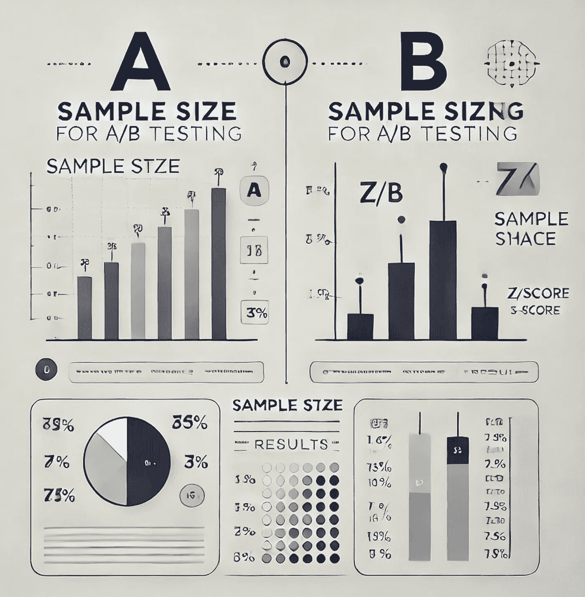

图片由作者制作

针对不同的场景，有不同的统计公式。首先要问的问题是：你是在**比较两组**数据，比如在**A/B 测试**中，还是在**从一个足够大的群体中选择样本**，以使其能够代表该群体？

后者通常用于像交易中的保留组这样的场景。这些保留组对于评估欺诈预防规则的性能或拒绝推断非常关键，在这种情况下，欺诈检测的机器学习模型会重新训练。保留组的优势在于，它包含了没有被任何规则或模型阻止的交易，从而提供了一个不偏不倚的性能视角。然而，为了确保保留组具有代表性，你需要选择一个能准确反映群体的样本大小，这一点将在本文中与 A/B 测试的样本大小一起探讨。

在确定是否**比较两组**（如 A/B 测试）或**选择一个代表性样本**（如拒绝推断）之后，下一步是定义你的成功指标。**它是一个比例还是一个绝对数值？**例如，**比较两个比例**可能涉及转化率或违约率，其中违约交易的数量除以交易总数。另一方面，**比较两个均值**适用于处理绝对值的情况，比如总收入或 GMV（商品交易总值）。在这种情况下，你会比较每个客户的平均收入，假设你的实验中存在客户级别的随机化。

# 1\. 比较两组（例如 A/B 测试）——样本大小

第 1.1 节是关于比较两个均值的，但这里提出的大多数原理在第 1.2 节中也适用。

# 1.1\. 比较两个均值（度量绝对数值的平均值）

在这种情况下，我们比较两个组：一个控制组和一个处理组。控制组由通过借贷计划获得 100 欧元信用额度的客户组成，而处理组由通过同一计划获得 200 欧元信用额度的客户组成。

实验的目标是确定是否增加信用额度会导致客户支出增加。

我们的成功度量定义为**每位客户每周的平均支出金额**，以欧元为单位。

在确立目标和成功度量后，在典型的 A/B 测试中，我们还会定义假设、随机化单元（在本例中为客户）以及目标人群（获得信用的新客户）。然而，由于本文的重点是样本量，我们将在这里不讨论这些细节。

我们将比较控制组和处理组之间的**每位客户每周的平均支出**。接下来，我们将使用以下脚本来计算这个度量：

*脚本 1：计算成功度量，分支：德国，周期：2024 年 5 月 1 日至 2024 年 7 月 31 日。*

```py
WITH customer_spending AS (
SELECT
 branch_id,
 FORMAT_DATE('%G-%V', DATE(transaction_timestamp)) AS week_of_year,
 customer_id,
 SUM(transaction_value) AS total_amount_spent_eur
FROM `project.dataset.credit_transactions`
WHERE 1=1
 AND transaction_date BETWEEN '2024-05-01' AND '2024-07-31'
 AND branch_id LIKE 'Germany'
GROUP BY branch_id, week_of_year, customer_id
)
, agg_per_week AS (
SELECT
 branch_id,
 week_of_year,
 ROUND(AVG(total_amount_spent_eur), 1) AS avg_amount_spent_eur_per_customer,
FROM customer_spending
GROUP BY branch_id, week_of_year
)
SELECT *
FROM agg_per_week
ORDER BY 1,2;
```

在结果中，我们观察到每周的度量**avg_amount_spent_eur_per_customer**。在过去的四周里，数值保持相对稳定，介于 35 欧元和 54 欧元之间。然而，考虑到过去两个月的所有周，方差较大。（请参见图像 1 作为参考。）

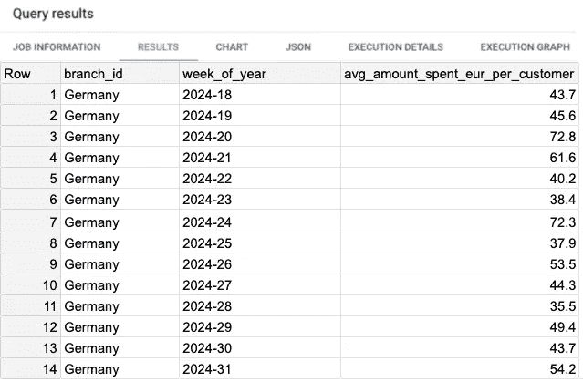

*图像 1：脚本 1 的结果。*

接下来，我们计算成功度量的方差。为此，我们将使用**脚本 2**来计算所有周的方差和平均值。

*脚本 2：查询计算成功度量的方差，并计算所有周的平均值。*

```py
WITH customer_spending AS (
SELECT
 branch_id,
 FORMAT_DATE('%G-%V', DATE(transaction_timestamp)) AS week_of_year,
 customer_id,
 SUM(transaction_value) AS total_amount_spent_eur
FROM `project.dataset.credit_transactions`
WHERE 1=1
 AND transaction_date BETWEEN '2024-05-01' AND '2024-07-31'
 AND branch_id LIKE 'Germany'
GROUP BY branch_id, week_of_year, customer_id
)
, agg_per_week AS (
SELECT
 branch_id,
 week_of_year,
 ROUND(AVG(total_amount_spent_eur), 1) AS avg_amount_spent_eur_per_customer,
FROM customer_spending
GROUP BY branch_id, week_of_year
)
SELECT
 ROUND(AVG(avg_amount_spent_eur_per_customer),1) AS avg_amount_spent_eur_per_customer_per_week,
 ROUND(VAR_POP(avg_amount_spent_eur_per_customer),1) AS variance_avg_amount_spent_eur_per_customer
FROM agg_per_week
ORDER BY 1,2;
```

**脚本 2**的结果显示方差约为 145.8（请参见图像 2）。此外，考虑到过去两个月的所有周，**每位用户的平均消费金额**为**49.5 欧元**。

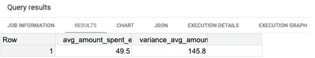

*图像 2：脚本 2 的结果。*

现在我们已经计算出度量并发现每位客户的平均每周支出约为**49.5 欧元**，我们可以定义**最小可检测效应（MDE）**。鉴于信用从 100 欧元增加到 200 欧元，我们旨在检测**10%的支出增加**，这相当于每位客户每周的新的平均值为**54.5 欧元**。

计算方差（145.8）并确定 MDE 后，我们可以将这些值代入公式中，计算所需的**样本量**。我们将使用默认值**alpha（5%）**和**beta（20%）**：

+   **显著性水平（Alpha 的默认值为α = 5%）**：Alpha 是一个预定的阈值，用作拒绝零假设的标准。Alpha 是 I 类错误（假阳性），p 值需要低于 Alpha，才能拒绝零假设。

+   **统计功效（Beta 的默认值为β = 20%）**：这是测试在替代假设为真时正确拒绝零假设的概率，即在效应存在时检测到效应。统计功效 = 1 — β，β是 II 类错误（假阴性）。

这是计算在典型的 A/B 测试场景中每组（对照组和治疗组）所需样本量的公式：

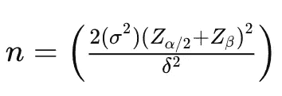

*图像 3：计算比较两个均值时样本量的公式。*

+   **n**是每组的样本量。

+   **σ²**是正在测试的度量的方差（在本例中为**145.8**）。因子 2σ²被使用，因为我们计算的是**合并方差**，这样在比较两个样本时不会产生偏差。

+   **δ（德尔塔）**表示**最小可检测的均值差异**（效应大小），即我们希望检测的变化。其计算公式为：δ² = (μ₁ — μ₂)²，其中**μ₁**是对照组的均值，**μ₂**是治疗组的均值。

+   **Zα/2**是与相应置信水平对应的**z 值**（例如，**1.96**对应于**95%置信水平**）。

+   **Zβ**是与所需测试功效相关的**z 值**（例如，**0.84**对应于**80%功效**）。

```py
n = (2 * 145.8 * (1.96+0.84)²) / (54.5-49.5)²
-> n = 291.6 * 7.84 / 25
-> n = 2286.1 / 25
-> n =~ 92
```

在我的网页应用程序计算器中尝试，[样本量计算器](https://github.com/lucasbraga461/sample-size-calculator)，如**应用截图 1**所示：

+   **置信水平**：95%

+   **统计功效**：80%

+   **方差**：145.8

+   **需要检测的差异（德尔塔）**：5（因为预期的变化是从€49.50 到€54.50）

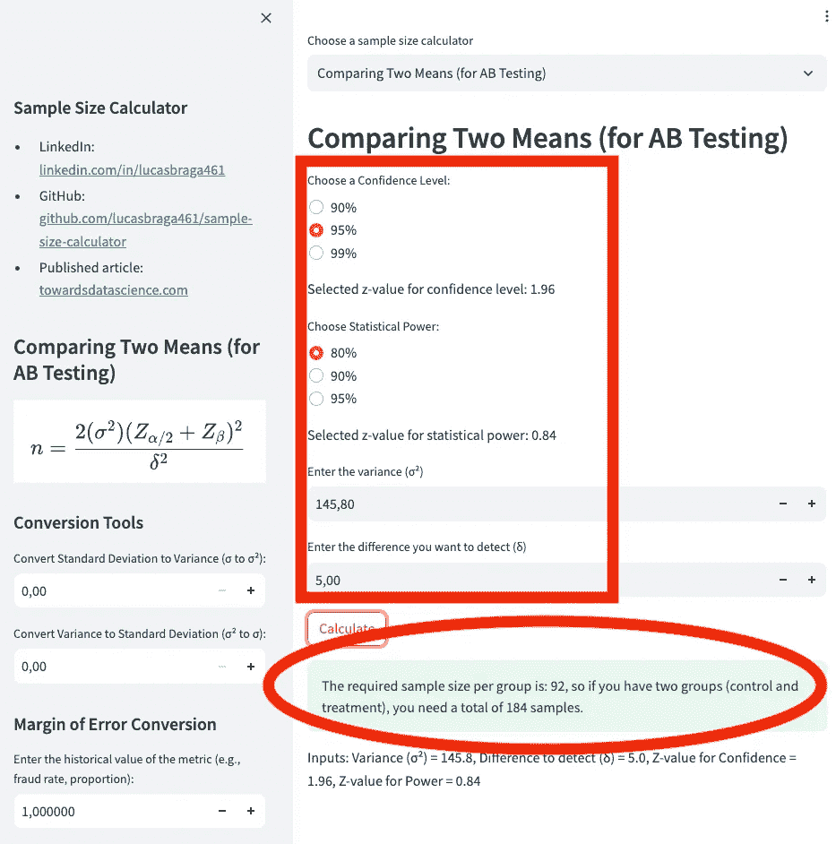

*应用截图 1：计算比较两个均值的样本量。*

根据之前的计算，我们需要**92 个用户**在对照组中，**92 个用户**在治疗组中，总共需要**184 个样本**。

现在，让我们探讨一下改变**最小可检测效应（MDE）**如何影响样本量。较小的 MDE 需要更大的样本量。例如，如果我们希望检测每个用户平均**€1 的增加**，而不是之前使用的**€5 的增加（10%）**，所需的样本量将显著增加。

MDE 越小，测试需要越敏感，这意味着我们需要更大的样本量才能可靠地检测到如此微小的效应。

```py
n = (2 * 145.8 * (1.96+0.84)²) / (50.5-49.5)²
-> n = 291.6 * 7.84 / 1
-> n = 2286.1 / 1
-> n =~ 2287
```

我们将以下参数输入到[样本量计算器](https://github.com/lucasbraga461/sample-size-calculator)的网页应用程序计算器中，如**应用截图 2**所示：

+   **置信水平**：95%

+   **统计功效**：80%

+   **方差**：145.8

+   **需要检测的差异（德尔塔）**：1（因为预期的变化是从€49.50 到€50.50）

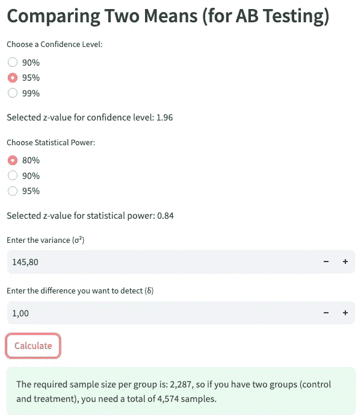

*应用截图 2：计算 Delta = 1 时比较两个均值的样本量。*

为了检测更小的效应，例如每个用户**增加 1 欧元**，我们需要**2,287 个用户**在对照组，**2,287 个用户**在处理组，总共需要**4,574 个样本**。

接下来，我们将调整**统计功效**和**显著性水平**，重新计算所需的样本量。但首先，让我们看一下**z 值表**，以了解如何推导出**z 值**。

我们已经设置了**β = 0.2**，这意味着当前的统计功效为**80%**。参考 z 值表（见**图像 4**），这对应于**z 值为 0.84**，这是我们之前公式中使用的值。

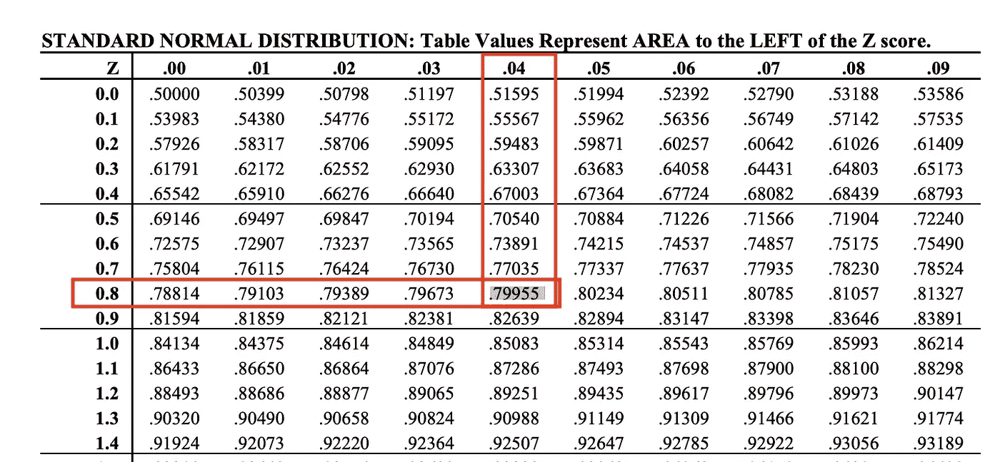

*图像 4：在 z 值表中查找统计功效为 80% 时的 z 值。*

如果我们现在将**β值调整为 10%**，即**统计功效为 90%**，我们将得到**z 值为 1.28**。该值可以在 z 值表中找到（见**图像 5**）。

```py
n = (2 * 145.8 * (1.96+1.28)²) / (50.5-49.5)²
-> n = 291.6 * 10.49 / 1
-> n = 3061.1 / 1
-> n =~ 3062
```

通过调整**β值为 10%**（统计功效为 90%）并使用**z 值为 1.28**，我们现在需要**3,062 个用户**在对照组和处理组中，每组总共**6,124 个样本**。

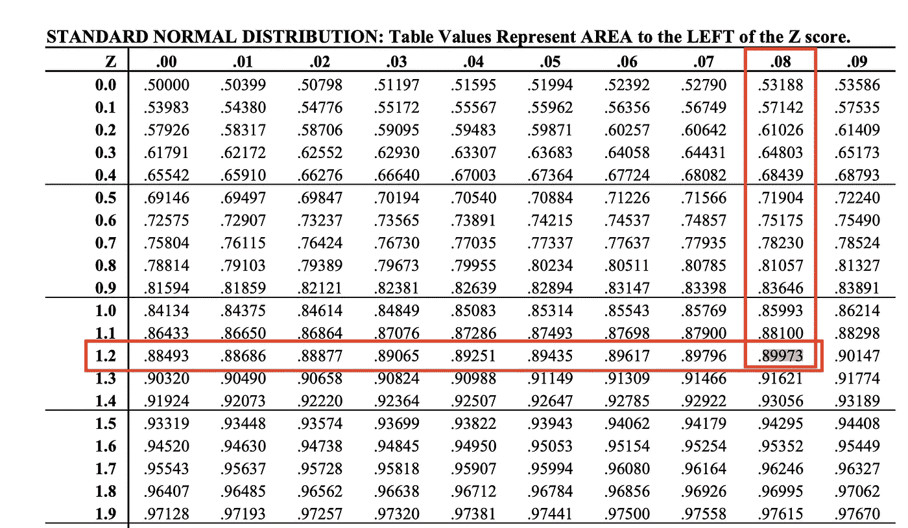

*图像 5：在 z 值表中查找统计功效为 90% 时的 z 值。*

现在，让我们来确定**6,124 个样本**所代表的流量。我们可以通过计算每周不同客户的平均交易量来得出这个数据。**脚本 3**将帮助我们获取**2024 年 5 月 1 日到 2024 年 7 月 31 日**期间的信息。

*脚本 3：计算不同客户每周平均交易量的查询。*

```py
WITH customer_volume AS (
SELECT
 branch_id,
 FORMAT_DATE('%G-%V', DATE(transaction_timestamp)) AS week_of_year,
 COUNT(DISTINCT customer_id) AS cntd_customers
FROM `project.dataset.credit_transactions`
WHERE 1=1
 AND transaction_date BETWEEN '2024-05-01' AND '2024-07-31'
 AND branch_id LIKE 'Germany'
GROUP BY branch_id, week_of_year
)
SELECT
 ROUND(AVG(cntd_customers),1) AS avg_cntd_customers
FROM customer_volume;
```

**脚本 3**的结果显示，平均每周有**185,443 个不同客户**（见**图像 5**）。因此，**6,124 个样本**大约占总每周客户基数的**3.35%**。


*图像 5：脚本 3 的结果。*

# 1.2\. 比较两个比例（例如转化率、违约率）

虽然前一节讨论的大多数原则保持不变，但比较**两种比例**的公式有所不同。这是因为，我们不再预先计算指标的方差，而是将重点放在每个组的**预期成功比例**上（见**图像 6**）。

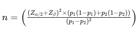

*图像 6：计算比较两种比例的样本量的公式。*

让我们回到相同的场景：我们正在比较两个组。对照组由可以获得**100 欧元信贷**的客户组成，信贷借款计划中的处理组由可以获得**200 欧元信贷**的客户组成。

这次，我们关注的成功指标是**违约率**。这可能是**1.1 节**中讨论的同一个实验的一部分，其中违约率作为**护栏指标**，也可能是完全独立的实验。无论是哪种情况，假设是给予客户更多信用可能会导致更高的违约率。

本次实验的目标是确定信用额度的增加是否会导致**更高的违约率**。

我们将成功指标定义为实验周内所有客户的**平均违约率**。理想情况下，实验应持续更长时间以收集更多数据，但如果无法实现这一点，选择一个**没有偏差的星期**就显得尤为重要。你可以通过分析过去**12 到 16 周**的违约率来验证这一点，从中找出与某些月份的特定星期相关的模式。

让我们来查看数据。**脚本 4**将显示**每周违约率**，结果可以在**图像 7**中看到。

*脚本 4：查询以获取每周违约率。*

```py
SELECT
 branch_id,
 date_trunc(transaction_date, week) AS week_of_order,
 SUM(transaction_value) AS sum_disbursed_gmv,
 SUM(CASE WHEN is_completed THEN transaction_value ELSE 0 END) AS sum_collected_gmv,
 1-(SUM(CASE WHEN is_completed THEN transaction_value ELSE 0 END)/SUM(transaction_value)) AS default_rate,
FROM `project.dataset.credit_transactions`
WHERE transaction_date BETWEEN '2024-02-01' AND '2024-04-30'
  AND branch_id = 'Germany'
GROUP BY 1,2
ORDER BY 1,2;
```

从违约率指标来看，我们注意到一些波动，尤其是在较早的几周，但过去 5 周的违约率相对稳定。过去 5 周的平均违约率为**0.070**。

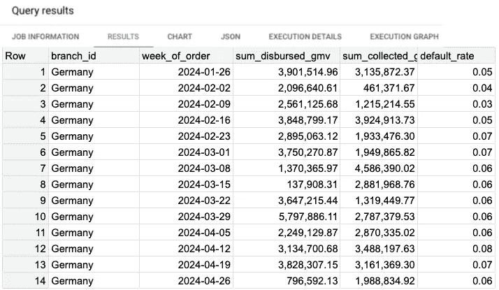

*图像 7：每周违约率的结果。*

现在，假设这个违约率代表了对照组。那么下一个问题是：在处理组中，什么样的违约率会被认为是不可接受的？我们可以设定一个阈值：如果处理组的违约率增加到**0.075**，就会被认为过高。然而，任何低于**0.0749**的违约率仍然是可以接受的。

违约率为**0.075**意味着相较于对照组的**0.070**，增加了大约**7.2%**。这个差异——7.2%——是我们的**最小可检测效应 (MDE)**。

有了这些数据点，我们现在可以计算所需的**样本大小**。

```py
n = ( ((1.96+0.84)²) * ((0.070*(1-0.070) + 0.075*(1-0.075)) ) / ( (0.070-0.075)² )
-> n = 7.84 * 0.134475 / 0.000025
-> n = 1.054284 / 0.000025
-> n =~ 42,171
```

我们将以下参数输入到[样本大小计算器](https://github.com/lucasbraga461/sample-size-calculator)的网页应用程序中，如**应用截图 3**所示：

+   **置信水平**：95%

+   **统计功效**：80%

+   **第一次比例 (p1)**：0.070

+   **第二次比例 (p2)**：0.075

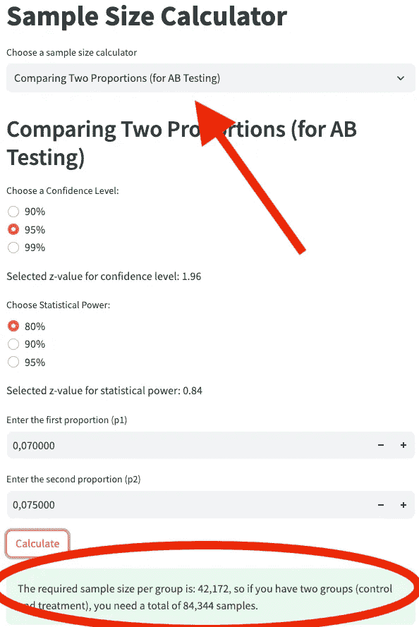

*应用截图 3：计算比较两种比例的样本大小。*

为了检测违约率的**7.2%增长**（从**0.070**到**0.075**），我们需要在对照组和处理组中各有**42,171 个用户**，因此总样本数为**84,343 个**。

样本大小为**84,343**相当大！我们可能甚至没有足够的客户来进行这个分析。但让我们探讨一下为什么会这样。我们没有改变**alpha**和**beta**的默认参数，这意味着我们将**显著性水平**保持在默认的**5%**，并将**统计功效**保持在默认的**80%**。正如我们之前讨论过的，我们本可以通过选择较低的显著性水平来减少假阳性的机会，或者我们可以提高统计功效来最小化假阴性的风险。

那么，是什么导致了如此大的样本量？是**7.2%的 MDE**吗？简短的回答是：**不完全是**。

考虑这种替代情境：我们保持相同的**显著性水平（5%）**、**统计功效（80%）**和**MDE（7.2%）**，但假设**默认比例（p₁）**是**0.23（23%）**而不是**0.070（7.0%）**。在**7.2%的 MDE**下，治疗组的新的默认比例（**p₂**）将是**0.2466（24.66%）**。注意，这仍然是**7.2%的 MDE**，但比例明显高于**0.070（7.0%）**和**0.075（7.5%）**。

现在，当我们使用这些新的值**p₁ = 0.23** 和 **p₂ = 0.2466**进行样本量计算时，结果会有所不同。接下来，我们来计算一下。

```py
n = ( ((1.96+0.84)²) * ((0.23*(1-0.23) + 0.2466*(1-0.2466)) ) / ( (0.2466-0.23)² )
-> n = 7.84 * 0.3628 / 0.00027556
-> n = 2.8450 / 0.00027556
-> n =~ 10,325
```

使用新的默认比例（**p₁ = 0.23** 和 **p₂ = 0.2466**），我们在对照组和治疗组中各需要**10,325 个用户**，总共需要**20,649 个样本**。与之前的 84,343 样本相比，这样的样本量更加可管理。然而，值得注意的是，这种情况下的默认比例处于完全不同的范围。

关键的结论是，**较低的成功率**（如接近**7%**的默认比例）需要**更大的样本量**。当比例较小的时候，检测到即使是适度的差异（比如 7.2%的增长）也变得更加困难，因此需要更多的数据才能实现相同的统计功效和显著性水平。

# 2\. 抽样一个群体

这个案例与 A/B 测试场景有所不同，因为我们现在专注于从**单一群体**中确定**样本量**。目标是选取一个能够准确代表群体的样本，从而进行分析并推断结果，进而估算整个群体可能发生的情况。

即使我们不在比较两个群体，**从群体中抽样**（一个群体）仍然需要决定你是在估算**均值**还是**比例**。这两种情况的公式与 A/B 测试中使用的公式非常相似。

看一下**图像 8**和**图像 9**。当你将**图像 8**与**图像 3**（比较两个均值的样本量公式）进行对比，或者将**图像 9**与**图像 6**（比较两个比例的样本量公式）进行对比时，你是否注意到了相似之处？它们确实非常相似。

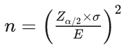

*图像 8：用于估算总体均值的样本量公式。*

在估算均值的情况下：

+   从图像 8 中，抽样自单一组的公式则使用了**E**，表示**误差**。

+   从图像 3 中，比较两组的公式使用了**delta (δ)** 来比较两者均值之间的差异。

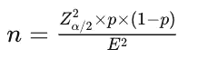

*图像 9：用于估算总体比例的样本量公式。*

在估算比例的情况下：

+   从图像 9 可以看出，单组抽样的比例公式也使用了**E**，代表**误差**。

+   从图像 6 中，比较两组的公式使用了**MDE（最小可检测效应）**，类似于差值，用于比较两种比例之间的差异。

那么，我们什么时候使用这些公式呢？让我们探讨两个实际例子——一个用于估算**均值**，另一个用于估算**比例**。

# 2.1\. 抽样总体 — 估算均值

假设你希望更好地评估**欺诈风险**，为此，你打算估算每个国家每周的**欺诈交易平均订单值**。这可能相当具有挑战性，因为理想情况下，大多数欺诈交易已经被阻止。为了获得更清晰的图像，你将采用一个**保留组**，它不受任何规则和模型的影响，作为计算欺诈交易的真实平均订单值的参考。

假设你选择了一个特定的国家，并在回顾历史数据后发现：

+   该指标的方差为**€905**。

+   欺诈交易的平均订单值为**€100**。

    （你可以参考**脚本 1 和 2**来计算成功指标和方差。）

由于方差为**€905**，**标准差**（方差的平方根）约为**€30**。现在，使用**5%的显著性水平**，对应的**z-score 为 1.96**，并假设你能接受**10%的误差范围**（代表**€10**的误差，或是€100 的 10%），那么在 95%的**置信区间**下，意味着在正确的样本量下，你可以**95%的置信度**断言平均值落在**€90 到€110**之间。

现在，将这些输入值代入样本量公式：

```py
n = ( (1.96 * 30) / 10 )²
-> n = (58.8/10)²
-> n = 35
```

我们将以下参数输入到网页应用计算器中，在[样本量计算器](https://github.com/lucasbraga461/sample-size-calculator)中，如**应用截图 4**所示：

+   **置信水平**：95%

+   **方差**：905

+   **误差**：10

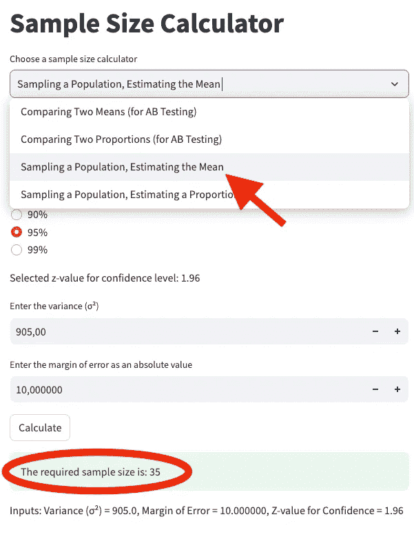

*应用截图 4：在抽样一个总体时，计算估算均值的样本量。*

结果是，你需要**35 个样本**来估算每个国家每周的**欺诈交易平均订单值**。然而，这还不是最终的样本量。

由于欺诈交易相对较少，你需要调整**欺诈交易的比例**。如果欺诈交易的比例为**1%**，那么你需要收集的实际样本数量为：

```py
n = 35/0.01
-> n = 3500
```

因此，你需要 3,500 个样本，以确保欺诈交易得到适当的代表。

# 2.2. 抽样总体——估计一个比例

在这种情况下，我们的欺诈规则和模型已经阻止了大量交易。为了评估我们的规则和模型的效果，我们需要让一部分流量绕过规则和模型，以便评估**实际的假阳性率**。这部分未经过滤的交易被称为**留存组**。这是欺诈数据科学团队中的常见做法，因为它既能评估规则和模型的表现，又能将留存组用于**拒绝推断**。

尽管我们在这里不会详细讨论拒绝推断，但值得简要总结一下。**拒绝推断**涉及使用未被阻止的交易的留存组数据，学习有助于改进交易阻止决策的模式。对此有多种方法，其中**模糊增强**是一种流行的方法。其基本思路是使用留存组的数据重新标记之前被拒绝的交易，并用这些数据训练新的模型。在欺诈建模中，这尤其重要，因为欺诈率通常较低（通常低于 1%，有时甚至低于 0.1%）。增加标记数据可以显著提升模型表现。

现在我们明白了估计**比例**的需求，接下来我们将深入探讨一个实际应用案例，看看需要多少样本。

对于某一分支，你分析历史数据发现该分支每月处理**50,000,000 个订单**，其中**50,000 个订单是欺诈的**，导致**0.1%的欺诈率**。使用**5%的显著性水平（alpha）**和**25%的误差范围**，我们旨在估计真实的欺诈比例，置信区间为**95%**。这意味着，如果真实的欺诈率为**0.001（0.1%）**，我们估计的范围应在**0.00075**和**0.00125**之间，错误为**0.00025**。

请注意，误差范围（margin of error）和错误（Error）是两个不同的概念，误差范围是一个百分比值，而错误是一个绝对值。在欺诈率为 0.1%的情况下，如果我们的误差范围是 25%，那么它代表的错误为 0.00025。

让我们应用公式：

+   **Zα/2** = 1.96（95%置信水平的 z 值）

+   **E** = 0.00025（错误）

+   **p** = 0.001（欺诈率）

```py
Zalpha/2= 1.96 
-> (Zalpha/2)²= 3.8416
E = 0.00025
-> E² = 0.0000000625
p = 0.001

n =( 3.8416 * 0.001 * (1 - 0.001) ) / 0.0000000625
-> n = 0.0038377584 / 0.0000000625
-> n = 61,404
```

我们在[样本大小计算器](https://github.com/lucasbraga461/sample-size-calculator)的网页应用程序中输入以下参数，如**应用截图 5**所示：

+   **Confidence Level**: 95%

+   **Proportion**: 0.001

+   **Error**: 0.00025

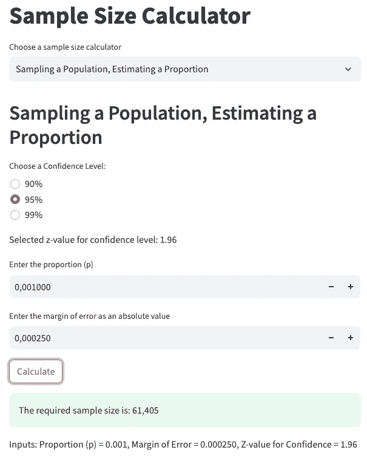

*应用截图 5：计算估算比例的样本大小，当从一个总体中抽样时。*

因此，**共需 61,404 个样本**。假设一个月内有**50,000,000 笔交易**，如果保留组代表**100%的流量**，收集这些样本将花费**不到 1 小时**。然而，这对于一个可靠的实验来说并不现实。

相反，你应该**将流量分布**到几天，以避免**季节性问题**。理想情况下，你应收集至少一周的数据，确保覆盖所有工作日，并避免假期或高峰季节。如果你需要在一周内收集**61,404 个样本**，那么你需要每天收集**8,772 个样本**。由于每日流量约为**1,666,666 个订单**，保留组每天需要代表**0.53%的总交易量**，并持续一周。

# 最后的备注

如果你想在 Python 中执行这些计算，以下是相关的函数：

```py
import math

def sample_size_comparing_two_means(variance, z_alpha, z_beta, delta):
   return math.ceil((2 * variance * (z_alpha + z_beta) ** 2) / (delta ** 2))

def sample_size_comparing_two_proportions(p1, p2, z_alpha, z_beta):
   numerator = (z_alpha + z_beta) ** 2 * ((p1 * (1 - p1)) + (p2 * (1 - p2)))
   denominator = (p1 - p2) ** 2
   return math.ceil(numerator / denominator)

def sample_size_estimating_mean(variance, z_alpha, margin_of_error):
   sigma = variance ** 0.5
   return math.ceil((z_alpha * sigma / margin_of_error) ** 2)

def sample_size_estimating_proportion(p, z_alpha, margin_of_error):
   return math.ceil((z_alpha ** 2 * p * (1 - p)) / (margin_of_error ** 2))
```

下面是如何计算与第 1.1 节中应用截图 1 类似的两组均值比较的样本量：

```py
variance = 145.8
z_alpha = 1.96
z_beta = 0.84
delta = 5

sample_size_comparing_two_means(
    variance=variance, 
    z_alpha=z_alpha, 
    z_beta=z_beta, 
    delta=delta
)
# OUTPUT: 92
```

这些功能也可以在 GitHub 仓库中找到：[GitHub 样本大小计算器](https://github.com/lucasbraga461/sample-size-calculator)，你还可以在那里找到交互式样本大小计算器的链接。

**免责声明**：与 Google BigQuery 作业结果相似的图像由作者创建。所示数字并非基于任何商业数据，而是为了说明目的手动生成的。SQL 脚本也是如此——它们并非来自任何企业，也都是手动生成的。然而，它们旨在**与使用**Google BigQuery**作为框架的公司可能遇到的情况**高度相似。

+   该计算器使用 Python 编写，并在 Google Cloud Run（无服务器环境）中通过 Docker 容器和 Streamlit 部署，参考请见[GitHub 上的代码](https://github.com/lucasbraga461/sample-size-calculator)。
