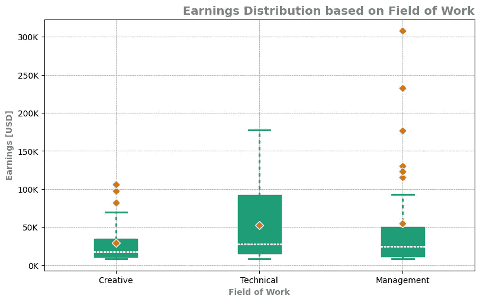

# Matplotlib：通过 rcParams 让你的绘图生活更轻松

> 原文：[`towardsdatascience.com/matplotlib-make-your-plotting-life-easier-with-rcparams-d88f202fa83c?source=collection_archive---------3-----------------------#2024-02-21`](https://towardsdatascience.com/matplotlib-make-your-plotting-life-easier-with-rcparams-d88f202fa83c?source=collection_archive---------3-----------------------#2024-02-21)

## 可视化

## 使用更少的代码和最小的努力，创建始终美观的图表

 [Mike Clayton](https://medium.com/@maclayton?source=post_page---byline--d88f202fa83c--------------------------------)

·发表于 [Towards Data Science](https://towardsdatascience.com/?source=post_page---byline--d88f202fa83c--------------------------------) ·阅读时间 18 分钟 ·2024 年 2 月 21 日

--

使用 rcParams 进行样式设置的箱型图 — 图片来源：作者

**Matplotlib 无疑是一个强大且可扩展的绘图库，但它也可能令人沮丧，因为它复杂且，特别是，非常冗长。**

**rcParams（运行时配置参数）提供了一种将一些冗余代码提取到配置文件中的方式。这样可以显著减少重复代码，并且使得绘图始终保持美观且布局良好。它还使得你的设置和样式可以复制，并且在项目之间轻松传递。**

# 介绍

正如我在上一篇文章中提到的，文章比较了 Matplotlib 和一些其他流行的绘图库（如 Seaborn 或 plotnine）：

> 它[Matplotlib] 在数据科学领域相当普及，可以公平地说，很多人对它有一种爱恨交织的关系。它非常灵活，但也可能变得相当复杂。
> 
> -我在上一篇文章中

“相当复杂”可以指很多事情。特别是，变得非常明显的是，所有其他库都在一个方面做得比 Matplotlib 更好。它们都能生成相当…
