# 最大化节省未使用的 Fabric 容量

> 原文：[`towardsdatascience.com/maximize-savings-on-your-unused-fabric-capacity-4c74b12505fd?source=collection_archive---------16-----------------------#2024-07-29`](https://towardsdatascience.com/maximize-savings-on-your-unused-fabric-capacity-4c74b12505fd?source=collection_archive---------16-----------------------#2024-07-29)

## 使用 Azure Logic Apps 自动化您的 Microsoft Fabric 容量状态

[](https://chrystasantos.medium.com/?source=post_page---byline--4c74b12505fd--------------------------------)[](https://towardsdatascience.com/?source=post_page---byline--4c74b12505fd--------------------------------) [Christabelle Santos](https://chrystasantos.medium.com/?source=post_page---byline--4c74b12505fd--------------------------------)

·发表于 [Towards Data Science](https://towardsdatascience.com/?source=post_page---byline--4c74b12505fd--------------------------------) ·阅读时间 9 分钟·2024 年 7 月 29 日

--

*免责声明：本文不涉及 Microsoft Fabric 是什么或如何使用它。*

> [Fabric](https://learn.microsoft.com/en-gb/fabric/get-started/microsoft-fabric-overview) 是一个统一的数据平台，提供共享的体验、架构、治理、合规性和计费。容量提供了驱动所有这些体验的计算能力。您可以在[这里](https://blog.fabric.microsoft.com/en-US/blog/fabric-capacities-everything-you-need-to-know-about-whats-new-and-whats-coming/)阅读更多关于 Fabric 容量的信息。

想象一下：您的 Fabric 试用期快要结束，而您仍然处于概念验证阶段，正在确定 Fabric 是否是适合您的选项。有效管理您的容量至关重要，因为您不希望在这些测试或评估期间为未使用的容量承担不必要的成本。


图片来源：[Carlos Muza](https://unsplash.com/@kmuza?utm_content=creditCopyText&utm_medium=referral&utm_source=unsplash) 于 [Unsplash](https://unsplash.com/photos/laptop-computer-on-glass-top-table-hpjSkU2UYSU?utm_content=creditCopyText&utm_medium=referral&utm_source=unsplash)

如果你已经在生产工作负载中使用 Fabric，本篇文章讨论的策略对你不适用，因为你可能需要始终保持一些可用容量来支持这些工作负载。你可能更感兴趣的是了解[Fabric 中的平滑和限流过程是如何工作的](https://learn.microsoft.com/en-us/fabric/data-warehouse/compute-capacity-smoothing-throttling)，以便估算成本，以及[如何使用容量度量应用程序进行监控](https://learn.microsoft.com/en-us/fabric/enterprise/metrics-app)。

对于仍在非生产环境中工作的你们，我将展示如何在不需要时自动暂停 Fabric 容量。如果你正在测试功能，但不会全天候进行测试，这特别有用。那么，如何确保你不会忘记暂停容量呢？

你可能会想，暂停 Fabric 容量是什么意思？这甚至可能吗？答案是肯定的，我会向你展示如何操作。

当我们在[Azure 门户中创建 Fabric 容量](https://learn.microsoft.com/en-us/fabric/enterprise/buy-subscription#buy-an-azure-sku)时，我们会看到类似的界面，其中你可以选择暂停容量，这样就不会因为不使用而被收费。

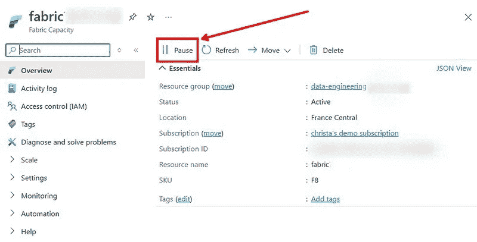

但是，如果你忘记暂停它几天怎么办？

这可能会导致 Azure 账单显著增加。为了防止这种情况发生，我们将创建一种自动化的方式来暂停你的 Fabric 容量。

## Azure Logic Apps 来帮忙

为了实现这一目标，我们将首先在 Azure 中创建一个逻辑应用程序，最好是在与你的 Fabric 容量相同的资源组中创建。

你可以参考[这里](https://learn.microsoft.com/en-us/azure/logic-apps/quickstart-create-example-consumption-workflow#create-a-consumption-logic-app-resource)的说明来创建你的逻辑应用程序。务必选择`**Consumption**`计划类型，而不是`**Standard**`计划类型，因为对于初学者来说，使用`**Consumption**`计划更为简单，而且你只需为实际使用的部分付费。

在开始设计逻辑应用程序之前，我们需要授予逻辑应用程序修改 Fabric 容量状态的权限，因为安全性至关重要。为此，进入逻辑应用程序的`**设置 > 身份**`选项，并启用系统分配的托管身份。

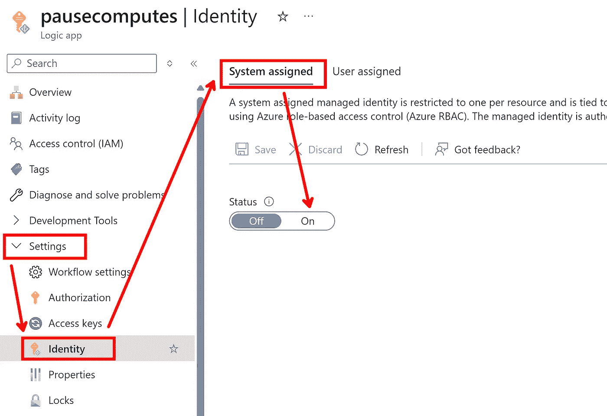

托管身份提供了一种自动管理的身份，在 Entra ID 中供应用程序在连接支持 Entra ID 认证的资源时使用，无需在代码中存储凭据。这将使新创建的逻辑应用程序能够安全地与您的 Fabric 容量交互，而无需显式凭据。

启用托管身份后，我们需要为该身份授予对 Fabric 容量的读写权限。为此，我们将返回到我们的 Fabric 容量资源。

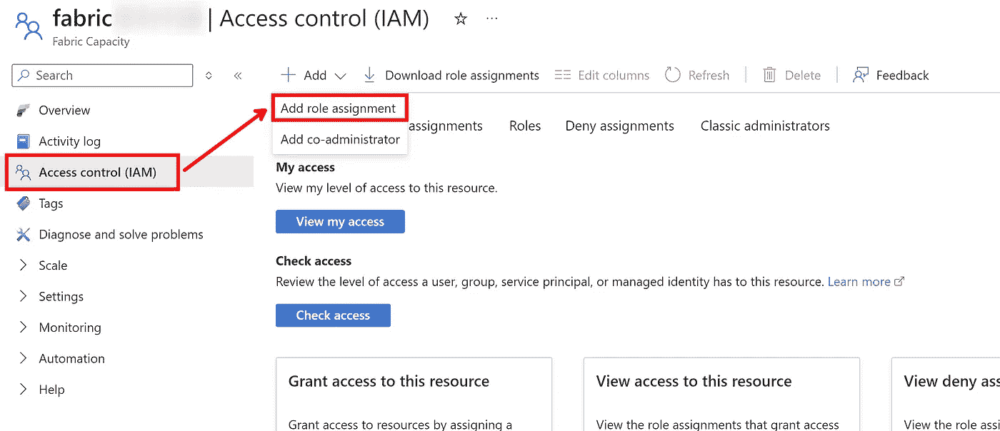

在`**Add Role Assignment**`页面，选择`**Contributor**`角色，位于`**Privileged administrator roles**`下，因为此角色提供对 Fabric 容量的读写访问权限。然后，点击`**Next**`。

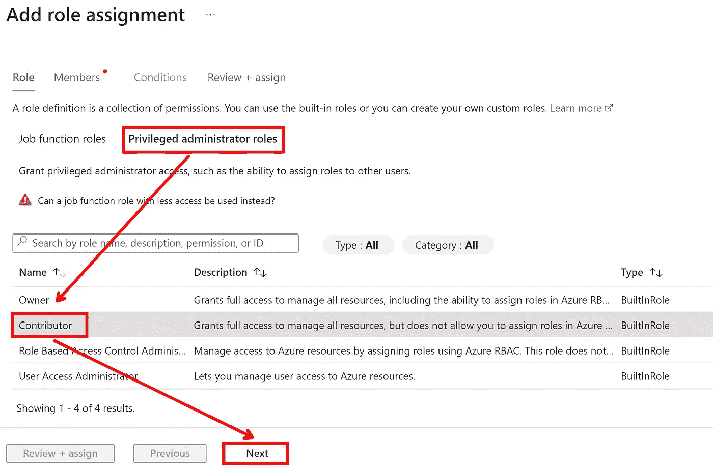

在下一页，选择您的 Logic App 的托管身份。确保它出现在`**Selected members**`下，然后点击`**Select**`，接着点击`**Next**`。在最后一页，简单地点击`**Review + assign**`。

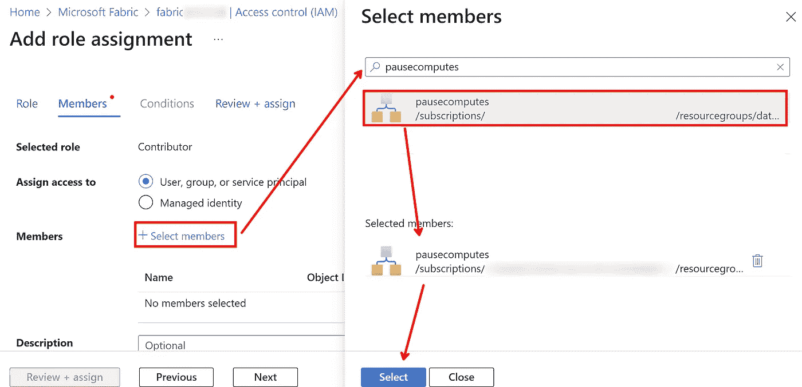

这样，我们就成功地为 Logic App 授予了执行任务所需的权限！现在，开始吧。我们有五个简单的步骤来构建这个工作流，最好按顺序执行。

# 设计 Logic App

首先，导航到`**Logic app designer**`，它位于您的 Logic App 资源的`**Development Tools**`设置下。

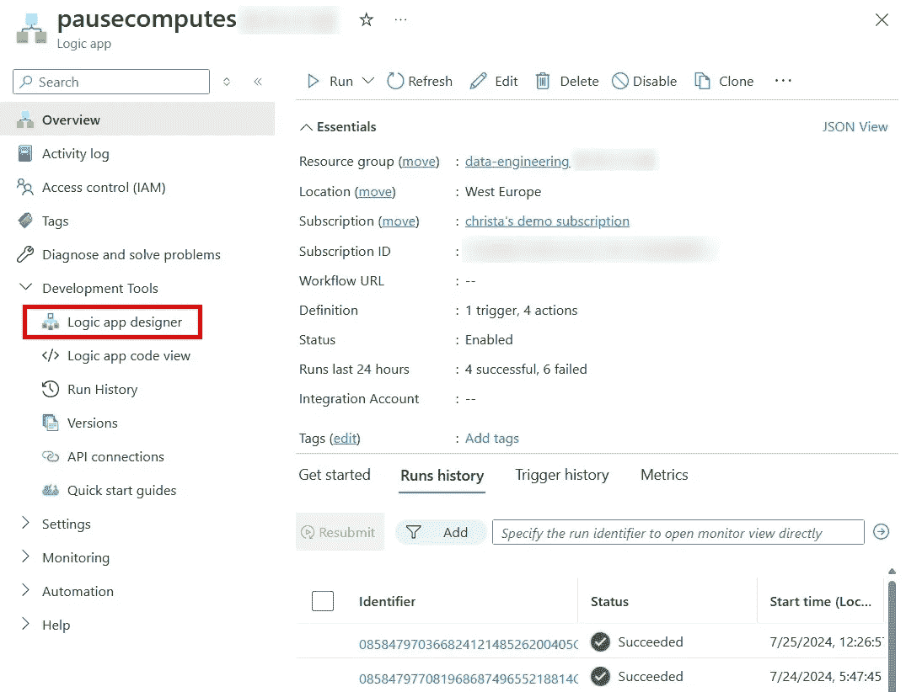

## 创建参数

在我们开始添加触发器和操作之前，我们需要定义一些参数，这些参数将在稍后的 HTTP 请求操作中使用。

我们需要按照下面提到的方式构建我们的参数，将`your-subscription-id`、`your-resource-group-name`和`your-fabric-capacity-name`替换为对应的订阅 ID、资源组名称和 fabric 容量名称值。第一个参数是获取您 Fabric 容量状态的：

```py
Name          : $getfabricstatus
Type          : String 
Default Value : https://management.azure.com/subscriptions/your-subscription-id/resourceGroups/your-resource-group-name/providers/Microsoft.Fabric/capacities/your-fabric-capacity-name?api-version=2023-11-01
```

第二个参数是暂停您的 Fabric 容量：

```py
Name          : $pausefabriccapacity
Type          : String
Default Value : https://management.azure.com/subscriptions/your-subscription-id/resourceGroups/your-resource-group-name/providers/Microsoft.Fabric/capacities/your-fabric-capacity-name/suspend?api-version=2023-11-01
```

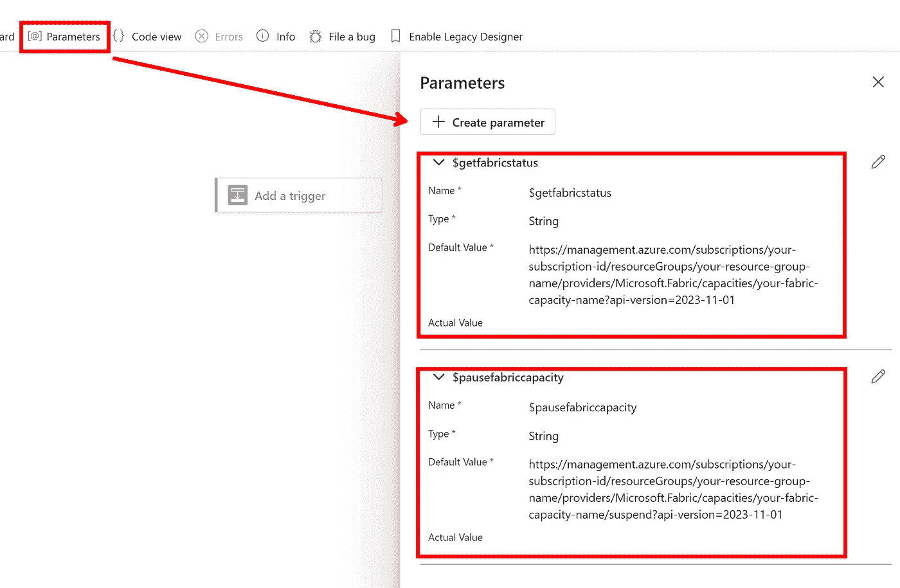

确保在此阶段保存 Logic App 设计，以确保您的参数已保存。

## **创建定期调度触发器**

一旦我们创建了参数，就可以开始设计我们的 Logic App。当我们创建一个 Logic App 时，我们通常从添加触发器开始。触发器定义了 Logic App 运行的频率。您可以将其设置为每天、每周或任何适合您的需求的间隔。这确保了 Logic App 会在定期间隔检查您的 Fabric 容量状态。

为此，点击画布中心的`**Add Trigger**`按钮，如下图所示。

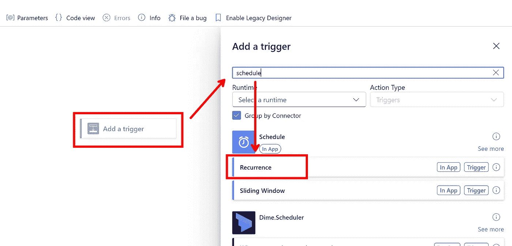

`**Add a trigger**`面板将打开在页面的右侧。在这里，您可以搜索“Schedule”触发器，并从两个可选项中选择`**Recurrence**`。

然后，您可以根据自己的偏好填写所请求的信息。在下面的图像中，我已设置一个定期触发器，使其在工作日（周一至周五）每天中午 12:00 和下午 6:00（根据我的时区）激活。

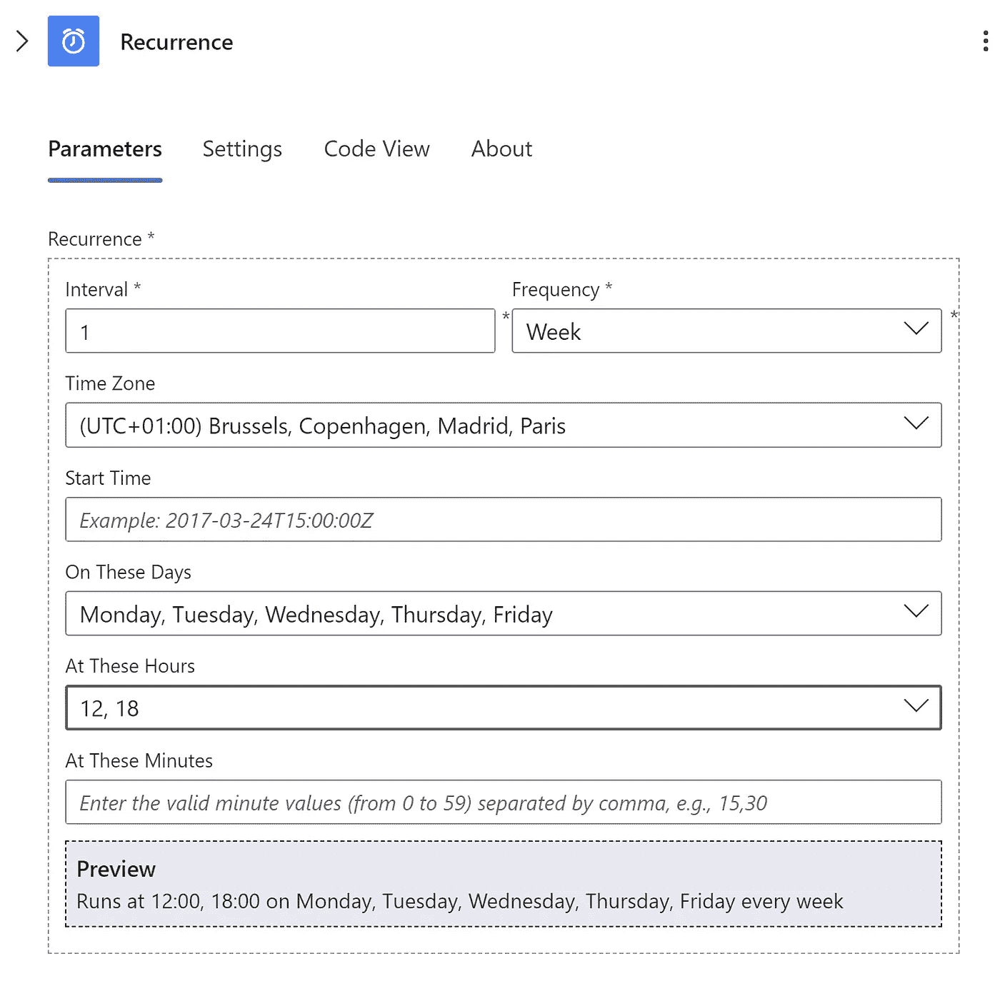

## **添加 HTTP 操作**

接下来，我们将添加一个 HTTP 操作。该操作将向 Fabric API 发出 HTTP 请求，以检查当前的容量状态。配置 HTTP 操作时，选择适当的方法（GET、POST 等）、URL 以及身份验证详细信息，以安全地访问 Fabric API。

记得我们创建托管身份并将其分配为贡献者角色吗？在这里，我们将利用贡献者角色提供的读取权限。

点击下面指示的`**添加操作**`，找到我们将在此步骤中使用的 HTTP 操作。

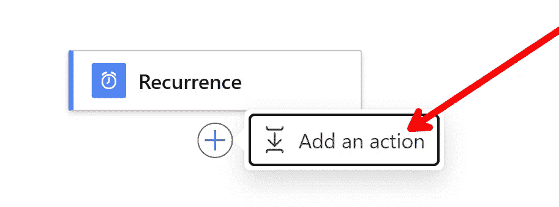

在搜索栏中搜索 HTTP 操作，然后从`**添加操作**`面板下三个 HTTP 操作中选择第一个选项。

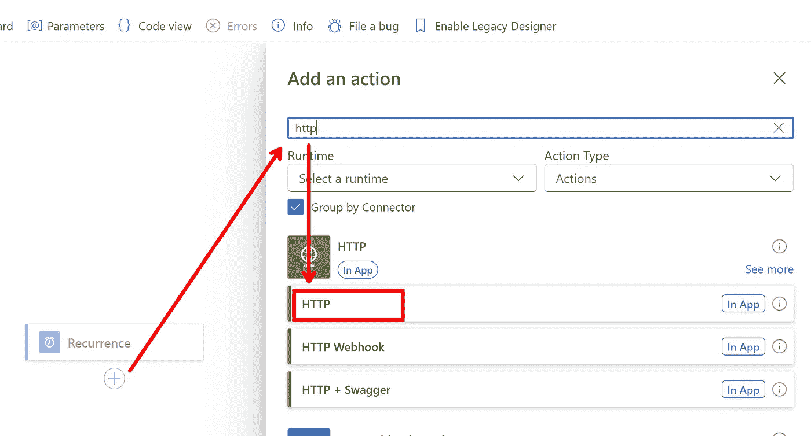

点击闪电图标打开先前创建的参数下拉列表，并选择第一个参数`$getfabricstatus`作为 URI 字段的值。在方法字段中，选择`GET`。

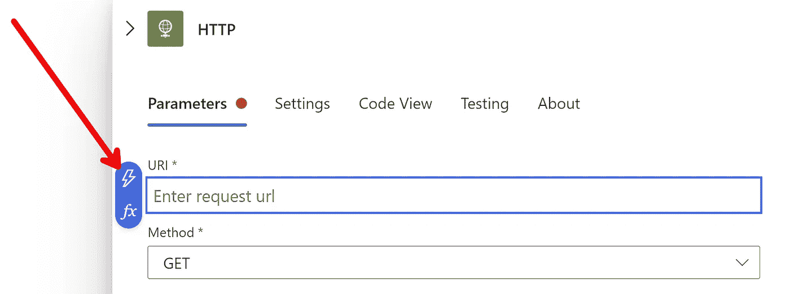

然后滚动到面板底部，在`**高级参数**`部分添加`身份验证`选项。这将在下面添加一个身份验证部分，并选择以下选项：

```py
Authentication Type : Managed Identity
Managed Identity    : System-assigned managed identity
```

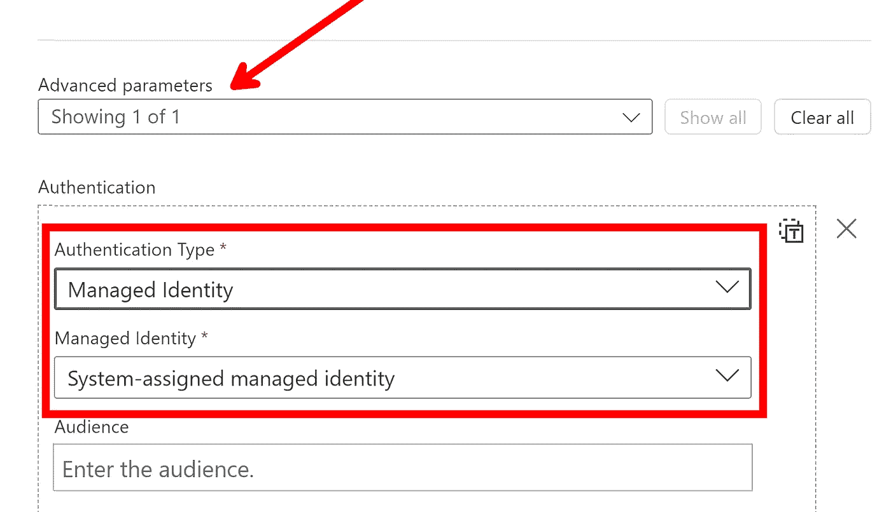

这样，我们就可以使用之前创建的托管身份安全地查询织物容量的状态。

## **添加解析 JSON 操作**

一旦收到来自 Fabric API 的响应，使用解析 JSON 操作处理数据。上一步的 API 请求将返回大量信息，我们需要选择要使用的数据点。解析 JSON 操作帮助我们从 JSON 响应中提取特定细节，例如 Fabric 容量的当前状态。

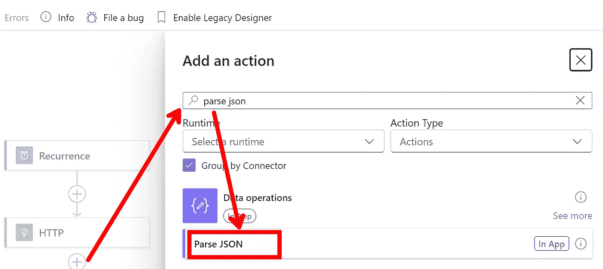

要正确配置此操作，请在`**架构**`部分提供示例 JSON 有效负载或架构，以下内容可供复制。在`**内容**`字段中，再次点击闪电图标，从上一步的输出中选择`Body`。

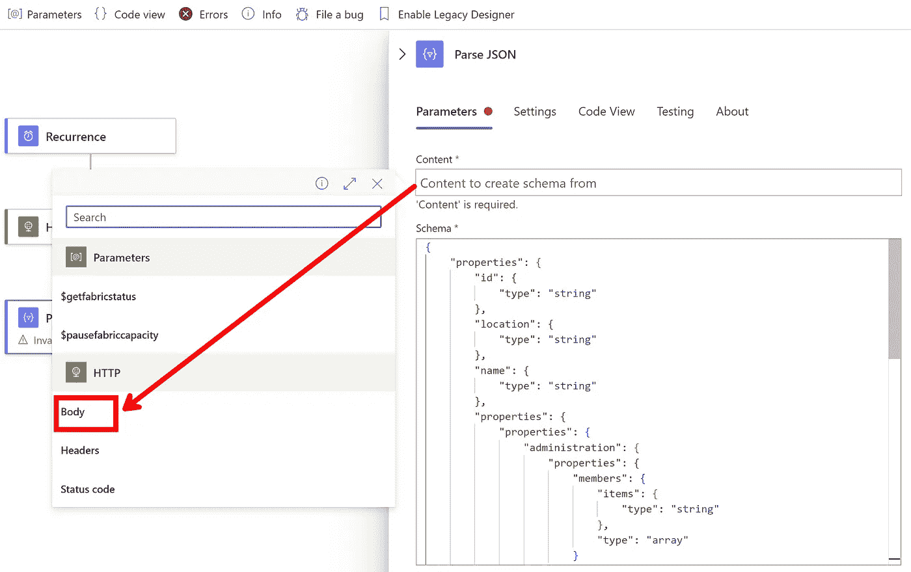

```py
Content: Body
Schema: 
{
    "properties": {
        "id": {
            "type": "string"
        },
        "location": {
            "type": "string"
        },
        "name": {
            "type": "string"
        },
        "properties": {
            "properties": {
                "administration": {
                    "properties": {
                        "members": {
                            "items": {
                                "type": "string"
                            },
                            "type": "array"
                        }
                    },
                    "type": "object"
                },
                "mode": {
                    "type": "string"
                },
                "provisioningState": {
                    "type": "string"
                },
                "state": {
                    "type": "string"
                }
            },
            "type": "object"
        },
        "sku": {
            "properties": {
                "name": {
                    "type": "string"
                },
                "tier": {
                    "type": "string"
                }
            },
            "type": "object"
        },
        "tags": {
            "properties": {},
            "type": "object"
        },
        "type": {
            "type": "string"
        }
    },
    "type": "object"
}
```

## **添加条件操作**

接下来是倒数第二个操作，我们将添加一个条件操作来评估从解析的 JSON 数据中得到的状态。这个条件将决定是否需要暂停 Fabric 容量。例如，我们将设置条件检查容量状态是否不是“暂停”。

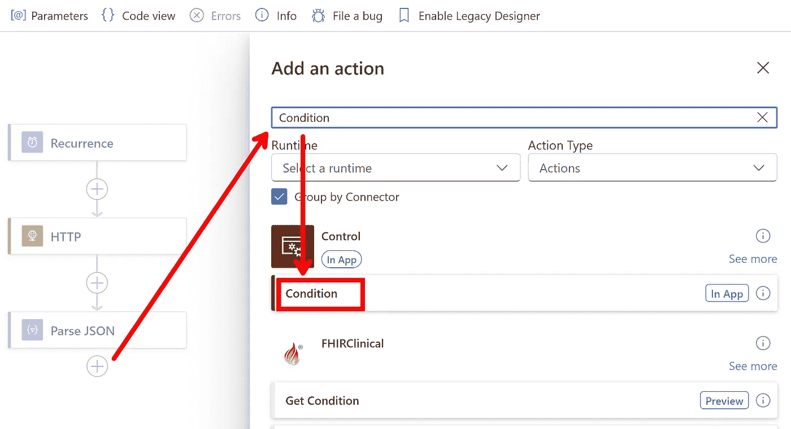

要配置条件操作，我们将再次使用闪电图标，从上一步的输出中找到`Body state`选项。

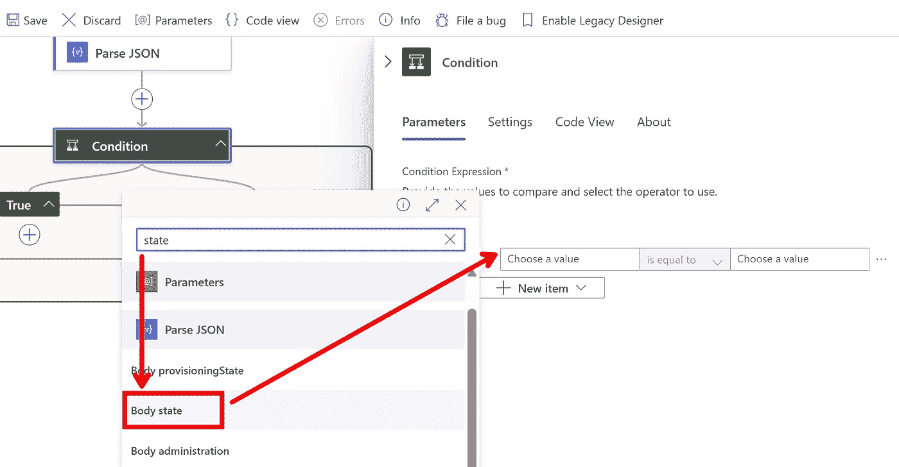

然后我们需要将`is equal to`更改为`is not equal to`并添加`Paused`值。最终结果应该如下所示：

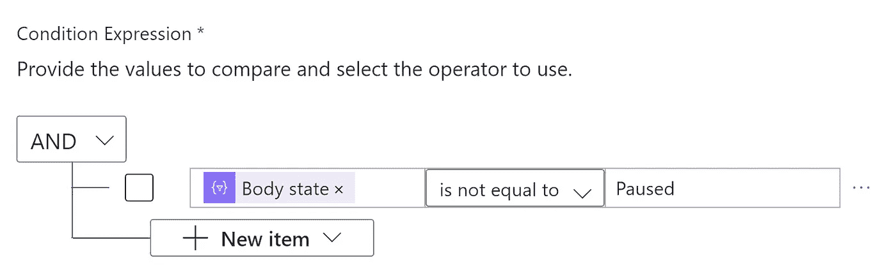

如果条件为真（即容量未暂停），你可以在 True 部分添加操作来暂停容量。如果条件为假（即容量已暂停），你可以将 False 部分留空，或者添加通知操作来记录不需要任何操作。

在我们的案例中，我们将在 True 部分添加最终的操作，这将是另一个 HTTP 操作。此操作将使用我们定义的第二个参数，`$pausefabriccapacity`。

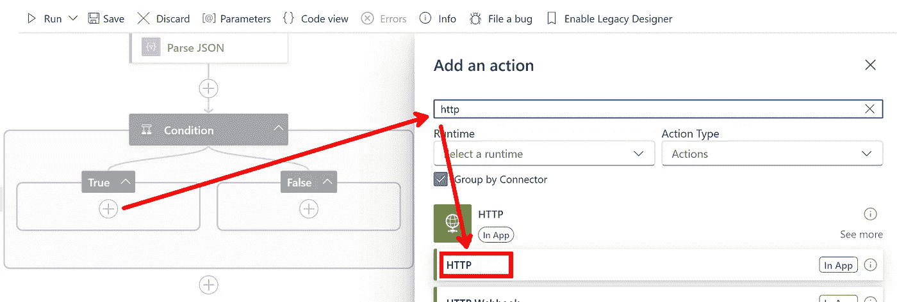

遵循与之前的 HTTP 操作相同的步骤，但这次使用`$pausefabriccapacity`参数，并选择`POST`方法而不是`GET`方法。

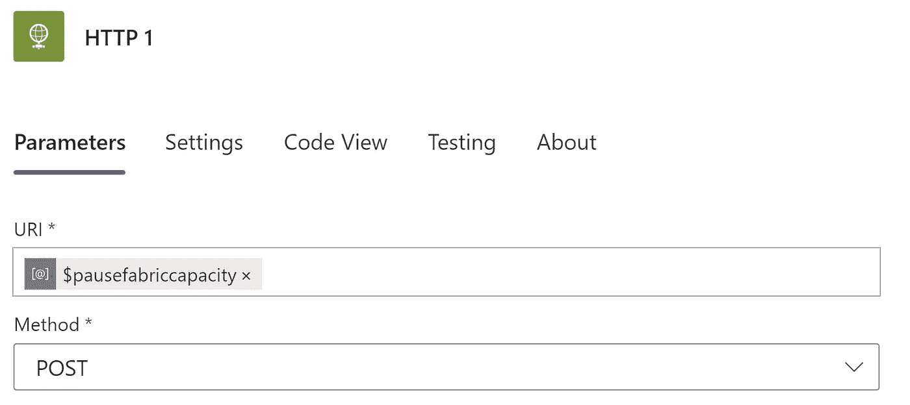

## 重要！不要忘记像上次 HTTP 操作那样更改身份验证设置，否则你可能会遇到身份验证错误。

就这样，我们完成了逻辑应用程序的设计，并在对步骤名称进行一些编辑后，我们应该拥有一个如下所示的逻辑应用程序配置。

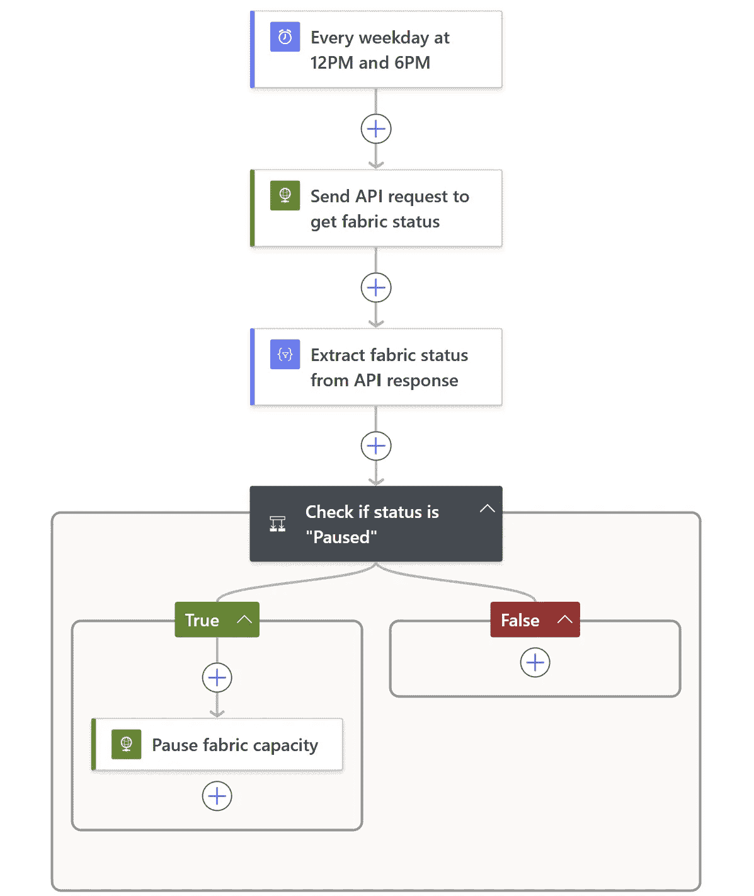

完成设置后，测试你的逻辑应用程序非常重要，以确保它按预期功能运行。进行一次测试，一旦成功执行，验证你的 Fabric 容量确实已暂停。这个确认步骤很重要，可以确保自动化正常工作，并帮助防止不必要的 Azure 费用。

通过这个设置，你现在知道如何自动化暂停你的 Fabric 容量，带给你安心并更好地控制你的容量。

祝你在使用 Fabric 进行机器学习和数据分析时一切顺利！

*注意：除非明确提到，否则所有图像均由作者拍摄。*
