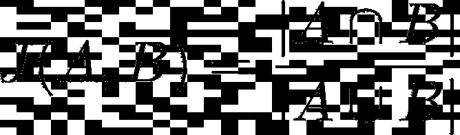
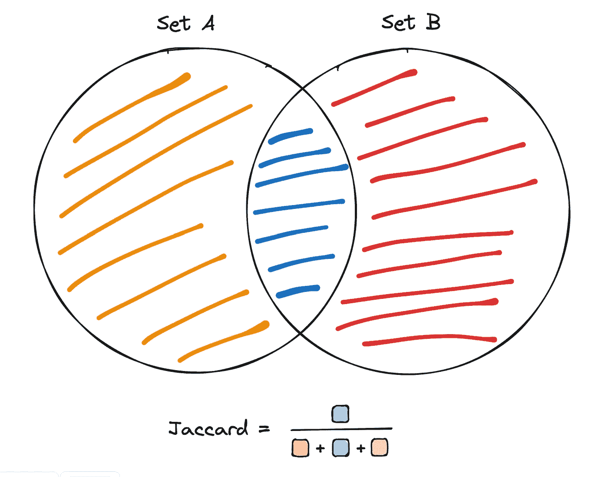
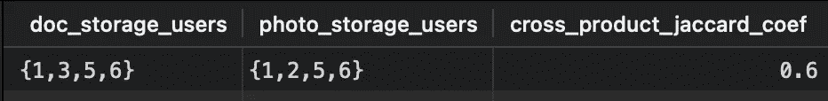
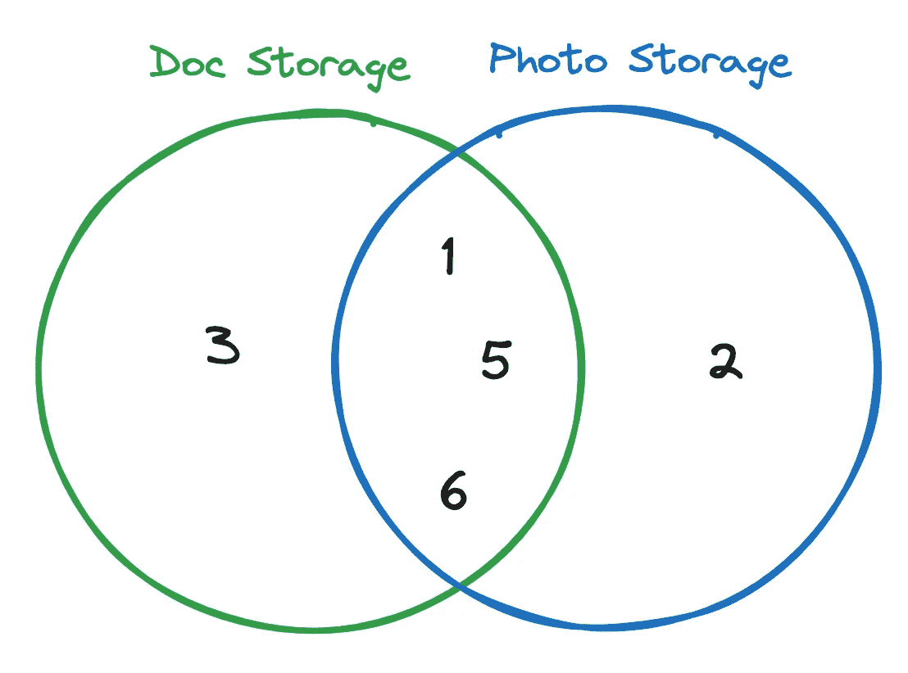
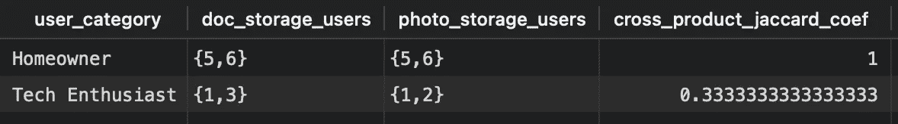
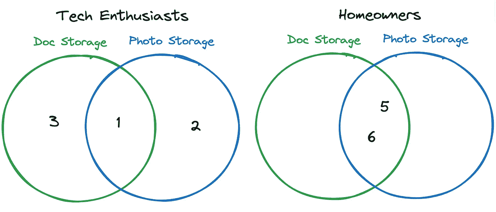

# 使用 dbt_set_similarity 测量跨产品采纳情况

> 原文：[`towardsdatascience.com/measuring-cross-product-adoption-using-dbt-set-similarity-fdf7c1f88bc2?source=collection_archive---------1-----------------------#2024-12-28`](https://towardsdatascience.com/measuring-cross-product-adoption-using-dbt-set-similarity-fdf7c1f88bc2?source=collection_archive---------1-----------------------#2024-12-28)

## 在 dbt 工作流中增强跨产品洞察

[](https://medium.com/@senick.matthew?source=post_page---byline--fdf7c1f88bc2--------------------------------)[](https://towardsdatascience.com/?source=post_page---byline--fdf7c1f88bc2--------------------------------) [Matthew Senick](https://medium.com/@senick.matthew?source=post_page---byline--fdf7c1f88bc2--------------------------------)

·发布于 [Towards Data Science](https://towardsdatascience.com/?source=post_page---byline--fdf7c1f88bc2--------------------------------) ·5 分钟阅读·2024 年 12 月 28 日

--

# 介绍

对于多产品公司，一个关键的指标通常被称为“跨产品采纳”（即了解用户如何与产品组合中的多个产品互动）。

在流行书籍 *Hacking Growth* [1] 中，建议使用一种衡量跨产品或跨特征使用情况的指标，即 **杰卡德指数**。杰卡德指数传统上用于衡量两个集合之间的相似度，也可以作为评估产品采纳模式的强大工具。它通过量化产品之间用户的重叠，帮助识别跨产品协同效应和增长机会。

dbt 包 **dbt_set_similarity** 旨在简化在分析工作流中直接计算集合相似度指标的过程。该包提供了一种方法，可以在 SQL 转换层中计算杰卡德指数。

要将此包导入到您的 dbt 项目中，请将以下内容添加到 `packages.yml` 文件中。为了本文的示例，我们还需要 dbt_utils。请在项目中运行 `dbt deps` 命令来安装该包。

```py
packages:
  - package: Matts52/dbt_set_similarity
    version: 0.1.1
  - package: dbt-labs/dbt_utils
    version: 1.3.0
```

# 杰卡德指数

杰卡德指数（Jaccard Index），也称为杰卡德相似度系数，是一种用于衡量两个集合相似度的指标。它的定义是两个集合交集的大小除以它们并集的大小。

从数学角度来看，它可以表示为：



杰卡德指数表示两个集合的“交集”与它们的“并集”的比值（图由作者提供）

其中：

+   *A* 和 *B* 是两个集合（例如，产品 A 和产品 B 的用户）

+   分子表示两个集合中元素的数量

+   分母表示两个集合中所有不同元素的总数



（图像由作者提供）

Jaccard 指数在交叉产品采用的背景下特别有用，因为：

+   它关注的是两个集合之间的重叠部分，非常适合用于理解共享的用户基础

+   它考虑了集合大小的差异，确保结果是成比例的，而不会被异常值扭曲

例如：

+   如果 100 个用户采用了产品 A，50 个用户采用了产品 B，且 25 个用户同时采用了这两个产品，那么 Jaccard 指数为 25 / (100 + 50 - 25) = 0.2，表示这两个用户群体之间有 20% 的重叠。

# 示例数据

我们将使用的示例数据集是一个虚构的 SaaS 公司，提供存储空间作为产品给消费者。该公司提供两种不同的存储产品：文档存储（*doc_storage*）和照片存储（*photo_storage*）。这些值要么为真，表示产品已被采用，要么为假，表示产品未被采用。

此外，该公司服务的用户群体（*user_category*）要么是科技爱好者，要么是房主。

为了这个示例，我们将在 dbt 项目中将此 CSV 文件作为名为 `seed_example` 的“种子”模型读取。

# 简单的交叉产品采用

现在，假设我们想要计算文档存储和照片存储产品之间的 Jaccard 指数（交叉采用）。首先，我们需要创建一个包含使用文档存储产品的用户的数组（列表），以及一个包含使用照片存储产品的用户的数组。在第二个 CTE 中，我们应用 `dbt_set_similarity` 包中的 `jaccard_coef` 函数，帮助我们轻松计算这两个用户 ID 数组之间的 Jaccard 系数。

```py
with product_users as (
    select
        array_agg(user_id) filter (where doc_storage = true)
            as doc_storage_users,
        array_agg(user_id) filter (where photo_storage = true)
            as photo_storage_users
    from {{ ref('seed_example') }}
)

select
    doc_storage_users,
    photo_storage_users,
    {{
        dbt_set_similarity.jaccard_coef(
            'doc_storage_users',
            'photo_storage_users'
        )
    }} as cross_product_jaccard_coef
from product_users
```



来自上述 dbt 模型的输出（图像由作者提供）

如我们所见，**似乎超过一半（60%）的采用了任何一个产品的用户，也采用了两个产品。** 我们可以通过将用户 ID 集合放入维恩图中来图形化验证我们的结果，在那里我们看到三位用户同时采用了这两个产品，在五位用户中占比为 3/5 = 0.6。



用户 ID 和产品采用的集合是什么样的，验证我们的结果（图像由作者提供）

# 分段交叉产品采用

使用`dbt_set_similarity`包，创建不同用户类别的分段 Jaccard 指数应该是非常自然的。我们将遵循之前的模式，然而，我们将仅仅在用户类别上对我们的聚合进行分组。

```py
with product_users as (
    select
        user_category,
        array_agg(user_id) filter (where doc_storage = true)
            as doc_storage_users,
        array_agg(user_id) filter (where photo_storage = true)
            as photo_storage_users
    from {{ ref('seed_example') }}
    group by user_category
)

select
    user_category,
    doc_storage_users,
    photo_storage_users,
    {{
        dbt_set_similarity.jaccard_coef(
            'doc_storage_users',
            'photo_storage_users'
        )
    }} as cross_product_jaccard_coef
from product_users
```



来自上述 dbt 模型的输出（图像由作者提供）

从输出结果来看，考虑到杰卡德指数，房主的跨产品采用率较高。如上所示，所有已采用其中一种产品的房主都已经采用了两种产品。与此同时，只有三分之一的科技爱好者在采用一种产品后也采用了两种产品。因此，在我们这个非常小的数据集中，房主的跨产品采用率高于科技爱好者。

我们可以通过再次绘制韦恩图来图形化验证输出结果：



按照两个细分市场划分的韦恩图（图片由作者提供）

# 结论

**dbt_set_similarity** 提供了一种直接在 dbt 工作流中计算跨产品采用指标（例如杰卡德指数）的简单有效方法。通过应用此方法，**多产品公司可以深入了解用户行为和产品组合中的采用模式**。在我们的示例中，我们演示了整体跨产品采用率的计算，以及对不同用户类别的细分采用情况。

使用该包进行跨产品采用分析只是其中一种直接的应用。实际上，这种技术有无数其他潜在应用，例如：

+   功能使用分析

+   营销活动影响分析

+   支持分析

此外，**这种分析方式显然不仅限于 SaaS**，几乎可以应用于任何行业。祝你使用杰卡德指数愉快！

## 参考文献

[1] Sean Ellis 和 Morgan Brown， [Hacking Growth](https://www.amazon.ca/Hacking-Growth-Fastest-Growing-Companies-Breakout/dp/045149721X)（2017 年）

## 资源

[dbt 包中心](https://hub.getdbt.com/Matts52/dbt_set_similarity/latest/)
