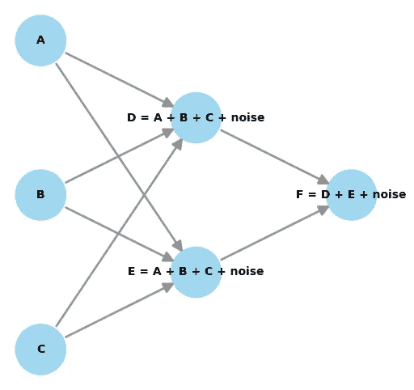

# 衡量你市场营销活动的内在因果影响

> 原文：[`towardsdatascience.com/measuring-the-intrinsic-causal-influence-of-your-marketing-campaigns-aa8354c26b7b?source=collection_archive---------1-----------------------#2024-06-02`](https://towardsdatascience.com/measuring-the-intrinsic-causal-influence-of-your-marketing-campaigns-aa8354c26b7b?source=collection_archive---------1-----------------------#2024-06-02)

## 因果 AI，探索因果推理与机器学习的结合

[](https://medium.com/@raz1470?source=post_page---byline--aa8354c26b7b--------------------------------)[](https://towardsdatascience.com/?source=post_page---byline--aa8354c26b7b--------------------------------) [Ryan O'Sullivan](https://medium.com/@raz1470?source=post_page---byline--aa8354c26b7b--------------------------------)

·发表于 [Towards Data Science](https://towardsdatascience.com/?source=post_page---byline--aa8354c26b7b--------------------------------) ·阅读时间：10 分钟·2024 年 6 月 2 日

--


图片由 [Melanie Deziel](https://unsplash.com/@storyfuel?utm_source=medium&utm_medium=referral) 提供，来源于 [Unsplash](https://unsplash.com/?utm_source=medium&utm_medium=referral)

# 这篇系列文章讲的是什么？

欢迎来到我的因果 AI 系列文章，我们将在其中探索因果推理如何融入机器学习模型。你将了解在不同商业环境中的一些实际应用。

在上一篇文章中，我们探讨了*定价和促销中的非线性处理效果优化*。这次我们将讨论*衡量你的市场营销活动的内在因果影响*。

如果你错过了上一篇关于定价和促销中非线性处理效果的文章，可以点击这里查看：

[](/optimising-non-linear-treatment-effects-in-pricing-and-promotions-011ce140d180?source=post_page-----aa8354c26b7b--------------------------------) ## 定价和促销中的非线性处理效果优化

### 因果 AI，探索因果推理与机器学习的结合

towardsdatascience.com

# 介绍

在这篇文章中，我将帮助你理解如何衡量你的市场营销活动的内在因果影响。

**以下几个方面将会被涵盖：**

+   在市场营销衡量方面存在哪些挑战？

+   什么是内在因果影响？它是如何工作的？

+   一个在 Python 中的案例研究，展示了我们如何利用内在的因果影响来为营销活动提供应有的归因。

完整的笔记本可以在这里找到：

[](https://github.com/raz1470/causal_ai/blob/main/notebooks/understanding%20the%20intrinsic%20causal%20influence%20of%20your%20marketing%20campaigns.ipynb?source=post_page-----aa8354c26b7b--------------------------------) [## causal_ai/notebooks/understanding the intrinsic causal influence of your marketing campaigns.ipynb…

### 这个项目介绍了因果 AI 以及它如何推动商业价值。 - causal_ai/notebooks/understanding the…

github.com](https://github.com/raz1470/causal_ai/blob/main/notebooks/understanding%20the%20intrinsic%20causal%20influence%20of%20your%20marketing%20campaigns.ipynb?source=post_page-----aa8354c26b7b--------------------------------)

# 在营销衡量中有哪些挑战？

## 不同类型的营销活动有哪些？

组织通过营销来发展业务，获取新客户并保持现有客户。营销活动通常分为三大类：

+   品牌

+   性能

+   留存

每种活动在衡量时都有自己独特的挑战——理解这些挑战至关重要。

## 品牌活动

品牌活动的目的是在新受众中提高品牌的认知度。它们通常通过电视和社交媒体进行推广，后者通常以视频格式呈现。它们通常没有直接的行动号召，例如“我们的产品可以使用一辈子”。

测量电视广告的挑战显而易见——我们无法追踪谁看过电视广告！但当涉及到社交媒体时，我们也面临类似的挑战——如果我在 Facebook 上观看一个视频，然后在第二天自发访问网站并购买了产品，我们很可能无法将这两个事件关联起来。

还有一个次要的挑战是延迟效应。当在新受众中提高品牌认知度时，可能需要几天、几周甚至几个月才能让他们考虑购买你的产品。

有人争论品牌活动完成了所有艰难的工作——然而，在营销衡量中，它们常常被低估，因为我们上面提到的一些挑战。

## 绩效活动

一般来说，绩效活动是面向已经在市场上寻找你产品的顾客的。它们通过付费搜索、社交和联盟渠道进行推广。它们通常会有一个行动号召，例如“点击立即享受首次购买 5% 的折扣”。

当谈到绩效活动时，为什么它们很难衡量并不立即显现出来。很可能我们能将顾客点击绩效活动的事件与当天购买该产品的顾客联系起来。

但如果他们之前对这个品牌并不熟悉，他们还会点击吗？他们是怎么熟悉这个品牌的？如果我们没有展示这个广告，他们会不会还是自然而然地购买？从数据科学的角度看，这些问题很难回答！  

## 留存营销活动  

另一类营销活动是留存。这是旨在留住现有客户的营销活动。我们通常可以通过 A/B 测试来衡量这些活动。  

## 获取营销图  

通常将品牌营销和效果营销称为获取营销。如前所述，衡量品牌营销和效果营销非常具有挑战性——我们经常低估品牌营销的价值，而高估效果营销的价值。  

下图是一个激励性的（但简化的）示例，展示了获取营销的工作原理：  

  

用户生成的图像  

我们如何（公平地）估算每个节点对收入的贡献？这就是内在因果影响发挥作用的地方——让我们在接下来的章节深入了解它是什么！  

# 什么是内在因果影响，它是如何工作的？  

## 这个概念来源于哪里？  

这个概念最初在 2020 年的一篇论文中提出，并在今年更新：  

[## 通过结构保持干预量化内在因果贡献  

### 我们提出了一种因果影响的概念，描述了节点对目标的“内在”贡献部分……  

[proceedings.mlr.press](https://proceedings.mlr.press/v238/janzing24a.html?source=post_page-----aa8354c26b7b--------------------------------)  

它在 Python 包 DoWhy 的 GCM 模块中实现：  

[## 量化内在因果影响 - DoWhy 文档  

### 通过量化内在因果影响，我们回答了这个问题：上游的因果影响有多强？  

[www.pywhy.org](https://www.pywhy.org/dowhy/v0.11.1/user_guide/causal_tasks/quantify_causal_influence/icc.html?source=post_page-----aa8354c26b7b--------------------------------)

我个人最初发现这个概念很难掌握，所以在接下来的章节中，让我们一步步地分解它。  

## 因果图回顾  

在我们试图理解内在因果影响之前，了解因果图、结构因果模型（SCM）和加性噪声模型（ANM）非常重要。我在系列文章中的一篇应该能帮助你快速理解：  

[](/using-causal-graphs-to-answer-causal-questions-5fd1dd82fa90?source=post_page-----aa8354c26b7b--------------------------------) ## 使用因果图来回答因果问题  

### 因果 AI，探索因果推理与机器学习的整合  

[towardsdatascience.com  

提醒一下，因果图中的每个节点可以视为一个模型中的目标，其中它的直接父节点作为特征。通常会为每个非根节点使用加性噪声模型：


用户生成的图像

## 什么才是真正的内在因果影响？

现在我们已经回顾了因果图，让我们开始理解什么是真正的内在因果影响……

“内在”的字典定义是“自然归属”。在我脑海里，我把它想象成一个漏斗，漏斗顶端的东西做着繁重的工作——我们希望赋予它们应得的因果影响。

让我们看下面的示例图，以帮助我们进一步解开内在因果影响：



用户生成的图像

+   A、B 和 C 是根节点。

+   D 是一个非根节点，我们可以通过它的直接父节点（A、B、C）和一个噪声项来建模。

+   E 是一个非根节点，类似于 D，我们可以通过它的直接父节点（A、B、C）和一个噪声项来建模。

+   F 是我们的目标节点，我们可以通过它的直接父节点（D、E）和一个噪声项来建模。

让我们聚焦于节点 D。它从节点 A、B 和 C 继承了一部分对节点 F 的影响。它对节点 F 的内在影响，部分并非仅仅从 A、B 和 C“继承”而来，而是来自噪声项。因此，我们可以说每个节点的噪声项可以用来估算对目标节点的内在因果影响。值得注意的是，根节点仅由噪声组成。

在案例研究中，我们将深入探讨如何精确计算内在因果影响。

## 它如何帮助我们衡量我们的营销活动？

希望你已经能看到营销获取示例和内在因果影响之间的联系——内在因果影响能否帮助我们停止低估品牌活动，停止高估表现型活动？让我们在案例研究中找出答案！

# 案例研究

## 背景

年底将至，营销总监正面临财务团队的压力，要求她为明年计划投入如此多的营销费用做出解释。财务团队使用一个最后点击模型，将收入归因于客户点击的最后一个东西。他们质疑为什么即便每个人都是通过有机或社交渠道进入的，依然需要花钱做电视广告！

数据科学团队的任务是估算每个营销渠道的内在因果影响。

## 设置图（DAG）

我们从使用专家领域知识来设置一个 DAG 开始，重复使用之前的营销获取示例：

```py
# Create node lookup for channels
node_lookup = {0: 'Demand',
               1: 'TV spend',
               2: 'Social spend', 
               3: 'Organic clicks',                   
               4: 'Social clicks',
               5: 'Revenue'                                                                             
 }

total_nodes = len(node_lookup)

# Create adjacency matrix - this is the base for our graph
graph_actual = np.zeros((total_nodes, total_nodes))

# Create graph using expert domain knowledge
graph_actual[0, 3] = 1.0 # Demand -> Organic clicks
graph_actual[0, 4] = 1.0 # Demand -> Social clicks
graph_actual[1, 3] = 1.0 # Brand spend -> Organic clicks
graph_actual[2, 3] = 1.0 # Social spend -> Organic clicks
graph_actual[1, 4] = 1.0 # Brand spend -> Social clicks
graph_actual[2, 4] = 1.0 # Social spend -> Social clicks
graph_actual[3, 5] = 1.0 # Organic clicks -> Revenue
graph_actual[4, 5] = 1.0 # Social clicks -> Revenue
```

本质上，财务团队使用的最后点击模型只使用收入的直接父节点来衡量营销效果。


用户生成的图像

## 数据生成过程

我们根据 DAG 的数据生成过程创建一些数据样本：

+   3 个根节点，由噪声项组成；需求、品牌支出和社交支出。

+   2 个非根节点，均继承自 3 个根节点的影响力，并加上一些噪声项；有机点击，社交点击。

+   1 个目标节点，继承自 2 个非根节点的影响力，并加上一个噪声项；收入

```py
# Create dataframe with 1 column per code
df = pd.DataFrame(columns=node_lookup.values())

# Setup data generating process
df[node_lookup[0]] = np.random.normal(100000, 25000, size=(20000)) # Demand
df[node_lookup[1]] = np.random.normal(100000, 20000, size=(20000)) # Brand spend
df[node_lookup[2]] = np.random.normal(100000, 25000, size=(20000)) # Social spend
df[node_lookup[3]] = 0.75 * df[node_lookup[0]] + 0.50 * df[node_lookup[1]] + 0.25 * df[node_lookup[2]] + np.random.normal(loc=0, scale=2000, size=20000) # Organic clicks
df[node_lookup[4]] = 0.30 * df[node_lookup[0]] + 0.50 * df[node_lookup[1]] + 0.70 * df[node_lookup[2]] + np.random.normal(100000, 25000, size=(20000)) # Social clicks
df[node_lookup[5]] = df[node_lookup[3]] + df[node_lookup[4]] + np.random.normal(loc=0, scale=2000, size=20000) # Revenue
```

## 训练 SCM

现在我们可以使用 python 包 DoWhy 中的 GCM 模块来训练 SCM。我们设置数据生成过程时采用线性关系，因此可以使用岭回归作为每个非根节点的因果机制：

```py
# Setup graph
graph = nx.from_numpy_array(graph_actual, create_using=nx.DiGraph)
graph = nx.relabel_nodes(graph, node_lookup)

# Create SCM
causal_model = gcm.InvertibleStructuralCausalModel(graph)

causal_model.set_causal_mechanism('Demand', gcm.EmpiricalDistribution()) # Deamnd
causal_model.set_causal_mechanism('TV spend', gcm.EmpiricalDistribution()) # Brand spend
causal_model.set_causal_mechanism('Social spend', gcm.EmpiricalDistribution()) # Social spend

causal_model.set_causal_mechanism('Organic clicks', gcm.AdditiveNoiseModel(gcm.ml.create_ridge_regressor())) # Organic clicks
causal_model.set_causal_mechanism('Social clicks', gcm.AdditiveNoiseModel(gcm.ml.create_ridge_regressor())) # Social clicks
causal_model.set_causal_mechanism('Revenue', gcm.AdditiveNoiseModel(gcm.ml.create_ridge_regressor())) # Revenue

gcm.fit(causal_model, df)
```

或者，我们可以使用 auto_assignment 函数来自动分配模型（而不是手动定义它们）。

我将跳过模型评估部分，因为这不是我文章的重点。然而，我们也可以使用 GCM 评估因果模型：

[](https://www.pywhy.org/dowhy/v0.11.1/user_guide/modeling_gcm/model_evaluation.html?source=post_page-----aa8354c26b7b--------------------------------#evaluating-a-fitted-gcm) [## 评估 GCM - DoWhy 文档

### 建立图形因果模型（GCM）需要做出各种假设和模型选择，这些都可能影响……

[www.pywhy.org](https://www.pywhy.org/dowhy/v0.11.1/user_guide/modeling_gcm/model_evaluation.html?source=post_page-----aa8354c26b7b--------------------------------#evaluating-a-fitted-gcm)

## 内在因果影响

我们可以轻松地使用 GCM 模块计算内在因果影响。我们这样做并将贡献转换为百分比：

```py
# calculate intrinsic causal influence
ici = gcm.intrinsic_causal_influence(causal_model, target_node='Revenue')

def convert_to_percentage(value_dictionary):
    total_absolute_sum = np.sum([abs(v) for v in value_dictionary.values()])
    return {k: round(abs(v) / total_absolute_sum * 100, 1) for k, v in value_dictionary.items()}

convert_to_percentage(ici)
```


用户生成的图片

让我们在条形图上展示这些：

```py
# Convert dictionary to DataFrame
df = pd.DataFrame(list(ici.items()), columns=['Node', 'Intrinsic Causal Influence'])

# Create a bar plot
plt.figure(figsize=(10, 6))
sns.barplot(x='Node', y='Intrinsic Causal Influence', data=df)

# Rotate x labels for better readability
plt.xticks(rotation=45)
plt.title('Bar Plot from Dictionary Data')
plt.show()
```


用户生成的图片

我们的结果是否直观？如果你回头查看数据生成过程代码，你会发现它们是直观的！仔细注意每个非根节点继承了什么，并且添加了哪些额外的噪声。

内在因果影响模块非常易于使用，但它并不能帮助我们理解其背后的方法——最后，让我们探索内在因果影响的工作原理！

## 内在因果影响——它是如何工作的？

我们希望估算每个节点的噪声项对目标节点的贡献：

+   值得记住的是，根节点仅由噪声项组成。

+   在非根节点中，我们将噪声项与从父节点继承的部分分开。

+   我们还包括了目标节点的噪声项——这可以解释为未观察到的混杂因素或影响收入但不影响上游节点的未见因素（尽管它也可能是由于模型误设导致的）。

+   噪声项随后用于解释目标节点的方差——这可以看作是一个以噪声项为特征、目标节点为结果的模型。

+   该模型用于估算目标节点在给定噪声变量子集下的条件分布。

+   然后使用 Shapley 值来估计每个噪声项的贡献——如果改变噪声项对目标的影响很小，那么内在因果影响将非常小。

# 总结性思考

今天我们讲解了如何估计你的营销活动的内在因果影响。以下是一些总结性思考：

+   内在因果影响是一个强大的概念，可以应用于不同的使用场景，而不仅仅是营销领域。

+   理解其内在机制将帮助你更有效地应用这一概念。

+   准确识别 DAG 并正确估计图形是获得合理内在因果影响估计的关键。

+   在营销获取示例中，你可能需要考虑为品牌营销添加滞后效应。

如果你想继续探索因果人工智能的旅程，欢迎关注我——在下一篇文章中，我们将探讨如何利用合成控制方法来验证和校准我们的因果模型。

# 参考文献

*Dominik Janzing, Patrick Blöbaum, Atalanti A Mastakouri, Philipp M Faller, Lenon Minorics, Kailash Budhathoki. “通过结构保持干预量化内在因果贡献”; 第 27 届国际人工智能与统计学会议论文集, PMLR 238:2188–2196:* [`proceedings.mlr.press/v238/janzing24a.html`](https://proceedings.mlr.press/v238/janzing24a.html)

*Patrick Blöbaum, Peter Götz, Kailash Budhathoki, Atalanti A. Mastakouri, Dominik Janzing. “DoWhy-GCM: DoWhy 在图形因果模型中因果推断的扩展”; 机器学习研究杂志, MLOSS 25(147):1−7, 2024:* [`jmlr.org/papers/v25/22-1258.html`](https://jmlr.org/papers/v25/22-1258.html)
