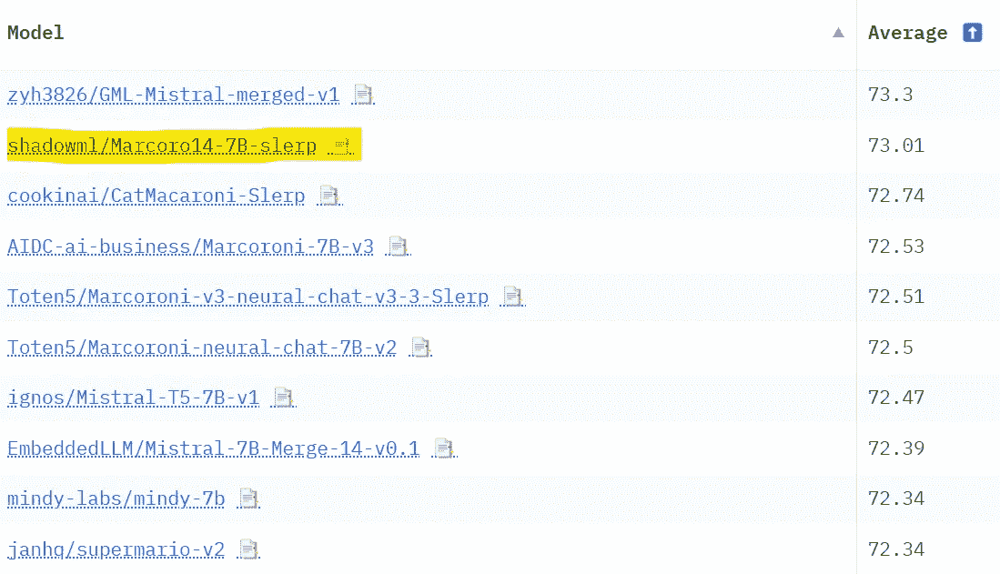
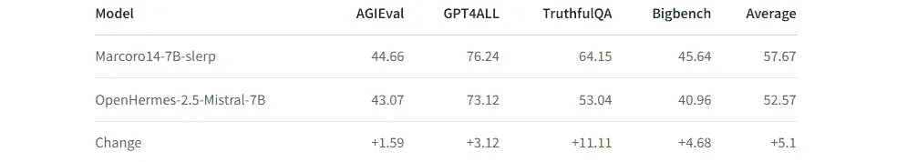

# 使用 mergekit 合并大语言模型

> 原文：[`towardsdatascience.com/merge-large-language-models-with-mergekit-2118fb392b54?source=collection_archive---------0-----------------------#2024-01-08`](https://towardsdatascience.com/merge-large-language-models-with-mergekit-2118fb392b54?source=collection_archive---------0-----------------------#2024-01-08)

## 轻松创建你自己的模型，无需 GPU！

[](https://medium.com/@mlabonne?source=post_page---byline--2118fb392b54--------------------------------)[](https://towardsdatascience.com/?source=post_page---byline--2118fb392b54--------------------------------) [Maxime Labonne](https://medium.com/@mlabonne?source=post_page---byline--2118fb392b54--------------------------------)

·发表于 [Towards Data Science](https://towardsdatascience.com/?source=post_page---byline--2118fb392b54--------------------------------) ·阅读时间：11 分钟·2024 年 1 月 8 日

--


图片由作者提供

模型合并是一种**将两个或更多 LLM 模型**合并为单个模型的技术。这是一种相对较新且实验性的方法，用于以低成本（无需 GPU）创建新模型。模型合并效果出乎意料地好，并且产生了许多在[Open LLM 排行榜](https://huggingface.co/spaces/HuggingFaceH4/open_llm_leaderboard)上排名靠前的顶尖模型。

在本教程中，我们将使用[mergekit](https://github.com/cg123/mergekit)库来实现。更具体地，我们将回顾四种合并方法，并提供配置示例。然后，我们将使用 mergekit 创建我们自己的模型，[Marcoro14–7B-slerp](https://huggingface.co/mlabonne/Marcoro14-7B-slerp)，该模型在 Open LLM 排行榜（2024 年 1 月 2 日）上表现最佳。

代码可在[GitHub](https://github.com/mlabonne/llm-course/blob/main/Mergekit.ipynb)和[Google Colab](https://colab.research.google.com/drive/1_JS7JKJAQozD48-LhYdegcuuZ2ddgXfr?usp=sharing)上找到。我推荐使用我的自动化笔记本来轻松运行 mergekit：[🥱 LazyMergekit](https://colab.research.google.com/drive/1obulZ1ROXHjYLn6PPZJwRR6GzgQogxxb?usp=sharing)。

*特别感谢* [*Charles Goddard*](https://www.linkedin.com/in/charles-goddard-7b6797b/)*，mergekit 库的作者，感谢他审阅本文。*



图片由作者提供

# 🤝 合并算法

在本节中，我们将重点介绍[mergekit](https://github.com/cg123/mergekit)中目前实现的四种方法。请注意，还有其他方法，如[线性插值](https://github.com/cg123/mergekit/tree/1011ef3a84e4c5545473602baf7ef32d535044a9#linear)和[任务算术](https://arxiv.org/abs/2212.04089)。如果你对模型合并的论文感兴趣，推荐查看[这个优秀的合集](https://huggingface.co/collections/osanseviero/model-merging-65097893623330a3a51ead66)。

## 1\. SLERP

**球面线性插值**（SLERP）是一种在两个向量之间平滑插值的方法。它保持恒定的变化速率，并保留向量所处球面空间的几何属性。

有几个理由更倾向于使用 SLERP 而不是传统的线性插值。例如，在高维空间中，线性插值可能会导致插值向量的**大小减小**（即减少权重的尺度）。此外，权重的方向变化通常代表了**更有意义的信息**（如特征学习和表示），而不是变化的大小。

SLERP 的实现步骤如下：

1.  将输入向量标准化为单位长度，确保它们表示的是方向而非大小。

1.  使用它们的点积计算这些向量之间的角度。

1.  如果向量几乎共线，则默认使用线性插值以提高效率。否则，SLERP 会根据插值因子`t`（`t=0` = 100%的第一个向量，`t=1` = 100%的第二个模型）和向量之间的角度计算缩放因子。

1.  这些因素用于加权原始向量，然后将其求和以得到插值向量。

SLERP 目前是最流行的合并方法，但它仅限于一次合并两个模型。仍然可以层次化地合并多个模型，如在[Mistral-7B-Merge-14-v0.1](https://huggingface.co/EmbeddedLLM/Mistral-7B-Merge-14-v0.1)中所示。

*配置示例：*

```py
slices:
  - sources:
      - model: OpenPipe/mistral-ft-optimized-1218
        layer_range: [0, 32]
      - model: mlabonne/NeuralHermes-2.5-Mistral-7B
        layer_range: [0, 32]
merge_method: slerp
base_model: OpenPipe/mistral-ft-optimized-1218
parameters:
  t:
    - filter: self_attn
      value: [0, 0.5, 0.3, 0.7, 1]
    - filter: mlp
      value: [1, 0.5, 0.7, 0.3, 0]
    - value: 0.5
dtype: bfloat16
```

这是一个经典的 SLERP 配置，应用于两个模型的每一层。请注意，我们输入一个值梯度作为插值因子`t`。自注意力层和 MLP 层的参数将使用[OpenPipe/mistral-ft-optimized-1218](https://huggingface.co/OpenPipe/mistral-ft-optimized-1218)和[mlabonne/NeuralHermes-2.5-Mistral-7B](https://huggingface.co/mlabonne/NeuralHermes-2.5-Mistral-7B)的不同组合。其他层则是两个模型的 50/50 混合。

你可以在 Hugging Face Hub 上找到最终模型：[mlabonne/NeuralPipe-7B-slerp](https://huggingface.co/mlabonne/NeuralPipe-7B-slerp)。

## 2\. TIES

在[Yadav 等人](https://arxiv.org/abs/2306.01708)的[论文](https://arxiv.org/abs/2306.01708)中提出的**TIES-Merging**旨在高效地将多个任务特定的模型合并为一个多任务模型。它解决了模型合并中的两个主要挑战：

+   **模型参数中的冗余**：它识别并消除任务特定模型中的冗余参数。通过关注微调过程中所做的变化，识别最重要的前 k%变化，并丢弃其余部分。

+   **参数符号之间的分歧**：当不同模型对同一参数提出相反调整时，会产生冲突。TIES-Merging 通过创建一个统一的符号向量来解决这些冲突，表示所有模型中最主导的变化方向。

TIES-Merging 分为以下三个步骤：

1.  **修剪**：通过仅保留最重要参数（密度参数）的部分，重置其余部分为零，从而减少任务特定模型中的冗余。

1.  **选择符号**：通过基于累积大小的最主导方向（正或负）创建统一符号向量，解决不同模型之间的符号冲突。

1.  **不相交合并**：平均与统一符号向量对齐的参数值，排除零值。

与 SLERP 不同，TIES 可以一次合并多个模型。

*配置示例：*

```py
models:
  - model: mistralai/Mistral-7B-v0.1
    # no parameters necessary for base model
  - model: OpenPipe/mistral-ft-optimized-1218
    parameters:
      density: 0.5
      weight: 0.5
  - model: mlabonne/NeuralHermes-2.5-Mistral-7B
    parameters:
      density: 0.5
      weight: 0.3
merge_method: ties
base_model: mistralai/Mistral-7B-v0.1
parameters:
  normalize: true
dtype: float16
```

使用此配置，我们使用 Mistral-7B 作为基础模型来计算增量权重。我们合并相同的两个模型：[mistral-ft-optimized-1218](https://huggingface.co/OpenPipe/mistral-ft-optimized-1218)（50%）和[NeuralHermes-2.5-Mistral-7B](https://huggingface.co/mlabonne/NeuralHermes-2.5-Mistral-7B)（30%），并进行归一化。这里的密度表示我们只保留每个模型 50%的参数（另一半来自基础模型）。

请注意，配置中的权重总和不等于 1，但`normalize: true`参数会自动在内部对其进行归一化。该配置灵感来自于[OpenHermes-2.5-neural-chat-7b-v3–1–7B](https://huggingface.co/Weyaxi/OpenHermes-2.5-neural-chat-7b-v3-1-7B)作者提供的参数。

您可以在 Hugging Face Hub 上找到最终模型：[mlabonne/NeuralPipe-7B-ties](https://huggingface.co/mlabonne/NeuralPipe-7B-ties)。

## 3\. DARE

由 Yu 等人（2023 年）提出的[DARE](https://arxiv.org/abs/2311.03099)采用了类似于 TIES 的方法，主要有两个不同之处：

+   **剪枝**：DARE 将微调后的权重随机重置为其原始值（即基础模型的值）。

+   **重新缩放**：DARE 通过重新缩放权重来保持模型输出的期望值大致不变。它将两个（或多个）模型的重新缩放权重与基础模型的权重通过一个缩放因子相加。

Mergekit 对此方法的实现有两种形式：一种是带有 TIES 符号选择步骤（`dare_ties`），另一种是没有的（`dare_linear`）。

*配置示例：*

```py
models:
  - model: mistralai/Mistral-7B-v0.1
    # No parameters necessary for base model
  - model: samir-fama/SamirGPT-v1
    parameters:
      density: 0.53
      weight: 0.4
  - model: abacusai/Slerp-CM-mist-dpo
    parameters:
      density: 0.53
      weight: 0.3
  - model: EmbeddedLLM/Mistral-7B-Merge-14-v0.2
    parameters:
      density: 0.53
      weight: 0.3
merge_method: dare_ties
base_model: mistralai/Mistral-7B-v0.1
parameters:
  int8_mask: true
dtype: bfloat16
```

在此配置中，我们基于 Mistral-7B 合并了三种不同的模型，使用了`dare_ties`。这次，我选择了权重之和为 1 的组合（权重和应该在 0.9 到 1.1 之间）。密度参数比论文中推荐的值（<0.5）稍高，但看起来它 consistently 给出了更好的结果（参见[这个讨论](https://github.com/cg123/mergekit/issues/26)）。

你可以在 Hugging Face Hub 上找到它，地址是[mlabonne/Daredevil-7B](https://huggingface.co/mlabonne/Daredevil-7B)。它也是本文中表现最好的合并模型，甚至超过了 Marcoro14–7B-slerp。

## 4\. 透传

透传方法与之前的几种方法有显著不同。通过将来自不同大语言模型（LLM）的层级进行拼接，它可以生成具有**独特参数数量**的模型（例如，两个 7B 参数模型合并生成 9B 模型）。这些模型通常被社区称为“弗兰肯合并”或“弗兰肯斯坦模型”。

这个技术非常实验性，但它成功地创造了令人印象深刻的模型，比如使用两个 Llama 2 70B 模型合并的[goliath-120b](https://huggingface.co/alpindale/goliath-120b)。最近发布的[SOLAR-10.7B-v1.0](https://huggingface.co/upstage/SOLAR-10.7B-v1.0)也采用了相同的理念，称为深度向上扩展，详见他们的论文[这里](https://arxiv.org/abs/2312.15166)。

*配置示例：*

```py
slices:
  - sources:
    - model: OpenPipe/mistral-ft-optimized-1218
      layer_range: [0, 32]
  - sources:
    - model: mlabonne/NeuralHermes-2.5-Mistral-7B
      layer_range: [24, 32]
merge_method: passthrough
dtype: bfloat16
```

结果的弗兰肯合并将拥有来自第一个模型的所有 32 层，以及来自第二个模型的 8 层。这创建了一个总共 40 层和 8.99B 参数的弗兰肯合并模型。此配置灵感来自于[GML-Mistral-merged-v1](https://huggingface.co/zyh3826/GML-Mistral-merged-v1)。

你可以在 Hugging Face Hub 上找到最终模型，地址是[mlabonne/NeuralPipe-9B-merged](https://huggingface.co/mlabonne/NeuralPipe-9B-merged)。

# 💻 合并你自己的模型

在这一部分中，我们将使用 mergekit 加载合并配置，运行它，并将合并后的模型上传到 Hugging Face Hub。

首先，我们直接从源代码安装 mergekit，如下所示：

```py
!git clone https://github.com/cg123/mergekit.git
!cd mergekit && pip install -q -e .
```

在接下来的代码块中，我们加载合并配置文件（YAML 格式）。我们还指定了合并后模型的名称，以供以后使用。你可以将上一节中的任何配置复制/粘贴到这里。

这次，我们将使用两个不同的模型：[Marcoroni-7B-v3](https://huggingface.co/AIDC-ai-business/Marcoroni-7B-v3) 和 [Mistral-7B-Merge-14-v0.1](https://huggingface.co/EmbeddedLLM/Mistral-7B-Merge-14-v0.1)，并使用 SLERP 方法将它们合并。我们将配置保存为 yaml 文件，以便作为输入使用在合并命令中。

```py
import yaml

MODEL_NAME = "Marcoro14-7B-slerp"
yaml_config = """
slices:
  - sources:
      - model: AIDC-ai-business/Marcoroni-7B-v3
        layer_range: [0, 32]
      - model: EmbeddedLLM/Mistral-7B-Merge-14-v0.1
        layer_range: [0, 32]
merge_method: slerp
base_model: AIDC-ai-business/Marcoroni-7B-v3
parameters:
  t:
    - filter: self_attn
      value: [0, 0.5, 0.3, 0.7, 1]
    - filter: mlp
      value: [1, 0.5, 0.7, 0.3, 0]
    - value: 0.5
dtype: bfloat16

"""

# Save config as yaml file
with open('config.yaml', 'w', encoding="utf-8") as f:
    f.write(yaml_config)
```

我们使用以下参数运行合并命令：

+   `--copy-tokenizer` 用于从基础模型复制分词器

+   `--allow-crimes` 和 `--out-shard-size` 用于将模型分割成较小的分片，以便在低内存的 CPU 上计算。

+   `--lazy-unpickle` 以启用实验性的懒加载解包器，从而减少内存使用。

此外，一些模型可能需要`--trust_remote_code`标志（Mistral-7B 不需要此标志）。

这个命令将下载合并配置中列出的所有模型的权重，并运行选定的合并方法（大约需要 10 分钟）。

```py
# Merge models
!mergekit-yaml config.yaml merge --copy-tokenizer --allow-crimes --out-shard-size 1B --lazy-unpickl
```

模型现在已经合并并保存在`merge`目录中。在上传之前，我们可以创建一个包含所有可复现性所需信息的 README 文件。以下代码块定义了一个 Jinja 模板，并自动填充来自合并配置的数据。

```py
!pip install -qU huggingface_hub

from huggingface_hub import ModelCard, ModelCardData
from jinja2 import Template

username = "mlabonne"

template_text = """
---
license: apache-2.0
tags:
- merge
- mergekit
- lazymergekit

- {{ model }}

---

# {{ model_name }}

{{ model_name }} is a merge of the following models using [mergekit](https://github.com/cg123/mergekit):


* [{{ model }}](https://huggingface.co/{{ model }})


## 🧩 Configuration

```yaml

{{- yaml_config -}}

```py
"""

# Create a Jinja template object
jinja_template = Template(template_text.strip())

# Get list of models from config
data = yaml.safe_load(yaml_config)
if "models" in data:
    models = [data["models"][i]["model"] for i in range(len(data["models"])) if "parameters" in data["models"][i]]
elif "parameters" in data:
    models = [data["slices"][0]["sources"][i]["model"] for i in range(len(data["slices"][0]["sources"]))]
elif "slices" in data:
    models = [data["slices"][i]["sources"][0]["model"] for i in range(len(data["slices"]))]
else:
    raise Exception("No models or slices found in yaml config")

# Fill the template
content = jinja_template.render(
    model_name=MODEL_NAME,
    models=models,
    yaml_config=yaml_config,
    username=username,
)

# Save the model card
card = ModelCard(content)
card.save('merge/README.md')
```

现在我们有了模型卡片，可以将整个文件夹推送到 Hub。

```py
from google.colab import userdata
from huggingface_hub import HfApi

username = "mlabonne"

# Defined in the secrets tab in Google Colab
api = HfApi(token=userdata.get("HF_TOKEN"))

api.create_repo(
    repo_id=f"{username}/{MODEL_NAME}",
    repo_type="model"
)
api.upload_folder(
    repo_id=f"{username}/{MODEL_NAME}",
    folder_path="merge",
)
```

该模型现在可以在 Hugging Face Hub 上获取，链接为[mlabonne/Marcoro14–7B-slerp](https://huggingface.co/mlabonne/Marcoro14-7B-slerp)。在另一个笔记本中，我们可以使用以下代码在免费的 T4 GPU 上尝试该模型：

```py
!pip install -qU transformers accelerate

from transformers import AutoTokenizer
import transformers
import torch

model = "mlabonne/Marcoro14-7B-slerp"
messages = [{"role": "user", "content": "What is a large language model?"}]

tokenizer = AutoTokenizer.from_pretrained(model)
prompt = tokenizer.apply_chat_template(
    messages,
    tokenize=False,
    add_generation_prompt=True
)
pipeline = transformers.pipeline(
    "text-generation",
    model=model,
    torch_dtype=torch.float16,
    device_map="auto",
)

outputs = pipeline(prompt, max_new_tokens=256, do_sample=True, temperature=0.7, top_k=50, top_p=0.95)
```

我们提出了“什么是大语言模型？”这个问题，并获得了以下输出：

> *大语言模型是一种人工智能（AI）系统，它通过大量的文本数据进行训练。其设计目的是理解和生成类似人类的语言，预测句子或文档中接下来可能出现的单词或短语。这些模型使用复杂的算法和神经网络架构，从数据中学习，并随着时间的推移提高其表现。一些著名的大语言模型包括 OpenAI 的 GPT-3 和 Google 的 BERT。*

一切看起来不错，但我们需要更全面的评估。对于这种通用模型，有一些有趣的基准测试：

+   [**Chatbot Arena**](https://chat.lmsys.org/)，它根据人类投票编制了一个基于 Elo 的 LLM 排行榜。

+   [**MT-bench**](https://chat.lmsys.org/)（同一个链接），它使用 GPT-4 作为裁判，基于一组多轮问题对模型的回答进行评分。

+   [**NousResearch 基准套件**](https://github.com/teknium1/LLM-Benchmark-Logs)，它汇集了四个基准测试：AGIEval、GPT4ALL、TruthfulQA 和 Bigbench。GPT4ALL 本身包括 HellaSwag、OpenBookQA、Winogrande、ARC-Easy、ARC-Challenge、BoolQ 和 PIQA。

+   [**Open LLM 排行榜**](https://huggingface.co/spaces/HuggingFaceH4/open_llm_leaderboard)，它汇集了六个基准测试：ARC、HellaSwag、MMLU、Winogrande、GSM8K 和 TruthfulQA。

不幸的是，我们无法将模型提交到 Chatbot Arena。相反，我选择使用 Open LLM 排行榜和 NousResearch 基准测试来评估它。

我将我们的模型提交到了[Open LLM 排行榜](https://huggingface.co/spaces/HuggingFaceH4/open_llm_leaderboard)（“🚀 Submit here!”标签）。如介绍所示，它在排行榜中排名为**最佳 7B 参数模型**。以下是完整的结果：


作者提供的图像

Open LLM Leaderboard 的问题在于这些基准是公开的。这意味着人们可以在测试数据上训练 LLMs 以获得更好的结果。通过合并最佳模型，我们也污染了自己的结果。可以安全地假设**Marcoro14–7B-slerp 已被污染**，并且本次合并中使用的某些模型可能已在测试集上进行过训练。如果您想创建最好的模型，而不是操控排行榜，我建议仅使用非合并模型来创建您自己的合并模型。

这就是为什么我们不想仅依赖 OpenLLM Leaderboard。对于 NousResearch 基准测试套件，我使用了[🧐 LLM AutoEval](https://github.com/mlabonne/llm-autoeval)通过简单的 Colab 笔记本自动计算分数。以下是与优秀的[OpenHermes-2.5-Mistral-7B](https://huggingface.co/teknium/OpenHermes-2.5-Mistral-7B)相比的结果：



图片由作者提供

我们在**每个基准测试**上都取得了显著的提升。请注意，NousResearch 基准测试套件与 Open LLM Leaderboard 共享一些任务：ARC-Challenge、TruthfulQA、HellaSwag 和 Winogrande。据我所知，Bigbench 是唯一一个 100% 不同的基准（如果不是，请随时与我联系）。然而，我们在此合并中使用的某些模型仍然可能在 Bigbench 上进行了训练。

# 结论

在本文中，我们介绍了将 LLMs 合并的四种不同方法。我们详细讲解了 SLERP、TIES、DARE 和 passthrough 的工作原理，并提供了配置示例。最后，我们使用 mergekit 运行 SLERP，创建了[Marcoro14–7B-slerp](https://huggingface.co/mlabonne/Marcoro14-7B-slerp)，并将其上传至 Hugging Face Hub。我们在两个基准测试套件上取得了优秀的表现：Open LLM Leaderboard（**表现最好的 7B 模型**）和 NousResearch。如果您想创建自己的合并模型，我推荐使用我的自动化笔记本[🥱 LazyMergekit](https://colab.research.google.com/drive/1obulZ1ROXHjYLn6PPZJwRR6GzgQogxxb?usp=sharing)。

另一种合并多个模型的方法是将它们合并在 Mixture of Experts (MoE) 架构中。在下一篇文章中，我们将详细讨论如何执行此操作，并创建我们自己的[类似 Mixtral 的模型](https://huggingface.co/mlabonne/Beyonder-4x7B-v2)。如果您喜欢本文，请在 Medium 和 Twitter 上关注我[@maximelabonne](https://twitter.com/maximelabonne)。

*通过点击一次，了解更多关于机器学习的信息并支持我的工作——在这里成为 Medium 会员：*

[](https://medium.com/@mlabonne/membership?source=post_page-----2118fb392b54--------------------------------) [## 通过我的推荐链接加入 Medium — Maxime Labonne

### 作为 Medium 会员，您的一部分会员费用将用于支持您阅读的作家，同时您可以完全访问每个故事…

medium.com](https://medium.com/@mlabonne/membership?source=post_page-----2118fb392b54--------------------------------)
