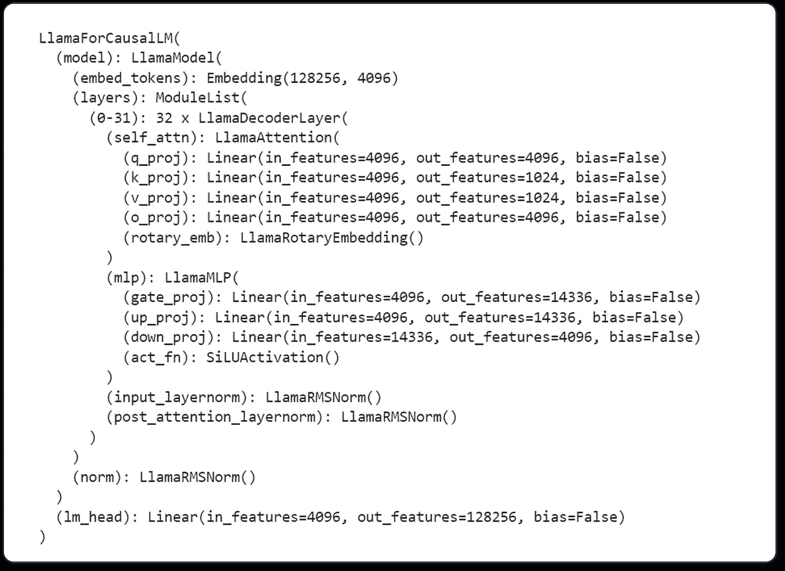
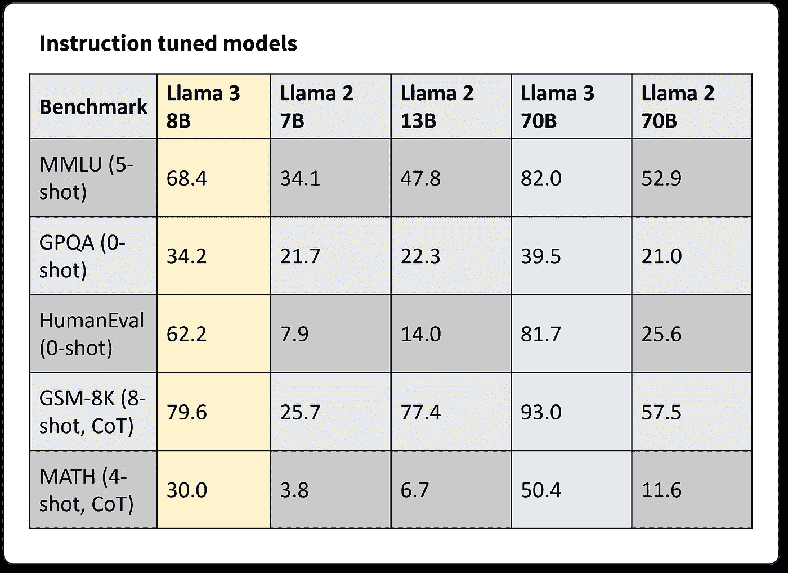
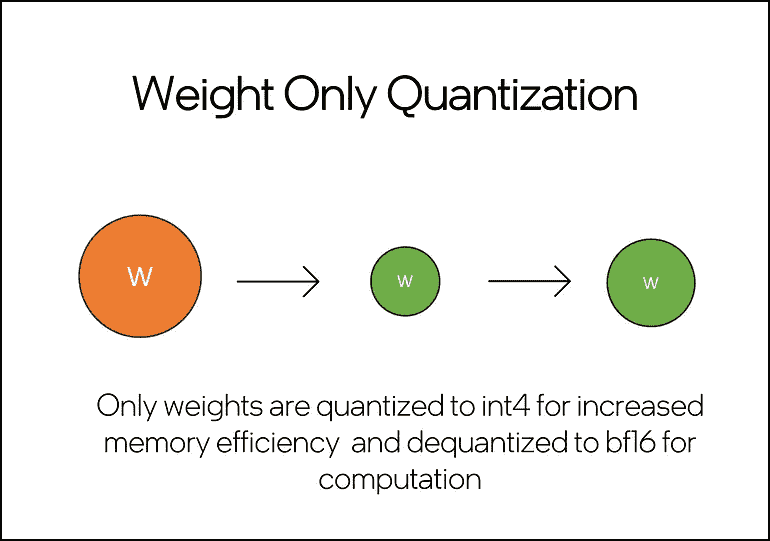
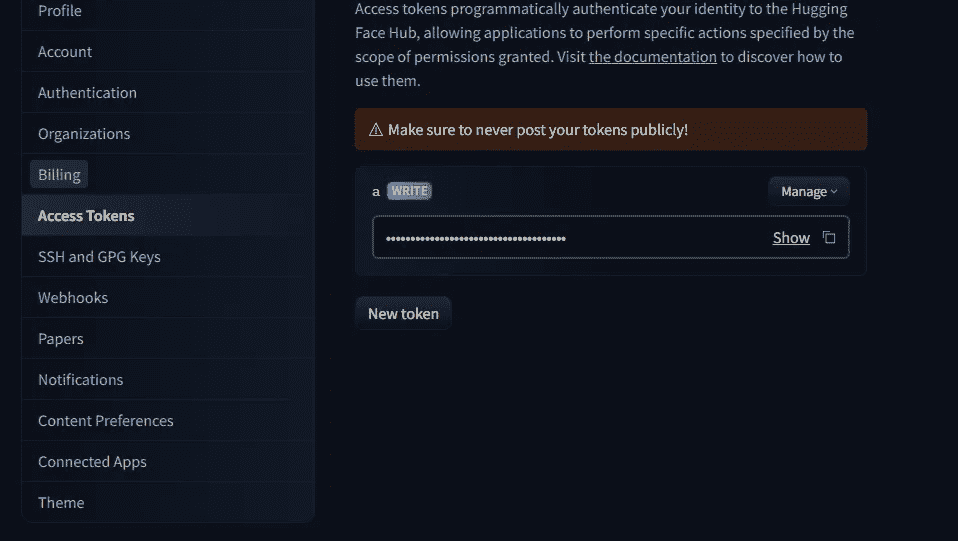
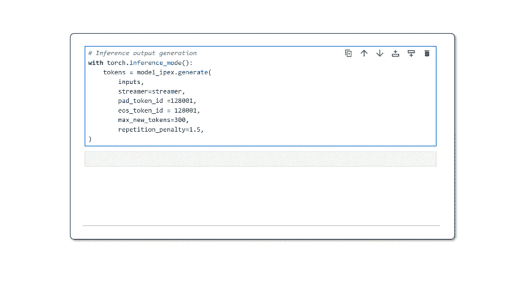

# Meta Llama 3 优化的 CPU 推理与 Hugging Face 和 PyTorch

> 原文：[`towardsdatascience.com/meta-llama-3-optimized-cpu-inference-with-hugging-face-and-pytorch-9dde2926be5c?source=collection_archive---------2-----------------------#2024-04-19`](https://towardsdatascience.com/meta-llama-3-optimized-cpu-inference-with-hugging-face-and-pytorch-9dde2926be5c?source=collection_archive---------2-----------------------#2024-04-19)


使用 Nightcafe 创建 — 图片由作者提供

## 了解如何在部署 Meta* Llama 3 到 CPU 时减少模型延迟

[](https://eduand-alvarez.medium.com/?source=post_page---byline--9dde2926be5c--------------------------------)[](https://towardsdatascience.com/?source=post_page---byline--9dde2926be5c--------------------------------) [Eduardo Alvarez](https://eduand-alvarez.medium.com/?source=post_page---byline--9dde2926be5c--------------------------------)

·发表于[Towards Data Science](https://towardsdatascience.com/?source=post_page---byline--9dde2926be5c--------------------------------) ·阅读时长 7 分钟·2024 年 4 月 19 日

--

万众期待的[Meta 第三代 Llama 发布](https://huggingface.co/blog/llama3)终于来了，我希望确保你知道如何优化地部署这个最先进（SoTA）的 LLM。在本教程中，我们将重点介绍执行仅权重量化（WOQ），以压缩 8B 参数模型并提高推理延迟，但首先，让我们讨论一下 Meta Llama 3。

# Llama 3

到目前为止，Llama 3 家族包括从 8B 到 70B 参数不等的模型，未来还会推出更多版本。模型配有宽松的 Meta Llama 3[许可协议](https://huggingface.co/meta-llama/Meta-Llama-3-8B-Instruct/blob/main/LICENSE)，鼓励在接受使用条款之前仔细审阅。这标志着 Llama 模型家族和开源 AI 的一个激动人心的篇章。

## 架构

Llama 3 是一个基于解码器单一变压器的自回归 LLM。与 Llama 2 相比，Meta 团队做出了以下显著改进：

+   采用分组查询注意力（GQA），提高推理效率。

+   优化的分词器，词汇表包含 128K 个标记，旨在更高效地编码语言。

+   在一个 15 万亿标记的数据集上训练，这个数据集比 Llama 2 的训练数据集大了 7 倍，并且包含了 4 倍更多的代码。

以下图（图 1）为 `print(model)` 的结果，其中 `model` 为 [meta-llama/Meta-Llama-3–8B-Instruct](https://huggingface.co/meta-llama/Meta-Llama-3-8B-Instruct)。在该图中，我们可以看到模型由 32 个 LlamaDecoderLayer 组成，这些层包含了 Llama Attention 自注意力组件。此外，模型还包括 LlamaMLP、LlamaRMSNorm 和一个线性头。我们希望在 Llama 3 研究论文发布后能够了解更多信息。



图 1. `print(model)` 的输出，展示了 llama-3–8B-instruct 架构中各层的分布 — 图片来源：[作者]

## 语言建模性能

该模型已在多个行业标准的语言建模基准测试上进行评估，如 MMLU、GPQA、HumanEval、GSM-8K、MATH 等。在本教程中，我们将回顾“指令调优模型”的表现（图 2）。这些数据的最显著特点是，Llama 3 8B 参数模型在所报告的基准测试中超越了 Llama 2 70B 达 62% 到 143%，同时该模型的规模却比 Llama 2 小了 88%！



图 2. Llama 3 指令模型在 MMLU、GPQA、HumanEval、GSM-8K 和 MATH LLM 基准测试中的性能指标汇总。— 图片来源：[作者](https://huggingface.co/meta-llama/Meta-Llama-3-8B-Instruct)

增强的语言建模性能、宽松的许可协议以及此最新 Llama 代代的架构效率标志着生成式 AI 领域一个令人激动的全新篇章的开始。让我们一起探索如何优化 Llama 3 的推理过程，以便在 CPU 上实现可扩展、低延迟的部署。

# 使用 PyTorch 优化 Llama 3 推理

在[上一篇文章](https://medium.com/towards-data-science/improving-llm-inference-latency-on-cpus-with-model-quantization-28aefb495657)中，我讨论了模型压缩和总体推理优化在开发基于 LLM 的应用中的重要性。在本教程中，我们将重点介绍如何对 [meta-llama/Meta-Llama-3–8B-Instruct](https://huggingface.co/meta-llama/Meta-Llama-3-8B-Instruct) 应用仅权重量化（WOQ）。WOQ 提供了性能、延迟和准确性之间的平衡，并支持量化为 int4 或 int8。WOQ 的一个关键步骤是解量化，将 int4/int8 权重转换回 bf16，再进行计算。



图 3. 简单示意图展示了仅权重量化，其中预量化的权重为橙色，量化后的权重为绿色。请注意，这表示初步量化为 int4/int8 以及计算步骤中的解量化为 fp16/bf16。— 图片来源：[作者](https://medium.com/towards-data-science/improving-llm-inference-latency-on-cpus-with-model-quantization-28aefb495657)

## 环境设置

你将需要大约 60GB 的 RAM 来执行 Llama-3-8B-Instruct 的 WOQ。这包括约 30GB 用于加载完整模型，以及约 30GB 用于量化过程中的峰值内存。WOQ Llama 3 只会消耗大约 10GB 的 RAM，这意味着我们可以通过将完整模型从内存中释放来释放大约 50GB 的 RAM。

> *你可以在* [*Intel*® *Tiber*® *开发者云*](https://medium.com/r?url=https%3A%2F%2Fbit.ly%2Fllama3woq) *免费的 JupyterLab*环境中运行本教程。该环境提供了一款第四代 Intel*® *Xeon*® *CPU，拥有 224 个线程和 504GB 内存，足以运行此代码。*

如果在你自己的 IDE 中运行，你可能需要处理额外的依赖项，比如安装 Jupyter 和/或配置 conda/python 环境。在开始之前，请确保你已经安装了以下依赖项。

```py
intel-extension-for-pytorch==2.2
transformers==4.35.2
torch==2.2.0
huggingface_hub
```

## 访问和配置 Llama 3

你需要一个 Hugging Face*帐户来访问 Llama 3 的模型和分词器。

为此，从设置菜单中选择“Access Tokens”（图 4），并创建一个令牌。



图 4\. Hugging Face 令牌配置控制台快照 — 图片由作者提供

复制你的访问令牌并将其粘贴到在运行以下代码后在 Jupyter 单元格中生成的“Token”字段中。

```py
from huggingface_hub import notebook_login, Repository

# Login to Hugging Face
notebook_login()
```

访问[meta-llama/Meta-Llama-3–8B-Instruct](https://huggingface.co/meta-llama/Meta-Llama-3-8B-Instruct)，并在提供你的信息并提交 Llama 3 访问请求之前仔细评估条款和许可。接受模型条款并提供你的信息是你自己的责任。

## 使用 WOQ 对 Llama-3–8B-Instruct 进行量化

我们将利用[Intel® Extension for PyTorch](https://medium.com/r?url=https%3A%2F%2Fwww.intel.com%2Fcontent%2Fwww%2Fus%2Fen%2Fdeveloper%2Ftools%2Foneapi%2Foptimization-for-pytorch.html)*来应用 WOQ 于 Llama 3。这一扩展包含了针对 Intel 硬件的最新 PyTorch 优化。按照这些步骤对 Llama 3 模型进行量化并执行推理：

1.  **Llama 3 模型和分词器：** 导入所需的包，并使用`AutoModelForCausalLM.from_pretrained()`和`AutoTokenizer.from_pretrained()`方法加载 Llama-3–8B-Instruct 特定的权重和分词器。

```py
import torch
import intel_extension_for_pytorch as ipex
from transformers import AutoTokenizer, AutoModelForCausalLM, TextStreamer

Model = 'meta-llama/Meta-Llama-3-8B-Instruct'

model = AutoModelForCausalLM.from_pretrained(Model)
tokenizer = AutoTokenizer.from_pretrained(Model)
```

2\. **量化配置食谱：** 配置 WOQ 量化食谱。我们可以将`weight_dtype`变量设置为所需的内存中数据类型，分别选择`torch.quint4x2`或`torch.qint8`来表示 int4 和 in8。此外，我们可以使用`lowp_model`来定义去量化精度。现在，我们将其保持为`ipex.quantization.WoqLowpMode.None`，以保持默认的 bf16 计算精度。

```py
qconfig = ipex.quantization.get_weight_only_quant_qconfig_mapping(
  weight_dtype=torch.quint4x2, # or torch.qint8
  lowp_mode=ipex.quantization.WoqLowpMode.NONE, # or FP16, BF16, INT8
)
checkpoint = None # optionally load int4 or int8 checkpoint

# PART 3: Model optimization and quantization
model_ipex = ipex.llm.optimize(model, quantization_config=qconfig, low_precision_checkpoint=checkpoint)

del model 
```

我们使用`ipex.llm.optimize()`来应用 WOQ，然后使用`del model`删除完整模型并释放大约 30GB 的 RAM。

3. **提示 Llama 3：** Llama 3 与 Llama 2 一样，拥有预定义的提示模板，用于其经过指令调优的模型。使用这个模板，开发者可以定义具体的模型行为指令，并提供用户提示和对话历史。

```py
system= """\n\n You are a helpful, respectful and honest assistant. Always answer as helpfully as possible, while being safe. If you don't know the answer to a question, please don't share false information."""
user= "\n\n You are an expert in astronomy. Can you tell me 5 fun facts about the universe?"
model_answer_1 = 'None'

llama_prompt_tempate = f"""
<|begin_of_text|>\n<|start_header_id|>system<|end_header_id|>{system}
<|eot_id|>\n<|start_header_id|>user<|end_header_id|>{user}
<|eot_id|>\n<|start_header_id|>assistant<|end_header_id|>{model_answer_1}<|eot_id|>
"""

inputs = tokenizer(llama_prompt_tempate, return_tensors="pt").input_ids
```

我们提供所需字段，然后使用分词器将整个模板转换为模型的标记。

4. **Llama 3 推理：** 在文本生成方面，我们利用`TextStreamer`生成实时推理流，而不是一次性打印整个输出。这使得读者能够获得更加自然的文本生成体验。我们将配置好的流传递给`model_ipex.generate()`以及其他文本生成参数。

```py
streamer = TextStreamer(tokenizer,skip_prompt=True)

with torch.inference_mode():
    tokens = model_ipex.generate(
        inputs,
        streamer=streamer,
        pad_token_id=128001,
        eos_token_id=128001,
        max_new_tokens=300,
        repetition_penalty=1.5,
)
```

运行此代码后，模型将开始生成输出。请记住，这些是未经过滤和未加保护的输出。对于实际应用场景，你需要进行额外的后处理考虑。



图 5. 在 Intel Tiber Developer Cloud 的 JupyterLab 环境中运行 int4 模式下压缩的 Llama-3–8B-Instruct 流式推理——Gif 由作者提供

就这样。不到 20 行代码，你就能在这个生态系统中获得最新 SoTA LLM 的低延迟、CPU 优化版本。

## 部署时的注意事项

根据你的推理服务部署策略，有一些事项是你需要考虑的：

+   如果在容器中部署 Llama 3 实例，WOQ 将提供更小的内存占用，并允许你在单一硬件节点上提供多个推理服务实例。

+   在部署多个推理服务时，你应该优化每个服务实例分配的线程和内存。为后台进程留出足够的额外内存（约 4GB）和线程（约 4 个线程）。

+   考虑将 WOQ 版本的模型保存并存储在模型注册表中，以避免在每个实例部署时重新量化模型。

# 结论与讨论

Meta 的 Llama 3 LLM 家族相比前几代有了显著的改进，并且提供了多种配置（更多配置即将推出）。在本教程中，我们探讨了通过仅权重量化（WOQ）来增强 CPU 推理，这是一种在最小化准确性影响的同时减少延迟的技术。

通过将以性能为导向的新一代 Llama 3 LLM 与像 WOQ 这样的优化技术结合，开发者可以为[GenAI](https://www.intel.com/content/www/us/en/developer/topic-technology/artificial-intelligence/training/generative-ai.html)应用解锁新的可能性。这个组合简化了硬件需求，使 LLM 能够在新旧系统中集成并获得高保真、低延迟的结果。

**接下来可以尝试的一些令人兴奋的事情是：**

1.  **实验不同的量化级别：** 你应该测试 int4 和 int8 量化，以确定在性能和准确性之间的最佳平衡，适应你的特定应用。

1.  **性能监控：** 持续评估 Llama 3 模型在不同真实场景中的性能和准确性至关重要，以确保量化保持预期的有效性。

1.  **测试更多的 Llama 模型：** 探索整个 Llama 3 系列，并评估 WOQ 和其他 PyTorch 的[量化方法](https://pytorch.org/docs/stable/quantization.html)的影响。

***感谢阅读！别忘了关注*** [***我的个人资料以获取更多类似文章***](https://eduand-alvarez.medium.com/) ***！***

**其他名称和品牌可能被声明为他人的财产。**
