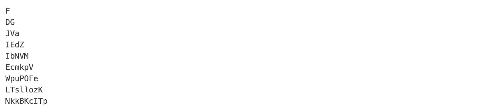
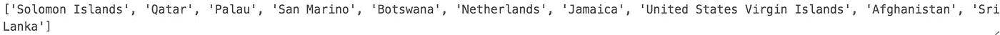
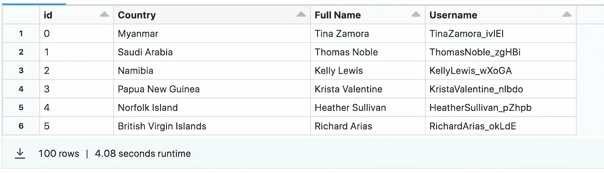
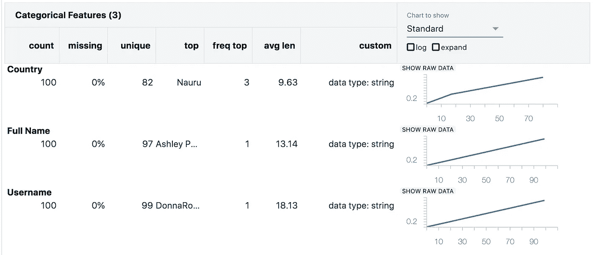

# 在 PySpark 中生成合成描述性数据

> 原文：[`towardsdatascience.com/methods-for-generating-synthetic-descriptive-data-c6678cc10aff?source=collection_archive---------16-----------------------#2024-01-04`](https://towardsdatascience.com/methods-for-generating-synthetic-descriptive-data-c6678cc10aff?source=collection_archive---------16-----------------------#2024-01-04)

## 使用各种数据源类型快速生成人工数据集中的文本数据。

 [Matt Collins](https://medium.com/@mc12338?source=post_page---byline--c6678cc10aff--------------------------------)

·发布于[Towards Data Science](https://towardsdatascience.com/?source=post_page---byline--c6678cc10aff--------------------------------) ·7 分钟阅读·2024 年 1 月 4 日

--

使用 DALL-E 3 生成的图像

在[上一篇文章](https://medium.com/towards-data-science/create-many-to-one-relationships-between-columns-in-a-synthetic-table-with-pyspark-udfs-41e39d97c936)中，我们探讨了如何在合成的 PySpark DataFrame 中创建列之间的多对一关系。这个 DataFrame 只包含外键信息，并未生成可能在示范数据集中有用的文本信息。

对于任何希望填充人工数据集的人来说，您很可能想要生成描述性数据，如产品信息、位置详情、客户人口统计等。

在这篇文章中，我们将深入探讨几种能够以低成本和低努力生成合成文本数据的来源，并使用这些技术生成包含客户信息的 DataFrame。

# 为什么要创建合成数据集？

合成数据集是展示你的数据产品（如网站或分析平台）的一种绝佳方式。它允许用户和利益相关者与示例数据互动，进行有意义的分析，而不会侵犯任何关于敏感数据的隐私问题。

它对于探索机器学习算法也非常有用，允许数据科学家在真实数据有限的情况下训练模型。

性能测试数据工程管道活动是合成数据的另一个重要应用场景，它为团队提供了通过基础设施推送大规模数据的能力，帮助识别设计中的弱点，以及基准测试运行时间。

就我而言，我目前正在创建一个示例数据集，用于在高负载下对一些 Power BI 功能进行性能测试，稍后我将撰写相关文章。

数据集将包含销售数据，包括交易金额和其他描述性特征，如商店位置、员工姓名和客户电子邮件地址。

# 随机字符

从简单的开始，我们可以使用一些内建功能来生成随机文本数据。导入*random*和*string* Python 模块后，我们可以使用以下简单的函数创建所需长度的随机字符串。

作者提供的图片：几个结果示例的截图

我们可以多次运行此函数，生成足够的数据用于我们的列，并将信息追加到列表中。

我们将在本文稍后部分审视如何将数据添加到 DataFrame 中。

## 优势与限制

这种数据生成方式非常通用，在示例数据集中的应用有限。尽管如此，它可以与其他字符串生成技术（如串联）结合使用，在付出很少努力的情况下提供更多价值。

以下是随机用户名的示例，用户名由名字作为基础，后接下划线和随机字符：

作者提供的图片：显示用随机字符串附加生成的多个用户名的截图。

这种数据可能有用的示例数据点包括：

+   电子邮件地址

+   密码

+   产品代码

+   用户名

# APIs

APIs 是一个很好的信息来源，在构建真实的分析平台时，可能会作为数据源使用！

然而，也有许多 API 端点值得查询，用于通用的占位符数据，这些数据可以通过代表性的不同主题（如汇率）的数据，为演示仪表盘提供更多意义。

如果我们想要获取用户所在国家的地理数据，可以通过[rest countries](https://restcountries.com/) API 接口生成。这个 API 是免费的，无需注册即可开始使用。利用*requests* Python 模块，我们可以非常快速地获得国家列表。

作者提供的图片：`print(sample_countries)`语句，展示了打乱结果的示例。

***注意：你应始终检查输出结果——这个 API 请求返回 250 条结果，超过了现实中国家的数量！***

作者提供的图片：`pprint(sorted(countries_list))`语句的片段，展示了与美国相关的多个“国家”。

## 优势与限制

从 API 获取数据的复杂性和安全要求可能有所不同，这可能会使人望而却步。数据请求的方式和返回的数据格式也可能不同。文档由提供者自身生成，这也可能成为一个值得考虑的瓶颈。

此时值得一提的是，开发者已经创建了各种包，以简化与 API 的交互——我们将在下一节讨论第三方 Python 库！

说到这些，有大量丰富的数据可供你提取，可以用于面向客户的数据产品，也可用于演示目的。

# 第三方包

也有一些非常棒的现成包供我们使用。这些包减少了我们寻找数据源、处理和格式化数据以便使用的繁重工作。

[*Faker*](https://faker.readthedocs.io/en/master/)就是这样一个例子，它能够生成名字、地址等。

按照你的方便安装、导入并使用这样的包！

作者提供的图片：Faker 生成的多个名字的截图

## 好处与局限性

由于其他开发者已经为你完成了大量的前期工作，像*Faker*这样的包可以非常高效且低成本（无论是价格还是时间）。

仅凭*Faker*，我们已经能够直观地生成通用且有用的用户数据。还有其他库可供使用（通常与常见 API 交互），帮助开发者轻松地将有用数据引入到他们的应用程序中。

屏障可能存在于你所在组织关于使用第三方包的规定、包的许可以及包本身的可维护性，因此请注意可能的限制。

# ChatGPT

不得不提的是，忽视大型语言模型（LLMs）是不合适的，因为它们是数据生成的宝贵资产。

一种简单的方法是让 ChatGPT（或同类工具）为你生成一份数据点列表，比如可能的客户姓名。

作者提供的图片：向 ChatGPT 请求一个名字列表。

我们可以更进一步，请求 LLM 帮助构建随机变量函数本身。你可以包括数据源的详细信息，甚至请求 ChatGPT 编写一个与您找到的 API 交互的函数。

这里的一个例子是请求帮助使用[bored](https://www.boredapi.com/) API，提取活动字段并返回供你使用：

作者提供的图片：向 ChatGPT 请求一个随机活动。

作者提供的图片：来自 bored API 的 ChatGPT 生成的函数示例结果。

***注意：始终检查结果输出，确保 LLM 生成的功能按预期工作。***

## 好处与局限性

生成性人工智能在快速数据生成方面展现了其优势（尤其是在内容创作方面，正如[这份 Gartner 报告](https://www.gartner.com/en/doc/779868-emerging-tech-top-use-cases-for-generative-ai)所示），我预计明年在填充示例数据集时将看到更多务实的方法。因此，它使得大规模创建各种数据点对不同背景和技术水平的用户都变得可行。

话虽如此，LLM（大语言模型）的可靠性和一致性也在同时受到广泛研究。根据您需要填充的数据类型，这可能会引入严格的数据质量和匿名性检查，从而决定这是否是特定用例的正确工具。

# 将其放入 DataFrame 中

我们在前几节中采用的方法是生成数据，准备好可以处理到感兴趣的 DataFrame 列中。

在这个阶段，有几种方式可以实现合成数据。UDF（用户定义函数）是一种简洁的方法，可以对每一行的列应用一个函数，并有助于定义唯一性。

[Databricks Labs Data Generator](https://github.com/databrickslabs/dbldatagen)是另一个优秀的库，它通过分布式计算加速了数据生成过程。

通过操控生成要填充的值列表的方式，我们可以使用*withColumn* PySpark 函数，并将其与我们的列表数据结合，以极快的速度生成文本列。

对于我们的测试案例，我们将结合使用这两种方法。我们可以使用 Databricks Labs Data Generator 创建 DataFrame 框架，填充 100 行数据，其中包含一个唯一的*Id*列，以及我们可能不要求唯一的值，例如*国家*。

对于我们希望保持唯一性的其他列，例如*全名*和*用户名*，我们可以利用 UDF 函数，使用 id 列从我们创建的列表中访问唯一名称。

综合来看，我们可以创建我们的 DataFrame：

作者提供的图片：DataFrame

快速的数据概览显示，我们的*全名*和*用户名*列具有完全唯一的值，符合预期！

作者提供的图片：显示“全名”和“用户名”列中 100 个唯一值的分类列的数据概览

# 结论

我们概述了多种快速生成文本合成数据的方法，使我们能够加速示例数据集的创建。

上述所有示例都可以扩展、优化并根据您的特定用例进行定制。

有没有我遗漏的技巧？你是用合成数据集做什么的？在评论中告诉我吧！

感谢阅读，一如既往，您可以在[这里](https://github.com/MattPCollins/SyntheticDimensionTableExamples)找到供您使用的代码。
