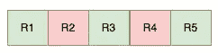
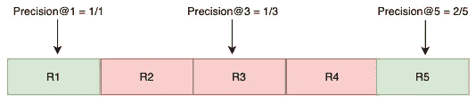
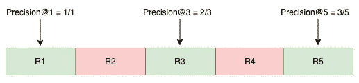
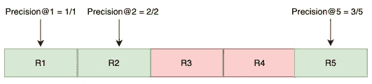
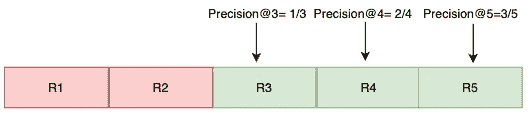
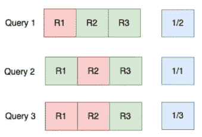
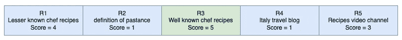
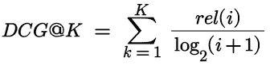
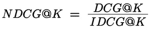
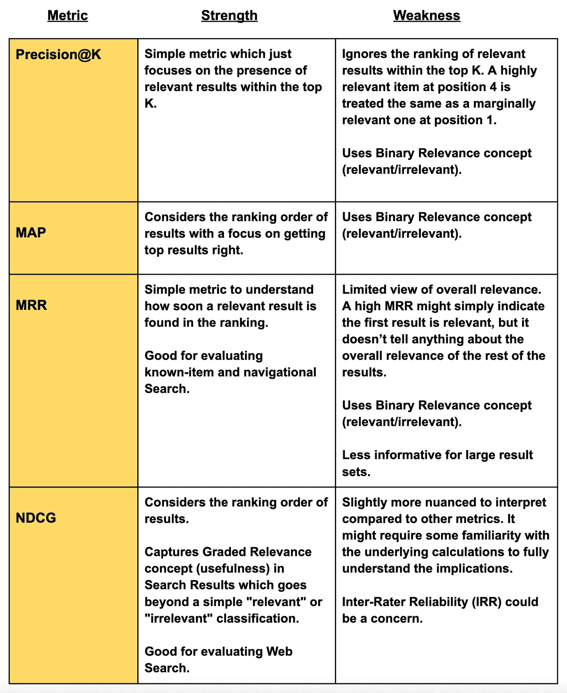

# 如何评估搜索相关性和排名

> 原文：[`towardsdatascience.com/metrics-that-matter-a-simple-guide-to-search-ranking-evaluation-4030084c35b4?source=collection_archive---------8-----------------------#2024-05-30`](https://towardsdatascience.com/metrics-that-matter-a-simple-guide-to-search-ranking-evaluation-4030084c35b4?source=collection_archive---------8-----------------------#2024-05-30)

## 优化搜索引擎的关键指标

 [Akchay Srivastava](https://medium.com/@akchay_srivastava?source=post_page---byline--4030084c35b4--------------------------------)

·发表于 [Towards Data Science](https://towardsdatascience.com/?source=post_page---byline--4030084c35b4--------------------------------) ·阅读时间：6 分钟·2024 年 5 月 30 日

--

图片来自 [Markus Winkler](https://unsplash.com/@markuswinkler?utm_source=medium&utm_medium=referral) 于 [Unsplash](https://unsplash.com/?utm_source=medium&utm_medium=referral)

# 目录

1.  引言

1.  精度@K

1.  平均平均精度（MAP）

1.  平均倒数排名（MRR）

1.  标准化折扣累积增益（NDCG）

1.  比较分析

1.  摘要

1.  参考文献

免责声明：本文表达的观点仅代表个人观点，并不一定反映我雇主或任何其他组织的立场。所有图片均由作者提供，除非另有说明。

# 1\. 引言

确保用户能够快速高效地找到所需信息，对于成功的搜索体验至关重要。当用户能够快速、轻松地找到他们需要的内容时，这就转化为一种积极的体验。

> ***此外，相关结果的排名位置也起着至关重要的作用——它们出现得越靠前，对用户的价值就越大。这转化为更高的用户参与度、转化率和整体网站满意度。***

本文探讨了用于评估搜索相关性和排名的关键指标，帮助您优化搜索引擎并提供卓越的用户体验。

为了以实际方式展示搜索相关性的概念，假设用户在搜索引擎中搜索“意大利面菜肴”。为简化分析，我们将分析引擎返回的前五个结果。相关的结果用绿色表示，而不相关的结果用红色标出（参见图 1）。我们将使用 Rn 表示第 n 个结果。

图 1：一个有序的搜索结果列表

# **2. Precision@K**

Precision@K 衡量前 K 个位置中有多少结果是相关的。我们为不同的 K 值计算 Precision，如图 2 所示。

Precision@K = 前 K 个位置中的相关结果数 / K

Precision@1 = 1/1

Precision@3 = 1/3

Precision@5 = 2/5

图 2：Precision@K

# **3. 平均平均精度（MAP）**

MAP 考虑相关结果的排名顺序。

首先，计算这些相关结果位置的 Precision@K。然后，通过将这些相关结果位置的 Precision@K 相加并除以前 K 个结果中的**相关**项总数，得到平均 Precision@K。为了简便起见，在讨论中我们将偶尔使用 AP 来表示平均精度。

为了更深入地了解 MAP 如何评估排名效果，我们将通过三个不同的搜索查询进行说明。这些示例将突出展示结果的呈现顺序如何影响 MAP 得分。

图 3：查询 1 中每个相关结果的 Precision@K

AP@5_Query_1 = (Precision@1 + Precision@3 + Precision@5) / 3

AP@5_Query_1 = (1 + 0.67 + 0.6) / 3 = 0.76

图 4：查询 2 中每个相关结果的 Precision@K

AP@5_Query_2 = (Precision@1 + Precision@2 + Precision@5) / 3

AP@5_Query_2 = (1 + 1 + 0.6) / 3 = 0.87

图 5：查询 3 中每个相关结果的 Precision@K

AP@5_Query_3 = (Precision@3 + Precision@4 + Precision@5) / 3

AP@5_Query_3 = (0.33 + 0.5 + 0.6) / 3 = 0.47

**查询 2 的结果表现出最高的 Average Precision@5，表明最相关的项目位于排名列表的前面。**

MAP = 数据集中所有查询的平均精度。

MAP@5 = (AP@5_Query_1 + AP@5_Query_2 + AP@5_Query_3) / 查询总数

数据集的 MAP@5 = (0.76 + 0.87 + 0.47) / 3 = 0.7

> ***此计算将所有查询视为同等重要。然而，如果某些查询更为关键，可以在 MAP 过程中使用不同的加权方法来优先考虑它们。***

# **4. 平均倒数排名（MRR）**

MRR 只考虑列表中**第一个相关结果**的排名。

K = 第一个相关结果的排名

倒数得分 = 1 / K

MRR 是多个查询的平均倒数得分。如果没有相关结果，则第一个相关结果的排名视为无限大，因此倒数得分为 0。

图 6：每个查询的倒数得分（蓝色）

> ***相关结果的倒数得分是其排名的反函数。***

数据集的 MRR = (0.5 + 1 + 0.33) / 3 = 0.61

# **5. 归一化折扣累计增益（NDCG）**

NDCG 考虑了结果的分级相关性。每个结果的相关性由一个分数（也称为“等级”）表示。NDCG 的值通过比较搜索引擎返回的结果与**假设的“理想”搜索引擎所返回结果的相关性**来确定。

假设我们有一个 1 到 5 的相关性/评分尺度，其中 5 是最高分，1 是最低分。我们搜索“意大利面菜肴”并手动对搜索结果进行评分，如图 7 所示。在我们的示例中，R3 是最相关的结果，得分为 5。

图 7：按相关性分数排序的搜索结果列表

累积增益@5 = 4 + 1 + 5 + 1 + 3 = 14

累积增益不考虑排名顺序。

折扣累计增益@K = 施加了一个**对数折扣**，当相关项出现在排名列表的较低位置时，帮助赋予较低的增益，如图 8 所示。

图 8：DCG@K 公式

其中，rel(i)是第 i 个位置上结果的相关性分数。

DCG@K = 4/1 + 1/1.585 + 5/2 + 1/2.322 + 3/2.585 = 8.72

DCG 的绝对值取决于列表中的结果数量以及分配的相关性分数。为了解决这个问题，可以对 DCG 进行归一化处理。为了得到归一化的 DCG（NDCG），我们将 DCG 除以给定结果集的理想 DCG（IDCG），如图 9 所示。IDCG 考虑了相同的相关性分数，但假设按照这些结果的最佳排名顺序来计算 DCG。上述示例的最佳排名顺序是：R3 → R1 → R5 → R2 → R4。

IDCG@K = 5/1 + 4/1.585 + 3/2 + 1/2.322 + 1/2.585 = 9.83

图 9：NDCG@K 公式

NDCG@K = 8.72/9.83 = 0.88

> ***NDCG 考虑了结果的分级相关性，提供了对搜索排名质量更为细致的理解。***

# **6. 比较分析**

除了上述指标之外，**斯皮尔曼相关系数**和**肯德尔τ距离**也可以用来评估排名列表的相似性。为了衡量用户参与度，**点击率（CTR）**是一个关键指标，反映了在结果展示后点击该结果的用户百分比。有关这些指标的更多信息，请参考参考文献中的维基百科资源。

# **7. 总结**

照片来源：[Alexander Schimmeck](https://unsplash.com/@alschim?utm_source=medium&utm_medium=referral) 于 [Unsplash](https://unsplash.com/?utm_source=medium&utm_medium=referral)

在我们探索了四种不同的搜索质量评估指标之后，我们进行了比较分析，旨在了解每种方法的优缺点。这自然引出了一个关键问题：哪个指标最适合评估搜索引擎结果的相关性和排名？最佳的指标选择取决于你的具体需求。

**要全面了解搜索引擎的质量，通常建议考虑这些指标的组合，而不是仅依赖单一的衡量标准。**

如果你觉得这篇文章有用，请引用以下文献：

> *Srivastava, Akchay. (2024 年 5 月). 如何评估搜索相关性和排名。* *https://towardsdatascience.com/metrics-that-matter-a-simple-guide-to-search-ranking-evaluation-4030084c35b4*

# **8\. 参考文献：**

1.  [`en.wikipedia.org/wiki/Evaluation_measures_(information_retrieval)`](https://en.wikipedia.org/wiki/Evaluation_measures_(information_retrieval))

1.  [`en.wikipedia.org/wiki/Mean_reciprocal_rank`](https://en.wikipedia.org/wiki/Mean_reciprocal_rank)

1.  [`en.wikipedia.org/wiki/Kendall_tau_distance`](https://en.wikipedia.org/wiki/Kendall_tau_distance)

1.  [`en.wikipedia.org/wiki/Discounted_cumulative_gain`](https://en.wikipedia.org/wiki/Discounted_cumulative_gain)

1.  [`en.wikipedia.org/wiki/Spearman%27s_rank_correlation_coefficient`](https://en.wikipedia.org/wiki/Spearman%27s_rank_correlation_coefficient)

1.  [`web.stanford.edu/class/cs276/handouts/EvaluationNew-handout-6-per.pdf`](https://web.stanford.edu/class/cs276/handouts/EvaluationNew-handout-6-per.pdf)

1.  [`www.coursera.org/lecture/recommender-metrics/rank-aware-top-n-metrics-Wk98r`](https://www.coursera.org/lecture/recommender-metrics/rank-aware-top-n-metrics-Wk98r)

1.  [`www.evidentlyai.com/ranking-metrics/ndcg-metric`](https://www.evidentlyai.com/ranking-metrics/ndcg-metric)

1.  [`en.wikipedia.org/wiki/Inter-rater_reliability`](https://en.wikipedia.org/wiki/Inter-rater_reliability)

1.  [`en.wikipedia.org/wiki/Click-through_rate`](https://en.wikipedia.org/wiki/Click-through_rate)
