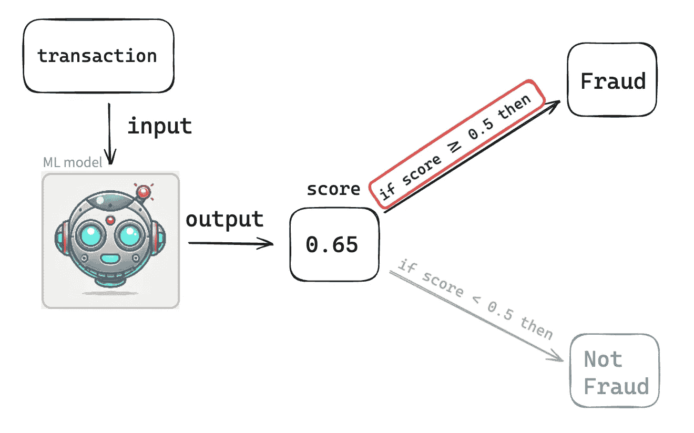
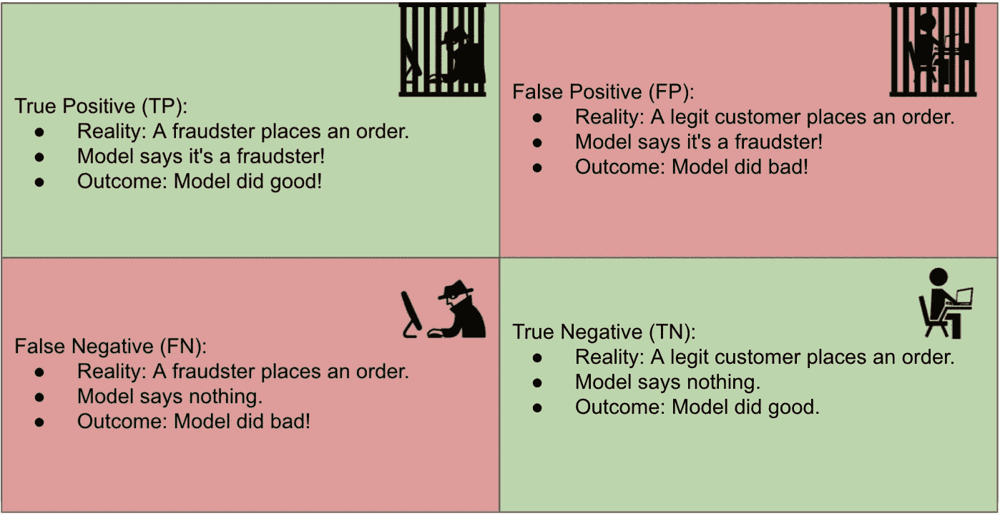
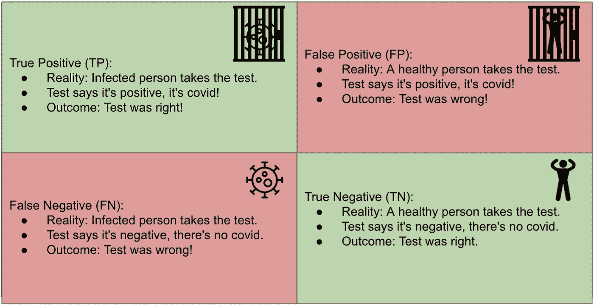
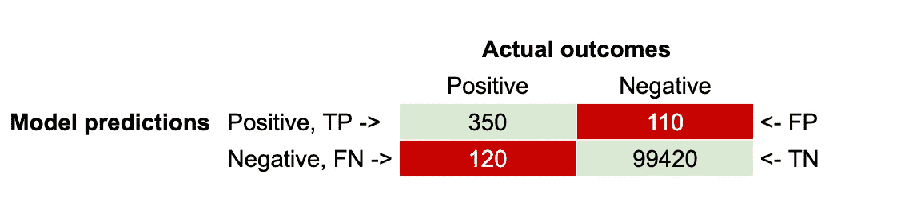
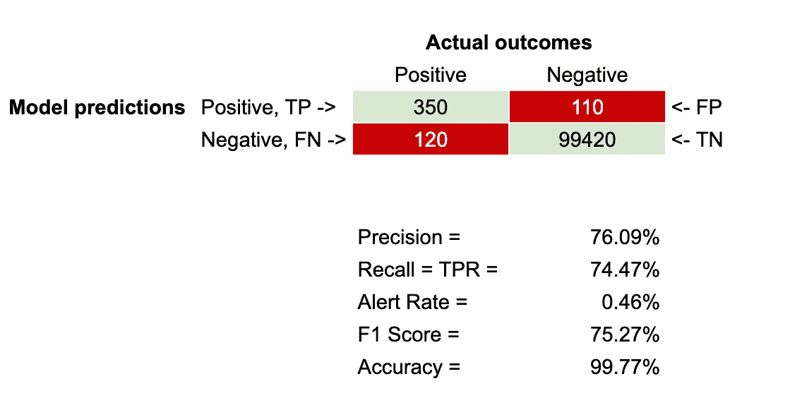

# 评估分类机器学习模型的指标

> 原文：[`towardsdatascience.com/metrics-to-evaluate-a-classification-machine-learning-model-f05f1facd569?source=collection_archive---------7-----------------------#2024-07-31`](https://towardsdatascience.com/metrics-to-evaluate-a-classification-machine-learning-model-f05f1facd569?source=collection_archive---------7-----------------------#2024-07-31)

## *信用卡欺诈的案例研究*

[](https://medium.com/@lucasbraga461?source=post_page---byline--f05f1facd569--------------------------------)[](https://towardsdatascience.com/?source=post_page---byline--f05f1facd569--------------------------------) [Lucas Braga](https://medium.com/@lucasbraga461?source=post_page---byline--f05f1facd569--------------------------------)

·发表于 [Towards Data Science](https://towardsdatascience.com/?source=post_page---byline--f05f1facd569--------------------------------) ·7 分钟阅读·2024 年 7 月 31 日

--

```py
1\. Introduction
2\. How does a model make predictions
3\. Confusion Matrix
4\. Metrics to Evaluate Model Performance
5\. When to use what metrics
```

**1\. 引言**

一旦我们训练了一个监督式机器学习模型来解决分类问题，我们会希望如果这就是我们的工作结束，我们可以直接丢给它新的数据。我们希望它能正确地对所有数据进行分类。然而，实际上，模型做出的并非所有预测都是正确的。在数据科学中有一句名言，由英国统计学家提出：“

> “所有模型都是错误的；有些模型是有用的。”——CLEAR, James, 1976

那么，我们如何知道我们所拥有的模型有多好呢？简短的回答是，我们通过评估模型预测的准确性来判断。为此，我们可以使用多种指标。

**2\. 模型是如何进行预测的？即，模型是如何对数据进行分类的？**



图片 1：模型进行预测

假设我们已经训练了一个机器学习模型，用来对信用卡交易进行分类，并决定该交易是否为欺诈交易。该模型将处理交易数据，并返回一个分数，这个分数可能是 0 到 1 之间的任意数字，例如：0.05、0.24、0.56、0.9875。对于本文，我们将默认阈值设为 0.5，这意味着如果模型给出的分数低于 0.5，则模型将该交易分类为非欺诈（**这是模型的预测**！）。如果模型给出的分数大于或等于 0.5，则模型将该交易分类为欺诈（这也是模型的预测！）。

实际操作中，我们并不会使用默认的 0.5 阈值。我们会尝试不同的阈值，以找出最适合优化模型性能的值，但这个讨论留到以后再进行。

**3\. 混淆矩阵**

混淆矩阵是可视化分类模型性能的基本工具。它有助于理解预测的各种结果，包括：

+   **真正阳性 (TP)**

+   **假阳性 (FP)**

+   **假阴性 (FN)**

+   **真正阴性 (TN)**

让我们分解一下！

为了评估一个模型的有效性，我们需要将其预测与实际结果进行比较。实际结果也被称为“现实”。因此，模型可能将一笔交易分类为欺诈，而实际上，客户在同一笔交易中要求退款，声称他的信用卡被盗。

在这种情况下，模型正确地将交易预测为欺诈，属于**真正阳性 (TP)**。

在欺诈检测的背景下，“阳性”类被标记为欺诈，而“阴性”类被标记为非欺诈。

另一方面，**假阳性 (FP)** 发生在模型也将一笔交易分类为欺诈，但在这种情况下，客户并未报告其信用卡有任何欺诈活动。因此，在这笔交易中，机器学习模型犯了一个错误。

**真正阴性 (TN)** 是当模型将交易分类为非欺诈，而实际上它确实不是欺诈。因此，模型做出了正确的分类。

**假阴性 (FN)** 是当模型将交易分类为非欺诈时，但实际上它是欺诈（客户报告了与该交易相关的信用卡欺诈活动）。在这种情况下，机器学习模型也犯了一个错误，但这是与假阳性不同类型的错误。

让我们看一下图 2



图 2：为欺诈分类的机器学习模型的混淆矩阵

让我们看一个不同的案例，可能更容易理解。设计了一项测试来判断病人是否感染了 COVID。见图 3。



图 3：COVID 测试的混淆矩阵

因此，对于每一笔交易，你可以检查它是 TP、FP、TN 还是 FN。你可以对数百万笔交易进行这种检查，并将 TP、FP、TN 和 FN 的计数写在一个 2x2 的表格中。这个表格也被称为**混淆矩阵**。

假设你将模型对 100,000 笔交易的预测与其实际结果进行了比较，并得出了以下混淆矩阵（见图 4）。



图 4：混淆矩阵

**4\. 评估模型性能的指标**

了解混淆矩阵后，我们就可以开始探索用于评估分类模型性能的指标。

**精确度 = TP / (TP + FP)**

它回答了这个问题：在所有预测中，正确预测的比例是多少？它反映了模型预测的欺诈案例中实际为欺诈的比例。

用简单的话来说：模型将其判定为欺诈时，实际是欺诈的比例是多少？

查看图像 4 中的混淆矩阵，我们计算精确度 = 76.09%，因为精确度 = 350 / (350 + 110)。

**召回率 = TP / (TP + FN)**

召回率也称为真正率（TPR）。它回答了这个问题：在所有实际的正类结果中，正确预测的比例是多少？

简单来说，模型在所有实际欺诈案件中，正确识别欺诈者的比例是多少？

使用图像 4 中的混淆矩阵，召回率 = 74.47%，因为召回率 = 350 / (350 + 120)。

**警报率 = (TP + FP) / (TP + FP + TN + FN)**

也称为阻塞率，该指标帮助回答问题：在所有预测中，正类预测占比是多少？

简单来说：模型预测为欺诈的情况占多少比例？

使用图像 4 中的混淆矩阵，警报率 = 0.46%，因为警报率 = (350 + 110) / (350 + 110 + 120 + 99420)。

**F1 分数 = 2 x (精确度 x 召回率) / (精确度 + 召回率)**

F1 分数是精确度和召回率的调和平均值。它是精确度和召回率之间的平衡度量，提供了一个综合评分来评估模型。

使用图像 4 中的混淆矩阵，F1 分数 = 75.27%，因为 F1 分数 = 2 * (76.09% * 74.47%) / (76.09% + 74.47%)。

**准确率 = TP + TN / (TP + TN + FP + FN)**

准确率帮助回答这个问题：在所有交易中，正确分类的交易占比是多少？

使用图像 4 中的混淆矩阵，准确率 = 99.77%，因为准确率 = (350 + 120) / (350 + 110 + 120 + 99420)。



图像 5：包含评估指标的混淆矩阵

**5. 何时使用哪些指标**

准确率是评估许多分类机器学习模型的常用指标。然而，准确率在目标变量不平衡的情况下效果不好。在欺诈检测的情况下，通常只有极小比例的数据是欺诈的；例如，在信用卡欺诈中，通常不到 1%的交易是欺诈交易。因此，即使模型说所有交易都是欺诈的（这将是非常错误的），或者说所有交易都不是欺诈的（这同样也是非常错误的），模型的准确率仍然可能超过 99%。

那么在这些情况下该怎么做呢？精确度、召回率和警报率。这些通常是能提供模型性能良好视角的指标，即使数据不平衡。具体使用哪个指标可能取决于你的利益相关者。我曾与一些利益相关者合作，他们表示，无论做什么，请保持至少 80%的精确度。因此，在这种情况下，利益相关者非常关注用户体验，因为如果精确度很低，意味着会有大量的假阳性，即模型会错误地屏蔽真正的客户，认为他们进行的是欺诈性的信用卡交易。

另一方面，精确率和召回率之间存在一个权衡：精确率越高，召回率越低。因此，如果模型的精确率非常高，它在发现所有欺诈案件方面就不够出色。从某种意义上讲，这也取决于欺诈案件对业务的成本（财务损失、合规问题、罚款等）与虚假正例对业务的成本（客户生命周期，进而影响业务盈利能力）。

因此，在精确率与召回率之间的财务决策不明确时，一个好的指标是 F1-Score，它有助于在精确率和召回率之间提供平衡，并优化两者。

最后但同样重要的是，警报率也是一个关键的指标，因为它能直观地反映机器学习模型计划阻止的交易数量。如果警报率非常高，比如 15%，那么意味着在客户下的所有订单中，15%会被阻止，只有 85%会被接受。所以，如果你的业务每天有 1,000,000 个订单，机器学习模型会认为其中的 150,000 个是欺诈交易并加以阻止。这是一个巨大的订单量被阻止，因此了解欺诈案件的比例非常重要。如果欺诈案件的比例约为 1%或更低，那么一个阻止 15%的模型不仅会犯很多错误，还会阻碍大部分的业务收入。

**6\. 结论**

理解这些指标可以帮助数据科学家和分析师更好地解读分类模型的结果，并提升模型的表现。精确率和召回率比单纯的准确率提供了更多关于模型有效性的洞见，尤其是在像欺诈检测这样的领域，类分布严重偏斜的情况下。

**图片：除非另有说明，所有图片均由作者提供。图像 1 中的机器人面孔是由 DALL-E 创建的，并且是公开使用的。**
