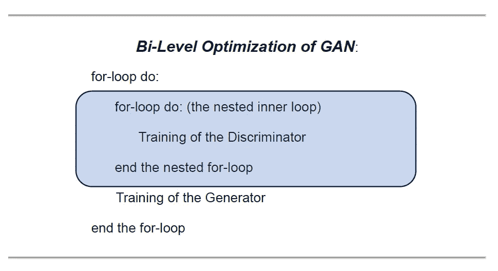
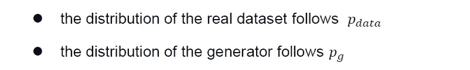
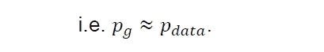
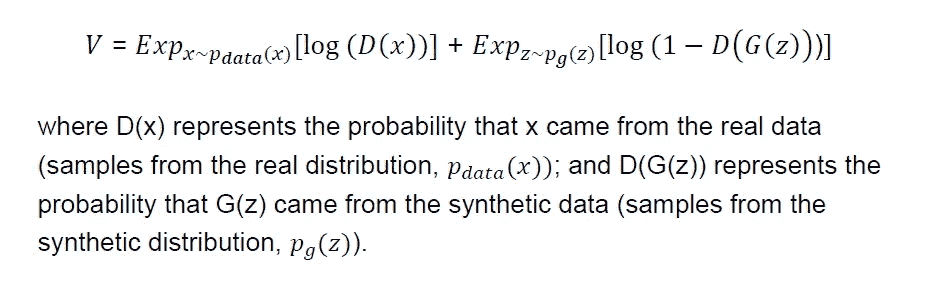
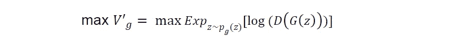
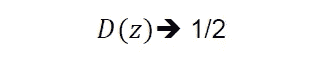
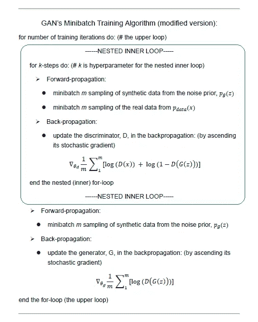

# 生成对抗网络（GAN）的极小极大优化设计

> 原文：[`towardsdatascience.com/mini-max-optimization-design-of-generative-adversarial-networks-gan-dc1b9ea44a02?source=collection_archive---------8-----------------------#2024-01-12`](https://towardsdatascience.com/mini-max-optimization-design-of-generative-adversarial-networks-gan-dc1b9ea44a02?source=collection_archive---------8-----------------------#2024-01-12)

## 嵌套双层优化与平衡寻求目标

 [Michio Suginoo](https://deeporigami.medium.com/?source=post_page---byline--dc1b9ea44a02--------------------------------)

·发布于 [Towards Data Science](https://towardsdatascience.com/?source=post_page---byline--dc1b9ea44a02--------------------------------) ·阅读时间 8 分钟·2024 年 1 月 12 日

--

## 介绍

生成对抗网络（GAN）在生成逼真的合成数据方面表现出色，生成的数据与真实数据几乎无法区分。不幸的是，GAN 因其非法应用而引起了公众的关注，尤其是[深度伪造](https://www.technologyreview.com/2018/08/17/240305/fake-america-great-again/)。（Knight，2018）

顾名思义，生成对抗网络（GAN）由两个网络组成：生成网络（生成器）和对抗网络（判别器）。将对抗机制纳入其架构使得 GAN 成为一种特殊类型的生成网络。

重要的是，GAN 是非参数化的，因此不会强加诸如马尔可夫链之类的正式统计要求。与其强加统计假设，生成网络在对抗网络的帮助下，通过深度神经网络的反向传播学习真实数据的概率分布。

为了生成逼真的合成数据，生成对抗网络（GAN）在其架构中让这两个代理彼此对抗。在这个博弈中，生成器试图模拟模仿真实样本的合成样本，而判别器试图区分真实样本和合成样本。换句话说，当生成器***G***通过伪造来欺骗判别器时，判别器***D***则充当警察的角色，检测合成（伪造）数据。（Goodfellow 等人，2014，第 1 页）从某种意义上说，这两个代理试图实现截然相反的目标。

随着它们技能的提升，合成数据变得与真实数据无法区分。得益于它的对手（判别器），生成器学会了如何更好地模仿给定真实数据的概率分布。

由于在其架构中，GAN 需要训练两个学习者，通过相互作用来实现相反的目标，因此它具有独特的优化设计（双层训练机制和平衡寻求目标）。在这个背景下，我花了一些时间来消化 GAN 的架构设计。在此背景下，我决定写这篇文章与那些对 GAN 不熟悉的人分享我的学习过程，以便他们能更顺利地理解 GAN 的架构特点。我希望读者能把这篇文章作为补充资料，发现它对自己有所帮助。

作为一种预防措施，GAN 是启发式的。目前，GAN 有许多不同的变体应用。本文仅讨论原始 GAN 的架构设计。

## ***原始 GAN 设计***

原始 GAN 的基础架构首次在一篇开创性论文中提出：“[生成对抗网络](https://arxiv.org/abs/1406.2661)”（Goodfellow 等，2014 年）。在这篇原始的 GAN 论文中，为了训练这两个追求截然相反目标的智能体，合著者们设计了一个“[双层优化（训练）](https://en.wikipedia.org/wiki/Bilevel_optimization)”架构，其中一个内部训练模块（判别器的训练）被嵌套在另一个高层训练模块（生成器的训练）中。GAN 在这个双层训练框架中交替训练这两个智能体。

图片来源：作者

***判别器与生成器***

现在，让我们看看这两个智能体在学习过程中做了什么。

很明显，判别器本质上是一个二分类器。给定来自真实数据和合成数据的混合样本，它会将每个样本分类为真实（标签=1）或伪造/合成（标签=0）。

另一方面，生成器本质上是一个噪声分布。它被训练去模仿真实数据集的概率分布，通过一个迭代过程。在每一步的训练迭代中，学习到的生成模型（更新后的生成器）会被复制并用作新的噪声分布。此后，新的噪声分布将用于训练判别器。（Goodfellow I.，2015，第 2 页）

让我们设定以下内容：

图片来源：作者

我们输入噪声 z，并计算其先验分布 G(z)，以定义生成器。

在这种设置下，生成器的最终目标是通过将自己的分布转变为尽可能接近真实数据集的分布，从而欺骗判别器。

图片来源：作者

***两个目标函数：最小-最大博弈***

GAN 的架构中反复进行的是两个代理的训练，而这两个代理具有对立的目标。因此，GAN 有两个目标函数：一个用于判别器，另一个用于生成器。

一方面，作为二分类器的判别器*D*需要最大化正确分配标签的概率，既包括真实数据（标签=1），也包括合成数据（标签=0）。

另一方面，生成器的最终目标是通过创建与真实数据难以区分的合成数据来欺骗分类器。因此，生成器尝试欺骗分类器，使得判别器错误地将合成数据分类为标签 1。换句话说，生成器的目标是“*最大化 D 犯错的概率*”。（Goodfellow 等人，2014，第 1 页）

在概念层面，为了实现这两个目标相反的目标，这两个代理可以参考以下通用的对数似然公式*V*，通常用于二分类问题。

作者提供的图像

在 GAN 训练过程中，判别器的目标是最大化目标函数，而生成器的目标是最小化目标函数的第二项。从这个意义上讲，联合作者将整体目标称为“***极小极大博弈***”。（Goodfellow 等人，2014，第 3 页）

***非饱和修改：***

在实现过程中，联合作者在训练生成器的初期遇到了饱和问题。

> “在学习的早期，当生成器 G 较差时，判别器 D 可以高信心地拒绝样本，因为它们显然与训练数据不同。在这种情况下，log(1 — D(G(z)))会发生饱和。”

为了解决饱和问题，他们将原始对数似然目标函数的第二项转换如下，并建议生成器最大化这一项：

作者提供的图像

这个公式反映了生成器的目标“*最大化 D 犯错的概率*”。（Goodfellow 等人，2014，第 1 页）

***评估***

在训练过程中，生成器不断创造更好的合成数据以欺骗判别器，而判别器则提高其检测能力。从这个角度看，GAN 整体优化的最终目标并不是寻找这两个目标函数的全局最大值，而是寻求一个平衡点，在这个平衡点上，两个代理都无法进一步提升性能。从某种意义上讲，在平衡点，判别器无法区分真实数据和合成数据，因为生成器能够创造尽可能真实的合成数据。

这一目标函数的设定对 GAN 来说非常独特。其中一位联合作者 Ian Goodfellow 描述了平衡点如下：

> “它对应于一个鞍点，即分类器的局部最大值和生成器的局部最小值”（Goodfellow I. ，2015，p.2）。

此外，平衡点在概念上可以通过随机猜测的概率 0.5（50%）来表示。

作者提供的图片

***交替训练过程：嵌套双层优化***

为了实现这一最终目标，GAN 设计了一个交替学习过程，在“二级优化”框架中，其中鉴别器的训练循环嵌套在生成器的另一个更高层次的训练循环中。这个二级优化框架使得 GAN 能够在这两个代理之间交替训练过程：*k 步*的 D 训练和一步 G 训练（Goodfellow 等，2014，p.3）。在这两个模型交替的过程中，重要的是在训练一个模型时冻结另一个模型的学习过程；“*在保持鉴别器固定的情况下更新生成器，反之亦然*”（Goodfellow I. ，2015，p.3）。

以下算法修订了原始 GAN 论文中提出的原始算法，以充分反映生成器对数似然转换的推荐。

作者提供的图片

正如你在算法中看到的，GAN 在前向传播过程中同时从生成模型（生成器）和真实数据中采样，而在反向传播过程中同时训练这两个代理。（Goodfellow 等，2014，p.2）它遵循了深度神经网络的常规。

GAN 首先在嵌套块中训练鉴别器，然后在每次迭代时训练生成器以欺骗训练过的鉴别器，然后继续迭代这个二级训练，直到达到前面讨论的平衡点。

总体而言，技术上，GAN 通过生成器学习真实数据的概率分布；鉴别器只是嵌套在生成器学习机制中的一个内部组件。生成器的目标函数在其公式的上层优化过程中，反映了训练过的鉴别器模型的逐步内容。换句话说，每次迭代时，一旦鉴别器在嵌套的优化模块中被训练，生成器就会不断更新其目标函数。

这几乎描绘了 GAN 模型优化的算法设计。

# ***总结***

为了交替训练两个代理——鉴别器和生成器——GAN 采用了一个双层优化框架，其中鉴别器在嵌套在生成器训练块内的内部模块中进行训练。

由于这两个代理有截然相反的目标（因为判别器旨在最大化其二元分类器的目标函数，而生成器则旨在最小化该函数），合著者称整体目标为“***极小极大博弈***”。（Goodfellow 等人，2014，第 3 页）总的来说，GAN 通过寻求一个平衡点来实现其极小极大优化（训练）目标，在这个平衡点上，判别器无法再区分真实数据和合成数据，因为现在生成器生成的合成数据与真实数据无法区分。

它的嵌套双层训练框架及其寻求平衡的目标设置（与最大化目标相对）构成了 GAN 的极小极大优化框架。

最后，重要的是要指出，主要作者 Ian Goodfellow 表示，原始的 GAN 是启发式的，并且具有理论上的局限性。例如，当目标函数不是凸函数时，无法保证收敛。在这种背景下，他阐述了 GAN 仍然有进一步创新改进的空间。事实上，针对 GAN 应用的多种变体，已经探索了广泛的评估度量（Borji，2018）。因此，我想强调的是，本文所述的架构设计仅描述了最初的 GAN 论文中提出的 GAN 原型。因此，本文介绍的架构设计并不是对其他类型 GAN 应用的全面或普遍适用的设计。

鉴于这一预警说明已向读者充分传达，我希望本文能对那些刚接触 GAN 的读者有所帮助，帮助他们开启自己的 GAN 之旅。

# 参考文献

+   Borji, A. (2018, 10 24). GAN 评估度量的优缺点。来源于 ArXiv: [`arxiv.org/abs/1802.03446`](https://arxiv.org/abs/1802.03446)

+   Goodfellow, I. (2015, 5 21). 关于估计生成模型的可区分性标准。来源于 ArXiv: [`arxiv.org/abs/1412.6515`](https://arxiv.org/abs/1412.6515)

+   Goodfellow, I. J., Pouget-Abadie, J., Mirza, M., Xu, B., Warde-Farley, D., Ozair, S., Courville, A., Bengio, Y. (2014, 6 10). 生成对抗网络。来源于 arXiv: [`arxiv.org/abs/1406.2661`](https://arxiv.org/abs/1406.2661)

+   Knight, W. (2018, 8 17). 让美国再次伟大。来源于 MIT Technology Review: [`www.technologyreview.com/2018/08/17/240305/fake-america-great-again/`](https://www.technologyreview.com/2018/08/17/240305/fake-america-great-again/)
