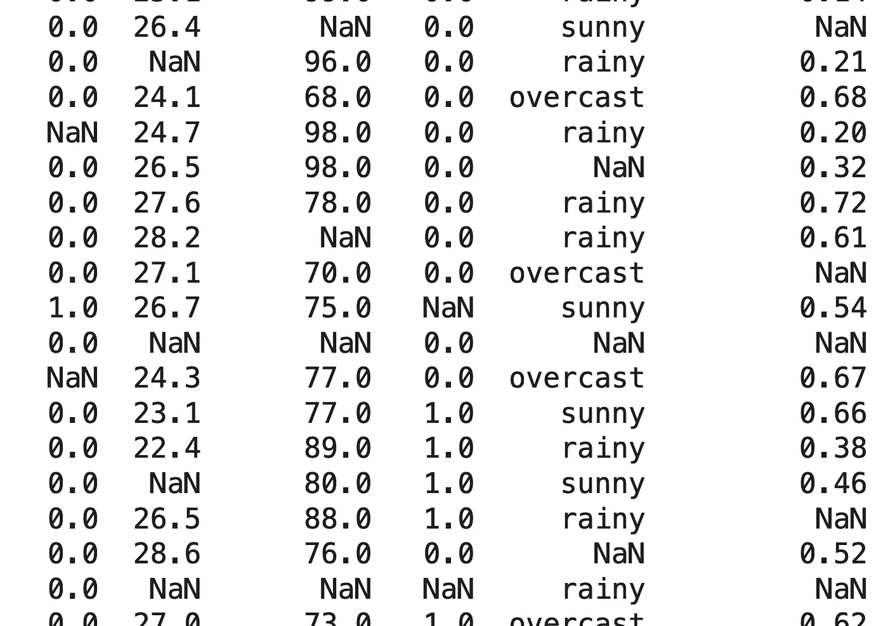
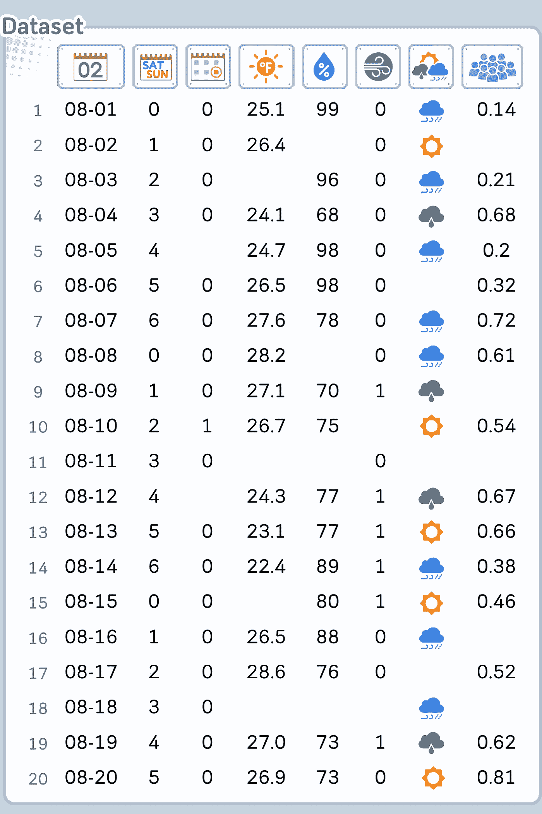
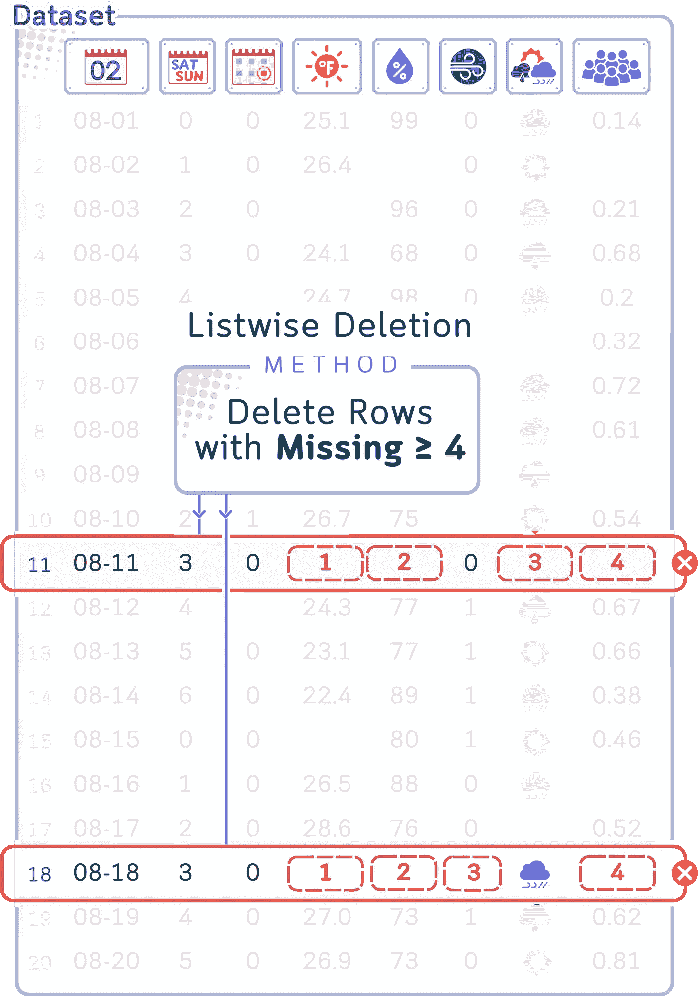
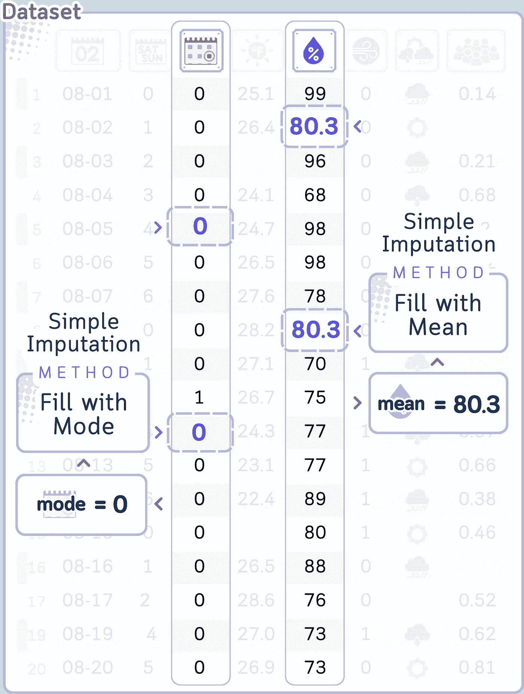
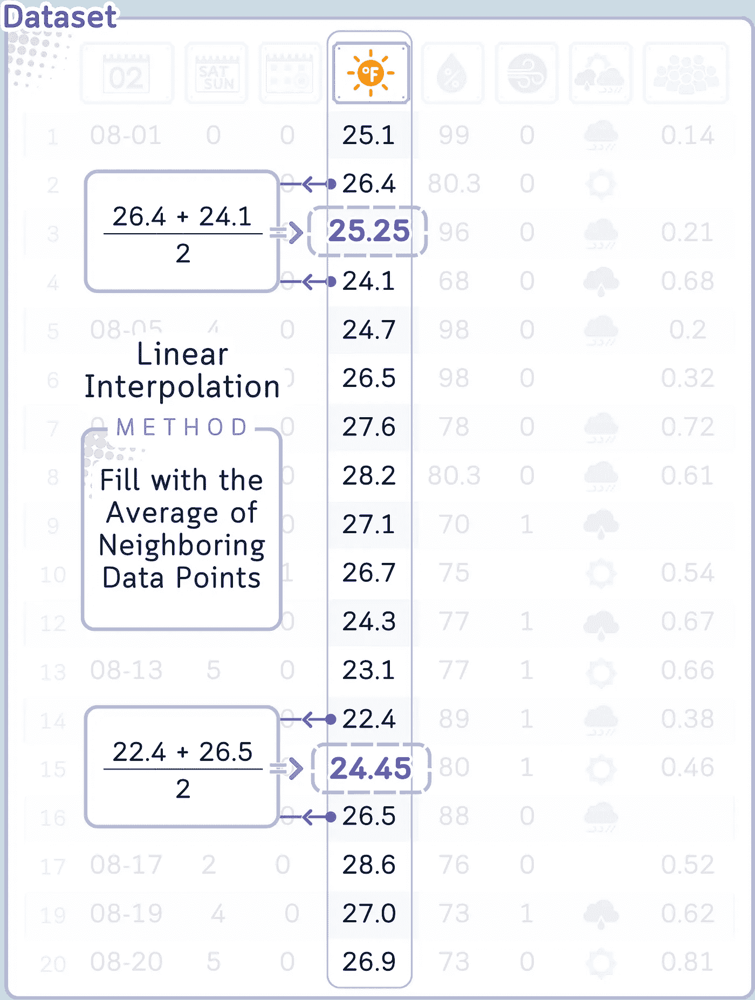
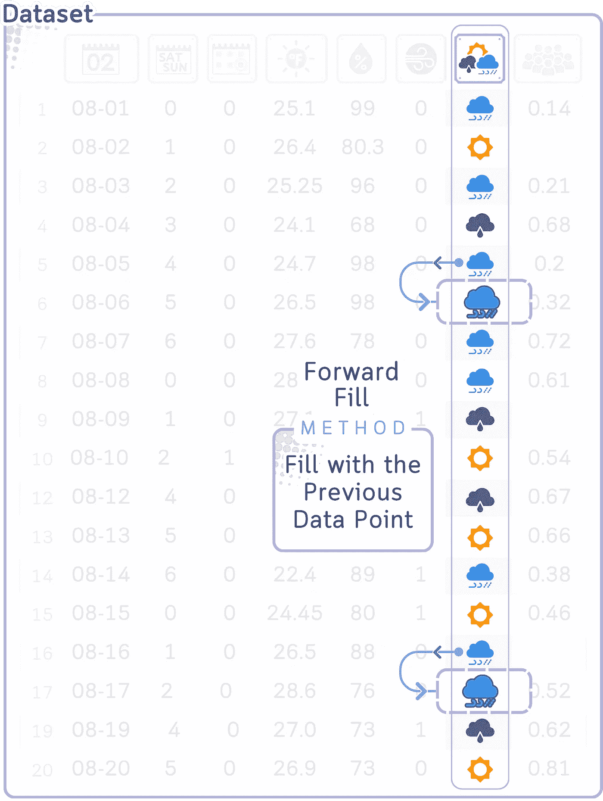
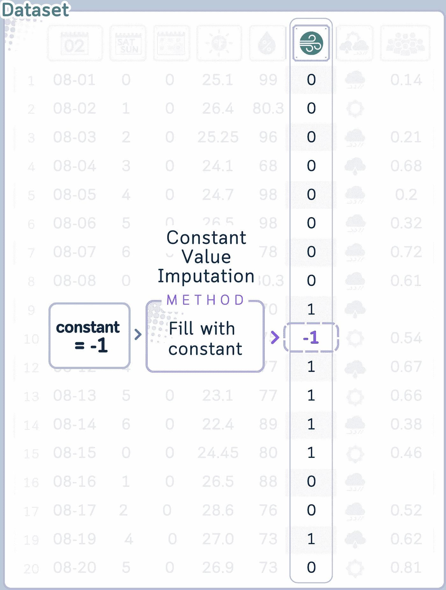
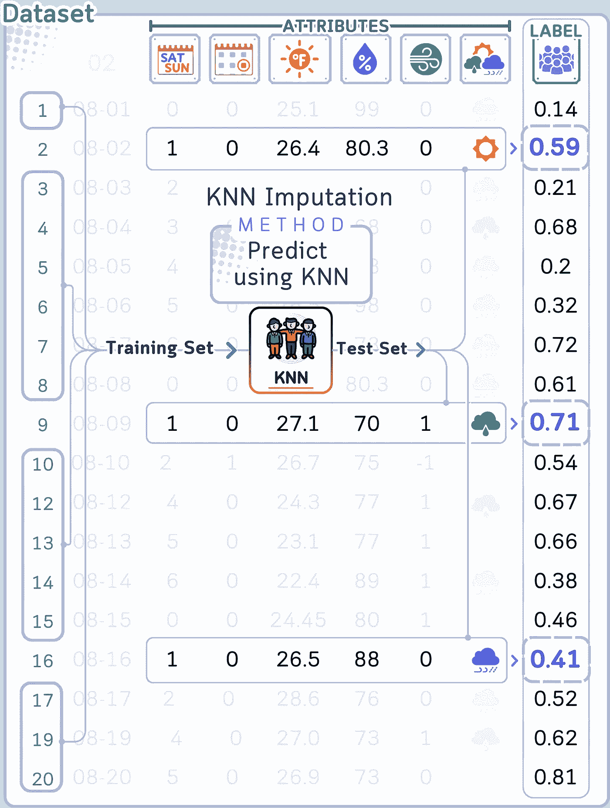
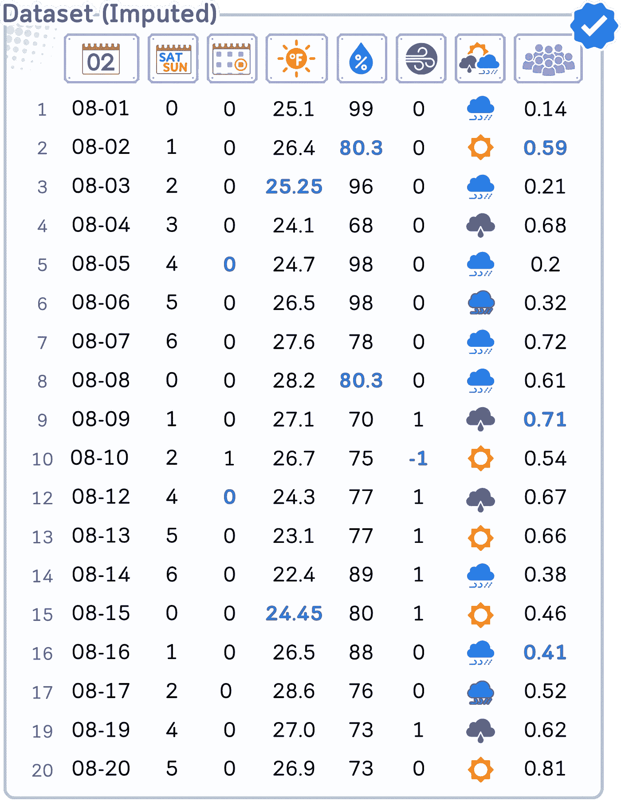

# 缺失值填充，解释：适合初学者的视觉指南与代码示例

> 原文：[`towardsdatascience.com/missing-value-imputation-explained-a-visual-guide-with-code-examples-for-beginners-93e0726284eb?source=collection_archive---------0-----------------------#2024-08-27`](https://towardsdatascience.com/missing-value-imputation-explained-a-visual-guide-with-code-examples-for-beginners-93e0726284eb?source=collection_archive---------0-----------------------#2024-08-27)

## 数据预处理

## 一组（微小的）数据集，六种填充方法？

[](https://medium.com/@samybaladram?source=post_page---byline--93e0726284eb--------------------------------)[](https://towardsdatascience.com/?source=post_page---byline--93e0726284eb--------------------------------) [Samy Baladram](https://medium.com/@samybaladram?source=post_page---byline--93e0726284eb--------------------------------)

·发布于 [Towards Data Science](https://towardsdatascience.com/?source=post_page---byline--93e0726284eb--------------------------------) ·阅读时间 13 分钟·2024 年 8 月 27 日

--


`⛳️ 更多 [数据预处理](https://medium.com/@samybaladram/list/data-preprocessing-17a2c49b44e4) 解释： ▶ 缺失值填充 · 类别编码 · 数据缩放 · 离散化 · 过采样与欠采样 · [数据泄露与预处理](https://towardsdatascience.com/data-leakage-in-preprocessing-explained-a-visual-guide-with-code-examples-33cbf07507b7)`

让我们来谈谈每个数据科学家、分析师或好奇的数字分析师最终都需要面对的问题：缺失值。现在，我知道你在想什么——“哦，太好了，又一个关于缺失值的指南。”但是请听我说完。我将展示如何使用六种不同的填充方法来解决这个问题，且所有方法都应用于同一个数据集（并且附有有用的可视化效果！）。通过这篇文章，你将明白为什么领域知识的价值不可估量（甚至是我们 AI 朋友可能也难以复制的）。


所有可视化图像：作者使用 Canva Pro 创建。优化适配移动设备，可能在桌面端显示过大。

# 什么是缺失值以及为什么会出现？

在深入讨论我们的数据集和填补方法之前，让我们先花一点时间理解缺失值是什么以及它们为什么在数据科学中如此常见。

## 什么是缺失值？

缺失值，通常在 pandas 中表示为 NaN（非数字），在数据库中表示为 NULL，实质上是*数据集中的空洞*。它们是你电子表格中的空白单元格、调查问卷中的空白回答、失去的数据点。在数据的世界里，并非所有缺失都相同，理解缺失值的性质对于决定如何处理它们至关重要。



图片由作者提供。

## 为什么会出现缺失值？

缺失值可能因为多种原因悄悄进入你的数据。以下是一些常见的原因：

1.  **数据输入错误**：有时，纯粹是人为错误。有人可能忘记输入一个值或不小心删除了某个值。

1.  **传感器故障**：在物联网或科学实验中，故障的传感器可能会在某些时刻无法记录数据。

1.  **调查非响应**：在调查中，受访者可能会跳过他们不愿回答或不理解的问题。

1.  **合并数据集**：当从多个来源合并数据时，某些条目可能在所有数据集中没有对应的值。

1.  **数据损坏**：在数据传输或存储过程中，某些值可能会被损坏并变得无法读取。

1.  **故意省略**：由于隐私问题或不相关，某些数据可能被故意省略。

1.  **采样问题**：数据收集方法可能系统性地遗漏某些类型的数据。

1.  **时效性数据**：在时间序列数据中，可能会在数据未收集的期间（如周末、假期）缺失值。

## 缺失数据的类型

理解你所处理的缺失数据类型可以帮助你选择最合适的填补方法。统计学家通常将缺失数据分为三种类型：

1.  **完全随机缺失（MCAR）**：缺失情况是*完全随机的*，不依赖于任何其他变量。例如，如果一个实验室样本不小心掉落。

1.  **随机缺失（MAR）**：缺失数据的概率*取决于其他观测到的变量*，而不是缺失数据本身。例如，男性可能不太愿意在调查中回答有关情感的问题。

1.  **非随机缺失（MNAR）**：缺失情况*取决于缺失数据本身的值*。例如，高收入的人可能不太愿意在调查中报告他们的收入。


## 为什么要关心缺失值？

缺失值可能会显著影响你的分析：

1.  如果处理不当，它们可能会引入偏差。

1.  许多机器学习算法无法直接处理缺失值。

1.  如果简单地丢弃带有缺失值的实例，可能会导致重要信息的丧失。

1.  不当处理缺失值可能导致错误的结论或预测。

这就是为什么拥有处理缺失值的可靠策略至关重要的原因。而这正是我们将在本文中探讨的内容！

# 数据集

首先，让我们介绍一下数据集。我们将使用一个高尔夫球场的数据集，跟踪影响球场拥挤度的各种因素。这个数据集包含了几乎所有内容——数值型数据、分类数据，当然还有大量缺失值。



该数据集是由作者人工制作的（灵感来源于[1]），旨在促进学习。

```py
import pandas as pd
import numpy as np

# Create the dataset as a dictionary
data = {
    'Date': ['08-01', '08-02', '08-03', '08-04', '08-05', '08-06', '08-07', '08-08', '08-09', '08-10',
             '08-11', '08-12', '08-13', '08-14', '08-15', '08-16', '08-17', '08-18', '08-19', '08-20'],
    'Weekday': [0, 1, 2, 3, 4, 5, 6, 0, 1, 2, 3, 4, 5, 6, 0, 1, 2, 3, 4, 5],
    'Holiday': [0.0, 0.0, 0.0, 0.0, np.nan, 0.0, 0.0, 0.0, 0.0, 1.0, 0.0, np.nan, 0.0, 0.0, 0.0, 0.0, 0.0, 0.0, 0.0, 0.0],
    'Temp': [25.1, 26.4, np.nan, 24.1, 24.7, 26.5, 27.6, 28.2, 27.1, 26.7, np.nan, 24.3, 23.1, 22.4, np.nan, 26.5, 28.6, np.nan, 27.0, 26.9],
    'Humidity': [99.0, np.nan, 96.0, 68.0, 98.0, 98.0, 78.0, np.nan, 70.0, 75.0, np.nan, 77.0, 77.0, 89.0, 80.0, 88.0, 76.0, np.nan, 73.0, 73.0],
    'Wind': [0.0, 0.0, 0.0, 0.0, 0.0, 0.0, 0.0, 0.0, 0.0, np.nan, 0.0, 0.0, 1.0, 1.0, 1.0, 1.0, 0.0, np.nan, 1.0, 0.0],
    'Outlook': ['rainy', 'sunny', 'rainy', 'overcast', 'rainy', np.nan, 'rainy', 'rainy', 'overcast', 'sunny', np.nan, 'overcast', 'sunny', 'rainy', 'sunny', 'rainy', np.nan, 'rainy', 'overcast', 'sunny'],
    'Crowdedness': [0.14, np.nan, 0.21, 0.68, 0.20, 0.32, 0.72, 0.61, np.nan, 0.54, np.nan, 0.67, 0.66, 0.38, 0.46, np.nan, 0.52, np.nan, 0.62, 0.81]
}

# Create a DataFrame from the dictionary
df = pd.DataFrame(data)

# Display basic information about the dataset
print(df.info())

# Display the first few rows of the dataset
print(df.head())

# Display the count of missing values in each column
print(df.isnull().sum())
```

输出：

```py
<class 'pandas.core.frame.DataFrame'>
RangeIndex: 20 entries, 0 to 19
Data columns (total 8 columns):
 #   Column       Non-Null Count  Dtype  
---  ------       --------------  -----  
 0   Date         20 non-null     object 
 1   Weekday      20 non-null     int64  
 2   Holiday      19 non-null     float64
 3   Temp         16 non-null     float64
 4   Humidity     17 non-null     float64
 5   Wind         19 non-null     float64
 6   Outlook      17 non-null     object 
 7   Crowdedness  15 non-null     float64
dtypes: float64(5), int64(1), object(2)
memory usage: 1.3+ KB

     Date  Weekday  Holiday  Temp  Humidity  Wind Outlook  Crowdedness
0  08-01        0      0.0  25.1      99.0   0.0   rainy         0.14
1  08-02        1      0.0  26.4       NaN   0.0   sunny          NaN
2  08-03        2      0.0   NaN      96.0   0.0   rainy         0.21
3  08-04        3      0.0  24.1      68.0   0.0   overcast      0.68
4  08-05        4      NaN  24.7      98.0   0.0   rainy         0.20

Date           0
Weekday        0
Holiday        1
Temp           4
Humidity       3
Wind           1
Outlook        3
Crowdedness    5
dtype: int64
```

正如我们所见，数据集中有 20 行和 8 列：

+   日期：观察日期

+   星期几：一周中的天数（0–6，其中 0 表示星期一）

+   假期：布尔值，表示是否为假期（0 或 1）

+   温度：摄氏温度

+   湿度：湿度百分比

+   风速：风速情况（0 或 1，可能表示平静或有风）

+   天气预报：天气预报（晴天、阴天或雨天）

+   拥挤度：课程占用百分比

看看这个！除了日期和星期几，其他每一列都有缺失值。非常适合我们的插补工作。

现在我们已经加载了数据集，让我们通过六种不同的插补方法来处理这些缺失值。我们会针对每种数据类型使用不同的策略。

# 方法 1：逐行删除

逐行删除，也称为完全案例分析，涉及删除包含任何缺失值的整行数据。此方法简单，并能保持数据分布，但如果许多行包含缺失值，它可能会导致信息的显著丢失。

**👍 常见使用**：逐行删除通常用于缺失值较少且数据完全随机缺失（MCAR）的情况。它也适用于需要完整数据集的分析，而这些分析不能处理缺失值。

**在我们案例中**：我们使用逐行删除处理至少有 4 个缺失值的行。这些行可能没有足够可靠的信息，删除它们可以帮助我们集中在更完整的数据点上。不过，我们会小心操作，只删除缺失数据较多的行，以尽量保留更多信息。



```py
# Count missing values in each row
missing_count = df.isnull().sum(axis=1)

# Keep only rows with less than 4 missing values
df_clean = df[missing_count < 4].copy()
```

我们已经删除了 2 行缺失值过多的数据。现在让我们继续处理剩余的缺失数据。

# 方法 2：简单插补 — 均值和众数

简单插补是指用观测值的汇总统计量来替代缺失值。常见的做法包括使用列中非缺失值的均值、中位数或众数。

**👍 常见使用**：均值插补通常用于连续变量，当数据随机缺失且分布大致对称时。众数插补通常用于分类变量。

**在我们的案例中**：我们对 Humidity 使用了均值填充，对 Holiday 使用了众数填充。对于 Humidity，假设缺失值是随机的，均值提供了一个合理的典型湿度估算。对于 Holiday，由于它是一个二元变量（假期与否），众数给出了最常见的状态，这是一个合理的缺失值猜测。



```py
# Mean imputation for Humidity
df_clean['Humidity'] = df_clean['Humidity'].fillna(df_clean['Humidity'].mean())

# Mode imputation for Holiday
df_clean['Holiday'] = df_clean['Holiday'].fillna(df_clean['Holiday'].mode()[0])
```

# 方法 3：线性插值

线性插值通过假设已知数据点之间存在线性关系来估算缺失值。它特别适用于时间序列数据或具有自然顺序的数据。

**👍 常见用法**：线性插值通常用于时间序列数据，在这种情况下，缺失值可以根据前后数据点的值进行估算。它也适用于任何预期相邻数据点之间存在大致线性关系的数据。

**在我们的案例中**：我们对 Temperature 使用了线性插值。由于温度通常随时间逐渐变化，并且我们的数据按日期排序，线性插值可以根据附近几天的温度值来合理估算缺失的温度值。



```py
df_clean['Temp'] = df_clean['Temp'].interpolate(method='linear')
```

# 方法 4：前向/后向填充

前向填充（或“上次观察值前移”）将最后一个已知值前推填补空缺，而后向填充则执行相反的操作。这种方法假设缺失值可能与最近已知的值相似。

**👍 常见用法**：前向/后向填充常用于时间序列数据，尤其是当数据值在改变之前可能保持不变时（例如金融数据），或者当最新的已知值是当前状态的最佳猜测时。

**在我们的案例中**：我们对 Outlook 使用了前向和后向填充的组合。天气状况通常会持续好几天，因此可以合理假设缺失的 Outlook 值可能与前一天或后一天的 Outlook 值相似。



```py
df_clean['Outlook'] = df_clean['Outlook'].fillna(method='ffill').fillna(method='bfill')
```

# 方法 5：常数值填充

这种方法涉及用特定的常数值替换变量中的所有缺失值。这个常数值可以根据领域知识或一个安全的默认值来选择。

**👍 常见用法**：常数值填充通常在缺失数据有逻辑默认值的情况下使用，或者当你想明确标记某个值缺失时（通过使用一个超出数据正常范围的值）。

**在我们的案例中**：我们对 Wind 列使用了常数值填充，将缺失值替换为-1\。这种方法明确标记了填充的值（因为-1 超出了 Wind 列的正常 0-1 范围），同时保留了这些值最初缺失的信息。



```py
df_clean['Wind'] = df_clean['Wind'].fillna(-1)
```

# 方法 6：KNN 填充

[K 近邻](https://example.org/k-nearest-neighbor-classifier-explained-a-visual-guide-with-code-examples-for-beginners-a3d85cad00e1)（KNN）填补通过找到数据集中最相似的 K 个样本来估算缺失值（就像 KNN 作为分类算法一样），并使用它们的值来填补缺失数据。这种方法可以捕捉变量之间的复杂关系。

**👍 常见用途**：KNN 填补方法非常灵活，可以用于连续变量和分类变量。特别是在变量之间可能存在复杂关系，而简单方法可能忽略这些关系时，它尤其有用。

**在我们的案例中**：我们使用 KNN 填补来估算拥挤度。拥挤度可能依赖于多个因素（如温度、假期状态等），而 KNN 能够捕捉这些复杂的关系，提供更准确的缺失拥挤度值估算。



```py
from sklearn.impute import KNNImputer

# One-hot encode the 'Outlook' column
outlook_encoded = pd.get_dummies(df_clean['Outlook'], prefix='Outlook')

# Prepare features for KNN imputation
features_for_knn = ['Weekday', 'Holiday', 'Temp', 'Humidity', 'Wind']
knn_features = pd.concat([df_clean[features_for_knn], outlook_encoded], axis=1)

# Apply KNN imputation
knn_imputer = KNNImputer(n_neighbors=3)
df_imputed = pd.DataFrame(knn_imputer.fit_transform(pd.concat([knn_features, df_clean[['Crowdedness']]], axis=1)),
                          columns=list(knn_features.columns) + ['Crowdedness'])

# Update the original dataframe with the imputed Crowdedness values
df_clean['Crowdedness'] = df_imputed['Crowdedness']
```

# 结论：选择的力量（与知识）

所以，结果就是这样！六种不同的缺失值处理方法，都应用于我们的高尔夫球场数据集。



让我们回顾一下每种方法是如何处理我们的数据的：

1.  **列表删除法**：通过删除包含大量缺失值的行，帮助我们集中处理更完整的数据点。

1.  **简单填补**：用平均值填补湿度，且用最常见的值填补假期。

1.  **线性插值**：根据周围天数的趋势估算缺失的温度值。

1.  **前向/后向填补**：根据相邻天的数据猜测缺失的天气预报值，反映天气模式的持续性。

1.  **常数值填补**：用-1 标记缺失的风速数据，保留这些值原本是未知的事实。

1.  **KNN 填补**：根据相似的日子估算拥挤度，捕捉变量之间的复杂关系。

每种方法讲述了关于我们缺失数据的不同故事，而“正确”的选择取决于我们对高尔夫球场运营的了解以及我们想要回答的问题。

关键要点？不要盲目地应用填补方法。理解你的数据，考虑背景，并选择最适合你特定情况的方法。

## ⚠️ 警告：缺失值填补的目的与局限性

尽管我们已经探讨了各种填补技术，但我们需要理解它们的目的和局限性：

1.  **不是万能解决方案**：填补方法并非解决缺失数据的灵丹妙药。它是让你的数据可用的工具，**而不是用来创造完美数据的工具**。

1.  **偏差的潜在可能性**：填补的值是经过推测的估计。如果不小心进行，尤其是在数据是非随机缺失（NMAR）的情况下，可能会引入偏差。

1.  **不确定性的丧失**：大多数简单的填补方法没有考虑缺失值的不确定性，这可能导致过于自信的模型。

1.  **数据扭曲**：激进的插补可能会扭曲数据中的关系。始终检查插补是否显著改变了数据的分布或相关性。

1.  **记录您的过程**：始终清晰地记录您的插补方法。这种透明度对于可重复性至关重要，也有助于他人理解您结果中潜在的偏差。

再次强调，插补的目标是使您的数据可用，同时最小化偏差和信息丢失。这不是为了创建完美的数据，而是为了最大限度地利用您已有的信息。始终以谨慎和批判性思维来处理插补。

# 🌟 缺失值插补概述

```py
import pandas as pd
import numpy as np
from sklearn.impute import KNNImputer

# Create the dataset as a dictionary
data = {
    'Date': ['08-01', '08-02', '08-03', '08-04', '08-05', '08-06', '08-07', '08-08', '08-09', '08-10',
             '08-11', '08-12', '08-13', '08-14', '08-15', '08-16', '08-17', '08-18', '08-19', '08-20'],
    'Weekday': [0, 1, 2, 3, 4, 5, 6, 0, 1, 2, 3, 4, 5, 6, 0, 1, 2, 3, 4, 5],
    'Holiday': [0.0, 0.0, 0.0, 0.0, np.nan, 0.0, 0.0, 0.0, 0.0, 1.0, 0.0, np.nan, 0.0, 0.0, 0.0, 0.0, 0.0, 0.0, 0.0, 0.0],
    'Temp': [25.1, 26.4, np.nan, 24.1, 24.7, 26.5, 27.6, 28.2, 27.1, 26.7, np.nan, 24.3, 23.1, 22.4, np.nan, 26.5, 28.6, np.nan, 27.0, 26.9],
    'Humidity': [99.0, np.nan, 96.0, 68.0, 98.0, 98.0, 78.0, np.nan, 70.0, 75.0, np.nan, 77.0, 77.0, 89.0, 80.0, 88.0, 76.0, np.nan, 73.0, 73.0],
    'Wind': [0.0, 0.0, 0.0, 0.0, 0.0, 0.0, 0.0, 0.0, 0.0, np.nan, 0.0, 0.0, 1.0, 1.0, 1.0, 1.0, 0.0, np.nan, 1.0, 0.0],
    'Outlook': ['rainy', 'sunny', 'rainy', 'overcast', 'rainy', np.nan, 'rainy', 'rainy', 'overcast', 'sunny', np.nan, 'overcast', 'sunny', 'rainy', 'sunny', 'rainy', np.nan, 'rainy', 'overcast', 'sunny'],
    'Crowdedness': [0.14, np.nan, 0.21, 0.68, 0.20, 0.32, 0.72, 0.61, np.nan, 0.54, np.nan, 0.67, 0.66, 0.38, 0.46, np.nan, 0.52, np.nan, 0.62, 0.81]
}

# Create a DataFrame from the dictionary
df = pd.DataFrame(data)

# 1\. Listwise Deletion
df_clean = df[df.isnull().sum(axis=1) < 4].reset_index(drop=True).copy()

# 2\. Simple Imputation
df_clean['Humidity'] = df_clean['Humidity'].fillna(df_clean['Humidity'].mean())
df_clean['Holiday'] = df_clean['Holiday'].fillna(df_clean['Holiday'].mode()[0])

# 3\. Linear Interpolation
df_clean['Temp'] = df_clean['Temp'].interpolate(method='linear')

# 4\. Forward/Backward Fill
df_clean['Outlook'] = df_clean['Outlook'].ffill()

# 5\. Constant Value Imputation
df_clean['Wind'] = df_clean['Wind'].fillna(-1)

# 6\. KNN Imputation
# One-hot encode the 'Outlook' column
outlook_encoded = pd.get_dummies(df_clean['Outlook'], prefix='Outlook')

# Prepare features for KNN imputation
features_for_knn = ['Weekday', 'Holiday', 'Temp', 'Humidity', 'Wind']
knn_features = pd.concat([df_clean[features_for_knn], outlook_encoded], axis=1)

# Apply KNN imputation
knn_imputer = KNNImputer(n_neighbors=3)
df_imputed = pd.DataFrame(knn_imputer.fit_transform(pd.concat([knn_features, df_clean[['Crowdedness']]], axis=1)),
                          columns=list(knn_features.columns) + ['Crowdedness'])

# Update the original dataframe with the imputed Crowdedness values
df_clean['Crowdedness'] = df_imputed['Crowdedness'].round(2)

print("Before:")
print(df)

print("\n\nAfter:")
print(df_clean)
```

## 深入阅读

有关[KNNImputer](https://scikit-learn.org/stable/modules/generated/sklearn.impute.KNNImputer.html)及其在 scikit-learn 中实现的详细解释，读者可以参考官方文档，其中提供了关于其使用和参数的全面信息。

## 技术环境

本文使用 Python 3.7 和 scikit-learn 1.5。尽管所讨论的概念具有普遍适用性，但不同版本之间的具体代码实现可能会略有不同。

## 关于插图

除非另有说明，否则所有图片均由作者创作，并结合了 Canva Pro 的授权设计元素。


若想了解缺失值插补的简明视觉总结，请查看[相关 Instagram 帖子。](https://www.instagram.com/p/C_Kh78qSzoz/)

# 参考文献

[1] T. M. Mitchell, [机器学习](https://www.cs.cmu.edu/afs/cs.cmu.edu/user/mitchell/ftp/mlbook.html)（1997），McGraw-Hill 科学/工程/数学， 第 59 页

𝙎𝙚𝙚 𝙢𝙤𝙧𝙚 𝘿𝙖𝙩𝙖 𝙋𝙧𝙚𝙥𝙧𝙤𝙘𝙚𝙨𝙨𝙞𝙣𝙜 𝙢𝙚𝙩𝙝𝙤𝙙𝙨 𝙝𝙚𝙧𝙚:


[Samy Baladram](https://medium.com/@samybaladram?source=post_page-----93e0726284eb--------------------------------)

## 数据预处理

[查看列表](https://medium.com/@samybaladram/list/data-preprocessing-17a2c49b44e4?source=post_page-----93e0726284eb--------------------------------)6 个故事

𝙔𝙤𝙪 𝙢𝙞𝙜𝙝𝙩 𝙖𝙡𝙨𝙤 𝙡𝙞𝙠𝙚:


[Samy Baladram](https://medium.com/@samybaladram?source=post_page-----93e0726284eb--------------------------------)

## 分类算法

[查看列表](https://medium.com/@samybaladram/list/classification-algorithms-b3586f0a772c?source=post_page-----93e0726284eb--------------------------------)8 个故事

[Samy Baladram](https://medium.com/@samybaladram?source=post_page-----93e0726284eb--------------------------------)

## 回归算法

[查看列表](https://medium.com/@samybaladram/list/regression-algorithms-b0b6959f1b39?source=post_page-----93e0726284eb--------------------------------)5 个故事
