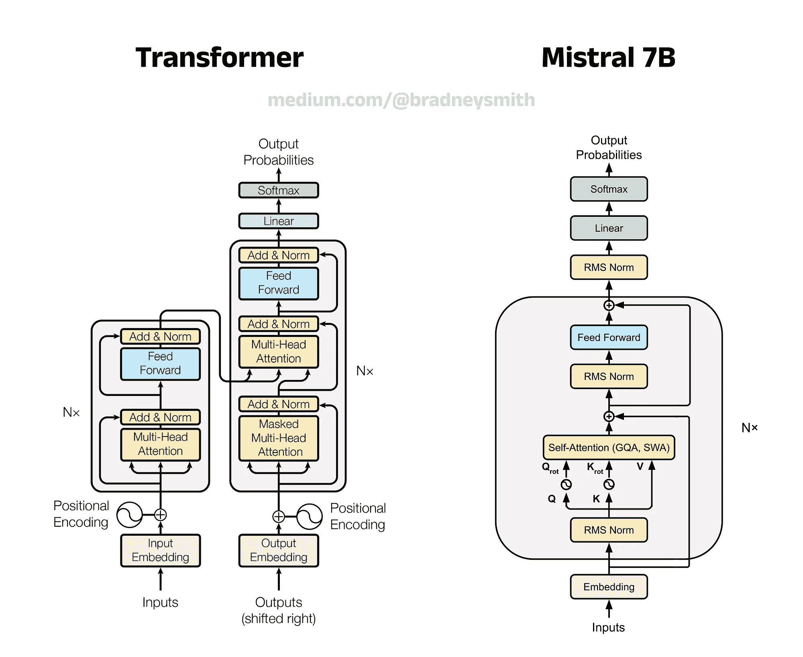
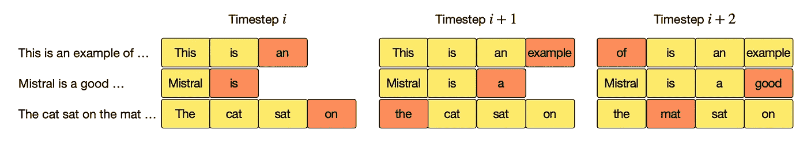

# Mistral 7B 解析：迈向更高效的语言模型

> 原文：[`towardsdatascience.com/mistral-7b-explained-towards-more-efficient-language-models-7f9c6e6b7251?source=collection_archive---------1-----------------------#2024-11-26`](https://towardsdatascience.com/mistral-7b-explained-towards-more-efficient-language-models-7f9c6e6b7251?source=collection_archive---------1-----------------------#2024-11-26)

## RMS Norm、RoPE、GQA、SWA、KV 缓存等！

[](https://medium.com/@bradneysmith?source=post_page---byline--7f9c6e6b7251--------------------------------)[](https://towardsdatascience.com/?source=post_page---byline--7f9c6e6b7251--------------------------------) [Bradney Smith](https://medium.com/@bradneysmith?source=post_page---byline--7f9c6e6b7251--------------------------------)

·发表于[Towards Data Science](https://towardsdatascience.com/?source=post_page---byline--7f9c6e6b7251--------------------------------) ·42 分钟阅读·2024 年 11 月 26 日

--

**“从零开始的 LLM 系列”第五部分——完整指南，帮助理解和构建大型语言模型。如果你有兴趣了解这些模型是如何工作的，我鼓励你阅读：**

+   [第一部分：分词——完整指南](https://medium.com/p/cedc9f72de4e)

+   [第二部分：从零开始的 word2vec 词向量与 Python 实现](https://medium.com/p/eb9326c6ab7c/)

+   [第三部分：自注意力机制解析与代码](https://medium.com/p/d7a9f0f4d94e)

+   [第四部分：BERT 完整指南与代码](https://medium.com/p/9f87602e4a11)

+   **第五部分：Mistral 7B 解析：迈向更高效的语言模型**


图片由作者提供，使用 Freepik AI 创作。

# 引言

Mistral 7B 于 2023 年 9 月发布，代表了向更小、更高效的大型语言模型（LLM）发展的一个重要里程碑。在过去几年中，LLM 性能的主要提升机制是模型规模，即增加模型中可学习的参数数量。近年来，这导致了参数数量达到数百亿的模型，但这些模型的训练和服务成本较高，并且推理时间较长。然而，通过精心的架构设计和注意力机制的进步，Mistral AI 在 LLM 开发方面取得了突破，利用少量的参数实现了与更大模型相当甚至更高的性能。本文将全面介绍 Mistral 7B 中的各个组件，这些组件使得这些效率提升成为可能。

> ***注意：*** *在下一篇文章中，我们将探讨 QLORA，一种参数高效的微调技术，并展示如何针对任何下游任务微调 Mistral 7B 和增强版 NeMo 12B 模型。*

# 目录

1 — Mistral 7B 概述

2 — 均方根归一化（RMS Norm）

3 — 旋转位置嵌入（RoPE）

4 — 分组查询注意力（GQA）

5 — 滑动窗口注意力（SWA）

6 — 滚动缓冲 KV 缓存

7 — SwiGLU 激活函数

8 — 结论

9 — 进一步阅读

# 1 — Mistral 7B 概述

## **1.1 — 介绍 Mistral AI**

自 2022 年 11 月大型语言模型（LLM）热潮以来，许多竞争者涌现，挑战 OpenAI 的主导地位。ChatGPT 的发布使得生成式语言模型的兴趣激增，因此，更多的公司涌现出来推动这一研究向前发展也就不足为奇。

在这些新兴公司中，有一家名为 Mistral AI 的巴黎初创公司，由前 Meta 和 Google DeepMind 员工于 2023 年 4 月成立。其目标是创建专注于效率的强大大型语言模型，这一理念体现在他们的首个模型——Mistral 7B [1] 中。该模型具有四个主要特点：

+   **解码器单一架构：** 基于原始 Transformer 中解码器模块的架构

+   **高效设计：** 一个拥有较少参数的强大大型语言模型

+   **两种可用模型类型：** 提供基础模型和指令模型

+   **强大性能：** 在所有基准测试中表现优异，甚至与其更大同类模型相比也不遑多让。

## **1.2 — 解码器单一架构**

在[上一篇文章](https://medium.com/p/9f87602e4a11)中，我们讨论了谷歌的 BERT 模型，它基于原始 Transformer 架构中的编码器模块。仅编码器模型在 BERT 系列之外相对较少见，大多数在 2021 年后发布的 LLM 要么采用原始 Transformer 的旧版编码器-解码器设计，要么更常见地采用原始 GPT 推广的解码器单一架构。仅编码器设计使得 BERT 能够利用双向上下文，并在分类等任务中表现出色。然而，这一设计也限制了 BERT 在生成型应用中的能力，如聊天机器人任务（这可能是仅编码器模型逐渐减少的原因）。

相比之下，解码器单一模型使用单向上下文来预测序列中的下一个词元，这一过程被称为自然语言生成（NLG）。这些模型被应用于聊天机器人等应用中，例如虚拟助手、ChatGPT 等，用户输入提示，模型一次生成一个词元的适当响应。作为在 BERT 时代之后发布的模型，Mistral 也使用了解码器单一架构，主要用于 NLG 任务。


下面的对比展示了 BERT 在自然语言理解（NLU）上的专注与 Mistral 7B 在自然语言生成（NLG）上的专注。图片来源：作者。

## **1.3 — Mistral 7B 作为高效 LLM**

**趋向更大模型的趋势：**

如前所述，LLM 的发展趋势是通过增加模型的大小来提升性能。一般的想法是，较大的模型（具有更多参数）能够更好地捕捉训练数据中的关系和细微差别，从而在推理过程中产生更好的输出。这种方法已被证明非常有效，导致模型在所有常见的性能基准测试中表现出色。这些大模型的例子包括 xAI 的 Grok-1（3140 亿参数）、谷歌的 PaLM 2（3400 亿参数），以及 OpenAI 的 GPT-4，尽管其参数数量未公开披露，但据信达到了万亿参数的范围。

**大模型的缺点：**

尽管这些更大的模型展示了高水平的性能，但它们也有一些显著的缺点。训练这些模型既费时又昂贵。大量的参数意味着每个优化步骤中需要更新许多权重和偏差，从而需要巨大的计算资源。这个问题在推理时依然存在，在没有足够强大硬件的情况下，提示这些模型可能会导致响应时间缓慢。其他缺点还包括由于更高的能源需求，环境和可持续性问题，这使得它们的碳足迹相比较小的模型更大。

**Mistral 7B 作为更小、更高效的模型：**

Mistral 7B 因其在变压器架构方面的进步而广为人知，这些进展使得该模型能够在减少参数数量的同时保持高性能。因此，Mistral AI 通过将重点从当前范式转移，推广更小的模型，领导了高效 LLM 的发展。这种方法具有几个优势，比如减少训练时间和成本，并且应对上述提到的可持续性问题。在接下来的部分，我们将探讨这些架构变化是什么，以及它们如何在更小的尺寸下实现更高性能的模型。

## **1.4 — 基础模型、对话模型和指令模型概述**

**不同的模型类型：**

如果你在网上阅读过有关不同 LLM 的资料，可能会遇到“base”、“chat”和“instruct”这几个术语。**Base**指的是可以在下游任务中进行微调的模型标准版本，而**chat**和**instruct**则指的是在 base 模型基础上专门为聊天和指令任务微调的版本。聊天模型经过对话数据的微调，旨在用于聊天机器人应用，如虚拟助手和 ChatGPT 风格的用例。指令模型则旨在接收指令并作出回应。尽管这两者在微调上有些许差异（将在下文描述），但重要的是要认识到，两者的预训练是相同的。因此，尽管每个模型在各自领域的表现更好，但也可以将任意一个模型用于两种任务。

**聊天与指令：**

聊天模型是为对话交互设计的，旨在模拟类人对话。例如，聊天模型通常用于客户支持环境中的虚拟助手，其中输入格式更为非正式和灵活。相反，指令模型旨在根据指令执行特定任务。这里的示例包括代码生成和数据总结等任务。这些类型模型的输入格式更加结构化，需要更正式的提示。

**Mistral 7B 中的模型类型：**

Mistral 7B 既有 base 版本，也有 instruct 版本，尽管目前没有为 chat 特别微调的版本。然而，base 版本与上面描述的 chat 变体非常相似，可以以非结构化、非正式的方式进行交互。如需查看 Mistral AI 模型的完整列表，可以访问 Hugging Face 模型库中的 Mistral AI 页面。[2]

## **1.5 — LLM 基准测试的表现**

Mistral 7B 还可以通过与更大、同类的模型相比的强劲表现来进行特征描述。在最初的宣传资料中，Mistral AI 将其新的 LLM 与 Meta 的 Llama 系列模型进行了比较：Llama 和 Llama 2（当时 Llama 3 尚未发布）。这些性能比较的图表如下所示，并已摘自 Mistral 7B 的论文[1]。

这些基准测试中的一些利用了零-shot 学习、少-shot 学习或两者的混合。**零-shot 学习**是指在没有明确遇到过的预训练数据的情况下，要求模型执行任务或回答问题。这要求模型从现有知识中进行泛化以提供答案。**少-shot 学习**则是指在提示中提供少量示例，帮助模型理解预期的答案格式或类型。


Mistral 7B 在一系列基准测试中与 Llama 和 Llama 2 的表现比较[1]。


上述比较的表格视图及每个基准的分数[1]。

整体趋势表明，Mistral 7B 在所有评估的指标上都优于 Llama 2 13B，且差距通常相当明显。更令人印象深刻的是，Mistral 7B 在大多数基准测试中也能够匹配或超越 Llama 1 34B 的表现。

为了便于可视化，作者将一些相似的基准测试分组为类别，如“知识”和“推理”。下面给出了这些类别的详细信息。

+   **MMLU：** 大规模多任务语言理解（MMLU）不是一个类别，而是一个单一的基准测试。这个评估旨在衡量一个模型在预训练阶段捕获知识的程度，采用零-shot 和少-shot 学习。这些问题涉及 57 个学科，包括科学、技术、工程、数学（STEM），以及人文学科、社会科学、法律、伦理等。MMLU 由 Hendrycks 等人在 2021 年提出，已被 NLP 社区作为评估 LLM 表现的事实标准[3]。

+   **知识：** 知识类别的结果是通过 NaturalQuestions 和 TriviaQA 基准测试的平均值得出的，这些基准使用 5-shot 学习。这些数据集包含一系列问题，用以检验模型从训练数据中获得的一般知识。

+   **推理：** 推理类别的结果是通过 HellaSwag、Winogrande、PIQA、SIQA、OpenbookQA、ARC-Easy、ARC-Challenge 和 CommonsenseQA 基准测试的平均值得出的，这些基准使用零-shot 学习。这些数据集测试模型推理现实世界问题的能力。

+   **理解：** 理解类别的结果是通过 BoolQ 和 QuAC 基准测试的平均值得出的，这些基准使用零-shot 学习。这些数据集侧重于基于上下文中的文本段落向模型提问，评估模型在对话中理解信息的能力。

+   **AGIEval：** 与 MMLU 类似，AGIEval 是一个单一的基准测试，而不是多个基准的类别。AGIEval，全称人工通用智能评估，旨在“专门评估基础模型在以人为中心的标准化考试中的表现，如大学入学考试、法学院入学考试、数学竞赛和律师资格考试”。作者认为，之前的基准测试偏向于适合机器和人工数据集的任务，而 AGIEval 则考察更接近人类水平的能力。AGIEval 于 2023 年由 Zhong 等人发布[4]。

+   **数学：** 数学类别的结果是通过 GSM8K 和 MATH 基准测试的平均值得出的，这两个基准分别使用 8-shot 和 4-shot 学习。这些数据集包含基本运算（加法、减法、乘法和除法）的数学问题，并可能需要多步才能解决。

+   **BBH：** 与 MMLU 和 AGIEval 类似，BIG-Bench Hard（简称 BBH）是一个单一基准。BBH 包含来自更大 BIG-Bench 数据集的 23 个特别具有挑战性的任务，专注于评估模型未能超越平均人类评分者的任务。该基准由 Suzgun 等人于 2022 年提出[5]。

+   **代码：** 代码类别的平均结果为零次尝试的 Humaneval 和三次尝试的 MBPP。这些基准测试评估模型从文本提示生成代码的能力。

## **1.6 — Mistral 7B 架构概述**

自从 Transformer 首次问世以来，LLM 组件已经取得了长足的进步，因此现代 LLM 通常在原始设计基础上进行了许多改进。关于注意力机制和位置编码器的改进建议已经相对频繁地发布，研究人员正在竞相发现下一项技术，以推动该领域的进一步发展。

与其使命一致，Mistral AI 利用了这些进展来提高 Mistral 7B 的效率，成功构建了一个在参数量上只有原先一小部分的高性能模型。在接下来的章节中，我们将探讨这些进展，包括：

+   **RMS 归一化** — 替代层归一化

+   **旋转位置嵌入（RoPE）** — 替代绝对位置编码

+   **分组查询注意力（GQA）** — 替代多头注意力机制

+   **滑动窗口注意力（SWA）** — 提高训练和推理速度，尤其适用于长序列

+   **滚动缓冲区 KV 缓存** — 与 SWA 配合使用，提高训练和推理速度

+   **SwiGLU 激活函数** — 替代前馈子层中的 ReLU



对 Mistral 7B 与原始 Transformer 架构的比较。图片来源作者，包含来自[13]的 Transformer 图示。

## **1.7 — BERT 参数比较**

自 2018 年 GPT 和 BERT 发布以来，模型规模持续快速增长，出现了拥有数百亿参数的模型并不罕见。与同类模型相比，Mistral 7B 被认为是一个相对较小的模型。为了说明这一点，当时 BERT Large 在发布时被认为是非常庞大的，然而它仅包含 3.4 亿个参数，这也显示出这个领域在短短几年内取得的进展。对于跟随本系列的人来说，你可能还记得在[第四部分](https://medium.com/p/9f87602e4a11)中有一个表格总结了 BERT Base 和 BERT Large 的模型参数。下面已更新此表，包含与 Mistral 7B 的对比。

阅读此表格时需要注意几点：

+   **词汇表大小**：尽管模型复杂性有所增加，Mistral 7B 的词汇表大小与 BERT 几乎相同。

+   **上下文长度**：Mistral 7B 支持比 BERT 大 16 倍的上下文长度，允许分析更长的文档。这是大规模语言模型（LLM）中的一个趋势，带来了许多好处，比如在聊天机器人应用中可以处理更长的对话历史，允许在提示中使用诸如书籍等较长文本中的知识，等等。

+   **注意力头**：Mistral 7B 将其查询矩阵分成 8 组，每组包含 4 个矩阵，且每组共享一个键值矩阵。这是由于分组查询注意力（GQA），我们将在本文后续部分讨论这一点。


BERT Base、BERT Large 和 Mistral 7B 关键参数的对比。图像由作者提供。

> ***注意：*** *仅编码器和仅解码器模型在架构上基本相似，这可以通过比较原始 Transformer 中的编码器和解码器块来看到。除了额外的“多头注意力”和“加法与归一化”步骤，这些块之间的主要区别在于是否存在最终的“线性”层及其对应的 softmax 函数。这些附加组件使得解码器块（因此也使得编码器-解码器和仅解码器模型）能够执行下一个标记预测（NTP）。*

# 2 — 均方根归一化（RMS Norm）

## **2.1 — 归一化和前馈子层简介**

如果你跟随系列文章阅读，你可能已经注意到我们尚未涵盖 Transformer 架构中的“归一化”或“前馈”步骤。这两个组件（通常称为子层）在 Mistral 7B 中得到了改进，因此理解它们的功能以及为什么需要它们将非常有用。让我们现在来探讨这个问题。

**归一化子层：**

由于一种被称为**协变量偏移**的问题，基于 Transformer 的模型需要进行归一化。协变量偏移描述的是在模型中某些权重更新显著，而其他权重则没有发生更新的现象。权重分布的这种变化会对网络中的下一层产生连锁反应，在反向传播过程中导致进一步的不稳定更新，从而影响性能。归一化通过确保输入向量的均值和方差一致，从而标准化每一层的输入，这反过来帮助稳定学习过程。

**前馈子层：**

前馈步骤引入了非线性变换和额外的学习能力。简单来说，这些组件使得模型能够通过从训练数据中学习，决定如何最好地改进其对文本的内部表示。前馈块是由以下部分组成的浅层神经网络：输入层、一个隐藏层和输出层。在 Transformer 中，前馈网络的输入是来自标准化步骤的输出（稍后我们会看到，这对于 Mistral 7B 有所不同）。前馈网络接受这些输入序列的数值表示，并以一种有助于模型生成良好输出序列的方式更新它们。通过使用神经网络方法，我们消除了对模型如何增强这些表示施加严格规则的需要，而是允许模型通过反向传播学习如何最好地改变它们。

**示例：**

举个更具体的例子，考虑原始 Transformer 如何处理输入序列：“写一首关于一个人在河岸上钓鱼的诗”。

1\. **标记化**：将输入序列划分为标记`write`、`a`、`poem`、`about`、`a`、`man`、`fishing`、`on`、`a`、`river`和`bank`。有关标记化的更多信息，请参见[本系列第一部分](https://medium.com/p/cedc9f72de4e)。

2\. **嵌入**：将每个标记映射到其对应的学习嵌入。这些是标记的向量表示，编码了它们的整体含义。有关嵌入的更多信息，请参见[本系列第二部分](https://medium.com/p/eb9326c6ab7c)。

3\. **多头注意力**：将嵌入传入注意力块，以更新每个单词的向量表示，结合上下文信息。这确保了像`bank`这样的词根据其使用情况（例如河岸、银行等）获得更合适的向量表示。有关注意力块的更多信息，请参见[本系列第三部分](https://medium.com/p/d7a9f0f4d94e)。

4\. **标准化**：将来自注意力块的上下文嵌入传递到标准化块。在这里，输入的向量被标准化，以确保均值和方差的一致性，从而缓解协变量偏移的问题。

5\. **前馈**：将来自标准化步骤的输出传递到前馈子层。该步骤以有助于模型在后续过程中生成优美诗歌的方式更新每个标记的向量表示。更新向量表示的具体步骤不是硬编码的，而是通过反向传播由模型学习得到的。

6\. **标准化**：将前馈步骤的输出传递到另一个标准化块。步骤 3 到 6 会重复*N*次（其中*N*是编码器块的数量），然后向量表示会被传递到解码器块。

## 2.2— 层归一化概述（LayerNorm）

Transformer 使用一种名为 **LayerNorm** 的归一化方法，该方法于 2016 年发布，作为对当时神经网络中使用的旧 BatchNorm 方法的改进 [6]。LayerNorm 的目标是通过修改输入到某一层的分布，使其符合高斯（正态）分布，从而防止协变量偏移，因此得名“归一化”。

**归一化子层的输入：**

在 Transformer 中，归一化过程发生在每个 Attention 块和每个 Feed Forward 块之后。因此，归一化步骤的输入在每个位置都会有所不同：

+   **在多头自注意力之后**：自注意力输入 + 自注意力输出

+   **在前馈网络之后**：前馈网络输入 + 前馈网络输出

初看之下，可能会觉得将归一化块同时传递给 Attention/Feed Forward 块的输入和输出有些奇怪。然而，包含这两个组件对于实现强大的模型性能至关重要。

**残差连接的必要性：**

下图架构图显示了 Attention 和 Feed Forward 子层的输入通过 **残差连接**（红色高亮）传递给归一化子层。这些输入在归一化之前分别与 Attention 和 Feed Forward 的输出相加，因此“Add & Norm”标签中的“Add”即指这一过程。残差连接有助于解决一个被称为 **梯度消失问题** 的难题，这也是训练深度神经网络时常见的挑战。在反向传播过程中，梯度（损失函数对每个权重的偏导数）决定了权重更新的方向和大小。然而，这些梯度有时会在经过许多层后变得极其微小，导致某些权重的更新几乎可以忽略不计。这会导致网络中的早期层学习变得非常缓慢，因为它们的梯度接近于零。残差连接通过允许梯度更加直接地流向早期层，从而绕过一些中间层，缓解了这个问题。这条额外的路径有助于保持梯度的强度，确保稳定的更新，并防止模型“遗忘”在早期层学到的知识。简而言之，在每个归一化阶段包含残差连接为反向传播的梯度提供了额外的路径，防止模型在早期层学习缓慢。


Transformer 架构图的特写，展示了 Add & Norm 块的残差连接，红色高亮标出。图像由作者标注。

## 2.3 — **可视化 LayerNorm**

LayerNorm 将输入到网络的分布转换，使其值遵循高斯分布。考虑下面图像中展示的示例，它关注于在 Attention 步骤后进行标准化。在这里，LayerNorm 的输入将是 Attention 输入和 Attention 输出的和，其结果是一个表示输入序列中每个标记的上下文标记嵌入矩阵（在本例中为“Write a poem about a man fishing on a river bank”）。该矩阵的维度为 *L_max* x *d_model*，其中 *L_max* 是输入序列的长度，*d_model* 是嵌入维度的数量。该矩阵的列存储了输入序列中每个标记的嵌入。例如，第一列存储了“write”的上下文嵌入，第二列存储了“a”的嵌入，以此类推。

可以通过直方图绘制频率图来逼近每个标记嵌入的值分布。下图展示了“bank”这个标记的嵌入的示例。在标准化之前，“bank”嵌入向量中的值的均值为 18.5，而标准化后，均值降至 0。标准化过程会分别应用于矩阵的每一列，每一列都根据其自身的均值和方差进行标准化。


使用 LayerNorm 进行标准化的概览，以输入序列“Write a poem about a man fishing on a river bank”为例。图片由作者提供。

## 2.4 — **LayerNorm 公式**

为了标准化标记嵌入，我们首先为每一列计算两个关键统计值：**均值**和**方差**。这些值分别描述了数据的中心和离散程度。一旦这些值确定，就可以根据标准化公式调整输入向量中的每个值。让我们简要分解这些公式：

+   **均值**：均值（平均值）描述了分布的中心，通过将一列中的所有值相加，并除以该列中值的数量（维度）来计算。

+   **方差**：方差描述了分布中数据点的离散程度（变化量），通过计算每个数据点与均值之间的平均平方距离来获得。较高的方差表明数据点分布更广，而较低的方差则表明值集中在均值附近。使用平方差而非绝对差值，部分是出于历史原因，但也因为它提供了一个可微分的离散度衡量。这一性质在高级统计学中非常有用，因此方差成为该领域的标准度量。

+   **归一化**：归一化过程涉及两个主要公式。第一个（见下图左侧的两个公式中的第一个）将列的当前分布转换为正态分布。通过从每个值中减去均值，使分布集中在 0，然后除以方差的平方根（即标准差）。这一除法确保结果分布的标准差为 1，这是正态分布的要求。为了防止数据没有分布时出现除以 0 的情况，增加了一个额外的项 ϵ。第二个公式通过使用两个参数：缩放因子 γ 和偏移量 β，对这些归一化后的值进行可学习的调整。这些参数通过反向传播在训练过程中被模型学习。γ 和 β 的值是针对每个特征（矩阵中的行）而非每个嵌入（矩阵中的列）进行的。因此，嵌入的每个维度都会使用不同的 γ 和 β 值进行变换。这使得模型能够在嵌入空间内学习灵活的变换，从而提高其表示数据中复杂模式的能力。


LayerNorm 过程中的四个关键公式。图像来源：作者。

## **2.5 — RMS 归一化简介**

Mistral 7B 使用了一种对 LayerNorm 的改进，叫做均方根归一化（Root Mean Square Normalization），或**RMS Norm**，该方法由 Zhang 和 Sennrich 于 2019 年提出 [7]。作者假设，LayerNorm 的有效性是由于对值进行重新缩放（通过方差除法），而不是重新中心化（减去均值）。

因此，如果能够省略均值的计算，模型在训练阶段将显著加速。然而，问题在于，方差的计算本身也需要均值已知。因此，作者着手寻找一种新的重新缩放方法，最终形成了 RMS 归一化。

## **2.6 — RMS 统计量**

用于重新缩放值的 RMS 统计量有一个简单的公式，如下所示。实质上，输入矩阵（嵌入）中每一列的值都会除以该列的平均平方值的平方根（因此称为“均方根”）。与 LayerNorm 类似，归一化的结果会通过一个可学习的参数 γ 进行缩放（注意这里不需要 β，因为作者认为重新中心化并不必要）。尽管这个变化较小，但将 LayerNorm 替换为 RMS Norm 会显著加速神经网络模型的训练，成为自 Transformer 发布以来 LLM 架构中的许多进展之一。


Mistral 7B 使用的归一化技术 RMS Norm 的公式。图像来源：作者。

# **3 — 旋转位置嵌入（RoPE）**

## 3.1 — 位置编码器概述

与旧有架构（如循环神经网络）不同，基于 Transformer 的模型并不是按顺序处理输入的每个 token，而是并行处理所有输入 token。虽然这种并行处理提高了速度，但也导致了位置信息的丢失，因为 token 并不是按顺序处理的。因此，需要某种形式的位置信息编码将此信息注入到嵌入向量中，并且可以通过多种方式实现这一点。

**绝对位置编码：**

原始 Transformer 中引入的正弦位置编码技术使用正弦和余弦函数为输入序列中的每个 token 创建一个位置编码向量。这些向量通过向量加法被添加到学习到的嵌入中。位置编码仅依赖于 token 在序列中的绝对位置，而不依赖于输入序列本身。因此，位置为 0 的 token 将始终具有相同的位置信息编码，无论序列如何。因此，这种方法被称为**绝对位置编码**。

这种方法的一个局限性在于，它只表示 token 的绝对位置，而不是它们之间的相对距离。例如，位置 3 和 5 之间的 token 距离与位置 103 和 105 之间的距离是相同的，但使用绝对位置编码时并不会捕捉到这一信息。从直观上讲，距离较近的 token 可能比距离较远的 token 更为相关，而编码这种相对位置的信息可以显著提高模型性能。

**相对位置编码：**

2018 年 4 月，谷歌的研究人员（包括原始 Transformer 论文的两位作者）发表了*“Self-Attention with Relative Position Representations”*一文，提出了一种新的位置编码范式[8]。作者探讨了**相对位置编码**的使用，这种编码不仅捕捉了 token 之间的相对距离，还包括它们的绝对位置。例如，在句子“Write a poem about a man fishing on a river bank”中，“poem”和“man”之间相隔三个词，正如“on”和“bank”之间相隔三个词一样。这种类型的位置信息编码已经在一些著名模型中得到应用，比如 Dai 等人的 Transformer-XL（2019）[9] 和谷歌的 T5（2020）[10]。

尽管相对位置编码提高了模型捕捉 token 之间关系的能力，但它显著增加了训练时间。随着模型的规模扩大，增加训练时间的组件变得不那么实际。此外，像 KV 缓存集成（我们将在本文后面讨论）这样的挑战也使得许多研究者放弃了这一技术。我们不会详细介绍原始的相对位置编码技术，但如果你有兴趣，强烈建议你阅读相关论文。

**旋转位置嵌入（RoPE）：**

Rotary 嵌入由 Su 等人在 2020 年的论文 *“RoFormer: Enhanced Transformer with Rotary Position Embedding”* 中提出，提供了一种独特的编码位置信息的方法[11]。与正弦波编码直接将位置信息添加到 token 嵌入中不同，rotary 嵌入则对每个 token 的 **查询向量和键向量** 应用 **旋转**。每个 token 的旋转角度基于其在序列中的绝对位置。例如，在输入“write a poem about a man fishing on a river bank”中，`poem`（位于位置 2）的查询和键向量旋转了 2θ，而 `man`（位于位置 5）的查询和键向量旋转了 5θ，依此类推。注意，token 位置是零索引的，这意味着我们从 0 开始计数而不是 1（因此 `write` 被认为处于位置 0，且其查询和键向量没有旋转）。这种方法不仅捕捉了 token 的绝对位置，还捕捉了相对位置，因为 `man` 和 `poem` 之间相隔 3θ，表示它们之间有 3 个 token 的距离。

使用角位移编码位置信息还具有一些与现有的 Transformer 组件配合良好的优点。例如，自注意力机制在很大程度上依赖于点积操作，其公式已经考虑了查询和键之间的角距离。此外，如果在两个 token 前后添加更多的 token，它们之间的角距离保持不变。这使得输入序列可以进行修改，而不会显著改变位置信息，这与绝对位置编码方法不同。

## **3.2 — 实现 RoPE**

上述大纲简要概述了 RoPE，旨在说明其核心概念，但技术实现包含了两个重要细节：

1. **成对特征旋转**：每个查询/键向量的特征在嵌入空间内成对旋转。

2\. **多频率位置编码**：查询/键向量中的每一对特征都会以稍微不同的角度旋转。

让我们来看看 RoPE 如何集成到基于 Transformer 的架构中，了解其实现背后的数学原理，并理解上述两个细节的含义，以及为什么它们对于 RoPE 的有效运行是必要的。

## **3.3 — 将 RoPE 集成到 Transformer 中：**

使用 RoPE 的 Transformer 处理文本的步骤如下：

1\. **分词与嵌入**：和往常一样，过程从模型接收到输入序列开始，该序列被分词以生成 token ID 列表。这些 token ID 随后被转换为 token 嵌入，形成一个矩阵，其中每一列对应一个 token 的嵌入向量。

2\. **归一化**：在原始的 Transformer 模型中，位置信息直接添加到原始的令牌嵌入中。然而，在使用 RoPE 的模型中，令牌嵌入首先会进行归一化。此步骤通过防止协变量偏移来稳定训练，如前文所述（请参见第 2.1 节中的架构图）。

3\. **计算查询、键和值矩阵**：模型接着计算出注意力机制所需的查询、键和值矩阵（*Q*、*K* 和 *V*）。这一过程通过将归一化的嵌入矩阵与相应的权重矩阵 *W_Q*、*W_K* 和 *W_V* 相乘来实现。这里，结果矩阵的列分别表示每个令牌的查询、键和值向量。查询和键矩阵用于计算注意力得分，然后这些得分对值矩阵中的值进行加权，从而在注意力模块中生成上下文感知的输出（有关更详细的解释，请参见[第三部分](https://medium.com/p/d7a9f0f4d94e)）。

4\. **旋转查询和键矩阵**：查询和键矩阵被旋转以包含位置信息。由于在计算注意力得分时仅涉及查询和键矩阵，因此位置信息仅添加到这些矩阵中。因此，**值矩阵不进行旋转**。在计算出注意力得分后，值矩阵仅提供将根据得分更新的嵌入。这就是为什么在架构图中值矩阵中省略了位置编码符号的原因。

## **3.4 — 特征对的旋转**

RoFormer 论文首先考虑了一个简单的情况，其中每个令牌嵌入只有两个维度（*d*=2）。在这个示例中，应用标准的二维旋转矩阵对令牌的查询和键向量（分别表示为 *q* 和 *k*）进行旋转非常简单。下面的方程展示了旋转后的查询向量 *q_rot* 和键向量 *k_rot*，它们来自归一化的令牌嵌入。旋转矩阵 *R* 是一个尺寸为 *d* x *d* 的方阵：在此情况下，*R* 是 2x2。旋转矩阵还依赖于角度 θ（我们稍后会讨论）和乘数 *m*，*m* 由令牌在序列中的绝对位置决定。也就是说，对于第一个令牌，*m* = 0；对于第二个令牌，*m* = 1，以此类推。

> ***注意***：以下方程展示了单一查询和键向量的简化示例，而非整个查询和键矩阵。实际上，这一操作将在矩阵级别而非向量级别进行，以并行化处理并显著提高效率。然而，底层概念保持不变。


旋转后的查询（上）和键（下）向量的方程，其中包含通过 RoPE 过程编码的位置信息。图片来源：作者。

这些方程展示了简单二维情况的过程。在实际应用中，大多数模型使用数百甚至数千维的嵌入。旋转这么多维度的向量变得非常复杂，导致一次性旋转整个向量变得不实际。为了解决这个问题，作者提出了通过对每一对特征应用二维旋转矩阵来每次旋转两个元素。这样做的好处是速度更快，操作更简单，但限制了模型只能使用偶数维度的嵌入（尽管通常情况下就是如此）。

下面的公式展示了 *d* 维嵌入向量的旋转矩阵形式。你会看到沿对角线有重复的 2D 旋转矩阵，剩余的元素填充为零。由于嵌入向量有 *d* 个维度，所以有 *d*/2 对特征，因此对角线上有 *d*/2 个旋转矩阵。


RoPE 中使用的旋转矩阵 R 的一般形式。图片由作者提供。

## **3.5 — 多频率位置编码**

在上面的公式中，你可能会注意到每一对特征都有自己独特的下标θ，表示每一对特征是按稍微不同的角度旋转的。你可能会想为什么每一对特征不按相同的角度旋转。简短的回答是，使用常数θ是可行的，但为每一对特征调整θ可以提高模型性能。θ的变化使得模型能够以更细粒度的方式捕捉嵌入信息，即在特征对的层级上，而不仅仅是在嵌入层级上。这被称为**多频率位置编码**，这种技术使得模型能够学习嵌入空间的信息，并在注意力机制中创建更丰富的数据表示。

**确定旋转角度 θ：**

这个难题的最后一部分是建立一个关于θ的公式。作者提出了下面左侧的方程，它将旋转角度作为令牌嵌入维度 *d* 和特征对索引 *i* 的函数进行计算。这个方程的形式直接受原始 Transformer 的正弦编码（右侧）的启发，作者特别指出这个选择是为了确保“长期衰减特性”[11]。这描述了一个特性，即远距离的令牌之间的连接比近距离的令牌之间的连接要少，这一点在原始 Transformer 中表现良好。

> ***注意：*** *如果你以前见过正弦编码的公式，你可能会记得分子通常用“pos”而不是“m”表示。“pos”和“m”都表示令牌在输入序列中的绝对位置，因此我们在这里使用相同的符号写出两个方程，以帮助更容易地进行视觉比较。*


RoPE（左）和正弦编码（右）的位置编码方程对比。图片由作者提供。

## **3.6 — 进一步提高计算效率**

简而言之，RoPE 通过将*d*维查询和键向量通过*d* x *d*旋转矩阵进行旋转来引入位置信息，如下所示。这里，*x*用作通用符号，表示查询向量（*q*）或键向量（*k*）：


在 d 维空间中，RoPE 的一般形式，其中通用地表示被旋转的查询或键向量。图片由作者提供。

实际上，由于矩阵乘法的性质，这种方法仍然相当缓慢。幸运的是，我们可以通过一个技巧来加速这一过程。旋转矩阵包含许多零元素，因此被称为**稀疏**矩阵。由于这种稀疏性，我们可以重新构造方程的形式，仅使用逐元素乘法和向量加法——这两种操作要快得多。下面的方程展示了在实际模型中使用的 RoPE 的高效实现，其中⊙表示逐元素乘法。


表示逐元素向量乘法和加法的 RoPE 方程的扩展形式。图片由作者提供。

你可以在 HuggingFace 的 Llama 仓库中查看 PyTorch 实现的 RoPE 公式[12]。下面是对方程进行改写的版本，旨在帮助理解代码：


上述方程的改写形式，更加贴合 Hugging Face GitHub 仓库中 Llama 模型使用的 PyTorch 实现的 RoPE。图片由作者提供。

```py
def rotate_half(x):
    """Rotates half the hidden dims of the input."""

    x1 = x[..., : x.shape[-1] // 2]
    x2 = x[..., x.shape[-1] // 2 :]
    return torch.cat((-x2, x1), dim=-1)

def apply_rotary_pos_emb(q, k, cos, sin, position_ids=None, unsqueeze_dim=1):
    """Applies Rotary Position Embedding to the query and key tensors."""
    cos = cos.unsqueeze(unsqueeze_dim)
    sin = sin.unsqueeze(unsqueeze_dim)
    q_embed = (q * cos) + (rotate_half(q) * sin)
    k_embed = (k * cos) + (rotate_half(k) * sin)
    return q_embed, k_embed
```

这 10 行代码使得像 Llama 和 Mistral 7B 这样的模型能够实现丰富的位置信息编码，同时保持快速的训练和推理速度。RoPE 的优势可以总结为：

+   高效实现了编码令牌之间的相对位置

+   通过更好地学习短期和长期依赖关系，改进了模型在长序列上的表现。

+   容易与现有的点积自注意力机制兼容

# **4 — 分组查询注意力（GQA）**

在[第三部分](https://medium.com/p/d7a9f0f4d94e)中，我们详细介绍了自注意力机制，并简要介绍了多头注意力（MHA），这是自注意力在原始 Transformer 架构中的一种具体实现。从那时起，更新的模型采用了改进的注意力机制，优化了训练和推理的效率。Mistral 7B 使用了分组查询注意力（GQA），该机制本身是建立在多查询注意力（MQA）基础上的。在本节中，我们将按时间顺序探讨这些技术，以了解 Mistral 7B 如何执行自注意力。

## **4.1 — 多头注意力（MHA）概述**

多头注意力（MHA）是在 2017 年的论文*“注意力就是一切”* [13] 中引入的，通过将注意力机制分成多个**头部**来扩展标准的自注意力。在标准的自注意力中，模型学习一个单独的权重矩阵集合（*W_Q*、*W_K* 和 *W_V*），将标记嵌入矩阵 *X* 转换为查询、键和值矩阵（*Q*、*K* 和 *V*）。然后使用这些矩阵计算注意力分数，并使用上下文信息更新 *X*。

相比之下，MHA 将注意力机制分割为*H*个独立头部，每个头部学习自己的较小权重矩阵集合。这些权重用于计算一组较小的、头部特定的查询、键和值矩阵（表示为*Q^h*、*K^h* 和 *V^h*）。每个头部独立处理输入序列，生成不同的注意力输出。然后将这些输出连接在一起（叠加在一起），并通过最终的线性层传递，产生更新的*X*矩阵，如下图中显示的*Y*，具有丰富的上下文信息。

通过引入多个头部，MHA 增加了注意力过程中可学习参数的数量，使模型能够捕捉数据中更复杂的关系。每个头部学习自己的权重矩阵，使它们能够关注输入的不同方面，如长距离依赖关系（远距离单词之间的关系）、短距离依赖关系（附近单词之间的关系）、语法结构等。总体效果产生了对输入序列更细致理解的模型。

## 4.2 — 多头注意力逐步

让我们逐步走过这个过程，展示每个阶段使用的方程式及其维度。这些步骤的摘要在最后的单个图表中给出。

**1\. 生成一个标记嵌入矩阵，*X*：**

首先，输入序列被标记化，标记 ID 被映射到它们学习的嵌入中，并添加位置信息。这产生了一个大小为*L_max* x d 的矩阵，其中*L_max*是输入序列的最大长度，*d*是每个标记的嵌入维度。这给出了标记嵌入矩阵*X*，它沿着列存储标记嵌入向量。


标记嵌入矩阵 *X*，它构成了多头注意力过程的输入，以及其维度。L_max 由最大序列长度给出，d 表示嵌入维度的数量。作者提供的图片。

**2\. 为每个头部计算查询、键和值矩阵：**

接下来，矩阵*X*被传递给每个头进行处理。每个头都有一组自己的查询、键和值的权重矩阵（分别表示为*W_Q^h*、*W_K^h*和*W_V^h*），其维度为*d* x *d_H*，其中*d_H*由*d/H*给出。这些权重矩阵通过与 X 的预乘得到该头的查询、键和值矩阵（*Q^h*、*K^h*和*V^h*），其维度为*L_max* x *d_H*。


每个头的查询、键和值矩阵的方程式。*d_H*表示矩阵中的列数，由嵌入维度（d）除以头的数量（H）得到。图片由作者提供。

> ***注意：*** *在本解释中，我们假设* W_Q^h*、*W_K^h*和*W_V^h* *都具有相同的维度*d* x *d_H*。这不是一个严格的要求。在某些实现中，查询、键和值的权重矩阵可能具有不同数量的列，分别表示为*d_Q*、*d_K*和*d_V*。然而，实际上，通常会看到*d_Q* = *d_K* = *d_V* = *d_H*，正如我们在这里所看到的那样。值得注意的是，由于这个原因，你还会看到有些人将*d_H* 简单地表示为*d_K*（就像我们在第三部分中做的那样），因为它们是等效的。*

**3. 计算每个头的注意力权重：**

对于每个头，使用查询和键矩阵按下式计算注意力权重，生成一个维度为*L_max* x *L_max*的矩阵。为每个头使用不同的权重矩阵可以捕捉到序列中的不同关系，例如句法或语义模式，从而提高模型学习和生成文本的能力。


用于计算每个头的注意力权重的方程式，它是头特定的查询和键矩阵的函数。图片由作者提供。

**4. 计算每个头的注意力输出：**

在每个头中，注意力权重被用来预乘相应的值矩阵，从而得到注意力输出矩阵，其维度为*L_max* x *d_H*。


用于计算每个头的注意力输出的方程式，它是头特定的查询（Query）、键（Key）和值（Value）矩阵的函数。图片由作者提供。

**5. 拼接注意力输出：**

每个头的注意力输出随后通过拼接的方式进行组合。也就是说，构建一个新的矩阵，其元素就是注意力输出的元素按顺序堆叠在一起。矩阵的顶部由第一个头的输出填充，然后是第二个头的输出，依此类推。由于这个矩阵由*H*个较小的矩阵组成，每个矩阵的维度为*L_max* x *d_H*，所以大矩阵的维度为*L_max* x *d*（请记住，*d* = *H* x *d_h*）。


用于将每个头的注意力输出拼接成单一矩阵的方程式。图片由作者提供。

**6\. 应用最终的线性变换：**

最后，连接后的矩阵通过一个线性层处理，可以通过以下矩阵乘法来数学表示。这个层的权重 *W_O* 在训练过程中学习，并将连接后的输出转换为输出矩阵 *Y*。这个输出通过改善嵌入中存储的上下文信息，来提升输入序列 *X* 的表示能力。


多头注意力步骤的输出方程式 Y 是通过将每个头的连接输出与矩阵 W_O 相乘得到的，矩阵 W_O 的值是通过反向传播使用线性层学习得到的。图像来自作者。

**多头注意力总结：**

以下图片展示了 MHA 过程的摘要：


多头注意力过程概述。图像来自作者。

## **4.3 — 多查询注意力（MQA）**

多头注意力自 2017 年推出以来，被证明非常有效，产生了许多最先进的模型。然而，MHA 存在一个主要的缺点：该技术对内存的消耗极大。原因是每个注意力头都需要在内存中存储较大的键（Key）和值（Value）矩阵，这会造成瓶颈，限制了在给定硬件配置下可使用的模型的整体大小。为了应对这个问题，2019 年提出了多查询注意力（MQA），并首次出现在 Noam Shazeer（原始 Transformer 的作者之一）在论文《Fast Transformer Decoding: One Write-Head is All You Need》[14] 中。 在 MQA 中，相同的键和值矩阵在所有头之间共享，只有查询矩阵（Query）是特定于每个头的。这种方法显著减少了内存的使用，代价是性能略有下降。以下图展示了 MHA 和 MQA 过程之间的区别。


多查询注意力过程概述。图像来自作者。

## 4.4 — 增量推理

论文还描述了一种重要的优化技术，称为 **增量推理**，这对于随着大规模语言模型（LLM）尺寸的增大而提高效率是必需的。在这种方法中，模型在预测新标记时不会为每个时间步重新计算查询（Query）、键（Key）和值（Value）矩阵。相反，模型会利用来自前一个时间步的缓存值。以下是这个过程的概述：

**1\. 计算 *Q_h*、*K* 和 *V*：**

模型为每个注意力头计算一个查询矩阵（*Q_h*）以及所有头共享的 Key（*K*）和 Value（*V*）矩阵，基于输入序列计算得出。*K*和*V*矩阵中的值会存储在**KV 缓存**中，以供后续注意力计算使用（我们将在第六部分中详细讨论）。*Q_h*矩阵中的值不被缓存，因为只有新 token 的查询向量会在下一时间步使用（有关查询、key 和 value 之间的区别，请参见[第三部分](https://medium.com/p/d7a9f0f4d94e)中的数据库类比）。

**2.** **预测 *x_new*：**

然后，使用 *Q_h*、*K* 和 *V* 矩阵计算注意力输出，并将这些输出合并以生成输入序列的上下文嵌入。这些嵌入用于预测输出序列的第一个 token，*x_new*。

**3.** 计算 *q_(new,h)*：

新的 token 会被附加到输入序列中，并为每个头计算相应的查询向量，*q_(new,h)*，其计算公式如下：


q_(new, h)的计算公式，表示为生成的最新 token 的查询向量，该向量将用于后续的注意力计算。图片来源：作者。

**4.** **注意力步骤：**

查询向量 *q_(new,h)* 将与缓存的*K*和*V*矩阵结合，使用以下公式生成注意力输出：


使用最新生成的 token 查询向量 q_new 的注意力步骤公式。图片来源：作者。

**5.** 更新 KV 缓存：

新 token 的 key 和 value 向量（*k_new* 和 *v_new*）通过以下公式计算：


这些向量将被附加到缓存的*K*和*V*矩阵中。

**6.** 重复过程：

该过程会重复进行，模型每次预测一个 token，直到生成序列结束（EOS）token。

## **4.5 — 分组查询注意力（GQA）**

分组查询注意力（GQA）由谷歌研究人员在 2023 年提出，相关论文为*“GQA: 从多头检查点训练通用多查询转换器模型”* [15]，可视为 MHA 和 MQA 的广义形式。在 GQA 中，Key 和 Value 矩阵在*G*个头的组之间共享，其中组的大小由用户决定。

如果所有组都只包含一个头（*G*=1），每个头都有自己独特的 Key 和 Value 矩阵，这相当于 MHA。另一方面，如果每个头属于一个单独的组（*G*=H），所有头共享相同的 Key 和 Value 矩阵，这相当于 MQA。GQA 的优势在于可以选择一个组大小，使得性能损失最小，同时显著提高内存效率。下图展示了 MHA、MQA 和 GQA 的对比，取自 GQA 论文。


多头、分组查询和多查询注意力的对比。图像来源于[15]。

## 4.6 — 分组查询注意力的好处

GQA 的好处最好通过以下图表来总结，这些图表来自原始论文。它们比较了使用 MHA、MQA 和 GQA 的 T5 Large 和 T5 XXL 模型的性能和处理时间，其中 T5 指的是 Google 在 2019 年发布的一系列编码器-解码器 Transformer 模型（*H*=64）[16]。左侧图表显示，虽然 MHA 提供了最佳的性能，但它也是最慢的。相比之下，MQA 实现了最快的运行时间，但牺牲了性能。GQA 则达到了平衡，提供了高性能且显著减少了运行时间。右侧图表显示了组数与运行时间的关系。注意，在这里使用两个组，每个组有 32 个头（*G*=32），在保持强劲性能的同时，显著提高了运行时间。因此，许多开发者现在选择使用 GQA，接受性能略微下降，以换取训练和推理的巨大效率提升。


多头、多查询和分组查询注意力的性能对比。左侧图表显示了性能与运行时间的关系，表明 GQA 在保持与 MQA 相似的运行时间的同时，达到了与 MHA 相似的性能。右侧图表显示了 GQA 中组数（G）与运行时间的关系，其中 G=32 时提供了强劲的性能和较低的运行时间。图像来源于[15]。

# 5 — 滑动窗口注意力（SWA）

## **5.1 — 因果掩码概述**

Mistral 7B 支持比像 BERT 这样的模型更长的上下文长度，这得益于架构选择，例如使用**滑动窗口注意力（SWA）**。要理解 SWA，我们首先需要探索**掩码自注意力**，这是 Transformer 架构中的一个关键组件。如果你查看原始的 Transformer 架构图，你会看到其中一个解码器的注意力模块被标记为“掩码多头注意力”而不是“多头注意力”。这个区别看似微小，但对于训练这类模型至关重要。

当一个 Transformer 处理输入序列时，编码器通过分词、嵌入、位置编码和自注意力创建一个内部的数值表示。在编码器中，自注意力利用完整的双向上下文，使得每个标记都能够关注序列中所有其他标记。然后，解码器在**自回归过程**中迭代生成序列，其中每个新标记都是基于先前生成的标记进行预测的。在这种设置下，标记只能关注序列中先前的标记，因为未来的标记尚未生成。这就是之前提到的单向上下文。

为了在训练期间复制这种行为，在注意力机制中应用了**因果掩码**。这个掩码确保 token 不能“看到”（即关注）未来的 token，通过将它们屏蔽掉，因此在“掩码多头注意力”中的“掩码”一词。在训练过程中，模型生成 token 并将其预测与期望的输出进行比较，通过反向传播更新其权重。尽管训练期间已知完整的输出序列，但因果掩码阻止了模型利用这一知识，确保训练过程模拟了模型在推理时的行为。

## **5.2 — 从掩码到滑动窗口**

滑动窗口注意力首次由 Beltagy 等人在 2020 年的论文*“Longformer: The Long-Document Transformer”* [17]中提出，并将掩码的概念扩展到模型的所有注意力模块，包括编码器和解码器。其思想是将注意力限制在一个局部**窗口**内，窗口大小为*w*，即当前 token 前后可关注的 token 数量。这减少了每个 token 关注的 token 数量，从而将注意力步骤的时间复杂度从 O(L_max²)降低到 O(w x L_max)。在编码器中，token 仍然可以在定义的窗口范围内关注其他前后 token，而在解码器中，token 只会关注先前生成的 token，从而保持自回归特性。然而，注意力的范围进一步限制在滑动窗口内。SWA 引入的主要变化是，注意力的范围被限制为窗口的大小，从而减少了计算开销，而不会牺牲模型处理局部上下文的能力。

## **5.3 — 实现滑动窗口注意力**

因果掩码和 SWA 在注意力机制中的应用位置相同：即在 softmax 函数之前。超出允许范围的 token（由于因果约束或滑动窗口限制）其注意力得分将被替换为负无穷大。当应用 softmax 函数时，这些掩码得分会消失（因为 e^-∞=0）。这确保了只有未被掩盖的 token 才会贡献正常化后的注意力权重，且有效 token 的注意力权重总和为 1，而被掩码的 token 对输出没有影响。下图展示了原始注意力、带因果掩码的注意力和滑动窗口注意力的比较。


在转换为注意力权重之前，原始注意力、带因果掩码的注意力和滑动窗口注意力的注意力得分比较。图片由作者提供。

# 6 — 滚动缓冲区 KV 缓存

## 6.1 — 滚动缓冲区 KV 缓存概述

在 4.4 节中，我们讨论了增量推理作为一种优化技术，它利用标准的 KV 缓存。其工作原理是对输入序列计算查询、键和值矩阵一次，利用它们生成输出序列的第一个标记。之后，键和值矩阵被缓存。当生成后续标记时，最近生成的标记被用来计算查询向量（而不是矩阵）和相应的键值向量。这些新的键值向量会被附加到缓存的键值矩阵中。这种方法使得模型能够高效地生成新标记，因为它只需要计算一个查询向量和对缓存的键值矩阵进行小范围的更新，而不是每个时间步都重新计算完整的查询、键和值矩阵。

滚动缓存 KV 缓存进一步通过利用滑动窗口注意力中的滑动窗口来扩展这一方法。“滚动缓存”指的是缓存中的键值矩阵仅存储当前注意力窗口内的标记信息。因此，缓存可以“遗忘”窗口外的标记，大大减少内存使用，同时保持生成准确标记所需的关键信息。这些创新使得模型能够高效处理长输入，在不引发过度内存使用的情况下使得 32,000 标记的上下文长度成为可能。

## 6.2 — 实现滚动缓存

与标准的 KV 缓存不同，标准的 KV 缓存随着每个标记的预测而矩阵大小增大，而滚动缓存在推理过程中始终保持固定大小，这一大小由注意力窗口决定。随着窗口向前滑动，缓存通过用新进入窗口的标记的键值向量替换当前窗口外的标记的键值向量来更新。这确保了缓存只存储与当前活动上下文相关的信息，从而减少了内存使用。

以下图片来自 Mistral 7B 论文，展示了针对三个示例句子的滚动缓存概念。对于句子“This is an example of…”，缓存的窗口大小为 4 个标记。最初，标记按顺序添加：`This`、`is`、`an`和`example`。当第五个标记`of`添加时，第一个标记`This`被移除，以保持窗口大小。缓存继续进行这种滚动过程，确保在任何给定时间只存储最新的 4 个标记。



针对窗口大小为 4 的滚动缓存 KV 缓存的概述。图片摘自[1]。

## 6.3 — 预填充和分块

Mistral 7B 论文还引入了**预填充**和**分块**的概念，这为推理过程中减少时间和内存使用提供了更多方法。

**预填充**指在增量推理之前，将输入序列中的所有标记的键和值向量填充到 KV 缓存中。此过程确保输入序列的静态部分（例如提示）在提前完全处理，从而减少生成新标记时的冗余计算。

**块化（Chunking）**通过将输入划分为固定长度的部分，称为**块（chunks）**，来解决处理长序列长度的问题，每个块的长度等于注意力机制的窗口大小。为了防止内存过载，每个块的键和值矩阵会单独计算，并迭代地添加到缓存中。块化可以在推理过程中继续使用，因为更多的标记会被生成。最新块中的标记只能关注自身以及存储在前一个缓存块中的标记（只要它们在上下文窗口内）。下图展示了这一过程，图片来源于 Mistral 7B 论文。


KV 缓存的概述，其中输入序列已经被预填充到三个块中。最后一个块中的标记只能关注自身和前一个块，只要这些标记在本地上下文窗口内。图片来源于[1]。

# 7 — SwiGLU 激活函数

## 7.1 — 激活函数回顾

激活函数是神经网络中至关重要的组成部分，广泛存在于 Transformer 模型中，允许学习输入数据中的复杂模式。当来自前一层神经元的激活值传递到下一层时，它们会与权重相乘并求和，产生**加权和**（表示为 z）。由于加权和是通过简单的乘法和加法操作形成的，因此修改输入激活值的过程被描述为**线性变换**。为了捕捉更复杂的关系，使用非线性的“激活”函数将 z 值映射到 0 到 1（或-1 到 1，具体取决于函数）的范围内。

最早广泛使用的激活函数之一是**Sigmoid 函数**，它平滑地将大负和映射为 0，将大正和映射为 1。它的主要特点是输入在中点（接近 0）附近的微小变化会导致输出的小而平滑的变化，从而帮助稳定学习过程。


sigmoid 激活函数的图示及其方程，用于将权重和的线性组合映射到非线性输出。图片由作者提供。

## 7.2 — 修正线性单元（ReLU）

尽管 Sigmoid 激活函数最初很受欢迎，但它也存在一些问题，其中最主要的是我们在第 2.2 节讨论的梯度消失问题。为了解决这些局限性，Rectified Linear Unit（ReLU）激活函数在 1975 年由 Kunihiko Fukushima 在论文*“Cognitron: A Self-Organizing Multilayered Neural Network”*中提出[18]。

ReLU 激活函数通过将负输入值（z<0）的输出设为零，并线性映射正输入值（z>0）来简化计算。与 Sigmoid 不同，ReLU 避免了对高度正输入的**饱和**，保持了对变化的敏感性，从而在深度网络中实现更高效的学习。

> ***注意：*** **饱和**描述了一种激活函数，其输出几乎不受输入变化的影响，导致梯度减小并阻碍有效的权重更新。ReLU 对正值的线性行为避免了这个问题。


修正线性单元（ReLU）激活函数及其方程的图示。图片由作者提供。

## 7.3 — 门控线性单元（GLU）

门控线性单元（GLU）由 Dauphin 等人在 2017 年提出，首次出现在论文《使用门控卷积网络进行语言建模》中[19]。虽然 ReLU 激活函数在现代神经网络架构中仍然广泛使用，但由于 GLU 能更好地捕捉复杂的语言模式和关系，它在语言建模任务中越来越受到欢迎。

GLU 的一个关键特性是每个单元内部的**门控机制**，该机制动态调整激活输出。该机制包含一个额外的学习门，数学表达式为 *z1* ⋅ *σ(z2)*，其中 *z1* 为主要输入，*z2* 作为门。第二个输入 *z2* 通过 Sigmoid 激活函数 *σ(z2)* 传递，控制信息流动，提供选择性激活的机制。这个双输入设计将 GLU 与 ReLU 区分开来，提供了一种更为细致的激活函数，有助于减轻神经元永远不活动的风险（这是 ReLU 常见的问题）。我们在这里不深入探讨这些复杂的细节，但如果你对 GLU 感兴趣，建议阅读原始论文。


门控线性单元（GLU）激活函数及其方程的图示。图片由作者提供。

## 7.4 — Swish 门控线性单元（SwiGLU）

Swish 门控线性单元（SwiGLU）作为对常规门控线性单元（GLU）的改进而提出，并在谷歌研究的 2022 年论文《PaLM: 使用路径模型扩展语言建模》中首次亮相，配合 PaLM 模型一起使用[20]。通过将 Swish 激活函数（表达式为 *z* ⋅ *σ(z)*) 与 GLU 的门控机制结合，SwiGLU 提供了更强的表达能力，更好地模拟数据中的复杂关系，特别是在语言建模任务中表现突出。注意 Swish 和 GLU 函数的区别：Swish 是单输入函数，而不像 GLU 那样是双输入函数。

Mistral 7B 在其前馈子层中使用了 SwiGLU 激活函数，增强了从训练数据中提取有意义模式的能力，并提高了推理过程中的性能。这一改进有助于 Mistral 7B 在处理复杂语言结构和大上下文窗口时的有效性。


一个 Swish Gated Linear Unit（SwiGLU）激活函数的图像及其方程。图片由作者提供。

# 8 — 结论

随着 Mistral 7B 的发布，Mistral AI 在模型大小成为推动性能的主要因素时进入了 LLM 领域。Mistral AI 并没有追随日益增大的模型趋势，而是通过强调创新的、内存高效的设计，在参数量的极小部分上取得了令人印象深刻的结果。Mistral 7B 的成功证明了强大的性能并不总是需要庞大的模型，而战略性的设计选择可以使更小的模型与其更大的对手相当，甚至超越它们。

在这一方法的基础上，Mistral 继续推动效率和性能的边界，拓展到如 Mixture of Experts（Mixtral 8x7B）、语言-视觉模型（Pixtral）以及移动领域（Mistral 3B）等多个领域。随着公司的发展，值得关注的是，它们如何继续推动更小模型的艺术前进。

# 9 — 进一步阅读

[1] Jiang, Albert Q. 等，[Mistral 7B](https://arxiv.org/abs/2310.06825)（2023），arXiv 预印本 arXiv:2310.06825。

[2] Hugging Face，[Mistral AI](https://huggingface.co/mistralai)（2024），HuggingFace.co。

[3] Hendrycks, D. 等，[Measuring massive multitask language understanding](https://arxiv.org/abs/2009.03300)（2020），arXiv 预印本 arXiv:2009.03300。

[4] Zhong, W. 等，[AGIEval: A human-centric benchmark for evaluating foundation models](https://arxiv.org/abs/2304.06364)（2023），arXiv 预印本 arXiv:2304.06364。

[5] Suzgun, M. 等，[Challenging big-bench tasks and whether chain-of-thought can solve them](https://arxiv.org/abs/2210.09261)（2022）arXiv 预印本 arXiv:2210.09261。

[6] Ba, J. 等，[Layer Normalization](https://arxiv.org/abs/1607.06450)（2016）arXiv 预印本 arXiv:1607.06450。

[7] Zhang, B. 和 Sennrich, R.，[RMS Normalization](https://arxiv.org/abs/1910.07467)（2019）预印本 arXiv:1910.07467。

[8] Shaw, P. 等，[Self-Attention with Relative Position Representations](https://arxiv.org/abs/1803.02155)（2018）arXiv:1803.02155。

[9] Dai, Z. 等，[Transformer-XL: Attentive Language Models Beyond a Fixed-Length Context](https://arxiv.org/abs/1901.02860)（2019）arXiv:1901.02860。

[10] Raffel, C. 等，[Exploring the Limits of Transfer Learning with a Unified Text-to-Text Transformer](https://arxiv.org/abs/1910.10683)（2019）arXiv:1910.10683。

[11] Su, J. 等，[ROFORMER: ENHANCED TRANSFORMER WITH ROTARY POSITION EMBEDDING](https://arxiv.org/pdf/2104.09864)（2023）arXiv:2104.09864。

[12] Hugging Face, [Llama 模型建构](https://github.com/huggingface/transformers/blob/main/src/transformers/models/llama/modeling_llama.py) (2024). GitHub

[13] A. Vaswani, N. Shazeer, N. Parmar, J. Uszkoreit, L. Jones, A. N. Gomez, Ł. Kaiser, 和 I. Polosukhin, [Attention is All You Need](https://arxiv.org/pdf/1706.03762) (2017), Advances in Neural Information Processing Systems 30 (NIPS 2017)

[14] Shazeer, N., [快速转换器解码：只需一个写头](https://arxiv.org/pdf/1911.02150) (2019) arXiv:1911.02150

[15] Ainslie, J., 等人, [GQA：从多头检查点训练广义多查询转换器模型](https://arxiv.org/pdf/2305.13245) (2023) arXiv:2305.13245

[16] Raffel, C., 等人, [探索统一文本到文本转换器在迁移学习中的极限](https://arxiv.org/pdf/1910.10683) (2023) arXiv:1910.10683

[17] Beltagy, I., 等人, [Longformer：长文档转换器](https://arxiv.org/pdf/2004.05150) (2020) arXiv:2004.05150

[18] [`link.springer.com/article/10.1007/BF00342633`](https://link.springer.com/article/10.1007/BF00342633)

[19] Dauphin, Y. N., 等人, [使用门控卷积网络的语言建模](https://arxiv.org/pdf/1612.08083) (2017) arXiv:1612.08083

[20] Chowdhery, A., 等人, [PaLM：利用路径扩展语言建模](https://arxiv.org/pdf/2204.02311) (2022) arXiv:2204.02311
